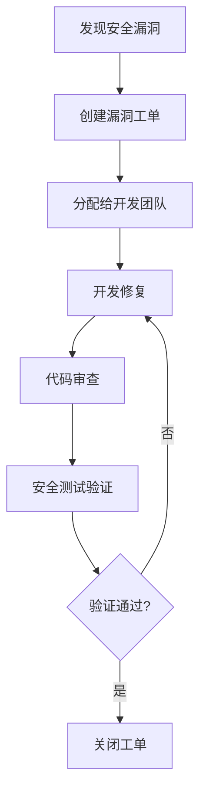

# 批次管理模块安全测试方案

## 1. 概述

### 1.1 测试目标
为批次管理模块设计全面的安全测试方案，识别和修复潜在安全漏洞，确保模块在开发、测试、生产环境中的安全性，符合企业级安全标准和合规要求。

### 1.2 测试范围
- **模块范围**: ERP批次管理服务（batch-management-service）
- **功能范围**: 批次创建、状态流转、查询、关联服务等核心功能
- **技术栈范围**: Java Spring Boot、MySQL、Redis、REST API
- **安全标准**: OWASP Top 10 2021、CWE/SANS Top 25、NIST安全框架

### 1.3 测试原则
1. **全面性**: 覆盖所有安全测试领域
2. **自动化**: 优先实现自动化安全测试
3. **持续性**: 集成到CI/CD流水线
4. **可度量**: 建立安全度量指标
5. **可追溯**: 安全测试结果可追溯

## 2. 安全测试范围设计

### 2.1 输入验证安全测试
#### 2.1.1 SQL注入测试
- **测试目标**: 验证所有数据库查询接口对SQL注入的防护能力
- **测试方法**: 
  - 使用OWASP ZAP进行自动化SQL注入扫描
  - 手动测试参数化查询和存储过程调用
  - 测试特殊字符和SQL关键字输入
- **测试用例**:
  ```sql
  1. 批次号参数: ' OR '1'='1
  2. 产品编码参数: '; DROP TABLE batch; --
  3. 日期参数: 2024-01-01' UNION SELECT username, password FROM users --
  ```
- **预期结果**: 所有SQL注入攻击应被拦截并返回安全错误

#### 2.1.2 XSS（跨站脚本）测试
- **测试目标**: 验证前端输入对XSS攻击的防护
- **测试方法**:
  - 反射型XSS测试：URL参数、表单输入
  - 存储型XSS测试：数据库存储数据
  - DOM型XSS测试：JavaScript执行
- **测试用例**:
  ```javascript
  1. <script>alert('XSS')</script>
  2. 
  3. javascript:alert('XSS')
  ```
- **预期结果**: 所有XSS攻击应被过滤或转义

#### 2.1.3 命令注入测试
- **测试目标**: 验证系统命令执行的安全性
- **测试方法**:
  - 测试文件上传功能
  - 测试系统命令调用接口
  - 测试外部程序调用
- **测试用例**:
  ```bash
  1. ; ls -la
  2. | cat /etc/passwd
  3. && rm -rf /
  ```
- **预期结果**: 命令注入攻击应被拦截

#### 2.1.4 路径遍历测试
- **测试目标**: 验证文件访问的安全性
- **测试方法**:
  - 测试文件下载接口
  - 测试文件上传接口
  - 测试模板文件加载
- **测试用例**:
  ```bash
  1. ../../../etc/passwd
  2. ..\..\..\windows\system32\config\SAM
  ```
- **预期结果**: 路径遍历攻击应被拦截

### 2.2 身份验证安全测试
#### 2.2.1 弱密码策略测试
- **测试目标**: 验证密码策略的强度
- **测试方法**:
  - 测试密码复杂度要求
  - 测试密码历史检查
  - 测试密码过期策略
- **测试用例**:
  ```bash
  1. 密码: 123456
  2. 密码: password
  3. 密码: admin123
  4. 密码: 与用户名相同
  ```
- **预期结果**: 弱密码应被拒绝

#### 2.2.2 会话管理测试
- **测试目标**: 验证会话管理的安全性
- **测试方法**:
  - 测试会话令牌安全性
  - 测试会话超时配置
  - 测试并发会话控制
- **测试用例**:
  ```bash
  1. 会话令牌预测攻击
  2. 会话固定攻击
  3. 会话劫持测试
  ```
- **预期结果**: 会话管理应安全可靠

#### 2.2.3 多因素认证测试
- **测试目标**: 验证多因素认证的实现
- **测试方法**:
  - 测试OTP验证逻辑
  - 测试生物识别集成
  - 测试硬件令牌支持
- **预期结果**: 多因素认证应正常工作

### 2.3 授权安全测试
#### 2.3.1 权限绕过测试
- **测试目标**: 验证权限控制的有效性
- **测试方法**:
  - 测试水平权限提升
  - 测试垂直权限提升
  - 测试功能权限绕过
- **测试用例**:
  ```bash
  1. 普通用户访问管理员接口
  2. 用户A访问用户B的数据
  3. 未授权访问敏感功能
  ```
- **预期结果**: 权限控制应严格有效

#### 2.3.2 访问控制测试
- **测试目标**: 验证访问控制策略
- **测试方法**:
  - 测试RBAC权限模型
  - 测试ABAC属性控制
  - 测试动态权限检查
- **预期结果**: 访问控制应正确实施

### 2.4 数据安全测试
#### 2.4.1 数据泄露测试
- **测试目标**: 验证敏感数据保护
- **测试方法**:
  - 测试API响应数据过滤
  - 测试日志敏感信息脱敏
  - 测试错误信息泄露
- **测试用例**:
  ```bash
  1. 查询批次信息是否泄露敏感字段
  2. 错误响应是否包含堆栈信息
  3. 日志是否记录敏感数据
  ```
- **预期结果**: 敏感数据应被保护

#### 2.4.2 加密强度测试
- **测试目标**: 验证加密算法的安全性
- **测试方法**:
  - 测试数据传输加密（TLS）
  - 测试数据存储加密
  - 测试密钥管理安全
- **预期结果**: 加密应使用安全算法

#### 2.4.3 敏感信息保护测试
- **测试目标**: 验证敏感信息处理
- **测试方法**:
  - 测试密码存储安全
  - 测试API密钥保护
  - 测试配置信息保护
- **预期结果**: 敏感信息应安全处理

### 2.5 API安全测试
#### 2.5.1 接口鉴权测试
- **测试目标**: 验证API接口鉴权
- **测试方法**:
  - 测试JWT令牌验证
  - 测试API密钥认证
  - 测试OAuth2授权
- **预期结果**: 接口鉴权应严格有效

#### 2.5.2 参数验证测试
- **测试目标**: 验证API参数安全性
- **测试方法**:
  - 测试参数类型验证
  - 测试参数范围验证
  - 测试参数格式验证
- **预期结果**: 参数验证应全面

#### 2.5.3 速率限制测试
- **测试目标**: 验证API速率限制
- **测试方法**:
  - 测试接口调用频率限制
  - 测试IP限制策略
  - 测试用户限制策略
- **预期结果**: 速率限制应有效

### 2.6 配置安全测试
#### 2.6.1 环境配置测试
- **测试目标**: 验证环境配置安全性
- **测试方法**:
  - 测试生产环境配置
  - 测试开发环境配置
  - 测试测试环境配置
- **预期结果**: 配置应安全合理

#### 2.6.2 密钥管理测试
- **测试目标**: 验证密钥管理安全
- **测试方法**:
  - 测试密钥存储安全
  - 测试密钥轮换策略
  - 测试密钥访问控制
- **预期结果**: 密钥应安全管理

#### 2.6.3 日志安全测试
- **测试目标**: 验证日志安全性
- **测试方法**:
  - 测试日志敏感信息脱敏
  - 测试日志访问控制
  - 测试日志存储安全
- **预期结果**: 日志应安全记录

### 2.7 第三方依赖安全测试
#### 2.7.1 SCA（软件成分分析）测试
- **测试目标**: 验证第三方依赖安全性
- **测试方法**:
  - 使用Dependency-Check扫描
  - 使用OWASP Dependency-Track
  - 使用Snyk安全扫描
- **预期结果**: 无已知高危漏洞

#### 2.7.2 漏洞库匹配测试
- **测试目标**: 验证依赖漏洞匹配
- **测试方法**:
  - CVE漏洞数据库匹配
  - NVD漏洞数据库匹配
  - 自定义漏洞库匹配
- **预期结果**: 及时修复已知漏洞

### 2.8 运行时安全测试
#### 2.8.1 DAST（动态应用安全测试）
- **测试目标**: 验证运行时应用安全
- **测试方法**:
  - 使用OWASP ZAP进行DAST扫描
  - 使用Burp Suite进行渗透测试
  - 使用Nessus进行漏洞扫描
- **预期结果**: 识别运行时安全漏洞

#### 2.8.2 渗透测试
- **测试目标**: 模拟真实攻击
- **测试方法**:
  - 黑盒渗透测试
  - 灰盒渗透测试
  - 白盒渗透测试
- **预期结果**: 发现潜在安全风险

## 3. 安全测试方法设计

### 3.1 静态应用安全测试（SAST）
#### 3.1.1 工具配置
```yaml
# SonarQube配置
sonar:
  projectKey: erp-batch-management
  sources: src/main/java
  exclusions: "**/*Test.java,**/test/**"
  rules: 
    - java:S3649  # SQL注入检测
    - java:S5131  # XSS检测
    - java:S2083  # 路径遍历
    - java:S2068  # 硬编码密码
```

#### 3.1.2 扫描策略
- **扫描频率**: 每次代码提交
- **扫描范围**: 全量代码扫描
- **质量门禁**: 安全热点必须为0
- **报告格式**: HTML/PDF/JSON

### 3.2 动态应用安全测试（DAST）
#### 3.2.1 工具配置
```yaml
# OWASP ZAP配置
zap:
  target: http://localhost:8080/batch-management
  context: 
    - login_url: /api/auth/login
    - logout_url: /api/auth/logout
  spider: 
    max_depth: 5
    max_children: 100
  scanner:
    policy: "Default Policy"
    strength: "MEDIUM"
```

#### 3.2.2 扫描策略
- **扫描类型**: 主动扫描+被动扫描
- **认证方式**: 表单认证+API认证
- **扫描深度**: 深度优先
- **报告格式**: HTML/XML/JSON

### 3.3 交互式应用安全测试（IAST）
#### 3.3.1 工具配置
```yaml
# Contrast Security配置
contrast:
  application: batch-management-service
  server: http://contrast-server:8080
  language: java
  framework: spring-boot
  instrumentation: auto
```

#### 3.3.2 测试策略
- **测试环境**: 集成测试环境
- **测试数据**: 真实业务数据
- **测试场景**: 用户操作流程
- **监控方式**: 运行时监控

### 3.4 软件成分分析（SCA）
#### 3.4.1 工具配置
```yaml
# Dependency-Check配置
dependency-check:
  format: HTML
  output: reports/dependency-check
  suppression: security/dependency-check-suppressions.xml
  failOnCVSS: 7.0
```

#### 3.4.2 扫描策略
- **扫描频率**: 每日自动扫描
- **漏洞等级**: CVSS评分≥7.0必须修复
- **忽略列表**: 白名单管理
- **通知机制**: 邮件/Slack通知

## 4. 安全测试工具设计

### 4.1 自动化安全扫描工具配置
#### 4.1.1 工具栈选择
```yaml
security_tools:
  sast:
    - name: SonarQube
      version: 9.9
      language: Java
    - name: Checkmarx
      version: 9.4
      language: Java
  dast:
    - name: OWASP ZAP
      version: 2.12
      type: Proxy
    - name: Burp Suite
      version: 2023.12
      type: Professional
  sca:
    - name: Dependency-Check
      version: 8.2
      language: Java
    - name: Snyk
      version: 1.1200
      language: Java
  iast:
    - name: Contrast Security
      version: 3.10
      language: Java
```

#### 4.1.2 集成配置
```yaml
# Jenkins流水线配置
pipeline:
  stages:
    - name: SAST
      tool: SonarQube
      script: mvn sonar:sonar
    - name: SCA
      tool: Dependency-Check
      script: mvn org.owasp:dependency-check-maven:check
    - name: DAST
      tool: OWASP ZAP
      script: zap-baseline.py -t http://localhost:8080
```

### 4.2 安全测试用例编写标准
#### 4.2.1 用例模板
```yaml
security_test_case:
  id: STC-001
  title: "SQL注入测试 - 批次查询接口"
  description: "测试批次查询接口对SQL注入攻击的防护能力"
  category: "输入验证"
  priority: "高"
  preconditions:
    - "系统已部署"
    - "测试用户已登录"
    - "批次数据已存在"
  test_steps:
    - "发送SQL注入payload到批次查询接口"
    - "观察系统响应"
  expected_result: "系统应返回安全错误，不应执行SQL注入"
  actual_result: ""
  status: "待执行"
  tools: ["OWASP ZAP", "Burp Suite"]
  references: ["OWASP Top 10 A03:2021"]
```

#### 4.2.2 用例分类
- **A01: 访问控制失效** - 10个测试用例
- **A02: 加密机制失效** - 8个测试用例
- **A03: 注入攻击** - 12个测试用例
- **A04: 不安全设计** - 6个测试用例
- **A05: 安全配置错误** - 8个测试用例
- **A06: 易受攻击组件** - 5个测试用例
- **A07: 身份验证失效** - 9个测试用例
- **A08: 软件和数据完整性失效** - 7个测试用例
- **A09: 安全日志和监控失效** - 6个测试用例
- **A10: 服务端请求伪造** - 4个测试用例

### 4.3 安全测试数据准备方案
#### 4.3.1 测试数据分类
```yaml
test_data:
  normal_data:
    - valid_batch_data: "批次正常数据"
    - valid_user_data: "用户正常数据"
  attack_data:
    - sql_injection: ["' OR '1'='1", "' UNION SELECT"]
    - xss_payloads: ["<script>alert()</script>", ""]
    - path_traversal: ["../../../etc/passwd", "..\\..\\..\\windows\\system32"]
    - command_injection: ["; ls -la", "| cat /etc/passwd"]
  edge_case_data:
    - very_long_input: "A" * 10000
    - special_characters: "!@#$%^&*()_+-=[]{}|;':\",./<>?"
    - unicode_characters: "测试数据🎯特殊字符"
```

#### 4.3.2 数据生成工具
```bash
# 使用Faker生成测试数据
mvn test -Dtest=SecurityTestDataGenerator

# 使用自定义脚本生成攻击数据
python scripts/generate_attack_payloads.py
```

### 4.4 安全测试环境搭建
#### 4.4.1 环境架构
```yaml
security_test_env:
  staging_env:
    url: https://staging-batch.example.com
    database: staging_db
    redis: staging_redis
  penetration_test_env:
    url: https://pentest-batch.example.com
    database: pentest_db
    redis: pentest_redis
  tools_env:
    zap: http://zap-server:8080
    sonarqube: http://sonarqube:9000
    dependency_check: http://dependency-check:8080
```

#### 4.4.2 环境配置
```docker
# Docker Compose for Security Testing
version: '3.8'
services:
  zap:
    image: owasp/zap2docker-stable
    ports:
      - "8080:8080"
    volumes:
      - ./zap:/zap/wrk
      
  sonarqube:
    image: sonarqube:9.9-community
    ports:
      - "9000:9000"
      
  dependency-check:
    image: owasp/dependency-check:8.2
    volumes:
      - ./reports:/report
```

## 5. 安全测试流程设计

### 5.1 安全测试集成到CI/CD流水线
#### 5.1.1 CI/CD流水线设计
```yaml
# GitLab CI配置
stages:
  - build
  - test
  - security
  - deploy

security_test:
  stage: security
  script:
    - echo "开始安全测试"
    # SAST扫描
    - mvn org.sonarsource.scanner.maven:sonar-maven-plugin:sonar
    # SCA扫描
    - mvn org.owasp:dependency-check-maven:check
    # DAST扫描（如果环境可用）
    - if [ "$CI_ENVIRONMENT_NAME" == "staging" ]; then
        python scripts/run_zap_scan.py;
      fi
  artifacts:
    paths:
      - target/sonar/report.pdf
      - target/dependency-check-report.html
  rules:
    - if: $CI_COMMIT_BRANCH == "main" || $CI_COMMIT_BRANCH == "develop"
```

#### 5.1.2 安全门禁配置
```yaml
# 安全门禁规则
security_gates:
  sast:
    max_critical: 0
    max_high: 0
    max_medium: 5
  sca:
    max_critical: 0
    max_high: 1
    max_medium: 3
  dast:
    max_high: 0
    max_medium: 2
```

### 5.2 安全测试结果分析和报告机制
#### 5.2.1 报告模板
```yaml
security_report:
  executive_summary:
    total_findings: 0
    critical: 0
    high: 0
    medium: 0
    low: 0
    info: 0
  findings_by_category:
    injection: 0
    broken_auth: 0
    sensitive_data: 0
    xxe: 0
    broken_access: 0
    security_misconfig: 0
    xss: 0
    insecure_deserialization: 0
    vulnerable_components: 0
    insufficient_logging: 0
  recommendations:
    immediate: []
    short_term: []
    long_term: []
```

#### 5.2.2 报告生成流程
1. **数据收集**: 收集各工具扫描结果
2. **数据聚合**: 合并重复发现
3. **风险评估**: 评估风险等级
4. **报告生成**: 生成统一报告
5. **通知发送**: 发送报告给相关人员

### 5.3 安全漏洞修复验证流程
#### 5.3.1 修复验证流程


#### 5.3.2 验证标准
- **高危漏洞**: 必须100%修复
- **中危漏洞**: 修复率≥90%
- **低危漏洞**: 修复率≥80%
- **信息类漏洞**: 修复率≥70%

### 5.4 安全测试持续改进机制
#### 5.4.1 改进流程
1. **月度安全评审会议**
2. **季度安全测试优化**
3. **年度安全策略更新**

#### 5.4.2 度量指标
```yaml
security_metrics:
  test_coverage: "85%"
  vulnerability_density: "0.5/千行代码"
  mean_time_to_remediate: "7天"
  false_positive_rate: "15%"
  security_test_frequency: "每日"
```

## 6. 实施计划

### 6.1 阶段一：基础安全测试（第1-2周）
- ✅ 完成安全测试方案设计
- ⬜ 配置SAST工具（SonarQube）
- ⬜ 配置SCA工具（Dependency-Check）
- ⬜ 编写基础安全测试用例（20个）

### 6.2 阶段二：进阶安全测试（第3-4周）
- ⬜ 配置DAST工具（OWASP ZAP）
- ⬜ 编写进阶安全测试用例（30个）
- ⬜ 集成到CI/CD流水线
- ⬜ 建立安全门禁

### 6.3 阶段三：全面安全测试（第5-6周）
- ⬜ 配置IAST工具（可选）
- ⬜ 执行全面安全测试
- ⬜ 生成安全测试报告
- ⬜ 建立持续改进机制

## 7. 风险评估

### 7.1 技术风险
- **工具兼容性风险**: 安全工具与现有技术栈兼容性问题
- **误报率风险**: 安全工具可能产生大量误报
- **性能影响风险**: 安全扫描可能影响构建性能

### 7.2 流程风险
- **团队接受度风险**: 开发团队可能抵触安全测试
- **修复延迟风险**: 安全漏洞修复可能延迟
- **资源不足风险**: 安全测试资源不足

### 7.3 缓解措施
- **逐步实施**: 分阶段实施安全测试
- **培训教育**: 对团队进行安全培训
- **自动化工具**: 使用自动化工具减少人工工作

## 8. 成功标准

### 8.1 量化指标
- 安全测试覆盖率 ≥ 85%
- 高危漏洞发现率 ≥ 95%
- 漏洞平均修复时间 ≤ 7天
- 安全测试自动化率 ≥ 80%

### 8.2 质量指标
- 安全测试用例通过率 ≥ 90%
- 安全门禁通过率 ≥ 95%
- 安全审计通过率 ≥ 100%
- 合规性检查通过率 ≥ 100%

## 9. 附录

### 9.1 参考标准
- OWASP Top 10 2021
- CWE/SANS Top 25
- NIST Cybersecurity Framework
- ISO/IEC 27001

### 9.2 工具文档
- [SonarQube官方文档](https://docs.sonarqube.org/)
- [OWASP ZAP用户指南](https://www.zaproxy.org/docs/)
- [Dependency-Check文档](https://jeremylong.github.io/DependencyCheck/)
- [Burp Suite文档](https://portswigger.net/burp/documentation)

### 9.3 模板文件
- 安全测试用例模板（见附件）
- 安全漏洞报告模板（见附件）
- 安全测试计划模板（见附件）

---

**文档版本**: 1.0  
**创建日期**: 2026-05-01  
**创建人**: test-agent-1  
**审核人**: test-agent-2  
**批准人**: 项目经理  
**下次评审日期**: 2026-06-01