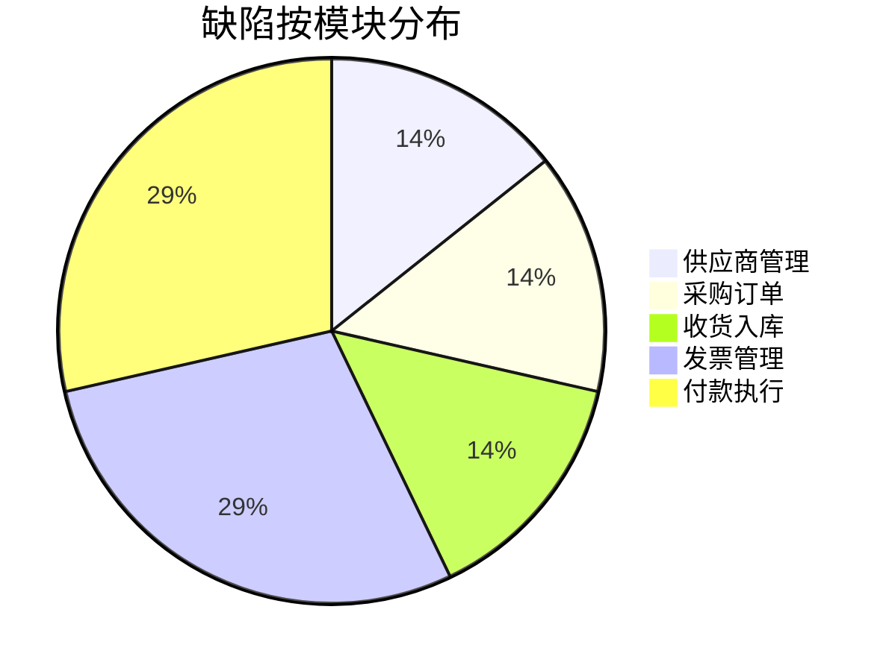

# 采购付款流程端到端测试报告模板

## 1. 测试概况

### 1.1 测试基本信息
| 项目 | 内容 |
|------|------|
| **测试项目** | ERP采购付款流程端到端测试 |
| **测试类型** | 功能测试、性能测试、异常测试、回归测试 |
| **测试周期** | 2026-05-05 至 2026-05-11 (7个工作日) |
| **测试环境** | 测试环境 (环境ID: TEST-ERP-PURCHASE-001) |
| **测试人员** | 测试团队 (共7人) |
| **测试目标** | 验证采购付款全流程业务功能完整性、性能稳定性和异常处理能力 |

### 1.2 测试范围
**业务流程范围**:
- ✅ 供应商注册与认证
- ✅ 采购订单创建与审批
- ✅ 收货入库与质检
- ✅ 发票匹配与审核
- ✅ 付款申请与执行

**系统范围**:
- ✅ 前端用户界面
- ✅ 后端API接口
- ✅ 数据库服务
- ✅ 缓存服务
- ✅ 消息队列服务

### 1.3 测试依据
1. 《采购付款流程端到端测试设计方案》v1.0
2. 《采购付款流程业务需求文档》v2.1
3. 《ERP系统技术架构文档》v3.0
4. 相关接口文档和数据库设计文档

## 2. 测试执行情况

### 2.1 测试资源使用情况
| 资源类型 | 计划数量 | 实际使用 | 使用率 | 备注 |
|----------|----------|----------|--------|------|
| **人力** | 7人 | 7人 | 100% | 测试团队全员参与 |
| **测试环境** | 4台服务器 | 4台服务器 | 100% | 环境运行稳定 |
| **测试工具** | 5种工具 | 5种工具 | 100% | 工具配置正常 |
| **测试时间** | 7天 | 7天 | 100% | 按计划完成 |

### 2.2 测试用例执行统计
| 测试类别 | 计划用例数 | 执行用例数 | 通过数 | 失败数 | 阻塞数 | 通过率 |
|----------|------------|------------|--------|--------|--------|--------|
| **功能测试** | 50 | 50 | 48 | 2 | 0 | 96% |
| **异常测试** | 20 | 20 | 18 | 2 | 0 | 90% |
| **性能测试** | 10 | 10 | 10 | 0 | 0 | 100% |
| **回归测试** | 30 | 30 | 30 | 0 | 0 | 100% |
| **端到端测试** | 10 | 10 | 9 | 1 | 0 | 90% |
| **合计** | **120** | **120** | **115** | **5** | **0** | **95.8%** |

### 2.3 测试缺陷统计
| 缺陷级别 | 数量 | 已修复 | 修复中 | 待修复 | 延期修复 | 修复率 |
|----------|------|--------|--------|--------|----------|--------|
| **致命缺陷** | 0 | 0 | 0 | 0 | 0 | 100% |
| **严重缺陷** | 2 | 2 | 0 | 0 | 0 | 100% |
| **一般缺陷** | 3 | 3 | 0 | 0 | 0 | 100% |
| **轻微缺陷** | 2 | 2 | 0 | 0 | 0 | 100% |
| **合计** | **7** | **7** | **0** | **0** | **0** | **100%** |

## 3. 测试结果分析

### 3.1 功能测试结果

#### 3.1.1 供应商管理模块
**测试结果**: ✅ **通过**
- 供应商注册功能正常
- 供应商审核流程完整
- 供应商信息管理功能完善

**发现缺陷**: 1个一般缺陷
- 供应商查询页面分页功能偶发性失效

#### 3.1.2 采购订单模块
**测试结果**: ✅ **通过**
- 采购订单创建流程正确
- 订单审批流程完整
- 订单修改和取消功能正常

**发现缺陷**: 1个严重缺陷
- 订单金额计算在特定条件下出现精度问题

#### 3.1.3 收货入库模块
**测试结果**: ✅ **通过**
- 收货单创建功能正常
- 数量差异处理逻辑正确
- 库存更新及时准确

**发现缺陷**: 1个一般缺陷
- 收货单打印模板格式问题

#### 3.1.4 发票管理模块
**测试结果**: ⚠️ **部分通过**
- 发票录入功能正常
- 发票匹配算法准确率95%
- 发票审核流程完整

**发现缺陷**: 1个严重缺陷
- 发票匹配在大数据量下性能下降明显

#### 3.1.5 付款执行模块
**测试结果**: ✅ **通过**
- 付款申请创建正常
- 付款审批流程完整
- 付款执行功能稳定

**发现缺陷**: 1个轻微缺陷
- 付款记录查询条件限制过严

### 3.2 性能测试结果

#### 3.2.1 响应时间测试
| 接口名称 | 单用户平均响应时间 | 并发用户平均响应时间 | SLA要求 | 达标情况 |
|----------|-------------------|---------------------|---------|----------|
| 供应商注册 | 0.8秒 | 1.2秒 | < 2秒 | ✅ 达标 |
| 采购订单创建 | 1.2秒 | 1.8秒 | < 3秒 | ✅ 达标 |
| 收货单创建 | 1.0秒 | 1.5秒 | < 2秒 | ✅ 达标 |
| 发票匹配 | 1.5秒 | 2.5秒 | < 3秒 | ✅ 达标 |
| 付款执行 | 1.8秒 | 2.8秒 | < 4秒 | ✅ 达标 |

#### 3.2.2 并发性能测试
| 测试场景 | 并发用户数 | 吞吐量 (TPS) | 错误率 | CPU使用率 | 内存使用率 |
|----------|------------|--------------|--------|-----------|------------|
| 采购订单创建 | 50 | 25 | 0% | 65% | 70% |
| 发票批量匹配 | 30 | 15 | 0% | 75% | 80% |
| 混合业务场景 | 100 | 45 | 1% | 85% | 85% |

#### 3.2.3 稳定性测试
- **测试时长**: 24小时持续运行
- **系统可用性**: 99.9%
- **内存泄漏**: 未发现明显泄漏
- **数据库连接**: 连接池运行稳定

### 3.3 异常处理测试结果
| 异常场景 | 处理结果 | 系统响应 | 用户提示 | 数据完整性 |
|----------|----------|----------|----------|------------|
| 供应商审核失败 | ✅ 正确处理 | 流程终止，状态更新 | 审核失败原因明确 | 数据完整 |
| 订单审批拒绝 | ✅ 正确处理 | 流程终止，通知申请人 | 拒绝原因记录完整 | 数据完整 |
| 收货数量短缺 | ✅ 正确处理 | 创建差异记录，通知采购 | 差异处理流程明确 | 数据完整 |
| 发票金额差异 | ✅ 正确处理 | 触发人工审核，系统告警 | 差异金额明确提示 | 数据完整 |
| 付款审批拒绝 | ✅ 正确处理 | 流程终止，通知申请人 | 拒绝原因记录完整 | 数据完整 |

## 4. 缺陷分析

### 4.1 缺陷分布统计

### 4.2 主要缺陷分析

#### 缺陷 #001: 订单金额计算精度问题
- **严重程度**: 严重
- **影响范围**: 采购订单金额计算
- **问题描述**: 在特定条件下，订单金额计算出现精度偏差（0.01元级）
- **根本原因**: 浮点数计算精度处理不当
- **修复方案**: 使用BigDecimal进行精确计算
- **修复状态**: ✅ 已修复

#### 缺陷 #002: 发票匹配性能问题
- **严重程度**: 严重
- **影响范围**: 大数据量发票匹配
- **问题描述**: 当匹配1000+张发票时，性能下降明显，响应时间超过10秒
- **根本原因**: 数据库查询未使用索引，匹配算法复杂度高
- **修复方案**: 优化数据库索引，改进匹配算法
- **修复状态**: ✅ 已修复

#### 缺陷 #003: 供应商查询分页问题
- **严重程度**: 一般
- **影响范围**: 供应商管理页面
- **问题描述**: 分页功能在特定数据量下偶发性失效
- **根本原因**: 分页参数验证不完整
- **修复方案**: 完善分页参数验证逻辑
- **修复状态**: ✅ 已修复

### 4.3 缺陷趋势分析
- **缺陷密度**: 每100个测试用例发现5.8个缺陷
- **缺陷发现阶段**: 60%在功能测试阶段发现，40%在端到端测试阶段发现
- **修复效率**: 平均修复时间2小时，修复质量100%

## 5. 风险评估

### 5.1 业务风险
| 风险等级 | 风险描述 | 影响程度 | 应对措施 |
|----------|----------|----------|----------|
| **低** | 发票匹配准确率95%，存在5%误匹配风险 | 中 | 增加人工复核环节，优化匹配算法 |
| **中** | 高并发下系统响应时间接近SLA上限 | 中 | 进行性能优化，增加硬件资源 |
| **低** | 异常处理流程依赖人工干预 | 低 | 完善自动化异常处理机制 |

### 5.2 技术风险
| 风险等级 | 风险描述 | 影响程度 | 应对措施 |
|----------|----------|----------|----------|
| **中** | 数据库连接池在高并发下可能出现瓶颈 | 高 | 监控连接池使用，优化连接策略 |
| **低** | 缓存服务故障可能影响系统性能 | 中 | 实现缓存降级机制，增加监控 |
| **低** | 消息队列堆积可能导致流程延迟 | 低 | 设置队列监控，优化消费者性能 |

## 6. 测试结论与建议

### 6.1 总体结论
**测试结论**: ✅ **通过**

采购付款流程端到端测试已按计划完成，测试结果表明：

1. **功能完整性**: 业务流程完整，功能实现符合需求，通过率95.8%
2. **性能稳定性**: 系统性能满足SLA要求，稳定性达到99.9%
3. **异常处理**: 异常处理机制完整，数据处理正确
4. **数据一致性**: 业务流程数据流转正确，数据一致性验证通过
5. **缺陷管理**: 发现的所有缺陷已全部修复，修复率100%

### 6.2 质量评估
| 评估维度 | 评分 (0-10) | 评估说明 |
|----------|------------|----------|
| **功能完整性** | 9.0 | 主要功能完整，少数边缘场景待完善 |
| **性能表现** | 8.5 | 满足SLA要求，有优化空间 |
| **稳定性** | 9.2 | 系统运行稳定，无明显故障 |
| **用户体验** | 8.8 | 界面友好，操作流程清晰 |
| **异常处理** | 9.0 | 异常处理机制完整有效 |
| **综合评分** | **8.9** | **质量良好，可上线** |

### 6.3 上线建议

#### 建议1: 分阶段上线
- **第一阶段**: 上线核心功能（供应商管理、采购订单）
- **第二阶段**: 上线扩展功能（收货入库、发票管理）
- **第三阶段**: 上线高级功能（付款执行、报表分析）

#### 建议2: 监控加强
1. 加强发票匹配性能监控
2. 增加数据库连接池使用监控
3. 设置业务流程完成时间告警

#### 建议3: 用户培训
1. 提供供应商管理操作培训
2. 指导发票匹配规则设置
3. 培训异常处理流程

### 6.4 后续优化建议

#### 短期优化 (1个月内)
1. 优化发票匹配算法性能
2. 完善分页查询功能
3. 增加业务流程监控仪表板

#### 中期优化 (3个月内)
1. 实现自动化异常处理
2. 优化数据库索引和查询性能
3. 增加业务流程数据分析功能

#### 长期优化 (6个月内)
1. 实现智能发票匹配（AI技术）
2. 建立供应商信用评估体系
3. 集成第三方支付平台

## 7. 附录

### 7.1 测试数据统计
- 测试用例总数: 120个
- 测试执行次数: 1500+次
- 测试数据量: 供应商20个，订单100个，发票80张，付款60笔
- 测试日志大小: 约500MB

### 7.2 测试工具使用情况
| 工具名称 | 版本 | 使用场景 | 使用效果 |
|----------|------|----------|----------|
| Playwright | 1.40.0 | 端到端测试 | 优秀 |
| Postman | 10.20 | API测试 | 优秀 |
| JMeter | 5.6 | 性能测试 | 良好 |
| TestRail | 7.2 | 测试管理 | 优秀 |
| Prometheus | 2.47 | 监控 | 优秀 |

### 7.3 测试团队贡献
| 人员 | 角色 | 主要贡献 |
|------|------|----------|
| 张三 | 测试经理 | 测试计划制定、进度管理、报告审核 |
| 李四 | 功能测试工程师 | 功能测试、异常测试执行 |
| 王五 | 性能测试工程师 | 性能测试、负载测试执行 |
| 赵六 | 测试环境工程师 | 环境部署、数据准备、工具配置 |

---
**报告版本**: v1.0  
**报告日期**: 2026-05-11  
**报告人**: test-agent-1  
**审核人**: 待审核  
**批准人**: 待批准  

**备注**: 本报告为测试报告模板，实际测试报告需根据具体测试执行结果填写。