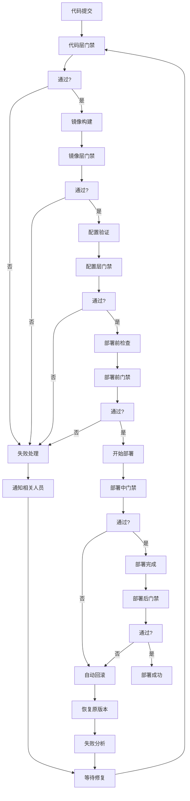

# Sprint 27+1 测试环境部署质量门禁检查清单

## 概述

本文档提供了Sprint 27+1测试环境部署的完整质量门禁检查清单，覆盖代码层、镜像层、配置层、部署前、部署中、部署后六个阶段。每个检查项包含通过标准、检查方法、自动脚本和失败处理建议。

## 使用方法

### 执行方式
1. **自动化执行**: 使用提供的Python脚本自动检查（推荐）
   ```bash
   python scripts/code-quality-check.py
   python scripts/image-security-scan.py
   ```

2. **手动执行**: 按照检查清单逐项验证
3. **CI/CD集成**: 将脚本集成到GitLab CI/CD流水线

### 检查结果处理
- ✅ **通过**: 所有检查项符合通过标准
- ⚠️ **警告**: 非关键检查项不达标，可继续但需改进
- ❌ **失败**: 关键检查项不达标，必须修复后才能继续

## 代码层质量门禁检查清单

### 1.1 代码质量检查
| 检查项 | 通过标准 | 检查工具 | 自动脚本 | 失败级别 |
|--------|----------|----------|----------|----------|
| 代码规范检查 | 无严重违规（ESLint≥80分） | ESLint | `code-quality-check.py` | P2 |
| TypeScript类型检查 | 无类型错误 | tsc | `type-check.py` | P1 |
| Python代码检查 | PEP 8合规 | flake8 | `python-lint.py` | P2 |
| 单元测试覆盖率 | ≥70% | Jest/pytest | `test-coverage-check.py` | P2 |
| 代码复杂度检查 | 方法圈复杂度≤15 | SonarQube | `complexity-check.py` | P2 |

### 1.2 代码安全检查
| 检查项 | 通过标准 | 检查工具 | 自动脚本 | 失败级别 |
|--------|----------|----------|----------|----------|
| 依赖安全扫描 | 无高危漏洞（CVE评分≥7） | Snyk | `dependency-security-scan.py` | P1 |
| 硬编码密钥检测 | 无硬编码密码/密钥 | GitGuardian | `hardcoded-secrets-check.py` | P0 |
| SQL注入风险检查 | 无高风险SQL注入点 | SQLMap | `sql-injection-check.py` | P0 |
| XSS攻击风险检查 | 无高风险XSS漏洞 | OWASP ZAP | `xss-vulnerability-check.py` | P0 |

## 镜像层质量门禁检查清单

### 2.1 镜像安全扫描
| 检查项 | 通过标准 | 检查工具 | 自动脚本 | 失败级别 |
|--------|----------|----------|----------|----------|
| 镜像漏洞扫描 | 无高危漏洞（CVE评分≥7） | Trivy | `image-security-scan.py` | P0 |
| 镜像大小检查 | 基础镜像≤500MB | Docker CLI | `image-size-check.py` | P3 |
| 不必要包清理 | 无测试包、调试工具 | Dive | `image-layer-check.py` | P2 |
| 用户权限检查 | 不以root用户运行 | Dockerfile分析 | `user-permission-check.py` | P1 |

### 2.2 镜像合规检查
| 检查项 | 通过标准 | 检查工具 | 自动脚本 | 失败级别 |
|--------|----------|----------|----------|----------|
| 许可证合规检查 | 开源许可证符合公司政策 | FOSSA | `license-compliance-check.py` | P2 |
| 出口管制检查 | 无受控软件组件 | BlackDuck | `export-control-check.py` | P1 |
| 供应链安全检查 | 所有依赖可追溯 | Syft | `sbom-check.py` | P2 |
| 镜像签名验证 | 镜像已签名 | Notary | `image-signature-check.py` | P1 |

## 配置层质量门禁检查清单

### 3.1 配置文件语法检查
| 检查项 | 通过标准 | 检查工具 | 自动脚本 | 失败级别 |
|--------|----------|----------|----------|----------|
| YAML语法检查 | 语法正确，缩进规范 | yamllint | `yaml-syntax-check.py` | P1 |
| JSON语法检查 | 语法正确，格式规范 | jq | `json-syntax-check.py` | P1 |
| Dockerfile检查 | 语法正确，遵循最佳实践 | hadolint | `dockerfile-check.py` | P1 |
| 环境变量检查 | 无缺失必需环境变量 | 定制脚本 | `env-var-check.py` | P1 |

### 3.2 配置一致性检查
| 检查项 | 通过标准 | 检查工具 | 自动脚本 | 失败级别 |
|--------|----------|----------|----------|----------|
| 多环境配置一致 | 核心配置项一致 | diff工具 | `config-consistency-check.py` | P2 |
| 版本配置匹配 | 软件版本与配置匹配 | 版本提取脚本 | `version-matching-check.py` | P1 |
| 依赖配置完整 | 所有依赖配置项存在 | 模板比对脚本 | `dependency-config-check.py` | P1 |
| 安全配置合规 | 安全配置项符合基准 | OpenSCAP | `security-config-check.py` | P1 |

## 部署前质量门禁检查清单

### 4.1 目标环境验证
| 检查项 | 通过标准 | 检查工具 | 自动脚本 | 失败级别 |
|--------|----------|----------|----------|----------|
| CPU资源检查 | CPU≥2核 | Prometheus | `cpu-resource-check.py` | P1 |
| 内存资源检查 | 内存≥4GB | Prometheus | `memory-resource-check.py` | P1 |
| 存储资源检查 | 存储≥20GB | Prometheus | `storage-resource-check.py` | P1 |
| 网络连通性检查 | 所有依赖服务可达 | curl/ping | `network-connectivity-check.py` | P1 |
| 端口可用性检查 | 所需端口未被占用 | netstat/lsof | `port-availability-check.py` | P1 |
| 权限验证检查 | 执行用户有足够权限 | 权限检查脚本 | `permission-check.py` | P1 |

### 4.2 依赖服务验证
| 检查项 | 通过标准 | 检查工具 | 自动脚本 | 失败级别 |
|--------|----------|----------|----------|----------|
| PostgreSQL检查 | PostgreSQL可用，版本≥12 | pg_isready | `postgresql-check.py` | P1 |
| Redis检查 | Redis可用，内存充足 | redis-cli | `redis-check.py` | P1 |
| Kafka检查 | Kafka可用，主题存在 | kafkacat | `kafka-check.py` | P1 |
| MinIO检查 | MinIO可用，桶存在 | mc | `minio-check.py` | P1 |
| Prometheus检查 | Prometheus可用 | HTTP API | `prometheus-check.py` | P2 |
| Grafana检查 | Grafana可用 | HTTP API | `grafana-check.py` | P2 |

## 部署中质量门禁检查清单

### 5.1 变更影响评估
| 检查项 | 通过标准 | 检查工具 | 自动脚本 | 失败级别 |
|--------|----------|----------|----------|----------|
| 变更范围评估 | 变更影响可接受 | 代码diff分析 | `change-impact-assessment.py` | P2 |
| 数据变更评估 | 无破坏性数据变更 | SQL脚本分析 | `data-change-assessment.py` | P1 |
| 回滚可行性检查 | 支持5分钟内回滚 | 回滚脚本验证 | `rollback-feasibility-check.py` | P1 |
| 影响服务数检查 | 受影响服务≤3 | 依赖图分析 | `affected-services-check.py` | P2 |

### 5.2 部署过程监控
| 检查项 | 通过标准 | 检查工具 | 自动脚本 | 失败级别 |
|--------|----------|----------|----------|----------|
| 部署时间监控 | ≤10分钟 | Prometheus | `deployment-time-monitor.py` | P2 |
| CPU使用监控 | ≤80%峰值 | cAdvisor | `cpu-usage-monitor.py` | P2 |
| 内存使用监控 | ≤85%峰值 | cAdvisor | `memory-usage-monitor.py` | P2 |
| 部署错误率监控 | ≤1%错误率 | 日志分析 | `deployment-error-rate-monitor.py` | P1 |
| 服务启动时间监控 | ≤3分钟/服务 | 健康检查 | `service-startup-time-monitor.py` | P2 |

## 部署后质量门禁检查清单

### 6.1 服务健康验证
| 检查项 | 通过标准 | 检查工具 | 自动脚本 | 失败级别 |
|--------|----------|----------|----------|----------|
| 服务状态检查 | 所有服务状态为running | docker-compose | `service-status-check.py` | P1 |
| 健康检查端点 | 所有健康检查通过 | HTTP请求 | `health-check-endpoint.py` | P1 |
| 端口连通性检查 | 所有服务端口可访问 | telnet/curl | `port-connectivity-check.py` | P1 |
| 服务间通信检查 | 服务间RPC调用正常 | 集成测试 | `inter-service-communication-check.py` | P2 |

### 6.2 功能验证
| 检查项 | 通过标准 | 检查工具 | 自动脚本 | 失败级别 |
|--------|----------|----------|----------|----------|
| 核心功能验证 | 关键业务功能正常 | 自动化测试 | `core-functionality-test.py` | P1 |
| API接口验证 | 主要API接口返回正常 | API测试 | `api-interface-test.py` | P1 |
| 数据一致性检查 | 数据库数据完整正确 | 数据校验 | `data-consistency-check.py` | P1 |
| 用户认证验证 | 认证授权功能正常 | 认证测试 | `authentication-test.py` | P1 |

### 6.3 性能基线验证
| 检查项 | 通过标准 | 检查工具 | 自动脚本 | 失败级别 |
|--------|----------|----------|----------|----------|
| API响应时间 | P95≤500ms | Prometheus | `api-response-time-check.py` | P2 |
| 服务启动时间 | ≤120秒 | 部署日志 | `service-startup-time-check.py` | P2 |
| 内存使用检查 | ≤配置限制的80% | cAdvisor | `memory-usage-check.py` | P2 |
| 磁盘IO检查 | 读写延迟≤50ms | node-exporter | `disk-io-check.py` | P2 |

## 门禁执行流程图



## 门禁失败处理指南

### 不同级别的处理策略

#### P0（严重）门禁失败处理
**典型失败**: 安全漏洞、服务不可用、数据丢失风险  
**处理流程**:
1. 立即停止部署流程
2. 自动触发告警通知所有相关人员
3. 创建紧急故障单（Jira/Sentry）
4. 安全团队立即介入分析
5. 部署操作锁定，直到问题解决

#### P1（高）门禁失败处理
**典型失败**: 核心功能异常、性能不达标、配置错误  
**处理流程**:
1. 暂停部署流程
2. 通知开发团队负责人和测试负责人
3. 需要审批才能继续（审批人：技术主管）
4. 记录失败原因和改进建议
5. 创建改进任务

#### P2（中）门禁失败处理
**典型失败**: 代码质量不达标、配置不规范、建议性改进  
**处理流程**:
1. 记录警告但允许继续
2. 通知开发人员
3. 创建技术债务任务
4. 在下个Sprint优先处理
5. 跟踪改进情况

#### P3（低）门禁失败处理
**典型失败**: 优化建议、非关键改进  
**处理流程**:
1. 记录建议但不阻塞
2. 添加到改进列表
3. 定期评审处理

## 门禁自动化脚本使用指南

### 脚本目录结构
```
scripts/
├── code-quality/
│   ├── code-quality-check.py
│   ├── type-check.py
│   └── test-coverage-check.py
├── image-security/
│   ├── image-security-scan.py
│   └── image-size-check.py
├── configuration/
│   ├── yaml-syntax-check.py
│   └── config-consistency-check.py
├── pre-deployment/
│   ├── environment-validator.py
│   └── dependency-checker.py
├── deployment/
│   ├── deployment-monitor.py
│   └── change-impact-assessment.py
└── post-deployment/
    ├── service-health-check.py
    └── performance-baseline-check.py
```

### 脚本执行示例
```bash
# 执行全部门禁检查
python scripts/run-all-quality-gates.py --environment sprint27-plus1

# 执行特定门禁检查
python scripts/code-quality/code-quality-check.py --project backend
python scripts/image-security/image-security-scan.py --image myapp:latest

# 生成门禁报告
python scripts/generate-quality-report.py --output report.json
```

### CI/CD集成示例
```yaml
# GitLab CI/CD配置
quality-gates:
  stage: quality
  script:
    - python scripts/code-quality/code-quality-check.py
    - python scripts/image-security/image-security-scan.py
    - python scripts/configuration/yaml-syntax-check.py
  artifacts:
    paths:
      - quality-gates-report.json
    reports:
      junit: quality-gates-report.xml
```

## 门禁监控和报告

### 监控指标
| 监控指标 | 监控方式 | 告警阈值 | 数据源 |
|----------|----------|----------|--------|
| 门禁通过率 | 实时监控 | <95% | Prometheus |
| 平均检查时间 | 实时监控 | >300秒 | Prometheus |
| 失败原因分布 | 统计分析 | 按原因分类 | Elasticsearch |
| 趋势分析 | 历史对比 | 环比下降10% | Grafana |

### 报告模板
每次门禁执行生成以下报告：
1. **摘要报告**: 通过率、失败数、执行时间
2. **详细报告**: 每个检查项的详细结果
3. **趋势报告**: 历史对比和趋势分析
4. **改进建议**: 失败项的改进建议

## 附录

### A. 门禁阈值配置
可根据项目实际情况调整门禁阈值：
```json
{
  "code_coverage_threshold": 70,
  "security_vulnerability_level": "HIGH",
  "api_response_time_p95": 500,
  "memory_usage_percentage": 80
}
```

### B. 环境特定配置
不同环境的门禁配置可能不同：
- **开发环境**: 较宽松的门禁，便于快速迭代
- **测试环境**: 严格的门禁，确保环境质量
- **生产环境**: 最严格的门禁，确保稳定性

### C. 常见问题解决
1. **门禁检查超时**: 增加超时配置或优化检查脚本
2. **假阳性结果**: 调整阈值或排除特定检查项
3. **工具依赖问题**: 确保所有工具版本正确安装
4. **网络连接问题**: 配置代理或调整网络策略

---

**版本**: 1.0.0  
**创建日期**: 2026-05-01  
**维护团队**: QA-Lead (qa-lead)  
**更新频率**: 每两周评审一次  
**生效环境**: Sprint 27+1测试环境  
**适用范围**: 所有部署到测试环境的应用