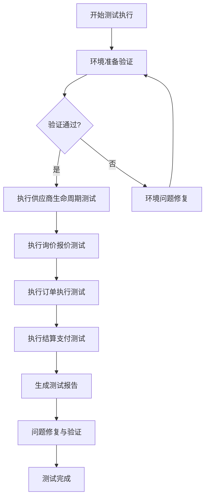

# 供应商门户端到端测试执行指南

**版本**: 1.0.0
**生效日期**: 2026-05-01
**适用范围**: 测试执行团队、自动化测试工程师
**关联文档**: supplier-portal-e2e-test-plan.md

## 🎯 测试执行概述

### 执行目标
本指南提供详细的测试执行步骤、环境配置方法和问题排查指南，确保测试团队能够高效、准确地执行供应商门户端到端测试。

### 适用场景
1. **新版本发布前验收测试**
2. **回归测试执行**
3. **自动化测试脚本部署**
4. **性能和安全测试执行**

## 🔧 测试环境准备

### 环境要求
| 环境组件 | 最低要求 | 推荐配置 | 说明 |
|----------|----------|----------|------|
| 测试服务器 | 4核CPU, 8GB内存 | 8核CPU, 16GB内存 | 独立测试环境 |
| 数据库 | MySQL 8.0+, 100GB存储 | MySQL 8.0+, 200GB存储 | 支持测试数据 |
| 中间件 | Redis 6.0+, RabbitMQ | Redis 7.0+, Kafka | 消息队列缓存 |
| 网络 | 100Mbps带宽 | 1Gbps带宽 | 稳定网络连接 |

### 环境搭建步骤
1. **基础环境部署**
   ```bash
   # 1. 克隆测试代码库
   git clone https://github.com/ai-ready/supplier-portal-e2e.git
   cd supplier-portal-e2e
   
   # 2. 安装依赖包
   pip install -r requirements.txt
   
   # 3. 配置环境变量
   cp .env.example .env
   # 编辑.env文件配置数据库、API端点等信息
   ```

2. **测试数据准备**
   ```bash
   # 运行测试数据生成脚本
   python scripts/generate_test_data.py \
     --supplier-count 100 \
     --order-count 1000 \
     --product-count 500
   ```

3. **服务启动与验证**
   ```bash
   # 启动相关服务
   docker-compose up -d
   
   # 验证服务状态
   python scripts/health_check.py --all
   ```

### 环境验证检查清单
- [ ] 数据库连接正常
- [ ] API服务可访问
- [ ] 消息队列服务正常
- [ ] 缓存服务正常
- [ ] 测试用户账号可用
- [ ] 测试数据加载完成

## 📋 测试执行流程

### 手动测试执行流程


### 测试用例执行优先级
| 优先级 | 测试场景 | 执行顺序 | 重要性 |
|--------|----------|----------|--------|
| P0 | 供应商注册审核流程 | 1 | 核心业务流程 |
| P0 | 询价报价流程 | 2 | 核心业务交易 |
| P1 | 订单创建与确认 | 3 | 关键业务操作 |
| P1 | 发票与付款流程 | 4 | 财务关键流程 |
| P2 | 性能测试场景 | 5 | 非功能性需求 |
| P2 | 安全测试场景 | 6 | 安全合规要求 |

## 🤖 自动化测试执行

### 自动化脚本结构
```
supplier-portal-e2e/
├── tests/
│   ├── run_all_tests.py          # 全量测试执行入口
│   ├── run_smoke_tests.py        # 冒烟测试执行
│   └── run_performance_tests.py  # 性能测试执行
├── scripts/
│   ├── setup_test_env.py         # 环境准备脚本
│   ├── cleanup_test_data.py      # 数据清理脚本
│   └── generate_report.py        # 报告生成脚本
└── config/
    └── test_config.yaml          # 测试配置文件
```

### 自动化执行命令
1. **全量测试执行**
   ```bash
   # 执行所有端到端测试
   python tests/run_all_tests.py \
     --environment test \
     --parallel true \
     --retry 3
   ```

2. **冒烟测试执行**
   ```bash
   # 执行核心业务场景测试
   python tests/run_smoke_tests.py \
     --scenarios "registration,quotation,order" \
     --timeout 30
   ```

3. **性能测试执行**
   ```bash
   # 执行性能测试场景
   python tests/run_performance_tests.py \
     --users 100 \
     --duration 300 \
     --ramp-up 60
   ```

### 自动化测试配置
在`config/test_config.yaml`中配置：
```yaml
test_environment:
  name: "test"
  api_endpoint: "http://api.test.ai-ready.com"
  database:
    host: "localhost"
    port: 3306
    name: "supplier_portal_test"
  redis:
    host: "localhost"
    port: 6379

test_execution:
  parallel_workers: 4
  default_timeout: 60
  retry_count: 3
  screenshot_on_failure: true

reporting:
  output_dir: "./reports"
  format: ["html", "junit"]
  notify_email: "qa-team@ai-ready.com"
```

## 📊 测试结果分析与报告

### 测试报告生成
```bash
# 生成HTML格式测试报告
python scripts/generate_report.py \
  --format html \
  --output ./reports/test-report-$(date +%Y%m%d).html

# 生成JUnit格式测试报告
python scripts/generate_report.py \
  --format junit \
  --output ./reports/test-report-$(date +%Y%m%d).xml
```

### 报告内容模板
```markdown
# 供应商门户端到端测试报告
**执行时间**: 2026-05-01 10:00:00  
**执行环境**: 测试环境  
**执行人**: QA团队  

## 测试概览
- 总测试用例数: 32
- 通过用例数: 30
- 失败用例数: 2
- 通过率: 93.75%

## 详细结果
### 供应商生命周期测试 (6/6通过)
✅ SC-001: 新供应商自助注册完整流程  
✅ SC-002: 供应商资质复审流程  
✅ SC-003: 供应商信息变更流程  

### 询价报价流程测试 (8/8通过)
✅ SC-006: 采购需求发布与供应商选择  
✅ SC-007: 供应商多轮报价与比价  

### 订单执行流程测试 (8/9通过)
✅ SC-010: 采购订单创建与供应商确认  
❌ SC-011: 订单变更与审批流程 (失败)  

### 结算支付流程测试 (8/9通过)
✅ SC-014: 发票提交与财务核对  
❌ SC-015: 付款申请与审批支付 (失败)  

## 失败分析
### 问题1: 订单变更审批流程失败
- **失败原因**: 审批流程状态机逻辑错误
- **影响范围**: 订单变更业务
- **优先级**: P0
- **建议修复**: 修复状态机转换逻辑

### 问题2: 付款审批支付失败
- **失败原因**: 支付接口超时
- **影响范围**: 财务支付业务
- **优先级**: P1
- **建议修复**: 优化支付接口超时设置

## 建议与后续计划
1. 立即修复P0优先级问题
2. 增加订单变更流程的边界测试
3. 优化支付系统的性能监控
```

## 🔧 问题排查与调试

### 常见问题排查指南
| 问题现象 | 可能原因 | 排查步骤 | 解决方案 |
|----------|----------|----------|----------|
| 测试连接超时 | 网络不通/服务不可用 | 1. ping服务地址<br>2. telnet检查端口<br>3. 查看服务日志 | 重启服务/检查网络 |
| 数据库连接失败 | 数据库配置错误/权限不足 | 1. 验证连接字符串<br>2. 检查用户权限<br>3. 查看数据库日志 | 修正配置/授权 |
| 测试数据不一致 | 数据清理不完整/并发问题 | 1. 检查数据清理脚本<br>2. 查看并发锁<br>3. 检查事务隔离级别 | 优化数据管理/加锁 |
| 性能测试超时 | 系统资源不足/配置不当 | 1. 监控系统资源<br>2. 检查JVM参数<br>3. 分析慢查询 | 优化配置/扩容资源 |

### 调试工具使用
1. **API调试工具**
   ```bash
   # 使用curl测试API
   curl -X POST http://api.test.ai-ready.com/supplier/register \
     -H "Content-Type: application/json" \
     -d '{"companyName": "测试供应商", "contact": "张三"}'
   
   # 使用Postman集合
   postman collection run supplier-portal.postman_collection.json \
     --environment test-environment.json
   ```

2. **数据库调试**
   ```sql
   -- 检查供应商数据
   SELECT * FROM suppliers WHERE company_name LIKE '%测试%';
   
   -- 检查订单状态
   SELECT order_id, status, created_at FROM orders 
   WHERE supplier_id = 1001 
   ORDER BY created_at DESC;
   ```

3. **日志查看**
   ```bash
   # 查看应用日志
   tail -f /var/log/supplier-portal/app.log | grep ERROR
   
   # 查看测试执行日志
   tail -f tests/logs/test_execution.log
   ```

## 📈 测试执行最佳实践

### 执行前准备
1. **环境验证**
   - 验证所有依赖服务正常运行
   - 确认测试数据准备完成
   - 检查网络连通性

2. **资源配置**
   - 分配足够的测试资源
   - 设置合理的超时时间
   - 配置备份和恢复机制

### 执行中监控
1. **实时监控**
   - 监控测试执行进度
   - 关注失败测试用例
   - 记录执行过程中的问题

2. **资源监控**
   - CPU/内存使用率
   - 数据库连接数
   - 网络带宽使用情况

### 执行后处理
1. **结果分析**
   - 分析失败原因
   - 评估测试覆盖率
   - 提出改进建议

2. **报告生成**
   - 生成详细测试报告
   - 记录缺陷跟踪信息
   - 归档测试执行日志

## 🚀 高级执行选项

### 并行执行优化
```bash
# 并行执行测试用例
python tests/run_all_tests.py \
  --parallel true \
  --workers 8 \
  --batch-size 10

# 分布式执行（多机器）
python tests/run_distributed.py \
  --nodes "node1,node2,node3" \
  --scenarios-per-node 10
```

### 增量测试执行
```bash
# 执行上次失败的测试用例
python tests/run_failed_tests.py \
  --report previous_report.xml \
  --retry 3

# 执行修改相关的测试用例
python tests/run_impacted_tests.py \
  --changes git_diff_last_commit \
  --scope "supplier,order"
```

### 性能优化配置
```yaml
performance:
  # 连接池配置
  connection_pool:
    max_size: 50
    idle_timeout: 300
  
  # 超时配置
  timeouts:
    api_call: 10
    database_query: 5
    page_load: 30
  
  # 重试配置
  retry:
    max_attempts: 3
    backoff_factor: 2
    max_delay: 60
```

## 📝 执行记录与审计

### 执行记录模板
```markdown
## 测试执行记录
**执行ID**: TEST-20260501-001  
**执行时间**: 2026-05-01 14:30:00  
**执行环境**: 集成测试环境  
**执行人**: QA-Lead  

### 执行配置
- 测试场景: 全量端到端测试
- 并行度: 4线程
- 超时设置: 60秒
- 重试次数: 3次

### 执行结果
- 开始时间: 14:30:00
- 结束时间: 15:15:30
- 总耗时: 45分30秒
- 测试用例: 32个
- 通过: 30个
- 失败: 2个
- 通过率: 93.75%

### 问题记录
1. **问题ID**: BUG-001
   - 描述: 订单变更审批流程状态机错误
   - 状态: 已记录到JIRA
   - 优先级: P0

2. **问题ID**: BUG-002
   - 描述: 支付接口超时问题
   - 状态: 已记录到JIRA
   - 优先级: P1

### 改进建议
1. 增加订单状态转换的边界测试
2. 优化支付系统的性能监控
3. 完善测试数据的清理机制
```

## ✅ 验收检查清单

### 测试执行完成标准
- [ ] 所有测试用例执行完成
- [ ] 测试报告已生成并审核
- [ ] 发现的问题已记录到缺陷跟踪系统
- [ ] 测试环境已清理和恢复
- [ ] 测试数据已归档备份
- [ ] 执行日志已保存完整

### 质量验收标准
- [ ] 核心业务流程测试通过率 ≥95%
- [ ] 性能测试指标满足要求
- [ ] 安全测试无高危漏洞
- [ ] 回归测试通过率 ≥90%
- [ ] 自动化测试覆盖率 ≥80%

---

通过本指南，测试团队可以系统地执行供应商门户端到端测试，确保测试质量，及时发现问题，为系统发布提供可靠的质量保障。