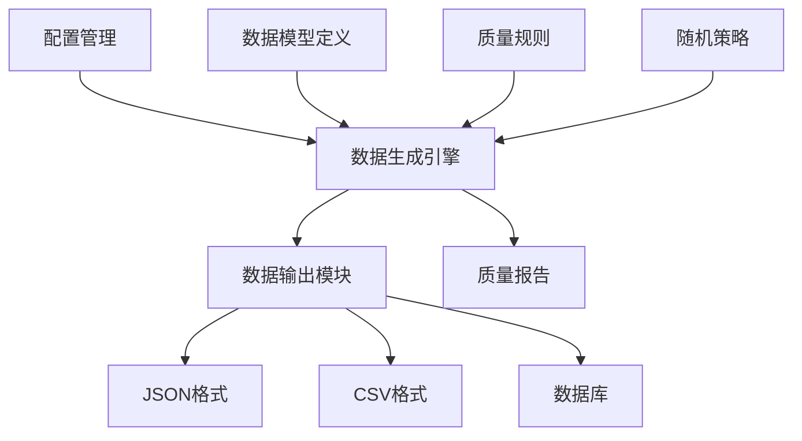

# 批次算法性能测试数据生成规范
## 版本信息
- **文档版本**: v1.0
- **创建日期**: 2026-05-01
- **项目**: AI-Ready ERP系统
- **模块**: 批次管理算法性能测试
- **相关任务**: task_1777574973712_i82y9s9bh

## 1. 数据生成目标

### 1.1 核心目标
1. 生成具有真实业务特征的测试数据
2. 覆盖不同数据规模和应用场景
3. 包含多样化的数据质量问题
4. 支持性能测试的可重复性和可扩展性

### 1.2 数据特征要求
| 特征维度 | 要求描述 | 实现方法 |
|---------|---------|---------|
| **真实性** | 模拟真实业务数据分布 | 基于历史数据分析 |
| **多样性** | 覆盖不同批次类型 | 多种数据生成策略 |
| **复杂性** | 包含关联关系和约束 | 数据模型建模 |
| **可控性** | 可配置数据规模和质量 | 参数化数据生成 |

## 2. 数据模型定义

### 2.1 核心数据实体
```python
# 批次数据基础模型
class BatchData:
    batch_id: str                # 批次ID
    supplier_id: str             # 供应商ID
    material_code: str           # 物料编码
    production_date: datetime    # 生产日期
    expiry_date: datetime        # 有效期至
    quantity: float              # 数量
    unit: str                    # 单位
    quality_grade: str           # 质量等级
    storage_location: str        # 存储位置
    inspection_status: str       # 检验状态
    created_at: datetime         # 创建时间
    updated_at: datetime         # 更新时间
```

### 2.2 数据关联关系
1. **供应商-批次**：一对多关系
2. **物料-批次**：一对多关系
3. **批次-检验记录**：一对多关系
4. **批次-库存记录**：一对一关系
5. **批次-出库记录**：一对多关系

## 3. 数据生成策略

### 3.1 真实数据模拟策略
**基于历史数据的生成：**
1. **分布学习**：分析历史数据的统计分布
2. **特征提取**：识别关键特征和相关性
3. **模式生成**：基于学习到的模式生成新数据
4. **变异注入**：引入合理的随机性

**数据质量特性：**
- 日期格式多样性（YYYY-MM-DD, DD/MM/YYYY等）
- 编码格式规范化（前缀+序列号）
- 单位转换复杂性（kg, g, t, lb等）
- 数值精度要求（小数位数）

### 3.2 随机数据生成策略
```python
# 随机数据生成模板
def generate_random_batch_data(num_records):
    data = []
    for i in range(num_records):
        record = {
            "batch_id": f"BATCH-{random.randint(100000, 999999)}",
            "supplier_id": f"SUP-{random.randint(1000, 9999)}",
            "material_code": random.choice(MATERIAL_CODES),
            "production_date": generate_random_date(),
            "expiry_date": generate_expiry_date(),
            "quantity": round(random.uniform(1, 1000), 2),
            "unit": random.choice(["kg", "g", "t", "lb"]),
            "quality_grade": random.choice(["A", "B", "C", "D"]),
            "storage_location": generate_location_code(),
            "inspection_status": random.choice(["pending", "passed", "failed"]),
            "created_at": datetime.now(),
            "updated_at": datetime.now()
        }
        data.append(record)
    return data
```

## 4. 数据质量注入策略

### 4.1 数据质量问题类型
| 问题类型 | 问题描述 | 注入概率 | 测试目的 |
|---------|---------|---------|---------|
| **格式不一致** | 日期、编码格式错误 | 5% | 格式标准化算法 |
| **数据缺失** | 字段值为空 | 3% | 缺失值填充算法 |
| **异常值** | 数值超出合理范围 | 2% | 异常值检测算法 |
| **重复数据** | 相同记录重复出现 | 2% | 重复识别算法 |
| **逻辑错误** | 字段间逻辑矛盾 | 1% | 数据验证算法 |

### 4.2 数据质量注入方法
```python
# 数据质量注入函数
def inject_data_quality_issues(data, issue_type, probability):
    injected_data = []
    for record in data:
        if random.random() < probability:
            modified_record = apply_issue(record, issue_type)
            injected_data.append(modified_record)
        else:
            injected_data.append(record)
    return injected_data

# 问题类型定义
DATA_ISSUES = {
    "format_inconsistency": ["date_format", "code_format", "unit_format"],
    "missing_values": ["required_field", "optional_field"],
    "outliers": ["extreme_value", "impossible_value"],
    "duplicates": ["exact_duplicate", "similar_duplicate"],
    "logic_errors": ["date_sequence", "quantity_unit", "status_consistency"]
}
```

## 5. 数据规模定义

### 5.1 测试数据规模等级
| 规模等级 | 记录数量 | 数据量估算 | 适用场景 |
|---------|---------|-----------|---------|
| **微型** | 1,000条 | ~1MB | 单元测试、开发调试 |
| **小型** | 10,000条 | ~10MB | 功能测试、算法验证 |
| **中型** | 100,000条 | ~100MB | 集成测试、性能基准 |
| **大型** | 1,000,000条 | ~1GB | 压力测试、扩展性验证 |
| **超大型** | 10,000,000条 | ~10GB | 极限测试、稳定性验证 |

### 5.2 数据生成配置
```yaml
# 数据生成配置文件模板
data_generation:
  base_config:
    scale: "medium"           # small, medium, large, xlarge
    data_type: "mixed"        # clean, dirty, mixed
    issue_injection: true     # 是否注入数据质量问题
    output_format: "json"     # json, csv, parquet
    
  quality_settings:
    missing_rate: 0.03        # 缺失值比例
    outlier_rate: 0.02        # 异常值比例
    duplicate_rate: 0.02      # 重复数据比例
    format_error_rate: 0.05   # 格式错误比例
    
  content_settings:
    material_count: 100       # 物料种类数
    supplier_count: 50        # 供应商数量
    time_span: "1year"        # 时间跨度
```

## 6. 数据生成工具

### 6.1 工具架构设计


### 6.2 主要工具组件
1. **配置解析器**：解析YAML/JSON配置文件
2. **数据生成器**：基于规则的测试数据生成
3. **质量注入器**：注入数据质量问题
4. **数据输出器**：多种格式输出支持
5. **验证检查器**：数据质量验证

## 7. 数据验证方案

### 7.1 验证方法
| 验证维度 | 验证方法 | 验收标准 |
|---------|---------|---------|
| **完整性** | 记录计数、字段检查 | 记录完整性≥99.9% |
| **正确性** | 业务规则验证 | 业务正确性≥99.5% |
| **一致性** | 关联关系验证 | 一致性≥99.0% |
| **真实性** | 统计分布验证 | 分布匹配度≥95.0% |

### 7.2 自动化验证脚本
```python
# 数据验证脚本模板
def validate_generated_data(data, config):
    validation_results = {
        "record_count": len(data),
        "missing_fields": count_missing_fields(data),
        "format_errors": validate_data_formats(data),
        "business_rules": validate_business_rules(data),
        "statistical_distribution": check_statistical_distribution(data),
        "relationship_integrity": validate_relationships(data)
    }
    
    return validation_results

def generate_validation_report(results):
    """生成数据验证报告"""
    report = {
        "summary": {
            "total_records": results["record_count"],
            "validation_score": calculate_validation_score(results),
            "data_quality_level": determine_quality_level(results)
        },
        "detailed_results": results
    }
    return report
```

## 8. 测试数据管理

### 8.1 数据版本控制
1. **版本标签**：为每个测试数据集添加版本标签
2. **变更记录**：记录数据集的变更历史
3. **数据血缘**：追踪数据生成和修改的来源
4. **快照管理**：重要测试场景的数据快照

### 8.2 数据目录结构
```
test-data/
├── batch-algorithm/
│   ├── raw/                    # 原始测试数据
│   │   ├── small-scale/
│   │   │   ├── clean/         # 清洁数据
│   │   │   ├── dirty/         # 脏数据
│   │   │   └── mixed/         # 混合数据
│   │   ├── medium-scale/
│   │   └── large-scale/
│   ├── processed/              # 处理后的测试数据
│   ├── metadata/               # 数据元信息
│   │   ├── schemas/           # 数据模式定义
│   │   ├── configs/           # 生成配置
│   │   └── reports/           # 验证报告
│   └── scripts/               # 数据生成脚本
│       ├── generators/        # 数据生成器
│       ├── validators/        # 数据验证器
│       └── utilities/         # 工具函数
```

## 9. 性能测试数据用例

### 9.1 性能测试场景数据
| 测试场景 | 数据规模 | 数据类型 | 质量特征 | 预期处理时间 |
|---------|---------|---------|---------|------------|
| **P1-基准** | 1万条 | 清洁数据 | 格式规范 | < 10秒 |
| **P2-负载** | 10万条 | 混合数据 | 轻微问题 | < 60秒 |
| **P3-压力** | 100万条 | 脏数据 | 多重问题 | < 10分钟 |
| **P4-极限** | 1000万条 | 异常数据 | 极端问题 | < 30分钟 |

### 9.2 对比测试数据
| 对比场景 | 数据集A | 数据集B | 对比维度 |
|---------|---------|---------|---------|
| **格式标准化** | 格式杂乱 | 格式统一 | 处理效率 |
| **缺失值填充** | 高缺失率 | 低缺失率 | 准确率 |
| **异常值检测** | 大量异常 | 少量异常 | 检测精度 |
| **重复识别** | 重复率高 | 重复率低 | 识别效率 |

## 10. 实施计划

### 10.1 数据生成阶段
| 阶段 | 工作内容 | 交付物 | 时间估算 |
|------|---------|-------|---------|
| **需求分析** | 确定数据需求 | 数据规格文档 | 1天 |
| **工具开发** | 开发数据生成工具 | 可执行工具 | 3天 |
| **数据生成** | 生成测试数据集 | 数据集文件 | 2天 |
| **验证测试** | 验证数据质量 | 验证报告 | 1天 |
| **部署配置** | 配置测试环境 | 环境配置 | 1天 |

### 10.2 维护计划
1. **定期更新**：每月更新一次基准数据集
2. **质量监控**：持续监控数据质量
3. **问题修复**：及时发现和修复数据问题
4. **文档维护**：保持文档与数据同步

## 附录

### A. 数据字段详细定义
| 字段名 | 类型 | 格式 | 取值范围 | 约束条件 |
|-------|------|------|---------|---------|
| batch_id | string | BATCH-{6位数字} | BATCH-100000~999999 | 唯一 |
| supplier_id | string | SUP-{4位数字} | SUP-1000~9999 | 必须存在 |
| material_code | string | MAT-{3位字母}{4位数字} | MAT-ABC1000~ZYX9999 | 参照物料表 |
| production_date | datetime | YYYY-MM-DD | 过去3年内 | 早于当前日期 |
| expiry_date | datetime | YYYY-MM-DD | 未来6个月~3年 | 晚于生产日期 |
| quantity | float | 两位小数 | 0.01~10000.00 | 正数 |
| unit | string | 枚举值 | kg, g, t, lb, pcs | 必须有效 |
| quality_grade | string | 单字符 | A, B, C, D | 必须指定 |
| storage_location | string | LOC-{3位字母}-{2位数字} | LOC-AAA-01~LOC-ZZZ-99 | 必须有效 |
| inspection_status | string | 枚举值 | pending, passed, failed | 必须指定 |

### B. 数据生成示例代码
```python
# 完整的数据生成示例
import json
import random
from datetime import datetime, timedelta
from typing import List, Dict

class BatchDataGenerator:
    def __init__(self, config: Dict):
        self.config = config
        self.material_codes = self._generate_material_codes()
        self.supplier_ids = self._generate_supplier_ids()
        
    def generate_dataset(self, size: int) -> List[Dict]:
        """生成指定大小的测试数据集"""
        data = []
        for i in range(size):
            record = self._generate_single_record(i)
            data.append(record)
        return data
    
    def _generate_single_record(self, index: int) -> Dict:
        """生成单个记录"""
        production_date = self._generate_random_date()
        expiry_date = production_date + timedelta(days=random.randint(180, 1095))
        
        record = {
            "batch_id": f"BATCH-{100000 + index}",
            "supplier_id": random.choice(self.supplier_ids),
            "material_code": random.choice(self.material_codes),
            "production_date": production_date.strftime("%Y-%m-%d"),
            "expiry_date": expiry_date.strftime("%Y-%m-%d"),
            "quantity": round(random.uniform(0.01, 10000.00), 2),
            "unit": random.choice(["kg", "g", "t", "lb", "pcs"]),
            "quality_grade": random.choice(["A", "B", "C", "D"]),
            "storage_location": f"LOC-{random.choice(['AAA', 'BBB', 'CCC'])}-{random.randint(1, 99):02d}",
            "inspection_status": random.choice(["pending", "passed", "failed"]),
            "created_at": datetime.now().isoformat(),
            "updated_at": datetime.now().isoformat()
        }
        
        # 根据配置注入数据质量问题
        if self.config.get("inject_issues", False):
            record = self._inject_data_issues(record)
            
        return record
    
    def save_to_file(self, data: List[Dict], filename: str):
        """保存数据到文件"""
        with open(filename, 'w', encoding='utf-8') as f:
            json.dump(data, f, ensure_ascii=False, indent=2)
        
        print(f"已生成 {len(data)} 条记录到 {filename}")

# 使用示例
if __name__ == "__main__":
    config = {
        "scale": "medium",
        "inject_issues": True,
        "output_format": "json"
    }
    
    generator = BatchDataGenerator(config)
    test_data = generator.generate_dataset(size=10000)
    generator.save_to_file(test_data, "batch_test_data_medium.json")
```

### C. 数据质量检查清单
1. [ ] 所有必填字段都有值
2. [ ] 日期格式符合规范
3. [ ] 数值在有效范围内
4. [ ] 编码格式正确
5. [ ] 关联关系完整
6. [ ] 业务逻辑正确
7. [ ] 数据分布合理
8. [ ] 无重复记录（除非测试需要）
9. [ ] 数据大小符合预期
10. [ ] 文件格式正确

---

**文档审批：**
- **创建人**：前端开发工程师 (mnj006mb)
- **审核人**：主协调员 (main)
- **发布日期**：2026-05-01
- **状态**：草案 ✓ 审核中 □ 已批准 □