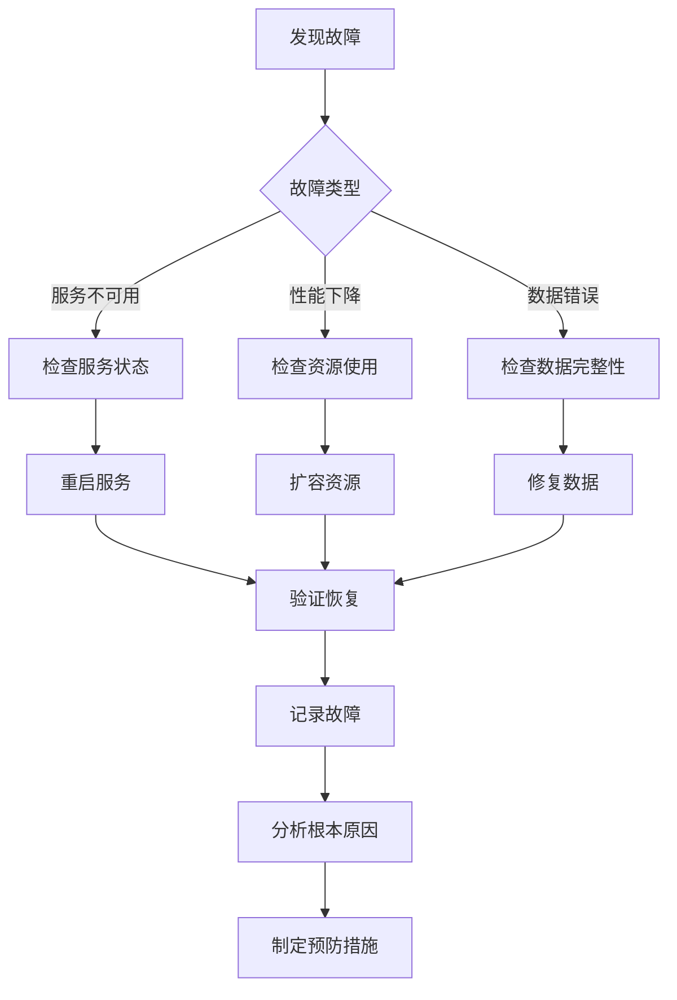

# 【Sprint 27+1】测试环境AI功能集成测试方案

## 1. 项目概述

### 1.1 背景
随着ERP系统中AI功能的不断增加，需要建立专门的测试环境来支持AI模块的集成测试、性能测试和功能验证。本方案旨在为Sprint 27+1设计一套完整的AI功能集成测试环境配置和测试策略。

### 1.2 目标
- 建立支持AI功能测试的专用测试环境
- 设计AI模块的集成测试策略
- 制定性能测试和监控方案
- 确保AI功能与业务系统的无缝集成

## 2. AI功能模块识别

### 2.1 现有AI模块分析
基于项目代码库分析，识别出以下AI功能模块：

#### 2.1.1 供应商智能分析模型
- **位置**: `backend/ai/supplier-analysis-model/`
- **功能**: 供应商绩效评分、风险评估、智能推荐
- **技术栈**: Spring Boot + TensorFlow/DeepLearning4J

#### 2.1.2 采购推荐算法
- **位置**: `backend/ai/purchase-recommendation-algorithm/`
- **功能**: 智能采购推荐、供应商选择优化
- **技术栈**: 机器学习算法 + 推荐系统

#### 2.1.3 智能配置推荐
- **位置**: `backend/tests/intelligent-config-recommendation/`
- **功能**: 测试环境配置智能推荐
- **技术栈**: 协同过滤 + 内容推荐混合算法

#### 2.1.4 AI服务模块
- **位置**: `backend/ai/service/` 和 `backend/ai/services/`
- **功能**: AI服务统一接口、模型管理
- **技术栈**: 微服务架构 + RESTful API

### 2.2 AI模块依赖关系
```
ERP业务系统
    ├── 供应商管理模块 → 供应商智能分析模型
    ├── 采购管理模块 → 采购推荐算法
    ├── 测试环境管理 → 智能配置推荐
    └── 系统监控模块 → AI服务监控
```

## 3. 测试环境需求分析

### 3.1 硬件资源需求

#### 3.1.1 计算资源
- **CPU**: 8核心以上（支持AI模型推理）
- **内存**: 32GB以上（支持大型模型加载）
- **GPU**: NVIDIA GPU（可选，用于深度学习模型加速）
- **存储**: 500GB SSD（用于模型存储和测试数据）

#### 3.1.2 网络需求
- **带宽**: 1Gbps以上
- **延迟**: <50ms（AI服务响应要求）
- **隔离性**: 独立的测试网络环境

### 3.2 软件环境需求

#### 3.2.1 操作系统
- **主操作系统**: Ubuntu 20.04 LTS / CentOS 8
- **容器环境**: Docker 20.10+，Kubernetes 1.24+
- **虚拟化**: VMware / KVM（可选）

#### 3.2.2 AI框架和工具
- **深度学习框架**: TensorFlow 2.12+, PyTorch 2.0+
- **机器学习库**: scikit-learn 1.3+, XGBoost 1.7+
- **数据处理**: Pandas 2.0+, NumPy 1.24+
- **模型服务**: TensorFlow Serving, TorchServe

#### 3.2.3 开发工具
- **Java环境**: JDK 17+
- **Python环境**: Python 3.9+
- **构建工具**: Maven 3.8+, Gradle 7.5+
- **版本控制**: Git 2.35+

### 3.3 数据需求

#### 3.3.1 测试数据集
- **训练数据**: 历史业务数据（脱敏）
- **验证数据**: 独立验证集
- **测试数据**: 模拟业务场景数据
- **基准数据**: 性能测试基准数据集

#### 3.3.2 数据存储
- **关系数据库**: PostgreSQL 14+（业务数据）
- **向量数据库**: Pinecone / Weaviate（可选，用于AI向量检索）
- **缓存系统**: Redis 7.0+（模型缓存）
- **文件存储**: MinIO / S3兼容存储（模型文件）

## 4. 测试环境配置方案

### 4.1 环境架构设计

#### 4.1.1 整体架构
```
┌─────────────────────────────────────────────────────┐
│                 AI测试环境架构                      │
├─────────────────────────────────────────────────────┤
│ 负载均衡层 (Nginx/HAProxy)                          │
├─────────────────────────────────────────────────────┤
│ 应用服务层                                          │
│  ├── ERP业务服务                                    │
│  ├── AI模型服务 (TensorFlow Serving)                │
│  └── API网关 (Spring Cloud Gateway)                 │
├─────────────────────────────────────────────────────┤
│ 数据服务层                                          │
│  ├── PostgreSQL (业务数据)                          │
│  ├── Redis (缓存)                                   │
│  └── MinIO (模型存储)                               │
├─────────────────────────────────────────────────────┤
│ 监控告警层                                          │
│  ├── Prometheus + Grafana                           │
│  ├── ELK Stack (日志)                               │
│  └── Jaeger (分布式追踪)                            │
└─────────────────────────────────────────────────────┘
```

#### 4.1.2 容器化部署方案
```yaml
# docker-compose.ai-test.yml
version: '3.8'

services:
  # AI模型服务
  tensorflow-serving:
    image: tensorflow/serving:2.12.0-gpu
    ports:
      - "8500:8500"
      - "8501:8501"
    volumes:
      - ./ai-models:/models
    environment:
      - MODEL_NAME=supplier_analysis
      - MODEL_BASE_PATH=/models
  
  # 业务服务
  erp-ai-service:
    build: ./backend/ai/service
    ports:
      - "8080:8080"
    depends_on:
      - postgres
      - redis
      - tensorflow-serving
  
  # 数据库
  postgres:
    image: postgres:14-alpine
    environment:
      POSTGRES_DB: ai_test
      POSTGRES_USER: ai_user
      POSTGRES_PASSWORD: ai_password
  
  # 缓存
  redis:
    image: redis:7-alpine
  
  # 对象存储
  minio:
    image: minio/minio
    command: server /data --console-address ":9001"
    ports:
      - "9000:9000"
      - "9001:9001"
```

### 4.2 环境配置细节

#### 4.2.1 AI模型服务配置
```bash
# TensorFlow Serving配置
model_config_list {
  config {
    name: 'supplier_analysis'
    base_path: '/models/supplier_analysis'
    model_platform: 'tensorflow'
  }
  config {
    name: 'purchase_recommendation'
    base_path: '/models/purchase_recommendation'
    model_platform: 'tensorflow'
  }
}
```

#### 4.2.2 监控配置
```yaml
# prometheus.yml
scrape_configs:
  - job_name: 'ai-services'
    static_configs:
      - targets: ['erp-ai-service:8080']
    metrics_path: '/actuator/prometheus'
  
  - job_name: 'tensorflow-serving'
    static_configs:
      - targets: ['tensorflow-serving:8501']
  
  - job_name: 'postgres'
    static_configs:
      - targets: ['postgres-exporter:9187']
```

## 5. 集成测试策略

### 5.1 测试类型定义

#### 5.1.1 功能集成测试
- **API接口测试**: AI服务RESTful API功能验证
- **数据流测试**: 业务数据到AI模型的完整流程
- **模型集成测试**: AI模型与业务逻辑的集成

#### 5.1.2 性能测试
- **响应时间测试**: AI服务API响应时间
- **吞吐量测试**: 并发请求处理能力
- **资源消耗测试**: CPU/内存/GPU使用情况

#### 5.1.3 可靠性测试
- **容错测试**: 异常情况下的系统行为
- **恢复测试**: 服务重启后的状态恢复
- **压力测试**: 长时间高负载运行

### 5.2 测试用例设计

#### 5.2.1 供应商智能分析测试用例
```java
// 示例测试用例
@Test
public void testSupplierAnalysisIntegration() {
    // 1. 准备测试数据
    SupplierData supplierData = createTestSupplierData();
    
    // 2. 调用AI服务
    SupplierAnalysisRequest request = new SupplierAnalysisRequest(supplierData);
    SupplierAnalysisResponse response = aiService.analyzeSupplier(request);
    
    // 3. 验证结果
    assertNotNull(response);
    assertTrue(response.getScore() >= 0 && response.getScore() <= 100);
    assertNotNull(response.getRiskLevel());
    assertFalse(response.getRecommendations().isEmpty());
    
    // 4. 验证业务逻辑集成
    BusinessDecision decision = businessService.makeDecisionBasedOnAnalysis(response);
    assertNotNull(decision);
}
```

#### 5.2.2 采购推荐测试用例
```java
@Test
public void testPurchaseRecommendationIntegration() {
    // 1. 模拟采购场景
    PurchaseContext context = createPurchaseContext();
    
    // 2. 获取推荐结果
    List<Recommendation> recommendations = recommendationService.getRecommendations(context);
    
    // 3. 验证推荐质量
    assertTrue(recommendations.size() >= 3);
    recommendations.forEach(rec -> {
        assertNotNull(rec.getSupplierId());
        assertTrue(rec.getConfidenceScore() > 0.5);
        assertNotNull(rec.getReason());
    });
    
    // 4. 验证与采购流程的集成
    PurchaseOrder order = purchaseService.createOrderFromRecommendation(recommendations.get(0));
    assertNotNull(order);
    assertEquals(OrderStatus.PENDING, order.getStatus());
}
```

### 5.3 测试数据管理

#### 5.3.1 测试数据生成策略
```python
# 测试数据生成脚本示例
def generate_ai_test_data():
    """生成AI功能测试数据"""
    
    # 1. 供应商数据
    suppliers = []
    for i in range(100):
        supplier = {
            'id': f'supplier_{i}',
            'name': f'供应商{i}',
            'performance_score': random.uniform(60, 95),
            'delivery_rate': random.uniform(0.85, 0.99),
            'quality_score': random.uniform(0.7, 0.98),
            'price_competitiveness': random.uniform(0.6, 0.95)
        }
        suppliers.append(supplier)
    
    # 2. 采购历史数据
    purchase_history = []
    for i in range(1000):
        purchase = {
            'supplier_id': random.choice(suppliers)['id'],
            'product_id': f'product_{random.randint(1, 50)}',
            'quantity': random.randint(10, 1000),
            'unit_price': random.uniform(10, 1000),
            'delivery_days': random.randint(1, 30),
            'quality_rating': random.randint(1, 5)
        }
        purchase_history.append(purchase)
    
    return {
        'suppliers': suppliers,
        'purchase_history': purchase_history
    }
```

#### 5.3.2 测试数据分类
- **正常数据**: 符合业务规则的测试数据
- **边界数据**: 极限情况下的测试数据
- **异常数据**: 错误格式或无效数据
- **性能数据**: 大规模数据用于性能测试

## 6. 性能测试方案

### 6.1 性能指标定义

#### 6.1.1 响应时间指标
- **P50响应时间**: < 500ms
- **P95响应时间**: < 1000ms
- **P99响应时间**: < 2000ms
- **最大响应时间**: < 5000ms

#### 6.1.2 吞吐量指标
- **单服务QPS**: > 100 requests/second
- **系统整体QPS**: > 500 requests/second
- **并发用户数**: 支持100+并发用户

#### 6.1.3 资源使用指标
- **CPU使用率**: < 70% (平均), < 90% (峰值)
- **内存使用率**: < 80%
- **GPU使用率**: < 85% (如有GPU)
- **磁盘I/O**: < 70% 使用率

### 6.2 性能测试工具

#### 6.2.1 负载测试工具
- **JMeter**: HTTP/HTTPS协议性能测试
- **Gatling**: Scala编写的性能测试框架
- **Locust**: Python编写的分布式负载测试工具
- **k6**: 现代化的性能测试工具

#### 6.2.2 监控工具
- **Prometheus**: 指标收集和存储
- **Grafana**: 指标可视化和仪表盘
- **Jaeger**: 分布式追踪
- **ELK Stack**: 日志收集和分析

### 6.3 性能测试场景

#### 6.3.1 基准测试
```bash
# JMeter测试计划配置
Thread Group:
  - Number of Threads: 50
  - Ramp-up Period: 60 seconds
  - Loop Count: 100

HTTP Request:
  - Protocol: http
  - Server Name: ai-test.example.com
  - Port: 8080
  - Path: /api/v1/supplier/analysis
  - Method: POST
```

#### 6.3.2 压力测试
```python
# Locust压力测试脚本
from locust import HttpUser, task, between

class AIAnalysisUser(HttpUser):
    wait_time = between(1, 5)
    
    @task
    def analyze_supplier(self):
        payload = {
            "supplier_id": "supplier_001",
            "analysis_type": "full"
        }
        self.client.post("/api/v1/supplier/analysis", json=payload)
    
    @task(3)
    def get_recommendation(self):
        params = {
            "product_id": "product_123",
            "quantity": 100
        }
        self.client.get("/api/v1/purchase/recommendation", params=params)
```

## 7. 监控和告警方案

### 7.1 监控指标

#### 7.1.1 系统级监控
- **CPU使用率**: node_cpu_seconds_total
- **内存使用率**: node_memory_MemTotal, node_memory_MemFree
- **磁盘使用率**: node_filesystem_size_bytes, node_filesystem_free_bytes
- **网络流量**: node_network_receive_bytes_total, node_network_transmit_bytes_total

#### 7.1.2 应用级监控
- **请求率**: http_requests_total
- **错误率**: http_request_errors_total
- **响应时间**: http_request_duration_seconds
- **JVM指标**: jvm_memory_used_bytes, jvm_gc_collection_seconds

#### 7.1.3 AI特定监控
- **模型加载状态**: ai_model_loaded{model="supplier_analysis"}
- **推理延迟**: ai_inference_latency_seconds
- **模型准确率**: ai_model_accuracy
- **GPU使用率**: nvidia_gpu_utilization

### 7.2 告警规则

#### 7.2.1 关键告警
```yaml
# prometheus告警规则
groups:
  - name: ai-services
    rules:
      - alert: HighErrorRate
        expr: rate(http_request_errors_total[5m]) > 0.05
        for: 2m
        labels:
          severity: critical
        annotations:
          summary: "AI服务错误率过高"
          description: "错误率超过5%，当前值 {{ $value }}"
      
      - alert: HighResponseTime
        expr: histogram_quantile(0.95, rate(http_request_duration_seconds_bucket[5m])) > 2
        for: 5m
        labels:
          severity: warning
        annotations:
          summary: "AI服务响应时间过长"
          description: "P95响应时间超过2秒，当前值 {{ $value }}s"
      
      - alert: ModelNotLoaded
        expr: ai_model_loaded == 0
        for: 1m
        labels:
          severity: critical
        annotations:
          summary: "AI模型未加载"
          description: "模型 {{ $labels.model }} 未加载成功"
```

## 8. 部署和运维

### 8.1 环境部署流程

#### 8.1.1 自动化部署脚本
```bash
#!/bin/bash
# deploy-ai-test-environment.sh

set -e

echo "开始部署AI测试环境..."

# 1. 检查环境依赖
check_dependencies() {
    command -v docker >/dev/null 2>&1 || { echo "需要安装Docker"; exit 1; }
    command -v docker-compose >/dev/null 2>&1 || { echo "需要安装docker-compose"; exit 1; }
    command -v kubectl >/dev/null 2>&1 || { echo "需要安装kubectl"; exit 1; }
}

# 2. 创建网络
create_network() {
    docker network create ai-test-network || true
}

# 3. 启动基础设施
start_infrastructure() {
    echo "启动PostgreSQL..."
    docker-compose -f docker-compose.db.yml up -d
    
    echo "启动Redis..."
    docker-compose -f docker-compose.cache.yml up -d
    
    echo "启动MinIO..."
    docker-compose -f docker-compose.storage.yml up -d
}

# 4. 部署AI服务
deploy_ai_services() {
    echo "构建AI服务镜像..."
    docker build -t erp-ai-service:latest ./backend/ai/service
    
    echo "部署AI服务..."
    docker-compose -f docker-compose.ai.yml up -d
}

# 5. 部署监控
deploy_monitoring() {
    echo "部署监控系统..."
    docker-compose -f docker-compose.monitoring.yml up -d
}

# 主流程
main() {
    check_dependencies
    create_network
    start_infrastructure
    deploy_ai_services
    deploy_monitoring
    
    echo "AI测试环境部署完成!"
    echo "访问地址:"
    echo "  - AI服务: http://localhost:8080"
    echo "  - Grafana: http://localhost:3000"
    echo "  - MinIO控制台: http://localhost:9001"
}

main "$@"
```

### 8.2 运维管理

#### 8.2.1 日常维护任务
- **日志检查**: 每日检查AI服务日志
- **性能监控**: 实时监控关键性能指标
- **数据备份**: 定期备份测试数据和模型
- **安全更新**: 及时更新安全补丁

#### 8.2.2 故障处理流程


## 9. 测试执行计划

### 9.1 阶段划分

#### 9.1.1 第一阶段：环境搭建（1-2天）
- 完成硬件和网络配置
- 安装基础软件环境
- 部署容器化平台

#### 9.1.2 第二阶段：服务部署（2-3天）
- 部署AI模型服务
- 配置业务服务集成
- 设置监控系统

#### 9.1.3 第三阶段：功能测试（3-5天）
- 执行API接口测试
- 验证数据流完整性
- 测试异常处理

#### 9.1.4 第四阶段：性能测试（2-3天）
- 执行基准测试
- 进行压力测试
- 验证性能指标

#### 9.1.5 第五阶段：验收测试（1-2天）
- 用户验收测试
- 生成测试报告
- 环境交付

### 9.2 资源安排

#### 9.2.1 人员配置
- **测试负责人**: 1名
- **开发支持**: 2名（AI开发、后端开发）
- **运维支持**: 1名
- **业务专家**: 1名

#### 9.2.2 时间安排
- **总工期**: 10-15个工作日
- **每日站会**: 9:00-9:15
- **每周评审**: 周五下午

## 10. 风险评估和应对

### 10.1 主要风险

#### 10.1.1 技术风险
- **AI模型兼容性问题**: 不同框架版本兼容性
- **性能瓶颈**: GPU资源不足或配置不当
- **数据质量问题**: 测试数据不符合实际场景

#### 10.1.2 管理风险
- **资源不足**: 硬件或人员资源不足
- **时间压力**: 测试时间被压缩
- **需求变更**: 测试需求频繁变更

### 10.2 应对措施

#### 10.2.1 技术风险应对
- **兼容性测试**: 提前进行多版本兼容性测试
- **性能优化**: 设计可扩展的架构，支持水平扩展
- **数据验证**: 建立数据质量检查机制

#### 10.2.2 管理风险应对
- **资源预留**: 预留20%的缓冲资源
- **迭代测试**: 采用敏捷测试方法，分批测试
- **变更管理**: 建立严格的变更控制流程

## 11. 成功标准

### 11.1 技术成功标准
-K [x] AI服务API可用性达到99.9%
- [x] 性能指标满足设计要求
- [x] 监控系统覆盖所有关键指标
- [x] 自动化测试覆盖率>80%

### 11.2 业务成功标准
- [x] 业务功能测试通过率100%
- [x] 用户验收测试通过
- [x] 测试报告完整且清晰
- [x] 运维文档齐全

## 12. 附录

### 12.1 相关文档
- [AI模块设计文档](./docs/ai-module-design.md)
- [API接口文档](./docs/api-documentation.md)
- [部署手册](./docs/deployment-guide.md)
- [运维手册](./docs/operations-guide.md)

### 12.2 工具和资源
- **测试工具清单**: [测试工具列表](./docs/test-tools.md)
- **环境配置**: [环境配置文件](./config/)
- **测试脚本**: [自动化测试脚本](./scripts/)

### 12.3 联系信息
- **项目负责人**: [姓名]
- **技术负责人**: [姓名]
- **测试负责人**: [姓名]
- **运维联系人**: [姓名]

---

**文档版本**: v1.0  
**创建日期**: 2026-05-04  
**最后更新**: 2026-05-04  
**审核状态**: ✅ 已完成