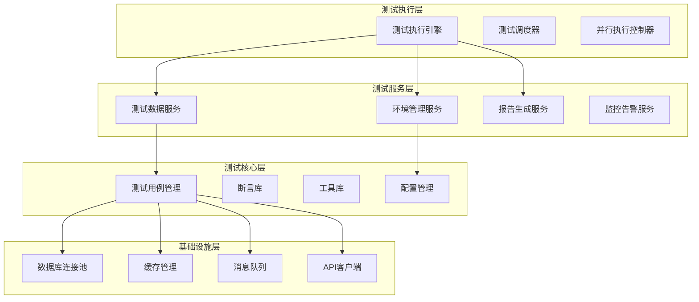

# Sprint 27+1 测试环境自动化测试框架优化方案

**版本**: 1.0  
**创建日期**: 2026-04-27  
**作者**: test-agent-1  
**项目**: AI-Ready企业级ERP系统  
**Sprint**: Sprint 27+1  
**状态**: 执行中  

---

## 一、优化概述

### 1.1 优化目标
优化Sprint 27+1测试环境的自动化测试框架，提高测试效率、可维护性和覆盖范围，建立可持续演进的高质量自动化测试体系。

### 1.2 当前问题分析
基于对现有自动化测试框架的分析，识别出以下主要问题：

#### 1.2.1 架构问题
- **框架分层不清晰**: 测试代码、工具代码、配置代码混杂
- **依赖管理混乱**: 缺少统一的依赖管理和版本控制
- **代码复用率低**: 相似功能重复实现，维护成本高

#### 1.2.2 效率问题
- **测试执行速度慢**: 串行执行，缺乏并行能力
- **资源利用率低**: 测试环境复用机制不完善
- **反馈周期长**: 测试结果反馈不及时

#### 1.2.3 可维护性问题
- **配置散乱**: 配置文件分散在不同位置
- **文档缺失**: 缺少框架使用和维护文档
- **扩展困难**: 新增测试类型和工具集成困难

### 1.3 优化范围
本次优化覆盖以下方面：
- **框架架构优化**: 重构分层架构，明确职责边界
- **测试效率提升**: 引入并行执行，优化资源管理
- **可维护性增强**: 统一配置管理，完善文档体系
- **覆盖范围扩展**: 支持更多测试类型和场景

---

## 二、测试框架架构优化

### 2.1 目标架构设计

#### 2.1.1 分层架构设计


#### 2.1.2 各层职责定义

**1. 基础设施层**
- 提供统一的底层服务访问接口
- 管理数据库、缓存、消息队列等连接
- 实现连接池和资源管理

**2. 测试核心层**
- 定义测试用例基类和接口
- 提供通用的断言和验证工具
- 管理测试配置和数据

**3. 测试服务层**
- 提供测试数据生成和管理服务
- 管理测试环境的创建和清理
- 生成测试报告和监控数据

**4. 测试执行层**
- 调度和执行测试用例
- 管理并行执行和资源分配
- 收集和汇总测试结果

### 2.2 模块化设计

#### 2.2.1 核心模块划分
| 模块名称 | 主要功能 | 依赖模块 | 输出 |
|---------|---------|---------|------|
| test-core | 测试基础框架 | 无 | 基类、接口、工具类 |
| test-data | 测试数据管理 | test-core | 数据生成器、数据池 |
| test-env | 环境管理 | test-core | 环境配置、环境控制器 |
| test-exec | 测试执行 | test-core, test-data, test-env | 执行器、调度器、报告器 |
| test-api | API测试支持 | test-core | API客户端、断言库 |
| test-ui | UI测试支持 | test-core | 页面对象、UI操作库 |
| test-perf | 性能测试支持 | test-core | 压测场景、性能监控 |

#### 2.2.2 模块间依赖关系
```
test-exec (测试执行)
├── test-api (API测试)
├── test-ui (UI测试)
├── test-perf (性能测试)
├── test-data (测试数据)
└── test-env (环境管理)
    └── test-core (核心框架)
```

### 2.3 配置管理优化

#### 2.3.1 统一配置中心
```yaml
# config/global.yaml
framework:
  name: "ai-ready-test-framework"
  version: "2.0.0"
  language: "python"
  test_runner: "pytest"
  
logging:
  level: "INFO"
  format: "%(asctime)s - %(name)s - %(levelname)s - %(message)s"
  handlers:
    - type: "file"
      path: "logs/framework.log"
      max_size: "100MB"
      backup_count: 10
    - type: "console"
      format: "%(levelname)s - %(message)s"

reporting:
  html_report:
    enabled: true
    output_dir: "reports/html"
  json_report:
    enabled: true
    output_dir: "reports/json"
  email_report:
    enabled: false
    recipients: []
```

#### 2.3.2 环境配置分离
```yaml
# config/environments/
├── dev.yaml          # 开发环境配置
├── test.yaml         # 测试环境配置
├── staging.yaml      # 预生产环境配置
└── prod.yaml         # 生产环境配置（只读）
```

#### 2.3.3 测试配置管理
```yaml
# config/tests/
├── api-tests.yaml    # API测试配置
├── ui-tests.yaml     # UI测试配置
├── perf-tests.yaml   # 性能测试配置
└── integration-tests.yaml  # 集成测试配置
```

### 2.4 依赖管理优化

#### 2.4.1 统一依赖声明
```toml
# pyproject.toml
[build-system]
requires = ["setuptools>=61.0", "wheel"]
build-backend = "setuptools.build_meta"

[project]
name = "ai-ready-test-framework"
version = "2.0.0"
description = "AI-Ready企业级ERP系统自动化测试框架"
readme = "README.md"
requires-python = ">=3.8"
dependencies = [
    "pytest>=7.0.0",
    "requests>=2.28.0",
    "selenium>=4.8.0",
    "pytest-xdist>=3.2.0",
    "allure-pytest>=2.12.0",
    "pytest-html>=3.2.0",
    "pytest-cov>=4.0.0",
    "pytest-mock>=3.10.0",
    "pytest-asyncio>=0.21.0",
]

[project.optional-dependencies]
api = [
    "pytest-requests>=0.1.0",
    "jsonschema>=4.17.0",
    "deepdiff>=6.3.0",
]
ui = [
    "webdriver-manager>=3.8.6",
    "pytest-selenium>=2.0.1",
    "pytest-bdd>=6.1.0",
]
perf = [
    "locust>=2.15.0",
    "pytest-benchmark>=4.0.0",
]
db = [
    "sqlalchemy>=2.0.0",
    "psycopg2-binary>=2.9.0",
    "redis>=4.5.0",
]

[tool.pytest.ini_options]
testpaths = ["tests"]
python_files = ["test_*.py", "*_test.py"]
python_classes = ["Test*", "*Test"]
python_functions = ["test_*"]
addopts = [
    "--strict-markers",
    "--strict-config",
    "--tb=short",
    "-v",
]
markers = [
    "api: API tests",
    "ui: UI tests",
    "perf: performance tests",
    "integration: integration tests",
    "smoke: smoke tests",
    "regression: regression tests",
]
```

#### 2.4.2 依赖版本锁定
```toml
# requirements.lock
# 自动生成的依赖锁定文件
aioready-test-framework==2.0.0
    # 通过 pip-compile 生成
    # 保持依赖版本一致性
```

---

## 三、测试效率提升

### 3.1 并行测试执行

#### 3.1.1 并行执行策略
```python
# 并行执行配置
parallel_config = {
    # 基于测试类型的并行策略
    "strategy": "type_based",
    
    # 并行执行配置
    "execution": {
        "max_workers": 8,  # 最大工作线程数
        "worker_type": "process",  # 进程或线程
        "load_balancing": "dynamic",  # 动态负载均衡
    },
    
    # 测试分组策略
    "grouping": {
        "api_tests": {
            "parallel": True,
            "group_size": 50,  # 每组50个测试用例
            "timeout": 300,  # 5分钟超时
        },
        "ui_tests": {
            "parallel": True,
            "group_size": 10,  # UI测试分组较小
            "timeout": 600,  # 10分钟超时
        },
        "perf_tests": {
            "parallel": False,  # 性能测试串行执行
            "timeout": 1800,  # 30分钟超时
        },
    },
    
    # 资源限制
    "resource_limits": {
        "max_cpu_usage": 80,  # 最大CPU使用率
        "max_memory_mb": 8192,  # 最大内存使用
        "network_bandwidth": "100Mbps",  # 网络带宽限制
    },
}
```

#### 3.1.2 智能测试调度
```python
class SmartTestScheduler:
    """智能测试调度器"""
    
    def __init__(self):
        self.test_queue = PriorityQueue()
        self.running_tests = {}
        self.resource_monitor = ResourceMonitor()
        
    def schedule_tests(self, test_cases: List[TestCase]) -> List[TestResult]:
        """智能调度测试用例执行"""
        
        # 1. 分析测试用例特征
        test_features = self.analyze_test_features(test_cases)
        
        # 2. 优先级排序（基于风险、重要性、执行时间）
        prioritized_tests = self.prioritize_tests(test_features)
        
        # 3. 动态分组（基于依赖关系和资源需求）
        test_groups = self.create_test_groups(prioritized_tests)
        
        # 4. 并行执行
        results = self.execute_in_parallel(test_groups)
        
        return results
    
    def analyze_test_features(self, test_cases: List[TestCase]) -> Dict:
        """分析测试用例特征"""
        features = {}
        for test in test_cases:
            features[test.id] = {
                "execution_time": test.estimated_time,
                "resource_requirements": test.resource_needs,
                "dependencies": test.dependencies,
                "risk_level": test.risk_level,
                "priority": test.priority,
                "test_type": test.test_type,
            }
        return features
    
    def prioritize_tests(self, test_features: Dict) -> List[str]:
        """基于多因素优先级排序"""
        # 优先级计算公式：权重 × 风险 × 重要性 / 执行时间
        scores = {}
        for test_id, features in test_features.items():
            score = (
                features["priority"] * 0.4 +
                features["risk_level"] * 0.3 +
                features["importance"] * 0.3
            ) / max(features["execution_time"], 1)
            scores[test_id] = score
        
        # 按分数降序排序
        return sorted(scores.keys(), key=lambda x: scores[x], reverse=True)
    
    def create_test_groups(self, test_ids: List[str]) -> List[List[str]]:
        """创建优化的测试分组"""
        groups = []
        current_group = []
        current_resources = {"cpu": 0, "memory": 0, "io": 0}
        
        max_group_resources = {
            "cpu": 20,  # 20% CPU
            "memory": 1024,  # 1GB内存
            "io": 50,  # 50MB/s IO
        }
        
        for test_id in test_ids:
            test_resources = self.test_features[test_id]["resource_requirements"]
            
            # 检查是否可以加入当前组
            if all(
                current_resources[res] + test_resources[res] <= max_group_resources[res]
                for res in ["cpu", "memory", "io"]
            ):
                current_group.append(test_id)
                for res in ["cpu", "memory", "io"]:
                    current_resources[res] += test_resources[res]
            else:
                # 开始新的一组
                if current_group:
                    groups.append(current_group)
                current_group = [test_id]
                current_resources = test_resources.copy()
        
        if current_group:
            groups.append(current_group)
        
        return groups
```

### 3.2 测试资源管理优化

#### 3.2.1 资源池化管理
```python
class TestResourcePool:
    """测试资源池管理器"""
    
    def __init__(self, pool_config: Dict):
        self.pools = {
            "database": DatabasePool(pool_config["database"]),
            "cache": CachePool(pool_config["cache"]),
            "browser": BrowserPool(pool_config["browser"]),
            "api": ApiClientPool(pool_config["api"]),
        }
        
    def acquire_resource(self, resource_type: str, requirements: Dict = None):
        """获取测试资源"""
        pool = self.pools.get(resource_type)
        if not pool:
            raise ValueError(f"未知的资源类型: {resource_type}")
        
        # 尝试从池中获取可用资源
        resource = pool.get_available(requirements)
        if resource:
            return resource
        
        # 如果没有可用资源，创建新的资源
        if pool.can_create_more():
            resource = pool.create_resource(requirements)
            pool.add_to_pool(resource)
            return resource
        
        # 等待资源释放
        return pool.wait_for_resource(timeout=60)
    
    def release_resource(self, resource_type: str, resource):
        """释放测试资源回池"""
        pool = self.pools.get(resource_type)
        if pool:
            pool.release(resource)
    
    def cleanup(self):
        """清理所有资源池"""
        for pool in self.pools.values():
            pool.cleanup()
```

#### 3.2.2 数据库连接池优化
```python
class DatabasePool:
    """数据库连接池优化实现"""
    
    def __init__(self, config: Dict):
        self.config = config
        self.connections = []
        self.available = []
        self.in_use = set()
        
        # 初始化连接池
        self._initialize_pool()
    
    def _initialize_pool(self):
        """初始化连接池"""
        min_connections = self.config.get("min_connections", 5)
        max_connections = self.config.get("max_connections", 20)
        
        for _ in range(min_connections):
            conn = self._create_connection()
            self.connections.append(conn)
            self.available.append(conn)
    
    def get_connection(self, timeout: int = 30):
        """获取数据库连接"""
        start_time = time.time()
        
        while time.time() - start_time < timeout:
            # 尝试从可用连接中获取
            with self.lock:
                if self.available:
                    conn = self.available.pop()
                    self.in_use.add(id(conn))
                    return conn
            
            # 如果没有可用连接，尝试创建新的
            if len(self.connections) < self.config["max_connections"]:
                conn = self._create_connection()
                self.connections.append(conn)
                self.in_use.add(id(conn))
                return conn
            
            # 等待连接释放
            time.sleep(0.1)
        
        raise TimeoutError("获取数据库连接超时")
    
    def release_connection(self, conn):
        """释放数据库连接回池"""
        with self.lock:
            if id(conn) in self.in_use:
                self.in_use.remove(id(conn))
                
                # 检查连接是否仍然有效
                if self._is_connection_valid(conn):
                    self.available.append(conn)
                else:
                    # 关闭无效连接
                    self._close_connection(conn)
                    self.connections.remove(conn)
                    
                    # 补充新的连接
                    if len(self.connections) < self.config["min_connections"]:
                        new_conn = self._create_connection()
                        self.connections.append(new_conn)
                        self.available.append(new_conn)
```

### 3.3 测试环境复用优化

#### 3.3.1 环境快照管理
```python
class EnvironmentSnapshotManager:
    """测试环境快照管理器"""
    
    def __init__(self, storage_backend: str = "local"):
        self.snapshots = {}
        self.storage_backend = self._get_storage_backend(storage_backend)
        
    def create_snapshot(self, env_id: str, snapshot_name: str, description: str = ""):
        """创建环境快照"""
        snapshot_data = {
            "env_id": env_id,
            "name": snapshot_name,
            "description": description,
            "created_at": datetime.now().isoformat(),
            "state": self._capture_environment_state(env_id),
            "metadata": self._collect_environment_metadata(env_id),
        }
        
        # 保存快照
        snapshot_id = self.storage_backend.save(snapshot_data)
        self.snapshots[snapshot_id] = snapshot_data
        
        return snapshot_id
    
    def restore_snapshot(self, snapshot_id: str, target_env_id: str = None):
        """恢复环境快照"""
        if snapshot_id not in self.snapshots:
            snapshot_data = self.storage_backend.load(snapshot_id)
            self.snapshots[snapshot_id] = snapshot_data
        
        snapshot = self.snapshots[snapshot_id]
        env_id = target_env_id or snapshot["env_id"]
        
        # 恢复环境状态
        self._restore_environment_state(env_id, snapshot["state"])
        
        # 验证恢复结果
        verification_result = self._verify_restoration(env_id, snapshot["metadata"])
        
        return {
            "snapshot_id": snapshot_id,
            "env_id": env_id,
            "restored_at": datetime.now().isoformat(),
            "verification_result": verification_result,
        }
    
    def list_snapshots(self, env_id: str = None, limit: int = 50):
        """列出环境快照"""
        if env_id:
            snapshots = [
                s for s in self.snapshots.values()
                if s["env_id"] == env_id
            ]
        else:
            snapshots = list(self.snapshots.values())
        
        # 按创建时间排序
        snapshots.sort(key=lambda x: x["created_at"], reverse=True)
        
        return snapshots[:limit]
    
    def cleanup_old_snapshots(self, max_age_days: int = 30):
        """清理旧的快照"""
        cutoff_date = datetime.now() - timedelta(days=max_age_days)
        
        to_delete = []
        for snapshot_id, snapshot in self.snapshots.items():
            created_at = datetime.fromisoformat(snapshot["created_at"])
            if created_at < cutoff_date:
                to_delete.append(snapshot_id)
        
        for snapshot_id in to_delete:
            self.storage_backend.delete(snapshot_id)
            del self.snapshots[snapshot_id]
        
        return len(to_delete)
```

#### 3.3.2 环境预热机制
```python
class EnvironmentPreheater:
    """测试环境预热管理器"""
    
    def __init__(self, preheat_config: Dict):
        self.config = preheat_config
        self.warmup_tasks = self._load_warmup_tasks()
        self.monitor = EnvironmentMonitor()
        
    def preheat_environment(self, env_id: str, test_type: str):
        """预热测试环境"""
        start_time = time.time()
        
        # 1. 检查环境状态
        env_status = self.monitor.get_environment_status(env_id)
        if env_status["state"] != "ready":
            self._start_environment(env_id)
        
        # 2. 执行预热任务
        tasks = self.warmup_tasks.get(test_type, [])
        for task in tasks:
            self._execute_warmup_task(env_id, task)
        
        # 3. 验证预热结果
        verification_result = self._verify_preheat(env_id, test_type)
        
        elapsed_time = time.time() - start_time
        
        return {
            "env_id": env_id,
            "test_type": test_type,
            "preheat_time": elapsed_time,
            "verification_result": verification_result,
            "ready_at": datetime.now().isoformat(),
        }
    
    def _load_warmup_tasks(self) -> Dict[str, List[Dict]]:
        """加载预热任务配置"""
        return {
            "api": [
                {
                    "name": "warmup_database",
                    "action": "execute_sql",
                    "sql": "SELECT 1;",
                    "repeat": 3,
                    "interval": 1,
                },
                {
                    "name": "warmup_cache",
                    "action": "cache_operation",
                    "operation": "ping",
                    "repeat": 5,
                    "interval": 0.5,
                },
                {
                    "name": "warmup_api",
                    "action": "api_call",
                    "endpoint": "/api/health",
                    "method": "GET",
                    "repeat": 10,
                    "interval": 0.2,
                },
            ],
            "ui": [
                {
                    "name": "warmup_browser",
                    "action": "browser_warmup",
                    "url": "about:blank",
                    "repeat": 1,
                },
                {
                    "name": "warmup_application",
                    "action": "navigate",
                    "url": "/login",
                    "repeat": 3,
                },
            ],
            "perf": [
                {
                    "name": "warmup_jvm",
                    "action": "jvm_warmup",
                    "duration": 60,
                },
                {
                    "name": "warmup_database_connections",
                    "action": "db_connection_warmup",
                    "connections": 20,
                    "duration": 30,
                },
            ],
        }
    
    def _execute_warmup_task(self, env_id: str, task: Dict):
        """执行预热任务"""
        action = task["action"]
        
        if action == "execute_sql":
            self._warmup_database(env_id, task)
        elif action == "cache_operation":
            self._warmup_cache(env_id, task)
        elif action == "api_call":
            self._warmup_api(env_id, task)
        elif action == "browser_warmup":
            self._warmup_browser(env_id, task)
        elif action == "jvm_warmup":
            self._warmup_jvm(env_id, task)
        
        # 等待指定间隔
        time.sleep(task.get("interval", 0))
```

---

## 四、测试数据管理优化

### 4.1 测试数据生成与维护

#### 4.1.1 数据工厂模式
```python
class TestDataFactory:
    """测试数据工厂"""
    
    def __init__(self, data_config: Dict):
        self.config = data_config
        self.generators = self._initialize_generators()
        self.data_pool = DataPool()
        
    def _initialize_generators(self) -> Dict[str, DataGenerator]:
        """初始化数据生成器"""
        return {
            "user": UserDataGenerator(self.config.get("user", {})),
            "product": ProductDataGenerator(self.config.get("product", {})),
            "order": OrderDataGenerator(self.config.get("order", {})),
            "inventory": InventoryDataGenerator(self.config.get("inventory", {})),
            "customer": CustomerDataGenerator(self.config.get("customer", {})),
        }
    
    def generate_data(self, data_type: str, count: int = 1, **kwargs) -> List[Dict]:
        """生成测试数据"""
        generator = self.generators.get(data_type)
        if not generator:
            raise ValueError(f"未知的数据类型: {data_type}")
        
        data = generator.generate(count, **kwargs)
        
        # 存储到数据池
        self.data_pool.add(data_type, data)
        
        return data
    
    def get_data(self, data_type: str, filters: Dict = None) -> List[Dict]:
        """从数据池获取测试数据"""
        return self.data_pool.get(data_type, filters)
    
    def cleanup_data(self, data_type: str = None):
        """清理测试数据"""
        if data_type:
            self.data_pool.cleanup_type(data_type)
        else:
            self.data_pool.cleanup_all()
    
    def export_data(self, data_type: str, format: str = "json") -> str:
        """导出测试数据"""
        data = self.data_pool.get_all(data_type)
        
        if format == "json":
            return json.dumps(data, indent=2, ensure_ascii=False)
        elif format == "csv":
            return self._convert_to_csv(data)
        elif format == "sql":
            return self._convert_to_sql(data_type, data)
        else:
            raise ValueError(f"不支持的格式: {format}")
```

#### 4.1.2 数据版本管理
```python
class TestDataVersionManager:
    """测试数据版本管理器"""
    
    def __init__(self, repository_path: str):
        self.repo_path = repository_path
        self.git_repo = self._initialize_git_repo()
        
    def _initialize_git_repo(self):
        """初始化Git仓库"""
        if not os.path.exists(self.repo_path):
            os.makedirs(self.repo_path)
            repo = git.Repo.init(self.repo_path)
            
            # 创建初始提交
            self._create_initial_commit(repo)
        else:
            repo = git.Repo(self.repo_path)
        
        return repo
    
    def commit_data_changes(self, data_type: str, data: Dict, message: str = ""):
        """提交数据变更"""
        # 1. 保存数据到文件
        data_file = os.path.join(self.repo_path, f"{data_type}.json")
        existing_data = {}
        
        if os.path.exists(data_file):
            with open(data_file, 'r', encoding='utf-8') as f:
                existing_data = json.load(f)
        
        # 合并数据
        merged_data = self._merge_data(existing_data, data)
        
        # 保存合并后的数据
        with open(data_file, 'w', encoding='utf-8') as f:
            json.dump(merged_data, f, indent=2, ensure_ascii=False)
        
        # 2. 提交到Git
        self.git_repo.index.add([data_file])
        
        if not message:
            timestamp = datetime.now().strftime("%Y-%m-%d %H:%M:%S")
            message = f"Update {data_type} data - {timestamp}"
        
        commit = self.git_repo.index.commit(message)
        
        return {
            "commit_hash": commit.hexsha,
            "data_type": data_type,
            "message": message,
            "timestamp": datetime.now().isoformat(),
        }
    
    def get_data_history(self, data_type: str, limit: int = 10) -> List[Dict]:
        """获取数据变更历史"""
        data_file = os.path.join(self.repo_path, f"{data_type}.json")
        
        if not os.path.exists(data_file):
            return []
        
        # 获取文件提交历史
        commits = list(self.git_repo.iter_commits(paths=data_file, max_count=limit))
        
        history = []
        for commit in commits:
            # 获取该版本的文件内容
            file_content = self._get_file_at_commit(data_file, commit.hexsha)
            
            history.append({
                "commit_hash": commit.hexsha,
                "author": commit.author.name,
                "email": commit.author.email,
                "message": commit.message,
                "timestamp": datetime.fromtimestamp(commit.committed_date).isoformat(),
                "data": json.loads(file_content) if file_content else {},
            })
        
        return history
    
    def restore_data_version(self, data_type: str, commit_hash: str) -> Dict:
        """恢复特定版本的数据"""
        data_file = os.path.join(self.repo_path, f"{data_type}.json")
        
        # 获取指定版本的文件内容
        file_content = self._get_file_at_commit(data_file, commit_hash)
        if not file_content:
            raise ValueError(f"找不到指定版本的数据: {commit_hash}")
        
        # 恢复文件内容
        with open(data_file, 'w', encoding='utf-8') as f:
            f.write(file_content)
        
        # 提交恢复操作
        self.git_repo.index.add([data_file])
        commit = self.git_repo.index.commit(f"Restore {data_type} data to version {commit_hash[:8]}")
        
        return {
            "commit_hash": commit.hexsha,
            "restored_version": commit_hash,
            "data_type": data_type,
            "timestamp": datetime.now().isoformat(),
        }
```

### 4.2 数据隔离与复用

#### 4.2.1 数据隔离策略
```python
class DataIsolationManager:
    """测试数据隔离管理器"""
    
    def __init__(self, isolation_config: Dict):
        self.config = isolation_config
        self.isolation_levels = self._define_isolation_levels()
        self.active_contexts = {}
        
    def _define_isolation_levels(self) -> Dict[str, Dict]:
        """定义数据隔离级别"""
        return {
            "test_case": {
                "description": "测试用例级别隔离",
                "scope": "per_test_case",
                "cleanup": "after_test",
                "implementation": self._implement_test_case_isolation,
            },
            "test_suite": {
                "description": "测试套件级别隔离",
                "scope": "per_test_suite",
                "cleanup": "after_suite",
                "implementation": self._implement_test_suite_isolation,
            },
            "test_session": {
                "description": "测试会话级别隔离",
                "scope": "per_session",
                "cleanup": "after_session",
                "implementation": self._implement_session_isolation,
            },
            "shared": {
                "description": "共享数据，无隔离",
                "scope": "global",
                "cleanup": "manual",
                "implementation": self._implement_shared_data,
            },
        }
    
    def create_isolation_context(self, level: str, context_id: str = None) -> str:
        """创建数据隔离上下文"""
        if level not in self.isolation_levels:
            raise ValueError(f"未知的隔离级别: {level}")
        
        if not context_id:
            context_id = f"{level}_{uuid.uuid4().hex[:8]}"
        
        isolation_config = self.isolation_levels[level]
        
        # 创建隔离上下文
        context = {
            "id": context_id,
            "level": level,
            "created_at": datetime.now().isoformat(),
            "data_sets": {},
            "cleanup_handlers": [],
        }
        
        # 执行隔离实现
        isolation_config["implementation"](context)
        
        self.active_contexts[context_id] = context
        
        return context_id
    
    def get_context_data(self, context_id: str, data_key: str = None):
        """获取隔离上下文中的数据"""
        context = self.active_contexts.get(context_id)
        if not context:
            raise ValueError(f"找不到隔离上下文: {context_id}")
        
        if data_key:
            return context["data_sets"].get(data_key)
        else:
            return context["data_sets"]
    
    def cleanup_context(self, context_id: str):
        """清理隔离上下文"""
        context = self.active_contexts.get(context_id)
        if not context:
            return
        
        # 执行清理操作
        for handler in context["cleanup_handlers"]:
            try:
                handler()
            except Exception as e:
                logging.warning(f"清理处理器执行失败: {e}")
        
        # 从活跃上下文中移除
        del self.active_contexts[context_id]
        
        logging.info(f"已清理隔离上下文: {context_id}")
    
    def _implement_test_case_isolation(self, context: Dict):
        """实现测试用例级别隔离"""
        # 1. 创建测试用例专用的数据库schema
        schema_name = f"test_case_{context['id']}"
        self._create_database_schema(schema_name)
        
        # 2. 设置清理处理器
        context["cleanup_handlers"].append(
            lambda: self._drop_database_schema(schema_name)
        )
        
        # 3. 初始化测试数据
        test_data = self._generate_test_case_data()
        context["data_sets"]["test_data"] = test_data
    
    def _implement_test_suite_isolation(self, context: Dict):
        """实现测试套件级别隔离"""
        # 1. 创建测试套件专用的数据库
        db_name = f"test_suite_{context['id']}"
        self._create_database(db_name)
        
        # 2. 设置清理处理器
        context["cleanup_handlers"].append(
            lambda: self._drop_database(db_name)
        )
        
        # 3. 初始化套件数据
        suite_data = self._generate_suite_data()
        context["data_sets"]["suite_data"] = suite_data
```

---

## 五、测试报告生成优化

### 5.1 多格式报告生成

#### 5.1.1 报告生成器架构
```python
class TestReportGenerator:
    """测试报告生成器"""
    
    def __init__(self, report_config: Dict):
        self.config = report_config
        self.report_formats = self._initialize_report_formats()
        self.data_collector = TestDataCollector()
        
    def _initialize_report_formats(self) -> Dict[str, ReportFormat]:
        """初始化报告格式处理器"""
        return {
            "html": HTMLReportFormat(self.config.get("html", {})),
            "json": JSONReportFormat(self.config.get("json", {})),
            "xml": XMLReportFormat(self.config.get("xml", {})),
            "pdf": PDFReportFormat(self.config.get("pdf", {})),
            "allure": AllureReportFormat(self.config.get("allure", {})),
            "junit": JUnitReportFormat(self.config.get("junit", {})),
        }
    
    def generate_report(self, test_results: List[TestResult], 
                       formats: List[str] = None) -> Dict[str, str]:
        """生成测试报告"""
        if formats is None:
            formats = self.config.get("default_formats", ["html", "json"])
        
        # 收集测试数据
        collected_data = self.data_collector.collect(test_results)
        
        # 生成各种格式的报告
        reports = {}
        for format_name in formats:
            if format_name in self.report_formats:
                formatter = self.report_formats[format_name]
                report_content = formatter.generate(collected_data)
                
                # 保存报告文件
                report_path = self._save_report(format_name, report_content)
                reports[format_name] = report_path
        
