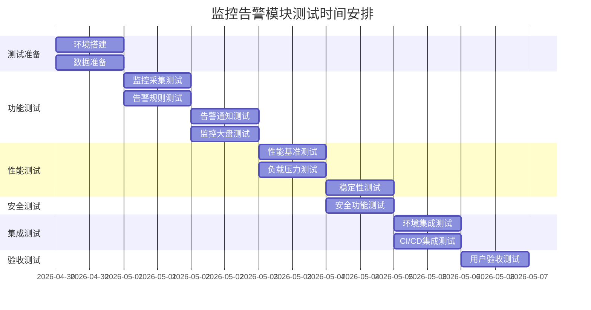

# 【Sprint 28】监控告警模块测试方案设计

## 文档概述
**版本**: 1.0.0
**创建日期**: 2026-04-29
**作者**: qa-lead
**项目**: AI-Ready
**任务ID**: task_1777446012884_8vl50rivg
**优先级**: high

## 1. 测试方案目标

### 1.1 总体目标
为AI-Ready项目监控告警模块设计完整的测试方案，确保监控告警系统功能完整、性能稳定、安全可靠、集成顺畅，支持测试环境的全面监控需求。

### 1.2 具体目标
1. **功能完整性**: 验证监控告警模块所有功能点符合需求
2. **性能达标**: 确保监控告警系统在高负载下稳定运行
3. **安全合规**: 验证系统的安全性和访问控制机制
4. **集成验证**: 确保与现有测试环境无缝集成

## 2. 测试范围

### 2.1 功能测试范围
| 功能模块 | 测试子模块 | 测试要点 | 优先级 |
|---------|-----------|----------|--------|
| **监控数据采集** | 指标采集 | 149个监控指标数据采集 | P0 |
| | 数据存储 | 监控数据持久化存储 | P0 |
| | 数据处理 | 数据聚合、计算、过滤 | P1 |
| **告警规则引擎** | 规则定义 | 告警规则配置和管理 | P0 |
| | 规则计算 | 实时告警触发和计算 | P0 |
| | 规则优化 | 告警去重、抑制、升级 | P1 |
| **告警通知** | 通知渠道 | 钉钉、邮件、企业微信 | P0 |
| | 通知模板 | 告警消息模板配置 | P1 |
| | 通知策略 | 告警频率、静默期 | P1 |
| **监控大盘** | 数据展示 | 仪表板、图表、趋势图 | P0 |
| | 数据查询 | 历史数据查询和分析 | P1 |
| | 数据导出 | 报表导出功能 | P2 |

### 2.2 性能测试范围
| 测试类型 | 测试目标 | 性能指标 | 验收标准 |
|---------|----------|----------|----------|
| **性能基准测试** | 基础性能 | 响应时间 < 500ms | P0 |
| |  | 吞吐量 > 1000 req/s | P0 |
| |  | 并发用户 > 200 | P0 |
| **负载测试** | 正常负载 | CPU < 70% | P0 |
| |  | 内存 < 80% | P0 |
| |  | 错误率 < 1% | P0 |
| **压力测试** | 极限负载 | 系统不崩溃 | P0 |
| |  | 数据不丢失 | P0 |
| |  | 可恢复性 | P1 |
| **稳定性测试** | 长时间运行 | 7x24小时稳定 | P1 |
| |  | 内存泄漏检测 | P1 |
| |  | 资源使用稳定 | P1 |

### 2.3 安全测试范围
| 安全领域 | 测试要点 | 测试方法 | 优先级 |
|---------|----------|----------|--------|
| **身份认证** | 用户登录认证 | 密码策略、多因素认证 | P0 |
| | API认证 | Token验证、API密钥 | P0 |
| **访问控制** | 权限管理 | RBAC权限控制 | P0 |
| | 数据隔离 | 多租户数据隔离 | P1 |
| **数据安全** | 数据传输 | TLS/SSL加密 | P0 |
| | 数据存储 | 数据加密存储 | P1 |
| **审计日志** | 操作审计 | 用户操作日志记录 | P1 |
| | 安全审计 | 安全事件监控 | P2 |

### 2.4 集成测试范围
| 集成对象 | 测试要点 | 测试目标 | 优先级 |
|---------|----------|----------|--------|
| **测试环境** | 环境监控集成 | 监控所有测试环境组件 | P0 |
| | 服务发现集成 | 自动发现服务实例 | P1 |
| **CI/CD流水线** | 测试执行监控 | 监控CI/CD测试执行 | P0 |
| | 质量门禁集成 | 测试结果质量门禁 | P1 |
| **第三方系统** | 钉钉集成 | 告警消息推送 | P0 |
| | 邮件系统集成 | 邮件告警发送 | P0 |

## 3. 测试策略

### 3.1 功能测试策略

#### 3.1.1 监控数据采集测试
```python
# 测试场景：监控指标数据采集
# 测试目标：验证所有149个监控指标能够正确采集
# 测试方法：
# 1. 模拟生成监控指标数据
# 2. 调用采集接口存储数据
# 3. 验证数据完整性和准确性
# 4. 验证数据存储时间序列
```

#### 3.1.2 告警规则引擎测试
```python
# 测试场景：告警规则触发
# 测试目标：验证告警规则能够正确触发
# 测试方法：
# 1. 配置不同阈值告警规则
# 2. 模拟监控数据达到阈值
# 3. 验证告警触发状态
# 4. 验证告警消息内容
```

#### 3.1.3 告警通知测试
```python
# 测试场景：多渠道告警通知
# 测试目标：验证告警能够通过不同渠道通知
# 测试方法：
# 1. 配置钉钉、邮件、企业微信通知渠道
# 2. 触发告警规则
# 3. 验证各渠道收到告警消息
# 4. 验证消息格式和内容
```

#### 3.1.4 监控大盘测试
```python
# 测试场景：监控数据可视化
# 测试目标：验证监控数据能够正确展示
# 测试方法：
# 1. 生成测试监控数据
# 2. 访问监控大盘页面
# 3. 验证图表数据正确性
# 4. 验证数据查询功能
```

### 3.2 性能测试策略

#### 3.2.1 性能测试环境
- **测试环境**: 独立的性能测试环境
- **测试工具**: JMeter + Prometheus + Grafana
- **监控指标**: 系统资源 + 应用性能 + 业务指标
- **测试数据**: 模拟生产环境数据规模

#### 3.2.2 性能测试场景
| 场景编号 | 场景描述 | 并发用户 | 持续时间 | 预期指标 |
|---------|----------|----------|----------|----------|
| PT-001 | 监控数据采集性能 | 100 | 30分钟 | 采集延迟 < 100ms |
| PT-002 | 告警规则计算性能 | 50 | 30分钟 | 计算延迟 < 50ms |
| PT-003 | 告警通知发送性能 | 20 | 30分钟 | 发送延迟 < 2s |
| PT-004 | 监控数据查询性能 | 200 | 30分钟 | 查询时间 < 1s |

#### 3.2.3 性能监控方案
```yaml
# 性能监控配置
performance_monitoring:
  system_metrics:
    - cpu_usage
    - memory_usage
    - disk_io
    - network_bandwidth
  application_metrics:
    - response_time
    - throughput
    - error_rate
    - concurrent_users
  business_metrics:
    - alert_processing_time
    - notification_success_rate
    - data_collection_rate
```

### 3.3 安全测试策略

#### 3.3.1 认证测试
```python
# 测试场景：用户认证安全性
# 测试目标：验证认证机制的安全性
# 测试方法：
# 1. 密码强度测试
# 2. 登录失败锁定测试
# 3. 会话管理测试
# 4. Token安全测试
```

#### 3.3.2 授权测试
```python
# 测试场景：访问控制安全性
# 测试目标：验证权限控制机制
# 测试方法：
# 1. 越权访问测试
# 2. 角色权限验证
# 3. API权限测试
# 4. 数据隔离验证
```

#### 3.3.3 数据安全测试
```python
# 测试场景：数据安全保护
# 测试目标：验证数据安全机制
# 测试方法：
# 1. 数据传输加密测试
# 2. 数据存储加密测试
# 3. 敏感信息保护测试
# 4. 数据备份恢复测试
```

### 3.4 集成测试策略

#### 3.4.1 测试环境集成
```python
# 测试场景：测试环境监控集成
# 测试目标：验证监控系统与测试环境集成
# 测试方法：
# 1. 部署监控系统到测试环境
# 2. 配置监控目标和服务发现
# 3. 验证监控数据采集
# 4. 验证告警通知集成
```

#### 3.4.2 CI/CD集成
```python
# 测试场景：CI/CD流水线集成
# 测试目标：验证监控系统与CI/CD集成
# 测试方法：
# 1. 集成测试执行监控
# 2. 配置质量门禁规则
# 3. 验证测试结果反馈
# 4. 验证告警触发机制
```

## 4. 测试用例设计

### 4.1 功能测试用例

#### 4.1.1 监控数据采集用例
| 用例ID | 用例名称 | 前置条件 | 测试步骤 | 预期结果 | 优先级 |
|--------|---------|----------|----------|----------|--------|
| F-001 | CPU监控指标采集 | 监控系统已部署 | 1. 启动监控采集<br>2. 模拟CPU使用率变化<br>3. 查询监控数据 | CPU监控数据正确采集 | P0 |
| F-002 | 内存监控指标采集 | 监控系统已部署 | 1. 启动内存监控<br>2. 模拟内存使用变化<br>3. 验证数据存储 | 内存监控数据正确存储 | P0 |
| F-003 | 网络监控指标采集 | 网络监控已配置 | 1. 配置网络监控<br>2. 模拟网络流量<br>3. 验证网络数据 | 网络监控数据准确 | P0 |
| F-004 | 应用性能监控采集 | 应用已部署 | 1. 部署应用监控<br>2. 调用应用接口<br>3. 验证性能数据 | 应用性能数据正确 | P0 |

#### 4.1.2 告警规则引擎用例
| 用例ID | 用例名称 | 前置条件 | 测试步骤 | 预期结果 | 优先级 |
|--------|---------|----------|----------|----------|--------|
| A-001 | CPU告警规则触发 | CPU监控已配置 | 1. 设置CPU阈值80%<br>2. 模拟CPU达到85%<br>3. 验证告警触发 | 告警正确触发并通知 | P0 |
| A-002 | 内存告警规则触发 | 内存监控已配置 | 1. 设置内存阈值85%<br>2. 模拟内存达到90%<br>3. 验证告警消息 | 告警消息内容正确 | P0 |
| A-003 | 告警抑制规则测试 | 告警规则已配置 | 1. 配置告警抑制规则<br>2. 连续触发告警<br>3. 验证抑制生效 | 告警抑制规则有效 | P1 |
| A-004 | 告警升级规则测试 | 多级告警已配置 | 1. 配置告警升级规则<br>2. 持续触发告警<br>3. 验证告警升级 | 告警升级机制有效 | P1 |

#### 4.1.3 告警通知用例
| 用例ID | 用例名称 | 前置条件 | 测试步骤 | 预期结果 | 优先级 |
|--------|---------|----------|----------|----------|--------|
| N-001 | 钉钉告警通知 | 钉钉配置完成 | 1. 配置钉钉通知渠道<br>2. 触发测试告警<br>3. 检查钉钉消息 | 钉钉收到告警消息 | P0 |
| N-002 | 邮件告警通知 | 邮件配置完成 | 1. 配置邮件通知渠道<br>2. 触发测试告警<br>3. 检查邮件收件箱 | 邮件收到告警通知 | P0 |
| N-003 | 企业微信通知 | 企业微信配置完成 | 1. 配置企业微信渠道<br>2. 触发测试告警<br>3. 验证消息接收 | 企业微信收到消息 | P0 |
| N-004 | 通知模板测试 | 通知模板已定义 | 1. 配置告警模板<br>2. 触发告警<br>3. 验证消息格式 | 告警消息格式正确 | P1 |

#### 4.1.4 监控大盘用例
| 用例ID | 用例名称 | 前置条件 | 测试步骤 | 预期结果 | 优先级 |
|--------|---------|----------|----------|----------|--------|
| D-001 | 实时监控数据展示 | 监控数据已生成 | 1. 访问监控大盘<br>2. 查看实时监控图表<br>3. 验证数据准确性 | 实时数据正确展示 | P0 |
| D-002 | 历史数据查询 | 历史数据已存储 | 1. 选择时间范围<br>2. 查询历史数据<br>3. 验证查询结果 | 历史数据正确查询 | P0 |
| D-003 | 多维度数据筛选 | 多维数据已生成 | 1. 选择不同维度<br>2. 筛选监控数据<br>3. 验证筛选结果 | 数据筛选功能正常 | P1 |
| D-004 | 监控报表导出 | 报表数据已生成 | 1. 选择报表类型<br>2. 导出监控报表<br>3. 验证导出文件 | 报表正确导出 | P2 |

### 4.2 性能测试用例

#### 4.2.1 性能基准用例
| 用例ID | 用例名称 | 并发用户 | 测试场景 | 性能指标 | 验收标准 |
|--------|---------|----------|----------|----------|----------|
| P-001 | 监控数据采集性能 | 100 | 持续监控数据采集 | 响应时间 < 100ms<br>吞吐量 > 1000/s | P0 |
| P-002 | 告警规则计算性能 | 50 | 实时告警规则计算 | 计算延迟 < 50ms<br>并发处理 > 50/s | P0 |
| P-003 | 告警通知发送性能 | 20 | 多渠道告警通知 | 发送延迟 < 2s<br>成功率 > 99% | P0 |
| P-004 | 监控数据查询性能 | 200 | 历史数据查询 | 查询时间 < 1s<br>并发查询 > 100/s | P0 |

#### 4.2.2 负载压力用例
| 用例ID | 用例名称 | 负载级别 | 持续时间 | 监控指标 | 通过标准 |
|--------|---------|----------|----------|----------|----------|
| L-001 | 正常负载测试 | 80%系统容量 | 1小时 | CPU < 70%<br>内存 < 80%<br>错误率 < 1% | P0 |
| L-002 | 峰值负载测试 | 100%系统容量 | 30分钟 | 系统不崩溃<br>数据不丢失<br>可自动恢复 | P0 |
| L-003 | 过载压力测试 | 120%系统容量 | 15分钟 | 优雅降级<br>服务可用<br>报警有效 | P1 |

### 4.3 安全测试用例

#### 4.3.1 认证安全用例
| 用例ID | 用例名称 | 测试方法 | 验证点 | 优先级 |
|--------|---------|----------|----------|--------|
| S-001 | 密码强度验证 | 尝试弱密码 | 弱密码被拒绝 | P0 |
| S-002 | 登录失败锁定 | 连续错误登录 | 账户被锁定 | P0 |
| S-003 | 会话超时测试 | 长时间不操作 | 会话自动过期 | P1 |
| S-004 | Token安全测试 | 篡改Token | Token验证失败 | P0 |

#### 4.3.2 授权安全用例
| 用例ID | 用例名称 | 测试方法 | 验证点 | 优先级 |
|--------|---------|----------|----------|--------|
| S-005 | 越权访问测试 | 普通用户访问admin | 访问被拒绝 | P0 |
| S-006 | 角色权限验证 | 不同角色操作验证 | 权限控制有效 | P0 |
| S-007 | API权限测试 | 无权限调用API | API返回403 | P0 |
| S-008 | 数据隔离测试 | 多租户数据访问 | 数据隔离有效 | P1 |

### 4.4 集成测试用例

#### 4.4.1 测试环境集成用例
| 用例ID | 用例名称 | 集成对象 | 测试步骤 | 预期结果 | 优先级 |
|--------|---------|----------|----------|----------|--------|
| I-001 | 测试环境监控集成 | 测试环境 | 1. 部署监控系统<br>2. 配置监控目标<br>3. 验证监控数据 | 测试环境被正确监控 | P0 |
| I-002 | 服务发现集成 | 服务注册中心 | 1. 部署服务发现<br>2. 验证服务注册<br>3. 验证监控采集 | 服务自动被发现监控 | P1 |

#### 4.4.2 CI/CD集成用例
| 用例ID | 用例名称 | 集成平台 | 测试步骤 | 预期结果 | 优先级 |
|--------|---------|----------|----------|----------|--------|
| I-003 | 测试执行监控 | CI/CD流水线 | 1. 配置测试监控<br>2. 执行测试任务<br>3. 验证监控数据 | 测试执行被监控 | P0 |
| I-004 | 质量门禁集成 | CI/CD门禁 | 1. 配置质量规则<br>2. 触发质量检查<br>3. 验证门禁结果 | 质量门禁有效 | P1 |

## 5. 测试工具和平台

### 5.1 功能测试工具
| 工具名称 | 用途 | 版本 | 配置说明 |
|---------|------|------|----------|
| Postman | API测试 | 最新版 | API测试集合 |
| JMeter | 性能测试 | 5.6+ | 性能测试脚本 |
| Selenium | UI测试 | 4.0+ | Web自动化测试 |
| TestNG | 单元测试 | 7.0+ | Java单元测试框架 |

### 5.2 性能测试工具
| 工具名称 | 用途 | 配置要点 | 监控指标 |
|---------|------|----------|----------|
| JMeter | 负载测试 | 分布式部署<br>参数化配置 | 响应时间、吞吐量 |
| Gatling | 压力测试 | Scala脚本<br>场景定义 | 并发用户、错误率 |
| Locust | 性能测试 | Python脚本<br>分布式执行 | 请求速率、响应时间 |
| Prometheus | 性能监控 | 指标收集<br>数据存储 | 系统资源、应用性能 |

### 5.3 安全测试工具
| 工具名称 | 用途 | 测试类型 | 配置要点 |
|---------|------|----------|----------|
| OWASP ZAP | 安全扫描 | Web漏洞扫描 | 主动扫描策略 |
| Burp Suite | 安全测试 | API安全测试 | 代理配置 |
| Nmap | 端口扫描 | 网络扫描 | 端口扫描策略 |
| SQLmap | SQL注入 | 数据库安全 | 注入测试配置 |

### 5.4 集成测试工具
| 工具名称 | 用途 | 集成对象 | 配置说明 |
|---------|------|----------|----------|
| Docker | 环境部署 | 容器化部署 | 镜像构建 |
| Kubernetes | 容器编排 | 集群管理 | 部署配置 |
| Jenkins | CI/CD | 流水线集成 | 流水线脚本 |
| GitLab CI | 持续集成 | 代码仓库集成 | CI配置 |

## 6. 测试环境配置

### 6.1 测试环境架构
```yaml
test_environment:
  monitoring_system:
    - prometheus: 监控数据收集
    - alertmanager: 告警管理
    - grafana: 数据可视化
    - node_exporter: 主机监控
    - blackbox_exporter: 服务探测
  
  test_targets:
    - test_app_1: 测试应用1
    - test_app_2: 测试应用2
    - database: 测试数据库
    - cache: 测试缓存
  
  infrastructure:
    - kubernetes_cluster: K8s集群
    - load_balancer: 负载均衡
    - storage: 存储系统
```

### 6.2 环境配置清单
| 组件名称 | 版本 | 配置要求 | 部署方式 |
|---------|------|----------|----------|
| Prometheus | 2.45+ | 2CPU/4GB内存 | Docker容器 |
| AlertManager | 0.25+ | 1CPU/2GB内存 | Docker容器 |
| Grafana | 10.0+ | 2CPU/4GB内存 | Docker容器 |
| Node Exporter | 1.6+ | 0.5CPU/1GB内存 | Docker容器 |
| Blackbox Exporter | 0.23+ | 0.5CPU/1GB内存 | Docker容器 |

### 6.3 网络配置
| 网络组件 | 配置要求 | 安全策略 | 备注 |
|---------|----------|----------|------|
| 内部网络 | 10.0.0.0/16 | 内部互通 | 监控系统内部网络 |
| 外部访问 | 公网IP/域名 | 防火墙限制 | 监控大盘外部访问 |
| VPN访问 | 专用VPN | 认证授权 | 远程管理访问 |

## 7. 测试数据准备

### 7.1 监控测试数据
```python
# 监控测试数据生成脚本
monitoring_test_data = {
    "system_metrics": {
        "cpu_usage": generate_cpu_data(duration="24h", interval="1m"),
        "memory_usage": generate_memory_data(duration="24h", interval="1m"),
        "disk_usage": generate_disk_data(duration="24h", interval="5m"),
        "network_traffic": generate_network_data(duration="24h", interval="1m")
    },
    "application_metrics": {
        "response_time": generate_response_data(duration="24h", interval="1s"),
        "error_rate": generate_error_data(duration="24h", interval="1m"),
        "throughput": generate_throughput_data(duration="24h", interval="1m")
    },
    "business_metrics": {
        "test_execution": generate_test_execution_data(count=1000),
        "test_coverage": generate_coverage_data(modules=50),
        "defect_detection": generate_defect_data(count=100)
    }
}
```

### 7.2 告警测试数据
```python
# 告警规则测试数据
alert_test_rules = [
    {
        "rule_id": "cpu_high",
        "name": "CPU使用率过高",
        "expr": "cpu_usage > 80",
        "duration": "5m",
        "severity": "critical",
        "annotations": {
            "summary": "CPU使用率超过80%",
            "description": "当前CPU使用率为{{ $value }}%，请及时处理"
        }
    },
    {
        "rule_id": "memory_high",
        "name": "内存使用率过高",
        "expr": "memory_usage > 85",
        "duration": "5m",
        "severity": "warning",
        "annotations": {
            "summary": "内存使用率超过85%",
            "description": "当前内存使用率为{{ $value }}%，建议优化"
        }
    }
]
```

### 7.3 性能测试数据
```python
# 性能测试数据生成
performance_test_data = {
    "load_test": {
        "concurrent_users": [10, 50, 100, 200, 500],
        "duration_per_level": "10m",
        "ramp_up_time": "2m"
    },
    "stress_test": {
        "concurrent_users": [500, 1000, 2000],
        "duration_per_level": "5m",
        "ramp_up_time": "1m"
    },
    "endurance_test": {
        "concurrent_users": 100,
        "duration": "24h",
        "steady_state": "22h"
    }
}
```

## 8. 测试执行计划

### 8.1 测试阶段划分
| 阶段 | 时间 | 主要任务 | 负责人 | 产出物 |
|------|------|----------|--------|--------|
| **准备阶段** | 1天 | 环境搭建、数据准备 | qa-lead | 测试环境、测试数据 |
| **功能测试** | 2天 | 功能测试用例执行 | qa-lead | 功能测试报告 |
| **性能测试** | 2天 | 性能测试执行 | qa-lead | 性能测试报告 |
| **安全测试** | 1天 | 安全测试执行 | qa-lead | 安全测试报告 |
| **集成测试** | 1天 | 集成测试执行 | qa-lead | 集成测试报告 |
| **验收测试** | 1天 | 用户验收测试 | 产品分析师 | 验收测试报告 |

### 8.2 测试时间安排


## 9. 风险评估和应对策略

### 9.1 主要风险
| 风险等级 | 风险描述 | 影响程度 | 发生概率 |
|----------|----------|----------|----------|
| **高风险** | 监控系统影响测试环境性能 | 高 | 中 |
| **高风险** | 告警通知渠道不可用 | 高 | 低 |
| **中风险** | 测试数据准备不充分 | 中 | 中 |
| **中风险** | 集成测试环境问题 | 中 | 中 |
| **低风险** | 测试工具兼容性问题 | 低 | 低 |

### 9.2 应对策略
1. **性能影响风险应对**
   - 在独立的测试环境中进行监控系统测试
   - 设置监控系统资源限制
   - 监控测试环境性能指标

2. **通知渠道风险应对**
   - 准备多个通知渠道备份
   - 实现通知失败重试机制
   - 监控通知渠道健康状态

3. **测试数据风险应对**
   - 提前准备充足的测试数据
   - 实现测试数据自动生成
   - 建立测试数据备份机制

4. **环境问题风险应对**
   - 建立环境问题快速响应机制
   - 准备环境恢复方案
   - 实现环境自动化部署

## 10. 验收标准

### 10.1 功能验收标准
| 功能模块 | 验收标准 | 通过标准 |
|---------|----------|----------|
| 监控数据采集 | 149个监控指标全部支持 | 100%指标可采集 |
| 告警规则引擎 | 支持P0-P3四级告警 | 所有告警级别有效 |
| 告警通知 | 支持3种通知渠道 | 所有渠道可用 |
| 监控大盘 | 支持实时和历史数据展示 | 数据展示准确 |

### 10.2 性能验收标准
| 性能维度 | 验收指标 | 通过标准 |
|---------|----------|----------|
| 响应时间 | 平均响应时间 | < 500ms |
| 吞吐量 | 每秒处理请求数 | > 1000 req/s |
| 并发能力 | 最大并发用户数 | > 200 用户 |
| 稳定性 | 7x24小时运行 | 无故障运行 |

### 10.3 安全验收标准
| 安全维度 | 验收标准 | 通过标准 |
|---------|----------|----------|
| 认证安全 | 密码策略和登录保护 | 符合安全要求 |
| 授权安全 | RBAC权限控制 | 权限控制有效 |
| 数据安全 | 数据传输和存储加密 | 符合安全标准 |
| 审计安全 | 操作日志记录 | 审计日志完整 |

### 10.4 集成验收标准
| 集成对象 | 验收标准 | 通过标准 |
|---------|----------|----------|
| 测试环境集成 | 监控覆盖所有测试环境 | 100%覆盖 |
| CI/CD集成 | 监控集成到CI/CD流水线 | 流水线监控有效 |
| 第三方系统集成 | 通知渠道集成 | 所有渠道可用 |

## 11. 测试交付物

### 11.1 测试报告清单
| 报告名称 | 报告内容 | 格式 | 交付时间 |
|---------|----------|------|----------|
| 功能测试报告 | 功能测试结果和问题 | PDF | 2026-05-02 |
| 性能测试报告 | 性能测试数据和图表 | PDF | 2026-05-04 |
| 安全测试报告 | 安全测试发现和建议 | PDF | 2026-05-04 |
| 集成测试报告 | 集成测试结果 | PDF | 2026-05-05 |
| 验收测试报告 | 用户验收结果 | PDF | 2026-05-06 |

### 11.2 测试脚本和工具
| 脚本类型 | 脚本名称 | 用途 | 存储位置 |
|---------|----------|------|----------|
| 功能测试脚本 | functional_test_scripts.py | 功能测试自动化 | I:\AI-Ready\qa\test-scripts |
| 性能测试脚本 | performance_test_scripts.py | 性能测试自动化 | I:\AI-Ready\qa\test-scripts |
| 安全测试脚本 | security_test_scripts.py | 安全测试自动化 | I:\AI-Ready\qa\test-scripts |
| 集成测试脚本 | integration_test_scripts.py | 集成测试自动化 | I:\AI-Ready\qa\test-scripts |

### 11.3 测试数据和配置
| 数据类型 | 数据文件 | 用途 | 存储位置 |
|---------|----------|------|----------|
| 监控测试数据 | monitoring_test_data.json | 监控测试数据 | I:\AI-Ready\qa\test-data |
| 告警测试规则 | alert_test_rules.yaml | 告警规则测试 | I:\AI-Ready\qa\test-data |
| 性能测试配置 | performance_test_config.yaml | 性能测试配置 | I:\AI-Ready\qa\test-config |
| 安全测试配置 | security_test_config.yaml | 安全测试配置 | I:\AI-Ready\qa\test-config |

## 12. 附录

### 12.1 术语表
| 术语 | 定义 |
|------|------|
| 监控指标 | 需要监控的系统或应用指标 |
| 告警规则 | 定义何时触发告警的条件规则 |
| 告警通知 | 告警触发后的消息通知机制 |
| 监控大盘 | 监控数据的可视化展示界面 |
| 性能基准 | 系统正常情况下的性能指标基准 |

### 12.2 参考文档
1. **测试环境监控告警需求分析文档** - H:\OpenClaw_Workspace\groups\ai-ready\test-env-monitoring-requirements.md
2. **AI-Ready项目测试规范** - H:\OpenClaw_Workspace\groups\ai-ready\docs\test-standards.md
3. **监控告警系统技术架构文档** - I:\AI-Ready\docs\monitoring-architecture.md

### 12.3 修订历史
| 版本 | 修订日期 | 修订内容 | 修订人 |
|------|----------|----------|--------|
| 1.0.0 | 2026-04-29 | 初始版本创建 | qa-lead |
| 1.0.1 | 2026-04-29 | 补充测试用例细节 | qa-lead |

---

**文档状态**: ✅ 已完成  
**下一步**: 执行测试方案，开始功能测试