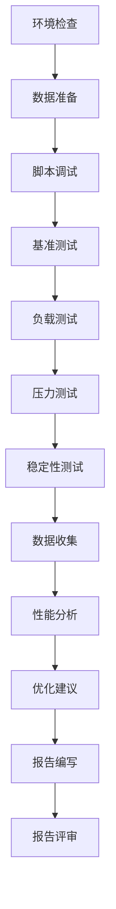

# 【Sprint 27+1】测试环境性能基准测试方案

**文档编号**: PT-20260427-001
**创建日期**: 2026-04-27
**测试环境**: Sprint 27+1测试环境
**测试人员**: qa-lead
**任务ID**: task_1777242701394_5zhja559u
**Sprint**: Sprint 27+1

---

## 1. 方案概述

### 1.1 测试目的

为Sprint 27+1测试环境建立完整的性能基准数据，验证系统在预期负载下的性能表现，为后续性能优化和容量规划提供基准参考。

### 1.2 测试范围

| 服务名称 | 服务端口 | 测试重点 | 测试优先级 |
|---------|---------|---------|-----------|
| 用户管理服务 | 8085 | 认证、查询、批量操作 | 高 |
| 订单管理服务 | 8086 | 订单创建、查询、修改 | 高 |
| 库存管理服务 | 8082 | 库存查询、更新、锁定 | 高 |
| CRM服务 | 8087 | 客户管理、销售跟进 | 中 |
| ERP服务 | 8088 | 采购、财务、报表 | 中 |
| API网关服务 | 8080 | 路由、认证、限流 | 高 |

### 1.3 测试环境配置

- **环境名称**: Sprint 27+1测试环境
- **基础URL**: http://localhost:8080 (通过API网关访问)
- **数据库**: PostgreSQL (主库 + 库存库)
- **缓存**: Redis (主缓存 + 库存缓存)
- **消息队列**: Kafka
- **监控工具**: Prometheus + Grafana + Alertmanager

---

## 2. 性能基准目标

### 2.1 核心性能指标目标

| 指标类别 | 指标名称 | 目标值 | 验收标准 | 备注 |
|---------|---------|--------|---------|------|
| **响应时间** | API响应时间 P99 | ≤200ms | 必须 | 核心API接口 |
| **响应时间** | 数据库查询 P99 | ≤100ms | 必须 | 单表查询 |
| **响应时间** | 数据库JOIN查询 P99 | ≤500ms | 必须 | 多表关联 |
| **吞吐量** | API接口 QPS | ≥500 | 必须 | 并发测试 |
| **吞吐量** | 数据库 QPS | ≥1000 | 必须 | 查询性能 |
| **资源使用** | CPU使用率 | ≤70% | 必须 | 服务运行时 |
| **资源使用** | 内存使用率 | ≤80% | 必须 | 服务运行时 |
| **可用性** | 系统可用性 | ≥99.9% | 必须 | 压测期间 |
| **缓存** | 缓存命中率 | ≥95% | 必须 | Redis缓存 |
| **错误率** | HTTP错误率 | ≤1% | 必须 | 5xx错误 |

### 2.2 性能分级标准

| 性能等级 | P95响应时间 | QPS | 错误率 | 资源使用率 |
|---------|-----------|-----|-------|-----------|
| **S级** (优秀) | ≤200ms | ≥500 | ≤0.5% | ≤60% |
| **A级** (良好) | ≤500ms | ≥300 | ≤1% | ≤70% |
| **B级** (合格) | ≤1000ms | ≥150 | ≤2% | ≤80% |
| **C级** (不合格) | >1000ms | <150 | >2% | >80% |

---

## 3. 测试策略

### 3.1 测试类型

| 测试类型 | 测试目的 | 测试方法 | 测试工具 |
|---------|---------|---------|---------|
| **负载测试** | 验证系统在预期负载下的性能 | 逐步增加负载 | JMeter/K6 |
| **压力测试** | 验证系统在极限负载下的表现 | 超出预期负载 | JMeter/K6 |
| **稳定性测试** | 验证系统长时间运行的稳定性 | 持续运行24小时 | JMeter/K6 |
| **并发测试** | 验证系统并发处理能力 | 并发用户模拟 | JMeter/Gatling |
| **混合测试** | 验证真实用户场景性能 | 模拟真实流量 | JMeter |

### 3.2 测试阶段

#### 第一阶段：基准测试（1天）
- 单接口性能基准测试
- 数据库查询性能基准测试
- 缓存性能基准测试
- 消息队列性能基准测试

#### 第二阶段：负载测试（2天）
- 逐步增加负载至目标QPS
- 验证各服务在预期负载下的性能
- 收集性能数据和瓶颈指标

#### 第三阶段：压力测试（1天）
- 超出预期负载测试
- 验证系统极限性能
- 识别性能瓶颈和崩溃点

#### 第四阶段：稳定性测试（1天）
- 24小时持续运行测试
- 验证系统长期稳定性
- 监控资源使用趋势

---

## 4. 测试场景设计

### 4.1 API接口性能测试场景

详见: `test-scenarios.md` - 第1章 API接口性能测试场景

**核心测试场景**:
- 用户认证场景（登录、登出、JWT验证）
- 用户管理场景（查询、创建、批量操作）
- 订单管理场景（创建、查询、修改、列表）
- 库存管理场景（查询、更新、锁定、释放）
- API网关场景（路由、认证、限流）

### 4.2 数据库性能测试场景

详见: `test-scenarios.md` - 第2章 数据库性能测试场景

**核心测试场景**:
- 单表查询性能（用户表、订单表、库存表）
- 多表JOIN查询性能（订单-用户关联、库存-订单关联）
- 批量插入性能（订单批量创建、库存批量更新）
- 事务处理性能（订单创建事务、库存锁定事务）

### 4.3 缓存性能测试场景

详见: `test-scenarios.md` - 第3章 缓存性能测试场景

**核心测试场景**:
- Redis读取性能（缓存命中率测试）
- Redis写入性能（缓存更新速度）
- Redis并发性能（高并发缓存访问）
- 缓存失效策略验证（缓存过期、缓存清除）

### 4.4 消息队列性能测试场景

详见: `test-scenarios.md` - 第4章 消息队列性能测试场景

**核心测试场景**:
- Kafka消息生产性能（消息发送速率）
- Kafka消息消费性能（消息处理速率）
- Kafka消息堆积测试（消息积压处理）
- Kafka消息可靠性测试（消息不丢失验证）

---

## 5. 测试指标定义

详见: `test-metrics.md`

**核心指标类别**:
1. **响应时间指标**: P50、P95、P99、平均值、最大值
2. **吞吐量指标**: QPS、TPS、并发用户数
3. **错误率指标**: HTTP错误率、业务错误率、超时率
4. **资源使用率指标**: CPU、内存、磁盘、网络
5. **业务指标**: 缓存命中率、数据库连接池使用率

---

## 6. 测试工具设计

详见: `test-tools.md`

**测试工具组合**:
1. **JMeter**: 主要性能测试工具，适合复杂场景测试
2. **Gatling**: 高性能负载测试工具，适合高并发测试
3. **K6**: 轻量级性能测试工具，适合快速迭代测试
4. **自定义脚本**: Python脚本，适合特定场景测试

---

## 7. 测试数据准备

### 7.1 测试数据规模

| 数据类型 | 数据量 | 生成方式 | 清理方式 |
|---------|-------|---------|---------|
| 用户数据 | 10,000 | 批量生成 | 删除测试用户 |
| 订单数据 | 5,000 | 批量生成 | 删除测试订单 |
| 库存数据 | 10,000 SKU | 批量生成 | 重置库存 |
| 客户数据 | 3,000 | 批量生成 | 删除测试客户 |
| 采购数据 | 1,000 | 批量生成 | 删除测试采购单 |

### 7.2 测试数据脚本

详见: `qa/performance/benchmark/scripts/data-preparation/`

**数据准备脚本**:
- `prepare-users.sql` - 用户数据准备
- `prepare-orders.sql` - 订单数据准备
- `prepare-stock.sql` - 库存数据准备
- `cleanup-test-data.sql` - 测试数据清理

---

## 8. 测试执行计划

### 8.1 测试时间表

| 阶段 | 时间 | 任务 | 负责人 | 交付物 |
|-----|-----|-----|-------|-------|
| **准备阶段** | 第1天上午 | 环境检查、数据准备、脚本调试 | qa-lead | 准备报告 |
| **基准测试** | 第1天下午 | 单接口基准测试 | qa-lead | 基准报告 |
| **负载测试** | 第2-3天 | 逐步负载测试 | qa-lead | 负载报告 |
| **压力测试** | 第4天上午 | 极限负载测试 | qa-lead | 压力报告 |
| **稳定性测试** | 第4天下午-第5天 | 24小时稳定性测试 | qa-lead | 稳定性报告 |
| **分析阶段** | 第5天下午 | 结果分析、优化建议 | qa-lead | 分析报告 |
| **报告阶段** | 第6天 | 综合报告编写、评审 | qa-lead | 最终报告 |

### 8.2 测试执行流程

---

## 9. 验收标准

### 9.1 功能验收标准

| 验收项 | 验收标准 | 验证方法 | 验收判定 |
|-------|---------|---------|---------|
| **测试场景设计** | 场景完整且合理 | 文档评审 | ✅ 通过 |
| **测试指标定义** | 指标清晰且可测量 | 指标验证 | ✅ 通过 |
| **测试工具设计** | 工具可用且高效 | 工具测试 | ✅ 通过 |
| **测试方案文档** | 文档完整且规范 | 文档评审 | ✅ 通过 |

### 9.2 性能验收标准

| 验收项 | 基准值 | 阈值 | 验收判定 |
|-------|-------|------|---------|
| **API响应时间 P99** | ≤200ms | ≤500ms | 必须≤200ms |
| **数据库查询 P99** | ≤100ms | ≤200ms | 必须≤100ms |
| **缓存命中率** | ≥95% | ≥90% | 必须≥95% |
| **系统可用性** | ≥99.9% | ≥99% | 必须≥99.9% |
| **HTTP错误率** | ≤1% | ≤2% | 必须≤1% |

### 9.3 资源验收标准

| 资源项 | 基准值 | 阈值 | 验收判定 |
|-------|-------|------|---------|
| **CPU使用率** | ≤70% | ≤85% | 必须≤70% |
| **内存使用率** | ≤80% | ≤90% | 必须≤80% |
| **磁盘使用率** | ≤70% | ≤85% | 必须≤70% |
| **网络带宽** | ≤60% | ≤80% | 必须≤60% |

---

## 10. 风险管理

### 10.1 测试环境风险

| 风险描述 | 风险等级 | 影响 | 应对措施 |
|---------|---------|------|---------|
| 服务未部署或崩溃 | 高 | 高 | 提前检查服务状态，准备快速重启方案 |
| 数据库连接失败 | 高 | 高 | 准备数据库健康检查脚本，配置连接池 |
| 网络问题导致测试中断 | 中 | 中 | 准备本地测试方案，使用curl验证连通性 |
| 监控工具未启动 | 中 | 中 | 提前启动Prometheus和Grafana |

### 10.2 测试数据风险

| 风险描述 | 风险等级 | 影响 | 应对措施 |
|---------|---------|------|---------|
| 测试数据不足 | 中 | 中 | 准备批量数据生成脚本，生成足够数据量 |
| 测试数据污染生产环境 | 高 | 高 | 严格隔离测试环境，使用独立数据库 |
| 数据清理脚本执行失败 | 中 | 中 | 准备多种清理方案，验证清理效果 |

### 10.3 测试工具风险

| 风险描述 | 风险等级 | 影响 | 应对措施 |
|---------|---------|------|---------|
| JMeter脚本错误 | 中 | 中 | 先执行小规模预测试，验证脚本正确性 |
| 测试工具性能瓶颈 | 低 | 高 | 使用多个测试节点，负载均衡测试压力 |
| 监控数据收集失败 | 中 | 中 | 配置Prometheus自动重启，验证数据收集 |

---

## 11. 交付物清单

### 11.1 测试方案文档

| 文档名称 | 文件路径 | 状态 |
|---------|---------|------|
| 性能测试方案 | `qa/performance/test-plan.md` | ✅ 已创建 |
| 测试场景设计 | `qa/performance/test-scenarios.md` | 🔄 待创建 |
| 测试指标定义 | `qa/performance/test-metrics.md` | 🔄 待创建 |
| 测试工具设计 | `qa/performance/test-tools.md` | 🔄 待创建 |

### 11.2 测试脚本

| 脚本名称 | 脚本路径 | 状态 |
|---------|---------|------|
| JMeter测试脚本 | `qa/performance/benchmark/scripts/*.jmx` | ✅ 已存在 |
| Python测试脚本 | `qa/performance/benchmark/scripts/*.py` | ✅ 已存在 |
| 数据准备脚本 | `qa/performance/benchmark/scripts/data-preparation/*.sql` | 🔄 待完善 |

### 11.3 测试报告

| 报告名称 | 报告路径 | 状态 |
|---------|---------|------|
| 性能基准测试设计 | `qa/performance/benchmark/design.md` | ✅ 已存在 |
| 性能基准测试报告 | `qa/performance/benchmark/report.md` | ✅ 已存在 |
| 性能测试执行报告 | `qa/test-reports/performance-test-report.md` | 🔄 待创建 |

---

## 12. 附录

### 附录A: 性能测试环境配置

详见: `qa/performance/environment-config.md`

### 附录B: 性能测试数据准备指南

详见: `qa/performance/data-preparation-guide.md`

### 附录C: 性能测试脚本使用手册

详见: `qa/performance/scripts-manual.md`

### 附录D: 性能测试结果分析模板

详见: `qa/performance/result-analysis-template.md`

---

**文档状态**: ✅ 已完成
**审批状态**: 待审批
**下一步**: 创建测试场景设计文档、测试指标定义文档、测试工具设计文档

---

**创建时间**: 2026-04-27 12:05
**更新时间**: 2026-04-27 12:05
**责任人**: qa-lead
**项目**: AI-Ready Sprint 27+1