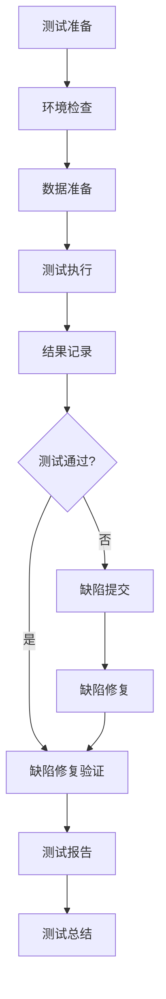

# Sprint 27+1 测试环境集成测试计划

**版本**: 1.0  
**创建日期**: 2026-04-27  
**作者**: test-agent-1  
**项目**: AI-Ready企业级ERP系统  
**Sprint**: Sprint 27+1  
**状态**: 执行中  

---

## 一、计划概述

### 1.1 测试目标
制定并执行Sprint 27+1测试环境的集成测试，确保各组件和模块在测试环境中协同工作正常，验证系统集成后的功能和性能符合预期。

### 1.2 测试范围
本集成测试计划覆盖以下组件和模块：

#### 核心业务模块
- **ERP模块**: 采购管理、库存管理、销售管理
- **CRM模块**: 客户管理、销售机会、服务工单
- **AI服务模块**: 智能分析、预测模型、推荐引擎

#### 技术组件
- **数据库层**: PostgreSQL主从集群、Redis缓存集群
- **消息队列**: RabbitMQ消息中间件
- **API网关**: Spring Cloud Gateway
- **配置中心**: Apollo配置管理
- **监控系统**: Prometheus + Grafana监控体系

### 1.3 测试时间安排
| 阶段 | 时间周期 | 主要工作内容 | 交付物 |
|------|----------|-------------|--------|
| 计划阶段 | 第1天 | 测试范围定义、策略设计、资源准备 | 测试计划文档 |
| 设计阶段 | 第2-3天 | 测试用例设计、测试数据准备 | 测试用例文档、测试数据 |
| 执行阶段 | 第4-7天 | 集成测试执行、缺陷跟踪、性能测试 | 测试报告、缺陷列表 |
| 总结阶段 | 第8天 | 结果分析、报告编写、经验总结 | 总结报告、改进建议 |

---

## 二、集成测试范围定义

### 2.1 测试组件与模块识别

#### 2.1.1 核心业务组件
1. **ERP采购管理模块**
   - 采购订单创建与审批
   - 供应商管理
   - 库存同步更新

2. **ERP库存管理模块**
   - 库存实时查询
   - 库存预警与补货
   - 多仓库库存同步

3. **CRM客户管理模块**
   - 客户信息同步
   - 销售机会跟踪
   - 服务请求处理

4. **AI智能分析模块**
   - 销售预测模型集成
   - 库存优化建议
   - 客户行为分析

#### 2.1.2 技术组件
1. **数据库集成**
   - PostgreSQL主从数据同步
   - Redis缓存数据一致性
   - 数据库连接池管理

2. **消息队列集成**
   - RabbitMQ消息路由与转发
   - 消息持久化与重试
   - 死信队列处理

3. **API网关集成**
   - 路由转发功能
   - 认证与授权
   - 限流与熔断

### 2.2 接口与依赖关系分析

#### 2.2.1 内部接口
| 接口方向 | 提供方 | 消费方 | 协议 | 频率 |
|---------|--------|--------|------|------|
| 采购-库存 | 采购模块 | 库存模块 | REST | 高 |
| 库存-销售 | 库存模块 | 销售模块 | REST | 高 |
| 销售-CRM | 销售模块 | CRM模块 | REST | 中 |
| 数据同步 | 数据库 | Redis缓存 | JDBC | 高 |

#### 2.2.2 外部依赖
- **支付网关接口**: 第三方支付平台
- **物流接口**: 快递公司API
- **短信服务**: 短信平台接口
- **邮件服务**: SMTP服务

### 2.3 集成测试场景设计

#### 2.3.1 业务流程集成场景
1. **端到端采购流程**
   - 场景: 创建采购订单 → 审批 → 供应商确认 → 库存更新 → 付款
   - 涉及组件: 采购模块、审批流、供应商接口、库存模块、支付接口

2. **客户服务全流程**
   - 场景: 客户投诉 → 工单创建 → 分配处理 → 解决方案 → 客户反馈
   - 涉及组件: CRM模块、工单系统、通知服务、评价系统

3. **智能推荐流程**
   - 场景: 用户浏览 → 行为采集 → AI分析 → 推荐生成 → 用户响应
   - 涉及组件: 前端采集、数据管道、AI模型、推荐服务

#### 2.3.2 技术组件集成场景
1. **数据库集群高可用切换**
   - 场景: 主库故障 → 自动切换从库 → 业务连续性验证
   - 验证点: 切换时间、数据一致性、业务影响

2. **消息队列积压处理**
   - 场景: 消息积压 → 消费者扩展 → 积压清理 → 恢复正常
   - 验证点: 扩展机制、积压监控、恢复时间

3. **API网关熔断与恢复**
   - 场景: 后端服务异常 → 网关熔断 → 服务恢复 → 自动恢复
   - 验证点: 熔断阈值、降级策略、恢复机制

### 2.4 测试数据需求分析

#### 2.4.1 数据规模要求
| 数据类型 | 数据量 | 数据分布 | 更新频率 |
|---------|--------|---------|---------|
| 客户数据 | 10,000条 | 80%活跃客户 | 每日更新 |
| 产品数据 | 5,000条 | 30%热销产品 | 每周更新 |
| 订单数据 | 50,000条 | 近3个月数据 | 实时产生 |
| 库存数据 | 20,000条 | 多仓库分布 | 实时同步 |

#### 2.4.2 数据准备策略
1. **基础数据**: 使用脚本从生产环境脱敏导出
2. **业务数据**: 通过业务操作模拟生成
3. **异常数据**: 手动构造边界条件和异常场景
4. **性能数据**: 使用压测工具生成大容量数据

---

## 三、测试策略设计

### 3.1 集成测试方法选择

#### 3.1.1 测试类型组合
1. **功能集成测试**: 验证业务功能跨模块协作
2. **接口集成测试**: 验证组件间接口的正确性
3. **性能集成测试**: 验证系统在集成状态下的性能
4. **安全集成测试**: 验证集成环境的安全性
5. **容错集成测试**: 验证系统在异常情况下的容错能力

#### 3.1.2 测试策略矩阵
| 测试类型 | 测试方法 | 测试工具 | 验证重点 |
|---------|---------|---------|---------|
| 功能集成 | 黑盒测试、场景测试 | Postman, Selenium | 业务流程完整性 |
| 接口集成 | 灰盒测试、契约测试 | Swagger, Pact | 接口规范一致性 |
| 性能集成 | 负载测试、压力测试 | JMeter, Gatling | 系统性能表现 |
| 安全集成 | 渗透测试、漏洞扫描 | OWASP ZAP, Nessus | 安全漏洞检测 |
| 容错集成 | 故障注入、混沌工程 | Chaos Monkey, Gremlin | 系统稳定性 |

### 3.2 测试环境配置要求

#### 3.2.1 环境规格
| 环境组件 | 数量 | 配置要求 | 网络要求 |
|---------|------|---------|---------|
| 应用服务器 | 4台 | 8核16GB, 200GB SSD | 内网互通 |
| 数据库服务器 | 2台 | 16核32GB, 500GB SSD | 主从同步 |
| 缓存服务器 | 3台 | 4核8GB, 100GB RAM | 集群模式 |
| 消息队列 | 2台 | 4核8GB, 200GB SSD | 集群模式 |
| 监控服务器 | 1台 | 4核8GB, 500GB HDD | 可访问所有节点 |

#### 3.2.2 环境隔离要求
1. **网络隔离**: 测试环境与生产环境物理隔离
2. **数据隔离**: 测试数据与生产数据逻辑隔离
3. **权限隔离**: 测试环境使用专用账号和权限
4. **资源隔离**: 测试环境有独立的计算和存储资源

### 3.3 测试数据管理策略

#### 3.3.1 数据生命周期管理
1. **数据准备阶段**
   - 数据抽取: 从生产环境脱敏抽取
   - 数据生成: 使用工具生成模拟数据
   - 数据验证: 验证数据的完整性和一致性

2. **测试执行阶段**
   - 数据隔离: 每个测试用例使用独立数据
   - 数据快照: 关键测试前创建数据快照
   - 数据恢复: 测试失败后恢复数据状态

3. **测试结束后**
   - 数据归档: 重要测试数据归档保存
   - 数据清理: 清理临时测试数据
   - 数据报告: 生成数据使用情况报告

#### 3.3.2 数据质量控制
- **完整性**: 数据覆盖所有业务场景
- **准确性**: 数据符合业务规则和约束
- **一致性**: 数据在不同组件间保持一致
- **时效性**: 数据反映最新业务状态

### 3.4 测试执行与监控方案

#### 3.4.1 测试执行流程

#### 3.4.2 监控指标
| 监控维度 | 监控指标 | 告警阈值 | 监控工具 |
|---------|---------|---------|---------|
| 测试进度 | 测试用例执行率 | < 80% | TestRail |
| 测试质量 | 缺陷密度 | > 0.5缺陷/千行 | Jira |
| 环境状态 | 服务可用率 | < 99% | Prometheus |
| 性能指标 | API响应时间P95 | > 2000ms | Grafana |
| 资源使用 | CPU使用率 | > 85% | Zabbix |

#### 3.4.3 缺陷管理流程
1. **缺陷发现**: 测试执行过程中发现缺陷
2. **缺陷记录**: 在Jira中详细记录缺陷信息
3. **缺陷分配**: 根据模块分配给相应开发人员
4. **缺陷修复**: 开发人员修复缺陷
5. **缺陷验证**: 测试人员验证修复结果
6. **缺陷关闭**: 验证通过后关闭缺陷

---

## 四、测试用例设计

### 4.1 功能集成测试用例

#### 4.1.1 采购流程集成测试
| 用例ID | 用例名称 | 前置条件 | 测试步骤 | 预期结果 | 优先级 |
|--------|---------|---------|---------|---------|--------|
| INT-001 | 采购订单创建到库存更新 | 供应商已注册，产品已维护 | 1.创建采购订单 2.审批通过 3.供应商确认 4.查看库存更新 | 库存数量正确增加，状态同步更新 | 高 |
| INT-002 | 多仓库采购分配 | 多个仓库有库存需求 | 1.创建集中采购订单 2.设置仓库分配规则 3.执行库存分配 | 各仓库库存按规则分配，库存记录正确 | 中 |
| INT-003 | 采购退货流程 | 采购入库后发现质量问题 | 1.创建退货申请 2.审批通过 3.供应商确认退货 4.库存扣减 | 库存正确扣减，退货状态更新 | 高 |

#### 4.1.2 销售流程集成测试
| 用例ID | 用例名称 | 前置条件 | 测试步骤 | 预期结果 | 优先级 |
|--------|---------|---------|---------|---------|--------|
| INT-101 | 销售订单创建到发货 | 客户已注册，产品有库存 | 1.创建销售订单 2.库存锁定 3.订单审批 4.生成发货单 | 库存正确扣减，发货单生成 | 高 |
| INT-102 | 销售退货处理 | 客户退货请求 | 1.创建退货申请 2.审核通过 3.库存恢复 4.退款处理 | 库存正确恢复，退款状态更新 | 中 |
| INT-103 | 销售与CRM集成 | 客户购买产品 | 1.客户购买产品 2.查看CRM客户购买记录 3.查看销售机会状态 | CRM记录更新，销售机会状态变更 | 高 |

### 4.2 性能集成测试用例

#### 4.2.1 并发处理能力测试
| 用例ID | 测试场景 | 并发用户数 | 持续时间 | 性能指标 | 通过标准 |
|--------|---------|-----------|---------|---------|---------|
| PERF-001 | 采购订单并发创建 | 100用户 | 10分钟 | 响应时间P95, TPS | P95≤2s, TPS≥50 |
| PERF-002 | 库存查询并发访问 | 200用户 | 15分钟 | 响应时间P95, 错误率 | P95≤1s, 错误率<1% |
| PERF-003 | 销售订单批量处理 | 50用户 | 20分钟 | 处理吞吐量, 资源使用率 | 吞吐量≥100订单/分钟, CPU<80% |

#### 4.2.2 数据一致性测试
| 用例ID | 测试场景 | 测试方法 | 验证点 | 通过标准 |
|--------|---------|---------|-------|---------|
| CONS-001 | 库存同步延迟 | 模拟网络延迟 | 库存数据一致性 | 最终一致性在5秒内达成 |
| CONS-002 | 订单状态同步 | 强制重启服务 | 订单状态恢复 | 重启后状态正确恢复 |
| CONS-003 | 缓存数据更新 | 缓存失效策略 | 缓存与数据库一致性 | 缓存更新延迟≤1秒 |

### 4.3 安全集成测试用例

#### 4.3.1 接口安全测试
| 用例ID | 测试类型 | 测试方法 | 验证点 | 通过标准 |
|--------|---------|---------|-------|---------|
| SEC-001 | 认证绕过 | 未授权访问尝试 | 接口访问控制 | 返回401/403错误 |
| SEC-002 | 注入攻击 | SQL注入、XSS尝试 | 输入验证和过滤 | 攻击被阻止，无数据泄露 |
| SEC-003 | 敏感信息泄露 | 检查响应内容 | 信息脱敏 | 无敏感信息明文返回 |

#### 4.3.2 数据安全测试
| 用例ID | 测试场景 | 测试方法 | 验证点 | 通过标准 |
|--------|---------|---------|-------|---------|
| DSEC-001 | 数据传输加密 | 抓包分析 | 传输层安全 | 使用TLS 1.2+加密 |
| DSEC-002 | 数据存储加密 | 数据库文件检查 | 存储加密 | 敏感字段加密存储 |
| DSEC-003 | 数据访问控制 | 越权访问尝试 | 权限验证 | 无法访问未授权数据 |

### 4.4 容错与恢复测试用例

#### 4.4.1 服务故障恢复
| 用例ID | 故障场景 | 恢复操作 | 验证点 | 通过标准 |
|--------|---------|---------|-------|---------|
| FT-001 | 数据库主节点故障 | 自动切换从节点 | 业务连续性 | 切换时间≤30秒 |
| FT-002 | 缓存集群节点故障 | 集群自动重平衡 | 缓存可用性 | 无业务中断 |
| FT-003 | 消息队列故障 | 消息持久化恢复 | 消息不丢失 | 消息100%恢复 |

#### 4.4.2 网络异常测试
| 用例ID | 异常场景 | 模拟方法 | 验证点 | 通过标准 |
|--------|---------|---------|-------|---------|
| NET-001 | 网络延迟增加 | 模拟网络延迟 | 超时处理 | 请求正确超时，无死锁 |
| NET-002 | 网络丢包 | 模拟丢包率 | 重试机制 | 请求最终成功 |
| NET-003 | 网络分区 | 模拟网络分区 | 服务降级 | 降级策略生效 |

---

## 五、测试执行计划

### 5.1 测试任务分解

#### 5.1.1 第一周：准备与设计
| 任务编号 | 任务名称 | 负责人 | 开始日期 | 结束日期 | 交付物 |
|---------|---------|--------|---------|---------|-------|
| T1.1 | 环境准备与配置 | DevOps | 2026-04-28 | 2026-04-28 | 环境检查报告 |
| T1.2 | 测试数据准备 | QA | 2026-04-28 | 2026-04-29 | 测试数据集 |
| T1.3 | 测试用例设计 | QA | 2026-04-29 | 2026-04-30 | 测试用例文档 |

#### 5.1.2 第二周：执行与验证
| 任务编号 | 任务名称 | 负责人 | 开始日期 | 结束日期 | 交付物 |
|---------|---------|--------|---------|---------|-------|
| T2.1 | 功能集成测试执行 | QA | 2026-05-01 | 2026-05-03 | 功能测试报告 |
| T2.2 | 性能集成测试执行 | 性能团队 | 2026-05-04 | 2026-05-05 | 性能测试报告 |
| T2.3 | 安全集成测试执行 | 安全团队 | 2026-05-06 | 2026-05-06 | 安全测试报告 |

#### 5.1.3 第三周：总结与改进
| 任务编号 | 任务名称 | 负责人 | 开始日期 | 结束日期 | 交付物 |
|---------|---------|--------|---------|---------|-------|
| T3.1 | 缺陷跟踪与验证 | QA | 2026-05-07 | 2026-05-08 | 缺陷状态报告 |
| T3.2 | 测试总结报告 | QA Lead | 2026-05-09 | 2026-05-09 | 测试总结报告 |
| T3.3 | 改进建议制定 | 所有团队 | 2026-05-10 | 2026-05-10 | 改进计划 |

### 5.2 资源分配

#### 5.2.1 人力资源
| 角色 | 人数 | 主要职责 | 参与阶段 |
|-----|------|---------|---------|
| 测试经理 | 1 | 测试计划制定、进度跟踪、资源协调 | 全程 |
| 功能测试工程师 | 3 | 功能测试用例设计、执行、缺陷跟踪 | 设计+执行 |
| 性能测试工程师 | 2 | 性能测试设计、执行、分析 | 性能测试阶段 |
| 安全测试工程师 | 1 | 安全测试设计、执行、报告 | 安全测试阶段 |
| DevOps工程师 | 2 | 环境准备、维护、监控 | 全程 |
| 开发工程师 | 4 | 缺陷修复、技术支持 | 执行+验证 |

#### 5.2.2 工具资源
| 工具类型 | 工具名称 | 用途 | 许可证 |
|---------|---------|------|--------|
| 测试管理 | TestRail | 测试用例管理、执行跟踪 | 企业版 |
| 缺陷管理 | Jira | 缺陷跟踪、工作流管理 | 企业版 |
| 功能测试 | Postman, Selenium | API测试、UI自动化测试 | 开源+企业版 |
| 性能测试 | JMeter, Gatling | 负载测试、压力测试 | 开源 |
| 安全测试 | OWASP ZAP, Nessus | 安全扫描、漏洞检测 | 开源+商业 |
| 监控工具 | Prometheus, Grafana | 系统监控、性能监控 | 开源 |

### 5.3 风险与应对措施

#### 5.3.1 主要风险识别
| 风险编号 | 风险描述 | 可能性 | 影响程度 | 风险等级 |
|---------|---------|--------|---------|---------|
| R1 | 测试环境不稳定 | 中 | 高 | 高 |
| R2 | 测试数据准备不足 | 高 | 中 | 中 |
| R3 | 关键人员不可用 | 低 | 高 | 中 |
| R4 | 测试进度延误 | 中 | 中 | 中 |
| R5 | 严重缺陷修复延迟 | 中 | 高 | 高 |

#### 5.3.2 风险应对措施
1. **环境不稳定性风险**
   - 预防措施: 提前进行环境稳定性验证
   - 缓解措施: 准备备用环境，定期环境检查
   - 应急计划: 环境故障时切换备用环境

2. **测试数据不足风险**
   - 预防措施: 提前制定详细的数据准备计划
   - 缓解措施: 准备数据生成工具和脚本
   - 应急计划: 使用简化数据执行关键测试

3. **人员不可用风险**
   - 预防措施: 建立人员备份机制
   - 缓解措施: 文档化和知识共享
   - 应急计划: 调整任务分配，优先执行关键测试

### 5.4 沟通与报告机制

#### 5.4.1 沟通计划
| 会议类型 | 频率 | 参与人员 | 主要内容 |
|---------|------|---------|---------|
| 每日站会 | 每天 | 测试团队 | 进度更新、问题反馈、当日计划 |
| 每周例会 | 每周 | 所有相关团队 | 整体进度、风险讨论、决策制定 |
| 里程碑评审 | 每阶段结束 | 项目领导、各团队负责人 | 阶段成果评审、下阶段计划 |
| 缺陷评审会 | 根据需要 | 开发、测试、产品 | 缺陷优先级评估、修复计划 |

#### 5.4.2 报告机制
1. **每日进度报告**
   - 发送时间: 每天下班前
   - 接收者: 测试经理、项目领导
   - 内容: 当日完成工作、发现问题、明日计划

2. **每周总结报告**
   - 发送时间: 每周五
   - 接收者: 所有相关团队
   - 内容: 本周进展、下周计划、风险状态

3. **里程碑报告**
   - 发送时间: 每个里程碑结束
   - 接收者: 项目领导、客户代表
   - 内容: 里程碑成果、质量评估、经验总结

---

## 六、验收标准与退出标准

### 6.1 验收标准

#### 6.1.1 功能集成验收标准
1. **业务流程完整性**
   - 所有设计的关键业务流程能够完整执行
   - 跨模块数据流转正确无误
   - 业务规则和约束得到正确实施

2. **接口一致性**
   - 所有接口符合设计规范
   - 数据传输格式正确
   - 错误处理机制健全

3. **数据一致性**
   - 跨组件数据同步正确
   - 事务处理满足ACID要求
   - 数据最终一致性得到保证

#### 6.1.2 性能验收标准
1. **响应时间要求**
   - 核心业务操作P95响应时间 ≤ 2秒
   - 查询类操作P95响应时间 ≤ 1秒
   - 批量处理操作P95响应时间 ≤ 30秒

2. **吞吐量要求**
   - 系统支持100并发用户稳定运行
   - 关键业务TPS ≥ 50
   - 数据同步延迟 ≤ 5秒

3. **资源使用要求**
   - 正常负载下CPU使用率 ≤ 80%
   - 内存使用无持续增长趋势
   - 磁盘I/O在正常范围内

#### 6.1.3 安全验收标准
1. **认证与授权**
   - 所有接口都有适当的访问控制
   - 权限管理粒度满足业务需求
   - 会话管理安全可靠

2. **数据安全**
   - 敏感数据传输加密
   - 敏感数据存储加密
   - 数据备份和恢复机制健全

3. **漏洞防护**
   - 无高危安全漏洞
   - 中危漏洞数量 ≤ 5个
   - 所有漏洞有明确的修复计划

### 6.2 退出标准

#### 6.2.1 正常退出标准
满足以下所有条件时，集成测试可以正常退出：

1. **测试覆盖率达标**
   - 功能测试用例执行率 ≥ 95%
   - 性能测试场景执行率 ≥ 90%
   - 安全测试项目执行率 ≥ 100%

2. **缺陷处理完成**
   - 所有严重缺陷已修复并验证
   - 主要缺陷修复率 ≥ 95%
   - 遗留缺陷有明确的处理计划

3. **验收标准满足**
   - 所有验收标准项评估通过
   - 关键指标达到预期目标
   - 相关方对测试结果认可

#### 6.2.2 异常退出标准
出现以下情况时，集成测试可能需要异常退出：

1. **环境不可用**
   - 测试环境持续不稳定超过24小时
   - 无法获得必要的测试资源

2. **严重质量问题**
   - 发现影响系统核心功能的架构问题
   - 安全漏洞风险超出可接受范围

3. **资源不足**
   - 关键人员长期不可用
   - 测试时间被严重压缩

#### 6.2.3 退出决策流程
1. **测试团队评估**: 收集测试数据，评估是否满足退出标准
2. **相关方评审**: 组织相关团队评审测试结果
3. **决策制定**: 基于评审结果制定退出决策
4. **正式通知**: 向所有相关方正式通知测试退出决定

---

## 七、附录

### 7.1 术语定义
| 术语 | 定义 |
|-----|------|
| 集成测试 | 验证多个组件或模块协同工作的测试活动 |
| P95响应时间 | 95%的请求响应时间小于此值 |
| TPS | 每秒事务处理数 |
| 最终一致性 | 系统保证在一段时间后数据达到一致状态 |
| 混沌工程 | 通过实验方法验证系统在异常条件下的行为 |

### 7.2 参考文献
1. 《AI-Ready企业级ERP系统架构设计文档》
2. 《Sprint 27+1需求规格说明书》
3. 《测试环境质量保证计划》
4. 《性能测试基准报告》
5. 《安全测试规范》

### 7.3 变更记录
| 版本 | 变更日期 | 变更内容 | 变更人 | 审核人 |
|------|----------|---------|--------|--------|
| 1.0 | 2026-04-27 | 初始版本创建 | test-agent-1 | QA Lead |

---

**文档审批**

| 角色 | 姓名 | 签字 | 日期 | 意见 |
|-----|------|------|------|------|
| 测试经理 | | | | |
| 开发经理 | | | | |
| 产品经理 | | | | |
| 项目总监 | | | | |

**备注**: 本计划将在项目启动会正式评审后生效执行。