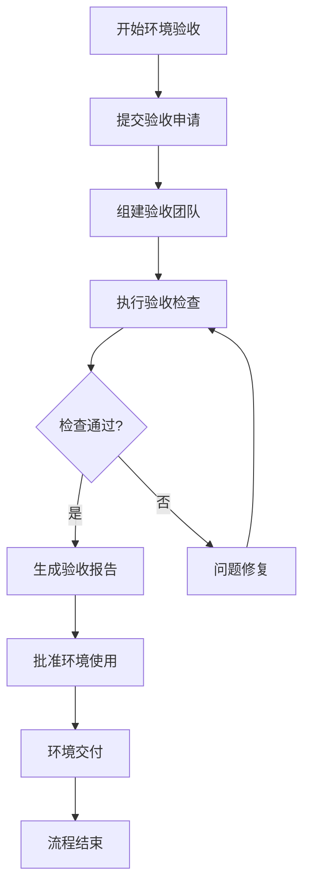
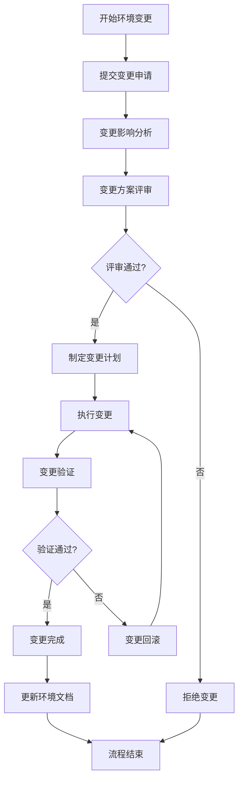
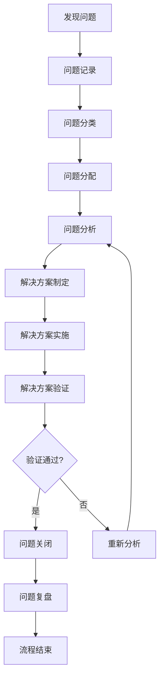
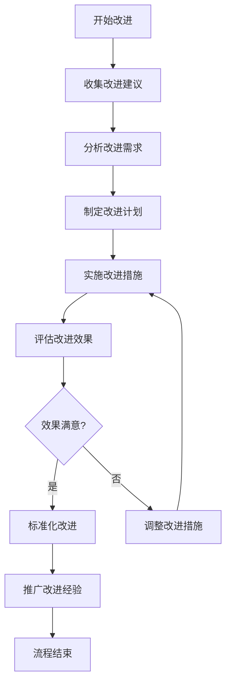

# 测试环境质量保证流程

**版本**: 1.0  
**创建日期**: 2026-04-27  
**作者**: qa-lead  
**项目**: AI-Ready企业级ERP系统  
**Sprint**: Sprint 27+1  

---

## 一、流程概述

### 1.1 目的
本流程旨在建立系统化的测试环境质量保证体系，确保测试环境的稳定性、可靠性、可用性和安全性，为测试活动提供高质量的测试环境支持。

### 1.2 适用范围
本流程适用于AI-Ready企业级ERP系统的所有测试环境，包括功能测试环境、集成测试环境、性能测试环境、UAT测试环境和自动化测试环境。

### 1.3 流程原则
- **预防为主**: 通过预防性措施减少质量问题的发生
- **持续改进**: 通过反馈机制持续改进质量保证体系
- **数据驱动**: 基于监控数据和检查结果进行质量决策
- **团队协作**: 跨团队协作共同保证环境质量
- **标准化**: 统一的质量标准和检查方法

### 1.4 流程参与者
| 角色 | 职责 | 参与流程 |
|------|------|---------|
| 质量保证经理 | 制定质量策略、管理质量团队 | 所有流程 |
| 测试环境工程师 | 环境建设、维护、优化 | 环境管理、问题处理 |
| 性能测试工程师 | 性能测试、分析、优化 | 性能验证、性能监控 |
| 安全测试工程师 | 安全测试、漏洞扫描、加固 | 安全验证、安全检查 |
| 监控运维工程师 | 监控系统建设、告警处理 | 监控配置、数据分析 |
| 测试工程师 | 测试执行、问题反馈 | 质量检查、问题报告 |
| 开发工程师 | 代码开发、问题修复 | 问题分析、代码修复 |
| 项目经理 | 项目协调、资源分配 | 质量评审、决策支持 |

---

## 二、环境验收流程

### 2.1 流程目标
确保新建或更新的测试环境符合质量要求，能够支持测试活动的正常进行。

### 2.2 流程图

### 2.3 详细步骤

#### 步骤1: 提交验收申请
- **负责人**: 环境建设负责人
- **输入**: 环境建设完成通知
- **输出**: 环境验收申请单
- **活动**:
  1. 填写环境验收申请单
  2. 提交申请单和相关文档
  3. 通知验收团队负责人

#### 步骤2: 组建验收团队
- **负责人**: 质量保证经理
- **输入**: 环境验收申请单
- **输出**: 验收团队名单
- **活动**:
  1. 确定验收团队成员
  2. 分配验收任务
  3. 制定验收计划
  4. 通知验收团队

#### 步骤3: 执行验收检查
- **负责人**: 验收团队
- **输入**: 验收计划、检查清单
- **输出**: 检查结果记录
- **活动**:
  1. 执行基础设施检查
  2. 执行软件环境检查
  3. 执行部署验证检查
  4. 执行功能验证检查
  5. 执行性能验证检查
  6. 执行安全验证检查
  7. 执行监控验证检查

#### 步骤4: 检查结果评审
- **负责人**: 验收团队
- **输入**: 检查结果记录
- **输出**: 验收评审结论
- **活动**:
  1. 汇总检查结果
  2. 分析检查问题
  3. 评估环境质量
  4. 形成评审结论

#### 步骤5: 问题修复（如需要）
- **负责人**: 环境建设负责人
- **输入**: 检查问题列表
- **输出**: 问题修复报告
- **活动**:
  1. 分析问题原因
  2. 制定修复计划
  3. 执行问题修复
  4. 验证修复效果
  5. 提交修复报告

#### 步骤6: 生成验收报告
- **负责人**: 验收团队负责人
- **输入**: 验收评审结论
- **输出**: 环境验收报告
- **活动**:
  1. 编写验收报告
  2. 记录验收结果
  3. 提出改进建议
  4. 提交验收报告

#### 步骤7: 批准环境使用
- **负责人**: 质量保证经理
- **输入**: 环境验收报告
- **输出**: 环境使用批准书
- **活动**:
  1. 评审验收报告
  2. 批准环境使用
  3. 发布环境信息
  4. 通知相关团队

#### 步骤8: 环境交付
- **负责人**: 环境建设负责人
- **输入**: 环境使用批准书
- **输出**: 环境交付确认
- **活动**:
  1. 准备环境文档
  2. 培训环境用户
  3. 移交环境权限
  4. 确认环境交付

### 2.4 验收标准
- **基础设施**: 所有检查项通过率 ≥ 95%
- **软件环境**: 所有检查项通过率 ≥ 95%
- **功能验证**: 所有检查项通过率 ≥ 90%
- **性能验证**: 所有检查项通过率 ≥ 90%
- **安全验证**: 所有检查项通过率 ≥ 95%
- **监控验证**: 所有检查项通过率 ≥ 95%

### 2.5 验收文档
1. **环境验收申请单**: 记录验收申请信息
2. **验收检查记录**: 记录各项检查结果
3. **问题跟踪表**: 记录检查发现的问题
4. **环境验收报告**: 总结验收结果和结论
5. **环境使用批准书**: 批准环境使用的正式文件

---

## 三、环境变更流程

### 3.1 流程目标
确保测试环境的变更受到控制，减少变更带来的风险，保证环境稳定性。

### 3.2 流程图

### 3.3 变更分类
| 变更类型 | 影响范围 | 审批要求 | 回滚难度 |
|---------|---------|---------|---------|
| 紧急变更 | 影响测试活动 | 技术总监审批 | 困难 |
| 重大变更 | 影响多个模块 | 部门经理审批 | 中等 |
| 一般变更 | 影响单个模块 | 团队负责人审批 | 容易 |
| 微小变更 | 不影响功能 | 无需审批 | 容易 |

### 3.4 变更控制要求
1. **所有变更必须记录**: 记录变更原因、内容、时间、负责人
2. **重大变更必须测试**: 在测试环境验证通过后才能实施
3. **变更必须可回滚**: 制定回滚方案，确保变更失败时可恢复
4. **变更必须通知**: 通知相关团队和人员
5. **变更必须验证**: 验证变更效果和影响

### 3.5 变更文档
1. **变更申请单**: 记录变更申请信息
2. **变更影响分析报告**: 分析变更的影响和风险
3. **变更方案**: 详细描述变更方案和步骤
4. **变更计划**: 制定变更实施计划
5. **变更验证报告**: 验证变更效果的报告
6. **变更回滚报告**: 记录变更回滚的过程和结果

---

## 四、问题处理流程

### 4.1 流程目标
快速、有效地处理测试环境质量问题，减少问题对测试活动的影响。

### 4.2 流程图

### 4.3 问题分级
| 问题级别 | 响应时间 | 解决时间 | 升级机制 |
|---------|---------|---------|---------|
| P0（紧急） | 5分钟 | 30分钟 | 1小时未解决升级技术总监 |
| P1（重要） | 15分钟 | 2小时 | 2小时未解决升级部门经理 |
| P2（一般） | 30分钟 | 4小时 | 4小时未解决升级团队负责人 |
| P3（提醒） | 2小时 | 8小时 | 24小时未解决升级团队负责人 |

### 4.4 问题处理步骤

#### 步骤1: 问题记录
- **负责人**: 问题发现者
- **活动**:
  1. 记录问题详细信息
  2. 收集问题相关证据
  3. 提交问题报告
  4. 通知问题处理团队

#### 步骤2: 问题分类
- **负责人**: 问题处理团队
- **活动**:
  1. 确认问题真实性
  2. 评估问题影响范围
  3. 确定问题严重程度
  4. 分配问题处理优先级

#### 步骤3: 问题分配
- **负责人**: 问题处理团队负责人
- **活动**:
  1. 确定问题处理负责人
  2. 分配问题处理任务
  3. 设定问题处理时限
  4. 通知相关人员

#### 步骤4: 问题分析
- **负责人**: 问题处理负责人
- **活动**:
  1. 收集问题相关信息
  2. 分析问题根本原因
  3. 评估问题影响程度
  4. 制定问题分析报告

#### 步骤5: 解决方案制定
- **负责人**: 问题处理负责人
- **活动**:
  1. 制定解决方案
  2. 评估解决方案风险
  3. 制定实施计划
  4. 准备回滚方案

#### 步骤6: 解决方案实施
- **负责人**: 问题处理负责人
- **活动**:
  1. 执行解决方案
  2. 监控实施过程
  3. 记录实施结果
  4. 处理实施问题

#### 步骤7: 解决方案验证
- **负责人**: 问题验证人员
- **活动**:
  1. 验证解决方案效果
  2. 确认问题已解决
  3. 验证无副作用
  4. 记录验证结果

#### 步骤8: 问题关闭
- **负责人**: 问题处理负责人
- **活动**:
  1. 整理问题处理记录
  2. 更新问题状态
  3. 通知相关人员
  4. 归档问题文档

#### 步骤9: 问题复盘
- **负责人**: 质量保证经理
- **活动**:
  1. 分析问题处理过程
  2. 总结经验教训
  3. 制定改进措施
  4. 更新相关流程

### 4.5 问题处理文档
1. **问题报告**: 记录问题详细信息
2. **问题分析报告**: 分析问题根本原因
3. **解决方案报告**: 描述解决方案和实施计划
4. **问题处理记录**: 记录问题处理过程
5. **问题验证报告**: 验证问题解决效果
6. **问题复盘报告**: 总结问题处理经验

---

## 五、持续改进流程

### 5.1 流程目标
通过持续改进，不断提升测试环境质量保证体系的效率和效果。

### 5.2 流程图

### 5.3 改进来源
1. **质量检查结果**: 检查发现的问题和改进机会
2. **监控数据分析**: 监控数据反映的质量趋势
3. **问题处理经验**: 问题处理过程中发现的改进点
4. **用户反馈**: 测试环境用户的反馈和建议
5. **行业最佳实践**: 行业内的最佳实践和经验
6. **技术发展趋势**: 新技术和新方法的应用

### 5.4 改进步骤

#### 步骤1: 收集改进建议
- **负责人**: 所有团队成员
- **活动**:
  1. 收集各种改进建议
  2. 记录改进建议详情
  3. 初步评估改进价值
  4. 提交改进建议

#### 步骤2: 分析改进需求
- **负责人**: 质量保证团队
- **活动**:
  1. 分析改进建议的必要性
  2. 评估改进的预期效果
  3. 分析改进的可行性
  4. 确定改进优先级

#### 步骤3: 制定改进计划
- **负责人**: 质量保证经理
- **活动**:
  1. 制定详细改进计划
  2. 分配改进任务
  3. 设定改进目标
  4. 制定改进时间表

#### 步骤4: 实施改进措施
- **负责人**: 改进任务负责人
- **活动**:
  1. 执行改进措施
  2. 监控改进过程
  3. 处理改进问题
  4. 记录改进进展

#### 步骤5: 评估改进效果
- **负责人**: 质量保证团队
- **活动**:
  1. 收集改进效果数据
  2. 分析改进效果
  3. 评估改进目标达成情况
  4. 识别改进不足

#### 步骤6: 标准化改进
- **负责人**: 质量保证经理
- **活动**:
  1. 完善改进成果
  2. 更新相关文档
  3. 培训相关人员
  4. 标准化改进措施

#### 步骤7: 推广改进经验
- **负责人**: 质量保证团队
- **活动**:
  1. 总结改进经验
  2. 分享改进成果
  3. 推广改进方法
  4. 持续优化改进

### 5.5 改进文档
1. **改进建议记录**: 记录改进建议详细信息
2. **改进需求分析报告**: 分析改进需求和价值
3. **改进计划**: 制定详细改进计划
4. **改进实施记录**: 记录改进实施过程
5. **改进效果评估报告**: 评估改进效果
6. **改进经验总结报告**: 总结改进经验和成果

---

## 六、质量评审流程

### 6.1 流程目标
定期评审测试环境质量状况，确保质量保证体系的有效性。

### 6.2 评审类型
| 评审类型 | 频率 | 参与人员 | 评审内容 |
|---------|------|---------|---------|
| 每日站会 | 每日 | 质量保证团队 | 当日质量状况、问题处理 |
| 每周例会 | 每周 | 相关团队负责人 | 周度质量数据、问题趋势 |
| 月度评审 | 每月 | 技术管理团队 | 月度质量报告、改进计划 |
| 季度评审 | 每季度 | 高层管理团队 | 季度质量趋势、战略调整 |
| 年度评审 | 每年 | 所有相关人员 | 年度质量总结、下年规划 |

### 6.3 评审内容
1. **质量指标分析**: 分析各项质量指标的变化趋势
2. **问题统计分析**: 分析问题的数量、类型、解决情况
3. **改进措施评审**: 评审改进措施的实施效果
4. **风险识别评估**: 识别和评估质量风险
5. **资源需求评估**: 评估质量保证的资源需求
6. **规划制定更新**: 制定和更新质量保证计划

### 6.4 评审文档
1. **评审会议纪要**: 记录评审会议内容和决议
2. **质量分析报告**: 分析质量状况和趋势
3. **问题统计报告**: 统计问题情况和处理效果
4. **改进计划报告**: 制定改进计划和措施
5. **风险识别报告**: 识别和评估质量风险
6. **资源需求报告**: 评估资源需求和分配计划

---

## 七、流程执行要求

### 7.1 流程培训
1. **新员工培训**: 新员工必须接受质量保证流程培训
2. **定期培训**: 每季度组织一次流程培训
3. **专项培训**: 针对流程变更组织专项培训
4. **考核认证**: 通过考核获得流程执行认证

### 7.2 流程执行监督
1. **执行记录**: 记录流程执行情况和结果
2. **执行检查**: 定期检查流程执行情况
3. **执行评估**: 评估流程执行效果
4. **执行改进**: 根据评估结果改进流程执行

### 7.3 流程变更管理
1. **变更申请**: 任何流程变更必须提出申请
2. **变更评审**: 变更必须经过评审和批准
3. **变更实施**: 按照变更计划实施变更
4. **变更验证**: 验证变更效果和影响
5. **变更发布**: 发布变更后的流程文档

### 7.4 流程文档管理
1. **版本控制**: 所有流程文档必须有版本控制
2. **文档更新**: 及时更新流程文档
3. **文档分发**: 确保相关人员获得最新文档
4. **文档归档**: 妥善归档历史文档
5. **文档安全**: 确保文档的安全性和保密性

---

## 八、附录

### 8.1 相关模板
1. [环境验收申请单模板]
2. [环境验收报告模板]
3. [变更申请单模板]
4. [问题报告模板]
5. [改进建议记录模板]
6. [质量评审会议纪要模板]

### 8.2 相关工具
1. **流程管理工具**: Jira、Confluence、Redmine
2. **文档管理工具**: Git、SVN、SharePoint
3. **监控工具**: Prometheus、Grafana、AlertManager
4. **测试工具**: Selenium、JMeter、Postman
5. **自动化工具**: Ansible、Jenkins、GitLab CI

### 8.3 相关标准
1. **质量标准**: ISO/IEC 25010 软件质量模型
2. **流程标准**: ITIL 服务管理框架
3. **安全标准**: ISO/IEC 27001 信息安全管理
4. **行业标准**: 行业最佳实践和标准

### 8.4 术语表
- **SLA**: 服务级别协议
- **MTTR**: 平均恢复时间
- **MTBF**: 平均故障间隔时间
- **P95**: 第95百分位数
- **RBAC**: 基于角色的访问控制
- **CMDB**: 配置管理数据库

---

**文档版本控制**:  
- v1.0 (2026-04-27): 初始版本，创建完整的测试环境质量保证流程

**更新记录**:  
- 每次更新需记录更新内容、更新人员、更新时间

**使用说明**:  
1. 所有相关人员必须熟悉本流程
2. 严格按照流程执行质量保证活动
3. 及时反馈流程执行中的问题和建议
4. 参与流程的持续改进和优化