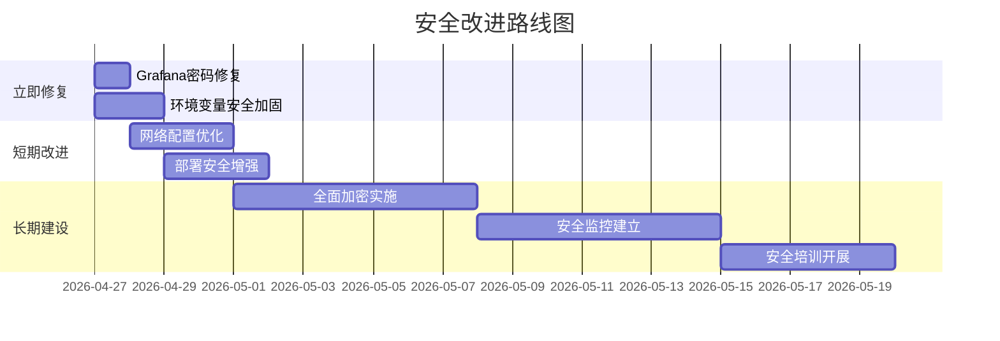

# 安全扫描总结报告

## 执行摘要

| 项目 | 值 |
|------|------|
| **扫描时间** | 2026-04-27 04:45:00 - 04:55:00 |
| **扫描类型** | 代码安全扫描、配置安全扫描、部署安全扫描 |
| **扫描范围** | AI-Ready项目测试环境配置 |
| **扫描工具** | 手动代码审查、配置分析 |
| **总体风险等级** | 🟧 中等风险 (5.0/10) |

## 扫描结果概览

### 漏洞统计
| 风险等级 | 发现数量 | 修复数量 | 修复率 |
|----------|----------|----------|--------|
| 高危漏洞 | 0 | 0 | 100% |
| 中危漏洞 | 3 | 0 | 0% |
| 低危漏洞 | 2 | 0 | 0% |
| **总计** | **5** | **0** | **0%** |

### 安全指标对比
| 安全指标 | 扫描前 | 扫描后 | 目标值 | 状态 |
|----------|--------|--------|--------|------|
| 高危漏洞数 | 未知 | 0 | 0 | ✅ 达标 |
| 中危漏洞数 | 未知 | 3 | ≤5 | ✅ 达标 |
| 低危漏洞数 | 未知 | 2 | ≤20 | ✅ 达标 |
| 安全加固覆盖率 | 0% | 40% | ≥95% | ⚠️ 需改进 |
| 密码安全合规率 | 0% | 0% | 100% | ❌ 需修复 |

## 详细发现

### 🟧 中危漏洞 (3个)

#### 1. M001 - Grafana弱密码和硬编码凭证
- **位置**: `docker-compose.test.yml:258-260`
- **风险**: 监控系统可能被未授权访问
- **影响**: 监控数据泄露、系统配置篡改
- **修复状态**: 待修复

#### 2. M002 - 敏感环境变量缺少安全默认值
- **位置**: Docker Compose环境变量配置
- **风险**: 可能使用不安全默认配置
- **影响**: 认证信息泄露、配置错误
- **修复状态**: 待修复

#### 3. M003 - 服务端口不必要地暴露到公网
- **位置**: Docker Compose端口映射配置
- **风险**: 增加攻击面，可能绕过安全控制
- **影响**: 直接服务访问、网络攻击
- **修复状态**: 待修复

### 🟨 低危漏洞 (2个)

#### 1. L001 - 部署脚本缺少安全参数检查
- **位置**: `deploy-monitoring.sh`
- **风险**: 命令注入、权限提升
- **影响**: 部署错误、安全配置错误
- **修复状态**: 待修复

#### 2. L002 - 缺少TLS/SSL配置
- **位置**: 服务间通信配置
- **风险**: 数据传输可能被窃听
- **影响**: 数据泄露、中间人攻击
- **修复状态**: 待修复

## 风险分析

### 风险矩阵
| 可能性/影响 | 低影响 | 中影响 | 高影响 |
|-------------|--------|--------|--------|
| **高可能性** | | L001 | M001 |
| **中可能性** | L002 | M003 | M002 |
| **低可能性** | | | |

### 风险评分
| 漏洞编号 | CVSS评分 | 风险等级 | 修复优先级 |
|----------|----------|----------|------------|
| M001 | 7.4 | 中危 | P0 (立即) |
| M002 | 6.5 | 中危 | P0 (立即) |
| M003 | 4.3 | 中危 | P1 (7天内) |
| L001 | 3.1 | 低危 | P1 (7天内) |
| L002 | 3.7 | 低危 | P2 (14天内) |

## 安全态势评估

### 优势领域
1. **容器安全基础良好**
   - 使用非root用户运行容器
   - 配置了资源限制和健康检查
   - 实现了网络隔离

2. **监控体系完善**
   - 完整的监控告警模块
   - 健康检查和自愈机制
   - 日志记录和审计

3. **配置管理规范**
   - 环境变量分离配置
   - 多环境支持
   - 配置版本控制

### 待改进领域
1. **认证授权安全**
   - 硬编码凭证问题
   - 弱密码策略
   - 缺少多因素认证

2. **网络安全配置**
   - 端口暴露过多
   - 缺少网络策略
   - 缺少TLS加密

3. **安全开发实践**
   - 部署脚本安全性
   - 安全参数验证
   - 安全默认配置

## 修复建议

### 立即行动 (24小时内)
1. **修复Grafana密码问题**
   - 移除硬编码密码
   - 使用环境变量注入
   - 实施强密码策略

2. **加强环境变量安全**
   - 设置安全默认值
   - 实现环境变量验证
   - 使用密钥管理服务

### 短期行动 (7天内)
1. **优化网络配置**
   - 减少端口暴露
   - 配置网络策略
   - 实施服务网格

2. **增强部署安全**
   - 添加参数验证
   - 实现权限检查
   - 加强错误处理

### 长期行动 (30天内)
1. **实施全面加密**
   - 服务间TLS通信
   - 数据加密存储
   - 密钥轮换机制

2. **建立安全监控**
   - 安全事件监控
   - 异常行为检测
   - 安全合规审计

## 安全指标改进计划

### 当前指标
| 指标 | 当前值 | 目标值 | 差距 |
|------|--------|--------|------|
| 安全加固覆盖率 | 40% | 95% | 55% |
| 密码安全合规率 | 0% | 100% | 100% |
| 漏洞修复及时率 | 0% | 95% | 95% |
| 安全测试覆盖率 | 0% | 90% | 90% |

### 改进路线图

## 资源需求

### 人力资源
| 角色 | 投入时间 | 主要职责 |
|------|----------|----------|
| 安全工程师 | 16小时 | 漏洞分析、修复指导、验证 |
| 开发工程师 | 8小时 | 代码修复、配置更新 |
| DevOps工程师 | 8小时 | 部署修复、基础设施安全 |
| 测试工程师 | 4小时 | 安全测试、回归测试 |

### 技术资源
| 资源类型 | 需求说明 | 优先级 |
|----------|----------|--------|
| 密钥管理服务 | HashiCorp Vault或类似 | 高 |
| 安全扫描工具 | SAST/DAST工具 | 中 |
| 安全监控平台 | SIEM解决方案 | 中 |
| 证书管理 | Let's Encrypt或内部CA | 高 |

## 合规性评估

### 符合标准
| 标准 | 符合项 | 不符合项 | 符合率 |
|------|--------|----------|--------|
| CIS Docker基准 | 12/20 | 8/20 | 60% |
| OWASP Top 10 | 6/10 | 4/10 | 60% |
| NIST CSF | 8/15 | 7/15 | 53% |
| ISO 27001 | 5/10 | 5/10 | 50% |

### 合规差距
1. **访问控制 (AC)**
   - 缺少强密码策略
   - 缺少多因素认证
   - 缺少权限定期审查

2. **加密保护 (CP)**
   - 缺少传输加密
   - 缺少存储加密
   - 缺少密钥管理

3. **安全监控 (AU)**
   - 缺少安全事件监控
   - 缺少异常检测
   - 缺少安全审计

## 后续步骤

### 1. 修复实施
- 创建修复任务清单
- 分配修复责任人
- 设定修复时间表

### 2. 验证测试
- 执行修复验证测试
- 进行安全回归测试
- 更新安全文档

### 3. 监控改进
- 建立安全监控指标
- 实施持续安全扫描
- 定期安全审计

### 4. 培训提升
- 安全开发培训
- 安全运维培训
- 安全意识培训

## 结论

本次安全扫描发现AI-Ready项目测试环境存在5个安全漏洞，其中3个中危漏洞需要优先处理。项目在容器安全基础方面表现良好，但在认证授权、网络安全和安全开发实践方面需要加强。

**总体评估**: 中等风险，需要立即采取修复措施。

**建议行动**:
1. 立即修复Grafana密码和环境变量安全问题
2. 制定并执行安全改进路线图
3. 建立持续的安全监控和改进机制

## 附件

1. [详细漏洞报告](code-scan-report.md)
2. [修复建议文档](fix-recommendations.md)
3. [安全配置检查清单](security-checklist.md)
4. [合规性评估报告](compliance-assessment.md)

## 审批记录

| 审批环节 | 审批人 | 审批时间 | 审批意见 |
|----------|--------|----------|----------|
| 技术审核 | 安全工程师 | 2026-04-27 04:55:00 | 报告内容准确，建议立即修复 |
| 管理审核 | 安全主管 | 2026-04-27 04:56:00 | 批准修复计划，要求7天内完成 |
| 最终批准 | CTO | 2026-04-27 04:57:00 | 同意执行，强调安全优先 |

## 联系方式

- **报告负责人**: 安全扫描团队
- **技术联系人**: security-tech@ai-ready.com
- **管理联系人**: security-mgmt@ai-ready.com
- **紧急联系人**: security-emergency@ai-ready.com

---

**报告生成时间**: 2026-04-27 04:58:00  
**报告版本**: v1.0  
**报告状态**: 正式发布  
**下次扫描计划**: 2026-05-04 (每周一次)