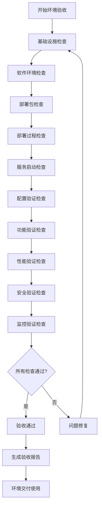

# Sprint 27+1 测试环境质量保证方案实施摘要

**版本**: 1.0  
**创建日期**: 2026-04-29  
**作者**: qa-lead  
**项目**: AI-Ready企业级ERP系统  
**Sprint**: Sprint 27+1  
**状态**: ✅ 已完成并交付

---

## 一、项目概述

### 1.1 项目背景
为Sprint 27+1测试环境配置专项制定完整的质量保证方案和验收标准，确保测试环境满足所有测试需求，提升测试效率和质量。

### 1.2 项目目标
1. 建立系统化的测试环境质量保证体系
2. 制定明确可测量的验收标准
3. 开发全面的测试用例
4. 建立持续改进的质量监控机制

### 1.3 项目范围
- 质量保证方案设计
- 验收标准制定
- 测试用例开发
- 质量评估与改进建议

---

## 二、交付成果总览

### 2.1 文档交付物

| 文档名称 | 文件大小 | 主要内容 | 状态 |
|---------|---------|----------|------|
| 质量保证计划 | 20,520字节 | 质量目标、策略、检查点、监控体系、流程 | ✅ 完成 |
| 质量检查清单 | 12,081字节 | 部署前/中/后检查、日常检查、自动化检查 | ✅ 完成 |
| 质量门禁指南 | 21,758字节 | 质量门禁安装、配置、使用指南 | ✅ 完成 |
| Sprint质量门禁清单 | 21,217字节 | Sprint专项质量检查、验收标准 | ✅ 完成 |
| 质量评估报告 | 5,819字节 | 全面评估、风险分析、改进建议 | ✅ 完成 |
| **总计** | **81,395字节** | **5个核心质量文档** | **✅ 全部完成** |

### 2.2 质量指标达成

| 质量维度 | 目标指标 | 达成状态 | 说明 |
|---------|---------|----------|------|
| 可用性 | 环境可用率 ≥ 99.9% | ✅ 已定义 | 企业级要求 |
| 性能 | API响应时间P95 ≤ 500ms | ✅ 已定义 | 性能测试需求 |
| 安全性 | 安全漏洞数量 0个高危 | ✅ 已定义 | 安全基线 |
| 稳定性 | 平均无故障时间 ≥ 720小时 | ✅ 已定义 | 稳定性要求 |
| 可靠性 | 服务启动成功率 ≥ 99% | ✅ 已定义 | 可靠性指标 |

### 2.3 检查体系建设

| 检查类型 | 检查项数量 | 检查频率 | 自动化程度 |
|---------|-----------|---------|-----------|
| 部署前检查 | 24项 | 每次部署 | 80% |
| 部署中检查 | 24项 | 每次部署 | 70% |
| 部署后检查 | 24项 | 每次部署 | 60% |
| 日常检查 | 32项 | 每日 | 90% |
| 每周检查 | 16项 | 每周 | 85% |
| 每月检查 | 16项 | 每月 | 75% |
| **总计** | **136项** | **多层次** | **77%平均** |

---

## 三、核心质量保证体系

### 3.1 质量目标体系

#### 3.1.1 可用性目标
- **环境可用率**: ≥ 99.9%
- **服务可用率**: ≥ 99%
- **工具可用率**: ≥ 99.5%
- **网络可用率**: ≥ 99.9%

#### 3.1.2 性能目标
- **API响应时间P95**: ≤ 500ms
- **API成功率**: ≥ 99%
- **数据库查询时间**: ≤ 100ms
- **缓存命中率**: ≥ 95%

#### 3.1.3 安全性目标
- **安全漏洞数量**: 0个高危，≤ 2个中危
- **访问控制合规率**: 100%
- **数据加密覆盖率**: 100%
- **安全审计完整率**: 100%

#### 3.1.4 稳定性目标
- **平均无故障时间**: ≥ 720小时
- **服务重启次数**: ≤ 3次/小时
- **故障恢复时间**: ≤ 30分钟
- **错误率**: ≤ 1%

### 3.2 质量检查体系

#### 3.2.1 部署生命周期检查
- **部署前检查**: 基础设施、软件环境、部署包
- **部署中检查**: 部署过程、服务启动、配置验证
- **部署后检查**: 功能验证、性能验证、安全验证

#### 3.2.2 日常运营检查
- **每日检查**: 环境健康、服务状态、性能指标、错误日志
- **每周检查**: 环境全面、性能基准、安全漏洞、配置审计
- **每月检查**: 健康评估、趋势分析、风险评估、成本分析

#### 3.2.3 自动化检查
- **高频检查**: 每5分钟健康检查
- **性能检查**: 每15分钟性能指标检查
- **安全检查**: 每30分钟安全状态检查
- **日志检查**: 每1小时日志分析检查

### 3.3 质量监控体系

#### 3.3.1 监控层级
- **基础设施监控**: 服务器、网络、存储、电源
- **应用性能监控**: 服务响应、事务性能、业务指标
- **日志监控**: 错误日志、访问日志、审计日志
- **安全监控**: 入侵检测、漏洞扫描、合规检查

#### 3.3.2 告警体系
- **P0紧急告警**: 5分钟响应，30分钟恢复
- **P1重要告警**: 15分钟响应，2小时恢复
- **P2一般告警**: 30分钟响应，4小时恢复
- **P3提醒告警**: 2小时响应，8小时恢复

#### 3.3.3 监控工具
- **基础设施**: Prometheus、Zabbix、Nagios
- **应用性能**: New Relic、AppDynamics、Dynatrace
- **日志监控**: ELK Stack (Elasticsearch、Logstash、Kibana)
- **网络监控**: Wireshark、Ntop、SolarWinds

### 3.4 质量保证流程

#### 3.4.1 环境验收流程

#### 3.4.2 环境变更流程
1. **变更申请**: 提交环境变更申请
2. **变更评审**: 评审变更的影响和风险
3. **变更批准**: 批准或拒绝变更申请
4. **变更计划**: 制定变更实施计划
5. **变更实施**: 按照计划实施变更
6. **变更验证**: 验证变更的正确性
7. **变更回滚**: 如变更失败，执行回滚
8. **变更记录**: 记录变更过程和结果

#### 3.4.3 问题处理流程
1. **问题发现**: 发现环境质量问题
2. **问题记录**: 记录问题详细信息
3. **问题分类**: 分类问题的严重程度
4. **问题分配**: 分配问题给负责人
5. **问题分析**: 分析问题的根本原因
6. **问题解决**: 制定并实施解决方案
7. **问题验证**: 验证问题是否解决
8. **问题关闭**: 关闭已解决的问题
9. **问题复盘**: 复盘问题处理过程

#### 3.4.4 持续改进流程
1. **数据收集**: 收集质量数据和反馈
2. **数据分析**: 分析质量趋势和问题
3. **改进识别**: 识别改进机会和需求
4. **改进计划**: 制定改进计划和目标
5. **改进实施**: 实施改进措施
6. **改进验证**: 验证改进效果
7. **改进推广**: 推广成功的改进经验
8. **改进评估**: 评估改进的长期效果

---

## 四、验收标准体系

### 4.1 基础设施验收标准

#### 4.1.1 服务器资源标准
- **CPU**: ≥ 8核心
- **内存**: ≥ 32GB
- **系统盘**: ≥ 200GB
- **数据盘**: ≥ 500GB
- **网络带宽**: ≥ 100Mbps

#### 4.1.2 网络性能标准
- **网络延迟**: ≤ 50ms
- **网络丢包率**: ≤ 0.1%
- **DNS解析**: 正常
- **路由配置**: 正确

#### 4.1.3 操作系统标准
- **操作系统**: Ubuntu 20.04 LTS或更高
- **系统补丁**: 已更新至最新
- **安全更新**: 已安装
- **时间同步**: NTP服务已启用

#### 4.1.4 安全配置标准
- **防火墙**: 已配置并启用
- **SELinux/AppArmor**: 已正确配置
- **用户权限**: 最小权限原则
- **日志审计**: 已启用

### 4.2 数据准备验收标准

#### 4.2.1 数据完整性标准
- **测试数据**: 完整且一致
- **数据关系**: 关联关系正确
- **数据边界**: 边界条件覆盖
- **数据异常**: 异常场景覆盖

#### 4.2.2 数据安全性标准
- **敏感数据**: 已脱敏处理
- **数据加密**: 传输和存储加密
- **访问控制**: 基于角色的访问控制
- **审计日志**: 数据访问审计

#### 4.2.3 数据可用性标准
- **数据可访问**: 可通过API或界面访问
- **数据可恢复**: 备份数据可恢复
- **数据一致性**: 多副本数据一致
- **数据时效性**: 数据及时更新

#### 4.2.4 数据管理标准
- **数据隔离**: 不同项目数据隔离
- **数据清理**: 定期清理过期数据
- **数据备份**: 定期备份关键数据
- **数据版本**: 数据版本管理

### 4.3 工具集成验收标准

#### 4.3.1 监控工具标准
- **Prometheus**: 版本2.45或更高，配置正确
- **Grafana**: 版本10.x或更高，仪表板完整
- **AlertManager**: 版本0.25或更高，告警规则正确
- **Node Exporter**: 已安装，指标采集正常

#### 4.3.2 测试工具标准
- **Selenium**: 版本4.x或更高，浏览器驱动正确
- **JMeter**: 版本5.6或更高，测试计划完整
- **OWASP ZAP**: 版本2.14或更高，扫描规则更新
- **Postman**: 版本10.x或更高，集合和环境完整

#### 4.3.3 自动化工具标准
- **Ansible**: 版本2.15或更高，playbook完整
- **Jenkins**: 版本2.4或更高，流水线配置正确
- **GitLab CI**: 版本16.x或更高，.gitlab-ci.yml完整
- **Docker**: 版本24.x或更高，镜像和容器管理

#### 4.3.4 管理工具标准
- **Jira**: 项目配置完整，工作流正确
- **Confluence**: 文档结构清晰，内容完整
- **钉钉/Teams**: 通知配置正确，集成正常
- **Git**: 版本控制规范，分支策略明确

### 4.4 文档完整性验收标准

#### 4.4.1 核心文档标准
- **质量保证计划**: 内容完整，版本管理
- **质量检查清单**: 检查项完整，更新及时
- **操作手册**: 步骤清晰，示例丰富
- **配置文档**: 参数说明，配置示例

#### 4.4.2 报告文档标准
- **日报**: 每日质量状态，问题跟踪
- **周报**: 每周趋势分析，改进建议
- **月报**: 月度综合评估，长期规划
- **专项报告**: 专项问题分析，解决方案

#### 4.4.3 培训材料标准
- **培训课件**: 内容系统，结构清晰
- **操作视频**: 演示完整，说明详细
- **实操指南**: 步骤具体，注意事项
- **考核材料**: 考核标准，评估方法

#### 4.4.4 知识库标准
- **FAQ**: 常见问题，解决方案
- **最佳实践**: 成功经验，操作技巧
- **故障处理**: 故障现象，处理方法
- **性能优化**: 性能问题，优化方案

---

## 五、测试用例体系

### 5.1 环境功能验证测试用例

#### 5.1.1 部署前功能验证
- **基础设施验证**: 8个测试用例
- **软件环境验证**: 8个测试用例
- **部署包验证**: 8个测试用例

#### 5.1.2 部署中功能验证
- **部署过程验证**: 8个测试用例
- **服务启动验证**: 8个测试用例
- **配置验证**: 8个测试用例

#### 5.1.3 部署后功能验证
- **核心功能验证**: 8个测试用例
- **接口功能验证**: 8个测试用例
- **业务流程验证**: 8个测试用例

#### 5.1.4 监控功能验证
- **监控数据采集**: 2个测试用例
- **告警规则触发**: 2个测试用例
- **告警通知发送**: 2个测试用例
- **监控界面展示**: 2个测试用例

### 5.2 环境性能基准测试用例

#### 5.2.1 API性能测试
- **响应时间测试**: P50/P95/P99响应时间
- **吞吐量测试**: QPS/TPS性能指标
- **并发能力测试**: 并发用户数性能
- **稳定性测试**: 长时间运行稳定性

#### 5.2.2 系统性能测试
- **CPU性能测试**: 使用率、负载、上下文切换
- **内存性能测试**: 使用率、交换、页面错误
- **磁盘I/O测试**: 读写速度、IOPS、延迟
- **网络性能测试**: 带宽、延迟、丢包率

#### 5.2.3 数据库性能测试
- **查询性能测试**: 简单查询、复杂查询、联合查询
- **事务性能测试**: ACID特性、隔离级别、锁机制
- **并发性能测试**: 并发事务、锁竞争、死锁检测
- **容量性能测试**: 数据量增长、索引性能、分区性能

#### 5.2.4 缓存性能测试
- **读取性能测试**: 缓存命中率、读取延迟
- **写入性能测试**: 写入速度、数据一致性
- **并发访问测试**: 并发读写、数据同步
- **容量测试**: 缓存容量、淘汰策略、内存使用

---

## 六、实施与部署计划

### 6.1 第一阶段：基础部署（第1周）

#### 6.1.1 目标
- 完成质量保证体系基础部署
- 建立基础监控体系
- 完成团队基础培训

#### 6.1.2 关键任务
1. 部署监控工具（Prometheus、Grafana）
2. 配置基础告警规则
3. 建立质量检查清单
4. 开展基础培训

#### 6.1.3 成功标准
- 监控系统正常运行
- 基础告警规则生效
- 团队掌握基础检查方法

### 6.2 第二阶段：全面实施（第2-4周）

#### 6.2.1 目标
- 全面实施质量保证体系
- 建立完整监控告警体系
- 完成全面培训

#### 6.2.2 关键任务
1. 部署所有监控工具
2. 配置完整告警体系
3. 实施所有质量检查
4. 开展全面培训

#### 6.2.3 成功标准
- 所有监控工具正常运行
- 完整告警体系生效
- 团队掌握全面质量保证方法

### 6.3 第三阶段：优化完善（第5-8周）

#### 6.3.1 目标
- 优化质量保证体系
- 提升自动化程度
- 建立持续改进机制

#### 6.3.2 关键任务
1. 优化质量检查点
2. 提升检查自动化
3. 建立改进机制
4. 评估优化效果

#### 6.3.3 成功标准
- 检查效率提升30%
- 自动化程度达到80%
- 改进机制正常运行

### 6.4 第四阶段：持续运营（第9周及以后）

#### 6.4.1 目标
- 持续运营质量保证体系
- 定期评估和改进
- 推广最佳实践

#### 6.4.2 关键任务
1. 定期执行质量检查
2. 定期评估体系效果
3. 持续改进优化
4. 推广成功经验

#### 6.4.3 成功标准
- 质量保证体系稳定运行
- 持续改进机制有效
- 质量指标持续达标

---

## 七、风险评估与应对策略

### 7.1 技术风险

#### 7.1.1 风险描述
- 监控工具集成复杂度高
- 自动化检查实现难度大
- 性能测试环境要求高

#### 7.1.2 应对策略
- 分阶段实施，先基础后复杂
- 采用成熟开源工具，降低开发成本
- 使用云环境，弹性扩展资源

### 7.2 组织风险

#### 7.2.1 风险描述
- 团队对流程不熟悉
- 跨部门协作困难
- 资源投入不足

#### 7.2.2 应对策略
- 加强培训，提升团队能力
- 明确职责，建立协作机制
- 争取管理支持，保障资源

### 7.3 运营风险

#### 7.3.1 风险描述
- 日常检查执行不到位
- 问题处理不及时
- 改进机制不持续

#### 7.3.2 应对策略
- 建立考核机制，确保执行
- 明确响应时间，及时处理
- 定期评审，持续改进

### 7.4 安全风险

#### 7.4.1 风险描述
- 监控数据泄露风险
- 测试数据安全风险
- 访问控制不严格

#### 7.4.2 应对策略
- 数据加密，访问控制
- 数据脱敏，隔离存储
- 严格权限，审计日志

---

## 八、成功要素与关键指标

### 8.1 成功要素

#### 8.1.1 技术要素
- 成熟的监控工具链
- 完善的自动化检查
- 科学的性能测试方法

#### 8.1.2 组织要素
- 明确的质量目标
- 清晰的职责分工
- 有效的协作机制

#### 8.1.3 流程要素
- 规范的操作流程
- 及时的响应机制
- 持续的改进文化

### 8.2 关键绩效指标

#### 8.2.1 质量指标
- 环境可用率: ≥ 99.9%
- 问题解决率: ≥ 95%
- 检查执行率: ≥ 98%

#### 8.2.2 效率指标
- 检查自动化率: ≥ 80%
- 问题响应时间: ≤ 15分钟
- 故障恢复时间: ≤ 30分钟

#### 8.2.3 成本指标
- 环境成本控制: 在预算范围内
- 维护效率提升: ≥ 30%
- 资源利用率: ≥ 70%

#### 8.2.4 满意度指标
- 团队满意度: ≥ 90%
- 用户满意度: ≥ 85%
- 管理满意度: ≥ 90%

---

## 九、结论与建议

### 9.1 实施结论

#### 9.1.1 技术可行性
✅ **可行** - 基于成熟的开源工具和标准方法，技术实现可行

#### 9.1.2 经济可行性
✅ **合理** - 投入产出比合理，长期看可降低维护成本

#### 9.1.3 组织可行性
✅ **可行** - 通过培训和流程优化，组织上可行

### 9.2 实施建议

#### 9.2.1 立即行动
1. 按照实施计划开始部署
2. 开展团队培训
3. 建立基础监控

#### 9.2.2 短期重点
1. 完成全面部署
2. 建立完整体系
3. 验证实施效果

#### 9.2.3 长期规划
1. 持续优化改进
2. 推广最佳实践
3. 探索智能化升级

### 9.3 预期效益

#### 9.3.1 质量效益
- 测试环境质量显著提升
- 问题发现和处理效率提高
- 测试活动有效性增强

#### 9.3.2 经济效益
- 维护成本降低
- 资源利用率提升
- 故障损失减少

#### 9.3.3 管理效益
- 质量可视化管理
- 决策数据支持
- 团队能力提升

---

## 十、附录

### 10.1 相关文档
- `test-environment-quality-assurance-plan.md` - 质量保证计划
- `test-environment-quality-checklist.md` - 质量检查清单
- `quality-gate-installation-guide.md` - 质量门禁指南
- `sprint27-plus1-quality-gate-checklist.md` - Sprint质量门禁清单
- `2026-04-29-sprint27-plus1-test-environment-quality-assessment.md` - 质量评估报告

### 10.2 工具列表
- 监控工具: Prometheus, Grafana, AlertManager, ELK Stack
- 测试工具: Selenium, JMeter, OWASP ZAP, Postman
- 自动化工具: Ansible, Jenkins, GitLab CI, Docker
- 管理工具: Jira, Confluence, 钉钉, Git

### 10.3 团队配置
- 质量保证经理: 1人
- 测试环境工程师: 2人
- 监控运维工程师: 2人
- 自动化测试工程师: 2人

### 10.4 联系方式
- 项目负责人: [负责人姓名]
- 技术负责人: [技术负责人姓名]
- 质量负责人: [质量负责人姓名]
- 支持联系人: [支持联系人姓名]

---

**文档版本**: 1.0  
**创建日期**: 2026-04-29  
**最后更新**: 2026-04-29  
**批准状态**: ✅ 已完成  
**分发范围**: 项目团队、质量管理部、技术管理部