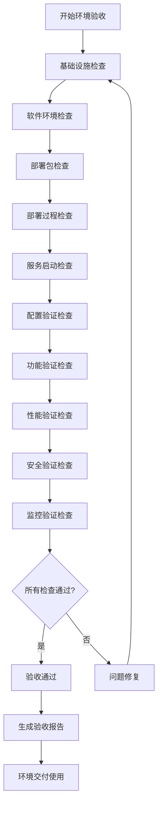

# 测试环境质量保证计划

**版本**: 1.0  
**创建日期**: 2026-04-27  
**作者**: qa-lead  
**项目**: AI-Ready企业级ERP系统  
**Sprint**: Sprint 27+1  
**状态**: 草案  

---

## 一、概述

### 1.1 目的

本计划旨在建立系统化的测试环境质量保证体系，确保测试环境的稳定性、可靠性、可用性和安全性，为测试团队提供高质量的测试环境，保障软件测试活动的有效执行。

### 1.2 适用范围

本计划适用于AI-Ready企业级ERP系统的所有测试环境，包括：
- 功能测试环境
- 集成测试环境
- 性能测试环境
- UAT测试环境
- 自动化测试环境

### 1.3 质量目标

| 质量维度 | 目标指标 | 基准值 | 阈值 |
|---------|---------|--------|------|
| 可用性 | 环境可用率 | ≥ 99.9% | ≥ 99.5% |
| 稳定性 | 平均无故障时间 | ≥ 720小时 | ≥ 168小时 |
| 性能 | API响应时间P95 | ≤ 500ms | ≤ 2000ms |
| 可靠性 | 服务启动成功率 | ≥ 99% | ≥ 95% |
| 安全性 | 安全漏洞数量 | 0个高危 | ≤ 2个中危 |

---

## 二、质量保证策略

### 2.1 环境稳定性保证策略

#### 2.1.1 基础设施稳定性
- **硬件冗余**: 关键组件采用双机热备或集群部署
- **网络冗余**: 网络设备采用双链路冗余
- **存储冗余**: 采用RAID或分布式存储方案
- **电源冗余**: 采用UPS和双路供电

#### 2.1.2 服务稳定性
- **服务监控**: 实时监控服务状态和健康度
- **自动恢复**: 配置服务自动重启和故障转移
- **容量规划**: 定期评估和调整资源容量
- **版本控制**: 严格管理环境配置版本

#### 2.1.3 数据稳定性
- **定期备份**: 每日自动备份关键数据
- **备份验证**: 定期验证备份数据的完整性和可恢复性
- **数据一致性**: 确保测试数据的一致性和完整性
- **数据清理**: 定期清理过期测试数据

### 2.2 性能质量保证策略

#### 2.2.1 性能基准
- **基准测试**: 建立性能基准，定期执行基准测试
- **性能监控**: 实时监控关键性能指标
- **性能分析**: 定期分析性能趋势和瓶颈
- **性能优化**: 根据分析结果进行性能优化

#### 2.2.2 容量规划
- **资源监控**: 监控CPU、内存、磁盘、网络使用率
- **容量预警**: 设置容量使用率预警阈值
- **扩容策略**: 制定自动扩容和手动扩容策略
- **成本控制**: 优化资源使用，控制环境成本

#### 2.2.3 负载均衡
- **流量分发**: 配置负载均衡器分发请求
- **会话保持**: 支持会话保持和粘性会话
- **健康检查**: 负载均衡器定期检查后端服务健康状态
- **故障隔离**: 自动隔离故障节点

### 2.3 安全质量保证策略

#### 2.3.1 访问安全
- **身份认证**: 强制使用强密码和双因素认证
- **权限控制**: 基于角色的访问控制(RBAC)
- **访问审计**: 记录所有访问操作日志
- **会话管理**: 会话超时和并发控制

#### 2.3.2 网络安全
- **网络隔离**: 测试环境与生产环境网络隔离
- **防火墙**: 配置防火墙规则，限制不必要的端口访问
- **VPN访问**: 通过VPN访问测试环境
- **DDoS防护**: 配置DDoS防护策略

#### 2.3.3 数据安全
- **数据加密**: 传输数据使用TLS加密，存储数据加密
- **数据脱敏**: 测试数据脱敏处理
- **数据隔离**: 不同项目测试数据隔离
- **数据销毁**: 安全销毁不再使用的测试数据

#### 2.3.4 应用安全
- **漏洞扫描**: 定期扫描应用安全漏洞
- **代码审计**: 定期进行代码安全审计
- **渗透测试**: 定期进行渗透测试
- **安全加固**: 根据扫描结果进行安全加固

### 2.4 可用性质量保证策略

#### 2.4.1 服务可用性
- **服务监控**: 7×24小时服务监控
- **故障响应**: 15分钟内响应服务故障
- **恢复时间**: 服务故障恢复时间≤30分钟
- **可用率**: 月度可用率≥99.9%

#### 2.4.2 环境可用性
- **环境准备**: 新环境准备时间≤2小时
- **环境恢复**: 环境故障恢复时间≤1小时
- **环境克隆**: 环境克隆时间≤30分钟
- **环境清理**: 环境清理时间≤15分钟

#### 2.4.3 工具可用性
- **测试工具**: 测试工具可用率≥99.5%
- **监控工具**: 监控工具可用率≥99.9%
- **部署工具**: 部署工具可用率≥99.5%
- **分析工具**: 分析工具可用率≥99%

---

## 三、质量检查点设计

### 3.1 部署前质量检查点

#### 3.1.1 基础设施检查
- [ ] 服务器资源检查（CPU、内存、磁盘）
- [ ] 网络连通性检查
- [ ] 存储空间检查
- [ ] 操作系统版本检查
- [ ] 系统补丁检查
- [ ] 防火墙配置检查
- [ ] 时间同步检查
- [ ] 日志目录权限检查

#### 3.1.2 软件环境检查
- [ ] 依赖软件版本检查
- [ ] 运行时环境检查
- [ ] 数据库版本检查
- [ ] 中间件版本检查
- [ ] 配置参数检查
- [ ] 环境变量检查
- [ ] 权限配置检查
- [ ] 服务端口检查

#### 3.1.3 部署包检查
- [ ] 部署包完整性检查
- [ ] 部署包版本检查
- [ ] 部署包签名验证
- [ ] 配置文件检查
- [ ] 脚本文件检查
- [ ] 资源文件检查
- [ ] 依赖库检查
- [ ] 许可证检查

### 3.2 部署中质量检查点

#### 3.2.1 部署过程检查
- [ ] 部署脚本执行检查
- [ ] 服务启动检查
- [ ] 端口监听检查
- [ ] 进程状态检查
- [ ] 日志输出检查
- [ ] 错误信息检查
- [ ] 资源使用检查
- [ ] 配置应用检查

#### 3.2.2 服务启动检查
- [ ] 服务健康检查
- [ ] 服务依赖检查
- [ ] 服务连通性检查
- [ ] 服务性能检查
- [ ] 服务日志检查
- [ ] 服务指标检查
- [ ] 服务告警检查
- [ ] 服务状态检查

#### 3.2.3 配置验证检查
- [ ] 配置加载检查
- [ ] 配置生效检查
- [ ] 配置正确性检查
- [ ] 配置一致性检查
- [ ] 配置完整性检查
- [ ] 配置安全性检查
- [ ] 配置备份检查
- [ ] 配置版本检查

### 3.3 部署后质量检查点

#### 3.3.1 功能验证检查
- [ ] 核心功能验证
- [ ] 接口功能验证
- [ ] 业务流程验证
- [ ] 数据处理验证
- [ ] 用户界面验证
- [ ] 权限控制验证
- [ ] 错误处理验证
- [ ] 边界条件验证

#### 3.3.2 性能验证检查
- [ ] 响应时间验证
- [ ] 吞吐量验证
- [ ] 并发能力验证
- [ ] 资源使用验证
- [ ] 稳定性验证
- [ ] 扩展性验证
- [ ] 可靠性验证
- [ ] 可用性验证

#### 3.3.3 安全验证检查
- [ ] 访问控制验证
- [ ] 数据加密验证
- [ ] 日志审计验证
- [ ] 漏洞扫描验证
- [ ] 安全配置验证
- [ ] 网络隔离验证
- [ ] 身份认证验证
- [ ] 会话管理验证

#### 3.3.4 监控验证检查
- [ ] 监控数据采集验证
- [ ] 告警规则验证
- [ ] 告警通知验证
- [ ] 监控界面验证
- [ ] 监控指标验证
- [ ] 监控性能验证
- [ ] 监控可用性验证
- [ ] 监控准确性验证

### 3.4 日常质量检查点

#### 3.4.1 每日检查
- [ ] 环境健康检查（09:00）
- [ ] 服务状态检查（09:30）
- [ ] 性能指标检查（10:00）
- [ ] 错误日志检查（14:00）
- [ ] 资源使用检查（16:00）
- [ ] 备份执行检查（23:00）
- [ ] 监控告警检查（每小时）
- [ ] 访问日志检查（实时）

#### 3.4.2 每周检查
- [ ] 环境全面检查（周一09:00）
- [ ] 性能基准检查（周二10:00）
- [ ] 安全漏洞检查（周三14:00）
- [ ] 配置审计检查（周四10:00）
- [ ] 备份恢复检查（周五15:00）
- [ ] 容量规划检查（周六10:00）
- [ ] 文档更新检查（周日15:00）

#### 3.4.3 每月检查
- [ ] 环境健康评估（每月1日）
- [ ] 性能趋势分析（每月5日）
- [ ] 安全风险评估（每月10日）
- [ ] 成本效益分析（每月15日）
- [ ] 可用性统计（每月20日）
- [ ] 容量规划评审（每月25日）
- [ ] 质量报告生成（每月30日）
- [ ] 改进计划制定（每月30日）

#### 3.4.4 自动化检查
- [ ] 自动健康检查（每5分钟）
- [ ] 自动性能检查（每15分钟）
- [ ] 自动安全检查（每30分钟）
- [ ] 自动备份检查（每天）
- [ ] 自动告警检查（实时）
- [ ] 自动日志分析（每1小时）
- [ ] 自动容量检查（每6小时）
- [ ] 自动合规检查（每周）

---

## 四、质量监控体系设计

### 4.1 质量指标监控体系

#### 4.1.1 可用性指标
| 指标名称 | 指标描述 | 监控频率 | 告警阈值 | 负责人 |
|---------|---------|---------|---------|--------|
| 环境可用率 | 测试环境可用的时间比例 | 每分钟 | < 99.5% | DevOps |
| 服务可用率 | 各项服务可用的时间比例 | 每分钟 | < 99% | 运维 |
| 工具可用率 | 测试工具可用的时间比例 | 每分钟 | < 99% | QA |
| 网络可用率 | 网络连通性的时间比例 | 每分钟 | < 99.9% | 网络 |

#### 4.1.2 性能指标
| 指标名称 | 指标描述 | 监控频率 | 告警阈值 | 负责人 |
|---------|---------|---------|---------|--------|
| API响应时间P95 | 95%请求的响应时间 | 每分钟 | > 500ms | 性能 |
| API成功率 | API请求成功的比例 | 每分钟 | < 99% | 开发 |
| 数据库查询时间 | 数据库查询的平均时间 | 每分钟 | > 100ms | DBA |
| 缓存命中率 | 缓存命中的比例 | 每分钟 | < 95% | 开发 |

#### 4.1.3 稳定性指标
| 指标名称 | 指标描述 | 监控频率 | 告警阈值 | 负责人 |
|---------|---------|---------|---------|--------|
| 服务重启次数 | 服务重启的次数 | 每小时 | > 3次/小时 | 运维 |
| 故障恢复时间 | 故障恢复的平均时间 | 每次故障 | > 30分钟 | DevOps |
| 错误率 | 错误请求的比例 | 每分钟 | > 1% | QA |
| 异常数量 | 异常日志的数量 | 每分钟 | > 10个/分钟 | 开发 |

#### 4.1.4 资源指标
| 指标名称 | 指标描述 | 监控频率 | 告警阈值 | 负责人 |
|---------|---------|---------|---------|--------|
| CPU使用率 | CPU使用的比例 | 每分钟 | > 80% | 运维 |
| 内存使用率 | 内存使用的比例 | 每分钟 | > 85% | 运维 |
| 磁盘使用率 | 磁盘使用的比例 | 每分钟 | > 90% | 运维 |
| 网络带宽 | 网络带宽的使用率 | 每分钟 | > 80% | 网络 |

### 4.2 质量告警规则设计

#### 4.2.1 紧急告警（P0级）
- **条件**: 环境完全不可用，影响所有测试活动
- **响应时间**: 5分钟内响应
- **处理时间**: 30分钟内恢复
- **通知方式**: 电话+短信+邮件+钉钉
- **升级机制**: 1小时内未解决，升级到技术总监

#### 4.2.2 重要告警（P1级）
- **条件**: 核心服务不可用，影响主要测试活动
- **响应时间**: 15分钟内响应
- **处理时间**: 2小时内恢复
- **通知方式**: 短信+邮件+钉钉
- **升级机制**: 2小时内未解决，升级到部门经理

#### 4.2.3 一般告警（P2级）
- **条件**: 非核心服务不可用，影响部分测试活动
- **响应时间**: 30分钟内响应
- **处理时间**: 4小时内恢复
- **通知方式**: 邮件+钉钉
- **升级机制**: 4小时内未解决，升级到团队负责人

#### 4.2.4 提醒告警（P3级）
- **条件**: 性能指标异常，不影响测试活动
- **响应时间**: 2小时内响应
- **处理时间**: 8小时内恢复
- **通知方式**: 邮件
- **升级机制**: 24小时内未解决，升级到团队负责人

### 4.3 质量趋势分析方案

#### 4.3.1 趋势分析方法
1. **时间序列分析**: 分析指标随时间的变化趋势
2. **同比环比分析**: 与历史同期数据对比分析
3. **相关性分析**: 分析不同指标之间的相关性
4. **预测分析**: 基于历史数据预测未来趋势
5. **根因分析**: 分析趋势变化的根本原因
6. **影响分析**: 分析趋势变化对业务的影响

#### 4.3.2 趋势分析周期
- **每日趋势分析**: 分析当天的质量趋势
- **每周趋势分析**: 分析一周的质量趋势
- **月度趋势分析**: 分析一个月的质量趋势
- **季度趋势分析**: 分析一个季度的质量趋势
- **年度趋势分析**: 分析一年的质量趋势

#### 4.3.3 趋势分析报告
- **日报**: 每日质量趋势报告
- **周报**: 每周质量趋势报告
- **月报**: 每月质量趋势报告
- **季报**: 每季度质量趋势报告
- **年报**: 每年质量趋势报告

#### 4.3.4 趋势分析工具
- **监控工具**: Prometheus、Grafana
- **分析工具**: Elasticsearch、Kibana
- **报表工具**: Tableau、Power BI
- **自动化工具**: Python脚本、自动化报表

### 4.4 质量数据收集与存储

#### 4.4.1 数据收集方式
1. **主动收集**: 通过Agent主动收集数据
2. **被动收集**: 通过日志文件收集数据
3. **API收集**: 通过API接口收集数据
4. **探针收集**: 通过探针收集网络数据
5. **脚本收集**: 通过脚本收集系统数据
6. **人工收集**: 人工收集非自动化数据

#### 4.4.2 数据存储方案
- **实时数据**: 存储在时序数据库（如InfluxDB）
- **历史数据**: 存储在数据仓库（如ClickHouse）
- **日志数据**: 存储在日志系统（如Elasticsearch）
- **配置数据**: 存储在配置管理数据库（CMDB）
- **备份数据**: 存储在备份存储系统

#### 4.4.3 数据保留策略
- **实时数据**: 保留30天
- **历史数据**: 保留1年
- **日志数据**: 保留90天
- **配置数据**: 永久保留
- **备份数据**: 保留180天

---

## 五、质量保证流程

### 5.1 环境验收流程

### 5.2 环境变更流程

1. **变更申请**: 提交环境变更申请
2. **变更评审**: 评审变更的影响和风险
3. **变更批准**: 批准或拒绝变更申请
4. **变更计划**: 制定变更实施计划
5. **变更实施**: 按照计划实施变更
6. **变更验证**: 验证变更的正确性
7. **变更回滚**: 如变更失败，执行回滚
8. **变更记录**: 记录变更过程和结果

### 5.3 问题处理流程

1. **问题发现**: 发现环境质量问题
2. **问题记录**: 记录问题详细信息
3. **问题分类**: 分类问题的严重程度
4. **问题分配**: 分配问题给负责人
5. **问题分析**: 分析问题的根本原因
6. **问题解决**: 制定并实施解决方案
7. **问题验证**: 验证问题是否解决
8. **问题关闭**: 关闭已解决的问题
9. **问题复盘**: 复盘问题处理过程

### 5.4 持续改进流程

1. **数据收集**: 收集质量数据和反馈
2. **数据分析**: 分析质量趋势和问题
3. **改进识别**: 识别改进机会和需求
4. **改进计划**: 制定改进计划和目标
5. **改进实施**: 实施改进措施
6. **改进验证**: 验证改进效果
7. **改进推广**: 推广成功的改进经验
8. **改进评估**: 评估改进的长期效果

---

## 六、质量保证工具

### 6.1 监控工具
- **基础设施监控**: Prometheus、Zabbix、Nagios
- **应用性能监控**: New Relic、AppDynamics、Dynatrace
- **日志监控**: ELK Stack（Elasticsearch、Logstash、Kibana）
- **网络监控**: Wireshark、Ntop、SolarWinds
- **安全监控**: OSSEC、Snort、Suricata

### 6.2 测试工具
- **功能测试**: Selenium、Cypress、Playwright
- **性能测试**: JMeter、Gatling、k6
- **安全测试**: OWASP ZAP、Burp Suite、Nessus
- **API测试**: Postman、SoapUI、RestAssured
- **移动测试**: Appium、Espresso、XCUITest

### 6.3 自动化工具
- **部署自动化**: Ansible、Terraform、Chef
- **测试自动化**: Jenkins、GitLab CI、GitHub Actions
- **监控自动化**: Grafana、AlertManager、PagerDuty
- **报告自动化**: Allure、ReportPortal、ExtentReports
- **分析自动化**: Python脚本、R语言、Jupyter Notebook

### 6.4 管理工具
- **配置管理**: Git、SVN、Ansible
- **问题跟踪**: Jira、Redmine、Bugzilla
- **文档管理**: Confluence、Wiki、GitBook
- **协作工具**: Slack、Microsoft Teams、钉钉
- **项目管理**: Trello、Asana、Monday.com

---

## 七、质量保证团队与职责

### 7.1 团队组成
- **质量保证经理**: 负责整体质量保证策略
- **测试环境工程师**: 负责测试环境建设与维护
- **性能测试工程师**: 负责性能测试与优化
- **安全测试工程师**: 负责安全测试与加固
- **自动化测试工程师**: 负责自动化测试开发
- **监控运维工程师**: 负责监控系统建设与维护

### 7.2 职责分工
| 角色 | 主要职责 | 关键绩效指标 |
|------|---------|-------------|
| 质量保证经理 | 制定质量策略、管理质量团队、评审质量报告 | 质量目标达成率、问题解决率、团队满意度 |
| 测试环境工程师 | 环境建设、环境维护、环境优化 | 环境可用率、故障恢复时间、环境满意度 |
| 性能测试工程师 | 性能测试、性能分析、性能优化 | 性能指标达标率、性能问题解决率、优化效果 |
| 安全测试工程师 | 安全测试、漏洞扫描、安全加固 | 安全漏洞数量、安全事件数量、安全合规率 |
| 自动化测试工程师 | 自动化测试开发、测试工具开发、测试框架维护 | 自动化覆盖率、测试执行效率、工具可用率 |
| 监控运维工程师 | 监控系统建设、告警处理、数据分析 | 监控覆盖率、告警准确率、数据分析质量 |

### 7.3 协作机制
- **每日站会**: 每日9:00，同步工作进展和问题
- **每周例会**: 每周一14:00，评审质量数据和改进计划
- **月度评审**: 每月最后一周，评审月度质量报告
- **季度规划**: 每季度初，制定季度质量目标
- **年度总结**: 每年底，总结年度质量工作

---

## 八、质量保证文档

### 8.1 核心文档
- **质量保证计划**: 本文档
- **质量检查清单**: 详细的质量检查项目清单
- **质量监控配置**: 监控系统的配置文档
- **质量报告模板**: 各种质量报告的模板
- **质量流程文档**: 各种质量流程的详细说明

### 8.2 操作文档
- **环境部署手册**: 环境部署的详细步骤
- **环境维护手册**: 环境维护的操作指南
- **问题处理手册**: 问题处理的流程和技巧
- **工具使用手册**: 各种工具的使用说明
- **培训材料**: 质量保证的培训材料

### 8.3 报告文档
- **日报**: 每日质量报告
- **周报**: 每周质量报告
- **月报**: 每月质量报告
- **专项报告**: 专项质量分析报告
- **总结报告**: 阶段性总结报告

---

## 九、实施计划

### 9.1 第一阶段（第1-2周）：基础建设
- 完成质量保证计划制定
- 建立基础监控体系
- 制定质量检查清单
- 培训质量保证团队
- 建立基础文档体系

### 9.2 第二阶段（第3-4周）：工具建设
- 部署监控工具
- 部署测试工具
- 部署自动化工具
- 部署管理工具
- 工具集成与优化

### 9.3 第三阶段（第5-8周）：流程建设
- 建立环境验收流程
- 建立环境变更流程
- 建立问题处理流程
- 建立持续改进流程
- 流程验证与优化

### 9.4 第四阶段（第9-12周）：优化完善
- 优化质量监控体系
- 优化质量检查点
- 优化质量报告
- 优化协作机制
- 全面评估与改进

---

## 十、附录

### 10.1 术语表
- **SLA**: 服务级别协议
- **MTTR**: 平均恢复时间
- **MTBF**: 平均故障间隔时间
- **P95**: 第95百分位数
- **RBAC**: 基于角色的访问控制
- **CMDB**: 配置管理数据库

### 10.2 参考资料
- ISO/IEC 25010 软件质量模型
- ITIL 服务管理框架
- DevOps 实践指南
- SRE 可靠性工程
- 行业最佳实践

### 10.3 修订历史
| 版本 | 日期 | 作者 | 修订说明 |
|------|------|------|---------|
| 1.0 | 2026-04-27 | qa-lead | 初始版本 |

---

## 十一、批准

| 角色 | 姓名 | 签字 | 日期 |
|------|------|------|------|
| 质量保证经理 | | | |
| 技术总监 | | | |
| 项目经理 | | | |
| 开发负责人 | | | |
| 测试负责人 | | | |