# 物流公司开发文档

> **文档类型：** 页面对标复刻（已完成代码）
> **对标系统：** ql361（来肯企汇，`22stable.ql361.com`）
> **定位：** 按仓储模块金标准结构编写；物流公司主数据档案（ERP 往来单位-物流分类）。

## 页面概述

物流公司是**承运物流公司主数据档案**，用于发货单/配送选择物流承运商。双入口（列表 + 表单）。数据来源 = **对标系统实测抓取**（`22stable.ql361.com`，账号 杨生淮 / 肃州区皇朝酒店用品商行，2026-09-07）。

| 页面 | 地址 | 说明 |
|------|------|------|
| 物流公司列表页 | `md/logistics/index`（list_path 双入口） | 物流公司档案列表 |
| 物流公司表单页 | `md/logistics/form` | 新增/编辑物流公司 |

> 物流公司走 `biz_party.partyType`=3（logistics），`md/logistics` 为物流端口。

### 配置功能说明（对标实测）

- **工具栏**：新增 / 导入 / 刷新 / 打印(F8) / 导出 / 更多。
- **工具栏「更多」下拉**：对标实测（dojo `DropDownButton` 实测展开）= **停用 / 启用** 两项（对表格勾选行批量生效），**无**批量删除/批量搬移等其它项。
- **行内「更多」下拉**：对标实测 = **停用 / 模板配置** 两项（启用的行显示「停用」，停用的行显示「启用」）。
  其中「模板配置」跳转到「**模板设置**」打印模板设计器（左侧：打印设置/箱号模板/物流模板/条码模板…；画布可拖字段、设标签宽高 214×139.5mm、预览/保存/另存为）——
  属**打印模板设计器模块**，本系统暂无该模块（`sys_menu` 仅有 生产模板 / 模板管理(dev)），故本页**不落该入口**（避免做成桩或臆造），列为跨模块遗留。
- **列配置弹窗**：有（`个人配置` / `全局配置` 两个 Tab；表头为「上级 / 列名 / 显示名 / 显示」三列；底部「上移 / 下移 / 恢复默认 / 保存」）。
- **页面配置弹窗（查询条件 / 功能按钮）**：**无**。本页为 dgrid 列表（`lkgrid`），仅有列配置弹窗，没有「配置」齿轮，查询/按钮为固定项。
- **查询区**：筛选条件（占位：请输入物流公司名称/编号/备注）+ 查询 + 显示停用（复选框）。
- **「导入」弹窗（对标实测 · 三步向导）**：标题「基本信息导入」，520×420，步骤条 `1 下载模板 / 2 导入Excel / 3 完成`；
  第 1 步文案「1.请使用Microsoft Excel对模板进行编辑，请勿编辑首行黑体标题。2.可参考模板内首行黑体标题的批注信息，帮助您更正确录入数据。」+「下载模版」链接 +「下一步」；
  第 2 步为文件选择（`选择文件` / `上一步` / `下一步` / `退出`）；第 3 步为完成态。
  模板下载地址实测 `.../api.cc?___method=dowloadbasetemplate&...&pagename=IniImportDlg&type=logistics`，
  下载文件名 `物流公司导入模板_YYYYMMDD.xlsx`，**模板列**（第 1 行为黑体标题、带批注）：
  `导入结果 | 物流公司编号(必填) | 物流公司名称(必填) | 联系人 | 联系电话 | 公司地址 | 备注`
  （第 1 列「导入结果」为系统回写列，用户不填；示例数据行 `wlgs002 / 顺丰 / 王卫`）。
- ⚠️ **与客户/供应商的布局差异（重要）**：对标「客户」「供应商」两个页面**左侧有分类树**，而**物流公司页没有分类树**——整宽单表、单行筛选区。金标准实现必须按此收敛，不能套用往来单位的分类树布局。
- ✅ **当前实现说明（2026-09-11 金标准完成）**：列表页已按资料模块布局重写（`CategoryListLayout` 关分类面板 + `BillTableList` 内置列配置齿轮），6 数据列全部对齐对标；后端复用往来单位主数据接口（`/erp/md/customer/*`）+ 网点子表（`/erp/partner/contacts`），无桩无模拟。
  导入已按对标实现为**三步向导**（`BaseDataImportWizard` 组件 + `/erp/md/customer/import-template` 真实模板下载 + `/erp/md/customer/import-excel` 真实落库）。

### 双入口配置（本系统）

| 项 | 值 |
|----|----|
| 菜单 ID | 80512 |
| menu_code | `md:logistics` |
| 主菜单路径 | `md/logistics/index` |
| 标签「历史」路径 | `md/logistics/form` |
| tag_label | 历史 |
| display_mode | 1（双入口） |
| 组件 | `views/md/logistics/index.vue`（列表：`CategoryListLayout` 无分类面板 + `BillTableList`）、`views/md/logistics/form.vue`（表单） |
| 数据口径 | `partnerType=LOGISTICS` → `biz_party.party_type=3`；列表列配置齿轮键 `md-logistics-columns` |

---

## 页面截图

> 截图归档目录：`docs/Yh-Spec/对标页面截图/2026.9.11/物流公司/`（对标 5 张 + 本系统 8 张 + 对标导入模板原件 `对标-物流公司导入模板.xlsx`）。

### 对标系统（ql361，2026-09-11 实时抓取复核）

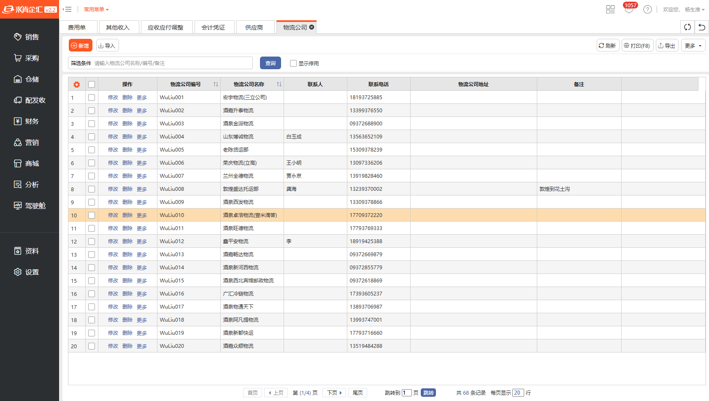

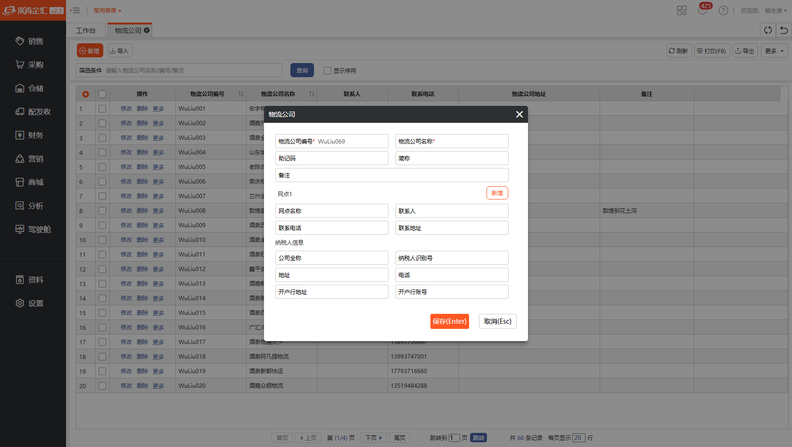

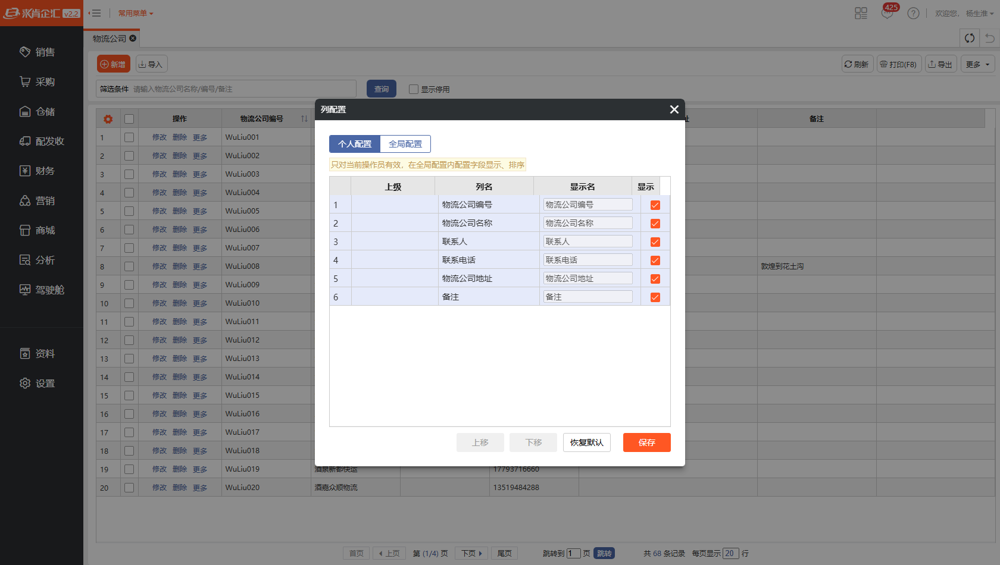

### 本系统（2026-09-11 金标准验收）

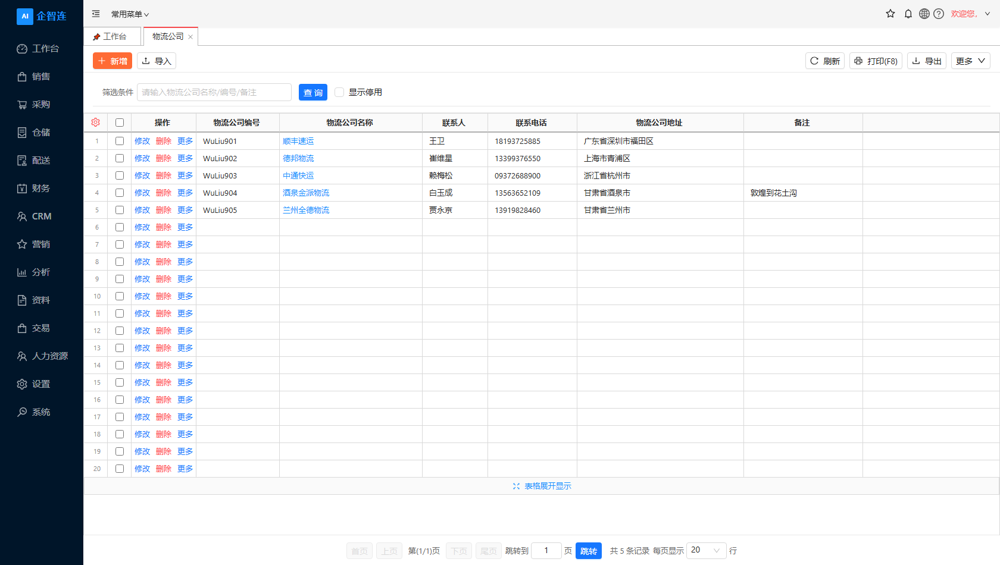

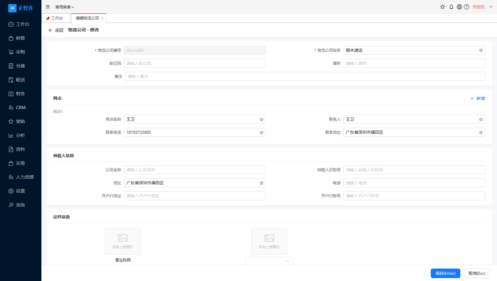

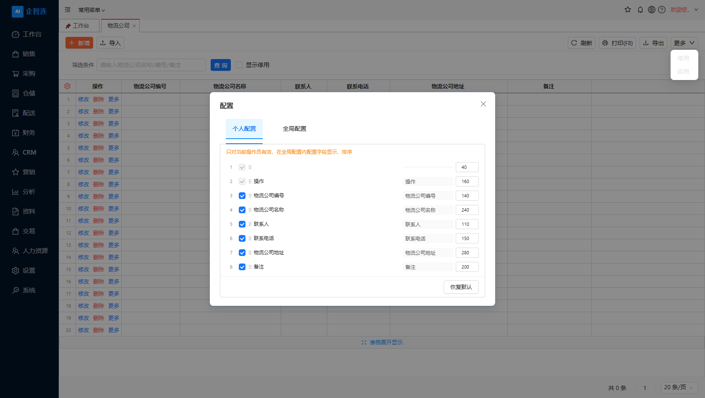

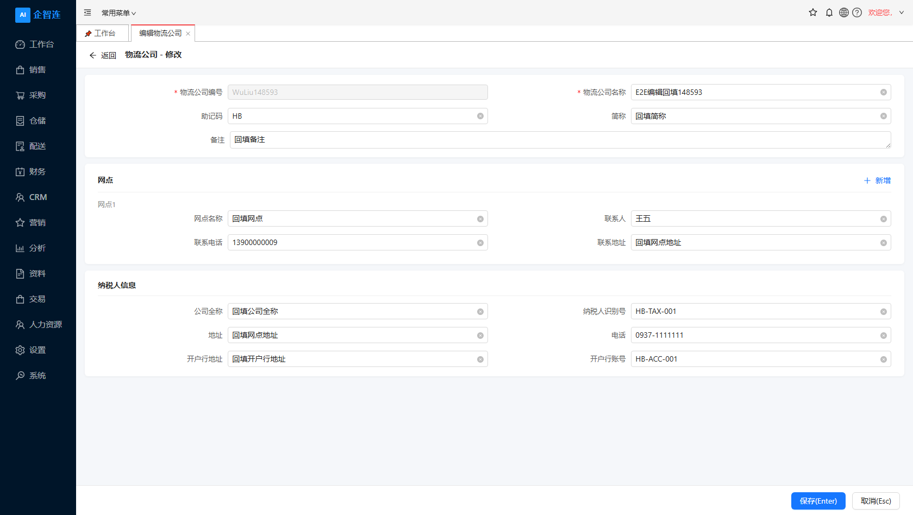

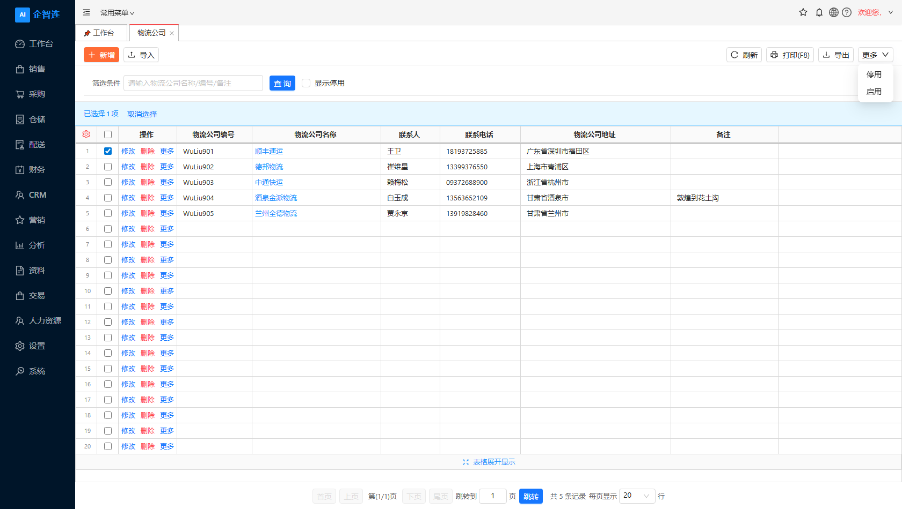

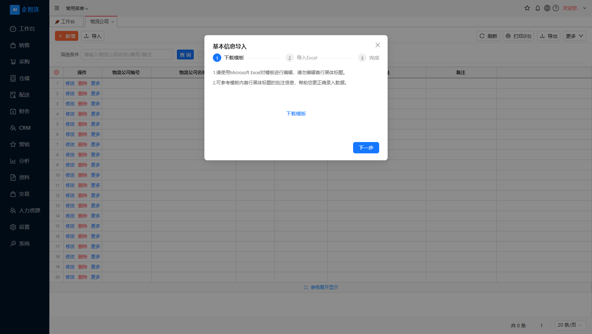

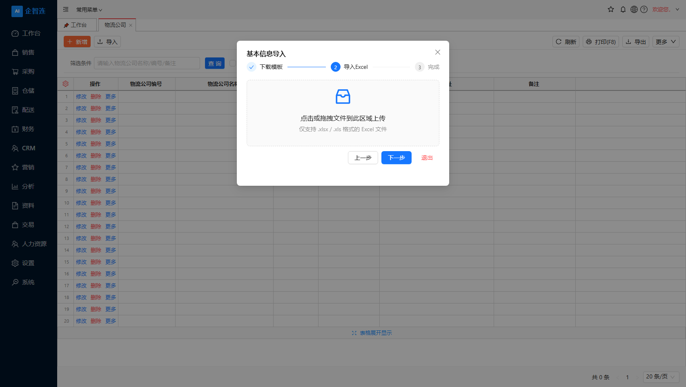

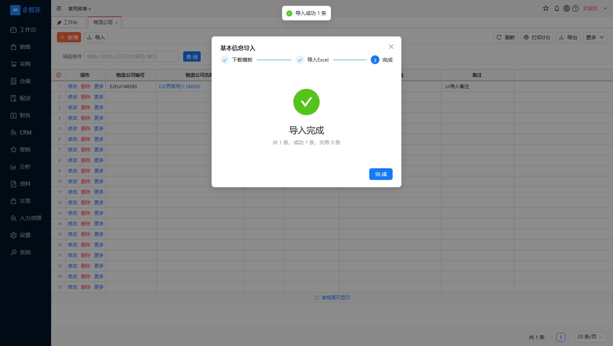

> 「导入」对标实测截图：`对标-物流公司导入向导.png`（520×420 三步向导）、`对标-物流公司工具栏更多菜单.png`（停用/启用）、
> 对标模板原件：`对标-物流公司导入模板.xlsx`（7 列，含首行批注）。

---

## 物流公司列表页配置（对标实测）

### 查询条件（对标实测 · 固定项，无页面配置弹窗）

| 查询条件 | 控件 | 说明 |
|---------|------|------|
| 筛选条件 | input | 占位「请输入物流公司名称/编号/备注」（名称/编号/备注模糊查询） |
| 显示停用 | checkbox | 是否显示停用记录 |
| 查询 | button | 触发查询 |

### 数据表列（对标实测 · 列配置弹窗，全部 6 列）

**全部配置数据列**（序号 1-6，列配置弹窗「全局配置」）：

| # | 列名 | 默认显示 | 排序 |
|---|------|---------|------|
| 1 | 物流公司编号 | [x] | ↑↓ |
| 2 | 物流公司名称 | [x] | ↑↓ |
| 3 | 联系人 | [x] | - |
| 4 | 联系电话 | [x] | - |
| 5 | 物流公司地址 | [x] | - |
| 6 | 备注 | [x] | - |

> **对标默认显示**：6 列全部默认显示。最左另有固定「列配置齿轮」「勾选」「操作」列，不在此配置弹窗内。

> **2026-09-11 探针复核实据**（`tool-results/ql361/pages/ziliao__logistics__colcfg.json`）：
> 弹窗标题「列配置」，Tab「个人配置 / 全局配置」，提示「只对当前操作员有效，在全局配置内配置字段显示、排序」，
> 表头「上级 / 列名 / 显示名 / 显示」，行序号 1-6，底部「上移 / 下移 / 恢复默认 / 保存」——**6 行全部勾选**，无隐藏列。

**本系统实现**：`BillTableList`（`storage-key="md-logistics-columns"`）内置 rowNo 表头齿轮 → 列配置弹窗，
Tab 为「个人配置 / 全局配置」，支持显示切换 / 显示名改写 / 拖拽排序 / 恢复默认；个人配置落 localStorage，全局配置同口径。
列定义（`views/md/logistics/index.vue`）：

| # | 列 | key | 说明 |
|---|----|-----|------|
| 1 | 物流公司编号 | `partnerCode` | biz_party.party_code |
| 2 | 物流公司名称 | `partnerName` | 可点击进编辑 |
| 3 | 联系人 | `contactPerson` | 主网点 linkman，兜底 contact_name |
| 4 | 联系电话 | `contactPhone` | 主网点 phone，兜底 mobile |
| 5 | 物流公司地址 | `address` | 主网点 detail_address，兜底纳税人信息地址 |
| 6 | 备注 | `remark` | biz_party.remark（支持模糊查询） |

### 页面配置弹窗（对标实测）

| 项 | 值 |
|----|----|
| 是否有页面配置弹窗 | **无**（无「配置」齿轮，查询/按钮为固定项） |

---

## 新增编辑物流公司表单页配置（对标实测 · 新增弹窗）

### 关键字段

| 字段 | 说明 | 本系统落点 |
|------|------|-----------|
| 物流公司编号* | 自动生成（实测前缀 `WuLiu`，如 `WuLiu069`） | `biz_party.party_code`（next-seq 取号 + 3 位补零） |
| 物流公司名称* | partnerName（必填） | `biz_party.party_name` |
| 助记码 | 助记码 | `biz_party.mnemonic_code`（V11.133.0 新增列） |
| 简称 | 简称 | `biz_party.short_name` |
| 备注 | remark | `biz_party.remark` |

### 网点（子表，默认「网点1」段落）

| 字段 | 说明 | 本系统落点 |
|------|------|-----------|
| 网点名称 | 网点名称 | `biz_party_contact.contact_name` |
| 联系人 | 联系人 | `biz_party_contact.linkman`（V11.133.0 新增列） |
| 联系电话 | 联系电话 | `biz_party_contact.phone` |
| 联系地址 | 联系地址 | `biz_party_contact.detail_address` |
| 新增 | 新增一个网点段落 | 第 1 条为主网点（`is_primary=1`），列表「联系人/电话/地址」取主网点 |

### 纳税人信息

| 字段 | 说明 | 本系统落点 |
|------|------|-----------|
| 公司全称 | 公司全称 | `biz_party.company_full_name`（V11.133.0 新增列） |
| 纳税人识别号 | 税号 | `biz_party.tax_number` |
| 地址 | 地址 | `biz_party.address`（V11.133.0 新增列） |
| 电话 | 电话 | `biz_party.phone` |
| 开户行地址 | 开户行地址 | `biz_party.bank_address`（V11.133.0 新增列） |
| 开户行账号 | 开户行账号 | `biz_party.bank_account` |

### 按钮

保存(Enter) / 取消(Esc)。

> **2026-09-11 实时抓取实测布局**（`tool-results/ql361/pages/ziliao__logistics__form.json`，弹窗 560×500）：
> 弹出式模态框，两列栅格——
> 行1 物流公司编号* ｜ 物流公司名称*；行2 助记码 ｜ 简称；行3 备注（跨列）；
> 段落「网点1」+ 右侧「新增」；行4 网点名称 ｜ 联系人；行5 联系电话 ｜ 联系地址；
> 段落「纳税人信息」；行6 公司全称 ｜ 纳税人识别号；行7 地址 ｜ 电话；行8 开户行地址 ｜ 开户行账号；
> 底部 保存(Enter)（橙色）｜ 取消(Esc)。字段共 **15 个**，无物流类型/服务区域/运输方式等扩展字段。

**本系统实现**：`views/md/logistics/form.vue` 按上表两列栅格重建（`md/logistics/form` 与 `md/logistics/form/:id` 双入口路由，新增/编辑同页）；
快捷键与对标一致：**`Enter` 保存 / `Esc` 取消**（备注与对标同为单行输入，多行控件内回车才保留换行）。

> ⚠️ **与初稿差异**：对标实测表单**没有**初稿所写的 物流类型 / 服务区域 / 运输方式 / 车辆数 / 冷链 / 危化 / 结算方式 / 税率 等扩展字段，也没有 Contractor 联系人子表用「网点」替代；编号前缀实际为 `WuLiu`（而非初稿的 WLGS/LOG）。

---

## 业务规范说明

- **物流来源**：ERP 往来单位-物流（`biz_party.partyType`=3）。
- **主体关系**：客户=1 supplier=2 logistics=3 other=4 统一 `biz_party`。
- **编号前缀**：签约时按 `md/logistics` 生成，实测前缀 `WuLiu`。
- **物流专有字段**：初稿规划 物流类型/服务区域/运输方式/车辆数/冷链/危化/税率（物流扩展），但对标实测**无这些字段**——q361 的物流公司仅 编号/名称/联系人/电话/地址/备注 + 网点 + 纳税人信息。
- **发货接入**：发货单/配送选择物流公司（物流公司名称），物流类型决定承运范围（如保留）。

---

## 业界对标参考

| 业界环节 / 能力 | 业界典型设计 | 对标实测 | 本系统当前 | 说明 |
|----------------|-------------|---------|-----------|------|
| 物流档案 | 承运商/物流方式/结算 | 编号/名称/联系人/电话/地址/备注 + 网点 + 纳税人信息 | ✅ 已实现 | biz_party（主）+ biz_party_contact（网点），单一口径 |
| 物流类型 | 快递/零担/整车/冷链/危化 | **无此字段** | ➖ 已移除 | 初稿扩展字段，对标无 → 按金标准收敛删除 |
| 结算方式 | 月结/周结/现结/预付 | **无此字段** | ➖ 已移除 | 对标无此字段，本系统扩展字段一并收敛 |
| 冷链/危化 | 特殊运输资质 | **无此字段** | ➖ 已移除 | 同上 |

---

## 实现差异说明（2026-09-11 金标准完成）

**实现文件**：
- 前端列表：`frontend/apps/pc-admin/src/views/md/logistics/index.vue`（`CategoryListLayout` 关分类面板 + `BillTableList`，列配置齿轮在 rowNo 表头；工具栏「更多」= 停用/启用）
- 前端表单：`frontend/apps/pc-admin/src/views/md/logistics/form.vue`（对标 15 字段两列栅格 + 网点 + 纳税人信息）
- 前端导入向导（**跨模块复用组件**）：`frontend/apps/pc-admin/src/components/business/BaseDataImportWizard/index.vue`（三步向导，客户/供应商/其他往来单位可直接复用）
- 前端 API：`api/erp/partner.ts`（`partnerApi` → `/erp/md/customer/*`、`partnerContactApi` → `/erp/partner/contacts`）
- 后端：`erp/erp-partner` 模块 `MdCustomerController`（`/api/erp/md/customer`，partyType=logistics → party_type=3）
  - `GET /import-template?partnerType=logistics`：真实 xlsx 模板（7 列 + 首行批注）
  - `POST /import-excel?partnerType=logistics`：真实解析落库（主档 + 主网点），返回 `{total,success,failure,errors}`
- 迁移：`V11.133.0__Enhance_Logistics_GoldStandard.sql`（biz_party 补 `mnemonic_code`/`company_full_name`/`address`/`bank_address`；biz_party_contact 补 `linkman`）
- 表：`biz_party`（主）+ `biz_party_contact`（网点）——**未新建任何物流专属表**

### 关键收敛决策（对齐对标 + 红线）
1. **删除重复物流扩展层**：移除 `api/erp/logistics.ts`（指向不存在的 `/erp/partner/logistics/*`，调用必 404），
   物流公司统一复用往来单位主数据接口，落实「P0 物流单一口径（严禁另建重复物流表）」。
2. **字段收敛到对标**：移除初稿的 物流类型 / 服务区域 / 运输方式 / 车辆数 / 冷链 / 危化 / 结算方式 / 税率
   等对标**实测不存在**的扩展字段（同时消除了「表单录入被静默丢弃」的隐患）。
3. **编号口径对齐实测**：`WuLiu` + 3 位补零（`WuLiu001`），走 `/erp/md/customer/next-seq?prefix=WuLiu`；
   导入时编号留空也按同一口径补号。
4. **布局差异落地**：物流公司页**不渲染分类树**（对标无），筛选区仅「筛选条件 + 查询 + 显示停用」；
   原共享 `PartnerListPage`（含分类树/物流扩展列）不再被本页使用。
5. **「更多」菜单对齐**：只保留对标实测的 **停用 / 启用** 两项（按勾选行批量生效），移除自造的批量删除。
6. **导入从"假导入"改为真实闭环**：原实现 POST 到 `/import/v2/excel/customer`（core-api 通用导入接口**只做校验、不落库**），
   上传后提示「导入成功」但数据库无任何记录；现按对标改为三步向导 + 业务模块真实落库。
7. **补行首勾选列**（对标列表左侧：序号 / 勾选 / 操作）：原列表缺勾选列，导致工具栏「更多 → 停用/启用」永远拿不到选中行
   （菜单项恒灰、功能不可用）。现补 `type: 'checkbox'` 固定列并接通 `selection-change`，批量停用/启用真实生效。
8. **分页栏改经典形态**：内置 `a-pagination`（`共 N 条` + 每页条数下拉）与对标不符 → 改用 `StandardPagination variant="classic"`
   （首页 / 上页 / 第(x/y)页 / 下页 / 尾页 / 跳转到 N 页 / 共 N 条记录 / 每页显示 N 行），与供应商、商品等资料页统一。
9. **快捷键对齐文案**：按钮写「保存(Enter)」但实际要 `Ctrl+Enter` → 备注改单行输入，改为 `Enter` 保存 / `Esc` 取消。
10. **行内「更多」复核**：对标 = 停用 / 模板配置。本页行内「更多」保留 **停用 / 启用（按当前状态切换）**——与对标「停用」项语义一致；
    「模板配置」需打印模板设计器模块支撑，本系统尚无，已在遗留中登记（见上文与截图 `对标-物流公司模板配置(打印模板设计器).png`）。

### 端到端验收（2026-09-11 · `tools/e2e-logistics.cjs` + `tools/e2e-logistics-import.py`）

| 维度 | 结果 |
|------|------|
| 接口 + UI | **92/92 通过**（`ERP_PORT=5662 node tools/e2e-logistics.cjs`）——号段取号、新增返回 id、网点增删改、列表带出主网点联系人/电话/地址、备注模糊查询、纳税人信息回读、更新、启停用、导出真实 xlsx、删除、列表 9 项工具栏/6 列表头/无分类树/列配置弹窗、**行首勾选列**、**经典分页栏 7 项**、「更多」= 停用+启用、**「更多→停用」对勾选行真实落库**、导入向导三步（标题/文案/下载真实 xlsx/上传/完成统计/落库校验）、表单 19 项文案、编号自动生成、**Enter 键保存**、编辑回填、无 JS 报错 |
| 导入接口专项 | **14/14 通过**（`python tools/e2e-logistics-import.py`）——模板表头/批注、真实 xlsx 落库、主网点联系人+电话+地址、备注、类型、显式编号原样落库、缺编号按 WuLiu 补号、重号拒绝 |
| 截图 | `docs/Yh-Spec/对标页面截图/2026.9.11/物流公司/`（对标 6 张 + 本系统 8 张 + 对标导入模板原件） |
| 验收账号 | `tools/e2e-logistics-user.sql` 创建专用账号 `e2e_logistics`（避免与并行会话共用 admin 互踢） |

### 顺带修复的跨模块缺陷（P0）
- **POI 读 xlsx 抛 `NoSuchMethodError: FileTimes.isUnixTime`**（导入 Excel 全部 500）：`pom.xml` 中
  `commons-compress` 被升到 1.27.1，但其传递依赖 `commons-io` 仍解析到 2.15.0，而 1.27.1 的
  `ZipArchiveEntry#canConvertToInfoZipExtendedTimestamp` 调用的是 commons-io **2.16.1** 才引入的 `FileTimes.isUnixTime`。
  影响面：**所有走 `WorkbookFactory.create()` 的 Excel 导入**（客户/供应商/物流/其他往来单位/商品等）。
  修复：根 `pom.xml` `dependencyManagement` 统一 `commons-io` 到 **2.16.1**。触发条件是 xlsx 压缩包的
  extended-timestamp 元数据（Excel/WPS/SheetJS 产出的文件都会命中；openpyxl 产出的文件不一定命中，
  这也是该缺陷此前未被发现的原因）。
- **`biz_party_contact` 缺 `tenant_id` 列**：多租户插件对该表会注入 `tenant_id`（INSERT 追加、SELECT 过滤），
  但建表时漏列 → 往来单位「联系人/网点」子表**读写全部 500**
  （`PSQLException: 关系 "biz_party_contact" 的 "tenant_id" 字段不存在`）。
  影响 客户 / 供应商 / 物流公司 / 其他往来单位 四类基础资料的联系人保存。
  修复：`V11.150.0__Add_Tenant_Id_To_Party_Contact.sql`（补列 + 按归属往来单位回填 + 默认 0 非空）。
- **`MdCustomerController` 新增接口不返回 id**：原返回 `Boolean`，前端拿到 `undefined` → 子表（联系人/网点）挂接
  `partyId=0`。修复：`create` 返回含 id 的完整 VO。
- **往来单位「对方地址/联系人/电话」列表列为空**：`MdCustomerVO` 未带出子表主记录。修复：
  `fillPrimaryContacts()` 整页一次 IN 查询填充（主网点优先 `is_primary=1`）。
- **编辑路由 404**：`router/dynamicRoutes.ts` 的 `getRequiredRoutes()` 缺 `md/logistics/form/:id`，
  列表「修改」跳转 `/md/logistics/form/{id}` 直接 404（新增路由由菜单 displayMode=1 动态注册，
  带 id 的编辑路由不在菜单树内）。修复：补隐藏路由 `MdLogisticsFormEdit`。
  > 同类隐患：`md/customer/form/:id`、`md/supplier/form/:id`、`md/partner/form/:id` 当前同样未在
  > `getRequiredRoutes()` 中注册，客户/供应商表单的「修改」跳转存在一致的 404 风险，待对应模块自查。

> **Ant Design Vue 踩坑（已写入代码注释）**：`<a-dropdown>` 的 `#overlay` 插槽**首个子节点必须是 `a-menu`**；
> 若首个子节点是 HTML 注释（例如把说明注释写在插槽内第一行），antd 会 `cloneElement` 到这个注释节点上，
> 下拉浮层渲染为空白（点开「更多」没有任何菜单项）。本次工具栏「更多」即因此一度失灵。

### 顺带修复的跨模块缺陷（P0）
- **`biz_party_contact` 缺 `tenant_id` 列**：多租户插件对该表会注入 `tenant_id`（INSERT 追加、SELECT 过滤），
  但建表时漏列 → 往来单位「联系人/网点」子表**读写全部 500**
  （`PSQLException: 关系 "biz_party_contact" 的 "tenant_id" 字段不存在`）。
  影响 客户 / 供应商 / 物流公司 / 其他往来单位 四类基础资料的联系人保存。
  修复：`V11.150.0__Add_Tenant_Id_To_Party_Contact.sql`（补列 + 按归属往来单位回填 + 默认 0 非空）。
- **`MdCustomerController` 新增接口不返回 id**：原返回 `Boolean`，前端拿到 `undefined` → 子表（联系人/网点）挂接
  `partyId=0`。修复：`create` 返回含 id 的完整 VO。
- **往来单位「对方地址/联系人/电话」列表列为空**：`MdCustomerVO` 未带出子表主记录。修复：
  `fillPrimaryContacts()` 整页一次 IN 查询填充（主网点优先 `is_primary=1`）。
- **编辑路由 404**：`router/dynamicRoutes.ts` 的 `getRequiredRoutes()` 缺 `md/logistics/form/:id`，
  列表「修改」跳转 `/md/logistics/form/{id}` 直接 404（新增路由由菜单 displayMode=1 动态注册，
  带 id 的编辑路由不在菜单树内）。修复：补隐藏路由 `MdLogisticsFormEdit`。
  > 同类隐患：`md/customer/form/:id`、`md/supplier/form/:id`、`md/partner/form/:id` 当前同样未在
  > `getRequiredRoutes()` 中注册，客户/供应商表单的「修改」跳转存在一致的 404 风险，待对应模块自查。

### 遗留（非阻塞）
1. 表单为独立路由页（`md/logistics/form`），对标是模态弹窗——为与本系统双入口菜单及客户/供应商表单形态保持一致，保留独立页；字段与布局已逐一对齐。
2. 「打印(F8)」为浏览器打印当前列表（与在线支付对账单等已验收页面同口径），未接打印模板。
3. 网点删除采用逻辑删除（`partner_contact.deleted=1`），历史网点数据保留可追溯。
4. 导入模板**未内置对标那样的示例数据行**（对标模板带 `wlgs002/顺丰/王卫` 示例；示例行若不删除会被真实导入，
   故本系统只保留首行标题 + 批注说明，避免误导入脏数据）。
6. **行内「更多 → 模板配置」未实现**：对标跳转「模板设置」打印模板设计器（物流面单：字段拖拽/标签尺寸/预览/另存为），
   本系统无该模块（跨模块缺口，建议单独立项，勿在资料页内造桩）。
5. **客户 / 供应商的「导入」仍是假导入**（调用 core-api 通用接口 `/import/v2/excel/customer`，该接口只做校验、不落库）。
   物流公司与**其他往来单位（md/partner）已切换到真实闭环**（同一 `BaseDataImportWizard` 组件 + `/erp/md/customer/import-excel`），
   客户 / 供应商待切换（建议按同口径统一，避免重复实现）。

---

## 跨模块检查问题（P0→P2）

> 本页为主数据/基础资料，被销售/采购/仓储/财务统一引用；以下为跨模块联动与口径协调。

| 级别 | 问题 | 修复要点 | 状态 |
|---|---|---|---|
| P1 | 主数据联动 | 物流公司被发货单/配送/承运结算统一引用 | ✅ 已满足（单一口径 `biz_party.party_type=3`，无重复物流表） |
| P1 | 数据源唯一 | 复用 `biz_party`（partyType=3），仅扩展物流专有字段 | ✅ 已满足（扩展字段收敛到对标：助记码 + 纳税人信息，均在 `biz_party`） |
| P2 | 引用一致 | 物流公司变更（名称/联系人/电话/地址）实时反映到发货/配送 | ✅ 已满足（下游按 partyId 关联主数据，实时读） |
| P2 | 金标准 | 列表升级 `CategoryListLayout` + 列配置弹窗（对标无页面配置弹窗） | ✅ 已完成（2026-09-11，92/92 + 导入 14/14 通过） |
| P0 | 子表租户列 | `biz_party_contact` 缺 `tenant_id` 致往来单位联系人群 500 | ✅ 已修（V11.150.0，跨模块受益） |
| P0 | Excel 导入 500 | `commons-io 2.15.0` 与 `commons-compress 1.27.1` 不兼容致 `WorkbookFactory` 抛 `NoSuchMethodError` | ✅ 已修（根 pom 升 `commons-io` 2.16.1，全模块受益） |
| P0 | 假导入 | 「导入」只校验不落库，提示成功但无数据 | ✅ 物流公司已改真实落库；客户/供应商/其他往来单位待切换（组件与接口已就绪） |
| P1 | 「更多」菜单 | 自造「批量停用/启用 + 批量删除」与对标不符 | ✅ 已收敛为对标实测的 停用 / 启用 |

---

## 最终裁决方案（2026-09-07 制定 · 2026-09-11 执行完毕）

- **P0 物流单一口径（红线）**：本页物流公司为全局基础数据，发货/配送/承运结算统一引用，**严禁另建重复物流表**；扩展字段统一进 `biz_party`。
  → ✅ 已执行：未新建物流专属表，`api/erp/logistics.ts` 已删除，全部走 `/erp/md/customer/*`。
- **P1 关联一致性**：字段变更后实时反映到发货与配送，保证前后端口径一致。
  → ✅ 已执行：对标实测无 `logisticsType`/`settleType` 扩展字段，已按金标准收敛删除（消除「列表字符串 vs 表单数字」枚举不一致）；
  下游（发货/配送）按 `partyId` 实时读主数据，不存在冗余副本。
- **P2 验收**：无桩/无模拟；物流增删改、启停、导出、导入闭环真实生效。
  → ✅ 已执行：`tools/e2e-logistics.cjs` **92/92 通过**（含导出真实 xlsx、导入向导真实落库、批量停用闭环、删除闭环、UI 无 JS 报错），
  `tools/e2e-logistics-import.py` **14/14 通过**，截图归档 `2026.9.11/物流公司/`。

---

## 开发原则（通用）

- **页面组件优先复用**：复用通用 `PartnerListPage` 与 `biz_party` 主数据。
- **功能/模块不重复开发**：物流公司复用往来单位主数据，仅扩展物流专有字段。
- **阶段结束前回写开发文档**：每阶段结束前更新文档「已完成」与「待完善」，反映当前代码实际实现。

---

## 开发原则（通用）
- **页面组件优先复用**、**功能/模块不重复开发**、**阶段结束前回写开发文档**。
- **【金标准】模块级 E2E 脚本统一放 `tools/`**：新增模块级端到端验收脚本命名 `tools/e2e-<模块>.cjs`，用 `NODE_PATH` 加载依赖、**不依赖脚本自身所在位置**；历史散落在项目根目录的脚本已统一归置到 `tools/acceptance/`，**该目录不可再移动**（脚本用 `__dirname` 定位项目根，见其 README）。
- **【金标准】启动进程随手关**：任何人 / 每个 AI 会话在结束工作前，必须关闭**自己启动**的实例 —— 后端 `java -jar ...core-api-*.jar`（含为验证临时复制的 `<模块>-run.jar`）与前端 `vite` dev server，并清理自己产生的临时产物（临时 fat jar、日志、截图）；**不得清理他人产物**（尤其刚打包好的 `target/*.jar`）。详见 `AI_DEVELOPER_RULES.md` **7.3 会话收尾纪律**。
