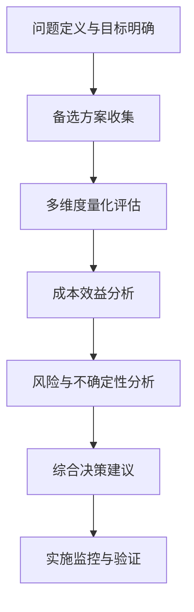
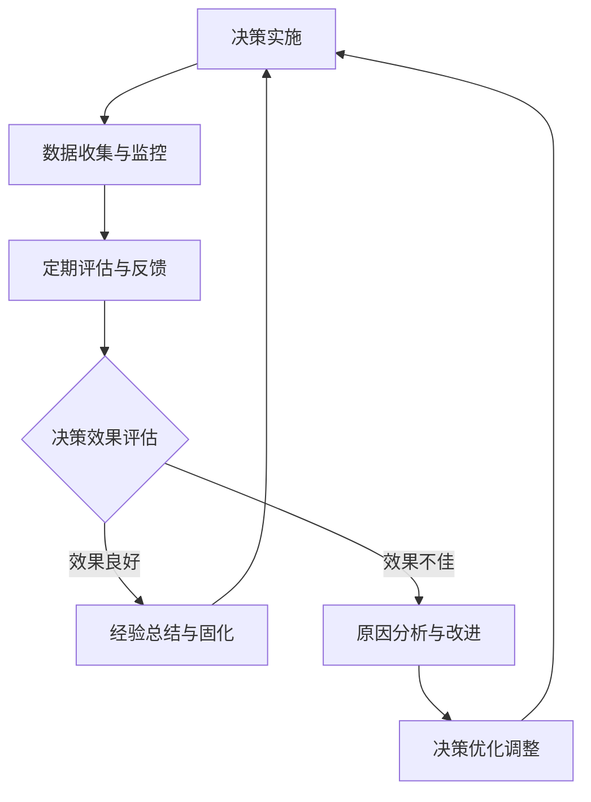

# 架构决策量化分析方法设计

## 1. 背景与目标

### 1.1 背景
基于AI-Ready项目紧急制动教训：架构决策缺乏客观量化依据，导致技术偏好主导决策，架构演进脱离业务价值。

### 1.2 目标
建立一套科学、可量化、可复制的架构决策分析方法，确保架构决策始终与业务价值最大化保持一致。

## 2. 架构决策分析框架

### 2.1 四个核心分析维度

#### 2.1.1 技术可行性维度（权重：25%）
**评估重点**：技术方案的成熟度、稳定性、可实施性

**核心指标**：
1. **技术成熟度**
   - 技术社区活跃度指数
   - 版本发布频率和稳定性
   - 生态系统完善度
   - 文档质量评分

2. **实施复杂度**
   - 学习曲线陡峭度
   - 集成复杂度评分
   - 部署复杂度评分
   - 运维复杂度评分

3. **技术风险**
   - 技术锁定风险
   - 技术淘汰风险
   - 供应链风险
   - 安全风险评分

#### 2.1.2 业务价值维度（权重：35%）
**评估重点**：方案对业务目标的贡献程度

**核心指标**：
1. **直接价值贡献**
   - 功能完整性得分
   - 性能提升幅度（%）
   - 扩展性提升（%）
   - 可用性提升（%）

2. **间接价值贡献**
   - 客户满意度提升预期
   - 运营效率提升预期
   - 成本节约预期（¥）
   - 风险降低预期（%）

3. **战略价值**
   - 与战略目标一致性
   - 未来扩展可能性
   - 竞争优势建立
   - 技术创新价值

#### 2.1.3 成本效益维度（权重：25%）
**评估重点**：投入产出比和经济效益

**核心指标**：
1. **实施成本**
   - 开发成本（人月）
   - 硬件/软件成本（¥）
   - 培训成本（¥）
   - 迁移成本（¥）

2. **运营成本**
   - 维护成本（¥/月）
   - 扩容成本（¥/单位）
   - 故障处理成本（¥/次）
   - 升级成本（¥/次）

3. **效益分析**
   - 投资回报率（%）
   - 回收期（月）
   - 净现值（¥）
   - 内部收益率（%）

#### 2.1.4 组织适配度维度（权重：15%）
**评估重点**：方案与组织能力的匹配程度

**核心指标**：
1. **团队能力匹配**
   - 现有技能覆盖度（%）
   - 学习成本评分
   - 团队接受度评分
   - 知识传递难度

2. **流程适配度**
   - 与现有流程一致性
   - 变更影响范围
   - 培训需求度
   - 文化适配度

3. **资源可获得性**
   - 人才可获得性
   - 工具可获得性
   - 外部支持可获得性
   - 时间资源可获得性

### 2.2 决策分析矩阵

| 分析维度 | 权重 | 核心指标 | 评分标准 |
|---------|------|---------|---------|
| 技术可行性 | 25% | 技术成熟度 | 0-10分 |
|          |     | 实施复杂度 | 0-10分 |
|          |     | 技术风险 | 0-10分 |
| 业务价值 | 35% | 直接价值贡献 | 0-10分 |
|          |     | 间接价值贡献 | 0-10分 |
|          |     | 战略价值 | 0-10分 |
| 成本效益 | 25% | 实施成本 | 0-10分 |
|          |     | 运营成本 | 0-10分 |
|          |     | 效益分析 | 0-10分 |
| 组织适配度 | 15% | 团队能力匹配 | 0-10分 |
|          |     | 流程适配度 | 0-10分 |
|          |     | 资源可获得性 | 0-10分 |

## 3. 量化分析方法

### 3.1 多维度加权评分法

#### 3.1.1 综合评分计算公式

```
综合评分 = ∑(维度权重 × 维度得分)
维度得分 = ∑(指标权重 × 指标评分)
指标评分 = 基础评分 + 调整系数
```

#### 3.1.2 评分等级标准

| 评分范围 | 等级 | 决策建议 |
|---------|------|---------|
| 8.0-10.0 | 卓越 | 强烈推荐实施 |
| 6.5-7.9 | 良好 | 推荐实施，需要适当优化 |
| 5.0-6.4 | 中等 | 谨慎考虑，需要详细论证 |
| 3.0-4.9 | 一般 | 不推荐，除非有特殊考虑 |
| 0.0-2.9 | 较差 | 不推荐 |

### 3.2 成本效益分析方法

#### 3.2.1 ROI计算模型
```
投资回报率(ROI) = (总收益 - 总投资) / 总投资 × 100%
总收益 = ∑(年度收益 × 折现系数)
总投资 = 开发成本 + 硬件成本 + 培训成本 + 迁移成本
```

#### 3.2.2 净现值(NPV)计算
```
净现值 = ∑(年度净现金流 / (1 + 折现率)^年份) - 初始投资
```

#### 3.2.3 内部收益率(IRR)计算
```
内部收益率 = 使净现值等于零的折现率
```

### 3.3 敏感性分析

#### 3.3.1 关键变量敏感性分析
**分析变量**：
1. **开发成本**：±20%变化对ROI的影响
2. **运营收益**：±15%变化对ROI的影响
3. **时间成本**：±10%变化对回收期的影响

#### 3.3.2 风险调整后价值
```
风险调整后价值 = 预期价值 × (1 - 风险系数)
风险系数 = ∑(风险概率 × 风险影响程度)
```

## 4. 决策分析工作流程

### 4.1 决策分析六步法



### 4.2 详细流程步骤

#### 步骤1：问题定义与目标明确
1. **问题陈述**：清晰描述架构决策需要解决的问题
2. **决策目标**：明确期望达成的业务和技术目标
3. **约束条件**：识别时间、预算、技术等约束

#### 步骤2：备选方案收集
1. **方案生成**：提出2-4个可行的备选方案
2. **方案描述**：详细描述每个方案的技术实现
3. **方案对比**：建立初步对比框架

#### 步骤3：多维度量化评估
1. **指标评分**：对各方案进行四个维度的量化评分
2. **数据收集**：收集相关数据和专家评估
3. **初步排序**：基于评分进行初步方案排序

#### 步骤4：成本效益分析
1. **成本估算**：详细估算各方案的成本
2. **收益预测**：预测各方案的收益
3. **经济指标计算**：计算ROI、NPV、IRR等指标

#### 步骤5：风险与不确定性分析
1. **风险识别**：识别各方案的主要风险
2. **风险量化**：评估风险概率和影响
3. **敏感性分析**：分析关键变量的影响

#### 步骤6：综合决策建议
1. **综合评估**：整合所有分析结果
2. **决策建议**：提出明确的决策建议
3. **实施计划**：制定详细的实施计划

## 5. 决策支持工具与模板

### 5.1 决策分析矩阵模板

| 评估维度 | 权重 | 方案A得分 | 方案B得分 | 方案C得分 | 加权得分A | 加权得分B | 加权得分C |
|---------|------|----------|----------|----------|----------|----------|----------|
| 技术可行性 | 25% | [得分] | [得分] | [得分] | [加权] | [加权] | [加权] |
| 业务价值 | 35% | [得分] | [得分] | [得分] | [加权] | [加权] | [加权] |
| 成本效益 | 25% | [得分] | [得分] | [得分] | [加权] | [加权] | [加权] |
| 组织适配度 | 15% | [得分] | [得分] | [得分] | [加权] | [加权] | [加权] |
| **综合得分** | **100%** | - | - | - | **[总分]** | **[总分]** | **[总分]** |

### 5.2 成本效益分析模板

```markdown
# [方案名称] 成本效益分析报告

## 1. 成本估算
### 1.1 一次性成本
- 开发成本：[金额]
- 硬件成本：[金额]
- 软件许可：[金额]
- 培训成本：[金额]
- 迁移成本：[金额]
- **总计一次性成本**：[总金额]

### 1.2 年度运营成本
- 维护成本：[金额/年]
- 扩容成本：[金额/年]
- 支持成本：[金额/年]
- **总计年度成本**：[总金额/年]

## 2. 收益预测
### 2.1 直接收益
- 收入增长：[金额/年]
- 成本节约：[金额/年]
- 效率提升：[金额/年]
- **总计年度收益**：[总金额/年]

### 2.2 间接收益
- 客户满意度提升：[价值评分]
- 竞争优势建立：[价值评分]
- 风险降低：[价值评分]

## 3. 经济指标计算
- **投资回报率(ROI)**：[XX%]
- **回收期**：[X个月]
- **净现值(NPV)**：[金额]
- **内部收益率(IRR)**：[XX%]

## 4. 敏感性分析
- 开发成本变化±20%对ROI影响：[分析结果]
- 运营收益变化±15%对ROI影响：[分析结果]
- 时间成本变化±10%对回收期影响：[分析结果]

## 5. 风险调整后价值
- **预期价值**：[金额]
- **风险系数**：[系数]
- **风险调整后价值**：[金额]
```

## 6. 决策验证与反馈机制

### 6.1 决策验证周期

| 验证阶段 | 时间节点 | 验证重点 | 验证方法 |
|---------|---------|---------|---------|
| 设计验证 | 设计完成 | 方案可行性 | 技术评审、原型验证 |
| 实施验证 | 开发完成 | 实施效果 | 功能测试、性能测试 |
| 上线验证 | 上线后30天 | 业务价值 | 业务指标、用户反馈 |
| 长期验证 | 每季度一次 | 持续价值 | 持续监控、定期评估 |

### 6.2 反馈收集机制

#### 6.2.1 定量反馈
1. **业务指标监控**
   - 关键绩效指标(KPI)
   - 业务成果指标(OKR)
   - 用户行为指标

2. **技术指标监控**
   - 系统性能指标
   - 系统稳定性指标
   - 代码质量指标

#### 6.2.2 定性反馈
1. **用户反馈**
   - 用户满意度调查
   - 用户访谈
   - 用户反馈收集

2. **团队反馈**
   - 开发团队反馈
   - 运维团队反馈
   - 业务团队反馈

### 6.3 决策优化循环



## 7. 实施路线图

### 7.1 短期实施（1个月内）
1. **基础框架建立**
   - 完成分析方法设计
   - 建立评估模板
   - 培训核心团队

2. **试点应用**
   - 选择1-2个关键决策试点
   - 收集试点反馈
   - 优化分析方法

### 7.2 中期实施（1-3个月）
1. **流程制度化**
   - 集成到项目管理流程
   - 建立强制评审机制
   - 建立决策知识库

2. **工具自动化**
   - 开发决策支持工具
   - 建立自动化数据采集
   - 建立决策可视化看板

### 7.3 长期实施（3个月以上）
1. **持续优化**
   - 基于实际数据优化模型
   - 建立机器学习预测模型
   - 建立决策质量评估体系

2. **文化建立**
   - 建立数据驱动决策文化
   - 建立持续改进机制
   - 建立经验传承机制

## 8. 成功衡量标准

### 8.1 过程指标
- **决策分析覆盖率**：应用分析方法决策占比（目标：90%）
- **决策分析质量**：分析方法完整性评分（目标：≥8.5/10）
- **决策分析效率**：平均分析时间（目标：≤3天）

### 8.2 结果指标
- **决策质量提升**：错误决策率降低（目标：降低60%）
- **投资回报率提升**：平均ROI提升（目标：提升25%）
- **实施成功率提升**：项目成功率提升（目标：提升30%）

### 8.3 文化指标
- **团队满意度**：团队对决策过程满意度（目标：≥8.0/10）
- **决策透明度**：决策过程透明度评分（目标：≥8.5/10）
- **知识传承度**：决策经验传承完整性（目标：≥85%）

## 9. 附录

### 9.1 参考文献
[相关文献列表...]

### 9.2 工具推荐
[决策分析工具推荐...]

### 9.3 最佳实践案例
[成功应用案例...]