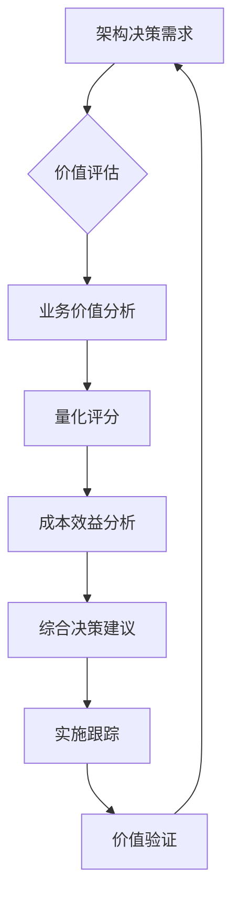

# 架构治理专项：业务价值评估与架构决策量化分析实施指南

## 一、项目背景与紧急制动教训

### 1.1 紧急制动回顾
**时间**：2026-05-05 01:30  
**问题**：发现严重的目录结构重复问题，多处重复模块同时存在  
**根本原因**：缺乏业务价值量化评估机制，架构决策基于技术偏好而非业务价值

### 1.2 核心教训总结
1. **架构决策脱离业务价值**：技术方案选择缺乏价值导向
2. **缺乏量化评估机制**：决策过程主观性强，缺乏数据支持
3. **架构治理缺失**：缺乏持续的架构健康监控机制
4. **决策反馈机制不完善**：错误决策难以及时发现和纠正

## 二、量化分析方法体系概览

### 2.1 两大核心分析方法

#### 2.1.1 业务价值评估框架
**目的**：评估架构决策对业务价值的贡献程度  
**核心维度**：
- 业务收益维度（35%）：收入增长、成本节约
- 用户体验维度（25%）：效率提升、用户满意度
- 技术价值维度（20%）：架构质量、可维护性
- 战略价值维度（20%）：市场竞争力、创新价值

#### 2.1.2 架构决策量化分析方法
**目的**：为架构决策提供科学、量化的决策依据  
**核心维度**：
- 技术可行性维度（25%）：成熟度、复杂度、风险
- 业务价值维度（35%）：直接价值、间接价值、战略价值
- 成本效益维度（25%）：实施成本、运营成本、效益分析
- 组织适配度维度（15%）：团队能力、流程适配、资源可得性

### 2.2 方法体系关系



## 三、实施步骤与工作流程

### 3.1 第一阶段：准备与培训（1-2周）

#### 3.1.1 团队组建
**角色分工**：
- **架构治理委员会**：负责方法制定和重大决策评审
- **业务分析师**：负责业务价值评估
- **技术架构师**：负责技术可行性评估
- **项目经理**：负责成本效益分析
- **实施团队**：负责具体方案实施

#### 3.1.2 培训计划
**培训内容**：
1. **方法论培训**（2天）
   - 业务价值评估框架
   - 架构决策量化分析方法
   - 成本效益分析方法

2. **工具培训**（1天）
   - 评估模板使用
   - 数据分析工具
   - 决策支持系统

3. **案例分析**（1天）
   - 成功案例学习
   - 失败案例复盘
   - 实战演练

### 3.2 第二阶段：试点实施（2-4周）

#### 3.2.1 试点项目选择
**选择标准**：
1. **代表性**：涵盖主要架构决策类型
2. **重要性**：对业务有显著影响
3. **可控性**：风险可控，影响范围明确

**推荐试点项目**：
1. **技术选型决策**：微服务框架选型
2. **架构升级决策**：数据库技术升级
3. **方案设计决策**：系统重构方案选择

#### 3.2.2 试点工作流程

**周计划**：
- **第一周**：试点项目启动，初步评估
- **第二周**：详细分析，形成评估报告
- **第三周**：决策实施，跟踪监控
- **第四周**：效果评估，方法优化

### 3.3 第三阶段：全面推广（1-2个月）

#### 3.3.1 流程制度化
**制度要求**：
1. **强制评审机制**：所有重大架构决策必须经过量化分析
2. **文档化要求**：分析过程和结果必须文档化
3. **决策追溯机制**：决策过程和依据可追溯

#### 3.3.2 工具自动化
**自动化目标**：
1. **数据自动采集**：业务数据、技术数据自动采集
2. **分析自动化**：自动生成评估报告
3. **决策支持**：智能决策建议生成

## 四、决策分析检查清单

### 4.1 业务价值评估检查清单

#### 4.1.1 数据完整性检查
- [ ] 业务收益数据是否完整
- [ ] 用户体验数据是否可获取
- [ ] 技术指标数据是否准确
- [ ] 战略价值评估是否充分

#### 4.1.2 评估过程检查
- [ ] 四个价值维度是否都评估
- [ ] 权重分配是否合理
- [ ] 评分依据是否明确
- [ ] 评估结果是否可验证

#### 4.1.3 报告完整性检查
- [ ] 价值概览是否清晰
- [ ] 分维度分析是否详细
- [ ] 量化数据是否充分
- [ ] 建议是否具体可行

### 4.2 架构决策分析检查清单

#### 4.2.1 方案准备检查
- [ ] 备选方案是否充分（至少2个）
- [ ] 方案描述是否完整
- [ ] 技术实现是否清晰
- [ ] 约束条件是否明确

#### 4.2.2 分析过程检查
- [ ] 四个分析维度是否都覆盖
- [ ] 评分标准是否统一
- [ ] 数据来源是否可靠
- [ ] 分析过程是否透明

#### 4.2.3 成本效益检查
- [ ] 成本估算是否完整
- [ ] 收益预测是否合理
- [ ] 经济指标计算是否正确
- [ ] 敏感性分析是否充分

## 五、常见问题与解决方案

### 5.1 数据收集问题

#### 问题1：业务数据难以量化
**解决方案**：
1. **建立数据指标体系**：明确关键指标和采集方法
2. **设计替代指标**：用可测量的指标替代难以量化的指标
3. **专家评估方法**：结合专家定性评估

#### 问题2：技术指标不一致
**解决方案**：
1. **建立统一标准**：制定技术指标评估标准
2. **数据标准化**：统一数据格式和采集频率
3. **工具统一**：使用统一的监控和评估工具

### 5.2 评估方法问题

#### 问题1：权重设置主观性强
**解决方案**：
1. **历史数据参考**：基于历史决策数据优化权重
2. **多专家评估**：采用德尔菲法等多专家评估方法
3. **AHP层次分析法**：使用科学方法确定权重

#### 问题2：评估结果难以验证
**解决方案**：
1. **建立验证机制**：制定明确的验证标准和方法
2. **长期跟踪**：建立长期的决策效果跟踪机制
3. **反馈闭环**：建立评估-实施-反馈-优化的闭环

### 5.3 组织落地问题

#### 问题1：团队接受度低
**解决方案**：
1. **渐进式推进**：从试点开始，逐步推广
2. **成功案例宣传**：展示成功案例和实际效果
3. **激励机制**：建立评估结果与激励机制挂钩

#### 问题2：流程复杂度高
**解决方案**：
1. **工具自动化**：开发自动化工具降低复杂度
2. **模板标准化**：提供标准化的评估模板
3. **流程优化**：持续优化评估流程

## 六、决策质量监控指标体系

### 6.1 决策过程指标

| 指标 | 目标值 | 测量方法 | 监控频率 |
|------|-------|---------|---------|
| 决策分析覆盖率 | ≥90% | 应用分析方法决策数/总决策数 | 每月 |
| 决策分析完整性 | ≥8.5/10 | 分析方法应用完整性评分 | 每月 |
| 决策分析效率 | ≤3天 | 从需求到分析完成平均时间 | 每季度 |
| 数据质量评分 | ≥95% | 数据完整性和准确性评分 | 每月 |

### 6.2 决策结果指标

| 指标 | 目标值 | 测量方法 | 监控频率 |
|------|-------|---------|---------|
| 错误决策率降低 | ≥60% | (基线错误率-当前错误率)/基线错误率 | 每季度 |
| 平均ROI提升 | ≥25% | (当前ROI-基线ROI)/基线ROI | 每季度 |
| 项目成功率提升 | ≥30% | (当前成功率-基线成功率)/基线成功率 | 每半年 |
| 用户满意度提升 | ≥10分 | 用户满意度评分差值 | 每季度 |

### 6.3 组织文化指标

| 指标 | 目标值 | 测量方法 | 监控频率 |
|------|-------|---------|---------|
| 团队满意度 | ≥8.0/10 | 团队调查问卷评分 | 每季度 |
| 决策透明度 | ≥8.5/10 | 决策过程透明度评分 | 每季度 |
| 知识传承度 | ≥85% | 决策经验传承完整性 | 每半年 |
| 持续改进活跃度 | ≥90% | 改进建议采纳率 | 每月 |

## 七、工具与模板库

### 7.1 评估模板

#### 7.1.1 业务价值评估报告模板
**文件位置**：`I:\AI-Ready\docs\templates\business-value-assessment-template.md`

#### 7.1.2 架构决策分析报告模板
**文件位置**：`I:\AI-Ready\docs\templates\architecture-decision-analysis-template.md`

#### 7.1.3 成本效益分析模板
**文件位置**：`I:\AI-Ready\docs\templates\cost-benefit-analysis-template.md`

### 7.2 自动化工具

#### 7.2.1 数据采集工具
**功能**：
- 业务数据自动采集
- 技术指标自动监控
- 用户反馈自动收集

#### 7.2.2 分析自动化工具
**功能**：
- 自动生成评估报告
- 智能决策建议
- 风险预警功能

#### 7.2.3 可视化看板
**功能**：
- 决策过程可视化
- 结果展示可视化
- 趋势分析可视化

### 7.3 知识库

#### 7.3.1 决策知识库
**内容**：
- 历史决策案例
- 最佳实践总结
- 失败教训记录

#### 7.3.2 评估指标库
**内容**：
- 标准化评估指标
- 权重设置参考
- 评分标准库

## 八、实施风险管理

### 8.1 主要风险识别

| 风险类别 | 风险描述 | 发生概率 | 影响程度 | 应对策略 |
|---------|---------|---------|---------|---------|
| 数据质量风险 | 数据不完整或不准确 | 中 | 高 | 建立数据治理机制 |
| 方法接受风险 | 团队抵触新方法 | 中 | 中 | 渐进式推进，加强培训 |
| 流程复杂度风险 | 评估流程过于复杂 | 高 | 中 | 工具自动化，流程优化 |
| 决策质量风险 | 方法应用不充分 | 低 | 高 | 强制评审，质量检查 |

### 8.2 风险应对计划

#### 8.2.1 预防措施
1. **数据质量保障**：建立数据治理和质量控制机制
2. **方法培训**：全面培训确保方法正确应用
3. **流程简化**：持续优化评估流程
4. **质量控制**：建立多层次质量检查机制

#### 8.2.2 应急措施
1. **数据问题应急**：建立数据验证和修正流程
2. **方法应用应急**：提供专家支持和指导
3. **流程问题应急**：建立快速反馈和优化机制
4. **质量失控应急**：建立决策复审和纠正机制

## 九、成功案例与经验总结

### 9.1 成功案例模板

#### 9.1.1 案例描述结构
```markdown
# [案例名称] 架构决策量化分析应用案例

## 1. 案例背景
- 决策问题：[描述]
- 业务影响：[描述]
- 技术挑战：[描述]

## 2. 分析方法应用
- 应用方法：[描述]
- 分析过程：[详细描述]
- 分析结果：[具体结果]

## 3. 决策效果
- 预期效果：[描述]
- 实际效果：[描述]
- 价值验证：[具体数据]

## 4. 经验总结
- 成功经验：[总结]
- 改进建议：[建议]
- 推广应用：[建议]
```

### 9.2 经验传承机制

#### 9.2.1 定期复盘会议
**频率**：每季度一次  
**参与人员**：架构治理委员会、项目团队  
**内容**：
1. 重大决策复盘
2. 方法应用经验分享
3. 问题讨论与改进

#### 9.2.2 知识分享平台
**平台功能**：
1. **案例库**：成功和失败案例
2. **经验分享**：最佳实践和教训
3. **问答社区**：问题解答和经验交流

## 十、附录

### 10.1 相关文档
- 《业务价值评估框架设计》：`I:\AI-Ready\docs\analysis\business-value-assessment-framework.md`
- 《架构决策量化分析方法设计》：`I:\AI-Ready\docs\analysis\architecture-decision-quantitative-analysis-method.md`

### 10.2 联系方式
- **架构治理委员会**：[联系人]
- **技术支持**：[联系人]
- **业务支持**：[联系人]

### 10.3 版本历史
| 版本 | 日期 | 修改内容 | 修改人 |
|------|------|---------|-------|
| 1.0 | 2026-05-05 | 初始版本创建 | 产品分析师 |
| 1.1 | 2026-05-05 | 补充实施细节 | 产品分析师 |