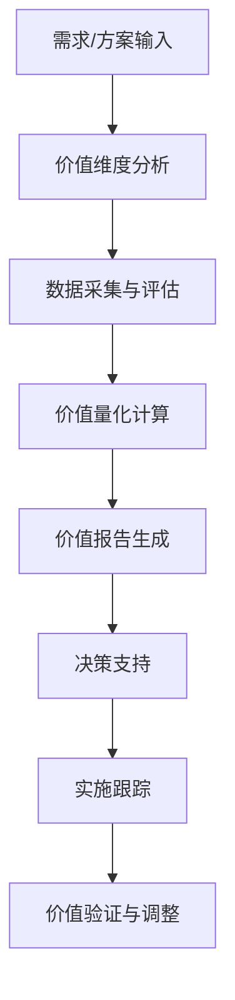

# 业务价值评估框架设计

## 1. 背景与目标

### 1.1 背景
**紧急制动教训揭示的核心问题**：
- 缺乏对业务价值的量化评估机制
- 架构决策基于技术偏好而非业务价值
- 架构演进脱离业务需求
- 投资回报率难以衡量

### 1.2 目标
设计一套科学、可执行、可量化的业务价值评估框架，为架构决策提供数据驱动支持。

## 2. 业务价值评估指标体系

### 2.1 四个核心价值维度

#### 2.1.1 业务收益维度（权重：35%）
**核心指标**：
1. **收入增长贡献度**
   - 直接收入提升（¥）
   - 市场份额扩大（%）
   - 客户转化率提升（%）
   - 客单价提升（%）

2. **成本节约贡献度**
   - 运营成本降低（¥）
   - 人力成本节约（¥）
   - 系统维护成本降低（%）
   - 错误率降低（%）

**量化方法**：
- ROI计算：`(收益 - 成本) / 成本 × 100%`
- 回收期计算：`总投资 / 年化收益`

#### 2.1.2 用户体验维度（权重：25%）
**核心指标**：
1. **效率提升**
   - 操作时间缩短（%）
   - 操作步骤减少（%）
   - 系统响应时间（ms）
   - 任务完成率（%）

2. **用户满意度**
   - NPS净推荐值
   - 用户反馈评分
   - 用户保留率（%）
   - 用户活跃度（%）

#### 2.1.3 技术价值维度（权重：20%）
**核心指标**：
1. **架构质量**
   - 代码复杂度（圈复杂度）
   - 代码覆盖率（%）
   - 技术债务率（%）
   - 架构稳定性（故障率）

2. **可维护性**
   - 平均修复时间（MTTR）
   - 变更成功率（%）
   - 部署频率（次/周）
   - 变更前置时间（天）

#### 2.1.4 战略价值维度（权重：20%）
**核心指标**：
1. **市场竞争力**
   - 差异化优势得分
   - 市场占有率（%）
   - 品牌影响力指数
   - 行业认可度

2. **创新价值**
   - 专利/知识产权数量
   - 技术创新指数
   - 行业领先程度

### 2.2 权重分配矩阵

| 价值维度 | 权重 | 核心指标 | 指标权重 |
|---------|------|---------|---------|
| 业务收益 | 35% | 收入增长贡献度 | 60% |
|          |     | 成本节约贡献度 | 40% |
| 用户体验 | 25% | 效率提升 | 50% |
|          |     | 用户满意度 | 50% |
| 技术价值 | 20% | 架构质量 | 50% |
|          |     | 可维护性 | 50% |
| 战略价值 | 20% | 市场竞争力 | 60% |
|          |     | 创新价值 | 40% |

## 3. 价值量化方法论

### 3.1 量化评分模型

#### 3.1.1 五级评分标准
- **5分（卓越）**：远超预期，创造显著业务价值
- **4分（优秀）**：达到预期，贡献明确业务价值
- **3分（良好）**：基本达到预期，有一定业务价值
- **2分（一般）**：部分达到预期，业务价值有限
- **1分（较差）**：未达到预期，业务价值不明显

#### 3.1.2 价值贡献度计算

**计算公式**：
```
总价值分 = ∑(维度权重 × 维度得分)
维度得分 = ∑(指标权重 × 指标评分)
```

**价值等级划分**：
- **A级（≥4.5分）**：高价值，强烈推荐
- **B级（3.5-4.4分）**：中高价值，建议实施
- **C级（2.5-3.4分）**：中等价值，需要优化
- **D级（<2.5分）**：低价值，不推荐

### 3.2 数据采集方法

#### 3.2.1 定量数据来源
1. **业务系统数据**
   - 销售数据
   - 运营数据
   - 用户行为数据
   - 成本数据

2. **技术系统数据**
   - 监控指标
   - 日志数据
   - 性能数据
   - 代码质量数据

#### 3.2.2 定性数据来源
1. **用户调研**
   - 问卷调查
   - 深度访谈
   - 焦点小组
   - 可用性测试

2. **专家评估**
   - 架构师评估
   - 业务专家评估
   - 技术专家评估

## 4. 价值跟踪与评估机制

### 4.1 价值追踪周期

| 阶段 | 时间节点 | 评估重点 |
|------|---------|---------|
| 预研阶段 | 需求分析阶段 | 价值预期评估 |
| 设计阶段 | 架构设计完成 | 价值可达性评估 |
| 开发阶段 | 每2周一次 | 价值实现进度跟踪 |
| 测试阶段 | 测试完成 | 价值实现度验证 |
| 上线阶段 | 上线后30天 | 实际价值验证 |
| 运营阶段 | 每季度一次 | 价值持续跟踪 |

### 4.2 评估报告模板

#### 4.2.1 价值评估报告
```markdown
# [项目/功能名称] 业务价值评估报告

## 1. 价值概览
- 总价值分：[X.X]/5.0
- 价值等级：[A/B/C/D]
- 主要价值贡献：[描述]

## 2. 分维度价值分析
### 2.1 业务收益维度
- 得分：[X.X]/5.0
- 详细分析：[具体分析]

### 2.2 用户体验维度
- 得分：[X.X]/5.0
- 详细分析：[具体分析]

## 3. 量化数据分析
- ROI预期：[XX%]
- 回收期预期：[X个月]
- 具体量化指标：[具体数据]

## 4. 价值风险分析
- 主要风险：[描述]
- 风险缓解措施：[具体措施]

## 5. 建议
- 实施建议：[建议]
- 优先级建议：[优先级]
```

## 5. 应用场景与工作流程

### 5.1 主要应用场景

#### 5.1.1 架构决策支持
- **场景**：选择技术方案或架构方向
- **方法**：对不同方案进行价值评估对比
- **输出**：基于价值的决策建议

#### 5.1.2 项目优先级排序
- **场景**：多个项目或功能优先级排序
- **方法**：对各项目进行价值评估
- **输出**：按价值分排序的优先级列表

#### 5.1.3 投资回报分析
- **场景**：评估技术投资合理性
- **方法**：计算预期ROI和回收期
- **输出**：投资建议和预期收益

### 5.2 工作流程



## 6. 实施建议

### 6.1 短期实施（1个月内）
1. **建立基础评估机制**
   - 定义核心价值指标
   - 建立评估模板
   - 培训团队成员

2. **试点应用**
   - 选择1-2个重点项目试点
   - 收集反馈并优化

### 6.2 中期实施（1-3个月）
1. **系统化集成**
   - 与项目管理工具集成
   - 建立自动化数据采集
   - 完善评估流程

2. **扩大应用范围**
   - 覆盖所有重点项目
   - 建立定期评估机制

### 6.3 长期实施（3个月以上）
1. **优化完善**
   - 基于数据优化指标权重
   - 建立价值预测模型
   - 深度集成到决策流程

2. **文化建设**
   - 形成价值驱动文化
   - 建立激励机制
   - 持续改进

## 7. 成功衡量标准

### 7.1 过程指标
- 评估覆盖率：评估项目占比（目标：80%）
- 评估及时性：按时完成评估占比（目标：90%）
- 数据准确性：数据完整准确率（目标：95%）

### 7.2 结果指标
- 决策质量提升：错误决策率降低（目标：降低50%）
- 投资回报率提升：平均ROI提升（目标：提升20%）
- 用户满意度提升：NPS提升（目标：提升10分）

## 8. 附录

### 8.1 数据采集模板
[具体模板内容...]

### 8.2 评估工具推荐
[工具推荐...]

### 8.3 参考案例
[参考案例...]