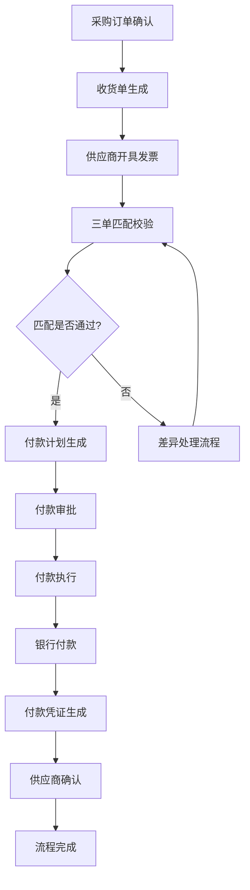
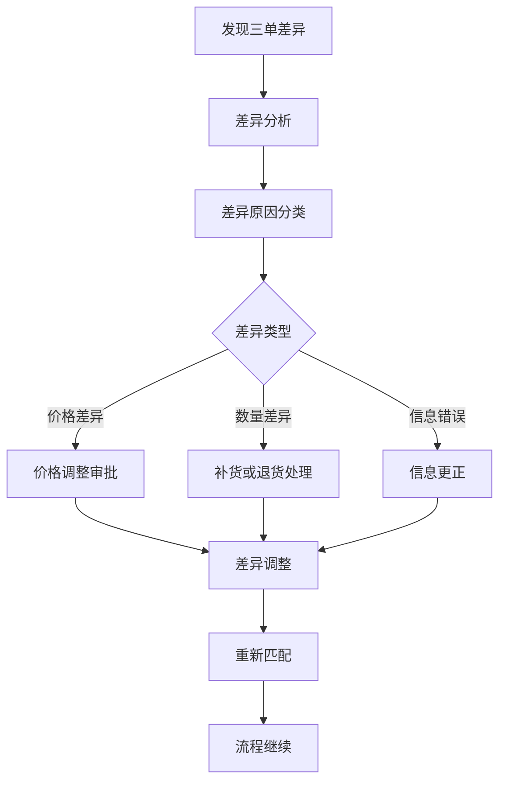
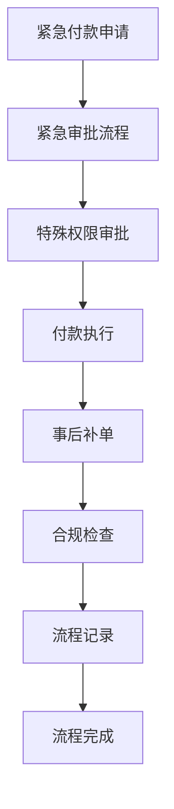

# 【ERP核心功能】采购付款管理模块需求分析与业务流程设计

## 1. 任务概述

### 1.1 项目背景
在ERP系统中，采购付款管理是企业财务管理的核心环节，涉及采购、财务、供应链等多个部门的协同工作。本模块旨在构建标准化、自动化、合规化的采购付款管理体系，解决传统手工操作效率低、风险高的问题。

### 1.2 任务目标
- 为ERP采购付款管理模块进行全面的需求分析
- 设计完整的业务流程
- 确保付款管理的规范性、高效性和合规性

## 2. 业务需求调研

### 2.1 用户需求分析

#### 2.1.1 财务部门需求
- **自动化对账需求**：自动匹配发票、采购订单、收货单
- **付款计划管理**：基于账期和现金流制定付款计划
- **合规审批流程**：符合财务管理制度和内部控制要求
- **税务合规管理**：增值税专用发票认证、抵扣管理
- **资金预测**：准确预测未来资金需求

#### 2.1.2 采购部门需求
- **供应商管理**：供应商资质、信用评级、付款条件管理
- **采购订单跟踪**：订单执行状态、付款进度跟踪
- **供应商对账**：定期与供应商对账，解决差异
- **供应商绩效评估**：基于付款及时性、发票准确性的供应商评估

#### 2.1.3 供应商需求
- **付款进度透明**：实时查看付款申请状态
- **电子发票提交**：在线提交发票，减少纸质流程
- **付款提醒**：自动提醒付款到期
- **问题反馈**：付款异议在线处理

### 2.2 现有流程痛点分析

#### 2.2.1 手工操作痛点
1. **单据匹配效率低**：手工核对发票、订单、收货单，耗时耗力
2. **审批流程繁琐**：纸质审批流转，效率低下
3. **信息孤岛**：采购、财务、仓储数据不互通
4. **重复录入**：相同数据在不同系统中多次录入

#### 2.2.2 风险管理痛点
1. **合规风险**：人工操作容易违反财务制度
2. **资金风险**：缺乏资金预测，现金流管理困难
3. **供应商风险**：缺乏供应商信用管理
4. **税务风险**：发票管理不规范，税务风险高

### 2.3 合规要求分析

#### 2.3.1 财务合规要求
1. **内部控制制度**：付款审批权限分离原则
2. **预算控制**：付款不超过预算额度
3. **账期管理**：严格执行合同约定的付款账期
4. **凭证管理**：完整保存付款凭证和审批记录

#### 2.3.2 税务合规要求
1. **增值税发票认证**：在规定期限内完成认证
2. **发票信息准确**：发票信息与业务真实一致
3. **税收优惠备案**：符合税收优惠政策要求

#### 2.3.3 审计合规要求
1. **审计轨迹**：完整记录所有操作日志
2. **数据不可篡改**：关键数据防篡改机制
3. **报表可追溯**：所有报表数据可追溯至原始单据

### 2.4 行业最佳实践调研

#### 2.4.1 SAP Ariba最佳实践
1. **三单匹配**：采购订单、收货单、发票自动匹配
2. **动态折扣**：基于提前付款的供应商折扣
3. **供应商自助服务**：供应商在线提交发票和查询付款进度

#### 2.4.2 Coupa采购付款管理
1. **AI发票识别**：OCR技术自动识别发票信息
2. **异常检测**：AI算法自动检测发票异常
3. **现金流优化**：基于现金流的付款时间优化

#### 2.4.3 国内ERP最佳实践
1. **电子发票集成**：与税务系统对接，电子发票全流程管理
2. **银企直联**：与银行系统直联，自动支付
3. **移动审批**：移动端审批，提升审批效率

## 3. 功能需求分析

### 3.1 付款计划管理功能

#### 3.1.1 付款计划制定
- **基于采购订单**：自动生成付款计划
- **基于供应商账期**：根据供应商信用账期制定计划
- **现金流约束**：考虑公司现金流状况
- **优先级管理**：重要供应商、紧急采购优先付款

#### 3.1.2 付款计划审批
- **多级审批**：根据金额设置审批层级
- **并行审批**：相关部门并行审批
- **审批时限**：设置审批时限，超时自动提醒
- **移动审批**：支持移动端审批

#### 3.1.3 付款计划执行
- **自动触发付款**：到达付款日期自动触发付款
- **手工调整**：允许手工调整付款计划
- **执行监控**：实时监控付款执行情况
- **异常处理**：付款失败的异常处理流程

### 3.2 发票匹配校验功能

#### 3.2.1 三单匹配规则
- **数量匹配**：发票数量与收货数量一致
- **价格匹配**：发票价格与采购订单价格一致
- **金额匹配**：发票金额在允许的差异范围内
- **税率匹配**：发票税率符合合同约定

#### 3.2.2 匹配异常处理
- **差异识别**：自动识别三单差异
- **差异分析**：分析差异原因（价格变动、数量差异等）
- **差异处理**：差异审批和调整流程
- **差异报表**：生成差异分析报表

#### 3.2.3 电子发票集成
- **OCR识别**：自动识别纸质发票信息
- **电子发票对接**：与税务系统对接，获取电子发票
- **发票验真**：在线验证发票真伪
- **发票存档**：电子发票安全存档

### 3.3 付款执行与对账功能

#### 3.3.1 付款方式管理
- **银行转账**：通过银企直联自动付款
- **支票付款**：支票打印和跟踪
- **承兑汇票**：电子承兑汇票管理
- **供应商预付款**：预付款申请和管理

#### 3.3.2 银企直联集成
- **银行账户管理**：公司银行账户管理
- **付款指令生成**：自动生成付款指令
- **银行反馈处理**：接收银行付款结果反馈
- **付款凭证生成**：自动生成付款会计凭证

#### 3.3.3 自动对账功能
- **供应商对账**：定期与供应商对账
- **差异识别**：自动识别对账差异
- **差异处理**：差异调查和处理流程
- **对账确认**：双方确认对账结果

### 3.4 供应商管理功能

#### 3.4.1 供应商主数据管理
- **供应商信息**：基本信息、联系方式、银行账户
- **资质管理**：营业执照、税务登记证等
- **信用评级**：基于付款表现进行信用评级
- **付款条件**：账期、付款方式、折扣政策

#### 3.4.2 供应商绩效评估
- **付款及时性**：供应商开具发票的及时性
- **发票准确性**：供应商发票信息的准确性
- **服务质量**：供应商问题处理效率
- **合作稳定性**：长期合作稳定性评估

#### 3.4.3 供应商门户
- **信息查询**：供应商查询付款进度
- **发票提交**：在线提交发票
- **问题反馈**：付款问题在线反馈
- **对账单下载**：下载对账单

### 3.5 风险管理与合规功能

#### 3.5.1 风险预警
- **现金流风险**：现金流不足预警
- **供应商风险**：供应商信用风险预警
- **合规风险**：违规操作风险预警
- **操作风险**：操作错误风险预警

#### 3.5.2 合规检查
- **审批权限检查**：检查审批是否符合权限设置
- **预算检查**：检查付款是否超出预算
- **合同检查**：检查付款是否符合合同约定
- **税务检查**：检查发票税务合规性

#### 3.5.3 审计追踪
- **操作日志**：记录所有关键操作
- **审批轨迹**：完整记录审批过程
- **数据变更记录**：记录所有数据变更
- **报表审计**：报表数据可追溯审计

## 4. 业务流程设计

### 4.1 标准付款流程

### 4.2 差异处理流程

### 4.3 紧急付款流程

## 5. 技术架构建议

### 5.1 系统架构
- **微服务架构**：拆分为付款管理、发票管理、供应商管理等多个微服务
- **API网关**：统一API管理和安全控制
- **消息队列**：异步处理付款指令和通知
- **分布式事务**：确保数据一致性

### 5.2 数据架构
- **主数据管理**：供应商、银行账户等主数据统一管理
- **事务数据**：付款、发票等事务数据
- **分析数据**：付款分析、供应商分析等分析数据
- **归档数据**：历史数据归档管理

### 5.3 集成架构
- **ERP系统集成**：与采购、库存、财务模块集成
- **银行系统集成**：银企直联支付集成
- **税务系统集成**：电子发票、税务申报集成
- **移动端集成**：移动审批、查询集成

### 5.4 安全架构
- **身份认证**：多因素身份认证
- **权限控制**：基于角色的细粒度权限控制
- **数据加密**：敏感数据加密存储
- **审计日志**：完整操作审计日志

## 6. 实施建议

### 6.1 实施阶段划分
- **第一阶段**：基础功能实施（付款申请、审批、执行）
- **第二阶段**：高级功能实施（三单匹配、供应商门户）
- **第三阶段**：优化功能实施（AI风险预警、现金流优化）

### 6.2 关键成功因素
1. **高层支持**：获得管理层支持
2. **用户参与**：业务用户全程参与
3. **数据质量**：确保主数据准确性
4. **培训到位**：充分的用户培训
5. **持续优化**：持续改进和优化

### 6.3 风险管理
1. **变更管理**：管理业务流程变更
2. **数据迁移**：确保历史数据准确迁移
3. **系统集成**：确保与现有系统集成
4. **用户接受**：提升用户接受度

## 7. 预期效益

### 7.1 效率提升
- **处理时间减少**：付款处理时间减少70%
- **人工操作减少**：手工操作减少80%
- **错误率降低**：付款错误率降低90%

### 7.2 成本节约
- **人力成本**：财务人员成本节约30%
- **资金成本**：通过优化付款时间节约资金成本
- **错误成本**：减少付款错误带来的损失

### 7.3 风险管理
- **合规风险**：合规风险大幅降低
- **资金风险**：现金流管理更加精准
- **供应商风险**：供应商风险有效控制

### 7.4 供应商关系改善
- **付款及时性**：提高付款及时性
- **信息透明**：提高付款信息透明度
- **合作关系**：改善供应商合作关系

## 8. 下一步工作建议

### 8.1 详细设计阶段
1. **详细功能设计**：每个功能的详细设计
2. **接口设计**：系统接口详细设计
3. **数据库设计**：数据库详细设计
4. **UI/UX设计**：用户界面设计

### 8.2 开发阶段
1. **敏捷开发**：采用敏捷开发方法
2. **持续集成**：建立持续集成环境
3. **单元测试**：编写充分的单元测试
4. **用户测试**：业务用户参与测试

### 8.3 上线阶段
1. **数据迁移**：历史数据迁移
2. **用户培训**：最终用户培训
3. **上线支持**：上线后支持
4. **持续优化**：根据使用反馈持续优化

---

**文档版本**: v1.0  
**创建时间**: 2026-05-01 17:52  
**创建人**: 产品分析师  
**项目**: AI-Ready ERP系统  
**模块**: 采购付款管理模块  
**状态**: 需求分析完成，进入详细设计阶段