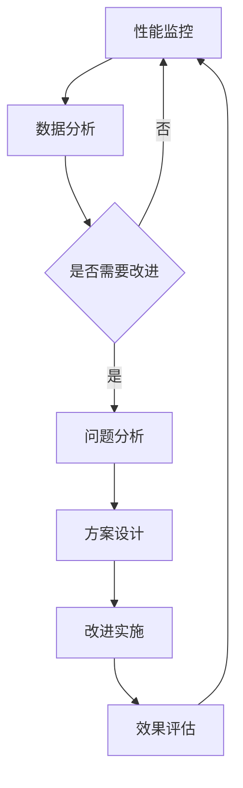

# ERP系统业务流程自动化与RPA方案设计

## 1. 业务流程自动化需求分析

### 1.1 ERP核心业务流程梳理

#### 1.1.1 采购管理流程
```
供应商开发 → 询价比价 → 采购申请 → 采购审批 → 采购订单 → 收货入库 → 对账付款
```

#### 1.1.2 销售管理流程
```
客户开发 → 报价确认 → 销售订单 → 订单审批 → 库存检查 → 发货出库 → 开票收款
```

#### 1.1.3 库存管理流程
```
入库管理 → 库存盘点 → 库存调整 → 出库管理 → 库存预警 → 库存报表
```

#### 1.1.4 财务管理流程
```
凭证录入 → 凭证审核 → 记账过账 → 科目汇总 → 财务报表 → 财务分析
```

#### 1.1.5 人力资源管理流程
```
招聘录用 → 入职办理 → 考勤管理 → 薪资计算 → 绩效考核 → 离职办理
```

### 1.2 自动化潜力评估

#### 1.2.1 自动化潜力评估维度
| 评估维度 | 说明 | 权重 |
|---------|------|------|
| **规则复杂度** | 流程决策规则复杂程度 | 20% |
| **数据交互** | 跨系统数据交互复杂度 | 25% |
| **操作频率** | 日常操作执行频率 | 30% |
| **人工耗时** | 人工执行所需时间 | 25% |

#### 1.2.2 自动化收益评估
| 收益类型 | 量化指标 | 评估方法 |
|---------|---------|---------|
| **效率提升** | 工时减少百分比 | 自动化前/后工时对比 |
| **成本节约** | 人力成本节约 | 人工成本 × 效率提升率 |
| **错误减少** | 错误率降低 | 自动化前/后错误率对比 |
| **质量提升** | 质量标准达标率 | 质量标准完成度提升 |

### 1.3 自动化优先级排序

#### 1.3.1 优先级评估矩阵
```yaml
优先级评估:
  高优先级标准:
    - 操作频率: ≥5次/天
    - 人工耗时: ≥30分钟/次
    - 规则复杂度: 低-中等
    - 数据来源: 结构化数据
  
  中优先级标准:
    - 操作频率: 1-4次/天
    - 人工耗时: 10-29分钟/次
    - 规则复杂度: 中等
    - 数据来源: 部分非结构化
    
  低优先级标准:
    - 操作频率: <1次/天
    - 人工耗时: <10分钟/次
    - 规则复杂度: 高
    - 数据来源: 非结构化为主
```

#### 1.3.2 优先自动化流程清单
| 序号 | 流程名称 | 所属模块 | 自动化潜力 | 优先级 | 预计收益 |
|------|---------|---------|-----------|--------|---------|
| 1 | 采购订单创建 | 采购管理 | 85% | 高 | 效率提升70%，错误减少80% |
| 2 | 销售订单处理 | 销售管理 | 80% | 高 | 效率提升65%，错误减少75% |
| 3 | 财务凭证录入 | 财务管理 | 75% | 高 | 效率提升60%，错误减少85% |
| 4 | 库存盘点报告 | 库存管理 | 70% | 中 | 效率提升50%，错误减少60% |
| 5 | 员工考勤统计 | 人力资源管理 | 65% | 中 | 效率提升45%，错误减少50% |

## 2. RPA解决方案设计

### 2.1 RPA技术架构

#### 2.1.1 整体架构设计
```
┌─────────────────────────────────────────────────┐
│              业务流程层                         │
│  ├─采购流程  ├─销售流程  ├─财务流程  ├─库存流程│
└─────────────────────────────────────────────────┘
┌─────────────────────────────────────────────────┐
│              RPA应用层                          │
│  ├─流程编排  ├─规则引擎  ├─异常处理  ├─日志管理 │
└─────────────────────────────────────────────────┘
┌─────────────────────────────────────────────────┐
│              RPA执行层                          │
│  ├─界面自动化  ├─API集成  ├─数据处理  ├─文件操作│
└─────────────────────────────────────────────────┘
┌─────────────────────────────────────────────────┐
│              系统集成层                         │
│  ├─ERP系统  ├─财务系统  ├─HR系统  ├─其他系统   │
└─────────────────────────────────────────────────┘
```

#### 2.1.2 RPA组件设计
- **流程设计器**：可视化流程编排工具
- **规则引擎**：业务规则管理和执行
- **调度中心**：任务调度和监控
- **管理中心**：机器人管理和配置

### 2.2 核心自动化场景设计

#### 2.2.1 采购订单自动创建
```yaml
场景: 采购订单自动创建
触发条件:
  - 采购申请审批通过
  - 库存低于安全库存
  - 定期采购计划时间

执行步骤:
  1. 从ERP系统获取采购申请数据
  2. 自动选择供应商（基于历史合作数据）
  3. 生成采购订单草稿
  4. 自动计算最优价格（基于历史价格）
  5. 自动填写订单明细
  6. 提交采购订单审批
  7. 发送通知给采购负责人

异常处理:
  - 供应商选择失败: 发送人工处理请求
  - 价格计算异常: 使用默认价格策略
  - 系统连接失败: 重试3次后告警
```

#### 2.2.2 销售订单自动处理
```yaml
场景: 销售订单自动处理
触发条件:
  - 客户在线下单
  - 销售确认订单
  - 库存可用性检查通过

执行步骤:
  1. 接收销售订单数据
  2. 自动检查客户信用额度
  3. 自动检查库存可用性
  4. 生成销售订单确认单
  5. 自动分配发货仓库
  6. 更新库存预留
  7. 生成发货计划

异常处理:
  - 信用额度不足: 发送风险告警
  - 库存不足: 启动采购建议流程
  - 订单信息不完整: 自动补充默认信息
```

#### 2.2.3 财务凭证自动录入
```yaml
场景: 财务凭证自动录入
触发条件:
  - 采购收货完成
  - 销售发货完成
  - 费用报销完成
  - 定期计提时间

执行步骤:
  1. 获取业务数据（采购单、销售单、费用单）
  2. 自动匹配会计科目
  3. 自动计算金额（含税）
  4. 生成财务凭证草稿
  5. 自动核对凭证平衡
  6. 提交凭证审核
  7. 更新财务系统数据

异常处理:
  - 科目匹配失败: 发送人工匹配请求
  - 金额计算错误: 发送数据验证告警
  - 凭证不平衡: 自动调整借贷金额
```

## 3. 自动化实施路线图

### 3.1 实施阶段规划

#### 3.1.1 第一阶段：试点实施期（1-3个月）
- **目标**：验证RPA技术可行性，建立基础能力
- **范围**：1-2个高优先级业务流程
- **重点工作**：
  1. RPA平台选型和部署
  2. 开发框架和规范建立
  3. 技术团队能力建设
  4. 试点流程自动化开发
  5. 试点流程测试和上线

#### 3.1.2 第二阶段：规模扩展期（4-9个月）
- **目标**：扩大自动化范围，建立自动化管理体系
- **范围**：5-8个业务流程
- **重点工作**：
  1. 自动化流程标准化
  2. 自动化运营管理体系建立
  3. 自动化效益评估体系
  4. 自动化人才培养
  5. 跨部门协同机制建立

#### 3.1.3 第三阶段：全面深化期（10-12个月）
- **目标**：形成企业级自动化能力，实现智能自动化
- **范围**：全业务流程覆盖
- **重点工作**：
  1. 智能决策能力建设
  2. 自动化与AI集成
  3. 自动化治理体系完善
  4. 自动化创新文化建设
  5. 持续改进机制建立

### 3.2 实施关键成功因素

#### 3.2.1 组织保障
- **高层支持**：获得管理层重视和资源保障
- **专职团队**：组建专业的RPA开发和运营团队
- **业务参与**：业务部门深度参与流程优化

#### 3.2.2 技术保障
- **平台选型**：选择成熟稳定的RPA平台
- **架构设计**：设计可扩展的自动化架构
- **标准规范**：建立开发和运维标准规范

#### 3.2.3 管理保障
- **项目管理**：采用敏捷项目管理方法
- **风险管理**：建立完整的风险管理机制
- **效益管理**：建立效益评估和改进机制

## 4. 技术实现方案

### 4.1 RPA平台选型标准

#### 4.1.1 平台功能要求
| 功能类别 | 具体要求 | 重要性 |
|---------|---------|--------|
| **开发功能** | 可视化开发、脚本开发、AI集成 | 高 |
| **运行功能** | 任务调度、并发执行、负载均衡 | 高 |
| **管理功能** | 机器人管理、监控告警、日志审计 | 高 |
| **安全功能** | 身份认证、权限控制、数据加密 | 高 |

#### 4.1.2 技术架构要求
| 架构要素 | 具体要求 | 重要性 |
|---------|---------|--------|
| **部署方式** | 支持本地部署和云端部署 | 高 |
| **集成能力** | 支持REST API、数据库、文件集成 | 高 |
| **扩展能力** | 支持自定义插件和功能扩展 | 中 |
| **兼容性** | 支持主流操作系统和浏览器 | 高 |

### 4.2 开发规范设计

#### 4.2.1 命名规范
```yaml
命名规范:
  流程命名:
    - 格式: [模块]_[业务]_[动作]
    - 示例: PURCHASE_ORDER_CREATE
  
  变量命名:
    - 格式: [前缀]_[描述]
    - 示例: var_order_no, list_order_items
  
  函数命名:
    - 格式: [动作]_[对象]_[结果]
    - 示例: get_order_details, validate_order_status
```

#### 4.2.2 开发标准
- **代码结构**：模块化设计，高内聚低耦合
- **错误处理**：完善的异常处理机制
- **日志记录**：详细的操作日志和错误日志
- **配置管理**：外部化配置，易于修改

### 4.3 部署和运维方案

#### 4.3.1 部署架构
```
生产环境:
  ├─ RPA调度服务器（主备）
  ├─ RPA执行服务器集群
  ├─ 数据库服务器（主备）
  ├─ 文件存储服务器
  
测试环境:
  ├─ RPA测试服务器
  ├─ 测试数据库服务器
  
开发环境:
  ├─ RPA开发工作站
  ├─ 版本控制系统
```

#### 4.3.2 运维管理
- **监控告警**：实时监控机器人状态和执行情况
- **性能优化**：定期性能分析和优化
- **备份恢复**：定期备份配置和数据
- **版本管理**：流程版本管理和回滚机制

## 5. 效益评估和持续改进

### 5.1 效益评估指标体系

#### 5.1.1 效率效益指标
| 指标名称 | 计算公式 | 目标值 |
|---------|---------|--------|
| 自动化覆盖率 | 已自动化流程数/总流程数 | ≥60% |
| 效率提升率 | (人工耗时-自动化耗时)/人工耗时 | ≥50% |
| 产能提升率 | 自动化产出/人工产出 | ≥200% |

#### 5.1.2 质量效益指标
| 指标名称 | 计算公式 | 目标值 |
|---------|---------|--------|
| 错误减少率 | (人工错误率-自动错误率)/人工错误率 | ≥80% |
| 处理准确率 | 正确处理次数/总处理次数 | ≥99% |
| 服务可用率 | 可用时间/总时间 | ≥99.5% |

#### 5.1.3 成本效益指标
| 指标名称 | 计算公式 | 目标值 |
|---------|---------|--------|
| 人力成本节约 | 节省人工工时 × 人工成本 | ≥100万/年 |
| 运营成本比 | 自动化运营成本/人力成本 | ≤30% |
| 投资回报率 | 年收益/总投资 | ≥200% |

### 5.2 持续改进机制

#### 5.2.1 改进流程


#### 5.2.2 改进方向
- **流程优化**：优化自动化流程，提高效率
- **技术升级**：引入新技术，提升自动化能力
- **范围扩展**：扩展自动化覆盖范围
- **智能增强**：增加智能决策能力

## 6. 风险和应对措施

### 6.1 实施风险识别

#### 6.1.1 技术风险
- **系统集成风险**：ERP系统接口变化或不稳定
- **技术选型风险**：RPA平台功能不足或性能问题
- **开发质量风险**：自动化流程质量不达标

#### 6.1.2 管理风险
- **组织变革风险**：员工抵触或不适应自动化
- **项目管理风险**：项目延期或超预算
- **运维管理风险**：自动化系统运维困难

#### 6.1.3 业务风险
- **流程变更风险**：业务流程频繁变更
- **数据安全风险**：自动化过程中的数据泄露
- **合规风险**：自动化操作不符合合规要求

### 6.2 风险应对策略

#### 6.2.1 技术风险应对
- **系统集成**：采用松耦合设计，降低接口依赖
- **技术选型**：充分评估和POC验证
- **质量管理**：建立完整的测试和质量控制体系

#### 6.2.2 管理风险应对
- **组织变革**：加强沟通和培训，争取员工支持
- **项目管理**：采用敏捷方法，分阶段实施
- **运维管理**：建立专业的运维团队和流程

#### 6.2.3 业务风险应对
- **流程变更**：建立流程变更管理机制
- **数据安全**：实施完整的数据安全和隐私保护措施
- **合规管理**：建立自动化合规检查和审计机制

## 7. 总结

ERP系统业务流程自动化和RPA方案为企业提供了显著的效率提升和成本节约机会。通过本方案设计，企业可以：

1. **识别自动化机会**：系统评估各业务流程的自动化潜力
2. **设计可行方案**：提供具体的技术架构和实施方案
3. **分阶段实施**：采用试点-扩展-深化的实施策略
4. **获得持续效益**：建立效益评估和持续改进机制

本方案的核心价值在于：
- **业务导向**：以业务价值为出发点的自动化设计
- **技术可行**：基于成熟技术的实施方案
- **管理可控**：完整的风险管理和持续改进机制
- **效益可测**：量化的效益评估和改进指标

通过实施本方案，企业可以实现ERP系统业务流程的智能化、自动化运营，为数字化转型奠定坚实基础。