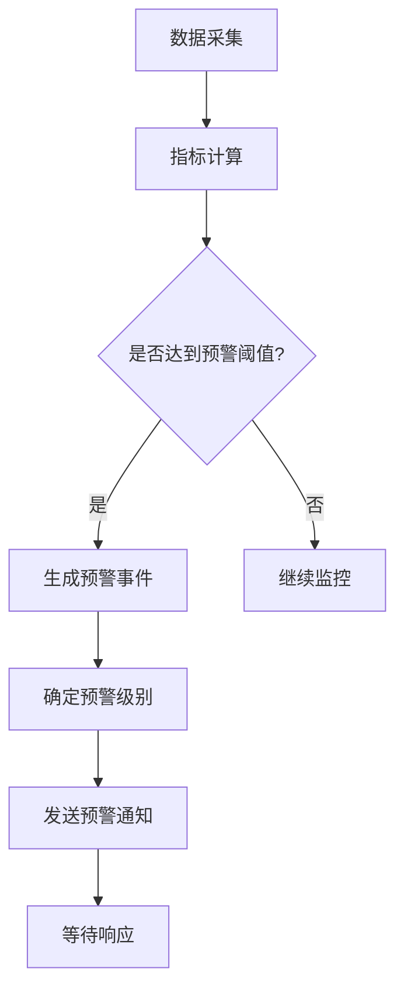
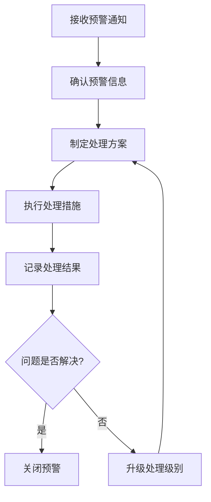

# 批次管理智能预警系统需求分析

## 1. 业务场景分析

### 1.1 库存不足预警
- **场景描述**：批次库存量低于安全阈值，可能影响生产或销售
- **触发条件**：
  - 当前库存量 < 安全库存量
  - 预计未来需求 > 可用库存
  - 库存周转率异常
- **预警级别**：
  - 一级预警：库存 < 安全库存的50%
  - 二级预警：库存 < 安全库存的30%
  - 三级预警：库存 < 安全库存的10%

### 1.2 效期临近预警
- **场景描述**：批次物料临近失效日期，需要优先使用或处理
- **触发条件**：
  - 剩余有效期 < 设定的预警天数
  - 临期物料库存占比过高
  - 批次间效期差异过大
- **预警级别**：
  - 提醒：剩余30天
  - 警告：剩余15天
  - 紧急：剩余7天

### 1.3 质量异常预警
- **场景描述**：批次质量指标异常或接近质量阈值
- **触发条件**：
  - 质检合格率 < 标准要求
  - 质量波动超出控制范围
  - 多次退货/投诉记录
- **预警级别**：
  - 关注：质量指标下降趋势
  - 警告：接近质量下限
  - 严重：超出质量标准

### 1.4 操作异常预警
- **场景描述**：批次流转过程中的操作异常或违规
- **触发条件**：
  - 存储条件异常（温湿度超标）
  - 流转时间异常（停留时间过长）
  - 操作记录缺失或异常
  - 权限违规操作
- **预警级别**：
  - 提醒：轻微异常
  - 警告：中度异常
  - 紧急：严重违规

## 2. 预警指标定义

### 2.1 库存相关指标
| 指标名称 | 计算方式 | 预警阈值 | 数据来源 |
|---------|---------|---------|---------|
| 安全库存率 | 当前库存 / 安全库存 | < 1.0 | 库存表 |
| 库存周转天数 | 平均库存 / 日均消耗 | > 设定的最大值 | 出入库记录 |
| 缺货风险指数 | 缺货概率 × 影响程度 | > 0.7 | 需求预测模型 |

### 2.2 效期相关指标
| 指标名称 | 计算方式 | 预警阈值 | 数据来源 |
|---------|---------|---------|---------|
| 剩余效期天数 | 失效日期 - 当前日期 | < 设定的预警天数 | 批次表 |
| 临期物料占比 | 临期批次数量 / 总批次数量 | > 设定的百分比 | 批次表 |
| 效期分布集中度 | 各效期间隔的方差 | > 设定的方差阈值 | 批次表 |

### 2.3 质量相关指标
| 指标名称 | 计算方式 | 预警阈值 | 数据来源 |
|---------|---------|---------|---------|
| 质检合格率 | 合格数量 / 检验数量 | < 设定的合格率标准 | 质检记录 |
| 质量波动系数 | 质量指标的变异系数 | > 设定的波动阈值 | 质检记录 |
| 客户投诉率 | 投诉批次 / 发货批次 | > 设定的投诉率阈值 | 客户反馈 |

### 2.4 操作相关指标
| 指标名称 | 计算方式 | 预警阈值 | 数据来源 |
|---------|---------|---------|---------|
| 存储环境合格率 | 合格检测次数 / 总检测次数 | < 设定的合格率 | 环境监测 |
| 流转超时率 | 超时批次 / 总流转批次 | > 设定的超时率 | 流转记录 |
| 操作合规率 | 合规操作 / 总操作次数 | < 设定的合规率 | 操作日志 |

## 3. 数据源分析

### 3.1 主要数据源
1. **批次主数据表**
   - 批次基本信息（批次号、物料编码、数量、效期等）
   - 库存状态（库位、状态、存储条件）
   - 批次属性（供应商、生产日期、质检结果）

2. **流转记录表**
   - 入库记录
   - 出库记录
   - 库内移动记录
   - 状态变更记录

3. **质检记录表**
   - 质检项目结果
   - 合格/不合格判定
   - 异常处理记录

4. **环境监测表**
   - 仓库温湿度记录
   - 存储条件监控
   - 设备运行状态

5. **操作日志表**
   - 用户操作记录
   - 系统操作日志
   - 异常操作告警

### 3.2 数据处理要求
- **实时性要求**：部分预警需要实时或近实时处理
- **数据质量**：需要数据清洗、异常值处理
- **数据聚合**：按时间窗口、业务维度进行聚合
- **特征工程**：构建预警模型所需的特征变量

### 3.3 数据更新频率
| 数据源 | 更新频率 | 数据量级 |
|-------|---------|---------|
| 批次状态 | 实时 | 中 |
| 流转记录 | 实时 | 高 |
| 质检结果 | 批次完成时 | 低 |
| 环境监测 | 每分钟 | 高 |
| 操作日志 | 实时 | 高 |

## 4. 响应机制分析

### 4.1 预警级别定义

#### 一级预警（紧急）
- **特征**：严重影响生产或安全，需要立即处理
- **响应时间**：15分钟内
- **处理人员**：主管+相关操作人员
- **通知方式**：系统内弹窗+短信+IM群@

#### 二级预警（重要）
- **特征**：可能影响业务，需要重点关注
- **响应时间**：1小时内
- **处理人员**：相关操作人员
- **通知方式**：系统内提醒+邮件+IM消息

#### 三级预警（关注）
- **特征**：需要关注但无需立即处理
- **响应时间**：4小时内
- **处理人员**：操作人员
- **通知方式**：系统内消息+邮件

### 4.2 响应流程设计

#### 预警触发流程

#### 预警处理流程

### 4.3 处理措施建议

#### 库存不足预警处理
1. **紧急补货**：联系供应商紧急采购
2. **调拨优化**：从其他仓库调拨物料
3. **生产调整**：调整生产计划或顺序
4. **替代方案**：寻找可替代的物料批次

#### 效期临近预警处理
1. **优先使用**：安排优先使用临期批次
2. **打折销售**：与销售部门协商促销
3. **退供应商**：与供应商协商退货
4. **报废处理**：按规定程序报废处理

#### 质量异常预警处理
1. **重新检验**：安排重新检验确认
2. **隔离批次**：隔离问题批次防止误用
3. **调查原因**：分析质量问题原因
4. **纠正措施**：制定并实施纠正措施

#### 操作异常预警处理
1. **立即停止**：停止相关操作
2. **检查设备**：检查相关设备状态
3. **纠正操作**：指导操作人员正确操作
4. **完善流程**：完善操作流程和规范

## 5. 系统架构要求

### 5.1 功能性需求
1. **预警规则管理**：支持预警规则的定义、修改、启用/停用
2. **实时监控**：支持对批次数据的实时监控和计算
3. **智能分析**：集成机器学习模型进行趋势预测和异常检测
4. **通知管理**：支持多渠道预警通知和通知模板管理
5. **响应管理**：支持预警响应的跟踪、记录和关闭
6. **报表分析**：提供预警统计、效果评估等报表

### 5.2 非功能性需求
1. **性能要求**：
   - 预警计算延迟 < 1秒
   - 99.9%的预警通知在5秒内发出
   - 支持每秒1000条数据的处理能力
2. **可用性要求**：
   - 系统可用性 > 99.5%
   - 支持7×24小时不间断运行
   - 支持故障自动切换
3. **安全性要求**：
   - 数据访问权限控制
   - 预警信息保密性
   - 操作审计追踪

## 6. 实施建议

### 6.1 实施阶段
1. **第一阶段**：基础预警规则实现（2周）
   - 实现基本的预警规则引擎
   - 实现核心预警场景
   - 实现系统内通知

2. **第二阶段**：智能预警模型集成（3周）
   - 集成机器学习模型
   - 实现智能趋势预测
   - 实现异常检测算法

3. **第三阶段**：全渠道通知和响应管理（2周）
   - 实现多渠道通知
   - 实现预警响应流程
   - 实现报表分析功能

4. **第四阶段**：系统优化和扩展（2周）
   - 性能优化
   - 功能扩展
   - 用户体验优化

### 6.2 风险评估
1. **技术风险**：
   - 实时数据处理性能不足
   - 机器学习模型准确率不达标
   - 系统集成复杂度高

2. **业务风险**：
   - 预警规则定义不合理
   - 误报率过高影响正常运营
   - 预警响应机制执行不到位

3. **缓解措施**：
   - 分阶段实施，逐步验证
   - 建立预警效果评估机制
   - 提供灵活的规则调整能力

---
**文档状态**：需求分析完成
**版本**：1.0
**创建日期**：2026-05-04
**创建人**：team-member