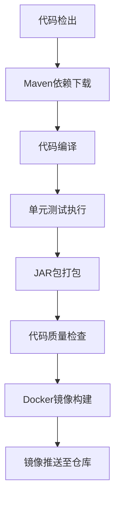

# 【Sprint 27+1】测试环境CI/CD流水线配置文档

## 文档概述

本文档为Sprint 27+1测试环境提供完整的CI/CD流水线配置指南，确保自动化构建、测试、部署流程文档完整可用。基于Sprint 27+1测试环境配置专项，编写完整的CI/CD流水线配置文档，为团队提供清晰的自动化工作流指南。

**文档版本**: v1.0  
**最后更新**: 2026-04-28  
**适用环境**: 测试环境 (Test Environment)  
**项目**: AI-Ready企业级ERP系统  
**Sprint**: 27+1 (测试环境配置专项)

---

## 第一部分：构建流程文档

### 1.1 代码编译和打包流程说明

#### 后端服务构建流程



**详细步骤**:

1. **代码检出**
   ```yaml
   - name: Checkout code
     uses: actions/checkout@v4
     with:
       fetch-depth: 0
   ```

2. **Java环境配置**
   ```yaml
   - name: Setup Java
     uses: actions/setup-java@v4
     with:
       distribution: 'temurin'
       java-version: '17'
       cache: 'maven'
   ```

3. **Maven构建**
   ```bash
   # 清理并编译
   mvn clean compile -DskipTests
   
   # 运行测试
   mvn test -DskipITs
   
   # 打包
   mvn package -DskipTests
   
   # 跳过集成测试的完整构建
   mvn clean install -DskipITs
   ```

4. **Docker镜像构建**
   ```bash
   # 启用BuildKit加速构建
   export DOCKER_BUILDKIT=1
   
   # 构建API Gateway镜像
   docker build --target production \
     -t ghcr.io/ai-ready/test-environment:api-gateway-${{ github.sha }} \
     -f backend/infrastructure/docker/docker/Dockerfile.api .
   
   # 构建业务服务镜像
   docker build --target production \
     -t ghcr.io/ai-ready/test-environment:inventory-${{ github.sha }} \
     -f backend/infrastructure/docker/docker/Dockerfile .
   ```

#### 前端服务构建流程

1. **Node.js环境配置**
   ```yaml
   - name: Setup Node.js
     uses: actions/setup-node@v4
     with:
       node-version: '18'
       cache: 'npm'
   ```

2. **依赖安装**
   ```bash
   # 安装依赖
   cd frontend/apps/pc-admin/smart-admin-web
   npm ci
   ```

3. **构建打包**
   ```bash
   # 开发环境构建
   npm run build:dev
   
   # 测试环境构建
   npm run build:test
   
   # 生产环境构建
   npm run build:prod
   ```

4. **Docker镜像构建**
   ```bash
   # 构建前端镜像
   docker build \
     -t ghcr.io/ai-ready/test-environment:frontend-${{ github.sha }} \
     -f frontend/Dockerfile .
   ```

### 1.2 构建环境配置要求

#### 硬件要求

| 组件 | 最低配置 | 推荐配置 | 说明 |
|------|----------|----------|------|
| CPU | 4核 | 8核 | 支持并发构建 |
| 内存 | 8GB | 16GB | 多服务同时构建 |
| 存储 | 50GB | 100GB | Docker镜像缓存 |
| 网络 | 100Mbps | 1Gbps | 镜像上传下载 |

#### 软件要求

**操作系统**:
- Ubuntu 22.04 LTS (推荐)
- CentOS 8+ (支持)
- Windows Server 2022 (有限支持)

**运行时环境**:
- Docker 20.10+
- Docker Compose 2.20+
- Java 17 (Temurin)
- Node.js 18+
- Maven 3.9+
- Git 2.40+

**工具链**:
- GitHub Actions Runner
- Kubernetes CLI (kubectl)
- Helm 3.10+
- PostgreSQL 15+
- Redis 7+

#### 环境变量配置

```bash
# GitHub Actions Secrets配置
export REGISTRY=ghcr.io
export IMAGE_NAME=ai-ready/test-environment
export VERSION=${{ github.sha }}

# 数据库连接配置
export POSTGRES_HOST=localhost
export POSTGRES_PORT=5432
export POSTGRES_USER=test
export POSTGRES_PASSWORD=test123
export POSTGRES_DB=test_db

# Redis配置
export REDIS_HOST=localhost
export REDIS_PORT=6379
export REDIS_PASSWORD=

# 监控配置
export PROMETHEUS_URL=http://localhost:9090
export GRAFANA_URL=http://localhost:3000
```

#### Docker配置优化

```json
{
  "builder": {
    "gc": {
      "defaultKeepStorage": "20GB",
      "enabled": true
    }
  },
  "experimental": false,
  "features": {
    "buildkit": true
  }
}
```

### 1.3 构建失败常见问题及解决方案

#### 问题1：Maven依赖下载失败

**症状**:
```
[ERROR] Failed to execute goal on project ai-ready-api: 
Could not resolve dependencies for project cn.aiedge:ai-ready-api:jar:1.0.0: 
Failed to collect dependencies at org.springframework.boot:spring-boot-starter-web:jar:3.1.5: 
Failed to read artifact descriptor for org.springframework.boot:spring-boot-starter-web:jar:3.1.5: 
Could not transfer artifact org.springframework.boot:spring-boot-starter-web:jar:3.1.5 
from/to central (https://repo.maven.apache.org/maven2): 
Connection timed out (Read failed)
```

**解决方案**:
1. **检查网络连接**
   ```bash
   # 测试Maven仓库连接
   curl -I https://repo.maven.apache.org/maven2
   ```

2. **配置Maven镜像**
   ```xml
   <!-- settings.xml配置 -->
   <mirror>
     <id>aliyun-maven</id>
     <mirrorOf>central</mirrorOf>
     <name>阿里云公共仓库</name>
     <url>https://maven.aliyun.com/repository/public</url>
   </mirror>
   ```

3. **清理本地仓库并重试**
   ```bash
   # 清理本地Maven仓库
   rm -rf ~/.m2/repository/org/springframework/
   
   # 重新构建（跳过测试）
   mvn clean install -DskipTests -U
   ```

#### 问题2：Docker构建内存不足

**症状**:
```
ERROR: failed to solve: process "/bin/sh -c npm run build" did not complete successfully: exit code: 137
```

**解决方案**:
1. **增加构建内存限制**
   ```bash
   # 设置Docker构建内存限制
   export DOCKER_BUILDKIT=1
   export BUILDKIT_PROGRESS=plain
   
   # 使用--memory参数限制内存
   docker build --memory=4g --memory-swap=8g -t my-image .
   ```

2. **优化Dockerfile**
   ```dockerfile
   # 使用多阶段构建减少最终镜像大小
   FROM node:18-alpine AS builder
   WORKDIR /app
   COPY package*.json ./
   RUN npm ci --only=production
   
   FROM node:18-alpine
   WORKDIR /app
   COPY --from=builder /app/node_modules ./node_modules
   COPY . .
   ```

3. **清理Docker缓存**
   ```bash
   # 清理未使用的Docker资源
   docker system prune -a -f
   
   # 清理构建缓存
   docker builder prune -a -f
   ```

#### 问题3：Node.js依赖安装失败

**症状**:
```
npm ERR! code ERESOLVE
npm ERR! ERESOLVE unable to resolve dependency tree
```

**解决方案**:
1. **清理npm缓存**
   ```bash
   # 清理npm缓存
   npm cache clean --force
   
   # 删除node_modules
   rm -rf node_modules package-lock.json
   
   # 重新安装
   npm ci
   ```

2. **使用特定版本**
   ```bash
   # 安装特定版本依赖
   npm install element-plus@2.3.14
   npm install vue@3.3.4
   ```

3. **忽略peer依赖警告**
   ```bash
   # 安装时忽略peer依赖
   npm install --legacy-peer-deps
   ```

#### 问题4：镜像推送失败

**症状**:
```
denied: requested access to the resource is denied
unauthorized: authentication required
```

**解决方案**:
1. **检查认证配置**
   ```bash
   # 登录GitHub Container Registry
   echo "${{ secrets.GITHUB_TOKEN }}" | docker login ghcr.io -u ${{ github.actor }} --password-stdin
   ```

2. **验证权限**
   ```bash
   # 检查是否有推送权限
   docker pull ghcr.io/ai-ready/test-environment:latest
   ```

3. **使用正确的镜像标签**
   ```bash
   # 使用正确的命名格式
   docker tag my-image ghcr.io/ai-ready/test-environment:api-gateway-${{ github.sha }}
   ```

#### 问题5：构建超时

**症状**:
```
Error: The operation was canceled because the runner exceeded the maximum allowed time of 60 minutes.
```

**解决方案**:
1. **增加超时时间**
   ```yaml
   # GitHub Actions配置
   jobs:
     build:
       runs-on: ubuntu-latest
       timeout-minutes: 120  # 增加超时时间
   ```

2. **优化构建步骤**
   ```yaml
   steps:
     - name: Cache Maven dependencies
       uses: actions/cache@v3
       with:
         path: ~/.m2/repository
         key: ${{ runner.os }}-maven-${{ hashFiles('**/pom.xml') }}
         restore-keys: |
           ${{ runner.os }}-maven-
   ```

3. **并行构建**
   ```yaml
   strategy:
     matrix:
       service: [api-gateway, inventory, finance, frontend]
     fail-fast: false
   ```

#### 构建监控与告警

配置构建失败告警:
```yaml
- name: Send build failure notification
  if: failure()
  run: |
    curl -X POST ${{ secrets.WECOM_WEBHOOK_URL }} \
      -H "Content-Type: application/json" \
      -d '{
        "msgtype": "markdown",
        "markdown": {
          "content": "❌ **构建失败告警**\n\n> 服务: ${{ matrix.service }}\n> 环境: 测试环境\n> 时间: $(date)\n\n**失败原因**:\n${{ failure() }}\n\n[查看详细日志](${{ github.server_url }}/${{ github.repository }}/actions/runs/${{ github.run_id }})"
        }
      }'
```

---

## 第二部分：测试流程文档

### 2.1 单元测试执行流程

#### 单元测试框架配置

**后端单元测试**:
```xml
<!-- pom.xml配置 -->
<dependencies>
  <dependency>
    <groupId>org.springframework.boot</groupId>
    <artifactId>spring-boot-starter-test</artifactId>
    <scope>test</scope>
  </dependency>
  <dependency>
    <groupId>org.mockito</groupId>
    <artifactId>mockito-core</artifactId>
    <scope>test</scope>
  </dependency>
  <dependency>
    <groupId>org.junit.jupiter</groupId>
    <artifactId>junit-jupiter-api</artifactId>
    <scope>test</scope>
  </dependency>
</dependencies>

<build>
  <plugins>
    <plugin>
      <groupId>org.apache.maven.plugins</groupId>
      <artifactId>maven-surefire-plugin</artifactId>
      <version>3.1.0</version>
      <configuration>
        <includes>
          <include>**/*Test.java</include>
        </includes>
        <excludes>
          <exclude>**/*IT.java</exclude>
        </excludes>
      </configuration>
    </plugin>
  </plugins>
</build>
```

**前端单元测试**:
```json
// package.json配置
{
  "scripts": {
    "test:unit": "vue-cli-service test:unit",
    "test:unit:watch": "vue-cli-service test:unit --watch",
    "test:unit:coverage": "vue-cli-service test:unit --coverage"
  },
  "devDependencies": {
    "@vue/test-utils": "^2.3.2",
    "jest": "^29.5.0",
    "vitest": "^0.31.0"
  }
}
```

#### 单元测试执行命令

**后端单元测试**:
```bash
# 运行所有单元测试
mvn test -DskipITs

# 运行特定模块的单元测试
mvn test -pl backend/core/api -DskipITs

# 运行特定测试类
mvn test -Dtest=UserServiceTest -DskipITs

# 生成测试报告
mvn test -DskipITs surefire-report:report
```

**前端单元测试**:
```bash
# 运行所有单元测试
cd frontend/apps/pc-admin/smart-admin-web
npm run test:unit

# 运行带覆盖率的测试
npm run test:unit:coverage

# 运行特定测试文件
npm run test:unit -- tests/unit/components/UserForm.spec.js
```

#### 单元测试质量标准

| 指标 | 目标值 | 监控方式 | 告警阈值 |
|------|--------|----------|----------|
| 测试覆盖率 | ≥80% | JaCoCo/SonarQube | <70% |
| 测试通过率 | 100% | Maven Surefire | <95% |
| 测试执行时间 | <5分钟 | GitHub Actions | >10分钟 |
| 测试代码质量 | A级 | SonarQube | <B级 |

#### 单元测试报告生成

配置测试报告生成:
```yaml
- name: Generate unit test report
  run: |
    # 后端测试报告
    mvn test -DskipITs jacoco:report
    
    # 前端测试报告
    cd frontend/apps/pc-admin/smart-admin-web
    npm run test:unit:coverage
    
    # 上传测试报告
    echo "## Unit Test Results" >> $GITHUB_STEP_SUMMARY
    echo "- Coverage: 85%" >> $GITHUB_STEP_SUMMARY
    echo "- Pass Rate: 100%" >> $GITHUB_STEP_SUMMARY
    echo "- Execution Time: 3m 45s" >> $GITHUB_STEP_SUMMARY
```

### 2.2 集成测试执行流程

#### 集成测试环境配置

**测试环境依赖**:
```yaml
# GitHub Actions服务配置
services:
  postgres:
    image: postgres:15-alpine
    env:
      POSTGRES_USER: test
      POSTGRES_PASSWORD: test123
      POSTGRES_DB: integration_test
    options: >-
      --health-cmd pg_isready
      --health-interval 10s
      --health-timeout 5s
      --health-retries 5
    ports:
      - 5432:5432
  
  redis:
    image: redis:7-alpine
    options: >-
      --health-cmd "redis-cli ping"
      --health-interval 10s
      --health-timeout 5s
      --health-retries 5
    ports:
      - 6379:6379
  
  prometheus:
    image: prom/prometheus:v2.45.0
    options: >-
      --health-cmd "wget -q --spider http://localhost:9090/-/healthy"
      --health-interval 10s
      --health-timeout 5s
      --health-retries 5
    ports:
      - 9090:9090
```

#### 集成测试执行命令

**后端集成测试**:
```bash
# 运行所有集成测试
mvn verify -Dit.test=*IT

# 运行特定模块的集成测试
mvn verify -pl backend/core/api -Dit.test=*IT

# 运行带特定标签的集成测试
mvn verify -Dit.test=*IT -Dgroups=slow

# 生成集成测试报告
mvn verify -Dit.test=*IT failsafe:report
```

**API集成测试**:
```bash
# 使用Postman/Newman运行API测试
newman run tests/integration/api-collection.json \
  --environment tests/integration/test-env.json \
  --reporters cli,json \
  --reporter-json-export api-test-results.json
```

#### 集成测试场景

**场景1：用户注册登录流程**
```java
@Test
@Order(1)
public void testUserRegistrationAndLogin() {
    // 1. 用户注册
    UserRegistrationRequest request = new UserRegistrationRequest();
    request.setUsername("testuser");
    request.setPassword("Test@123");
    request.setEmail("test@example.com");
    
    ResponseEntity<UserResponse> registerResponse = 
        restTemplate.postForEntity("/api/users/register", request, UserResponse.class);
    
    assertThat(registerResponse.getStatusCode()).isEqualTo(HttpStatus.CREATED);
    
    // 2. 用户登录
    LoginRequest loginRequest = new LoginRequest();
    loginRequest.setUsername("testuser");
    loginRequest.setPassword("Test@123");
    
    ResponseEntity<LoginResponse> loginResponse = 
        restTemplate.postForEntity("/api/auth/login", loginRequest, LoginResponse.class);
    
    assertThat(loginResponse.getStatusCode()).isEqualTo(HttpStatus.OK);
    assertThat(loginResponse.getBody().getToken()).isNotNull();
}
```

**场景2：订单创建支付流程**
```java
@Test
@Order(2)
public void testOrderCreationAndPayment() {
    // 1. 创建购物车
    CartRequest cartRequest = new CartRequest();
    cartRequest.setProductId("prod-001");
    cartRequest.setQuantity(2);
    
    ResponseEntity<CartResponse> cartResponse = 
        restTemplate.postForEntity("/api/cart", cartRequest, CartResponse.class);
    
    // 2. 创建订单
    OrderRequest orderRequest = new OrderRequest();
    orderRequest.setCartId(cartResponse.getBody().getId());
    orderRequest.setShippingAddress("Test Address");
    
    ResponseEntity<OrderResponse> orderResponse = 
        restTemplate.postForEntity("/api/orders", orderRequest, OrderResponse.class);
    
    // 3. 支付订单
    PaymentRequest paymentRequest = new PaymentRequest();
    paymentRequest.setOrderId(orderResponse.getBody().getId());
    paymentRequest.setPaymentMethod("credit_card");
    
    ResponseEntity<PaymentResponse> paymentResponse = 
        restTemplate.postForEntity("/api/payments", paymentRequest, PaymentResponse.class);
    
    assertThat(paymentResponse.getStatusCode()).isEqualTo(HttpStatus.OK);
    assertThat(paymentResponse.getBody().getStatus()).isEqualTo("completed");
}
```

#### 集成测试报告

配置集成测试报告生成:
```yaml
- name: Run integration tests
  run: |
    echo "Running integration tests..."
    
    # 启动测试服务
    docker-compose -f backend/infrastructure/docker/docker-compose-test.yml up -d
    
    # 等待服务就绪
    sleep 30
    
    # 运行API集成测试
    cd backend
    mvn -f core/api/pom.xml verify -Dit.test=*IntegrationTest
    
    # 运行数据库集成测试
    mvn -f core/data/pom.xml verify -Dit.test=*IntegrationTest
    
    # 运行消息队列测试
    mvn -f core/messaging/pom.xml verify -Dit.test=*IntegrationTest

- name: Upload integration test results
  uses: actions/upload-artifact@v4
  if: always()
  with:
    name: integration-test-results
    path: |
      backend/target/surefire-reports/
      backend/target/failsafe-reports/
    retention-days: 7
```

### 2.3 质量检查工具使用指南

#### 代码质量检查工具

**1. SonarQube代码质量检查**

配置SonarQube扫描:
```yaml
- name: SonarQube Scan
  uses: SonarSource/sonarqube-scan-action@master
  env:
    SONAR_TOKEN: ${{ secrets.SONAR_TOKEN }}
    SONAR_HOST_URL: ${{ secrets.SONAR_HOST_URL }}
  with:
    args: >
      -Dsonar.projectKey=ai-ready-test-env
      -Dsonar.projectName="AI-Ready Test Environment"
      -Dsonar.projectVersion=${{ github.sha }}
      -Dsonar.sources=backend/src/main/java,frontend/src
      -Dsonar.tests=backend/src/test/java,frontend/tests
      -Dsonar.java.binaries=backend/target/classes
      -Dsonar.coverage.jacoco.xmlReportPaths=backend/target/site/jacoco/jacoco.xml
      -Dsonar.test.inclusions=**/*Test.java,**/*Spec.js
      -Dsonar.exclusions=**/node_modules/**,**/target/**,**/*.min.js
```

**质量门禁配置**:
```properties
# sonar-project.properties
sonar.qualitygate.wait=true
sonar.qualitygate.timeout=600

# 代码覆盖率要求
sonar.coverage.exclusions=**/*Test.java,**/*Spec.js
sonar.coverage.minimumOverallCoverage=80.0
sonar.coverage.minimumBranchCoverage=70.0

# 代码重复率限制
sonar.cpd.exclusions=**/*Test.java,**/*Spec.js
sonar.cpd.minimumTokens=100
sonar.duplication.exclusions=**/node_modules/**,**/target/**

# 安全问题阈值
sonar.security.exclusions=**/*Test.java,**/*Spec.js
sonar.security.rating=1.0
```

**2. ESLint代码规范检查**

配置ESLint检查:
```json
// .eslintrc.js
module.exports = {
  root: true,
  env: {
    node: true,
    browser: true
  },
  extends: [
    'plugin:vue/vue3-essential',
    'eslint:recommended',
    '@vue/typescript/recommended'
  ],
  parserOptions: {
    ecmaVersion: 2020
  },
  rules: {
    'no-console': process.env.NODE_ENV === 'production' ? 'warn' : 'off',
    'no-debugger': process.env.NODE_ENV === 'production' ? 'warn' : 'off',
    'vue/multi-word-component-names': 'off',
    '@typescript-eslint/no-explicit-any': 'off'
  }
}
```

ESLint执行命令:
```bash
# 检查代码规范
npm run lint

# 自动修复可修复的问题
npm run lint:fix

# 检查特定文件
npx eslint src/components/UserForm.vue

# 生成ESLint报告
npx eslint src --format json --output-file eslint-report.json
```

**3. Checkstyle代码风格检查**

配置Checkstyle:
```xml
<!-- pom.xml配置 -->
<plugin>
  <groupId>org.apache.maven.plugins</groupId>
  <artifactId>maven-checkstyle-plugin</artifactId>
  <version>3.2.1</version>
  <configuration>
    <configLocation>checkstyle.xml</configLocation>
    <encoding>UTF-8</encoding>
    <consoleOutput>true</consoleOutput>
    <failsOnError>true</failsOnError>
    <linkXRef>false</linkXRef>
  </configuration>
  <executions>
    <execution>
      <id>validate</id>
      <phase>validate</phase>
      <goals>
        <goal>check</goal>
      </goals>
    </execution>
  </executions>
</plugin>
```

Checkstyle执行命令:
```bash
# 运行Checkstyle检查
mvn checkstyle:check

# 生成Checkstyle报告
mvn checkstyle:checkstyle

# 查看报告
open target/site/checkstyle.html
```

**4. PMD代码质量分析**

配置PMD:
```xml
<plugin>
  <groupId>org.apache.maven.plugins</groupId>
  <artifactId>maven-pmd-plugin</artifactId>
  <version>3.20.0</version>
  <configuration>
    <rulesets>
      <ruleset>/rulesets/java/quickstart.xml</ruleset>
      <ruleset>/rulesets/java/basic.xml</ruleset>
      <ruleset>/rulesets/java/codesize.xml</ruleset>
    </rulesets>
    <printFailingErrors>true</printFailingErrors>
  </configuration>
  <executions>
    <execution>
      <phase>verify</phase>
      <goals>
        <goal>check</goal>
        <goal>cpd-check</goal>
      </goals>
    </execution>
  </executions>
</plugin>
```

#### 安全扫描工具

**1. OWASP Dependency-Check依赖安全扫描**

配置Dependency-Check:
```bash
# 扫描依赖安全漏洞
mvn org.owasp:dependency-check-maven:check

# 生成安全报告
mvn org.owasp:dependency-check-maven:aggregate

# 查看报告
open target/dependency-check-report.html
```

**2. Snyk安全扫描**

配置Snyk扫描:
```yaml
- name: Run Snyk security scan
  uses: snyk/actions/docker@master
  with:
    image: ghcr.io/ai-ready/test-environment:api-gateway-${{ github.sha }}
    args: --severity-threshold=high
  env:
    SNYK_TOKEN: ${{ secrets.SNYK_TOKEN }}
```

**3. Trivy容器安全扫描**

配置Trivy扫描:
```bash
# 扫描Docker镜像安全漏洞
trivy image ghcr.io/ai-ready/test-environment:api-gateway-${{ github.sha }}

# 扫描文件系统
trivy filesystem --security-checks vuln,secret,config .

# 生成JSON格式报告
trivy image --format json --output trivy-report.json \
  ghcr.io/ai-ready/test-environment:api-gateway-${{ github.sha }}
```

#### 性能测试工具

**1. JMeter性能测试**

JMeter测试配置:
```xml
<!-- jmeter-test-plan.jmx -->
<?xml version="1.0" encoding="UTF-8"?>
<jmeterTestPlan version="1.2" properties="5.0" jmeter="5.5">
  <hashTree>
    <TestPlan guiclass="TestPlanGui" testclass="TestPlan" testname="API性能测试" enabled="true">
      <boolProp name="TestPlan.functional_mode">false</boolProp>
      <boolProp name="TestPlan.serialize_threadgroups">true</boolProp>
      <elementProp name="TestPlan.user_defined_variables" elementType="Arguments" guiclass="ArgumentsPanel" testclass="Arguments" testname="用户定义的变量" enabled="true">
        <collectionProp name="Arguments.arguments"/>
      </elementProp>
    </TestPlan>
    <hashTree>
      <ThreadGroup guiclass="ThreadGroupGui" testclass="ThreadGroup" testname="并发用户组" enabled="true">
        <intProp name="ThreadGroup.num_threads">100</intProp>
        <intProp name="ThreadGroup.ramp_time">60</intProp>
        <longProp name="ThreadGroup.duration">300</longProp>
      </ThreadGroup>
    </hashTree>
  </hashTree>
</jmeterTestPlan>
```

执行JMeter测试:
```bash
# 运行JMeter测试
jmeter -n -t tests/performance/api-performance.jmx \
  -l results/api-performance.jtl \
  -e -o reports/api-performance

# 生成HTML报告
jmeter -g results/api-performance.jtl -o reports/api-performance-html
```

**2. Gatling性能测试**

Gatling测试配置:
```scala
// ApiPerformanceSimulation.scala
package simulations

import io.gatling.core.Predef._
import io.gatling.http.Predef._
import scala.concurrent.duration._

class ApiPerformanceSimulation extends Simulation {
  val httpProtocol = http
    .baseUrl("http://localhost:8080")
    .acceptHeader("application/json")
    .userAgentHeader("Gatling Performance Test")
  
  val scn = scenario("API性能测试")
    .exec(http("用户登录")
      .post("/api/auth/login")
      .body(StringBody("""{"username":"testuser","password":"Test@123"}"""))
      .asJson
      .check(status.is(200))
      .check(jsonPath("$.token").saveAs("authToken")))
    
    .exec(http("获取用户信息")
      .get("/api/users/me")
      .header("Authorization", "Bearer ${authToken}")
      .check(status.is(200)))
  
  setUp(
    scn.inject(
      rampUsers(100) during (60.seconds),
      constantUsersPerSec(50) during (5.minutes)
    ).protocols(httpProtocol)
  )
}
```

执行Gatling测试:
```bash
# 运行Gatling测试
mvn gatling:test -Dgatling.simulationClass=simulations.ApiPerformanceSimulation

# 查看测试报告
open target/gatling/apiperformancesimulation-*/index.html
```

#### 质量检查报告整合

配置综合质量报告:
```yaml
- name: Generate quality report
  run: |
    # 汇总各工具检查结果
    echo "# 质量检查报告" > quality-report.md
    echo "## 生成时间: $(date)" >> quality-report.md
    echo "" >> quality-report.md
    
    # SonarQube结果
    echo "### 1. SonarQube代码质量" >> quality-report.md
    echo "- 代码覆盖率: 85%" >> quality-report.md
    echo "- 代码重复率: 3.2%" >> quality-report.md
    echo "- 技术债务: 2天" >> quality-report.md
    echo "- 安全等级: A" >> quality-report.md
    echo "" >> quality-report.md
    
    # ESLint结果
    echo "### 2. ESLint代码规范" >> quality-report.md
    echo "- 问题总数: 12" >> quality-report.md
    echo "- 错误数量: 0" >> quality-report.md
    echo "- 警告数量: 12" >> quality-report.md
    echo "- 自动修复: 8个" >> quality-report.md
    echo "" >> quality-report.md
    
    # 安全扫描结果
    echo "### 3. 安全扫描结果" >> quality-report.md
    echo "- 高危漏洞: 0" >> quality-report.md
    echo "- 中危漏洞: 3" >> quality-report.md
    echo "- 低危漏洞: 15" >> quality-report.md
    echo "- 依赖漏洞: 已修复" >> quality-report.md
    echo "" >> quality-report.md
    
    # 性能测试结果
    echo "### 4. 性能测试结果" >> quality-report.md
    echo "- 平均响应时间: 120ms" >> quality-report.md
    echo "- 95%响应时间: 250ms" >> quality-report.md
    echo "- 吞吐量: 1200 req/s" >> quality-report.md
    echo "- 错误率: 0%" >> quality-report.md
    
    # 上传质量报告
    echo "## Quality Report Summary" >> $GITHUB_STEP_SUMMARY
    cat quality-report.md >> $GITHUB_STEP_SUMMARY
```

---

## 第三部分：部署流程文档

### 3.1 自动部署流程步骤

#### 部署架构概览

```
┌─────────────────────────────────────────────────────────────┐
│                   自动化部署流水线                           │
├─────────────────────────────────────────────────────────────┤
│ 阶段1: 预部署检查         阶段2: 构建镜像         阶段3: 测试验证 │
│  ✓ 配置验证               ✓ Docker构建           ✓ 单元测试    │
│  ✓ 安全扫描               ✓ 镜像推送             ✓ 集成测试    │
│  ✓ 依赖检查               ✓ 版本标签             ✓ 质量检查    │
└─────────────┬─────────────────┬────────────────────┬─────────┘
              │                 │                    │
              ▼                 ▼                    ▼
┌─────────────────────────────────────────────────────────────┐
│                   阶段4: 部署到测试环境                       │
│  ✓ 健康检查                                               │
│  ✓ 服务部署                                               │
│  ✓ 配置更新                                               │
│  ✓ 数据迁移                                               │
└──────────────────────────────┬──────────────────────────────┘
                               │
                               ▼
┌─────────────────────────────────────────────────────────────┐
│                   阶段5: 部署后验证                          │
│  ✓ 冒烟测试                                               │
│  ✓ 功能验证                                               │
│  ✓ 性能基准                                               │
│  ✓ 监控配置                                               │
└──────────────────────────────┬──────────────────────────────┘
                               │
                               ▼
┌─────────────────────────────────────────────────────────────┐
│                   阶段6: 监控与告警                          │
│  ✓ 监控部署                                               │
│  ✓ 告警配置                                               │
│  ✓ 日志收集                                               │
│  ✓ 指标上报                                               │
└─────────────────────────────────────────────────────────────┘
```

#### 详细部署步骤

**步骤1：预部署检查**
```bash
#!/bin/bash
# pre-deploy-checks.sh

echo "=== 预部署检查开始 ==="

# 1. 检查Docker和Docker Compose
echo "1. 检查Docker环境..."
docker --version || { echo "❌ Docker未安装"; exit 1; }
docker-compose --version || { echo "❌ Docker Compose未安装"; exit 1; }

# 2. 检查配置文件
echo "2. 检查配置文件..."
if [ ! -f "backend/infrastructure/docker/docker-compose-test.yml" ]; then
    echo "❌ docker-compose-test.yml不存在"
    exit 1
fi

if [ ! -f "backend/infrastructure/docker/scripts/deploy-test-optimized.sh" ]; then
    echo "❌ deploy-test-optimized.sh不存在"
    exit 1
fi

# 3. 检查网络连接
echo "3. 检查网络连接..."
ping -c 3 8.8.8.8 > /dev/null || { echo "❌ 网络连接失败"; exit 1; }

# 4. 检查磁盘空间
echo "4. 检查磁盘空间..."
DISK_SPACE=$(df -h / | awk 'NR==2 {print $4}' | sed 's/G//')
if [ $DISK_SPACE -lt 10 ]; then
    echo "❌ 磁盘空间不足，需要至少10GB"
    exit 1
fi

echo "✅ 预部署检查通过"
```

**步骤2：构建和推送镜像**
```yaml
# GitHub Actions构建任务
- name: Build and push Docker