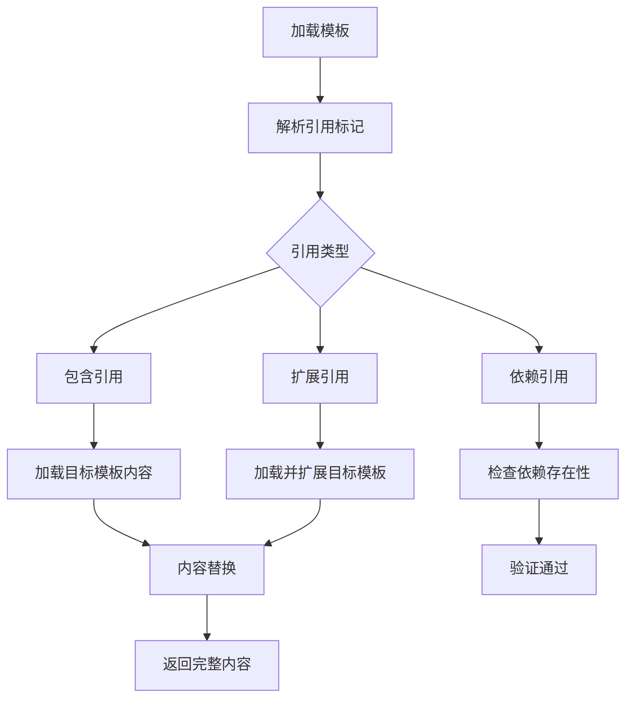

# 采购合同条款模板库架构设计

## 文档信息
- **文档版本**: 1.0.0
- **创建日期**: 2026-05-01
- **创建人**: team-member
- **关联任务**: task_1777606139156_u3krhzwq5
- **项目**: AI-Ready (ai-ready)
- **模块**: erp-purchase-contract-template

## 1. 概述

### 1.1 目标
建立采购合同条款模板库，实现模板的分类管理、版本控制和自动化引用功能，提高合同编制效率和一致性。

### 1.2 设计原则
- **标准化**: 统一的模板格式和元数据标准
- **可复用**: 最大化模板复用性，减少重复工作
- **可扩展**: 支持新的条款类型和分类
- **可追溯**: 完整的版本控制和操作历史
- **安全性**: 基于角色的访问控制和权限管理

### 1.3 技术栈
- **后端框架**: Spring Boot + MyBatis
- **数据库**: MySQL 8.0+
- **包名规范**: cn.aiedge.erp.purchase.contract.template
- **API路径**: /api/erp/purchase-contract-template
- **模块位置**: erp/erp-purchase-contract-template

## 2. 架构概览

### 2.1 系统架构图
```
┌─────────────────────────────────────────────────────────────┐
│                   模板库管理系统                               │
├──────────────┬──────────────┬──────────────┬──────────────┤
│ 模板编辑器    │ 模板管理      │ 模板检索      │ 模板引用      │
│ (富文本编辑)  │ (分类/版本)   │ (关键词/分类) │ (合同集成)    │
├──────────────┴──────────────┴──────────────┴──────────────┤
│                    模板核心服务层                             │
│   (模板管理/版本控制/引用关系/权限控制)                         │
├─────────────────────────────────────────────────────────────┤
│                    数据持久层                                 │
│   (MySQL: 模板/分类/版本/引用关系)                            │
└─────────────────────────────────────────────────────────────┘
```

### 2.2 模块关系
- **与采购合同模块集成**: 模板库为采购合同模块提供条款模板
- **独立服务**: 模板库可作为独立服务部署和扩展
- **微服务架构**: 支持未来微服务化拆分

## 3. 数据库设计

### 3.1 核心表结构

#### 3.1.1 模板分类表 (contract_template_category)
| 字段名 | 类型 | 约束 | 说明 |
|--------|------|------|------|
| id | BIGINT | PK, AUTO | 主键 |
| code | VARCHAR(50) | UNIQUE, NOT NULL | 分类代码 |
| name | VARCHAR(100) | NOT NULL | 分类名称 |
| description | VARCHAR(500) | NULL | 分类描述 |
| level | TINYINT | NOT NULL | 分类级别 (1-大分类, 2-中分类, 3-小分类) |
| parent_id | BIGINT | FK | 父分类ID |
| sort_order | INT | DEFAULT 0 | 排序序号 |
| enabled | BOOLEAN | DEFAULT true | 是否启用 |
| created_by | VARCHAR(50) | NOT NULL | 创建人 |
| created_at | DATETIME | NOT NULL | 创建时间 |
| updated_by | VARCHAR(50) | NULL | 更新人 |
| updated_at | DATETIME | NULL | 更新时间 |

#### 3.1.2 模板主表 (contract_template)
| 字段名 | 类型 | 约束 | 说明 |
|--------|------|------|------|
| id | BIGINT | PK, AUTO | 主键 |
| template_code | VARCHAR(50) | UNIQUE, NOT NULL | 模板代码 |
| name | VARCHAR(200) | NOT NULL | 模板名称 |
| description | VARCHAR(1000) | NULL | 模板描述 |
| category_id | BIGINT | FK, NOT NULL | 分类ID |
| content | MEDIUMTEXT | NOT NULL | 模板内容（富文本） |
| variables | JSON | NULL | 变量定义JSON |
| status | VARCHAR(20) | NOT NULL | 状态 (DRAFT/REVIEW/PUBLISHED/DEPRECATED) |
| version | VARCHAR(20) | NOT NULL | 当前版本 (格式: 1.0.0) |
| usage_count | INT | DEFAULT 0 | 使用次数统计 |
| avg_rating | DECIMAL(3,2) | NULL | 平均评分 |
| tags | JSON | NULL | 标签数组 |
| metadata | JSON | NULL | 扩展元数据 |
| created_by | VARCHAR(50) | NOT NULL | 创建人 |
| created_at | DATETIME | NOT NULL | 创建时间 |
| updated_by | VARCHAR(50) | NULL | 更新人 |
| updated_at | DATETIME | NULL | 更新时间 |

#### 3.1.3 模板版本表 (contract_template_version)
| 字段名 | 类型 | 约束 | 说明 |
|--------|------|------|------|
| id | BIGINT | PK, AUTO | 主键 |
| template_id | BIGINT | FK, NOT NULL | 模板ID |
| version | VARCHAR(20) | NOT NULL | 版本号 (格式: 1.0.0) |
| content | MEDIUMTEXT | NOT NULL | 版本内容 |
| variables | JSON | NULL | 变量定义 |
| change_log | VARCHAR(500) | NULL | 变更说明 |
| change_type | VARCHAR(20) | NOT NULL | 变更类型 (CREATE/UPDATE/ROLLBACK) |
| created_by | VARCHAR(50) | NOT NULL | 创建人 |
| created_at | DATETIME | NOT NULL | 创建时间 |
| is_current | BOOLEAN | DEFAULT false | 是否为当前版本 |

#### 3.1.4 模板引用关系表 (contract_template_reference)
| 字段名 | 类型 | 约束 | 说明 |
|--------|------|------|------|
| id | BIGINT | PK, AUTO | 主键 |
| source_template_id | BIGINT | FK, NOT NULL | 源模板ID |
| target_template_id | BIGINT | FK, NOT NULL | 目标模板ID |
| reference_type | VARCHAR(20) | NOT NULL | 引用类型 (INCLUDE/EXTEND/DEPEND) |
| reference_position | VARCHAR(50) | NULL | 引用位置标识 |
| created_by | VARCHAR(50) | NOT NULL | 创建人 |
| created_at | DATETIME | NOT NULL | 创建时间 |

### 3.2 索引设计
```sql
-- 模板分类表索引
CREATE INDEX idx_category_parent_id ON contract_template_category(parent_id);
CREATE INDEX idx_category_level ON contract_template_category(level);
CREATE UNIQUE INDEX uidx_category_code ON contract_template_category(code);

-- 模板主表索引
CREATE INDEX idx_template_category_id ON contract_template(category_id);
CREATE INDEX idx_template_status ON contract_template(status);
CREATE UNIQUE INDEX uidx_template_code ON contract_template(template_code);
CREATE INDEX idx_template_created_at ON contract_template(created_at);

-- 模板版本表索引
CREATE INDEX idx_version_template_id ON contract_template_version(template_id);
CREATE INDEX idx_version_created_at ON contract_template_version(created_at);
CREATE UNIQUE INDEX uidx_version_template_version ON contract_template_version(template_id, version);

-- 模板引用关系表索引
CREATE INDEX idx_ref_source_template ON contract_template_reference(source_template_id);
CREATE INDEX idx_ref_target_template ON contract_template_reference(target_template_id);
```

## 4. 分类体系设计

### 4.1 三级分类结构
```
一级分类 (level=1)
├── 通用条款 (COMMON)
│   ├── 定义条款 (DEFINITIONS)
│   ├── 解释条款 (INTERPRETATION)
│   └── 通知条款 (NOTICE)
├── 付款条款 (PAYMENT)
│   ├── 付款方式 (PAYMENT_METHOD)
│   ├── 付款期限 (PAYMENT_TERM)
│   └── 付款条件 (PAYMENT_CONDITION)
├── 交付条款 (DELIVERY)
│   ├── 交付时间 (DELIVERY_TIME)
│   ├── 交付地点 (DELIVERY_LOCATION)
│   └── 交付方式 (DELIVERY_METHOD)
├── 质量条款 (QUALITY)
│   ├── 质量标准 (QUALITY_STANDARD)
│   ├── 质量检验 (QUALITY_INSPECTION)
│   └── 质量保证 (QUALITY_GUARANTEE)
└── 争议解决 (DISPUTE)
    ├── 协商解决 (NEGOTIATION)
    ├── 仲裁条款 (ARBITRATION)
    └── 诉讼管辖 (JURISDICTION)
```

### 4.2 分类编码规则
- **一级分类**: 2位字母 (如: CM, PM, DL, QL, DS)
- **二级分类**: 一级分类 + 2位数字 (如: CM01, PM02)
- **三级分类**: 二级分类 + 2位数字 (如: CM0101, PM0201)

## 5. 版本控制机制

### 5.1 版本号规范
- **主版本 (Major)**: 不兼容的重大变更 (X.0.0)
- **次版本 (Minor)**: 向下兼容的功能性新增 (1.X.0)
- **补丁版本 (Patch)**: 向下兼容的问题修正 (1.0.X)

### 5.2 版本管理流程
```
创建模板 → 版本1.0.0 (DRAFT)
    ↓
内部评审 → 版本1.0.0 (REVIEW)
    ↓
发布上线 → 版本1.0.0 (PUBLISHED)
    ↓
更新需求 → 版本1.1.0 (DRAFT)
    ↓
...
版本回退 → 可回退到历史任意版本
```

### 5.3 版本对比与合并
- **三向合并**: 支持基于版本历史的智能合并
- **变更追踪**: 自动生成变更日志
- **冲突解决**: 可视化冲突解决界面

## 6. 模板引用关系

### 6.1 引用类型
1. **包含引用 (INCLUDE)**: 将目标模板内容包含到当前位置
2. **扩展引用 (EXTEND)**: 继承目标模板并扩展或覆盖部分内容
3. **依赖引用 (DEPEND)**: 声明依赖关系，但不直接包含内容

### 6.2 引用解析流程


## 7. API接口设计

### 7.1 基础接口
- **POST /api/erp/purchase-contract-template/templates** - 创建模板
- **GET /api/erp/purchase-contract-template/templates/{id}** - 获取模板详情
- **PUT /api/erp/purchase-contract-template/templates/{id}** - 更新模板
- **DELETE /api/erp/purchase-contract-template/templates/{id}** - 删除模板
- **GET /api/erp/purchase-contract-template/templates** - 模板列表查询

### 7.2 版本管理接口
- **POST /api/erp/purchase-contract-template/templates/{id}/versions** - 创建新版本
- **GET /api/erp/purchase-contract-template/templates/{id}/versions** - 版本列表
- **GET /api/erp/purchase-contract-template/templates/{id}/versions/{version}** - 获取指定版本
- **POST /api/erp/purchase-contract-template/templates/{id}/rollback** - 版本回退

### 7.3 分类管理接口
- **POST /api/erp/purchase-contract-template/categories** - 创建分类
- **GET /api/erp/purchase-contract-template/categories** - 分类树查询
- **PUT /api/erp/purchase-contract-template/categories/{id}** - 更新分类
- **DELETE /api/erp/purchase-contract-template/categories/{id}** - 删除分类

### 7.4 检索接口
- **GET /api/erp/purchase-contract-template/search** - 全文检索
- **GET /api/erp/purchase-contract-template/suggest** - 搜索建议
- **POST /api/erp/purchase-contract-template/import** - 批量导入
- **GET /api/erp/purchase-contract-template/export** - 批量导出

## 8. 变量系统设计

### 8.1 变量语法
```
{{变量名|默认值|类型|描述}}
示例: {{supplier_name||string|供应商名称}}
```

### 8.2 变量类型
- **string**: 字符串类型
- **number**: 数字类型
- **date**: 日期类型
- **boolean**: 布尔类型
- **list**: 列表类型
- **object**: 对象类型

### 8.3 变量解析
1. **静态解析**: 预定义的固定值
2. **动态解析**: 运行时从上下文获取
3. **表达式解析**: 支持简单表达式计算

## 9. 权限管理

### 9.1 角色定义
- **管理员 (ADMIN)**: 全部权限
- **编辑者 (EDITOR)**: 创建、编辑、发布模板
- **评审员 (REVIEWER)**: 评审模板，不能编辑
- **使用者 (USER)**: 仅使用模板，不能修改

### 9.2 权限矩阵
| 操作 | ADMIN | EDITOR | REVIEWER | USER |
|------|-------|--------|----------|------|
| 创建模板 | ✓ | ✓ | ✗ | ✗ |
| 编辑模板 | ✓ | ✓ | ✗ | ✗ |
| 删除模板 | ✓ | ✗ | ✗ | ✗ |
| 发布模板 | ✓ | ✓ | ✓ | ✗ |
| 评审模板 | ✓ | ✗ | ✓ | ✗ |
| 使用模板 | ✓ | ✓ | ✓ | ✓ |
| 管理分类 | ✓ | ✗ | ✗ | ✗ |
| 管理权限 | ✓ | ✗ | ✗ | ✗ |

## 10. 实施路线图

### 10.1 第一阶段 (1周): 基础架构
- [ ] 数据库表创建和索引设计
- [ ] Spring Boot模块基础架构
- [ ] 实体层和Repository层实现
- [ ] 基础CRUD API接口

### 10.2 第二阶段 (1周): 核心功能
- [ ] 模板分类管理功能
- [ ] 模板版本控制系统
- [ ] 模板引用关系管理
- [ ] 变量系统基础实现

### 10.3 第三阶段 (1周): 高级功能
- [ ] 富文本编辑器集成
- [ ] 模板检索和搜索功能
- [ ] 权限控制系统
- [ ] 批量导入导出功能

### 10.4 第四阶段 (1周): 集成与优化
- [ ] 与采购合同模块集成
- [ ] 性能优化和缓存
- [ ] 监控和日志
- [ ] 文档和测试

## 11. 性能考虑

### 11.1 缓存策略
- **一级缓存**: 模板内容缓存 (Redis)
- **二级缓存**: 分类树缓存 (本地缓存)
- **三级缓存**: 热点模板缓存 (内存缓存)

### 11.2 数据库优化
- 分区策略: 按创建时间分区
- 读写分离: 主从数据库架构
- 查询优化: 覆盖索引和查询重写

### 11.3 并发控制
- 乐观锁: 基于版本的并发控制
- 悲观锁: 关键操作的行级锁
- 分布式锁: 集群环境下的协调

## 12. 监控与运维

### 12.1 监控指标
- 模板使用频率统计
- 系统响应时间监控
- 错误率和异常监控
- 缓存命中率统计

### 12.2 告警策略
- 系统错误率超过阈值
- 响应时间超过预期
- 缓存命中率过低
- 数据库连接池使用率过高

## 13. 附录

### 13.1 项目规范参考
- 包名: cn.aiedge.erp.purchase.contract.template
- API路径: /api/erp/purchase-contract-template
- 模块位置: erp/erp-purchase-contract-template

### 13.2 相关文档
- 采购合同模块架构设计
- 项目开发规范文档
- API接口文档模板

### 13.3 变更记录
| 版本 | 日期 | 修改人 | 修改说明 |
|------|------|--------|----------|
| 1.0.0 | 2026-05-01 | team-member | 初始版本创建 |

---

**文档完成状态**: ✅ 架构设计完成
**下一步**: 根据架构设计创建模块基础结构