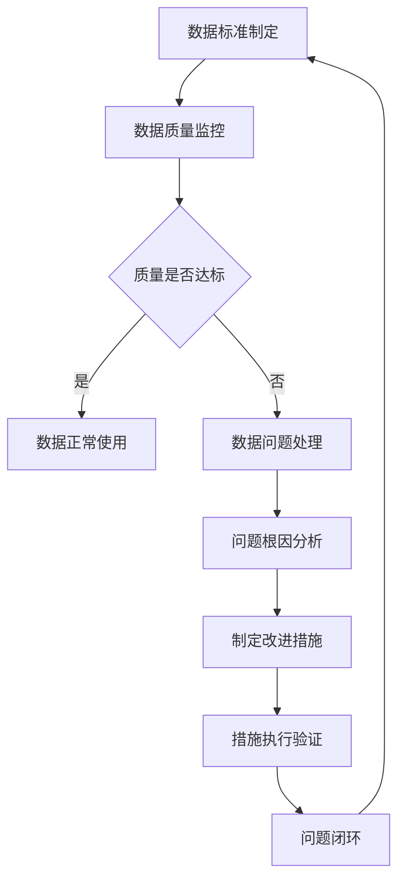

# ERP系统数据治理与质量管理体系设计

## 1. 数据治理需求分析

### 1.1 ERP各业务模块数据治理痛点

#### 1.1.1 采购模块
- **数据痛点**：供应商信息重复、资质信息不全、报价数据不一致
- **影响**：采购成本增加、合规风险、供应商管理困难
- **治理需求**：供应商主数据标准化、资质证书有效期管理、报价数据一致性校验

#### 1.1.2 库存模块
- **数据痛点**：库存数据不准、批次/序列号管理混乱、出入库记录缺失
- **影响**：库存成本增加、发货错误、追溯困难
- **治理需求**：库存数据实时同步、批次跟踪、出入库日志完备性

#### 1.1.3 销售模块
- **数据痛点**：客户信息不完整、订单数据错误、发货状态不一致
- **影响**：客户满意度低、收入确认困难、客户投诉
- **治理需求**：客户主数据治理、订单数据验证、发货状态实时同步

#### 1.1.4 财务模块
- **数据痛点**：会计科目不规范、凭证数据不匹配、报表数据不一致
- **影响**：财务审计风险、报表错误、决策依据不准确
- **治理需求**：会计科目标准化、凭证数据完整性校验、报表数据一致性

#### 1.1.5 生产模块
- **数据痛点**：BOM数据错误、工艺路线不完整、质量检验数据缺失
- **影响**：生产错误、质量不合格、成本核算困难
- **治理需求**：BOM数据验证、工艺路线完整性、质量数据追踪

### 1.2 数据治理核心目标
1. **准确性**：确保数据准确反映业务实际情况
2. **一致性**：跨系统、跨模块数据保持同步一致
3. **完整性**：关键业务数据无缺失、必填项完备
4. **及时性**：数据更新及时，反映最新业务状态
5. **可信度**：建立数据质量可信度评估体系

## 2. 数据治理组织架构

### 2.1 三层数据治理组织
```
数据治理委员会（战略层）
├── 数据治理办公室（管理协调层）
├── 数据所有者（业务负责人层）
├── 数据管家（数据管理员层）
└── 数据质量分析师（质量控制层）
```

### 2.2 职责分工
#### 2.2.1 数据治理委员会
- 制定数据治理战略和目标
- 审批数据治理政策和标准
- 分配数据治理预算和资源
- 评估数据治理绩效

#### 2.2.2 数据治理办公室
- 制定数据治理流程和规范
- 协调跨部门数据治理工作
- 管理数据治理项目
- 监督数据质量改进

#### 2.2.3 数据所有者
- 负责指定业务域的数据质量
- 审批数据标准和规则
- 决策数据质量问题处理
- 确保数据满足业务需求

#### 2.2.4 数据管家
- 执行数据标准和规则
- 监控数据质量指标
- 报告数据质量问题
- 执行数据清洗和修复

#### 2.2.5 数据质量分析师
- 设计数据质量规则和指标
- 分析数据质量问题根因
- 提出数据质量改进建议
- 开发数据质量检测工具

## 3. 数据治理流程设计

### 3.1 数据治理标准流程


### 3.2 核心治理流程

#### 3.2.1 数据标准管理流程
1. **标准提案**：业务部门提出数据标准需求
2. **标准评审**：数据治理办公室组织评审
3. **标准审批**：数据治理委员会审批
4. **标准发布**：正式发布并培训
5. **标准执行**：系统层面落地执行
6. **标准评估**：定期评估标准效果

#### 3.2.2 数据质量管理流程
1. **质量规则定义**：基于业务需求定义质量规则
2. **质量监控执行**：系统自动执行质量监控
3. **质量问题发现**：发现不符合质量规则的数据
4. **问题处理分配**：分配问题给责任部门
5. **问题修复验证**：验证问题修复效果
6. **质量持续改进**：优化质量规则和监控机制

#### 3.2.3 数据生命周期管理流程
1. **数据创建**：数据创建时的质量控制
2. **数据存储**：存储安全和备份策略
3. **数据使用**：使用权限和审计跟踪
4. **数据归档**：历史数据归档策略
5. **数据销毁**：敏感数据安全销毁

## 4. 数据治理平台规划

### 4.1 技术架构设计
```
┌─────────────────────────────────────────────────┐
│              数据治理门户层                      │
│  ├─数据标准管理  ├─数据质量监控  ├─元数据管理    │
└─────────────────────────────────────────────────┘
┌─────────────────────────────────────────────────┐
│              数据治理服务层                      │
│  ├─标准服务  ├─质量服务  ├─元数据服务  ├─主数据服务│
└─────────────────────────────────────────────────┘
┌─────────────────────────────────────────────────┐
│              数据治理引擎层                      │
│  ├─规则引擎  ├─工作流引擎  ├─ETL引擎  ├─监控引擎  │
└─────────────────────────────────────────────────┘
┌─────────────────────────────────────────────────┐
│              数据源层                           │
│  ├─ERP系统  ├─CRM系统  ├─外部数据源  ├─数据仓库   │
└─────────────────────────────────────────────────┘
```

### 4.2 核心功能组件

#### 4.2.1 数据标准管理
- **数据字典管理**：统一数据定义和格式
- **数据分类管理**：数据分类体系管理
- **标准版本控制**：标准变更和版本管理
- **标准合规检查**：自动检查标准合规性

#### 4.2.2 数据质量监控
- **质量规则配置**：可配置的质量检测规则
- **质量指标计算**：自动化质量指标计算
- **质量告警通知**：异常数据实时告警
- **质量报告生成**：质量状况分析报告

#### 4.2.3 元数据管理
- **业务元数据**：业务定义、术语表
- **技术元数据**：数据结构、数据类型
- **操作元数据**：数据血缘、变更历史
- **管理元数据**：数据所有者、使用权限

#### 4.2.4 主数据管理
- **主数据模型**：核心业务实体模型
- **主数据同步**：跨系统主数据同步
- **主数据质量**：主数据质量保证
- **主数据安全**：主数据访问控制

## 5. 数据标准体系建设

### 5.1 数据元标准
#### 5.1.1 核心数据元素分类
- **主数据类**：客户、供应商、物料、员工等
- **交易数据类**：订单、发票、凭证、出入库等
- **参考数据类**：币种、国家、单位、状态等
- **配置数据类**：参数、设置、规则、模板等

#### 5.1.2 数据元素标准定义
```yaml
数据元素: 客户编号
- 中文名称: 客户编号
- 英文名称: customer_code
- 数据类型: 字符串
- 数据长度: 20
- 格式规则: "CUS" + 8位数字 + 校验码
- 必填性: 是
- 唯一性: 是
- 示例: CUS202300010
- 业务规则: 唯一标识客户，不可修改
- 关联系统: CRM、ERP、财务系统
```

### 5.2 数据字典开发
#### 5.2.1 数据字典结构
```yaml
数据字典:
  业务域: 销售管理
  数据表: sales_order
  字段列表:
    - 字段名: order_no
      中文名: 订单编号
      数据类型: VARCHAR(50)
      业务规则: YYMMDD+6位流水号
      示例: 230501000001
    
    - 字段名: customer_id
      中文名: 客户ID
      数据类型: INT
      外键: customer.id
      业务规则: 必须存在于客户表
    
    - 字段名: order_status
      中文名: 订单状态
      数据类型: ENUM
      枚举值: ['pending','confirmed','shipped','completed','cancelled']
      业务规则: 状态流转必须符合规则
```

#### 5.2.2 数据字典管理功能
- **字典查询**：按业务域、表名、字段名查询
- **字典版本**：历史版本追溯
- **字典导出**：支持多种格式导出
- **字典变更**：变更审批流程

### 5.3 数据建模规范
#### 5.3.1 命名规范
- **表命名**：使用业务英文名称，下划线分隔
- **字段命名**：使用驼峰命名法，清晰表达含义
- **索引命名**：idx_表名_字段名_类型
- **约束命名**：pk_表名, fk_表名_字段名, uk_表名_字段名

#### 5.3.2 设计规范
- **主键设计**：使用自增ID或业务编号
- **外键设计**：必须定义外键约束
- **索引设计**：基于查询频率设计
- **分区设计**：大数据表考虑分区策略

## 6. 数据质量管理体系

### 6.1 数据质量维度
| 质量维度 | 定义 | 评估指标 | 改进措施 |
|---------|------|---------|---------|
| **准确性** | 数据准确反映实际情况 | 错误率、偏差度 | 数据验证、业务规则检查 |
| **完整性** | 数据无缺失、必填项完备 | 缺失率、空值率 | 必填项约束、默认值设置 |
| **一致性** | 跨系统数据保持一致 | 不一致率、同步延迟 | 数据同步机制、一致性检查 |
| **及时性** | 数据更新及时 | 延迟时间、更新频率 | 实时同步、定时任务 |
| **唯一性** | 数据无重复 | 重复率、冲突率 | 唯一性约束、去重机制 |
| **有效性** | 数据格式有效 | 格式错误率、非法值率 | 格式验证、枚举值约束 |

### 6.2 数据质量监控体系
#### 6.2.1 监控层级
- **实时监控**：业务操作实时质量检查
- **准实时监控**：分钟级质量监控告警
- **批量监控**：每日批量质量分析
- **周期性监控**：周/月质量趋势分析

#### 6.2.2 监控规则类型
1. **业务规则监控**
   - 数值范围检查：金额、数量、日期范围
   - 逻辑关系检查：父子关系、状态流转
   - 业务完整性检查：必填项、关联数据

2. **技术规则监控**
   - 格式检查：数据类型、长度、格式
   - 引用完整性：外键关系检查
   - 性能监控：数据访问性能

3. **合规规则监控**
   - 敏感数据检查：PII数据保护
   - 审计合规检查：操作日志完备性
   - 监管要求检查：行业规范要求

### 6.3 数据质量评估
#### 6.3.1 评估指标设计
```yaml
数据质量指标:
  总体质量评分:
    - 计算公式: ∑(维度权重 × 维度得分)
    - 目标值: ≥90分
    
  各维度得分:
    - 准确性得分: (1 - 错误率) × 100
    - 完整性得分: (1 - 缺失率) × 100
    - 一致性得分: (1 - 不一致率) × 100
    - 及时性得分: 按延迟时间分段评分
    
  维度权重:
    - 准确性: 40%
    - 完整性: 25%
    - 一致性: 20%
    - 及时性: 15%
```

#### 6.3.2 质量报告体系
- **实时质量看板**：关键指标实时展示
- **日报**：每日质量异常统计
- **周报**：质量趋势分析和改进建议
- **月报**：月度质量状况分析和绩效评估

## 7. 数据生命周期管理

### 7.1 数据生命周期阶段
```
创建 → 使用 → 归档 → 销毁
    ↓
存储管理
    ↓
备份恢复
    ↓
安全保护
```

### 7.2 各阶段管理策略
#### 7.2.1 创建阶段
- **数据标准应用**：创建时应用数据标准
- **质量检查**：创建时执行质量检查
- **权限控制**：创建者权限和审计

#### 7.2.2 使用阶段
- **访问控制**：基于角色的访问控制
- **使用监控**：数据使用行为监控
- **变更管理**：数据变更审批流程

#### 7.2.3 归档阶段
- **归档策略**：基于业务规则的归档策略
- **归档存储**：低成本存储方案
- **归档检索**：归档数据快速检索

#### 7.2.4 销毁阶段
- **销毁审批**：审批流程控制
- **安全销毁**：彻底删除敏感数据
- **销毁审计**：销毁记录可审计

## 8. 实施路线图

### 8.1 实施阶段规划
#### 8.1.1 第一阶段：基础建设期（1-3个月）
- **目标**：建立组织架构和基础框架
- **主要工作**：
  1. 成立数据治理组织
  2. 制定数据治理政策
  3. 建设数据治理门户
  4. 开发核心数据字典

#### 8.1.2 第二阶段：体系建设期（4-9个月）
- **目标**：完善数据标准和质量体系
- **主要工作**：
  1. 制定全面数据标准
  2. 建立数据质量监控体系
  3. 实施主数据管理
  4. 开展数据质量改进

#### 8.1.3 第三阶段：深化应用期（10-12个月）
- **目标**：数据治理全面应用
- **主要工作**：
  1. 扩展数据治理范围
  2. 优化数据质量规则
  3. 建立数据文化
  4. 持续改进机制

### 8.2 关键成功因素
1. **高层支持**：获得管理层重视和资源支持
2. **业务驱动**：以业务价值为导向的设计
3. **分步实施**：从小范围试点逐步扩展
4. **技术支撑**：建设自动化治理平台
5. **文化培育**：建立全员数据质量意识

### 8.3 效益评估
#### 8.3.1 直接效益
- **成本节约**：减少数据错误带来的损失
- **效率提升**：降低数据查找和处理时间
- **风险降低**：减少合规和业务风险
- **质量改善**：提升数据准确性和可信度

#### 8.3.2 间接效益
- **决策优化**：基于高质量数据的决策
- **客户满意**：提升客户服务和体验
- **创新支持**：为数据驱动创新奠定基础
- **竞争优势**：形成数据资产的核心竞争力

## 9. 总结

ERP数据治理与质量管理体系是确保企业数据资产价值的重要基础。通过建立完整的组织架构、流程规范、技术平台和质量体系，可以实现：

1. **数据标准化**：统一数据定义和使用规范
2. **质量可控**：持续监控和改进数据质量
3. **生命周期管理**：全周期数据管理和保护
4. **价值最大化**：释放数据资产的业务价值

本体系设计为ERP系统提供了一套可落地实施的完整解决方案，可根据企业实际情况分阶段实施，逐步建立完善的数据治理能力。