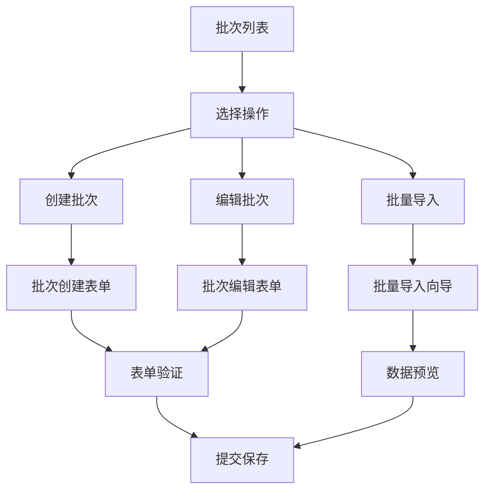
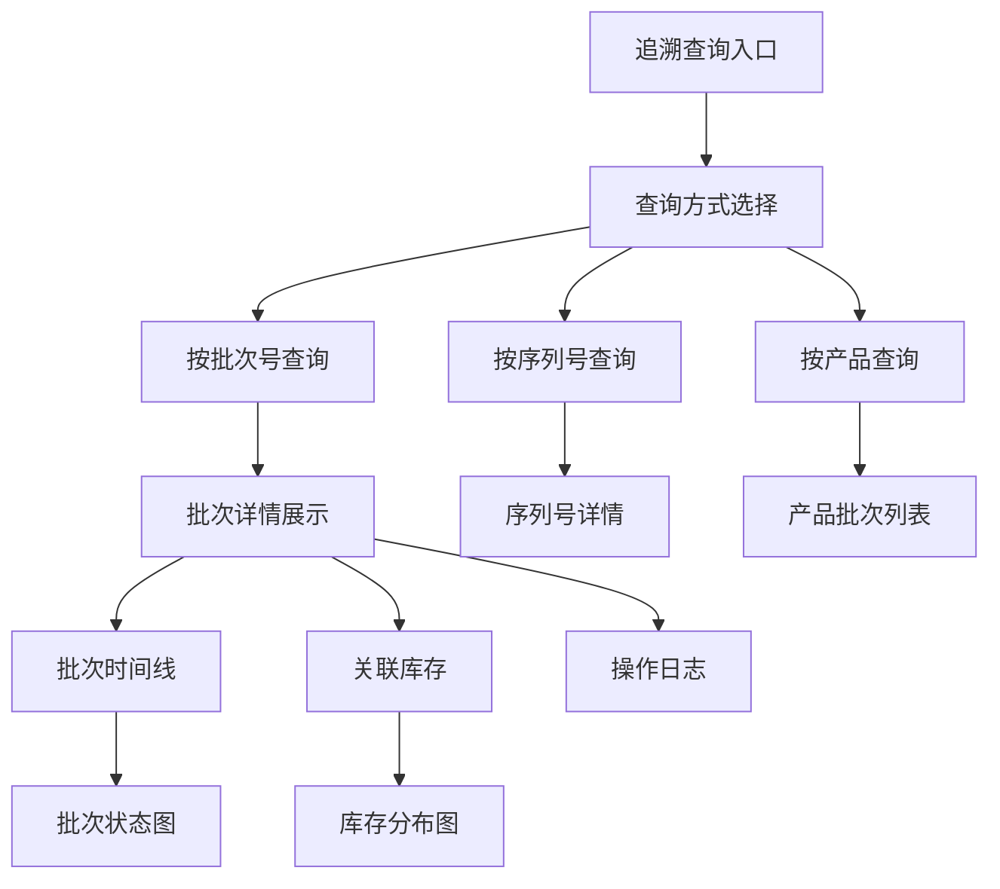
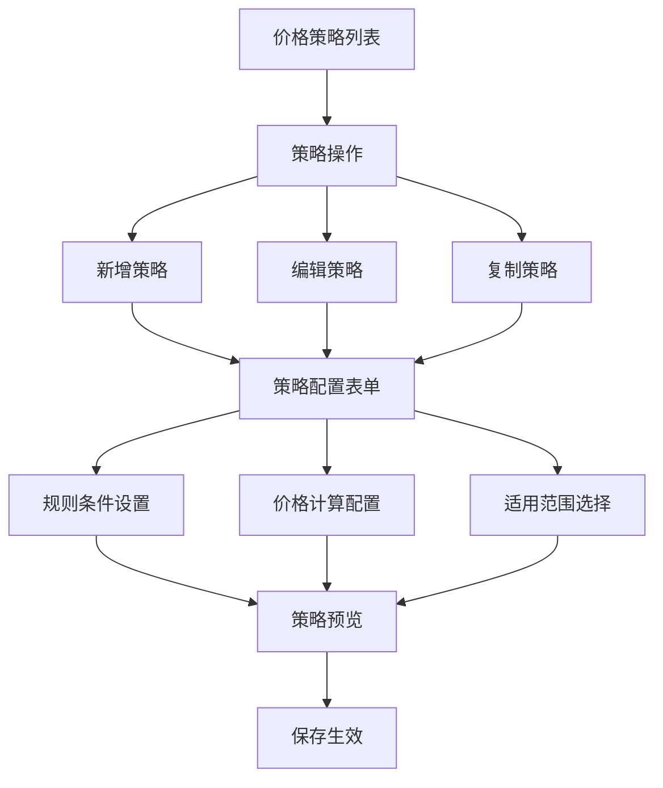
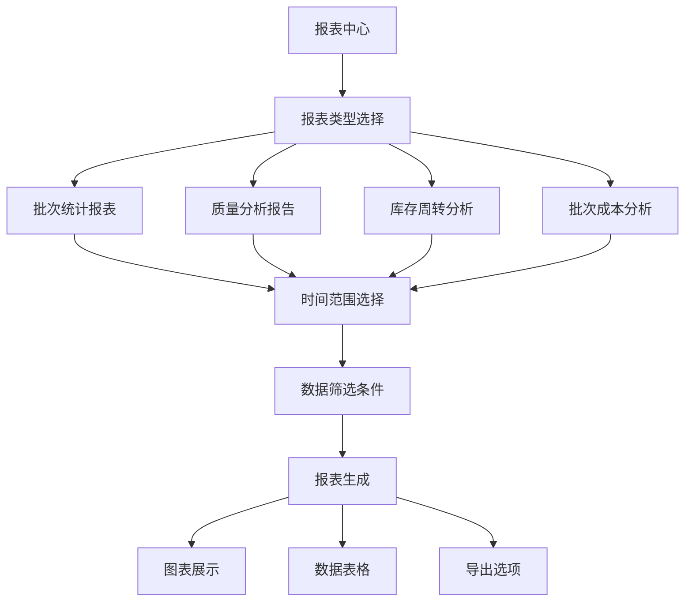

# ERP批次管理系统UI/UX设计规范

**项目**: AI-Ready (智企连) - ERP批次管理模块
**版本**: v1.0
**创建日期**: 2026-04-30
**负责人**: UI设计师 (ui-mnj0fukd)
**任务ID**: task_1777554925992_2ybb4okma

---

## 概述

批次管理系统是企业资源计划（ERP）的核心模块，用于管理产品的批次、序列号、库存追踪、质量追溯和价格策略。本设计规范涵盖了批次管理系统的用户界面和用户体验设计。

## 设计目标

1. **高效录入**: 简化批次信息录入流程，减少用户操作步骤
2. **精准追溯**: 提供清晰的批次追溯和关联查询界面
3. **灵活配置**: 便于价格策略和批次规则的配置管理
4. **直观展示**: 通过数据可视化展示批次报表和关键指标
5. **移动适配**: 支持多设备访问，确保良好的响应式体验

## 设计原则

### 1. 业务导向
- 界面设计贴近实际业务场景
- 操作流程符合业务逻辑顺序
- 信息展示突出业务关键指标

### 2. 效率优先
- 减少不必要的操作步骤
- 提供批量操作和快捷方式
- 智能表单验证和自动填充

### 3. 数据可视
- 重要数据采用可视化展示
- 状态信息使用颜色编码
- 趋势变化通过图表呈现

### 4. 一致性
- 遵循ERP系统整体设计风格
- 统一组件库和交互模式
- 保持与现有模块的一致性

## 核心界面设计

### 1. 批次信息录入和编辑界面

#### 1.1 主要功能
- 创建新批次
- 编辑批次信息
- 批量导入批次数据
- 批次状态管理
- 附件上传（质量证书、测试报告）

#### 1.2 界面布局


#### 1.3 设计要点
1. **智能表单**:
   - 产品选择支持搜索和筛选
   - 日期选择使用日历组件
   - 数量输入支持单位换算
   - 表单字段智能联动

2. **附件管理**:
   - 支持拖拽上传
   - 文件格式预览
   - 上传进度显示
   - 附件列表管理

3. **批量操作**:
   - 支持Excel/CSV导入
   - 数据模板下载
   - 导入数据预览
   - 错误数据标识

### 2. 批次追溯和关联查询界面

#### 2.1 主要功能
- 批次历史追踪
- 序列号查询
- 批次关联关系查看
- 操作日志查看
- 批次流向分析

#### 2.2 界面布局


#### 2.3 设计要点
1. **时间线展示**:
   - 垂直时间轴布局
   - 关键节点突出显示
   - 状态变化可视化
   - 操作详情查看

2. **关联关系图**:
   - 批次-库存关联关系图
   - 批次-序列号关系图
   - 点击展开详细关联
   - 支持关系图缩放

3. **搜索优化**:
   - 智能搜索建议
   - 搜索历史记录
   - 二维码扫描支持
   - 高级搜索筛选

### 3. 价格策略配置和管理界面

#### 3.1 主要功能
- 价格规则配置
- 策略优先级管理
- 批量价格调整
- 价格历史查看
- 策略效果预览

#### 3.2 界面布局


#### 3.3 设计要点
1. **策略配置向导**:
   - 分步骤配置界面
   - 配置进度显示
   - 配置项说明提示
   - 实时配置预览

2. **条件规则编辑器**:
   - 可视化规则构建
   - 条件分组管理
   - 规则优先级排序
   - 规则语法验证

3. **批量操作**:
   - 批量启用/禁用策略
   - 策略复制模板
   - 批量导出策略配置
   - 策略版本管理

### 4. 批次报表和数据可视化界面

#### 4.1 主要功能
- 批次统计报表
- 质量分析报告
- 库存周转分析
- 批次成本分析
- 趋势预测图表

#### 4.2 界面布局


#### 4.3 设计要点
1. **数据仪表盘**:
   - 关键指标卡片展示
   - 指标趋势变化图
   - 实时数据更新
   - 指标异常预警

2. **交互式图表**:
   - 图表类型切换
   - 数据维度下钻
   - 图表联动筛选
   - 图表导出分享

3. **报表定制**:
   - 自定义报表模板
   - 字段选择配置
   - 布局拖拽调整
   - 报表定时生成

## 交互设计规范

### 1. 表单交互
1. **字段验证**:
   - 实时表单验证
   - 错误信息即时提示
   - 必填字段标识
   - 验证状态反馈

2. **数据输入**:
   - 智能输入提示
   - 历史记录填充
   - 输入格式自动修正
   - 数据单位自动转换

### 2. 列表交互
1. **数据展示**:
   - 分页加载优化
   - 虚拟滚动支持
   - 列自定义显示
   - 排序和筛选

2. **操作交互**:
   - 行内操作按钮
   - 批量选择操作
   - 右键快捷菜单
   - 拖拽排序

### 3. 导航交互
1. **页面导航**:
   - 面包屑导航
   - 标签页切换
   - 步骤指示器
   - 返回路径记录

2. **搜索导航**:
   - 全局搜索入口
   - 高级搜索展开
   - 搜索筛选保存
   - 搜索历史管理

## 响应式设计

### 1. 桌面端（≥ 1024px）
- 多列布局展示
- 侧边导航固定
- 内容区域充分
- 操作区域固定

### 2. 平板端（768px - 1023px）
- 单列主内容
- 折叠式导航
- 操作区域优化
- 触摸友好设计

### 3. 移动端（≤ 767px）
- 全屏内容展示
- 底部导航栏
- 大点击区域
- 手势操作支持

## 组件设计

### 1. 批次卡片组件 (BatchCard)
```vue
<template>
  <div class="batch-card" :class="statusClass">
    <div class="batch-header">
      <div class="batch-number">{{ batchNumber }}</div>
      <div class="batch-status">{{ statusText }}</div>
    </div>
    <div class="batch-content">
      <div class="batch-info-row">
        <div class="info-label">产品</div>
        <div class="info-value">{{ productName }}</div>
      </div>
      <div class="batch-info-row">
        <div class="info-label">生产日期</div>
        <div class="info-value">{{ productionDate }}</div>
      </div>
      <div class="batch-info-row">
        <div class="info-label">库存数量</div>
        <div class="info-value">{{ quantity }}</div>
      </div>
    </div>
    <div class="batch-actions">
      <button class="btn-detail" @click="handleDetail">查看详情</button>
      <button class="btn-edit" @click="handleEdit">编辑</button>
    </div>
  </div>
</template>
```

### 2. 批次时间线组件 (BatchTimeline)
```vue
<template>
  <div class="batch-timeline">
    <div v-for="(event, index) in events" :key="index" class="timeline-item">
      <div class="timeline-dot" :class="event.type"></div>
      <div class="timeline-content">
        <div class="timeline-time">{{ event.time }}</div>
        <div class="timeline-title">{{ event.title }}</div>
        <div class="timeline-description" v-if="event.description">
          {{ event.description }}
        </div>
      </div>
    </div>
  </div>
</template>
```

### 3. 批次表单组件 (BatchForm)
```vue
<template>
  <div class="batch-form">
    <div class="form-section">
      <h3 class="section-title">基本信息</h3>
      <div class="form-grid">
        <FormField
          label="批次号"
          v-model="form.batchNumber"
          required
          placeholder="请输入批次号"
        />
        <FormField
          label="产品名称"
          v-model="form.productName"
          required
          type="select"
          :options="products"
        />
        <FormField
          label="生产日期"
          v-model="form.productionDate"
          required
          type="date"
        />
        <FormField
          label="失效日期"
          v-model="form.expirationDate"
          required
          type="date"
        />
      </div>
    </div>
    
    <div class="form-section">
      <h3 class="section-title">数量信息</h3>
      <div class="form-grid">
        <FormField
          label="总数量"
          v-model="form.totalQuantity"
          required
          type="number"
          unit="个"
        />
        <FormField
          label="当前库存"
          v-model="form.currentStock"
          type="number"
          unit="个"
          readonly
        />
      </div>
    </div>
    
    <div class="form-actions">
      <button class="btn-submit" @click="handleSubmit">保存批次</button>
      <button class="btn-cancel" @click="handleCancel">取消</button>
    </div>
  </div>
</template>
```

## 颜色编码规范

### 1. 批次状态颜色
```css
/* 活跃批次 - 绿色 */
--batch-status-active: #52c41a;
--batch-status-active-bg: #f6ffed;

/* 冻结批次 - 蓝色 */
--batch-status-frozen: #1890ff;
--batch-status-frozen-bg: #e6f7ff;

/* 过期批次 - 橙色 */
--batch-status-expired: #fa8c16;
--batch-status-expired-bg: #fff7e6;

/* 归档批次 - 灰色 */
--batch-status-archived: #8c8c8c;
--batch-status-archived-bg: #f5f5f5;

/* 风险批次 - 红色 */
--batch-status-risk: #f5222d;
--batch-status-risk-bg: #fff1f0;
```

### 2. 质量等级颜色
```css
/* A级 - 绿色 */
--quality-grade-a: #52c41a;
--quality-grade-a-bg: #f6ffed;

/* B级 - 蓝色 */
--quality-grade-b: #1890ff;
--quality-grade-b-bg: #e6f7ff;

/* C级 - 橙色 */
--quality-grade-c: #fa8c16;
--quality-grade-c-bg: #fff7e6;

/* D级 - 红色 */
--quality-grade-d: #f5222d;
--quality-grade-d-bg: #fff1f0;
```

## 动画效果

### 1. 页面过渡
```css
.page-enter-active,
.page-leave-active {
  transition: opacity 0.3s ease, transform 0.3s ease;
}

.page-enter-from,
.page-leave-to {
  opacity: 0;
  transform: translateY(20px);
}
```

### 2. 组件动画
```css
/* 批次卡片悬停效果 */
.batch-card {
  transition: box-shadow 0.3s ease, transform 0.2s ease;
}

.batch-card:hover {
  box-shadow: 0 8px 24px rgba(0, 0, 0, 0.1);
  transform: translateY(-2px);
}

/* 表单字段聚焦效果 */
.form-field:focus-within {
  border-color: var(--color-primary);
  box-shadow: 0 0 0 3px rgba(24, 144, 255, 0.1);
}
```

## 可访问性设计

### 1. 键盘导航
- Tab键顺序符合操作逻辑
- 焦点状态清晰可见
- 键盘快捷键支持
- 屏幕阅读器兼容

### 2. 视觉辅助
- 颜色对比度符合WCAG 2.1 AA标准
- 文字大小可调整
- 图标与文字配合使用
- 焦点状态高亮显示

## 实施计划

### 阶段1：基础界面实现 (1-2周)
- 创建基础组件库
- 实现批次列表界面
- 完成批次表单界面
- 添加基础导航功能

### 阶段2：核心功能开发 (2-3周)
- 实现批次创建和编辑
- 添加批次查询功能
- 集成价格策略配置
- 实现基础数据导出

### 阶段3：高级功能优化 (3-4周)
- 完善批次追溯功能
- 添加数据可视化图表
- 实现批量操作功能
- 优化移动端适配

### 阶段4：测试与优化 (1-2周)
- 用户测试和反馈收集
- 性能优化
- 可访问性优化
- 文档完善

## 总结

本设计规范为批次管理系统的UI/UX设计提供了完整的指导，包括界面布局、交互设计、组件规范和实施计划。通过遵循本规范，可以确保批次管理系统的界面既美观又实用，为用户提供高效、直观的使用体验。

设计文档将根据实际开发过程中的反馈进行调整和优化，确保最终产品符合用户需求和业务目标。