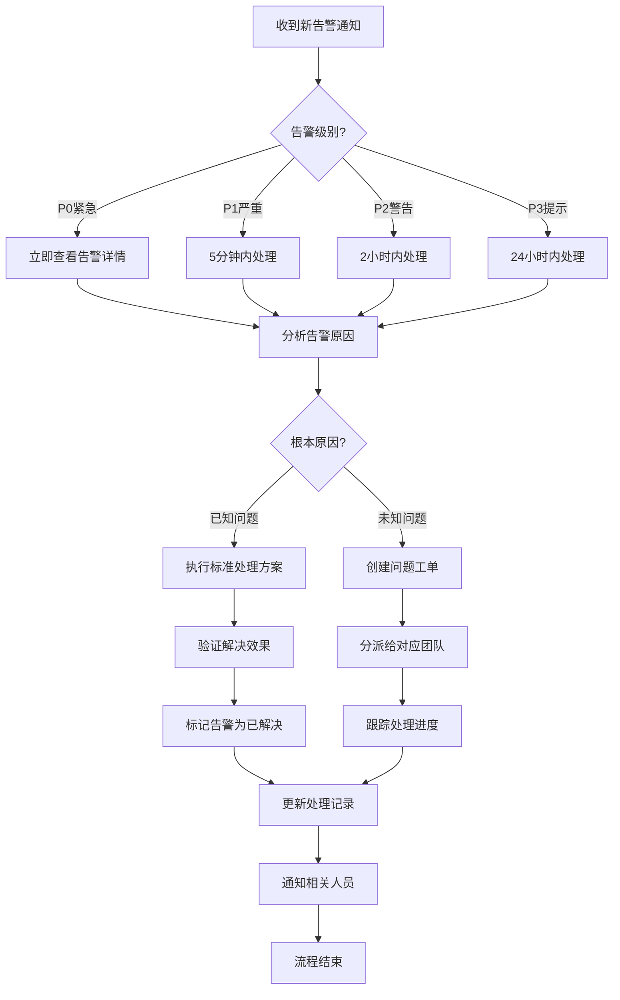
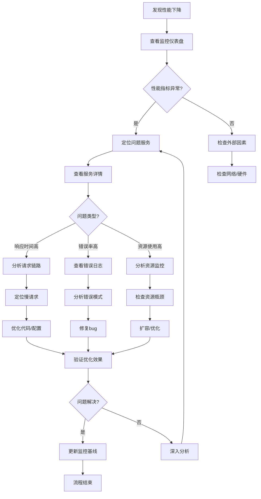

# 测试环境监控系统原型设计

## 文档信息
- **项目**: AI-Ready (Sprint 27+1 测试环境配置专项)
- **设计类型**: 高保真原型设计
- **包含内容**: 界面原型、交互流程、组件规范
- **设计者**: UI设计师 (ui-mnj0fukd)
- **日期**: 2026-04-29
- **版本**: 1.0

## 1. 原型设计概述

### 1.1 设计目标
通过高保真原型展示监控系统的完整用户体验，包括：
- **界面布局**: 所有页面的视觉设计
- **交互流程**: 用户操作的完整路径
- **状态变化**: 不同状态下的界面表现
- **响应式适配**: 多端设备的布局变化

### 1.2 设计原则
- **真实性**: 原型尽可能接近最终实现效果
- **完整性**: 覆盖所有核心功能和场景
- **可交互性**: 支持基本的点击和导航交互
- **可扩展性**: 便于后续迭代和修改

## 2. 监控仪表盘原型

### 2.1 桌面端仪表盘

#### 2.1.1 布局结构
```
┌─────────────────────────────────────────────────────────┐
│  🏢 企智连测试环境监控                          🔄 12:30 │
│                                                         │
├─────────────────────────────────────────────────────────┤
│  📊 系统健康度: 98.5% ↑2.3%    ⏱️ 响应时间: 245ms ↓15%  │
│  📈 吞吐量: 1,245 req/s ↑8%    ❌ 错误率: 0.8% ↑0.2%    │
│                                                         │
├─────────────────────────────────────────────────────────┤
│  🔵 API网关      🟢 用户服务     🟡 订单服务     🟢 支付服务│
│  运行中 15天     运行中 7天     警告 2小时     运行中 3天│
│  延迟 45ms       延迟 120ms     延迟 850ms      延迟 65ms │
│                                                         │
├───────────────┬─────────────────────────────────────────┤
│  📈 响应时间趋势 │  🔴 实时告警                          │
│               │  P0 [12:25] API超时 (1,500ms)          │
│  [折线图]     │  P2 [12:20] 数据库连接池 85%           │
│               │  P3 [12:15] 磁盘使用率 80%             │
│               │                                         │
└───────────────┴─────────────────────────────────────────┘
```

#### 2.1.2 关键组件设计

**KPI指标卡片**:
```
┌─────────────────────────┐
│  📊 系统健康度          │
│                         │
│       98.5%            │
│       ↑2.3%            │
│                         │
│  [██████████░░ 98%]    │
└─────────────────────────┘
```

**服务状态卡片**:
```
┌─────────────────────────┐
│  🔵 API网关服务         │
│                         │
│  🟢 运行中              │
│  ⏱️ 运行时间: 15天     │
│  📶 延迟: 45ms         │
│  🔗 连接数: 245        │
└─────────────────────────┘
```

**告警通知项**:
```
┌─────────────────────────┐
│  🔴 P0 紧急             │
│  [12:25] API响应超时    │
│  来源: api-gateway      │
│  持续时间: 5分钟        │
│                         │
│  [确认] [解决] [忽略]   │
└─────────────────────────┘
```

### 2.2 移动端仪表盘

#### 2.2.1 布局结构
```
┌─────────────────────────┐
│  ≡ 监控仪表盘      🔄    │
├─────────────────────────┤
│  📊 系统健康度          │
│       98.5%            │
│       ↑2.3%            │
├─────────────────────────┤
│  ⏱️ 响应时间            │
│       245ms            │
│       ↓15%             │
├─────────────────────────┤
│  📈 吞吐量              │
│     1,245 req/s        │
│       ↑8%              │
├─────────────────────────┤
│  ❌ 错误率              │
│       0.8%             │
│       ↑0.2%            │
├─────────────────────────┤
│  🔴 P0 API超时          │
│  [12:25] 1,500ms       │
│  [查看详情]             │
└─────────────────────────┘
```

#### 2.2.2 交互设计
1. **下拉刷新**: 向下滑动刷新数据
2. **上拉加载**: 向上滑动查看更多历史
3. **左右滑动**: 切换不同服务视图
4. **长按操作**: 长按指标卡片进入编辑模式

## 3. 告警管理界面原型

### 3.1 告警列表页面

#### 3.1.1 筛选和搜索
```
┌─────────────────────────────────────────────────────────┐
│  告警中心                                        ＋新规则│
├─────────────────────────────────────────────────────────┤
│  🔍 搜索告警...                                    ⋮筛选│
├─────────────────────────────────────────────────────────┤
│  ○ 全部 ● P0紧急 ○ P1严重 ○ P2警告 ○ P3提示             │
│  📅 今天 ○ 近7天 ○ 近30天 ○ 自定义                    │
├─────────────────────────────────────────────────────────┤
│  🔴 P0 [12:25] API响应时间超过阈值 (1,500ms)           │
│     来源: api-gateway | 状态: 未处理 | 5分钟前         │
│                                                         │
│  🟡 P2 [12:20] 数据库连接池使用率超过80%               │
│     来源: user-service | 状态: 已确认 | 2小时前        │
│                                                         │
│  🔵 P3 [12:15] 磁盘使用率预警 (85%)                    │
│     来源: infrastructure | 状态: 已处理 | 3小时前      │
└─────────────────────────────────────────────────────────┘
```

#### 3.1.2 批量操作
```
选择模式: [3项已选择]
┌─────────────────────────────────────────────────────────┐
│  [ ] 🔴 P0 API响应时间超过阈值                         │
│  [x] 🟡 P2 数据库连接池使用率过高                      │
│  [x] 🔵 P3 磁盘使用率预警                             │
├─────────────────────────────────────────────────────────┤
│  [批量确认] [批量解决] [批量忽略] [取消选择]           │
└─────────────────────────────────────────────────────────┘
```

### 3.2 告警规则配置

#### 3.2.1 规则创建表单
```
┌─────────────────────────────────────────────────────────┐
│  新建告警规则                                   [保存] [取消]│
├─────────────────────────────────────────────────────────┤
│  📝 规则名称: API响应时间告警                          │
│                                                         │
│  📊 监控指标: ● 响应时间 ○ 错误率 ○ 吞吐量 ○ 资源使用率│
│                                                         │
│  ⚙️ 条件设置:                                          │
│     当 [API网关] 的 [平均响应时间]                     │
│     [大于] [500] [ms]                                  │
│     持续 [5] [分钟]                                    │
│                                                         │
│  🚨 告警级别: ● P0紧急 ○ P1严重 ○ P2警告 ○ P3提示      │
│                                                         │
│  📢 通知方式:                                          │
│     [✓] 应用内推送 [✓] 邮件 [ ] 短信 [ ] 电话          │
│     接收人: 运维团队、开发团队                         │
│                                                         │
│  [测试规则] [保存规则] [取消]                          │
└─────────────────────────────────────────────────────────┘
```

#### 3.2.2 规则测试界面
```
┌─────────────────────────────────────────────────────────┐
│  规则测试结果                                    [返回]   │
├─────────────────────────────────────────────────────────┤
│  ✅ 规则语法检查通过                                   │
│                                                         │
│  📊 测试数据匹配:                                      │
│     当前值: 645ms                                      │
│     阈值: 500ms                                        │
│     状态: 触发告警 (超过阈值145ms)                    │
│                                                         │
│  📈 历史趋势预览:                                      │
│     [最近24小时响应时间趋势图]                         │
│                                                         │
│  💡 建议:                                              │
│     建议将阈值调整为600ms，减少误报                   │
│                                                         │
│  [调整阈值] [保存规则] [取消]                          │
└─────────────────────────────────────────────────────────┘
```

## 4. 服务监控详情原型

### 4.1 服务概览页面

#### 4.1.1 服务基本信息
```
┌─────────────────────────────────────────────────────────┐
│  🔵 API网关服务详情                            [配置] [日志]│
├─────────────────────────────────────────────────────────┤
│  🟢 运行状态: 健康                                     │
│  ⏱️ 运行时间: 15天 2小时 15分钟                       │
│  📍 实例数: 3 (2个在线, 1个备用)                      │
│  🔗 版本: v1.2.3                                      │
│                                                         │
├─────────────────────────────────────────────────────────┤
│  📊 性能指标                                          │
│     响应时间: 45ms (P95: 120ms)                       │
│     吞吐量: 1,245 req/s                               │
│     错误率: 0.2%                                      │
│     资源使用: CPU 45%, 内存 1.2GB                     │
│                                                         │
├─────────────────────────────────────────────────────────┤
│  🔗 依赖服务                                          │
│     → 用户服务 (健康)                                 │
│     → 订单服务 (警告)                                 │
│     → 支付服务 (健康)                                 │
└─────────────────────────────────────────────────────────┘
```

#### 4.1.2 性能图表区
```
┌─────────────────────────────────────────────────────────┐
│  📈 响应时间趋势 (最近24小时)                  [1h 6h 24h 7d]│
│                                                         │
│  [详细的折线图，包含以下元素]                           │
│  - 平均响应时间线 (蓝色实线)                           │
│  - P95响应时间线 (橙色虚线)                            │
│  - 告警阈值线 (红色虚线，500ms)                        │
│  - 异常点标记 (红色圆点)                               │
│                                                         │
│  📊 请求分布 (按状态码)                                │
│                                                         │
│  [堆叠柱状图，按小时分组]                              │
│  - 2xx 成功请求 (绿色)                                │
│  - 3xx 重定向 (蓝色)                                  │
│  - 4xx 客户端错误 (橙色)                              │
│  - 5xx 服务器错误 (红色)                              │
└─────────────────────────────────────────────────────────┘
```

### 4.2 服务配置页面

#### 4.2.1 配置项管理
```
┌─────────────────────────────────────────────────────────┐
│  API网关服务配置                               [保存] [重置]│
├─────────────────────────────────────────────────────────┤
│  ⚙️ 基础配置                                          │
│     服务端口: 8080                                     │
│     超时时间: 30秒                                     │
│     最大连接数: 1000                                   │
│     启用健康检查: [✓]                                  │
│                                                         │
│  🔧 高级配置                                          │
│     启用请求限流: [✓] 阈值: 1000 req/s                │
│     启用熔断器: [✓] 失败率: 50%                       │
│     重试策略: 指数退避                                │
│                                                         │
│  🔗 依赖配置                                          │
│     用户服务地址: http://user-service:8080            │
│     订单服务地址: http://order-service:8080           │
│     支付服务地址: http://payment-service:8080         │
│                                                         │
│  [导出配置] [导入配置] [验证配置]                      │
└─────────────────────────────────────────────────────────┘
```

## 5. 性能分析界面原型

### 5.1 对比分析页面

#### 5.1.1 多服务对比
```
┌─────────────────────────────────────────────────────────┐
│  性能对比分析                                   [导出] [分享]│
├─────────────────────────────────────────────────────────┤
│  对比对象: [API网关] [用户服务] [订单服务] [支付服务]   │
│  时间范围: [今天 09:00-18:00]                          │
│  指标选择: ● 响应时间 ○ 吞吐量 ○ 错误率 ○ 资源使用率   │
│                                                         │
│  📈 响应时间对比 (P95)                                 │
│                                                         │
│  API网关    : ██████████░░░░ 120ms                    │
│  用户服务   : ██████████████░ 180ms                    │
│  订单服务   : ████████░░░░░░░ 850ms                    │
│  支付服务   : █████████░░░░░░ 150ms                    │
│                                                         │
│  📊 错误率对比                                         │
│                                                         │
│  [堆叠柱状图，按服务分组]                              │
│  - API网关: 0.2%                                      │
│  - 用户服务: 0.5%                                     │
│  - 订单服务: 2.1%                                     │
│  - 支付服务: 0.3%                                     │
└─────────────────────────────────────────────────────────┘
```

#### 5.1.2 趋势分析
```
┌─────────────────────────────────────────────────────────┐
│  性能趋势分析 (API网关)                        [预测] [报告]│
├─────────────────────────────────────────────────────────┤
│  📅 时间范围: [最近30天]                              │
│  📊 分析维度: ● 按天 ○ 按小时 ○ 按周                  │
│  🎯 关注指标: 响应时间P95                             │
│                                                         │
│  📈 趋势图表                                          │
│                                                         │
│  [折线图 + 趋势线 + 置信区间]                          │
│  - 实际值: 蓝色折线                                    │
│  - 趋势线: 橙色虚线                                    │
│  - 置信区间: 浅蓝色区域                                │
│  - 异常点: 红色标记                                    │
│                                                         │
│  📊 统计摘要                                          │
│     平均值: 120ms                                     │
│     中位数: 110ms                                     │
│     标准差: 25ms                                      │
│     异常天数: 2天                                     │
│                                                         │
│  💡 洞察发现                                          │
│     1. 周末响应时间降低15%                            │
│     2. 每周三上午10点有周期性高峰                     │
│     3. 最近一周性能稳定                               │
└─────────────────────────────────────────────────────────┘
```

## 6. 交互流程设计

### 6.1 告警处理流程



### 6.2 性能问题排查流程



## 7. 组件状态设计

### 7.1 KPI卡片状态

#### 7.1.1 正常状态
```
┌─────────────────────────┐
│  📊 系统健康度          │
│                         │
│       98.5%            │
│       ↑2.3%            │
│                         │
│  [██████████░░ 98%]    │
│  颜色: #52c41a (绿色)   │
└─────────────────────────┘
```

#### 7.1.2 警告状态
```
┌─────────────────────────┐
│  📊 系统健康度          │
│                         │
│       85.2%            │
│       ↓5.8%            │
│                         │
│  [████████░░░░ 85%]    │
│  颜色: #fa8c16 (橙色)   │
└─────────────────────────┘
```

#### 7.1.3 异常状态
```
┌─────────────────────────┐
│  📊 系统健康度          │
│                         │
│       68.7%            │
│       ↓15.3%           │
│                         │
│  [██████░░░░░░ 69%]    │
│  颜色: #ff4d4f (红色)   │
└─────────────────────────┘
```

#### 7.1.4 无数据状态
```
┌─────────────────────────┐
│  📊 系统健康度          │
│                         │
│        --              │
│       --               │
│                         │
│  [░░░░░░░░░░░░ --]     │
│  颜色: #bfbfbf (灰色)   │
└─────────────────────────┘
```

### 7.2 服务状态卡片状态

#### 7.2.1 健康状态 (运行中)
```
┌─────────────────────────┐
│  🔵 API网关服务         │
│                         │
│  🟢 运行中              │
│  脉冲动画效果           │
│  颜色: #52c41a          │
└─────────────────────────┘
```

#### 7.2.2 警告状态 (性能下降)
```
┌─────────────────────────┐
│  🔵 API网关服务         │
│                         │
│  🟡 性能下降            │
│  呼吸动画效果           │
│  颜色: #fa8c16          │
└─────────────────────────┘
```

#### 7.2.3 异常状态 (服务异常)
```
┌─────────────────────────┐
│  🔵 API网关服务         │
│                         │
│  🔴 服务异常            │
│  闪烁动画效果           │
│  颜色: #ff4d4f          │
└─────────────────────────┘
```

#### 7.2.4 离线状态 (服务停止)
```
┌─────────────────────────┐
│  🔵 API网关服务         │
│                         │
│  ⚫ 已停止              │
│  无动画效果             │
│  颜色: #bfbfbf          │
└─────────────────────────┘
```

## 8. 响应式设计示例

### 8.1 桌面端 (≥1200px)
```
四列网格布局:
┌─────┬─────┬─────┬─────┐
│ KPI1│ KPI2│ KPI3│ KPI4│
├─────┼─────┼─────┼─────┤
│    服务状态区 2x2      │
├─────────────┬─────────┤
│  图表区     │告警区   │
└─────────────┴─────────┘
```

### 8.2 平板端 (768px-1199px)
```
两列网格布局:
┌───────┬───────┐
│ KPI1  │ KPI2  │
├───────┼───────┤
│ KPI3  │ KPI4  │
├───────┴───────┤
│   服务状态区   │
├───────────────┤
│    图表区     │
├───────────────┤
│    告警区     │
└───────────────┘
```

### 8.3 移动端 (<768px)
```
单列布局:
┌───────────────┐
│     KPI1      │
├───────────────┤
│     KPI2      │
├───────────────┤
│     KPI3      │
├───────────────┤
│     KPI4      │
├───────────────┤
│  服务状态卡片1 │
├───────────────┤
│  服务状态卡片2 │
├───────────────┤
│    图表区     │
├───────────────┤
│    告警区     │
└───────────────┘
```

## 9. 设计交付物

### 9.1 静态设计文件
- [ ] Figma设计稿 (包含所有页面和组件)
- [ ] Sketch设计源文件
- [ ] Adobe XD原型文件
- [ ] 设计规范文档 (PDF格式)

### 9.2 交互原型
- [ ] 可点击原型 (Framer/ProtoPie)
- [ ] 交互动画演示
- [ ] 用户流程演示视频
- [ ] 交互说明文档

### 9.3 开发资源
- [ ] 设计资产导出包 (SVG图标、图片等)
- [ ] CSS变量定义文件
- [ ] 组件代码模板
- [ ] 布局示例代码

### 9.4 测试资源
- [ ] 设计验收检查清单
- [ ] 用户测试脚本
- [ ] A/B测试方案
- [ ] 无障碍测试报告

## 10. 实施指南

### 10.1 开发优先级
1. **P0 - 核心功能**: 监控仪表盘、告警列表、基础图表
2. **P1 - 重要功能**: 服务详情、性能分析、规则配置
3. **P2 - 增强功能**: 对比分析、趋势预测、高级筛选
4. **P3 - 优化功能**: 动画效果、主题切换、离线支持

### 10.2 技术实现建议
1. **组件化开发**: 每个UI组件独立开发、测试
2. **渐进增强**: 先实现核心功能，再逐步增强
3. **性能优先**: 关注页面加载和渲染性能
4. **测试驱动**: 编写完整的单元测试和集成测试

### 10.3 质量保证
1. **设计评审**: 每个设计阶段进行评审
2. **代码审查**: 所有代码变更需要审查
3. **用户测试**: 定期进行用户可用性测试
4. **性能监控**: 持续监控系统性能指标

## 11. 成功标准

### 11.1 设计成功标准
- [ ] 设计符合产品需求和用户期望
- [ ] 用户体验流畅自然
- [ ] 视觉设计专业美观
- [ ] 响应式适配完整

### 11.2 开发成功标准
- [ ] 功能实现完整准确
- [ ] 性能达到设计目标
- [ ] 代码质量符合标准
- [ ] 测试覆盖率达到要求

### 11.3 业务成功标准
- [ ] 用户满意度提升
- [ ] 操作效率提高
- [ ] 问题发现时间缩短
- [ ] 系统稳定性提升

## 12. 后续计划

### 12.1 短期计划 (1-2周)
1. 完成设计评审和确认
2. 开始核心功能开发
3. 建立开发环境和工作流
4. 完成第一个可演示版本

### 12.2 中期计划 (3-4周)
1. 完成所有核心功能开发
2. 进行内部测试和优化
3. 准备用户测试环境
4. 收集初步用户反馈

### 12.3 长期计划 (5-8周)
1. 完成所有功能开发和测试
2. 进行性能优化和调优
3. 准备正式发布
4. 制定后续迭代计划

---

**附录**

### A. 设计工具推荐
1. **UI设计**: Figma (协作设计)
2. **原型设计**: Framer (高保真交互)
3. **动效设计**: Lottie (矢量动画)
4. **设计系统**: Zeroheight (设计文档)

### B. 开发工具推荐
1. **前端框架**: Vue 3 + TypeScript
2. **UI组件库**: Element Plus
3. **图表库**: ECharts 5
4. **构建工具**: Vite

### C. 测试工具推荐
1. **单元测试**: Vitest + Vue Test Utils
2. **E2E测试**: Playwright
3. **性能测试**: Lighthouse
4. **无障碍测试**: axe-core

### D. 文档工具推荐
1. **设计文档**: Notion
2. **API文档**: Swagger
3. **组件文档**: Storybook
4. **项目文档**: GitBook

---

**原型设计状态**: ✅ 完成  
**设计评审**: 🔄 待安排  
**开发启动**: 📅 2026-05-06  
**版本历史**:
- v1.0 (2026-04-29): 初始版本，完整原型设计