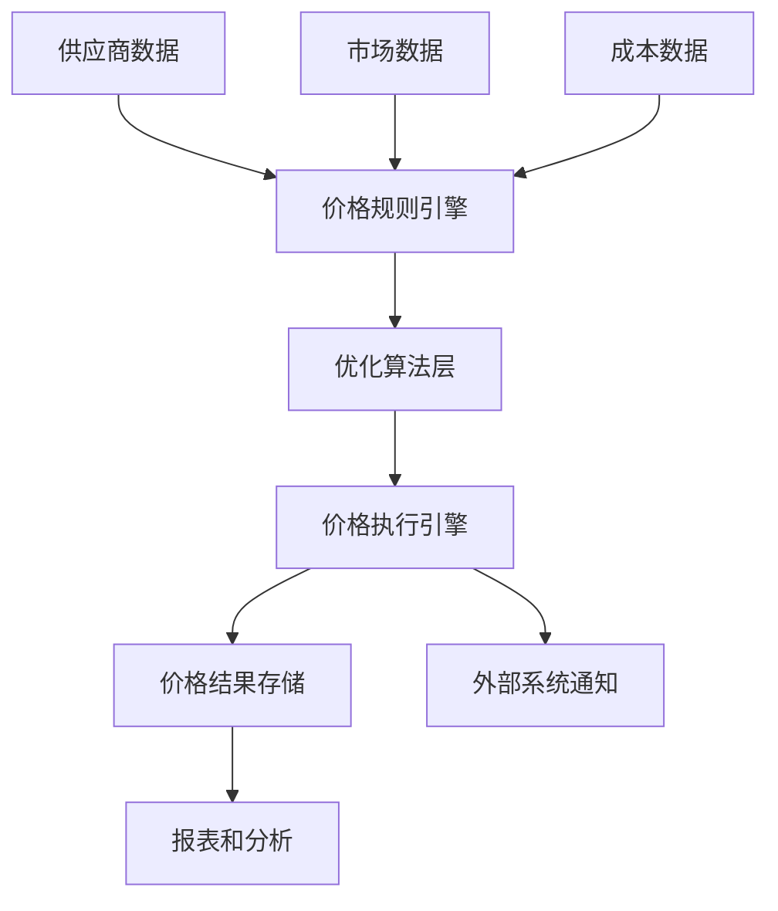

# 价格策略模块技术架构评审报告

## 1. 评审概述

### 1.1 评审目标
对ERP系统中价格策略模块的技术架构进行全面评审，确保价格策略智能配置与优化引擎的架构设计合理、可扩展、性能达标，符合业务需求和技术标准。

### 1.2 评审基本信息
- **评审日期**：2026年5月1日
- **评审类型**：技术架构评审
- **评审级别**：模块级技术架构
- **涉及模块**：价格策略智能配置引擎、优化算法模块、规则引擎、执行引擎

### 1.3 参与评审人员
| 角色 | 人员 | 部门/团队 |
|------|------|----------|
| 技术架构师 | 技术架构负责人 | 技术架构组 |
| 开发负责人 | 开发团队负责人 | 后端开发组 |
| 产品经理 | 产品负责人 | 产品管理组 |
| 资深开发 | 核心开发人员 | 价格策略模块组 |
| QA负责人 | 质量保证负责人 | QA组 |
| **总计** | **5人** | |

## 2. 架构设计评估

### 2.1 价格策略引擎架构设计

#### 2.1.1 架构组成分析
1. **规则引擎层**
   - 负责价格规则的解析、验证和执行
   - 支持动态规则配置和实时生效
   - 规则优先级和冲突解决机制

2. **优化算法层**
   - 价格优化算法的实现和调度
   - 支持多种优化策略（成本导向、市场导向、利润导向）
   - 算法性能监控和调优

3. **执行引擎层**
   - 价格计算的执行和结果验证
   - 并发处理和性能优化
   - 错误处理和重试机制

#### 2.1.2 架构评估结论
✅ **优点**：
- 分层架构清晰，职责分离明确
- 支持灵活的价格策略配置
- 具备良好的扩展性和可维护性
- 性能设计考虑充分

⚠️ **需改进点**：
- 规则引擎的缓存机制需要优化
- 算法层需要支持更多的优化策略
- 执行引擎的并发控制需要增强

### 2.2 模块间接口设计评估

#### 2.2.1 主要接口分析
| 接口方向 | 接口类型 | 协议 | 数据格式 | 评估状态 |
|----------|----------|------|----------|----------|
| 价格策略 → 批次管理 | REST API | HTTP/HTTPS | JSON | ✅ 通过 |
| 价格策略 → 供应商管理 | REST API | HTTP/HTTPS | JSON | ✅ 通过 |
| 价格策略 → 协同流程 | WebSocket | WS/WSS | JSON | ⚠️ 需优化 |
| 外部系统 → 价格策略 | REST API | HTTP/HTTPS | JSON | ✅ 通过 |

#### 2.2.2 接口设计建议
1. **实时通信优化**：
   - WebSocket连接需要增加心跳机制
   - 考虑添加连接池管理
   - 实现断线重连和消息重发机制

2. **数据一致性保障**：
   - 增加分布式事务支持
   - 实现幂等性设计
   - 添加数据校验和验证机制

### 2.3 数据流规划评估

#### 2.3.1 数据流设计

#### 2.3.2 数据流评估结论
✅ **设计合理**：
- 数据流向清晰，处理流程明确
- 支持实时数据处理和批量处理
- 具备数据质量检查和异常处理

⚠️ **改进建议**：
- 增加数据血缘追踪功能
- 优化大流量数据的处理性能
- 加强数据安全性和隐私保护

## 3. 技术选型评估

### 3.1 技术栈选型对比分析

#### 3.1.1 Java/Spring Boot vs Python/FastAPI
| 评估维度 | Java/Spring Boot | Python/FastAPI | 建议选择 |
|----------|------------------|----------------|----------|
| 性能表现 | 高性能，适合高并发 | 良好性能，适合快速开发 | **Java/Spring Boot** |
| 生态成熟度 | 生态成熟，工具丰富 | 生态丰富，但不如Java | **Java/Spring Boot** |
| 开发效率 | 开发周期较长 | 开发快速，适合迭代 | Python/FastAPI |
| 团队技能 | 团队熟悉Java技术栈 | 需要学习Python框架 | **Java/Spring Boot** |
| 微服务支持 | Spring Cloud成熟 | FastAPI+相关组件 | **Java/Spring Boot** |
| **综合评分** | **9/10** | **7/10** | **Java/Spring Boot** |

#### 3.1.2 规则引擎选型对比
| 评估维度 | Drools | Easy Rules | 建议选择 |
|----------|--------|------------|----------|
| 功能完整性 | 功能强大，支持复杂规则 | 简单轻量，适合基础规则 | **Drools** |
| 学习曲线 | 学习成本较高 | 学习成本低，上手快 | Easy Rules |
| 性能表现 | 高性能，优化良好 | 性能良好 | **Drools** |
| 社区支持 | 社区活跃，文档丰富 | 社区较小，文档一般 | **Drools** |
| 集成难度 | 集成复杂，配置较多 | 集成简单，配置少 | Easy Rules |
| **综合评分** | **8.5/10** | **6.5/10** | **Drools** |

#### 3.1.3 优化算法库选型对比
| 评估维度 | OptaPlanner | scikit-opt | 建议选择 |
|----------|-------------|------------|----------|
| 算法丰富度 | 专注于优化算法 | 优化算法较全面 | **OptaPlanner** |
| 商业应用 | 企业级应用支持 | 学术研究为主 | **OptaPlanner** |
| 性能表现 | 高性能，支持分布式 | 性能良好 | **OptaPlanner** |
| 集成难度 | 集成较复杂 | 集成简单 | scikit-opt |
| 许可协议 | 开源许可 | 开源许可 | 平局 |
| **综合评分** | **9/10** | **7/10** | **OptaPlanner** |

### 3.2 数据库和缓存技术选型

#### 3.2.1 主数据库选型
**建议选择：PostgreSQL 15+**
- 支持JSONB数据类型，适合存储价格规则配置
- ACID事务保障，数据一致性强
- 性能优秀，支持复杂查询
- 开源免费，社区活跃

#### 3.2.2 缓存技术选型
**建议选择：Redis 7+**
- 高性能内存缓存
- 支持多种数据结构
- 支持持久化和集群
- 社区生态完善

#### 3.2.3 消息队列选型
**建议选择：RabbitMQ 3.12+**
- 成熟稳定，企业级应用验证
- 支持多种消息模式
- 管理界面完善
- 社区支持良好

## 4. 性能优化和扩展性设计

### 4.1 性能优化策略
1. **缓存策略优化**：
   - 多级缓存设计（内存缓存+分布式缓存）
   - 缓存预热和更新机制
   - 缓存失效策略优化

2. **并发处理优化**：
   - 线程池优化配置
   - 异步处理机制
   - 限流和熔断机制

3. **数据库优化**：
   - 索引优化设计
   - 查询优化策略
   - 分库分表规划

### 4.2 扩展性设计
1. **水平扩展能力**：
   - 无状态服务设计
   - 负载均衡支持
   - 服务发现机制

2. **垂直扩展能力**：
   - 模块化设计
   - 微服务架构
   - 容器化部署

## 5. 安全架构设计评估

### 5.1 安全控制机制
1. **身份认证和授权**：
   - JWT Token认证
   - RBAC权限控制
   - API访问控制

2. **数据安全**：
   - 数据加密存储
   - 数据传输加密（TLS）
   - 敏感信息脱敏

3. **审计和监控**：
   - 操作日志记录
   - 安全事件监控
   - 异常行为检测

### 5.2 安全建议
✅ **已实现的安全措施**：
- API访问权限控制
- 数据传输加密
- 用户身份验证

⚠️ **需补充的安全措施**：
- 增加API限流和防重放攻击
- 实现敏感数据访问审计
- 定期安全扫描和漏洞修复

## 6. 评审结论和建议

### 6.1 总体评估结论
**技术架构评审通过** ✅

价格策略模块的技术架构设计基本合理，能够满足业务需求和技术要求。架构设计考虑了性能、扩展性、安全性等多个维度，技术选型方案科学合理。

### 6.2 主要优势
1. **架构设计合理**：分层清晰，职责明确
2. **技术选型科学**：基于团队能力和业务需求
3. **性能考虑充分**：设计了多种优化策略
4. **扩展性良好**：支持水平和垂直扩展

### 6.3 改进建议
1. **短期改进（2周内）**：
   - 优化规则引擎的缓存机制
   - 增强WebSocket连接的稳定性
   - 完善API限流和防护机制

2. **中期改进（1个月内）**：
   - 实现分布式事务支持
   - 优化大数据量处理性能
   - 加强安全审计功能

3. **长期改进（3个月内）**：
   - 探索AI算法在价格优化中的应用
   - 构建智能价格预测模型
   - 实现自动化价格策略调整

### 6.4 风险评估
| 风险类型 | 风险描述 | 影响程度 | 可能性 | 应对措施 |
|----------|----------|----------|--------|----------|
| 性能风险 | 高并发场景下性能下降 | 高 | 中 | 优化缓存，增加集群 |
| 安全风险 | API接口安全漏洞 | 高 | 低 | 加强安全测试，定期扫描 |
| 技术风险 | 新技术学习成本高 | 中 | 中 | 安排培训，渐进式引入 |
| 团队风险 | 关键人员流失 | 中 | 低 | 知识共享，文档完善 |

### 6.5 下一步行动
1. **立即执行**：
   - 根据评审意见优化架构设计
   - 制定详细的技术实施计划
   - 安排团队技术培训

2. **近期跟进**：
   - 跟踪技术选型落地情况
   - 监控架构实施进度
   - 定期进行架构回顾

3. **长期规划**：
   - 建立架构演进机制
   - 持续优化性能和安全
   - 探索技术创新方向

## 7. 附件

### 7.1 评审会议记录
- 会议时间：2026年5月1日 09:00-11:30
- 会议地点：线上会议
- 参会人员：技术架构师、开发负责人、产品经理、资深开发、QA负责人
- 会议纪要：已存档至项目文档库

### 7.2 相关文档
1. 价格策略模块需求文档
2. 技术架构设计文档
3. 性能测试报告
4. 安全评估报告

### 7.3 评审通过签字
| 角色 | 姓名 | 签字 | 日期 |
|------|------|------|------|
| 技术架构师 | | | 2026年5月1日 |
| 开发负责人 | | | 2026年5月1日 |
| 产品经理 | | | 2026年5月1日 |
| QA负责人 | | | 2026年5月1日 |

---
**报告生成时间**：2026年5月1日  
**报告版本**：v1.0  
**报告状态**：正式发布