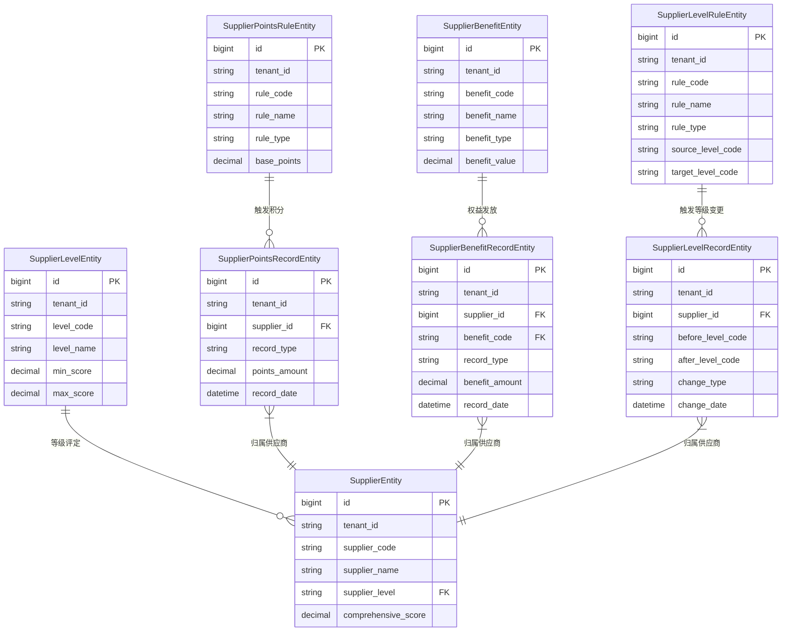

# 合作商等级管理数据模型设计文档

## 1. 概述

### 1.1 设计目标
为AI-Ready ERP系统中的合作商等级管理模块设计完整的数据模型，支持等级分类、积分管理、权益体系等核心功能，实现合作商的精细化管理和激励。

### 1.2 设计原则
1. **可扩展性**：支持灵活的等级定义和规则配置
2. **可配置性**：所有规则和参数均可通过配置调整
3. **可追溯性**：完整的积分记录和等级变更历史
4. **多租户支持**：支持多企业独立数据隔离
5. **高性能**：优化查询性能，支持大数据量

### 1.3 核心功能模块
1. **等级分类管理**：等级定义、等级评估、等级升降级
2. **积分管理**：积分累计、积分消耗、积分有效期管理
3. **权益体系**：权益定义、权益发放、权益使用
4. **规则引擎**：积分规则、升降级规则、权益规则

## 2. 实体关系图



## 3. 核心实体详细设计

### 3.1 等级定义实体 (SupplierLevelEntity)
**作用**：定义合作商等级体系，包括等级名称、分数范围、权益数量等。

**关键字段**：
- `level_code`：等级编码，唯一标识
- `level_name`：等级名称（如：钻石级、白金级、黄金级、白银级）
- `min_score`：最低分数要求
- `max_score`：最高分数限制
- `benefit_count`：该等级对应的权益数量
- `max_discount_rate`：最大折扣率
- `priority_level`：优先级（用于排序和显示）

### 3.2 积分累计规则实体 (SupplierPointsRuleEntity)
**作用**：定义积分累计规则，支持多种计算方式和触发条件。

**关键字段**：
- `rule_code`：规则编码，唯一标识
- `rule_type`：规则类型（ORDER-订单相关，QUALITY-质量相关等）
- `calculation_method`：计算方式（FIXED-固定值，PERCENTAGE-百分比）
- `base_points`：基础积分值
- `trigger_condition_type`：触发条件类型（AMOUNT-金额，QUANTITY-数量等）
- `trigger_condition_value`：触发条件值
- `daily_limit`：每日上限，防止积分滥用

### 3.3 积分累计记录实体 (SupplierPointsRecordEntity)
**作用**：记录每次积分累计的详细信息，支持完整的历史追溯。

**关键字段**：
- `supplier_id`：供应商ID，关联供应商主表
- `record_type`：记录类型（ACCUMULATION-累计，CONSUMPTION-消耗）
- `points_amount`：积分数量（正数表示累计，负数表示消耗）
- `related_business_type`：关联业务类型
- `related_business_id`：关联业务ID
- `expire_time`：过期时间，支持积分有效期管理

### 3.4 权益定义实体 (SupplierBenefitEntity)
**作用**：定义合作商可获得的权益，支持多种权益类型和条件限制。

**关键字段**：
- `benefit_code`：权益编码，唯一标识
- `benefit_type`：权益类型（DISCOUNT-折扣，PRIORITY-优先权等）
- `benefit_value`：权益值（如折扣率、金额等）
- `applicable_level_codes`：适用等级编码列表
- `usage_limit_type`：使用上限类型（DAILY-每日，MONTHLY-每月等）
- `usage_limit_value`：使用上限值
- `exchange_points`：兑换所需积分

### 3.5 权益使用记录实体 (SupplierBenefitRecordEntity)
**作用**：记录权益的发放、使用、兑换等操作历史。

**关键字段**：
- `supplier_id`：供应商ID
- `benefit_code`：权益编码，关联权益定义
- `record_type`：记录类型（ISSUE-发放，USE-使用，EXCHANGE-兑换）
- `benefit_amount`：权益数量
- `current_balance`：当前权益余额
- `exchange_points`：兑换消耗积分

### 3.6 等级升降级规则实体 (SupplierLevelRuleEntity)
**作用**：定义等级升降级的条件和规则。

**关键字段**：
- `rule_code`：规则编码，唯一标识
- `rule_type`：规则类型（UPGRADE-升级，DOWNGRADE-降级）
- `source_level_code`：源等级编码
- `target_level_code`：目标等级编码
- `evaluation_dimension`：评估维度（SCORE-综合评分，POINTS-累计积分）
- `threshold_value`：阈值
- `duration_type`：持续时间类型（DAYS-天数，MONTHS-月数）
- `duration_value`：持续时间值

### 3.7 等级变更记录实体 (SupplierLevelRecordEntity)
**作用**：记录等级变更的完整历史，包括变更前后的等级信息。

**关键字段**：
- `supplier_id`：供应商ID
- `before_level_code`：变更前等级编码
- `after_level_code`：变更后等级编码
- `change_type`：变更类型（UPGRADE-升级，DOWNGRADE-降级等）
- `change_reason`：变更原因
- `comprehensive_score`：变更时的综合评分
- `total_points`：变更时的累计积分

## 4. 数据库表结构

### 4.1 等级定义表 (erp_supplier_level)
```sql
CREATE TABLE erp_supplier_level (
    id BIGINT PRIMARY KEY AUTO_INCREMENT,
    tenant_id VARCHAR(50) NOT NULL,
    level_code VARCHAR(20) NOT NULL UNIQUE,
    level_name VARCHAR(50) NOT NULL,
    level_description VARCHAR(500),
    min_score DECIMAL(10,2) NOT NULL,
    max_score DECIMAL(10,2) NOT NULL,
    evaluation_period VARCHAR(20),
    benefit_count INT,
    max_discount_rate DECIMAL(5,2),
    priority_level INT,
    is_active BOOLEAN DEFAULT true,
    sort_order INT,
    created_by VARCHAR(50),
    created_time DATETIME DEFAULT CURRENT_TIMESTAMP,
    updated_by VARCHAR(50),
    updated_time DATETIME DEFAULT CURRENT_TIMESTAMP ON UPDATE CURRENT_TIMESTAMP,
    version INT DEFAULT 0,
    deleted INT DEFAULT 0,
    extend_info TEXT,
    INDEX idx_tenant_id (tenant_id),
    INDEX idx_level_code (level_code),
    INDEX idx_score_range (min_score, max_score)
);
```

### 4.2 积分累计规则表 (erp_supplier_points_rule)
```sql
CREATE TABLE erp_supplier_points_rule (
    id BIGINT PRIMARY KEY AUTO_INCREMENT,
    tenant_id VARCHAR(50) NOT NULL,
    rule_code VARCHAR(50) NOT NULL UNIQUE,
    rule_name VARCHAR(100) NOT NULL,
    rule_type VARCHAR(20) NOT NULL,
    calculation_method VARCHAR(20) NOT NULL,
    base_points DECIMAL(10,2) NOT NULL,
    trigger_condition_type VARCHAR(20),
    trigger_condition_value DECIMAL(10,2),
    applicable_level_type VARCHAR(20),
    applicable_level_codes VARCHAR(500),
    effective_start_time DATETIME,
    effective_end_time DATETIME,
    daily_limit DECIMAL(10,2),
    monthly_limit DECIMAL(10,2),
    yearly_limit DECIMAL(10,2),
    is_active BOOLEAN DEFAULT true,
    priority INT,
    created_by VARCHAR(50),
    created_time DATETIME DEFAULT CURRENT_TIMESTAMP,
    updated_by VARCHAR(50),
    updated_time DATETIME DEFAULT CURRENT_TIMESTAMP ON UPDATE CURRENT_TIMESTAMP,
    version INT DEFAULT 0,
    deleted INT DEFAULT 0,
    extend_info TEXT,
    INDEX idx_tenant_id (tenant_id),
    INDEX idx_rule_code (rule_code),
    INDEX idx_rule_type (rule_type)
);
```

### 4.3 积分累计记录表 (erp_supplier_points_record)
```sql
CREATE TABLE erp_supplier_points_record (
    id BIGINT PRIMARY KEY AUTO_INCREMENT,
    tenant_id VARCHAR(50) NOT NULL,
    supplier_id BIGINT NOT NULL,
    supplier_code VARCHAR(50) NOT NULL,
    rule_code VARCHAR(50) NOT NULL,
    record_type VARCHAR(20) NOT NULL,
    points_amount DECIMAL(10,2) NOT NULL,
    record_description VARCHAR(500),
    related_business_type VARCHAR(20),
    related_business_id VARCHAR(50),
    business_time DATETIME,
    record_date DATETIME NOT NULL,
    effective_time DATETIME,
    expire_time DATETIME,
    current_balance DECIMAL(10,2) NOT NULL,
    operator_id VARCHAR(50),
    operator_name VARCHAR(50),
    approval_status VARCHAR(20),
    approver_id VARCHAR(50),
    approver_name VARCHAR(50),
    approval_time DATETIME,
    approval_comment VARCHAR(500),
    created_by VARCHAR(50),
    created_time DATETIME DEFAULT CURRENT_TIMESTAMP,
    updated_by VARCHAR(50),
    updated_time DATETIME DEFAULT CURRENT_TIMESTAMP ON UPDATE CURRENT_TIMESTAMP,
    version INT DEFAULT 0,
    deleted INT DEFAULT 0,
    extend_info TEXT,
    INDEX idx_tenant_id (tenant_id),
    INDEX idx_supplier_id (supplier_id),
    INDEX idx_rule_code (rule_code),
    INDEX idx_record_date (record_date),
    INDEX idx_expire_time (expire_time)
);
```

## 5. 业务规则示例

### 5.1 积分累计规则示例
1. **订单金额积分**：每100元订单金额获得1积分
2. **按时交付奖励**：每次按时交付获得10积分
3. **质量优秀奖励**：质量评分≥95分获得20积分
4. **服务响应奖励**：24小时内响应问题获得5积分

### 5.2 等级升降级规则示例
1. **升级规则**：综合评分≥85分，且连续3个月满足条件，自动升级
2. **降级规则**：综合评分＜60分，且连续2个月满足条件，自动降级
3. **特殊升级**：年度累计积分≥1000分，可直接升级

### 5.3 权益体系示例
1. **折扣权益**：钻石级享受95折，白金级享受98折
2. **优先权权益**：黄金级以上享受订单优先处理
3. **资源权益**：白金级以上享受专属客户经理
4. **服务权益**：钻石级享受7x24小时技术支持

## 6. 系统集成设计

### 6.1 与供应商模块集成
- 扩展`SupplierEntity`实体，增加`supplier_level`字段
- 在供应商绩效评估时自动更新积分和等级
- 在供应商门户展示等级和权益信息

### 6.2 与订单模块集成
- 订单完成时触发积分累计规则
- 订单支付时检查折扣权益
- 订单处理时考虑优先权权益

### 6.3 与绩效评估模块集成
- 绩效评估结果作为等级升降级的依据
- 绩效评分自动转换为积分
- 定期评估触发等级变更

## 7. 性能优化建议

### 7.1 索引策略
1. 为所有查询频率高的字段建立索引
2. 使用复合索引优化范围查询
3. 定期分析和优化索引

### 7.2 分区策略
1. 按`tenant_id`进行水平分区
2. 历史数据按时间分区归档
3. 热点数据单独存储

### 7.3 缓存策略
1. 等级定义和规则配置缓存到Redis
2. 供应商当前等级和积分余额缓存
3. 权益使用限额缓存

## 8. 数据迁移方案

### 8.1 初始化数据
1. 创建默认等级定义（钻石级、白金级、黄金级、白银级、普通级）
2. 配置基础积分规则
3. 设置基本权益体系

### 8.2 历史数据处理
1. 根据历史绩效数据计算初始等级
2. 根据历史订单数据补充分积分记录
3. 建立初始权益发放记录

## 9. 监控和运维

### 9.1 监控指标
1. 积分累计和消耗趋势
2. 等级变更频率和分布
3. 权益使用情况和效果
4. 规则触发频率和效果

### 9.2 运维任务
1. 定期清理过期积分记录
2. 定期归档历史变更记录
3. 监控规则配置的有效性
4. 优化数据库性能

---

**文档版本**: 1.0.0  
**创建时间**: 2026-04-29  
**更新记录**:  
- 1.0.0 (2026-04-29): 初始版本，完成基础数据模型设计