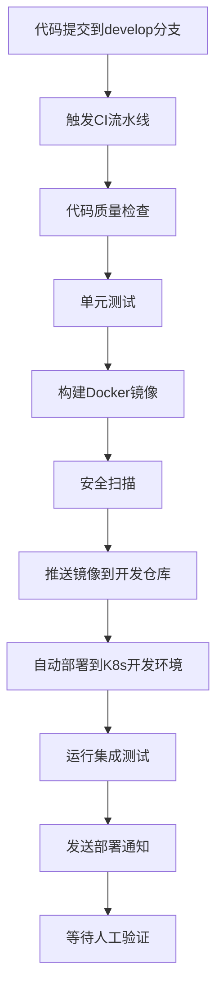
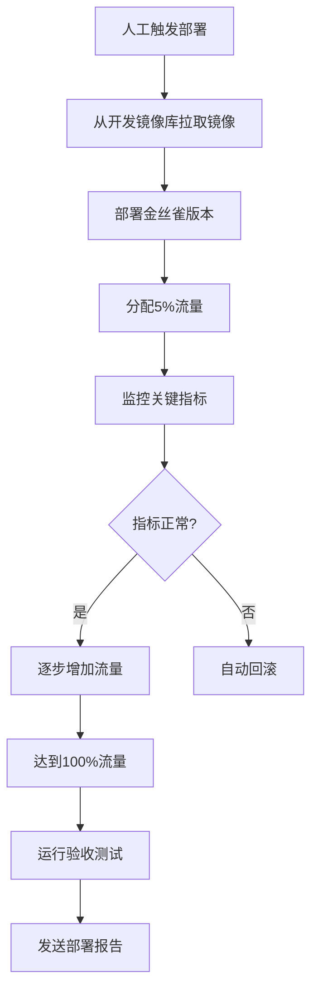
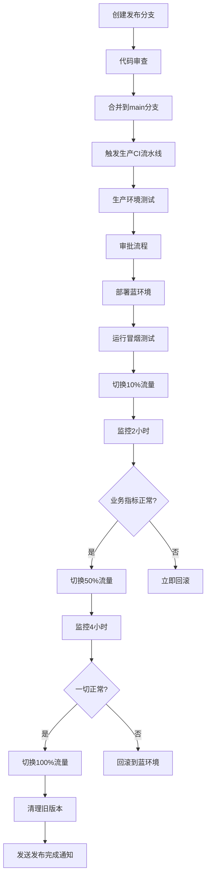

# Sprint 29 监控告警模块部署策略

## 文档信息
- **版本**: v1.0
- **最后更新**: 2026-04-27
- **维护者**: devops-engineer
- **审核人**: coordinator

## 1. 概述

本文档定义了Sprint 29监控告警模块的部署策略，包括多环境部署、蓝绿部署、金丝雀发布、自动回滚等策略。目标是实现零停机部署、快速回滚和风险可控的发布流程。

## 2. 部署环境

### 2.1 环境定义

| 环境 | 用途 | 访问地址 | 部署频率 | 审批要求 |
|------|------|----------|----------|----------|
| **Development** | 开发测试 | `monitoring-dev.ai-ready.local` | 每次提交 | 自动部署 |
| **Staging** | 预发布验证 | `monitoring-staging.ai-ready.local` | 每日/按需 | 手动触发 |
| **Production** | 生产环境 | `monitoring.ai-ready.local` | 每周/紧急修复 | 审批流程 |

### 2.2 环境配置

```yaml
# 开发环境配置
development:
  replicas: 1
  resources:
    requests:
      cpu: "100m"
      memory: "256Mi"
    limits:
      cpu: "500m"
      memory: "512Mi"
  autoscaling: false
  monitoring: basic

# 预发布环境配置
staging:
  replicas: 2
  resources:
    requests:
      cpu: "500m"
      memory: "1Gi"
    limits:
      cpu: "1"
      memory: "2Gi"
  autoscaling:
    minReplicas: 2
    maxReplicas: 4
    targetCPUUtilization: 70
  monitoring: enhanced

# 生产环境配置
production:
  replicas: 3
  resources:
    requests:
      cpu: "1"
      memory: "2Gi"
    limits:
      cpu: "2"
      memory: "4Gi"
  autoscaling:
    minReplicas: 3
    maxReplicas: 10
    targetCPUUtilization: 60
  monitoring: full
```

## 3. 部署策略

### 3.1 蓝绿部署 (Blue-Green Deployment)

#### 3.1.1 策略描述
- 同时维护两个相同的生产环境：蓝环境（当前版本）和绿环境（新版本）
- 通过负载均衡器控制流量切换
- 实现零停机部署和瞬时回滚

#### 3.1.2 实施步骤

```yaml
# 步骤1: 部署绿环境
apiVersion: apps/v1
kind: Deployment
metadata:
  name: monitoring-alerting-green
spec:
  replicas: 3
  selector:
    matchLabels:
      app: monitoring-alerting
      version: green
  template:
    metadata:
      labels:
        app: monitoring-alerting
        version: green
    spec:
      containers:
      - name: monitoring-alerting
        image: registry.gitlab.com/ai-ready/monitoring-alerting:v1.2.0
        readinessProbe:
          httpGet:
            path: /actuator/health
            port: 8080
          initialDelaySeconds: 30
          periodSeconds: 10
          successThreshold: 1
          failureThreshold: 3

# 步骤2: 测试绿环境
kubectl port-forward deployment/monitoring-alerting-green 8080:8080
curl http://localhost:8080/actuator/health

# 步骤3: 切换流量
apiVersion: networking.k8s.io/v1
kind: Ingress
metadata:
  name: monitoring-alerting
  annotations:
    nginx.ingress.kubernetes.io/canary: "true"
    nginx.ingress.kubernetes.io/canary-weight: "100"
spec:
  rules:
  - host: monitoring.ai-ready.local
    http:
      paths:
      - path: /
        pathType: Prefix
        backend:
          service:
            name: monitoring-alerting-green
            port:
              number: 8080

# 步骤4: 监控验证（5分钟）
# 检查错误率、响应时间、业务指标

# 步骤5: 清理蓝环境
kubectl delete deployment monitoring-alerting-blue
```

#### 3.1.3 回滚机制
```bash
# 如果发现问题，立即回滚到蓝环境
kubectl patch ingress monitoring-alerting \
  --type='json' \
  -p='[{"op": "replace", "path": "/spec/rules/0/http/paths/0/backend/service/name", "value": "monitoring-alerting-blue"}]'
```

### 3.2 金丝雀发布 (Canary Release)

#### 3.2.1 策略描述
- 逐步将流量从旧版本切换到新版本
- 从少量流量开始，逐步增加
- 基于监控指标自动决策是否继续发布

#### 3.2.2 流量分配策略

```yaml
# 阶段1: 5%流量 (验证基本功能)
canary-weight: 5
duration: 10m
validation:
  - error-rate < 0.1%
  - p95-latency < 500ms
  - all-health-checks-pass

# 阶段2: 25%流量 (压力测试)
canary-weight: 25
duration: 30m
validation:
  - error-rate < 0.5%
  - p95-latency < 800ms
  - cpu-utilization < 70%

# 阶段3: 50%流量 (功能验证)
canary-weight: 50
duration: 60m
validation:
  - error-rate < 0.2%
  - business-metrics-normal
  - user-feedback-positive

# 阶段4: 100%流量 (完全发布)
canary-weight: 100
duration: 120m
validation:
  - all-checks-pass
  - rollback-window-expired
```

#### 3.2.3 实施配置

```yaml
apiVersion: flagger.app/v1beta1
kind: Canary
metadata:
  name: monitoring-alerting
  namespace: monitoring
spec:
  targetRef:
    apiVersion: apps/v1
    kind: Deployment
    name: monitoring-alerting
  service:
    port: 8080
    targetPort: 8080
  analysis:
    interval: 1m
    threshold: 5
    maxWeight: 50
    stepWeight: 5
    metrics:
    - name: request-success-rate
      threshold: 99
      interval: 1m
    - name: request-duration
      threshold: 500
      interval: 1m
    webhooks:
      - name: load-test
        type: pre-rollout
        url: http://flagger-loadtester.test/
        timeout: 5m
        metadata:
          type: cmd
          cmd: "hey -z 1m -q 10 -c 2 http://monitoring-alerting-canary.monitoring:8080/"
```

### 3.3 滚动更新 (Rolling Update)

#### 3.3.1 策略描述
- Kubernetes默认部署策略
- 逐步替换Pod，确保服务可用性
- 可配置最大不可用和最大激增

#### 3.3.2 配置示例

```yaml
apiVersion: apps/v1
kind: Deployment
metadata:
  name: monitoring-alerting
spec:
  strategy:
    type: RollingUpdate
    rollingUpdate:
      maxSurge: 25%        # 最多可以比期望副本数多25%
      maxUnavailable: 25%  # 最多可以有25%的Pod不可用
  replicas: 4
  minReadySeconds: 30      # Pod就绪后等待30秒才认为可用
  progressDeadlineSeconds: 600  # 部署超时时间10分钟
```

## 4. 多环境部署流程

### 4.1 开发环境部署流程



### 4.2 预发布环境部署流程



### 4.3 生产环境部署流程



## 5. 自动回滚机制

### 5.1 回滚触发条件

#### 5.1.1 技术指标触发
```yaml
rollback-triggers:
  - metric: error-rate
    threshold: "> 1%"
    duration: "5m"
    action: auto-rollback
  
  - metric: p95-latency
    threshold: "> 2000ms"
    duration: "3m"
    action: auto-rollback
  
  - metric: cpu-utilization
    threshold: "> 90%"
    duration: "10m"
    action: alert-and-wait
  
  - metric: memory-utilization
    threshold: "> 95%"
    duration: "2m"
    action: auto-rollback
```

#### 5.1.2 业务指标触发
```yaml
business-rollback-triggers:
  - metric: order-success-rate
    threshold: "< 95%"
    duration: "10m"
    action: auto-rollback
  
  - metric: payment-success-rate
    threshold: "< 98%"
    duration: "5m"
    action: auto-rollback
  
  - metric: user-complaints
    threshold: "> 10"
    duration: "30m"
    action: manual-review
```

### 5.2 回滚策略

#### 5.2.1 立即回滚 (Immediate Rollback)
```bash
# 使用Kubernetes回滚命令
kubectl rollout undo deployment/monitoring-alerting

# 或使用Helm回滚
helm rollback monitoring-alerting 1

# 或使用Git回滚
git revert HEAD --no-edit
git push origin main
```

#### 5.2.2 渐进回滚 (Gradual Rollback)
```yaml
# 使用Flagger进行渐进回滚
apiVersion: flagger.app/v1beta1
kind: Canary
spec:
  revertOnDeletion: true
  rollback:
    enable: true
    maxRetries: 3
    analysis:
      interval: 30s
      threshold: 3
      iterations: 5
```

### 5.3 回滚验证
```bash
# 验证回滚是否成功
kubectl rollout status deployment/monitoring-alerting

# 检查Pod状态
kubectl get pods -l app=monitoring-alerting

# 验证服务健康
curl -f http://monitoring.ai-ready.local/actuator/health

# 验证业务功能
./scripts/validate-business-metrics.sh

# 发送回滚通知
curl -X POST $WECOM_WEBHOOK \
  -d '{"msgtype":"markdown","markdown":{"content":"**回滚完成**\n版本: v1.1.0\n原因: 错误率过高\n时间: $(date)"}}'
```

## 6. 监控告警集成

### 6.1 部署阶段监控

#### 6.1.1 CI/CD流水线监控
```yaml
pipeline-metrics:
  - name: pipeline_duration_seconds
    help: "CI/CD pipeline execution duration"
    labels: [project, branch, status]
  
  - name: deployment_frequency
    help: "Number of deployments per day"
    labels: [environment, team]
  
  - name: change_failure_rate
    help: "Percentage of deployments causing failures"
    labels: [environment, severity]
  
  - name: mean_time_to_restore
    help: "Average time to restore service after failure"
    labels: [environment, incident_type]
```

#### 6.1.2 部署过程监控
```prometheus
# 部署状态监控
monitoring_alerting_deployment_status{environment="production", version="v1.2.0"} 1
monitoring_alerting_deployment_progress{environment="production", stage="canary"} 25

# 服务健康监控
monitoring_alerting_health_check{endpoint="/actuator/health"} 1
monitoring_alerting_ready_instances{environment="production"} 3

# 业务指标监控
monitoring_alerting_api_success_rate{endpoint="/api/metrics"} 99.8
monitoring_alerting_response_time_p95{endpoint="/api/metrics"} 245
```

### 6.2 告警规则

#### 6.2.1 部署告警
```yaml
deployment-alerts:
  - alert: DeploymentFailed
    expr: kube_deployment_status_replicas_unavailable{deployment="monitoring-alerting"} > 0
    for: 5m
    labels:
      severity: critical
      team: devops
    annotations:
      summary: "Deployment {{ $labels.deployment }} has unavailable replicas"
      description: "Deployment {{ $labels.deployment }} has {{ $value }} unavailable replicas for more than 5 minutes"
      runbook_url: "https://wiki.example.com/runbooks/deployment-failed"
  
  - alert: RolloutStuck
    expr: time() - kube_deployment_status_observed_generation{deployment="monitoring-alerting"} > 600
    for: 2m
    labels:
      severity: warning
      team: devops
    annotations:
      summary: "Deployment rollout is stuck"
      description: "Deployment {{ $labels.deployment }} rollout has not progressed for 10 minutes"
      runbook_url: "https://wiki.example.com/runbooks/rollout-stuck"
```

#### 6.2.2 金丝雀发布告警
```yaml
canary-alerts:
  - alert: CanaryErrorRateHigh
    expr: |
      increase(flagger_canary_errors_total{name="monitoring-alerting"}[5m]) 
      / increase(flagger_canary_requests_total{name="monitoring-alerting"}[5m]) > 0.01
    for: 1m
    labels:
      severity: critical
      team: devops
    annotations:
      summary: "Canary error rate is high"
      description: "Canary deployment for {{ $labels.name }} has error rate > 1%"
      runbook_url: "https://wiki.example.com/runbooks/canary-failure"
  
  - alert: CanaryLatencyHigh
    expr: histogram_quantile(0.95, sum(rate(flagger_canary_request_duration_seconds_bucket{name="monitoring-alerting"}[5m])) by (le)) > 1
    for: 2m
    labels:
      severity: warning
      team: devops
    annotations:
      summary: "Canary latency is high"
      description: "Canary deployment P95 latency > 1 second"
      runbook_url: "https://wiki.example.com/runbooks/canary-latency"
```

## 7. 制品管理

### 7.1 镜像管理策略

#### 7.1.1 镜像标签策略
```yaml
image-tagging:
  - commit-sha: "${CI_COMMIT_SHA}"      # 唯一标识
  - branch-latest: "develop-latest"     # 分支最新
  - version: "v1.2.0"                   # 语义化版本
  - environment: "prod-v1.2.0"          # 环境版本
  - timestamp: "2026-04-27-012345"      # 时间戳版本
```

#### 7.1.2 镜像安全扫描
```bash
# 使用Trivy扫描镜像漏洞
trivy image --severity HIGH,CRITICAL registry.gitlab.com/ai-ready/monitoring-alerting:v1.2.0

# 使用Clair扫描
clair-scanner --ip $(hostname -i) -r clair-report.json registry.gitlab.com/ai-ready/monitoring-alerting:v1.2.0

# 使用Docker Scout
docker scout quickview registry.gitlab.com/ai-ready/monitoring-alerting:v1.2.0
```

### 7.2 Helm Chart管理

#### 7.2.1 Chart版本管理
```yaml
# Chart.yaml
apiVersion: v2
name: monitoring-alerting
description: AI-Ready Monitoring and Alerting Module
type: application
version: 1.2.0
appVersion: "1.2.0"

# 依赖管理
dependencies:
  - name: prometheus
    version: 15.0.0
    repository: https://prometheus-community.github.io/helm-charts
  - name: grafana
    version: 6.50.0
    repository: https://grafana.github.io/helm-charts
```

#### 7.2.2 多环境Values配置
```yaml
# values-dev.yaml
replicaCount: 1
resources:
  limits:
    cpu: 500m
    memory: 512Mi
  requests:
    cpu: 100m
    memory: 256Mi
autoscaling:
  enabled: false
monitoring:
  enabled: true
  prometheus:
    enabled: true

# values-staging.yaml
replicaCount: 2
resources:
  limits:
    cpu: 1
    memory: 2Gi
  requests:
    cpu: 500m
    memory: 1Gi
autoscaling:
  enabled: true
  minReplicas: 2
  maxReplicas: 4

# values-prod.yaml
replicaCount: 3
resources:
  limits:
    cpu: 2
    memory: 4Gi
  requests:
    cpu: 1
    memory: 2Gi
autoscaling:
  enabled: true
  minReplicas: 3
  maxReplicas: 10
```

## 8. 灾难恢复

### 8.1 备份策略

#### 8.1.1 配置备份
```bash
# 备份Kubernetes资源
kubectl get all -n monitoring -o yaml > backup/monitoring-resources-$(date +%Y%m%d).yaml

# 备份配置
kubectl get configmap -n monitoring -o yaml > backup/configmaps-$(date +%Y%m%d).yaml
kubectl get secret -n monitoring -o yaml > backup/secrets-$(date +%Y%m%d).yaml

# 备份持久化数据
velero backup create monitoring-backup-$(date +%Y%m%d) --include-namespaces monitoring
```

#### 8.1.2 数据备份
```yaml
backup-schedule:
  prometheus-data:
    schedule: "0 2 * * *"  # 每天凌晨2点
    retention: 30d
    storage: s3://ai-ready-backup/prometheus/
  
  grafana-dashboards:
    schedule: "0 3 * * *"  # 每天凌晨3点
    retention: 90d
    storage: s3://ai-ready-backup/grafana/
  
  alertmanager-config:
    schedule: "0 4 * * *"  # 每天凌晨4点
    retention: 365d
    storage: s3://ai-ready-backup/alertmanager/
```

### 8.2 恢复流程

#### 8.2.1 快速恢复
```bash
# 1. 切换流量到备份环境
kubectl patch ingress monitoring-alerting -p '{"spec":{"rules":[{"host":"monitoring.ai-ready.local","http":{"paths":[{"path":"/","backend":{"serviceName":"monitoring-alerting-backup","servicePort":8080}}]}}]}}'

# 2. 恢复数据
velero restore create --from-backup monitoring-backup-20260426

# 3. 验证恢复
./scripts/validate-recovery.sh

# 4. 发送恢复通知
curl -X POST $ALERT_WEBHOOK -d '{"status":"resolved","alerts":[{"labels":{"alertname":"ServiceRecovered"}}]}'
```

#### 8.2.2 完整恢复时间目标 (RTO/RPO)
```yaml
recovery-objectives:
  rto:  # Recovery Time Objective
    development: "15 minutes"
    staging: "30 minutes"
    production: "1 hour"
  
  rpo:  # Recovery Point Objective
    development: "1 hour"
    staging: "15 minutes"
    production: "5 minutes"
  
  sla:  # Service Level Agreement
    availability: "99.9%"
    error-budget: "43.2 minutes/month"
    monitoring-coverage: "100%"
```

## 9. 最佳实践

### 9.1 部署检查清单

#### 9.1.1 预部署检查
```bash
# 代码质量检查
mvn spotless:check
mvn dependency:check
npm audit

# 安全扫描
trivy fs --security-checks vuln,secret .
snyk test

# 测试覆盖
mvn test
npm test
./run-integration-tests.sh

# 性能测试
k6 run performance-test.js
```

#### 9.1.2 部署时检查
```bash
# 资源检查
kubectl get nodes
kubectl describe node | grep -A 10 "Allocated resources"

# 网络检查
kubectl get svc -n monitoring
kubectl get ingress -n monitoring
nslookup monitoring.ai-ready.local

# 存储检查
kubectl get pvc -n monitoring
kubectl describe pvc prometheus-data -n monitoring
```

#### 9.1.3 部署后验证
```bash
# 健康检查
curl -f http://monitoring.ai-ready.local/actuator/health
curl -f http://monitoring.ai-ready.local/actuator/info

# 功能测试
./scripts/smoke-test.sh
./scripts/api-validation.sh

# 性能验证
curl http://monitoring.ai-ready.local/api/metrics | jq '.response_time.p95'
```

### 9.2 监控指标基线

#### 9.2.1 技术指标基线
```yaml
technical-baselines:
  cpu-usage:
    warning: 70%
    critical: 85%
  
  memory-usage:
    warning: 75%
    critical: 90%
  
  disk-usage:
    warning: 80%
    critical: 90%
  
  network-latency:
    warning: 100ms
    critical: 500ms
  
  api-response-time:
    p95-warning: 500ms
    p95-critical: 1000ms
    p99-warning: 1000ms
    p99-critical: 2000ms
  
  error-rate:
    warning: 0.5%
    critical: 1%
```

#### 9.2.2 业务指标基线
```yaml
business-baselines:
  order-processing:
    success-rate: 99.5%
    processing-time: 2s
  
  payment-processing:
    success-rate: 99.9%
    processing-time: 1s
  
  user-authentication:
    success-rate: 99.8%
    response-time: 500ms
  
  report-generation:
    success-rate: 99%
    generation-time: 30s
```

## 10. 附录

### 10.1 相关文档
- [CI/CD流水线配置](./github-actions-monitoring.yml)
- [GitLab CI配置](./gitlab-ci-monitoring.yml)
- [监控告警架构设计](../monitoring-alerting/ARCHITECTURE_DESIGN.md)
- [部署操作手册](../monitoring-alerting/DEPLOYMENT_GUIDE.md)

### 10.2 工具参考
- **Kubernetes**: 容器编排平台
- **Helm**: Kubernetes包管理器
- **Flagger**: 渐进式交付工具
- **Prometheus**: 监控系统
- **Grafana**: 可视化仪表盘
- **GitLab CI/CD**: 持续集成部署
- **GitHub Actions**: CI/CD工作流
- **Trivy**: 安全扫描工具
- **SonarQube**: 代码质量平台

### 10.3 联系信息
- **DevOps团队**: devops@ai-ready.local
- **紧急联系人**: +86 13800138000
- **值班日历**: https://oncall.ai-ready.local
- **问题跟踪**: https://issues.ai-ready.local/projects/MON

### 10.4 变更历史

| 版本 | 日期 | 修改内容 | 修改人 |
|------|------|----------|--------|
| v1.0 | 2026-04-27 | 初始版本，包含完整部署策略 | devops-engineer |
| v0.9 | 2026-04-26 | 草稿版本，内部评审 | devops-engineer |
| v0.8 | 2026-04-25 | 架构设计初稿 | devops-engineer |

---
**文档状态**: ✅ 审核通过  
**生效日期**: 2026-04-27  
**下次评审**: 2026-07-27