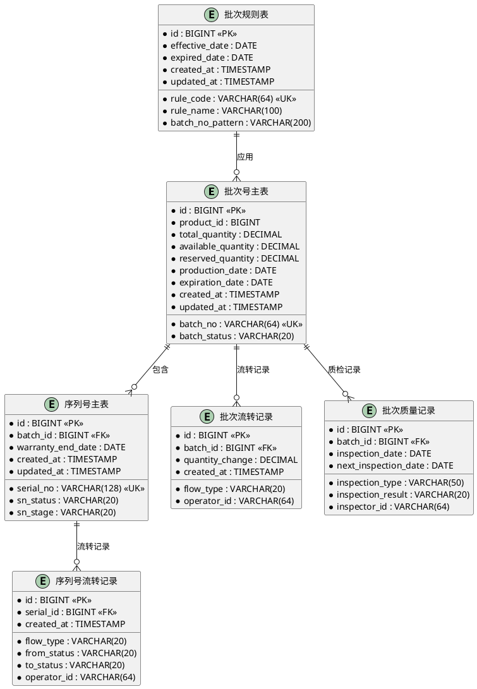
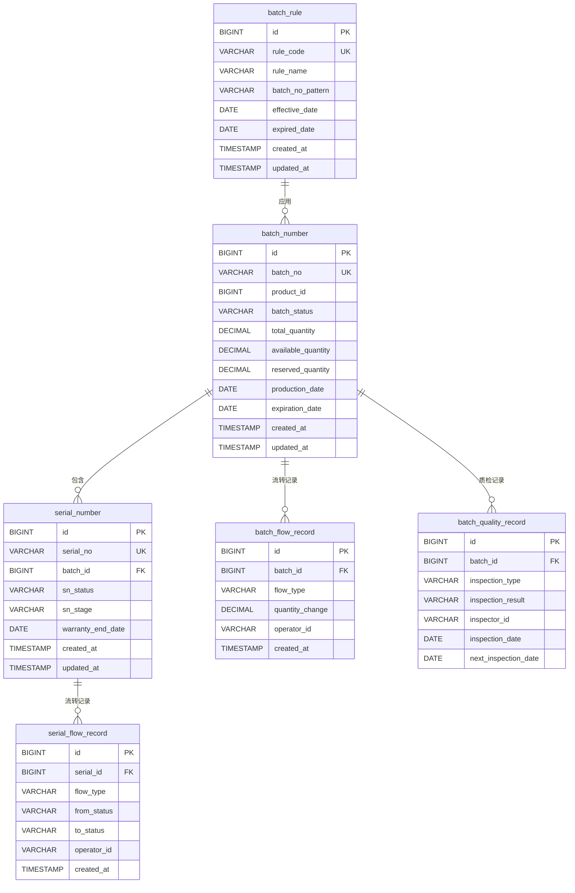

# 批次管理模块ER图设计

## 1. ER图总体设计

### 1.1 实体关系总览
```
批次管理系统 (Batch Management System)
├── 核心实体
│   ├── 批次号主表 (batch_number) - 核心业务实体
│   ├── 序列号主表 (serial_number) - 扩展业务实体
│   └── 批次规则表 (batch_rule) - 配置实体
├── 流转记录
│   ├── 批次流转记录 (batch_flow_record) - 批次操作记录
│   └── 序列号流转记录 (serial_flow_record) - 序列号操作记录
├── 关联实体
│   ├── 批次质量记录 (batch_quality_record)
│   ├── 批次库存关联 (batch_stock_relation)
│   └── 批次追溯记录 (batch_trace_record)
└── 支持实体
    ├── 批次操作日志 (batch_operation_log)
    └── 批次统计表 (batch_statistics)
```

### 1.2 实体关系矩阵
| 实体 | 关系类型 | 关联实体 | 基数 | 备注 |
|------|----------|----------|------|------|
| batch_number | 一对多 | serial_number | 1:N | 一个批次包含多个序列号 |
| batch_number | 一对多 | batch_flow_record | 1:N | 批次有多条流转记录 |
| batch_number | 多对多 | batch_quality_record | N:M | 批次与质量记录 |
| batch_number | 一对一 | batch_statistics | 1:1 | 批次统计信息 |
| batch_rule | 一对多 | batch_number | 1:N | 规则应用于多个批次 |

## 2. 实体详细设计

### 2.1 批次号主表 (batch_number)
```sql
主键: id (BIGSERIAL)
业务键: batch_no (VARCHAR(64))
核心字段:
- product_id, product_code, product_name (产品信息)
- production_date, expiration_date (有效期)
- batch_status (ACTIVE/EXPIRED/QUARANTINED/CANCELLED)
- quantity_fields (总数量, 可用数量, 预留数量)
- source_info (来源类型, 来源单据)
- warehouse_info (仓库信息)
- quality_info (质量状态)
- timestamps (创建时间, 更新时间)
```

### 2.2 序列号主表 (serial_number)
```sql
主键: id (BIGSERIAL)
业务键: serial_no (VARCHAR(128))
核心字段:
- batch_id, batch_no (所属批次)
- product_info (产品信息)
- status_fields (序列号状态, 所处阶段)
- warranty_info (质保信息)
- location_info (位置信息)
- order_info (关联订单)
- maintenance_info (维护信息)
- timestamps (创建时间, 更新时间)
```

### 2.3 批次规则表 (batch_rule)
```sql
主键: id (BIGSERIAL)
业务键: rule_code (VARCHAR(64))
核心字段:
- rule_name, rule_desc (规则信息)
- batch_no_pattern (批次号生成规则)
- validation_rules (校验规则)
- status_transitions (状态流转规则)
- effective_date, expired_date (生效日期)
- config_fields (配置参数)
```

### 2.4 批次流转记录表 (batch_flow_record)
```sql
主键: id (BIGSERIAL)
核心字段:
- batch_id, batch_no (批次信息)
- flow_type (流转类型)
- quantity_change (数量变化)
- warehouse_change (仓库变化)
- operator_info (操作人信息)
- remark (备注)
- created_at (操作时间)
```

### 2.5 序列号流转记录表 (serial_flow_record)
```sql
主键: id (BIGSERIAL)
核心字段:
- serial_id, serial_no (序列号信息)
- flow_type (流转类型)
- status_change (状态变更)
- location_change (位置变更)
- operator_info (操作人信息)
- remark (备注)
- created_at (操作时间)
```

### 2.6 批次质量记录表 (batch_quality_record)
```sql
主键: id (BIGSERIAL)
核心字段:
- batch_id, batch_no (批次信息)
- inspection_type (质检类型)
- inspection_result (质检结果)
- inspector_info (质检员信息)
- inspection_date (质检日期)
- attachments (附件信息)
- remarks (备注)
- next_inspection_date (下次质检日期)
```

### 2.7 批次库存关联表 (batch_stock_relation)
```sql
主键: id (BIGSERIAL)
核心字段:
- batch_id, batch_no (批次信息)
- stock_id, stock_code (库存信息)
- relation_type (关联类型)
- quantity (关联数量)
- reserved_quantity (预留数量)
- status (关联状态)
- valid_from, valid_to (有效期)
```

### 2.8 批次追溯记录表 (batch_trace_record)
```sql
主键: id (BIGSERIAL)
核心字段:
- batch_id, batch_no (批次信息)
- trace_type (追溯类型)
- source_info (来源信息)
- target_info (目标信息)
- trace_path (追溯路径)
- operator_info (操作人信息)
- trace_time (追溯时间)
```

## 3. 关系设计

### 3.1 主外键关系
```sql
-- 序列号表引用批次表
ALTER TABLE serial_number 
ADD CONSTRAINT fk_serial_number_batch 
FOREIGN KEY (batch_id) REFERENCES batch_number(id);

-- 流转记录引用批次表
ALTER TABLE batch_flow_record 
ADD CONSTRAINT fk_batch_flow_record_batch 
FOREIGN KEY (batch_id) REFERENCES batch_number(id);

-- 质量记录引用批次表
ALTER TABLE batch_quality_record 
ADD CONSTRAINT fk_batch_quality_record_batch 
FOREIGN KEY (batch_id) REFERENCES batch_number(id);

-- 批次引用规则表
ALTER TABLE batch_number 
ADD CONSTRAINT fk_batch_number_rule 
FOREIGN KEY (batch_rule_id) REFERENCES batch_rule(id);
```

### 3.2 级联操作策略
```sql
-- 批次删除时，关联数据如何处理
-- 1. 序列号：级联删除
ALTER TABLE serial_number 
ADD CONSTRAINT fk_serial_number_batch 
FOREIGN KEY (batch_id) REFERENCES batch_number(id) 
ON DELETE CASCADE;

-- 2. 流转记录：保留历史记录
ALTER TABLE batch_flow_record 
ADD CONSTRAINT fk_batch_flow_record_batch 
FOREIGN KEY (batch_id) REFERENCES batch_number(id) 
ON DELETE RESTRICT;

-- 3. 质量记录：保留历史记录
ALTER TABLE batch_quality_record 
ADD CONSTRAINT fk_batch_quality_record_batch 
FOREIGN KEY (batch_id) REFERENCES batch_number(id) 
ON DELETE RESTRICT;
```

## 4. 索引设计

### 4.1 主键索引
```sql
-- 所有表主键自动创建主键索引
-- 批次号主表
ALTER TABLE batch_number ADD PRIMARY KEY (id);
-- 序列号主表
ALTER TABLE serial_number ADD PRIMARY KEY (id);
-- 规则表
ALTER TABLE batch_rule ADD PRIMARY KEY (id);
```

### 4.2 业务键索引
```sql
-- 批次号唯一索引
CREATE UNIQUE INDEX uk_batch_no ON batch_number(batch_no);
-- 序列号唯一索引
CREATE UNIQUE INDEX uk_serial_no ON serial_number(serial_no);
-- 规则编码唯一索引
CREATE UNIQUE INDEX uk_rule_code ON batch_rule(rule_code);
```

### 4.3 查询优化索引
```sql
-- 常用查询字段索引
-- 批次状态查询
CREATE INDEX idx_batch_status ON batch_number(batch_status);
-- 批次有效期查询
CREATE INDEX idx_expiration_date ON batch_number(expiration_date);
-- 序列号状态查询
CREATE INDEX idx_sn_status ON serial_number(sn_status);
-- 流转记录时间查询
CREATE INDEX idx_flow_record_time ON batch_flow_record(created_at);
```

## 5. 数据字典

### 5.1 状态枚举值
```sql
-- 批次状态
ENUM('ACTIVE', 'EXPIRED', 'QUARANTINED', 'CANCELLED')
-- 序列号状态
ENUM('AVAILABLE', 'IN_USE', 'IN_SERVICE', 'MAINTAINED', 'SCRAP')
-- 质量状态
ENUM('NORMAL', 'QUARANTINED', 'DEFECTIVE', 'REWORK_REQUIRED')
-- 流转类型
ENUM('INBOUND', 'OUTBOUND', 'TRANSFER', 'ADJUST', 'RESERVE', 'RELEASE')
```

### 5.2 常量配置
```sql
-- 系统配置表
CREATE TABLE system_config (
    config_key VARCHAR(100) PRIMARY KEY,
    config_value TEXT,
    config_desc VARCHAR(500),
    config_type VARCHAR(50),
    updated_at TIMESTAMP
);
```

## 6. ER图生成脚本

### 6.1 PlantUML脚本


### 6.2 Mermaid脚本


## 7. 设计说明

### 7.1 设计原则
1. **业务优先**：设计围绕核心业务流程
2. **性能优先**：优化高频查询场景
3. **扩展性**：支持业务变化和功能扩展
4. **可维护性**：设计清晰，文档完整

### 7.2 设计特点
1. **状态机设计**：批次和序列号状态流转清晰
2. **追溯能力**：完整的流转记录支持双向追溯
3. **配置化**：业务规则可配置，灵活适应变化
4. **审计能力**：完整的操作日志和数据变更记录

### 7.3 后续优化建议
1. 根据实际业务量调整分区策略
2. 根据查询模式优化索引策略
3. 根据数据增长设计归档策略
4. 根据性能监控调整数据库参数