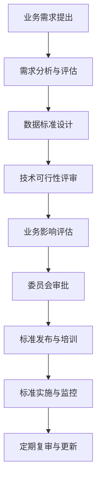

# ERP系统数据治理与主数据管理方案

## 1. 概述

### 1.1 背景与目标
ERP系统作为企业核心业务支撑平台，数据质量直接影响业务决策和运营效率。本方案旨在建立统一的数据治理和主数据管理机制，确保ERP系统数据的准确性、一致性、安全性和可用性。

### 1.2 核心目标
- 建立端到端的数据治理体系
- 实现主数据的统一管理和分发
- 保障数据质量持续改进
- 确保数据安全与合规性

## 2. 数据治理框架设计

### 2.1 治理组织架构

```
数据治理委员会
├── 数据治理办公室
│   ├── 数据治理主管
│   ├── 数据架构师
│   └── 数据质量分析师
├── 业务数据管家团队
│   ├── 财务数据管家
│   ├── 供应链数据管家
│   ├── 销售数据管家
│   └── 人力资源数据管家
└── 技术数据管家团队
    ├── 数据平台管理员
    ├── 数据安全管理员
    └── 数据运维工程师
```

### 2.2 角色职责定义

| 角色 | 职责 | 权限 |
|------|------|------|
| 数据所有者 | 业务数据的所有权，决策数据标准 | 批准数据标准，分配数据管家 |
| 数据管家 | 具体领域的数据管理，维护数据质量 | 制定数据规则，监控数据质量 |
| 数据使用者 | 使用数据进行业务操作和分析 | 申请数据访问，反馈数据问题 |
| 数据管理员 | 技术层面数据管理，保障数据安全 | 实施安全策略，管理数据存储 |

### 2.3 决策机制

#### 2.3.1 数据标准审批流程
1. **需求提交**：业务部门提出数据标准需求
2. **方案设计**：数据架构师设计标准草案
3. **技术评审**：技术团队评审技术可行性
4. **业务评审**：业务数据管家评审业务影响
5. **委员会批准**：数据治理委员会最终审批
6. **标准发布**：发布并培训相关人员

#### 2.3.2 数据安全策略制定流程
1. **风险评估**：识别数据安全风险
2. **策略设计**：设计安全控制措施
3. **合规审查**：确保符合法规要求
4. **实施计划**：制定分阶段实施计划
5. **持续监控**：建立安全监控机制

## 3. 数据治理流程设计

### 3.1 数据标准管理流程



### 3.2 数据质量监控流程

#### 3.2.1 质量指标体系

| 质量维度 | 指标 | 目标值 | 监控频率 |
|----------|------|--------|----------|
| 完整性 | 必填字段完成率 | ≥99.5% | 实时 |
| 准确性 | 数据错误率 | ≤0.1% | 每天 |
| 一致性 | 跨系统一致率 | ≥99.8% | 实时 |
| 及时性 | 数据延迟时间 | ≤5分钟 | 实时 |
| 唯一性 | 重复数据比例 | ≤0.05% | 每天 |

#### 3.2.2 质量监控闭环

1. **数据采集**：实时采集数据质量指标
2. **异常检测**：自动识别质量异常
3. **问题分类**：按优先级和影响范围分类
4. **任务派发**：自动创建质量问题工单
5. **问题处理**：数据管家处理质量问题
6. **效果验证**：验证问题解决效果
7. **根因分析**：分析问题根本原因
8. **预防措施**：制定预防措施防止复发

### 3.3 数据安全管控流程

#### 3.3.1 分级分类管理

| 数据级别 | 描述 | 访问控制 | 加密要求 | 审计要求 |
|----------|------|----------|----------|----------|
| 机密级 | 核心商业数据 | 严格授权 | 强加密 | 详细审计 |
| 敏感级 | 客户个人信息 | 授权访问 | 加密存储 | 操作审计 |
| 内部级 | 内部业务数据 | 部门访问 | 传输加密 | 访问审计 |
| 公开级 | 公开信息 | 受限访问 | 可选加密 | 基本审计 |

#### 3.3.2 安全控制措施

1. **身份认证**：多因素认证，单点登录
2. **访问控制**：基于角色的细粒度权限控制
3. **数据加密**：传输加密和存储加密
4. **审计追踪**：完整操作日志和审计追踪
5. **数据脱敏**：敏感数据脱敏显示
6. **水印标记**：数据水印防泄露追踪

### 3.4 数据合规审计流程

1. **法规识别**：识别适用法规和标准
2. **差距分析**：分析当前合规差距
3. **整改计划**：制定合规整改计划
4. **控制实施**：实施合规控制措施
5. **合规监控**：持续监控合规状态
6. **审计验证**：定期审计验证合规性
7. **报告生成**：生成合规审计报告

## 4. 主数据管理方案

### 4.1 主数据识别

#### 4.1.1 核心主数据实体

| 主数据类型 | 实体 | 关键属性 | 业务价值 |
|------------|------|----------|----------|
| 产品 | 产品主数据 | 产品编码、名称、规格、分类 | 统一产品视图 |
| 客户 | 客户主数据 | 客户编码、名称、地址、信用等级 | 360度客户视图 |
| 供应商 | 供应商主数据 | 供应商编码、名称、资质、评估等级 | 供应商关系管理 |
| 物料 | 物料主数据 | 物料编码、名称、规格、替代物料 | 物料统一管理 |
| 员工 | 员工主数据 | 员工编号、姓名、岗位、部门 | 人力资源管理 |

#### 4.1.2 主数据识别标准

1. **业务重要性**：对核心业务流程有重大影响
2. **共享性**：被多个系统或部门共享使用
3. **稳定性**：相对稳定，变化频率低
4. **唯一性**：具有唯一标识和定义
5. **质量要求**：对数据质量要求高

### 4.2 主数据模型设计

#### 4.2.1 统一数据模型

```json
{
  "masterData": {
    "metadata": {
      "dataType": "产品",
      "version": "2.0",
      "effectiveDate": "2026-05-04",
      "status": "active"
    },
    "identification": {
      "masterDataId": "MD-PROD-001",
      "globalId": "urn:erp:product:001",
      "alternateIds": ["SKU-001", "OLD-PROD-001"]
    },
    "basicAttributes": {
      "code": "PROD001",
      "name": "ERP企业版",
      "description": "企业资源规划系统企业版",
      "category": "软件产品",
      "status": "在售"
    },
    "extendedAttributes": {
      "technicalSpecs": {},
      "businessRules": {},
      "complianceInfo": {}
    },
    "relationships": {
      "parent": null,
      "children": ["PROD001-ADDON1", "PROD001-ADDON2"],
      "relatedEntities": ["客户", "供应商", "物料"]
    },
    "lifecycle": {
      "createdDate": "2026-01-01",
      "lastModified": "2026-05-04",
      "validFrom": "2026-01-01",
      "validTo": "2028-12-31",
      "archived": false
    }
  }
}
```

#### 4.2.2 编码体系设计

| 主数据类型 | 编码规则 | 示例 | 特点 |
|------------|----------|------|------|
| 产品 | PROD-XXXXX | PROD-00123 | 顺序编码，易于扩展 |
| 客户 | CUST-XX-XXXX | CUST-CN-0456 | 包含地区信息 |
| 供应商 | VEND-XX-XXXX | VEND-US-0789 | 包含国家信息 |
| 物料 | MAT-XXXXX-XX | MAT-12345-A1 | 包含分类信息 |
| 员工 | EMP-XXXXX | EMP-56789 | 统一顺序编码 |

### 4.3 主数据生命周期管理

#### 4.3.1 生命周期阶段


#### 4.3.2 各阶段管理要点

| 阶段 | 管理要点 | 负责人 | 关键活动 |
|------|----------|--------|----------|
| 创建 | 数据建模，规则定义 | 数据架构师 | 模型设计，标准制定 |
| 维护 | 日常更新，质量监控 | 数据管家 | 变更管理，质量检查 |
| 分发 | 同步分发，权限控制 | 数据管理员 | 接口配置，权限分配 |
| 归档 | 历史归档，访问控制 | 数据管理员 | 数据迁移，权限调整 |
| 销毁 | 合规销毁，审计追踪 | 安全管理员 | 销毁审批，审计记录 |

### 4.4 主数据分发机制

#### 4.4.1 分发架构

```
主数据管理中心 (MDM Hub)
├── 同步服务层
│   ├── 实时同步 (消息队列)
│   ├── 批量同步 (ETL)
│   └── API服务 (REST)
├── 转换适配层
│   ├── 格式转换
│   ├── 规则映射
│   └── 数据验证
└── 目标系统层
    ├── ERP核心系统
    ├── CRM系统
    ├── SCM系统
    └── BI系统
```

#### 4.4.2 分发策略

| 分发类型 | 适用场景 | 技术方案 | 优势 |
|----------|----------|----------|------|
| 实时同步 | 关键业务数据 | 消息队列 + CDC | 数据实时性高 |
| 定时批量 | 非关键数据 | ETL作业 + 定时任务 | 系统压力小 |
| 按需拉取 | 低频访问数据 | API服务 + 缓存 | 灵活性高 |
| 事件驱动 | 数据变更通知 | 事件总线 + 订阅 | 松耦合设计 |

#### 4.4.3 数据一致性保障

1. **最终一致性**：通过事件溯源保证最终一致性
2. **冲突解决**：基于时间戳和业务规则的冲突解决
3. **回滚机制**：支持数据变更回滚
4. **监控告警**：实时监控数据同步状态
5. **修复工具**：提供数据不一致修复工具

## 5. 实施路线图

### 5.1 第一阶段：基础能力建设（1-3个月）

#### 5.1.1 核心任务
- 建立数据治理组织架构
- 制定数据治理政策和流程
- 搭建主数据管理平台基础框架
- 识别和建模核心主数据

#### 5.1.2 交付成果
- 数据治理组织手册
- 数据治理流程文档
- 主数据管理平台MVP
- 核心主数据模型

### 5.2 第二阶段：全面实施推广（4-9个月）

#### 5.2.1 核心任务
- 实施数据质量标准
- 部署数据安全控制
- 全面实施主数据管理
- 建立数据质量监控体系

#### 5.2.2 交付成果
- 数据质量监控平台
- 数据安全管控平台
- 主数据管理完整方案
- 数据治理成效报告

### 5.3 第三阶段：持续优化运营（10个月以后）

#### 5.3.1 核心任务
- 数据治理流程优化
- 主数据管理持续改进
- 数据价值挖掘
- 数据文化培育

#### 5.3.2 交付成果
- 数据治理成熟度评估
- 数据价值分析报告
- 数据文化培养计划
- 持续优化路线图

## 6. 效益评估

### 6.1 直接效益

| 效益维度 | 具体指标 | 目标值 |
|----------|----------|--------|
| 数据质量 | 数据错误率降低 | 80% |
| 工作效率 | 数据查找时间减少 | 60% |
| 决策质量 | 基于数据的决策比例提高 | 50% |
| 合规风险 | 数据安全事件减少 | 90% |

### 6.2 间接效益

1. **业务敏捷性提升**：快速响应业务变化
2. **创新能力增强**：基于数据的创新支持
3. **客户体验改善**：统一准确的客户视图
4. **运营成本降低**：减少数据冗余和重复处理

## 7. 风险管理

### 7.1 主要风险及应对

| 风险类别 | 风险描述 | 概率 | 影响 | 应对措施 |
|----------|----------|------|------|----------|
| 组织变革 | 员工抵制数据治理 | 中 | 高 | 领导支持，培训宣导 |
| 技术集成 | 系统集成复杂性 | 高 | 中 | 分阶段实施，接口标准化 |
| 数据质量 | 历史数据质量问题 | 高 | 高 | 数据清洗，渐进改进 |
| 资源不足 | 专业人才缺乏 | 中 | 中 | 外部合作，内部培养 |

### 7.2 成功关键因素

1. **高层支持**：获得管理层持续支持
2. **业务驱动**：以业务价值为导向
3. **分步实施**：采取渐进式实施策略
4. **持续改进**：建立持续优化机制
5. **文化培育**：培育数据驱动文化

## 8. 结论

本方案为ERP系统数据治理和主数据管理提供了完整的框架和实施路径。通过建立端到端的数据治理体系，实现主数据的统一管理和高质量维护，将为ERP系统的稳定运行和业务价值的充分发挥提供坚实的数据基础。

方案的实施需要业务、技术和管理的协同配合，建议按照实施路线图分阶段推进，并在实施过程中持续优化和调整，确保方案的成功落地和价值实现。