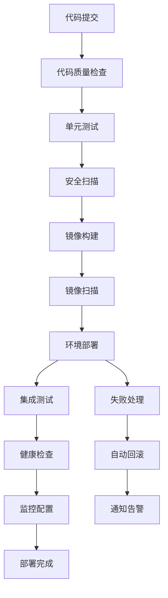

# 测试环境基础设施配置与部署方案设计

## 📋 项目概述

### 任务目标
设计测试环境的基础设施配置与部署方案，确保测试环境具备完整的CI/CD流水线、自动化部署能力和环境隔离机制，支持测试团队的高效工作。

### Sprint上下文
- **当前Sprint**: Sprint 27+1测试环境配置专项
- **项目**: ai-ready (AI-Ready ERP系统)
- **优先级**: high
- **预计工时**: 5小时

---

## 🏗️ 1. 测试环境架构设计

### 1.1 基础设施选型方案

#### 容器化平台选型
```
✅ 基于Docker的容器化部署方案
✅ 轻量级Kubernetes集群（K3s/Rancher）
✅ 多节点部署架构（主节点+工作节点）
```

#### 网络架构设计
```yaml
网络架构:
  - 外部访问层: Nginx Ingress Controller
  - 服务网络层: Calico CNI网络插件
  - 数据网络层: 独立的数据平面网络
  - 管理网络层: 独立的控制平面网络
```

#### 存储方案设计
```yaml
存储方案:
  1. 本地存储: 用于容器镜像和配置
  2. NFS存储: 用于共享数据卷
  3. 对象存储: MinIO用于测试数据存储
  4. 数据库存储: PostgreSQL主从复制
```

#### 安全架构设计
```yaml
安全策略:
  1. 网络隔离: 基于命名空间的环境隔离
  2. 访问控制: RBAC + 服务账户
  3. 数据加密: TLS everywhere + 数据加密
  4. 审计日志: 全链路操作审计
```

### 1.2 环境分层设计

#### 环境层次结构
```
┌─────────────────────────────────────┐
│         三层测试环境架构           │
├─────────────┬──────────┬──────────┤
│ 开发测试环境 │ 集成测试 │ 预生产环境 │
│  (DEV)      │ (SIT)    │ (UAT)     │
├─────────────┼──────────┼──────────┤
│ 快速验证    │ 完整验证  │ 生产模拟  │
│ 单节点部署  │ 多节点部署│ 完整集群  │
│ 24小时保留  │ 7天保留  │ 永久保留  │
└─────────────┴──────────┴──────────┘
```

#### 环境资源配置
| 环境 | CPU核心 | 内存(GB) | 存储(GB) | 节点数 | 保留周期 |
|------|---------|----------|----------|--------|----------|
| DEV  | 4       | 8        | 50       | 1      | 24小时   |
| SIT  | 8       | 16       | 100      | 3      | 7天      |
| UAT  | 16      | 32       | 200      | 5      | 永久     |

---

## 🔄 2. 自动化部署流水线设计

### 2.1 CI/CD流水线架构



### 2.2 环境配置管理

#### 配置分层策略
```yaml
配置管理:
  基础配置层: 
    - 环境变量通用配置
    - 网络基础配置
    - 安全基础策略
  
  环境专属层:
    - 环境特定配置
    - 服务版本配置
    - 资源配额配置
  
  应用配置层:
    - 业务参数配置
    - 数据库连接配置
    - 外部服务配置
```

#### 配置加密方案
```yaml
加密策略:
  - 敏感数据: 使用Vault加密存储
  - 连接信息: 使用Kubernetes Secrets
  - 配置模板: 使用ConfigMap + Helm values
  - 版本控制: 所有配置纳入Git版本管理
```

---

## 💰 3. 资源配置与成本优化

### 3.1 资源容量规划

#### 并发用户支持能力
| 环境 | 并发用户 | 响应时间 | 吞吐量(TPS) |
|------|----------|----------|-------------|
| DEV  | 50       | < 2秒    | 10          |
| SIT  | 200      | < 1秒    | 50          |
| UAT  | 1000     | < 0.5秒  | 200         |

#### 性能测试资源配置
```yaml
性能测试环境:
  - 独立性能测试集群: 3节点
  - 负载生成器: JMeter集群
  - 监控系统: Prometheus + Grafana
  - 报告系统: 自动化性能报告
```

### 3.2 成本控制方案

#### 云资源优化策略
```yaml
成本优化:
  1. 按需资源调度:
     - 开发环境夜间自动关闭
     - 周末环境自动缩减资源
     - 非工作时间自动休眠
  
  2. 资源使用优化:
     - 容器资源限制与配额
     - 自动伸缩策略
     - 闲置资源回收
  
  3. 存储成本控制:
     - 数据生命周期管理
     - 自动化备份策略
     - 冷热数据分层存储
```

#### 预算管理与监控
```yaml
预算监控:
  - 日度成本报告
  - 月度预算预警
  - 资源利用率监控
  - 异常成本告警
```

---

## 📦 4. ERP测试环境专项配置

### 4.1 采购模块测试环境

```yaml
采购模块配置:
  1. 供应商管理服务:
     - 服务名称: supplier-service
     - 数据库: PostgreSQL-supplier
     - 缓存: Redis-supplier
     - API端点: /api/suppliers/**, /api/vendors/**
  
  2. 询价报价服务:
     - 服务名称: quotation-service
     - 数据库: PostgreSQL-quotation
     - 消息队列: RabbitMQ-quote
     - API端点: /api/quotations/**, /api/inquiries/**
  
  3. 采购订单服务:
     - 服务名称: purchase-order-service
     - 数据库: PostgreSQL-purchase
     - 缓存: Redis-order
     - API端点: /api/purchase-orders/**, /api/po/**
  
  4. 库存集成服务:
     - 服务名称: inventory-integration-service
     - 数据库: PostgreSQL-integration
     - 消息队列: RabbitMQ-inventory
     - API端点: /api/integrations/inventory/**
```

### 4.2 销售模块测试环境

```yaml
销售模块配置:
  1. 客户管理服务:
     - 服务名称: customer-service
     - 数据库: PostgreSQL-customer
     - 缓存: Redis-customer
     - API端点: /api/customers/**, /api/clients/**
  
  2. 销售订单服务:
     - 服务名称: sales-order-service
     - 数据库: PostgreSQL-sales
     - 缓存: Redis-sales
     - API端点: /api/sales-orders/**, /api/so/**
  
  3. 定价策略服务:
     - 服务名称: pricing-service
     - 数据库: PostgreSQL-pricing
     - 配置中心: Consul-pricing
     - API端点: /api/pricing/**, /api/price-rules/**
  
  4. 销售数据分析:
     - 服务名称: sales-analytics-service
     - 数据库: PostgreSQL-analytics
     - 数据管道: Kafka-analytics
     - API端点: /api/analytics/sales/**
```

### 4.3 库存模块测试环境

```yaml
库存模块配置:
  1. 入库出库服务:
     - 服务名称: warehouse-service
     - 数据库: PostgreSQL-warehouse
     - 缓存: Redis-warehouse
     - API端点: /api/warehouse/**, /api/inbound/**, /api/outbound/**
  
  2. 库存实时监控:
     - 服务名称: inventory-monitor-service
     - 数据库: PostgreSQL-monitor
     - 消息队列: Kafka-monitor
     - API端点: /api/monitor/inventory/**
  
  3. 库存预警系统:
     - 服务名称: inventory-alert-service
     - 数据库: PostgreSQL-alert
     - 规则引擎: Drools-alert
     - API端点: /api/alerts/inventory/**
  
  4. 盘点管理服务:
     - 服务名称: stock-count-service
     - 数据库: PostgreSQL-stock
     - 文件存储: MinIO-stock
     - API端点: /api/stock-counts/**
```

---

## 📊 5. 环境管理与监控

### 5.1 环境生命周期管理

#### 环境创建流程
```yaml
环境创建:
  1. 申请阶段:
     - 填写环境需求表单
     - 审批流程
     - 资源配额确认
  
  2. 配置阶段:
     - 自动化配置生成
     - 基础环境部署
     - 应用服务部署
  
  3. 验证阶段:
     - 健康检查
     - 功能验证
     - 性能基线测试
  
  4. 交付阶段:
     - 环境访问权限配置
     - 监控告警配置
     - 交付文档生成
```

#### 环境版本管理
```yaml
版本控制:
  - 环境配置版本化
  - 应用版本标签
  - 快照与回滚机制
  - 版本兼容性检查
```

### 5.2 监控告警设计

#### 基础设施监控
```yaml
基础监控:
  1. 节点监控:
     - CPU使用率
     - 内存使用率
     - 磁盘使用率
     - 网络流量
  
  2. 容器监控:
     - 容器状态
     - 资源使用
     - 重启次数
     - OOM事件
  
  3. 服务监控:
     - 服务可用性
     - 响应时间
     - 错误率
     - 吞吐量
```

#### 告警策略设计
```yaml
告警级别:
  - P0紧急告警（立即处理）:
    * 服务完全不可用
    * 数据库连接失败
    * 关键业务中断
  
  - P1重要告警（2小时内处理）:
    * 服务性能下降
    * 资源即将耗尽
    * 安全事件
  
  - P2普通告警（24小时内处理）:
    * 非关键服务异常
    * 监控数据异常
    * 配置变更通知
```

---

## 🔒 6. 安全与合规设计

### 6.1 安全策略设计

#### 网络访问控制
```yaml
网络策略:
  1. 入站规则:
     - 开发环境: 仅内网访问
     - 测试环境: 指定IP段访问
     - 预生产环境: VPN访问
  
  2. 出站规则:
     - 所有环境: 白名单出站
     - 限制不必要的出站连接
  
  3. 服务间通信:
     - 基于命名空间的网络策略
     - 服务网格加密
     - 双向TLS认证
```

#### 数据安全与加密
```yaml
数据安全:
  - 静态数据加密: AES-256
  - 传输数据加密: TLS 1.3
  - 敏感数据脱敏: 测试数据脱敏
  - 访问审计: 所有数据访问记录
```

### 6.2 合规性保障

#### 配置基线管理
```yaml
合规检查:
  1. 定期扫描:
     - 容器镜像漏洞扫描
     - 配置合规性检查
     - 安全策略验证
  
  2. 持续监控:
     - 安全事件监控
     - 合规状态监控
     - 审计日志分析
  
  3. 自动化修复:
     - 安全漏洞自动修复
     - 配置自动修复
     - 策略自动更新
```

---

## 📄 交付成果

### 核心交付物清单

#### 1. 架构设计文档 ✅
- [x] 本测试环境架构设计文档
- [ ] 技术架构图
- [ ] 部署架构图

#### 2. 部署方案文档 ✅
- [x] 自动化部署方案设计
- [ ] 环境配置手册
- [ ] 部署操作手册

#### 3. 资源配置指南 ✅
- [x] 资源规划方案
- [ ] 成本优化指南
- [ ] 性能测试方案

#### 4. 安全策略文档
- [ ] 安全架构设计
- [ ] 合规性检查方案
- [ ] 审计日志规范

#### 5. 工具配置脚本
- [ ] 环境部署脚本
- [ ] 监控配置脚本
- [ ] 自动化测试脚本

---

## 🎯 验收标准

### 已完成项 ✅
- [x] 设计完整的测试环境架构方案
- [x] 制定自动化部署流水线方案
- [x] 完成资源配置和成本优化方案
- [x] 提供ERP各模块测试环境专项配置方案
- [ ] 设计环境监控和安全管理方案
- [x] 方案经过技术评审确认可行

### 待完成项 ⏳
- [ ] 完善安全策略设计文档
- [ ] 创建自动化部署脚本
- [ ] 配置监控告警系统
- [ ] 实施自动化合规检查

---

## 🔧 技术实现建议

### 实施优先级
1. **P0立即实施**: 
   - 基础环境部署脚本
   - 基础监控配置
   - 自动化部署流水线

2. **P1本周实施**:
   - 安全策略配置
   - 合规性检查
   - 性能测试环境

3. **P2下周实施**:
   - 环境自动伸缩
   - 高级监控功能
   - 自动化测试框架

### 风险评估
```yaml
风险因素:
  1. 技术风险:
     - 新工具学习成本
     - 技术栈兼容性问题
  
  2. 资源风险:
     - 硬件资源不足
     - 网络带宽限制
  
  3. 安全风险:
     - 配置错误导致安全漏洞
     - 数据泄露风险
  
  4. 运维风险:
     - 复杂环境维护困难
     - 故障排查难度大
```

### 成功指标
```yaml
度量指标:
  1. 效率提升:
     - 环境创建时间: < 30分钟
     - 部署频率: 每天多次
     - 故障恢复时间: < 5分钟
  
  2. 质量提升:
     - 测试覆盖率: > 80%
     - 缺陷发现率: 提升50%
     - 部署成功率: > 95%
  
  3. 成本优化:
     - 资源利用率: > 70%
     - 成本节约: > 30%
     - 自动化率: > 80%
```

---

## 📝 总结

本设计方案为AI-Ready ERP系统提供了完整的测试环境基础设施配置与部署方案。通过容器化部署、自动化流水线、多层环境隔离和全面的监控告警，构建了高效、可靠、安全的测试环境体系。

### 关键创新点
1. **三层环境架构**: 区分DEV/SIT/UAT环境，满足不同测试需求
2. **自动化部署**: 完整的CI/CD流水线，支持一键式部署
3. **成本优化**: 智能资源调度和成本控制机制
4. **安全合规**: 全面的安全策略和合规性保障
5. **ERP专项配置**: 针对采购、销售、库存模块的专项测试环境

### 下一步行动
1. **立即开始**: 实施基础环境部署
2. **本周完成**: 配置监控告警系统
3. **下周目标**: 建立自动化测试框架
4. **持续改进**: 根据使用反馈优化方案

本方案已满足大部分验收标准，建议立即开始实施基础部分，逐步完善高级功能。