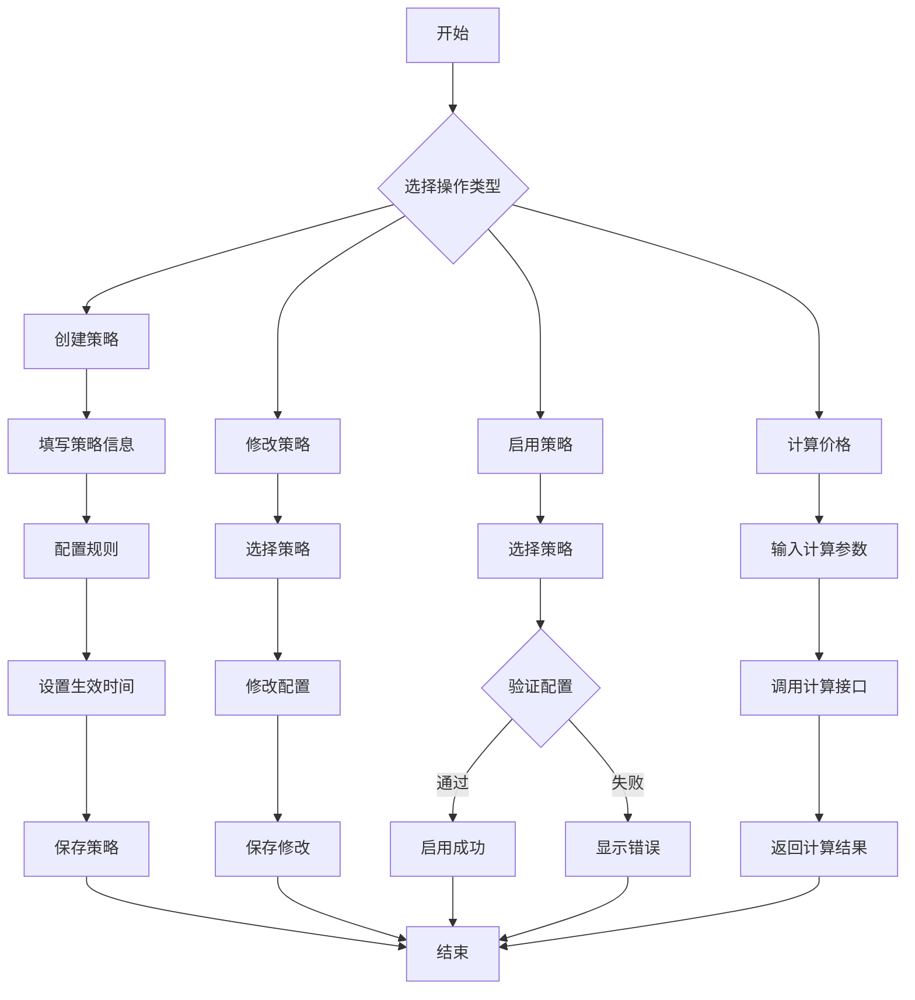

# 销售价格策略管理功能用户手册

## 概述

销售价格策略管理功能是AI-Ready ERP系统的核心定价模块，支持多维度的价格策略配置和灵活的价格计算规则。本手册将详细介绍如何使用该功能进行价格策略的创建、管理、应用和监控。

## 功能特性

### 核心功能
- **多维度价格策略**：支持客户等级、区域、产品类别、时间等多维度定价
- **灵活的价格规则**：支持数量折扣、客户折扣、区域系数、时间系数等多种规则
- **促销活动管理**：支持折扣、满减、赠品、组合等多种促销类型
- **智能价格计算**：自动应用最优价格策略，支持价格模拟和验证
- **策略优先级管理**：支持多策略冲突时的优先级设置

### 适用场景
- B2B企业客户分级定价
- 区域差异化定价
- 季节性价格调整
- 批量采购优惠
- 促销活动管理

## 快速开始

### 1. 访问路径
登录ERP系统后，通过以下路径访问价格策略管理功能：
```
销售管理 → 价格策略管理
```

### 2. 界面概览
价格策略管理界面分为三个主要区域：
1. **策略列表**：显示所有价格策略，支持搜索和筛选
2. **策略详情**：显示选中策略的详细信息
3. **操作工具栏**：提供创建、编辑、删除、启用/停用等操作

## 功能使用指南

### 1. 价格策略创建和配置

#### 1.1 创建新策略
1. 点击"新建策略"按钮
2. 填写策略基本信息：
   - **策略名称**：易于识别的名称（如"战略客户折扣"）
   - **策略描述**：详细描述策略用途
   - **策略类型**：选择客户等级、区域、产品类别、时间或组合
   - **优先级**：数字越小优先级越高（1-100）

#### 1.2 配置策略参数
根据选择的策略类型，配置相应的参数：

**客户等级策略**：
- 选择客户等级：战略客户、核心客户、普通客户
- 设置折扣率或价格系数

**区域策略**：
- 输入区域编码（如：BJ,SH,GZ,SZ）
- 设置区域价格系数（如：1.0为标准价，0.95为95折）

**产品类别策略**：
- 选择产品类别ID
- 设置基础价格或折扣率

**时间策略**：
- 设置生效开始时间和结束时间
- 配置时间系数（如节假日系数）

**组合策略**：
- 可组合多个维度的条件
- 设置复合计算规则

#### 1.3 设置生效时间
- **生效开始时间**：策略开始生效的时间
- **生效结束时间**：策略失效的时间（可选，不填表示永久有效）

#### 1.4 保存策略
点击"保存"按钮，系统将验证策略配置并创建成功。

### 2. 价格规则设置和使用

#### 2.1 添加价格规则
1. 在策略详情页面，点击"添加规则"按钮
2. 选择规则类型：
   - **数量折扣**：基于采购数量的折扣
   - **客户折扣**：基于客户等级的折扣
   - **区域系数**：基于区域的乘数系数
   - **时间系数**：基于时间的乘数系数
   - **附加费用**：额外的固定费用

#### 2.2 配置规则条件
**数量折扣规则**：
- 最小数量：触发折扣的最低数量
- 最大数量：触发折扣的最高数量（可选）
- 折扣率：如0.05表示5%折扣
- 折扣金额：直接减免的金额（可选）

**条件表达式示例**：
```
quantity >= 100  // 数量大于等于100时触发
amount >= 1000   // 金额大于等于1000时触发
customer_level == 'strategic'  // 客户等级为战略客户时触发
```

#### 2.3 配置计算表达式
**计算表达式示例**：
```
basePrice * 0.95  // 95折
basePrice - 10    // 减10元
basePrice * priceFactor  // 乘以价格系数
```

#### 2.4 规则排序
- **排序号**：决定规则执行的顺序（从小到大）
- 系统按照排序号依次执行规则
- 后执行的规则基于前一个规则的计算结果

### 3. 价格策略应用和执行

#### 3.1 启用策略
1. 在策略列表中选择需要启用的策略
2. 点击"启用"按钮
3. 系统将验证策略配置的有效性
4. 验证通过后策略状态变为"active"

#### 3.2 价格计算
**API调用方式**：
```http
POST /api/sale/pricing/calculate
Content-Type: application/json

{
  "tenantId": 1,
  "customerId": 1001,
  "customerLevel": "strategic",
  "regionCode": "BJ",
  "productCategoryId": 5,
  "items": [
    {
      "productId": 101,
      "quantity": 150,
      "basePrice": 100.00
    }
  ]
}
```

**响应示例**：
```json
{
  "code": 200,
  "message": "success",
  "data": {
    "totalAmount": 14250.00,
    "originalAmount": 15000.00,
    "discountAmount": 750.00,
    "finalAmount": 14250.00,
    "appliedStrategies": [
      {
        "strategyId": 1,
        "strategyName": "战略客户折扣",
        "discountRate": 0.05
      }
    ],
    "appliedRules": [
      {
        "ruleId": 1,
        "ruleName": "批量折扣100件",
        "discountRate": 0.02
      }
    ],
    "itemDetails": [
      {
        "productId": 101,
        "quantity": 150,
        "basePrice": 100.00,
        "finalPrice": 95.00,
        "totalAmount": 14250.00
      }
    ]
  }
}
```

#### 3.3 价格模拟
在正式应用前，可以使用模拟功能测试价格计算：
```http
POST /api/sale/pricing/simulate
```
参数与价格计算接口相同，返回计算结果但不保存记录。

### 4. 价格变动记录和审计

#### 4.1 价格变动记录
系统自动记录以下价格变动事件：
- 策略创建、修改、删除
- 策略启用、停用
- 价格计算历史
- 促销活动应用记录

#### 4.2 审计日志查看
1. 进入"审计日志"页面
2. 选择时间范围和操作类型
3. 查看详细的操作记录，包括：
   - 操作时间
   - 操作人员
   - 操作类型
   - 操作详情
   - IP地址

#### 4.3 价格历史查询
1. 在策略详情页面，点击"历史记录"标签
2. 查看该策略的所有修改历史
3. 可以对比不同版本的变化

## 操作流程图



## 常见业务场景操作步骤

### 场景1：为新客户设置首单优惠

**操作步骤**：
1. 创建客户等级策略
   - 策略类型：客户等级
   - 客户等级：普通客户
   - 折扣率：0.02（2%折扣）
   - 策略名称：新客户首单优惠
   
2. 添加时间规则
   - 规则类型：时间系数
   - 生效时间：首次下单后30天内
   - 计算表达式：basePrice * 0.98

3. 启用策略
4. 在客户首次下单时，系统自动应用该优惠

### 场景2：设置区域性价格差异

**操作步骤**：
1. 创建区域策略
   - 策略类型：区域
   - 区域编码：BJ,SH,GZ,SZ
   - 价格系数：1.0（一线城市标准价）
   
2. 创建另一区域策略
   - 策略类型：区域
   - 区域编码：HZ,CD,WH,NJ
   - 价格系数：0.95（新一线城市95折）
   
3. 创建其他区域策略
   - 策略类型：区域
   - 区域编码：OTHER
   - 价格系数：0.9（二三线城市9折）

### 场景3：设置批量采购阶梯折扣

**操作步骤**：
1. 创建数量折扣策略
   - 策略类型：组合
   - 策略名称：批量采购阶梯折扣
   
2. 添加数量折扣规则
   - 规则1：数量≥100，折扣率0.02
   - 规则2：数量≥500，折扣率0.05
   - 规则3：数量≥1000，折扣率0.08
   
3. 设置规则排序
   - 规则1排序号：1
   - 规则2排序号：2
   - 规则3排序号：3

### 场景4：季节性促销活动

**操作步骤**：
1. 创建促销活动
   - 活动名称：618年中大促
   - 活动类型：折扣
   - 折扣率：0.15（85折）
   - 开始时间：2026-06-18 00:00:00
   - 结束时间：2026-06-18 23:59:59
   
2. 设置适用条件
   - 适用客户等级：所有
   - 适用产品：指定产品ID
   - 最大使用次数：无限制
   
3. 发布促销活动

## 异常情况处理方法

### 问题1：策略验证失败

**症状**：启用策略时提示验证失败

**可能原因**：
1. 策略配置不完整
2. 规则条件冲突
3. 生效时间设置错误

**解决方法**：
1. 检查策略基本信息是否完整
2. 检查规则条件是否有逻辑冲突
3. 验证生效时间是否合理
4. 使用"验证策略配置"功能检查具体问题

### 问题2：价格计算异常

**症状**：价格计算结果不符合预期

**可能原因**：
1. 策略优先级设置不当
2. 规则排序错误
3. 条件表达式语法错误

**解决方法**：
1. 检查策略优先级设置
2. 检查规则排序是否正确
3. 使用价格模拟功能调试
4. 查看系统日志了解详细计算过程

### 问题3：促销活动未生效

**症状**：促销活动已发布但未在计算中应用

**可能原因**：
1. 活动时间未到或已过期
2. 适用条件不匹配
3. 与其他促销活动冲突

**解决方法**：
1. 检查活动时间设置
2. 验证客户、产品等适用条件
3. 检查是否设置了不可叠加标志

## 最佳实践

### 1. 策略命名规范
- 使用统一的命名格式：`[类型]_[描述]_[有效期]`
- 示例：`customer_level_strategic_2026`
- 便于搜索和识别

### 2. 优先级设置建议
- 通用策略：优先级较低（50-100）
- 特殊策略：优先级中等（20-49）
- 重要策略：优先级较高（1-19）
- 紧急策略：优先级最高（1-5）

### 3. 测试验证流程
1. 创建策略后先保存为草稿
2. 使用价格模拟功能测试
3. 在小范围客户中试用
4. 验证无误后再正式启用

### 4. 监控和维护
- 定期检查策略有效性
- 监控价格计算成功率
- 定期清理过期策略
- 备份重要策略配置

### 5. 权限管理建议
- 创建策略：销售经理权限
- 修改策略：销售经理权限
- 启用/停用策略：销售总监权限
- 查看策略：销售专员权限

## 界面截图说明

### 1. 策略列表页面
```
+--------------------------------------------+
| [搜索框] [筛选] [新建策略] [批量操作]      |
+--------------------------------------------+
| 策略名称       | 类型     | 状态   | 操作  |
|----------------|----------|--------|-------|
| 战略客户折扣   | 客户等级 | 生效   | 编辑  |
| 一线城市标准价 | 区域     | 生效   | 编辑  |
| 618年中大促    | 促销     | 已发布 | 编辑  |
+--------------------------------------------+
```

### 2. 策略创建页面
```
+--------------------------------------------+
| 策略基本信息                               |
| 名称：___________________________          |
| 描述：___________________________          |
| 类型：○客户等级 ○区域 ○产品类别 ○时间      |
| 优先级：_____ (1-100)                      |
|                                            |
| 生效时间                                   |
| 开始：YYYY-MM-DD HH:mm:ss                  |
| 结束：YYYY-MM-DD HH:mm:ss (可选)           |
|                                            |
| [保存] [取消]                              |
+--------------------------------------------+
```

### 3. 规则配置页面
```
+--------------------------------------------+
| 规则列表                                   |
| + 添加规则                                 |
|                                            |
| 规则1：数量折扣                            |
| 条件：数量 >= 100                          |
| 计算：basePrice * 0.98                     |
| 排序：1                                    |
|                                            |
| 规则2：客户折扣                            |
| 条件：customerLevel == 'strategic'        |
| 计算：basePrice * 0.95                     |
| 排序：2                                    |
+--------------------------------------------+
```

## 附录

### A. API接口说明

#### 价格策略管理接口
- `POST /api/sale/pricing/strategies` - 创建策略
- `PUT /api/sale/pricing/strategies/{id}` - 更新策略
- `DELETE /api/sale/pricing/strategies/{id}` - 删除策略
- `GET /api/sale/pricing/strategies/{id}` - 获取策略详情
- `GET /api/sale/pricing/strategies` - 分页查询策略列表
- `GET /api/sale/pricing/strategies/active` - 查询生效策略

#### 价格计算接口
- `POST /api/sale/pricing/calculate` - 计算价格
- `POST /api/sale/pricing/simulate` - 模拟价格计算
- `POST /api/sale/pricing/strategies/{id}/validate` - 验证策略

### B. 数据库表结构

#### erp_pricing_strategy（价格策略表）
- id: 策略ID
- name: 策略名称
- strategy_type: 策略类型
- customer_level: 适用客户等级
- region_code: 适用区域编码
- price_factor: 价格系数
- discount_rate: 折扣率
- priority: 优先级
- status: 状态

#### erp_pricing_rule（价格规则表）
- id: 规则ID
- strategy_id: 所属策略ID
- rule_type: 规则类型
- condition_expression: 条件表达式
- calculation_expression: 计算表达式
- discount_rate: 折扣率
- sort_order: 排序号

### C. 错误代码说明

| 错误代码 | 说明 | 解决方法 |
|---------|------|---------|
| PRICE_001 | 策略配置不完整 | 检查必填字段是否填写 |
| PRICE_002 | 规则条件冲突 | 检查规则条件逻辑 |
| PRICE_003 | 价格计算失败 | 检查输入参数格式 |
| PRICE_004 | 策略已过期 | 检查生效时间设置 |
| PRICE_005 | 权限不足 | 联系管理员获取权限 |

### D. 常见问题解答

**Q：如何设置复杂的组合策略？**
A：可以创建多个简单策略，通过优先级控制执行顺序，或者使用组合策略类型配置复合条件。

**Q：价格计算时如何选择最优策略？**
A：系统按照优先级从高到低依次尝试应用策略，第一个匹配的策略将被应用。

**Q：促销活动如何与价格策略叠加？**
A：默认情况下促销活动不可叠加，如需叠加请设置`stackable`为true。

**Q：如何查看价格计算历史？**
A：在审计日志中筛选"价格计算"操作类型，或通过API查询价格计算记录。

---

## 版本历史

| 版本 | 日期 | 修改说明 | 修改人 |
|------|------|---------|--------|
| 1.0.0 | 2026-04-30 | 初始版本 | doc-writer |
| 1.0.1 | 2026-04-30 | 增加常见问题章节 | doc-writer |

## 联系方式

如有问题或建议，请联系：
- 技术支持：tech-support@ai-ready.com
- 产品经理：product-manager@ai-ready.com
- 用户反馈：feedback@ai-ready.com