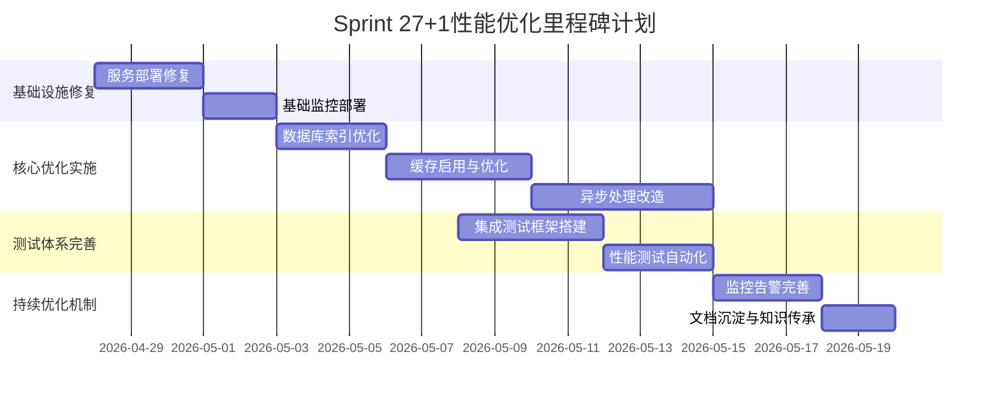

# 【Sprint 27+1】测试环境性能优化实施路线图

**版本**: 1.0.0
**创建日期**: 2026-04-27
**作者**: 产品分析师 (product-analyst)
**任务ID**: task_1777287914662_6y2yg4mat
**Sprint**: Sprint 27+1 - 测试环境配置专项

---

## 1. 路线图概述

### 1.1 目标与范围

本实施路线图旨在为Sprint 27+1测试环境性能优化提供详细的执行计划，确保在4周内完成所有关键优化工作，达到预期的性能指标要求。

**核心目标**:
- 修复测试环境基础设施问题
- 建立完整的性能监控体系
- 实施数据库和应用层性能优化
- 完善性能测试和验证机制
- 建立持续性能优化机制

**实施范围**:
- 用户管理服务、订单管理服务、库存管理服务
- PostgreSQL数据库、Redis缓存、Kafka消息队列
- API网关、微服务间通信
- 性能监控、告警、测试工具链

### 1.2 成功标准

| 维度 | 指标 | 目标值 | 验收方式 |
|------|------|-------|---------|
| **性能指标** | API响应时间P95 | ≤200ms | JMeter负载测试 |
| | 数据库查询P95 | ≤100ms | Prometheus监控 |
| | 缓存命中率 | ≥95% | Redis监控 |
| | 系统QPS | ≥500 | Gatling压力测试 |
| **质量指标** | 集成测试覆盖率 | ≥40% | JaCoCo报告 |
| | 自动化测试通过率 | ≥80% | CI/CD流水线 |
| | 代码质量标准符合率 | ≥80% | SonarQube扫描 |
| **运维指标** | 监控覆盖率 | 100% | 监控清单检查 |
| | 告警响应时间 | ≤5分钟 | 告警日志分析 |
| | 故障恢复时间 | ≤30分钟 | 故障演练 |

---

## 2. 里程碑计划

### 2.1 里程碑概览

### 2.2 详细里程碑定义

#### 里程碑M1: 基础设施修复 (2026-04-28 ~ 2026-05-02)

**目标**: 修复测试环境服务部署问题，建立基础监控能力

**关键任务**:
1. 服务部署状态检查和修复
2. Prometheus + Grafana监控部署
3. 基础性能指标收集配置
4. 关键服务健康检查配置

**成功标准**:
- 所有服务端口可正常访问
- 基础监控仪表盘可查看
- 关键指标（CPU、内存、磁盘）可监控
- 服务健康检查通过率100%

**负责人**: devops-engineer
**参与人**: backend-dev, test-agent-2

#### 里程碑M2: 核心优化实施 (2026-05-03 ~ 2026-05-11)

**目标**: 实施数据库、缓存、应用层核心性能优化

**关键任务**:
1. 数据库索引优化和查询优化
2. Redis缓存启用和多级缓存策略实现
3. 核心接口异步处理改造
4. 连接池和线程池优化

**成功标准**:
- API响应时间P95 ≤ 200ms
- 数据库查询P95 ≤ 100ms  
- 缓存命中率 ≥ 95%
- 系统QPS ≥ 500

**负责人**: backend-dev
**参与人**: devops-engineer, product-analyst

#### 里程碑M3: 测试体系完善 (2026-05-08 ~ 2026-05-14)

**目标**: 建立完整的性能测试和验证体系

**关键任务**:
1. 集成测试框架搭建和环境配置
2. 性能测试脚本编写和自动化
3. 性能基准数据收集和分析
4. 自动化测试流水线集成

**成功标准**:
- 集成测试覆盖率 ≥ 40%
- 自动化测试通过率 ≥ 80%
- 性能测试报告自动生成
- CI/CD流水线集成完成

**负责人**: test-agent-1
**参与人**: test-agent-2, backend-dev

#### 里程碑M4: 持续优化机制 (2026-05-15 ~ 2026-05-19)

**目标**: 建立持续性能优化和监控机制

**关键任务**:
1. 监控告警规则完善和优化
2. 性能优化文档沉淀和知识库建设
3. 团队技能提升和培训
4. 持续改进流程建立

**成功标准**:
- 监控覆盖率100%
- 告警响应时间 ≤ 5分钟
- 性能优化文档完整度100%
- 团队核心成员掌握优化技能

**负责人**: product-analyst
**参与人**: devops-engineer, backend-dev, test-agent-1

---

## 3. 详细实施计划

### 3.1 第一周：基础设施修复 (2026-04-28 ~ 2026-05-02)

#### 3.1.1 每日任务分解

| 日期 | 任务 | 负责人 | 交付物 | 风险 |
|------|------|-------|-------|------|
| **2026-04-28** | 服务部署状态全面检查 | devops-engineer | 服务状态报告 | 服务依赖复杂 |
| | 修复用户管理服务部署 | devops-engineer | 可访问的用户服务 | 配置文件缺失 |
| **2026-04-29** | 修复订单管理服务部署 | devops-engineer | 可访问的订单服务 | 端口冲突 |
| | 修复库存管理服务部署 | devops-engineer | 可访问的库存服务 | 数据库连接问题 |
| **2026-04-30** | 修复API网关服务部署 | devops-engineer | 可访问的API网关 | 路由配置错误 |
| | 服务间通信验证 | backend-dev | 服务调用测试报告 | 网络策略限制 |
| **2026-05-01** | Prometheus部署和配置 | devops-engineer | Prometheus实例 | 存储配置问题 |
| | Grafana部署和配置 | devops-engineer | Grafana实例 | 数据源配置 |
| **2026-05-02** | 基础监控指标配置 | devops-engineer | 基础监控仪表盘 | 指标采集失败 |
| | 服务健康检查配置 | devops-engineer | 健康检查报告 | 告警误报 |

#### 3.1.2 关键风险及应对

| 风险描述 | 影响程度 | 应对措施 | 负责人 |
|---------|---------|---------|-------|
| 服务依赖关系复杂 | 高 | 先绘制服务依赖图，按依赖顺序启动 | devops-engineer |
| 配置文件缺失或错误 | 中 | 从生产环境复制配置模板，逐步调整 | devops-engineer |
| 网络策略限制 | 中 | 与网络团队协调，开放必要端口 | devops-engineer |
| 监控指标采集失败 | 低 | 检查Exporter配置，验证指标暴露 | devops-engineer |

### 3.2 第二周：数据库和缓存优化 (2026-05-03 ~ 2026-05-09)

#### 3.2.1 每日任务分解

| 日期 | 任务 | 负责人 | 交付物 | 风险 |
|------|------|-------|-------|------|
| **2026-05-03** | 慢查询分析和识别 | backend-dev | 慢查询报告 | 分析工具不准确 |
| | 核心表索引设计 | backend-dev | 索引设计方案 | 索引冗余 |
| **2026-05-04** | 用户表索引添加 | backend-dev | 优化后的用户表 | 锁表时间过长 |
| | 订单表索引添加 | backend-dev | 优化后的订单表 | 索引效果不佳 |
| **2026-05-05** | 库存表索引添加 | backend-dev | 优化后的库存表 | 数据一致性问题 |
| | 查询语句优化 | backend-dev | 优化后的SQL语句 | 业务逻辑错误 |
| **2026-05-06** | Redis缓存架构设计 | backend-dev | 缓存架构图 | 缓存穿透风险 |
| | 本地缓存集成 | backend-dev | Caffeine集成代码 | 内存泄漏 |
| **2026-05-07** | Redis缓存集成 | backend-dev | Redis集成代码 | 缓存雪崩风险 |
| | 缓存策略配置 | backend-dev | 缓存配置文件 | 一致性问题 |
| **2026-05-08** | 多级缓存测试 | backend-dev | 缓存测试报告 | 性能下降 |
| | 缓存监控配置 | devops-engineer | 缓存监控仪表盘 | 监控数据不准 |
| **2026-05-09** | 缓存穿透防护 | backend-dev | 布隆过滤器实现 | 误判率过高 |
| | 缓存一致性保障 | backend-dev | 一致性方案 | 数据不一致 |

#### 3.2.2 关键风险及应对

| 风险描述 | 影响程度 | 应对措施 | 负责人 |
|---------|---------|---------|-------|
| 索引添加锁表时间过长 | 高 | 使用CONCURRENTLY选项，分批添加 | backend-dev |
| 缓存穿透导致DB压力 | 高 | 实现布隆过滤器，空值缓存 | backend-dev |
| 缓存雪崩导致系统崩溃 | 高 | 设置随机TTL，预热缓存 | backend-dev |
| 缓存一致性问题 | 中 | 采用最终一致性，加强监控 | backend-dev |

### 3.3 第三周：应用层优化 (2026-05-10 ~ 2026-05-16)

#### 3.3.1 每日任务分解

| 日期 | 任务 | 负责人 | 交付物 | 风险 |
|------|------|-------|-------|------|
| **2026-05-10** | 核心接口识别 | backend-dev | 接口优先级列表 | 识别不准确 |
| | 异步处理架构设计 | backend-dev | 异步架构图 | 复杂度过高 |
| **2026-05-11** | 订单创建接口异步化 | backend-dev | 异步订单创建代码 | 事务一致性问题 |
| | 用户登录接口异步化 | backend-dev | 异步登录代码 | 会话管理问题 |
| **2026-05-12** | 库存查询接口异步化 | backend-dev | 异步库存查询代码 | 数据实时性问题 |
| | 异步处理测试 | backend-dev | 异步处理测试报告 | 性能无改善 |
| **2026-05-13** | HikariCP连接池优化 | backend-dev | 优化后的连接池配置 | 连接泄露 |
| | 线程池配置优化 | backend-dev | 优化后的线程池配置 | 线程阻塞 |
| **2026-05-14** | 内存管理优化 | backend-dev | 优化后的内存使用代码 | 内存泄漏 |
| | 大对象处理优化 | backend-dev | 优化后的大对象处理代码 | 性能下降 |
| **2026-05-15** | HTTP客户端优化 | backend-dev | 优化后的HTTP客户端配置 | 连接复用问题 |
| | 服务间通信优化 | backend-dev | 优化后的服务调用代码 | 超时问题 |
| **2026-05-16** | 应用层性能测试 | backend-dev | 应用层性能测试报告 | 优化效果不佳 |

#### 3.3.3 关键风险及应对

| 风险描述 | 影响程度 | 应对措施 | 负责人 |
|---------|---------|---------|-------|
| 异步处理事务一致性问题 | 高 | 使用Saga模式，加强补偿机制 | backend-dev |
| 线程池配置不当导致阻塞 | 中 | 合理设置核心/最大线程数，监控队列 | backend-dev |
| 内存泄漏导致OOM | 高 | 使用内存分析工具，定期GC监控 | backend-dev |
| 服务调用超时问题 | 中 | 合理设置超时时间，实现熔断降级 | backend-dev |

### 3.4 第四周：测试验证和持续优化 (2026-05-17 ~ 2026-05-23)

#### 3.4.1 每日任务分解

| 日期 | 任务 | 负责人 | 交付物 | 风险 |
|------|------|-------|-------|------|
| **2026-05-17** | 集成测试框架搭建 | test-agent-1 | 集成测试框架 | 环境配置问题 |
| | 集成测试用例编写 | test-agent-1 | 集成测试用例 | 用例覆盖不全 |
| **2026-05-18** | 性能测试脚本编写 | test-agent-2 | JMeter测试脚本 | 脚本逻辑错误 |
| | 性能测试数据准备 | test-agent-2 | 测试数据集 | 数据量不足 |
| **2026-05-19** | 基准性能测试执行 | test-agent-2 | 基准测试报告 | 环境不稳定 |
| | 负载性能测试执行 | test-agent-2 | 负载测试报告 | 结果不准确 |
| **2026-05-20** | 压力测试执行 | test-agent-2 | 压力测试报告 | 系统崩溃 |
| | 稳定性测试执行 | test-agent-2 | 稳定性测试报告 | 内存泄漏 |
| **2026-05-21** | 监控告警规则完善 | devops-engineer | 告警规则配置 | 误报/漏报 |
| | 告警通知渠道配置 | devops-engineer | 通知渠道配置 | 通知失败 |
| **2026-05-22** | 性能优化文档整理 | product-analyst | 完整优化文档 | 文档不完整 |
| | 知识库建设 | product-analyst | 团队知识库 | 知识流失 |
| **2026-05-23** | 团队培训和分享 | product-analyst | 培训材料和记录 | 技能掌握不足 |
| | 项目总结和回顾 | coordinator | 项目总结报告 | 经验未沉淀 |

#### 3.4.2 关键风险及应对

| 风险描述 | 影响程度 | 应对措施 | 负责人 |
|---------|---------|---------|-------|
| 性能测试环境不稳定 | 中 | 提前验证环境稳定性，准备备用环境 | test-agent-2 |
| 告警误报/漏报 | 中 | 设置合理的阈值，定期调优告警规则 | devops-engineer |
| 文档不完整 | 低 | 制定文档模板，定期review文档质量 | product-analyst |
| 团队技能掌握不足 | 中 | 提供实操练习，安排一对一辅导 | product-analyst |

---

## 4. 资源需求与依赖分析

### 4.1 人力资源需求

| 角色 | 人数 | 技能要求 | 工作量(人日) |
|------|------|---------|-------------|
| **DevOps工程师** | 1 | Prometheus/Grafana, Kubernetes, Linux | 15 |
| **后端开发工程师** | 2 | Spring Boot, PostgreSQL, Redis, Kafka | 25 |
| **QA工程师** | 2 | JMeter/Gatling, 自动化测试, 性能测试 | 20 |
| **产品分析师** | 1 | 需求分析, 技术方案设计, 项目管理 | 10 |
| **总计** | **6** | | **70** |

### 4.2 硬件资源需求

| 资源类型 | 数量 | 配置要求 | 用途 |
|---------|------|---------|------|
| **应用服务器** | 3 | 4核8G, 100G SSD | 用户/订单/库存服务 |
| **数据库服务器** | 2 | 8核16G, 500G SSD | PostgreSQL主从 |
| **缓存服务器** | 1 | 4核8G, 100G SSD | Redis集群 |
| **监控服务器** | 2 | 4核8G, 200G SSD | Prometheus+Grafana |
| **测试服务器** | 2 | 4核8G, 100G SSD | 性能测试执行 |

### 4.3 软件依赖

| 软件类型 | 版本要求 | 依赖关系 | 风险 |
|---------|---------|---------|------|
| **JDK** | 17+ | 所有Java应用 | 版本兼容性 |
| **PostgreSQL** | 14+ | 数据库服务 | 升级风险 |
| **Redis** | 7.0+ | 缓存服务 | 配置复杂 |
| **Kafka** | 3.3+ | 消息队列 | 运维复杂 |
| **Prometheus** | 2.40+ | 监控系统 | 存储配置 |
| **Grafana** | 9.3+ | 可视化 | 插件兼容 |

### 4.4 外部依赖

| 依赖方 | 依赖内容 | 时间要求 | 风险等级 |
|-------|---------|---------|---------|
| **网络团队** | 开放内部服务端口 | 第1周 | 低 |
| **安全团队** | 安全扫描和合规检查 | 第3周 | 中 |
| **DBA团队** | 数据库性能调优支持 | 第2周 | 中 |
| **运维团队** | 服务器资源申请 | 第1周 | 低 |

---

## 5. 风险管理计划

### 5.1 风险识别与评估

| 风险类别 | 具体风险 | 发生概率 | 影响程度 | 风险等级 |
|---------|---------|---------|---------|---------|
| **技术风险** | 优化效果不达预期 | 中 | 高 | 高 |
| | 新技术学习曲线陡峭 | 高 | 中 | 中 |
| | 系统稳定性受影响 | 低 | 高 | 高 |
| **资源风险** | 人力资源不足 | 中 | 高 | 高 |
| | 服务器资源不足 | 低 | 中 | 低 |
| | 第三方依赖延迟 | 低 | 中 | 低 |
| **进度风险** | 实施时间超期 | 高 | 高 | 高 |
| | 并行任务冲突 | 中 | 中 | 中 |
| | 需求变更 | 低 | 高 | 中 |
| **质量风险** | 优化引入新bug | 中 | 高 | 高 |
| | 测试覆盖不全 | 高 | 中 | 中 |
| | 文档不完整 | 高 | 低 | 低 |

### 5.2 风险应对策略

#### 高风险应对措施

| 风险 | 应对策略 | 负责人 | 监控指标 |
|------|---------|-------|---------|
| **优化效果不达预期** | 分阶段验证，小范围灰度 | backend-dev | 性能指标对比 |
| **系统稳定性受影响** | 完善回滚方案，加强监控 | devops-engineer | 系统可用性 |
| **人力资源不足** | 优先级排序，关键路径保障 | coordinator | 任务完成率 |
| **实施时间超期** | 每日站会，及时调整计划 | coordinator | 里程碑达成率 |
| **优化引入新bug** | 加强测试覆盖，代码审查 | test-agent-1 | bug数量趋势 |

#### 中低风险应对措施

| 风险 | 应对策略 | 负责人 | 监控指标 |
|------|---------|-------|---------|
| **新技术学习曲线陡峭** | 提供培训材料，安排导师 | product-analyst | 技能掌握度 |
| **并行任务冲突** | 明确接口定义，定期同步 | coordinator | 冲突次数 |
| **测试覆盖不全** | 制定测试计划，定期review | test-agent-1 | 测试覆盖率 |
| **文档不完整** | 制定文档模板，定期检查 | product-analyst | 文档完整度 |

### 5.3 应急预案

#### 系统崩溃应急预案

1. **立即回滚**: 执行预先准备的回滚脚本
2. **问题定位**: 通过监控和日志快速定位问题
3. **临时修复**: 实施临时修复措施恢复服务
4. **根因分析**: 进行根本原因分析，制定长期解决方案
5. **经验总结**: 更新应急预案，防止类似问题再次发生

#### 进度严重延期应急预案

1. **范围缩减**: 保留核心功能，推迟非关键优化
2. **资源调配**: 申请额外资源，加班赶工
3. **并行加速**: 将串行任务改为并行执行
4. **外部支持**: 寻求外部专家支持
5. **重新规划**: 调整后续里程碑计划

---

## 6. 质量保证措施

### 6.1 质量门禁

| 阶段 | 质量门禁 | 验收标准 | 负责人 |
|------|---------|---------|-------|
| **代码提交** | 代码审查 | 100%代码经过审查 | backend-dev |
| | 单元测试 | 覆盖率≥80%，通过率100% | test-agent-1 |
| **集成测试** | 集成测试 | 覆盖率≥40%，通过率≥80% | test-agent-1 |
| | 性能基准 | 不低于优化前基线 | test-agent-2 |
| **发布部署** | 安全扫描 | 无高危漏洞 | security-team |
| | 回滚验证 | 回滚方案验证通过 | devops-engineer |
| **上线后** | 监控告警 | 关键指标监控覆盖100% | devops-engineer |
| | 用户反馈 | 无重大性能问题反馈 | product-analyst |

### 6.2 测试策略

#### 测试层次

| 测试类型 | 测试目标 | 测试工具 | 执行频率 |
|---------|---------|---------|---------|
| **单元测试** | 验证单个方法/类正确性 | JUnit5 | 每次提交 |
| **集成测试** | 验证模块间集成正确性 | Testcontainers | 每日构建 |
| **性能测试** | 验证系统性能指标 | JMeter/Gatling | 每周 |
| **稳定性测试** | 验证系统长期稳定性 | JMeter | 每两周 |
| **回归测试** | 验证优化不破坏现有功能 | Selenium | 每次发布 |

#### 测试数据管理

- **数据生成**: 使用Faker库生成真实感测试数据
- **数据隔离**: 每个测试用例使用独立的数据集
- **数据清理**: 测试结束后自动清理测试数据
- **数据备份**: 关键测试数据定期备份

### 6.3 监控与告警

#### 关键监控指标

| 指标类别 | 具体指标 | 告警阈值 | 告警级别 |
|---------|---------|---------|---------|
| **应用性能** | API响应时间P95 | >200ms | Warning |
| | API错误率 | >1% | Critical |
| | 系统QPS | <100 | Warning |
| **数据库性能** | 查询响应时间P95 | >100ms | Warning |
| | 连接池使用率 | >85% | Warning |
| | 慢查询数量 | >10/分钟 | Critical |
| **缓存性能** | 缓存命中率 | <90% | Warning |
| | Redis内存使用率 | >80% | Warning |
| **系统资源** | CPU使用率 | >85% | Warning |
| | 内存使用率 | >90% | Critical |
| | 磁盘使用率 | >85% | Warning |

#### 告警通知渠道

- **Critical级别**: 电话 + 企业微信 + 邮件
- **Warning级别**: 企业微信 + 邮件
- **Info级别**: 邮件

---

## 7. 效果评估与验证

### 7.1 性能指标验证

#### 验证方法

1. **基准测试**: 在优化前后执行相同的性能测试
2. **A/B测试**: 对比优化版本和原版本的性能表现
3. **生产监控**: 上线后持续监控实际性能指标
4. **用户反馈**: 收集真实用户的性能体验反馈

#### 验证工具

- **JMeter**: 负载测试和基准测试
- **Gatling**: 高并发压力测试
- **Prometheus**: 实时性能监控
- **Grafana**: 性能数据可视化

### 7.2 业务价值验证

| 业务维度 | 验证方法 | 验证指标 | 目标值 |
|---------|---------|---------|-------|
| **用户体验** | 用户行为分析 | 页面加载时间 | 减少50% |
| | 用户满意度调查 | NPS评分 | 提升20% |
| **运营效率** | 运维工单分析 | 性能相关工单 | 减少80% |
| | 故障处理时间 | MTTR | 减少50% |
| **成本效益** | 服务器成本分析 | 云服务费用 | 减少30% |
| | 资源利用率 | CPU/内存使用率 | 提升20% |

### 7.3 持续改进机制

#### 性能基线管理

- **建立基线**: 为每个核心接口建立性能基线
- **定期更新**: 每月更新性能基线，反映业务变化
- **偏差检测**: 自动检测性能偏离基线的情况
- **根因分析**: 对性能退化进行根因分析

#### 优化循环

#### 知识沉淀

- **优化案例库**: 记录每次优化的背景、方案、效果
- **最佳实践**: 总结性能优化的最佳实践
- **培训材料**: 制作性能优化培训材料
- **代码模板**: 提供性能友好的代码模板

---

## 8. 附录

### 8.1 术语表

| 术语 | 定义 |
|------|------|
| **P95响应时间** | 95%的请求响应时间不超过该值 |
| **QPS** | 每秒查询数，衡量系统吞吐量 |
| **缓存命中率** | 缓存命中的请求数占总请求数的比例 |
| **慢查询** | 执行时间超过阈值的数据库查询 |
| **连接池** | 预先创建的数据库连接集合，避免频繁创建销毁 |
| **多级缓存** | 本地缓存 + 分布式缓存的组合缓存策略 |

### 8.2 参考文档

- [性能需求分析报告](performance-requirements-analysis.md)
- [性能优化方案设计](performance-optimization-design.md)
- [技术选型建议](performance-technology-selection.md)
- [性能测试基准方案](../qa/performance/test-plan.md)
- [性能指标定义](../qa/performance/test-metrics.md)

### 8.3 联系方式

| 角色 | 姓名 | 联系方式 | 负责事项 |
|-----|-----|---------|---------|
| **项目经理** | coordinator | @coordinator | 整体协调 |
| **技术负责人** | backend-dev | @backend-dev | 技术方案 |
| **DevOps工程师** | devops-engineer | @devops-engineer | 运维部署 |
| **QA负责人** | test-agent-1 | @test-agent-1 | 测试验证 |
| **产品分析师** | product-analyst | @product-analyst | 需求分析 |

---

**文档状态**: ✅ 已完成  
**审批状态**: 待审批  
**下一步**: 项目启动会议，分配具体任务  

**创建时间**: 2026-04-27 21:45  
**更新时间**: 2026-04-27 21:45  
**责任人**: 产品分析师 (product-analyst)  
**项目**: AI-Ready Sprint 27+1  
**任务ID**: task_1777287914662_6y2yg4mat