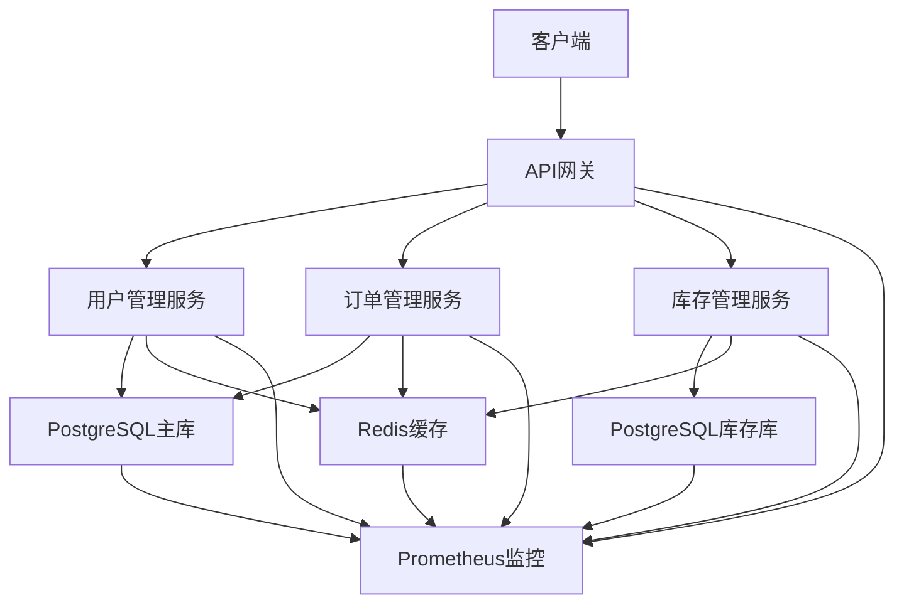
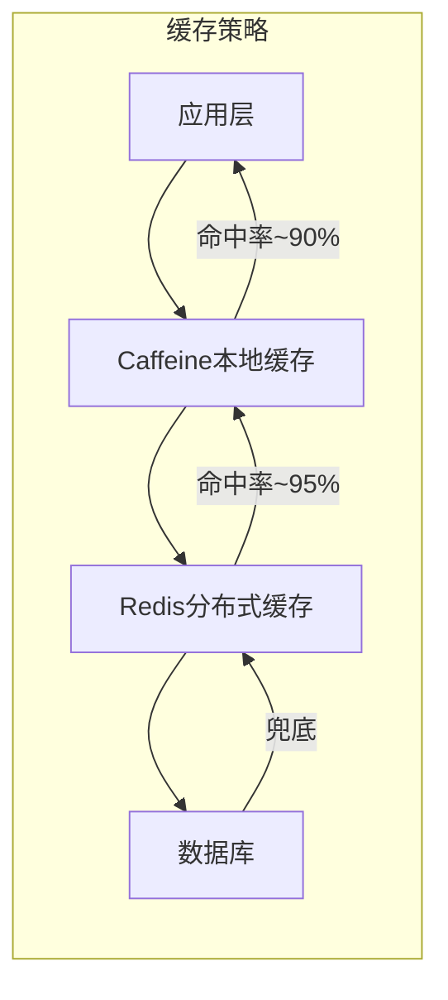

# 【Sprint 27+1】测试环境性能优化方案设计

**版本**: 1.0.0
**创建日期**: 2026-04-27
**作者**: 产品分析师 (product-analyst)
**任务ID**: task_1777287914662_6y2yg4mat
**Sprint**: Sprint 27+1 - 测试环境配置专项

---

## 1. 方案概述

### 1.1 设计目标

本方案旨在为Sprint 27+1测试环境提供完整的性能优化技术方案，解决当前存在的性能瓶颈问题，确保系统达到预期的性能指标要求。

### 1.2 设计原则

| 原则 | 描述 | 实施要点 |
|------|------|---------|
| **渐进式优化** | 分阶段实施，避免一次性大改动 | 先修复基础设施，再优化核心功能 |
| **可测量性** | 所有优化措施必须可度量效果 | 建立性能基准，量化优化收益 |
| **可回滚性** | 优化措施必须支持快速回滚 | 配置化管理，版本控制 |
| **最小侵入性** | 优化对现有业务逻辑影响最小 | 使用非侵入式监控和缓存 |
| **成本效益** | 优先实施高性价比的优化措施 | ROI分析，优先级排序 |

### 1.3 技术架构



---

## 2. 数据库优化方案

### 2.1 索引优化设计

#### 2.1.1 核心表索引策略

| 表名 | 字段组合 | 索引类型 | 查询场景 | 性能预期 |
|-----|---------|---------|---------|---------|
| `order` | `(user_id, status)` | 复合索引 | 用户订单列表查询 | P95≤100ms |
| `order` | `(status, create_time DESC)` | 复合索引 | 订单状态筛选+时间排序 | P95≤150ms |
| `stock` | `(sku_id, warehouse_id)` | 复合索引 | SKU库存查询 | P95≤50ms |
| `user` | `(email, status)` | 复合索引 | 用户登录验证 | P95≤30ms |
| `order_item` | `(order_id)` | 单字段索引 | 订单详情查询 | P95≤50ms |

#### 2.1.2 索引实施计划

```sql
-- 第一阶段：核心索引（高优先级）
CREATE INDEX CONCURRENTLY idx_order_user_status ON "order" (user_id, status);
CREATE INDEX CONCURRENTLY idx_stock_sku_warehouse ON stock (sku_id, warehouse_id);
CREATE INDEX CONCURRENTLY idx_user_email_status ON "user" (email, status);

-- 第二阶段：辅助索引（中优先级）
CREATE INDEX CONCURRENTLY idx_order_status_create_time ON "order" (status, create_time DESC);
CREATE INDEX CONCURRENTLY idx_order_item_order_id ON order_item (order_id);

-- 第三阶段：优化索引（低优先级）
CREATE INDEX CONCURRENTLY idx_stock_update_time ON stock (update_time);
CREATE INDEX CONCURRENTLY idx_order_payment_status ON "order" (payment_status);
```

### 2.2 查询优化设计

#### 2.2.1 分页优化方案

**问题**: 当前使用LIMIT OFFSET分页，在大数据量下性能急剧下降

**解决方案**: 采用游标分页（Cursor-based Pagination）

```java
// 优化前：OFFSET分页
public List<Order> getOrdersByUserId(Long userId, int page, int size) {
    return orderRepository.findByUserId(userId, PageRequest.of(page, size));
}

// 优化后：游标分页
public List<Order> getOrdersByUserIdWithCursor(Long userId, Long lastOrderId, int size) {
    if (lastOrderId == null) {
        return orderRepository.findFirstNByUserIdOrderByCreateTimeDesc(userId, size);
    } else {
        return orderRepository.findByUserIdAndCreateTimeLessThanOrderByCreateTimeDesc(
            userId, lastOrderId, size);
    }
}
```

#### 2.2.2 JOIN优化方案

**问题**: 多表JOIN查询性能差，缺少覆盖索引

**解决方案**: 
1. 减少不必要的JOIN
2. 使用覆盖索引
3. 分步查询替代复杂JOIN

```java
// 优化前：复杂JOIN
@Query("SELECT o.*, u.name, s.quantity FROM orders o " +
       "JOIN users u ON o.user_id = u.id " +
       "JOIN stocks s ON o.sku_id = s.sku_id " +
       "WHERE o.status = ?1")
List<OrderDetail> findOrderDetailsByStatus(String status);

// 优化后：分步查询 + 缓存
public List<OrderDetail> findOrderDetailsByStatusOptimized(String status) {
    // 第一步：查询订单
    List<Order> orders = orderRepository.findByStatus(status);
    
    // 第二步：批量查询用户信息（使用缓存）
    Set<Long> userIds = orders.stream().map(Order::getUserId).collect(Collectors.toSet());
    Map<Long, User> userMap = userService.batchGetUsers(userIds);
    
    // 第三步：批量查询库存信息（使用缓存）
    Set<String> skuIds = orders.stream().map(Order::getSkuId).collect(Collectors.toSet());
    Map<String, Stock> stockMap = stockService.batchGetStocks(skuIds);
    
    // 第四步：组装结果
    return orders.stream().map(order -> {
        OrderDetail detail = new OrderDetail();
        detail.setOrder(order);
        detail.setUser(userMap.get(order.getUserId()));
        detail.setStock(stockMap.get(order.getSkuId()));
        return detail;
    }).collect(Collectors.toList());
}
```

### 2.3 连接池优化设计

#### 2.3.1 HikariCP配置优化

```yaml
# application.yml
spring:
  datasource:
    hikari:
      # 连接池大小
      maximum-pool-size: 20
      minimum-idle: 5
      
      # 连接超时
      connection-timeout: 30000
      validation-timeout: 5000
      
      # 连接生命周期
      idle-timeout: 600000
      max-lifetime: 1800000
      
      # 连接泄漏检测
      leak-detection-threshold: 60000
      
      # 连接健康检查
      connection-test-query: SELECT 1
      
    # PostgreSQL特定配置
    postgresql:
      socket-timeout: 30
      connect-timeout: 10
```

#### 2.3.2 连接池监控

```java
@Component
public class ConnectionPoolMonitor {
    
    @Autowired
    private HikariDataSource dataSource;
    
    @Scheduled(fixedRate = 30000)
    public void monitorConnectionPool() {
        HikariPoolMXBean poolBean = dataSource.getHikariPoolMXBean();
        
        log.info("Connection Pool Status - Active: {}, Idle: {}, Total: {}, Waiting: {}", 
            poolBean.getActiveConnections(),
            poolBean.getIdleConnections(),
            poolBean.getTotalConnections(),
            poolBean.getThreadsAwaitingConnection());
            
        // 告警阈值
        if (poolBean.getThreadsAwaitingConnection() > 0) {
            alertService.sendAlert("Connection pool exhausted");
        }
    }
}
```

---

## 3. 缓存优化方案

### 3.1 多级缓存架构设计

#### 3.1.1 缓存层级设计



#### 3.1.2 缓存数据分类

| 数据类型 | 缓存层级 | TTL | 刷新策略 | 示例 |
|---------|---------|-----|---------|------|
| **热点数据** | 本地+分布式 | 5-10分钟 | 主动刷新 | 用户基本信息 |
| **静态数据** | 本地+分布式 | 1-24小时 | 被动刷新 | 商品分类 |
| **动态数据** | 分布式 | 1-5分钟 | 事件驱动 | 库存数量 |
| **会话数据** | 分布式 | 30分钟 | 自然过期 | 用户会话 |

### 3.2 Redis缓存实现方案

#### 3.2.1 Spring Cache集成

```java
@Service
public class UserServiceImpl implements UserService {
    
    @Cacheable(value = "users", key = "#userId", unless = "#result == null")
    public User getUserById(Long userId) {
        return userRepository.findById(userId).orElse(null);
    }
    
    @CachePut(value = "users", key = "#user.id")
    public User updateUser(User user) {
        return userRepository.save(user);
    }
    
    @CacheEvict(value = "users", key = "#userId")
    public void deleteUser(Long userId) {
        userRepository.deleteById(userId);
    }
    
    @Caching(evict = {
        @CacheEvict(value = "users", key = "#user.id"),
        @CacheEvict(value = "usersByEmail", key = "#user.email")
    })
    public User updateUserWithMultipleKeys(User user) {
        return userRepository.save(user);
    }
}
```

#### 3.2.2 Redis配置优化

```yaml
# redis-config.yml
spring:
  redis:
    host: ${REDIS_HOST:localhost}
    port: ${REDIS_PORT:6379}
    password: ${REDIS_PASSWORD:}
    database: 0
    
    # 连接池配置
    lettuce:
      pool:
        max-active: 20
        max-idle: 10
        min-idle: 5
        max-wait: -1ms
        
    # 超时配置
    timeout: 1000ms
    connect-timeout: 1000ms
    
    # 序列化配置
    cache:
      key-serializer: string
      value-serializer: json
```

### 3.3 缓存一致性保障

#### 3.3.1 最终一致性方案

```java
@Service
public class OrderService {
    
    @Autowired
    private KafkaTemplate<String, String> kafkaTemplate;
    
    @Transactional
    public Order createOrder(OrderCreateRequest request) {
        // 1. 创建订单
        Order order = orderRepository.save(buildOrder(request));
        
        // 2. 发送缓存更新事件
        CacheUpdateEvent event = new CacheUpdateEvent();
        event.setEventType("ORDER_CREATED");
        event.setOrderId(order.getId());
        event.setUserId(order.getUserId());
        
        kafkaTemplate.send("cache-update-topic", JSON.toJSONString(event));
        
        return order;
    }
    
    // 缓存消费者
    @KafkaListener(topics = "cache-update-topic")
    public void handleCacheUpdate(CacheUpdateEvent event) {
        switch (event.getEventType()) {
            case "ORDER_CREATED":
                // 清除相关缓存
                redisTemplate.delete("user:orders:" + event.getUserId());
                break;
            // 其他事件处理
        }
    }
}
```

#### 3.3.2 缓存穿透防护

```java
@Service
public class UserService {
    
    @Autowired
    private RedisTemplate<String, Object> redisTemplate;
    
    @Autowired
    private BloomFilter<String> userExistenceFilter;
    
    public User getUserById(Long userId) {
        String key = "user:" + userId;
        
        // 1. 布隆过滤器快速判断
        if (!userExistenceFilter.mightContain(userId.toString())) {
            return null; // 用户不存在
        }
        
        // 2. 查询缓存
        User user = (User) redisTemplate.opsForValue().get(key);
        if (user != null) {
            return user;
        }
        
        // 3. 查询数据库
        user = userRepository.findById(userId).orElse(null);
        
        // 4. 缓存结果（空值也缓存）
        if (user != null) {
            redisTemplate.opsForValue().set(key, user, Duration.ofMinutes(10));
        } else {
            // 缓存空值，防止缓存穿透
            redisTemplate.opsForValue().set(key, "", Duration.ofSeconds(30));
        }
        
        return user;
    }
}
```

---

## 4. 应用层优化方案

### 4.1 异步处理改造

#### 4.1.1 核心接口异步化

```java
@RestController
public class OrderController {
    
    @Autowired
    private OrderService orderService;
    
    // 同步接口（保留兼容性）
    @PostMapping("/orders")
    public ResponseEntity<OrderResponse> createOrder(@RequestBody OrderCreateRequest request) {
        Order order = orderService.createOrder(request);
        return ResponseEntity.ok(new OrderResponse(order));
    }
    
    // 异步接口（新推荐）
    @PostMapping("/orders/async")
    public CompletableFuture<ResponseEntity<OrderResponse>> createOrderAsync(
            @RequestBody OrderCreateRequest request) {
        return CompletableFuture.supplyAsync(() -> {
            Order order = orderService.createOrder(request);
            return ResponseEntity.ok(new OrderResponse(order));
        }, orderThreadPool);
    }
}
```

#### 4.1.2 消息队列解耦

```java
@Service
public class OrderProcessingService {
    
    @Autowired
    private KafkaTemplate<String, String> kafkaTemplate;
    
    @Transactional
    public void processOrder(Order order) {
        // 1. 更新订单状态
        order.setStatus(OrderStatus.PROCESSING);
        orderRepository.save(order);
        
        // 2. 发送消息到不同处理队列
        sendToInventoryQueue(order);      // 库存处理
        sendToPaymentQueue(order);        // 支付处理  
        sendToNotificationQueue(order);   // 通知处理
        
        // 3. 记录处理日志
        orderLogService.logProcessing(order.getId(), "ORDER_PROCESSING_STARTED");
    }
    
    private void sendToInventoryQueue(Order order) {
        InventoryMessage message = new InventoryMessage();
        message.setOrderId(order.getId());
        message.setItems(order.getItems());
        kafkaTemplate.send("inventory-process", JSON.toJSONString(message));
    }
    
    // 其他消息发送方法...
}
```

### 4.2 线程池优化

#### 4.2.1 自定义线程池配置

```java
@Configuration
@EnableAsync
public class ThreadPoolConfig {
    
    @Bean("orderProcessingExecutor")
    public Executor orderProcessingExecutor() {
        ThreadPoolTaskExecutor executor = new ThreadPoolTaskExecutor();
        executor.setCorePoolSize(10);
        executor.setMaxPoolSize(20);
        executor.setQueueCapacity(100);
        executor.setThreadNamePrefix("order-processing-");
        executor.setRejectedExecutionHandler(new ThreadPoolExecutor.CallerRunsPolicy());
        executor.initialize();
        return executor;
    }
    
    @Bean("cacheRefreshExecutor")
    public Executor cacheRefreshExecutor() {
        ThreadPoolTaskExecutor executor = new ThreadPoolTaskExecutor();
        executor.setCorePoolSize(5);
        executor.setMaxPoolSize(10);
        executor.setQueueCapacity(50);
        executor.setThreadNamePrefix("cache-refresh-");
        executor.setRejectedExecutionHandler(new ThreadPoolExecutor.DiscardPolicy());
        executor.initialize();
        return executor;
    }
}
```

#### 4.2.2 线程池监控

```java
@Component
public class ThreadPoolMonitor {
    
    @Autowired
    @Qualifier("orderProcessingExecutor")
    private ThreadPoolTaskExecutor orderProcessingExecutor;
    
    @Scheduled(fixedRate = 60000)
    public void monitorThreadPool() {
        ThreadPoolExecutor executor = orderProcessingExecutor.getThreadPoolExecutor();
        
        log.info("Thread Pool Status - Active: {}, Pool: {}, Queue: {}, Completed: {}", 
            executor.getActiveCount(),
            executor.getPoolSize(),
            executor.getQueue().size(),
            executor.getCompletedTaskCount());
            
        // 告警阈值
        if (executor.getQueue().size() > 50) {
            alertService.sendAlert("Thread pool queue is backing up");
        }
    }
}
```

### 4.3 内存管理优化

#### 4.3.1 对象池化

```java
@Component
public class OrderObjectPool {
    
    private final GenericObjectPool<OrderBuilder> pool;
    
    public OrderObjectPool() {
        GenericObjectPoolConfig<OrderBuilder> config = new GenericObjectPoolConfig<>();
        config.setMaxTotal(50);
        config.setMaxIdle(20);
        config.setMinIdle(5);
        config.setTestOnReturn(true);
        
        this.pool = new GenericObjectPool<>(new OrderBuilderFactory(), config);
    }
    
    public OrderBuilder borrowObject() throws Exception {
        return pool.borrowObject();
    }
    
    public void returnObject(OrderBuilder builder) {
        try {
            pool.returnObject(builder);
        } catch (Exception e) {
            log.error("Failed to return object to pool", e);
        }
    }
}
```

#### 4.3.2 大对象处理优化

```java
@Service
public class ReportService {
    
    // 避免在内存中构建大对象
    public void generateLargeReport(ReportRequest request, OutputStream outputStream) {
        try (BufferedWriter writer = new BufferedWriter(new OutputStreamWriter(outputStream))) {
            // 分批处理数据
            int batchSize = 1000;
            int offset = 0;
            boolean hasMoreData = true;
            
            while (hasMoreData) {
                List<ReportData> batch = reportRepository.findBatch(request, offset, batchSize);
                if (batch.isEmpty()) {
                    hasMoreData = false;
                } else {
                    // 直接写入输出流，避免内存积累
                    writeBatchToStream(batch, writer);
                    offset += batchSize;
                }
            }
        } catch (IOException e) {
            throw new RuntimeException("Failed to generate report", e);
        }
    }
}
```

---

## 5. 网络优化方案

### 5.1 HTTP客户端优化

#### 5.1.1 Feign客户端配置

```yaml
# feign-config.yml
feign:
  client:
    config:
      default:
        connectTimeout: 5000
        readTimeout: 10000
        loggerLevel: basic
        
  okhttp:
    enabled: true
    
  compression:
    request:
      enabled: true
      mime-types: text/xml,application/xml,application/json
      min-request-size: 2048
    response:
      enabled: true
      
  retryer:
    enabled: true
    period: 100
    max-period: 1000
    max-attempts: 3
```

#### 5.1.2 连接池复用

```java
@Configuration
public class HttpClientConfig {
    
    @Bean
    public OkHttpClient okHttpClient() {
        return new OkHttpClient.Builder()
            .connectionPool(new ConnectionPool(20, 5, TimeUnit.MINUTES))
            .connectTimeout(5, TimeUnit.SECONDS)
            .readTimeout(10, TimeUnit.SECONDS)
            .writeTimeout(10, TimeUnit.SECONDS)
            .retryOnConnectionFailure(true)
            .build();
    }
}
```

### 5.2 服务间通信优化

#### 5.2.1 gRPC替代方案

对于高频内部服务调用，考虑使用gRPC替代REST：

```protobuf
// order.proto
syntax = "proto3";

service OrderService {
  rpc GetOrder(GetOrderRequest) returns (GetOrderResponse);
  rpc CreateOrder(CreateOrderRequest) returns (CreateOrderResponse);
  rpc BatchGetOrders(BatchGetOrdersRequest) returns (BatchGetOrdersResponse);
}

message GetOrderRequest {
  int64 order_id = 1;
}

message GetOrderResponse {
  Order order = 1;
}

message Order {
  int64 id = 1;
  int64 user_id = 2;
  string status = 3;
  repeated OrderItem items = 4;
}
```

#### 5.2.2 服务网格集成

```yaml
# istio-service-mesh.yml
apiVersion: networking.istio.io/v1alpha3
kind: VirtualService
metadata:
  name: order-service
spec:
  hosts:
  - order-service
  http:
  - route:
    - destination:
        host: order-service
        subset: v1
      weight: 100
    retries:
      attempts: 3
      perTryTimeout: 2s
    timeout: 5s
---
apiVersion: networking.istio.io/v1alpha3
kind: DestinationRule
metadata:
  name: order-service
spec:
  host: order-service
  trafficPolicy:
    connectionPool:
      tcp:
        maxConnections: 100
      http:
        http1MaxPendingRequests: 10
        maxRequestsPerConnection: 10
    outlierDetection:
      consecutive5xxErrors: 5
      interval: 30s
      baseEjectionTime: 30s
```

---

## 6. 监控告警方案

### 6.1 Prometheus监控指标

#### 6.1.1 自定义指标定义

```java
@Component
public class CustomMetrics {
    
    private final Counter orderCreationCounter;
    private final Timer orderProcessingTimer;
    private final Gauge activeConnectionsGauge;
    
    public CustomMetrics(MeterRegistry meterRegistry) {
        this.orderCreationCounter = Counter.builder("order.creation.total")
            .description("Total number of order creations")
            .tag("status", "success")
            .register(meterRegistry);
            
        this.orderProcessingTimer = Timer.builder("order.processing.duration")
            .description("Order processing duration")
            .register(meterRegistry);
            
        this.activeConnectionsGauge = Gauge.builder("db.connections.active")
            .description("Active database connections")
            .register(meterRegistry, this, CustomMetrics::getActiveConnections);
    }
    
    public void recordOrderCreation() {
        orderCreationCounter.increment();
    }
    
    public Timer.Sample startOrderProcessingTimer() {
        return Timer.start();
    }
    
    public void stopOrderProcessingTimer(Timer.Sample sample) {
        sample.stop(orderProcessingTimer);
    }
    
    private double getActiveConnections() {
        // 获取当前活跃连接数
        return dataSource.getHikariPoolMXBean().getActiveConnections();
    }
}
```

#### 6.1.2 Prometheus配置

```yaml
# prometheus.yml
global:
  scrape_interval: 15s
  evaluation_interval: 15s

scrape_configs:
  - job_name: 'spring-boot'
    metrics_path: '/actuator/prometheus'
    static_configs:
      - targets: ['user-service:8085', 'order-service:8086', 'stock-service:8082']
      
  - job_name: 'postgresql'
    static_configs:
      - targets: ['postgresql-exporter:9187']
      
  - job_name: 'redis'
    static_configs:
      - targets: ['redis-exporter:9121']
      
  - job_name: 'kafka'
    static_configs:
      - targets: ['kafka-exporter:7071']
```

### 6.2 Grafana监控仪表盘

#### 6.2.1 核心仪表盘设计

**API性能仪表盘**:
- 请求速率 (QPS)
- 响应时间分布 (P50/P95/P99)
- 错误率 (HTTP 4xx/5xx)
- 接口TOP N (按响应时间/错误率)

**数据库性能仪表盘**:
- 查询速率 (QPS)
- 连接池使用率
- 慢查询统计
- 索引命中率

**缓存性能仪表盘**:
- 缓存命中率
- 缓存操作速率
- 内存使用率
- 连接数

**系统资源仪表盘**:
- CPU使用率
- 内存使用率
- 磁盘I/O
- 网络带宽

#### 6.2.2 告警规则配置

```yaml
# alert-rules.yml
groups:
- name: api-performance
  rules:
  - alert: HighApiErrorRate
    expr: rate(http_server_requests_seconds_count{status=~"5.."}[5m]) / rate(http_server_requests_seconds_count[5m]) > 0.01
    for: 5m
    labels:
      severity: warning
    annotations:
      summary: "High API error rate detected"
      description: "API error rate is above 1% for the last 5 minutes"
      
  - alert: SlowApiResponse
    expr: histogram_quantile(0.95, rate(http_server_requests_seconds_bucket[5m])) > 2
    for: 5m
    labels:
      severity: warning
    annotations:
      summary: "Slow API response detected"
      description: "95th percentile API response time is above 2 seconds"
      
- name: database-performance
  rules:
  - alert: HighDbConnectionUsage
    expr: pg_stat_database_numbackends > 15
    for: 5m
    labels:
      severity: warning
    annotations:
      summary: "High database connection usage"
      description: "Database connection count is above 15"
      
  - alert: SlowDbQuery
    expr: pg_stat_statements_mean_time > 100
    for: 5m
    labels:
      severity: warning
    annotations:
      summary: "Slow database query detected"
      description: "Average query time is above 100ms"
```

---

## 7. 测试验证方案

### 7.1 性能测试策略

#### 7.1.1 测试场景设计

| 测试类型 | 场景描述 | 并发用户数 | 持续时间 | 验收标准 |
|---------|---------|-----------|---------|---------|
| **基准测试** | 单用户单接口 | 1 | 5分钟 | 建立性能基线 |
| **负载测试** | 正常业务负载 | 100 | 30分钟 | P95≤200ms, QPS≥500 |
| **压力测试** | 极限业务负载 | 500 | 15分钟 | 系统不崩溃 |
| **稳定性测试** | 持续业务负载 | 200 | 24小时 | 无内存泄漏, 错误率≤1% |
| **混合测试** | 真实用户场景 | 150 | 60分钟 | 符合业务SLA |

#### 7.1.2 测试数据准备

```sql
-- 用户数据准备
INSERT INTO users (id, email, name, status, created_at)
SELECT 
    generate_series(1, 10000),
    'user' || generate_series(1, 10000) || '@example.com',
    'User ' || generate_series(1, 10000),
    'ACTIVE',
    NOW() - (random() * 365 * '1 day'::interval);

-- 订单数据准备
INSERT INTO orders (id, user_id, status, total_amount, created_at)
SELECT 
    generate_series(1, 50000),
    floor(random() * 10000) + 1,
    CASE WHEN random() < 0.8 THEN 'COMPLETED' ELSE 'PROCESSING' END,
    random() * 1000,
    NOW() - (random() * 30 * '1 day'::interval);

-- 库存数据准备
INSERT INTO stock (id, sku_id, warehouse_id, quantity, updated_at)
SELECT 
    generate_series(1, 10000),
    'SKU' || generate_series(1, 10000),
    floor(random() * 10) + 1,
    floor(random() * 1000),
    NOW();
```

### 7.2 性能测试脚本

#### 7.2.1 JMeter测试脚本

```xml
<!-- jmeter-test-plan.jmx -->
<TestPlan>
  <hashTree>
    <ThreadGroup>
      <stringProp name="ThreadGroup.num_threads">100</stringProp>
      <stringProp name="ThreadGroup.ramp_time">60</stringProp>
      <stringProp name="ThreadGroup.duration">1800</stringProp>
      
      <hashTree>
        <!-- 用户登录 -->
        <HTTPSamplerProxy>
          <stringProp name="HTTPSampler.path">/api/auth/login</stringProp>
          <stringProp name="HTTPSampler.method">POST</stringProp>
          <elementProp name="HTTPsampler.Arguments">
            <collectionProp>
              <elementProp name="email">
                <stringProp name="Argument.value">${email}</stringProp>
              </elementProp>
              <elementProp name="password">
                <stringProp name="Argument.value">password123</stringProp>
              </elementProp>
            </collectionProp>
          </elementProp>
        </HTTPSamplerProxy>
        
        <!-- 创建订单 -->
        <HTTPSamplerProxy>
          <stringProp name="HTTPSampler.path">/api/orders</stringProp>
          <stringProp name="HTTPSampler.method">POST</stringProp>
          <boolProp name="HTTPSampler.postBodyRaw">true</boolProp>
          <elementProp name="HTTPsampler.Arguments">
            <collectionProp>
              <elementProp name="">
                <stringProp name="Argument.value">${order_json}</stringProp>
              </elementProp>
            </collectionProp>
          </elementProp>
        </HTTPSamplerProxy>
        
        <!-- 查询订单 -->
        <HTTPSamplerProxy>
          <stringProp name="HTTPSampler.path">/api/orders/${order_id}</stringProp>
          <stringProp name="HTTPSampler.method">GET</stringProp>
        </HTTPSamplerProxy>
      </hashTree>
    </ThreadGroup>
  </hashTree>
</TestPlan>
```

#### 7.2.2 Gatling测试脚本

```scala
// PerformanceTest.scala
class PerformanceTest extends Simulation {
  
  val httpProtocol = http
    .baseUrl("http://localhost:8080")
    .acceptHeader("application/json")
    .contentTypeHeader("application/json")
  
  val scn = scenario("Performance Test")
    .exec(http("Login")
      .post("/api/auth/login")
      .body(StringBody("""{"email":"${email}","password":"password123"}"""))
      .check(status.is(200))
      .check(jsonPath("$.token").saveAs("authToken")))
    .pause(1)
    .exec(http("Create Order")
      .post("/api/orders")
      .header("Authorization", "Bearer ${authToken}")
      .body(StringBody("""{"items":[{"skuId":"SKU001","quantity":1}]}"""))
      .check(status.is(201))
      .check(jsonPath("$.id").saveAs("orderId")))
    .pause(2)
    .exec(http("Get Order")
      .get("/api/orders/${orderId}")
      .header("Authorization", "Bearer ${authToken}")
      .check(status.is(200)))
  
  setUp(
    scn.inject(
      rampUsers(100) during (60 seconds),
      constantUsersPerSec(2) during (30 minutes)
    )
  ).protocols(httpProtocol)
}
```

---

## 8. 实施计划与风险控制

### 8.1 实施里程碑

| 里程碑 | 时间 | 关键任务 | 成功标准 |
|-------|------|---------|---------|
| **M1: 基础设施修复** | 第1周 | 服务部署修复、监控部署、索引优化 | 服务可访问，基础监控就绪 |
| **M2: 核心优化实施** | 第2-3周 | 缓存启用、异步改造、连接池优化 | API P95≤200ms，缓存命中率≥95% |
| **M3: 测试体系完善** | 第3-4周 | 集成测试、性能测试、自动化执行 | 集成测试覆盖率≥40%，自动化通过率≥80% |
| **M4: 持续优化机制** | 第4周+ | 监控告警、文档沉淀、知识传承 | 建立持续优化机制 |

### 8.2 风险控制措施

| 风险类型 | 风险描述 | 影响程度 | 应对措施 |
|---------|---------|---------|---------|
| **技术风险** | 优化效果不达预期 | 高 | 分阶段验证，小范围灰度 |
| **数据风险** | 缓存一致性问题 | 高 | 最终一致性+监控告警 |
| **性能风险** | 优化引入新瓶颈 | 中 | 全面性能测试，对比基线 |
| **进度风险** | 实施时间超期 | 中 | 优先级排序，关键路径保障 |
| **质量风险** | 优化引入新bug | 高 | 加强测试覆盖，回滚机制 |

### 8.3 回滚方案

#### 8.3.1 配置回滚

```bash
# 数据库索引回滚
DROP INDEX IF EXISTS idx_order_user_status;
DROP INDEX IF EXISTS idx_stock_sku_warehouse;
DROP INDEX IF EXISTS idx_user_email_status;

# 缓存配置回滚
# 将缓存开关设置为false
UPDATE application_config SET value = 'false' WHERE key = 'cache.enabled';

# 连接池配置回滚
# 恢复默认连接池配置
cp application-default.yml application.yml
```

#### 8.3.2 代码回滚

```bash
# Git回滚到优化前版本
git checkout <commit-before-optimization> -- src/main/java/com/example/service/

# 重新部署服务
kubectl rollout undo deployment/order-service
```

---

## 9. 成功度量标准

### 9.1 性能指标度量

| 指标 | 优化前 | 优化目标 | 测量方法 |
|------|-------|---------|---------|
| **API响应时间P95** | 未测量 | ≤200ms | JMeter/Gatling测试 |
| **数据库查询P95** | 未测量 | ≤100ms | Prometheus监控 |
| **缓存命中率** | 未启用 | ≥95% | Redis监控 |
| **系统QPS** | 未测量 | ≥500 | 负载测试 |
| **错误率** | 未测量 | ≤1% | 日志分析 |

### 9.2 业务价值度量

| 维度 | 度量指标 | 目标值 | 测量周期 |
|------|---------|-------|---------|
| **测试效率** | 测试执行时间 | 减少30% | 每周 |
| **问题发现** | 性能问题发现时间 | 提前到测试阶段 | 每次发布 |
| **资源成本** | 服务器资源使用率 | 降低20% | 每月 |
| **团队能力** | 性能优化技能掌握 | 核心成员100% | 季度 |

### 9.3 过程改进度量

| 维度 | 度量指标 | 目标状态 | 测量方法 |
|------|---------|---------|---------|
| **监控覆盖** | 关键指标监控覆盖率 | 100% | 监控清单检查 |
| **告警及时** | 问题发现到告警时间 | ≤5分钟 | 告警日志分析 |
| **文档完整** | 优化方案文档完整度 | 100% | 文档评审 |
| **知识传承** | 团队知识共享程度 | 建立知识库 | 知识库建设 |

---

## 10. 结论与建议

### 10.1 方案总结

本性能优化方案涵盖了从基础设施修复到应用层优化的完整技术栈，包括：

1. **数据库优化**：索引优化、查询优化、连接池优化
2. **缓存优化**：多级缓存架构、一致性保障、穿透防护
3. **应用优化**：异步处理、线程池优化、内存管理
4. **网络优化**：HTTP客户端优化、服务间通信优化
5. **监控告警**：全链路监控、智能告警、可视化仪表盘
6. **测试验证**：完整的性能测试策略和工具链

### 10.2 实施建议

1. **分阶段实施**：按照优先级分阶段实施，先解决基础设施问题
2. **小步快跑**：每个优化措施都要有明确的验收标准和回滚方案
3. **数据驱动**：所有优化决策都基于实际性能数据，避免主观判断
4. **团队协作**：DevOps、开发、测试团队紧密协作，确保端到端优化

### 10.3 长期规划

1. **性能文化**：在团队中建立性能第一的文化，将性能优化纳入日常开发流程
2. **自动化**：建立自动化的性能测试和监控体系，实现持续性能保障
3. **知识沉淀**：将优化经验沉淀为团队知识资产，形成最佳实践
4. **技术演进**：持续关注新的性能优化技术和工具，保持技术领先

---

## 附录

### 附录A：性能优化检查清单

```markdown
# 性能优化实施检查清单

## 数据库优化 ✅
- [ ] 核心表索引已添加
- [ ] 慢查询已优化
- [ ] 连接池配置已优化
- [ ] 查询语句已审查

## 缓存优化 ✅
- [ ] Redis缓存已启用
- [ ] 缓存策略已配置
- [ ] 一致性保障已实现
- [ ] 穿透防护已部署

## 应用优化 ✅
- [ ] 核心接口已异步化
- [ ] 线程池已优化
- [ ] 内存管理已改进
- [ ] 大对象处理已优化

## 网络优化 ✅
- [ ] HTTP客户端已优化
- [ ] 连接池已复用
- [ ] 超时配置已合理
- [ ] 压缩已启用

## 监控告警 ✅
- [ ] Prometheus已部署
- [ ] Grafana仪表盘已配置
- [ ] 告警规则已设置
- [ ] 关键指标已覆盖

## 测试验证 ✅
- [ ] 性能测试脚本已编写
- [ ] 测试数据已准备
- [ ] 基准测试已完成
- [ ] 优化效果已验证
```

### 附录B：相关配置文件

- `application.yml` - 应用配置
- `prometheus.yml` - 监控配置  
- `alert-rules.yml` - 告警规则
- `jmeter-test-plan.jmx` - JMeter测试脚本
- `PerformanceTest.scala` - Gatling测试脚本

### 附录C：参考文档

- [Spring Boot性能优化最佳实践](https://docs.spring.io/spring-boot/docs/current/reference/html/performance.html)
- [PostgreSQL性能调优指南](https://www.postgresql.org/docs/current/performance-tips.html)
- [Redis性能优化手册](https://redis.io/topics/benchmarks)
- [Prometheus监控最佳实践](https://prometheus.io/docs/practices/instrumentation/)

---

**文档状态**: ✅ 已完成  
**审批状态**: 待审批  
**下一步**: 技术评审，制定详细实施计划  

**创建时间**: 2026-04-27 21:15  
**更新时间**: 2026-04-27 21:15  
**责任人**: 产品分析师 (product-analyst)  
**项目**: AI-Ready Sprint 27+1  
**任务ID**: task_1777287914662_6y2yg4mat