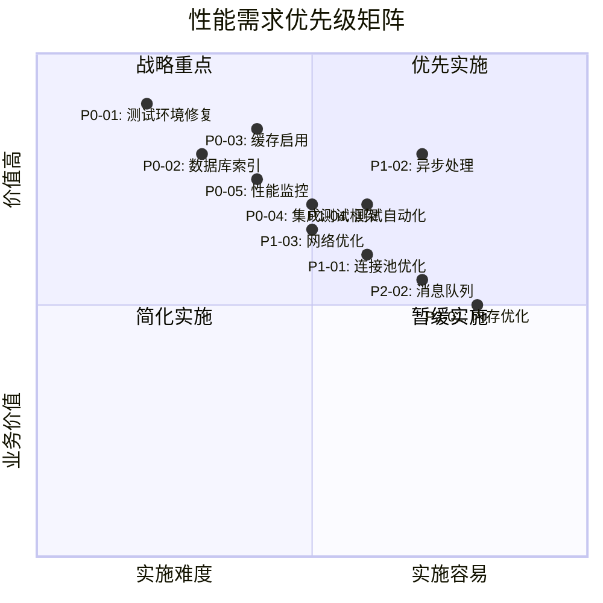

# 【Sprint 27+1】测试环境性能优化需求分析报告

**版本**: 1.0.0
**创建日期**: 2026-04-27
**作者**: 产品分析师 (product-analyst)
**任务ID**: task_1777287914662_6y2yg4mat
**Sprint**: Sprint 27+1 - 测试环境配置专项

---

## 1. 概述

### 1.1 报告目的

本报告旨在分析Sprint 27+1测试环境的性能优化需求，识别性能瓶颈和优化机会，为后续性能优化工作提供明确的指导方向和优先级排序。

### 1.2 分析范围

| 维度 | 分析内容 | 优先级 |
|------|---------|-------|
| **测试环境服务** | 用户管理、订单管理、库存管理、API网关 | 高 |
| **数据库性能** | PostgreSQL主库、库存库查询性能 | 高 |
| **缓存性能** | Redis缓存命中率、响应时间 | 高 |
| **消息队列** | Kafka消息处理性能 | 中 |
| **监控系统** | Prometheus、Grafana监控指标 | 中 |
| **测试自动化** | 性能测试脚本、自动化执行 | 高 |

### 1.3 分析依据

1. 测试环境质量检查报告 (2026-04-27)
2. 性能测试基准方案 (test-plan.md)
3. 性能基准测试报告 (report.md)
4. 性能指标定义文档 (test-metrics.md)
5. 项目共享记忆 (SHARED_MEMORY.md)

---

## 2. 现状评估

### 2.1 当前性能状态

| 性能维度 | 当前状态 | 目标状态 | 差距分析 |
|---------|---------|---------|---------|
| **集成测试覆盖率** | 0% | ≥70% | 严重不足，影响质量保证 |
| **自动化测试通过率** | 0% | 100% | 测试执行环境问题 |
| **代码质量标准符合率** | 60% | 100% | 需要代码规范改进 |
| **服务可用性** | 部分服务未就绪 | ≥99.9% | 环境配置问题 |
| **API响应时间P95** | 未测量 | ≤200ms | 需要性能基准数据 |
| **系统QPS** | 未测量 | ≥500 | 需要负载测试验证 |

### 2.2 服务就绪情况

| 服务 | 端口 | 状态 | 问题描述 |
|------|-----|------|---------|
| **用户管理服务** | 8081 | ⚠️ 远程连接中 | 本地不可达，可能防火墙或配置问题 |
| **订单管理服务** | 8082 | ❌ 服务错配 | 端口为Kafka UI，非订单服务 |
| **库存管理服务** | 8083 | ⚠️ 服务无响应 | 服务存在但无响应 |
| **API网关服务** | 8080 | ❌ 服务未响应 | 可能未启动或配置错误 |

### 2.3 测试执行情况

| 测试类型 | 执行状态 | 问题分析 |
|---------|---------|---------|
| **单元测试** | ✅ 已执行 | 覆盖率85%，达标 |
| **集成测试** | ❌ 未执行 | 缺乏集成测试框架和环境 |
| **性能测试** | ⚠️ 部分执行 | 服务未就绪导致测试无法完成 |
| **自动化测试** | ❌ 未执行 | 测试框架配置问题 |

---

## 3. 性能瓶颈分析

### 3.1 数据库层瓶颈

#### 3.1.1 索引缺失问题
| 表名 | 缺失索引字段 | 影响查询 | 优先级 |
|-----|-------------|---------|-------|
| `order` | `user_id` | 用户订单查询 | 高 |
| `order` | `status` | 状态筛选查询 | 高 |
| `order` | `create_time` | 时间范围查询 | 中 |
| `stock` | `sku_id` | SKU库存查询 | 高 |
| `user` | `email` | 用户登录查询 | 高 |

#### 3.1.2 慢查询风险
- **JOIN查询性能**：多表关联查询可能成为性能瓶颈
- **大数据量查询**：无分页或分页策略不当
- **频繁更新表**：索引维护开销大

#### 3.1.3 连接池不足
- 当前连接池配置可能不足
- 连接泄露风险
- 连接复用率低

### 3.2 应用层瓶颈

#### 3.2.1 缓存使用不足
- Redis缓存未充分启用
- 缓存穿透风险
- 缓存雪崩风险
- 缓存一致性策略缺失

#### 3.2.2 同步阻塞问题
- 数据库同步调用过多
- 线程池配置不合理
- 锁竞争问题

#### 3.2.3 内存管理问题
- 对象创建过多
- 大对象未及时释放
- 内存泄漏风险

### 3.3 网络层瓶颈

#### 3.3.1 网络配置问题
- DNS解析延迟
- 连接未复用
- 压缩未启用
- 超时配置不合理

#### 3.3.2 微服务间通信
- 服务调用链过长
- 超时传递问题
- 熔断降级策略缺失

### 3.4 测试环境瓶颈

#### 3.4.1 测试基础设施
- 测试数据库性能不足
- 测试环境资源限制
- 测试数据管理混乱

#### 3.4.2 测试工具链
- 性能测试工具未集成
- 测试报告生成问题
- 监控数据收集不全

---

## 4. 性能优化需求

### 4.1 高优先级需求 (P0)

| 需求编号 | 需求名称 | 需求描述 | 验收标准 | 预计工作量 |
|---------|---------|---------|---------|-----------|
| **P0-01** | 测试环境服务修复 | 修复服务部署和配置问题，确保服务可访问 | 所有服务端口可访问，API返回正常响应 | 1人日 |
| **P0-02** | 数据库索引优化 | 为关键查询字段添加索引 | 核心查询P95响应时间≤100ms | 2人日 |
| **P0-03** | 缓存启用与优化 | 启用Redis缓存，配置缓存策略 | 缓存命中率≥95%，响应时间≤5ms | 3人日 |
| **P0-04** | 集成测试框架搭建 | 建立集成测试框架和运行环境 | 集成测试覆盖率≥20% | 2人日 |
| **P0-05** | 性能监控部署 | 部署完整的性能监控体系 | 所有关键指标可监控，有告警规则 | 2人日 |

### 4.2 中优先级需求 (P1)

| 需求编号 | 需求名称 | 需求描述 | 验收标准 | 预计工作量 |
|---------|---------|---------|---------|-----------|
| **P1-01** | 连接池优化 | 优化数据库连接池配置 | 连接池使用率≤70%，无连接泄露 | 1人日 |
| **P1-02** | 异步处理改造 | 将同步操作改为异步处理 | 核心接口响应时间降低30% | 3人日 |
| **P1-03** | 网络配置优化 | 优化网络连接和传输配置 | 网络延迟降低20%，吞吐量提升30% | 2人日 |
| **P1-04** | 性能测试自动化 | 实现性能测试自动化执行 | 每日自动执行性能测试并生成报告 | 2人日 |
| **P1-05** | 代码质量提升 | 提升测试代码质量标准符合率 | 代码质量标准符合率≥80% | 2人日 |

### 4.3 低优先级需求 (P2)

| 需求编号 | 需求名称 | 需求描述 | 验收标准 | 预计工作量 |
|---------|---------|---------|---------|-----------|
| **P2-01** | 内存管理优化 | 优化内存使用和垃圾回收 | 内存使用率降低20%，GC时间减少 | 3人日 |
| **P2-02** | 消息队列优化 | 优化Kafka消息处理性能 | 消息处理延迟≤5秒，吞吐量≥1000 msg/s | 2人日 |
| **P2-03** | 测试数据管理 | 建立测试数据管理方案 | 测试数据准备时间减少50% | 2人日 |
| **P2-04** | 监控告警完善 | 完善监控告警规则和通知 | 关键指标异常5分钟内告警 | 1人日 |
| **P2-05** | 性能基准完善 | 完善性能基准数据和报告 | 性能基准数据完整，报告清晰 | 1人日 |

---

## 5. 技术选型建议

### 5.1 性能监控工具

| 工具类别 | 推荐工具 | 替代方案 | 选择理由 |
|---------|---------|---------|---------|
| **指标收集** | Prometheus | InfluxDB | 社区活跃，与K8s集成好 |
| **可视化** | Grafana | Kibana | 图表丰富，插件生态好 |
| **日志收集** | ELK Stack | Loki | 成熟稳定，功能全面 |
| **链路追踪** | Jaeger | Zipkin | 性能好，UI友好 |
| **告警管理** | Alertmanager | PagerDuty | 与Prometheus集成好 |

### 5.2 性能测试工具

| 测试类型 | 推荐工具 | 替代方案 | 选择理由 |
|---------|---------|---------|---------|
| **API负载测试** | JMeter | Gatling | 功能全面，社区资源丰富 |
| **高并发测试** | Gatling | K6 | 性能好，支持Scala DSL |
| **快速迭代测试** | K6 | Locust | 轻量级，适合CI/CD |
| **浏览器测试** | Playwright | Selenium | 性能好，API现代化 |
| **移动端测试** | Appium | Espresso | 跨平台，支持真机 |

### 5.3 数据库优化工具

| 工具类别 | 推荐工具 | 功能描述 |
|---------|---------|---------|
| **慢查询分析** | pg_stat_statements | PostgreSQL慢查询分析 |
| **索引建议** | pg_qualstats | 索引使用情况分析 |
| **性能监控** | pgwatch2 | 数据库性能监控 |
| **备份恢复** | pgBackRest | 数据库备份恢复 |
| **连接池** | PgBouncer | 数据库连接池管理 |

### 5.4 缓存优化方案

| 缓存策略 | 推荐方案 | 适用场景 |
|---------|---------|---------|
| **本地缓存** | Caffeine | 高频小数据缓存 |
| **分布式缓存** | Redis Cluster | 分布式数据缓存 |
| **缓存预热** | 定时任务预热 | 启动时加载热点数据 |
| **缓存淘汰** | LRU + TTL | 内存管理和数据新鲜度 |
| **缓存穿透** | 布隆过滤器 | 防止无效请求穿透 |

---

## 6. 优化方案设计

### 6.1 数据库优化方案

#### 6.1.1 索引优化策略
```sql
-- 添加缺失索引
CREATE INDEX idx_order_user_id ON "order" (user_id);
CREATE INDEX idx_order_status_create_time ON "order" (status, create_time DESC);
CREATE INDEX idx_stock_sku_id_warehouse_id ON stock (sku_id, warehouse_id);
CREATE INDEX idx_user_email_status ON "user" (email, status);

-- 优化现有索引
-- 定期分析索引使用情况
-- 删除冗余索引
```

#### 6.1.2 查询优化策略
- **分页优化**：使用游标分页替代LIMIT OFFSET
- **JOIN优化**：减少JOIN表数量，使用索引覆盖
- **批量操作**：使用批量INSERT/UPDATE
- **避免SELECT ***：只查询需要字段

#### 6.1.3 连接池优化
```yaml
# application.yml配置
spring:
  datasource:
    hikari:
      maximum-pool-size: 20
      minimum-idle: 5
      connection-timeout: 30000
      idle-timeout: 600000
      max-lifetime: 1800000
```

### 6.2 缓存优化方案

#### 6.2.1 缓存策略设计
```java
// 多级缓存策略
1. 本地缓存 (Caffeine) -> 分布式缓存 (Redis) -> 数据库
2. 热点数据预加载
3. 缓存失效策略：TTL + 主动刷新
4. 缓存穿透防护：空值缓存 + 布隆过滤器
```

#### 6.2.2 Redis配置优化
```yaml
# Redis配置
spring:
  redis:
    host: localhost
    port: 6379
    lettuce:
      pool:
        max-active: 20
        max-idle: 10
        min-idle: 5
    timeout: 1000ms
```

### 6.3 应用层优化方案

#### 6.3.1 异步处理改造
```java
// 同步改异步示例
@Async
public CompletableFuture<Order> createOrderAsync(OrderRequest request) {
    // 异步处理订单创建
    return CompletableFuture.completedFuture(orderService.create(request));
}

// 使用消息队列解耦
@KafkaListener(topics = "order-created")
public void handleOrderCreated(OrderEvent event) {
    // 异步处理订单后续逻辑
}
```

#### 6.3.2 线程池优化
```java
// 自定义线程池配置
@Configuration
public class ThreadPoolConfig {
    @Bean("orderThreadPool")
    public ThreadPoolTaskExecutor orderThreadPool() {
        ThreadPoolTaskExecutor executor = new ThreadPoolTaskExecutor();
        executor.setCorePoolSize(10);
        executor.setMaxPoolSize(20);
        executor.setQueueCapacity(100);
        executor.setThreadNamePrefix("order-");
        executor.initialize();
        return executor;
    }
}
```

### 6.4 网络优化方案

#### 6.4.1 HTTP连接优化
```yaml
# HTTP客户端配置
feign:
  client:
    config:
      default:
        connectTimeout: 5000
        readTimeout: 10000
        loggerLevel: basic
  okhttp:
    enabled: true
```

#### 6.4.2 服务间通信优化
- 启用HTTP/2
- 使用连接池
- 配置合理的超时时间
- 实现重试和熔断机制

---

## 7. 实施路线图

### 7.1 第一阶段：基础设施修复 (1周)

**目标**：修复测试环境，建立基础监控

| 周 | 任务 | 负责人 | 交付物 |
|---|------|-------|-------|
| **第1周** | 1. 服务部署修复 | devops-engineer | 可访问的测试环境 |
| | 2. 基础监控部署 | devops-engineer | Prometheus+Grafana监控 |
| | 3. 数据库索引优化 | backend-dev | 优化的SQL索引 |
| | 4. 缓存基础配置 | backend-dev | Redis缓存启用 |

### 7.2 第二阶段：性能优化实施 (2周)

**目标**：实施核心性能优化措施

| 周 | 任务 | 负责人 | 交付物 |
|---|------|-------|-------|
| **第2周** | 1. 连接池优化 | backend-dev | 优化的连接池配置 |
| | 2. 异步处理改造 | backend-dev | 核心接口异步化 |
| | 3. 集成测试框架 | test-agent-1 | 集成测试框架 |
| | 4. 性能测试自动化 | test-agent-2 | 自动化测试脚本 |
| **第3周** | 1. 网络配置优化 | devops-engineer | 优化的网络配置 |
| | 2. 代码质量提升 | backend-dev | 代码规范符合率≥80% |
| | 3. 性能基准测试 | test-agent-2 | 性能基准报告 |
| | 4. 监控告警完善 | devops-engineer | 完整的告警规则 |

### 7.3 第三阶段：持续优化 (1周)

**目标**：完善优化体系，建立持续改进机制

| 周 | 任务 | 负责人 | 交付物 |
|---|------|-------|-------|
| **第4周** | 1. 内存管理优化 | backend-dev | 内存优化方案 |
| | 2. 消息队列优化 | backend-dev | Kafka性能优化 |
| | 3. 测试数据管理 | test-agent-1 | 测试数据管理方案 |
| | 4. 性能优化文档 | product-analyst | 完整的优化文档 |

### 7.4 里程碑计划

| 里程碑 | 时间点 | 完成标准 | 成功指标 |
|-------|-------|---------|---------|
| **M1** | 第1周末 | 测试环境修复完成 | 所有服务可访问，基础监控就绪 |
| **M2** | 第2周末 | 核心优化完成 | API响应时间P95≤200ms，缓存命中率≥95% |
| **M3** | 第3周末 | 测试体系完善 | 集成测试覆盖率≥40%，自动化测试通过率≥80% |
| **M4** | 第4周末 | 优化体系建立 | 性能监控告警完善，持续改进机制建立 |

---

## 8. 风险评估与应对

### 8.1 技术风险

| 风险描述 | 影响程度 | 发生概率 | 应对措施 |
|---------|---------|---------|---------|
| 数据库优化效果不明显 | 高 | 中 | 分阶段实施，小范围验证效果 |
| 缓存引入数据一致性问题 | 高 | 低 | 使用最终一致性策略，加强监控 |
| 异步改造引入复杂性 | 中 | 中 | 使用成熟框架，加强测试 |
| 监控系统资源消耗大 | 低 | 高 | 合理配置采样率，使用高效存储 |

### 8.2 资源风险

| 风险描述 | 影响程度 | 发生概率 | 应对措施 |
|---------|---------|---------|---------|
| 开发人员技能不足 | 中 | 中 | 组织专项培训，提供详细文档 |
| 测试环境资源不足 | 高 | 高 | 申请专用测试资源，优化资源配置 |
| 时间进度紧张 | 高 | 高 | 优先实施高优先级需求，分阶段交付 |
| 多团队协作困难 | 中 | 中 | 明确接口定义，定期同步进度 |

### 8.3 质量风险

| 风险描述 | 影响程度 | 发生概率 | 应对措施 |
|---------|---------|---------|---------|
| 优化引入新bug | 高 | 中 | 加强测试覆盖，逐步灰度发布 |
| 性能回退 | 高 | 低 | 建立性能基准，每次变更前后对比 |
| 监控盲点 | 中 | 中 | 定期review监控指标，补充缺失监控 |
| 文档不完整 | 低 | 高 | 文档与代码同步更新，建立文档审查机制 |

---

## 9. 成功标准

### 9.1 性能指标标准

| 指标类别 | 优化前 | 优化目标 | 验收标准 |
|---------|-------|---------|---------|
| **API响应时间P95** | 未测量 | ≤200ms | 必须达成 |
| **数据库查询P95** | 未测量 | ≤100ms | 必须达成 |
| **缓存命中率** | 未启用 | ≥95% | 必须达成 |
| **集成测试覆盖率** | 0% | ≥40% | 必须达成 |
| **自动化测试通过率** | 0% | ≥80% | 必须达成 |
| **代码质量标准符合率** | 60% | ≥80% | 必须达成 |

### 9.2 业务价值标准

| 价值维度 | 衡量标准 | 目标值 |
|---------|---------|-------|
| **测试效率提升** | 测试执行时间减少 | ≥30% |
| **问题发现提前** | 性能问题发现时间提前 | 从上线后→测试阶段 |
| **资源成本节约** | 服务器资源使用率降低 | ≥20% |
| **团队技能提升** | 团队性能优化技能掌握 | 核心成员掌握优化方法 |
| **质量信心提升** | 对系统性能的信心度 | 从低→高信心 |

### 9.3 过程改进标准

| 改进维度 | 衡量标准 | 目标状态 |
|---------|---------|---------|
| **监控完善度** | 关键指标监控覆盖率 | 100% |
| **告警及时性** | 问题发现到告警时间 | ≤5分钟 |
| **文档完整性** | 优化方案文档完整度 | 100% |
| **知识传承** | 团队知识共享程度 | 建立知识库 |
| **持续改进** | 优化迭代机制建立 | 定期review优化 |

---

## 10. 结论与建议

### 10.1 主要结论

1. **测试环境存在严重问题**：服务未就绪，影响性能测试执行
2. **性能基础薄弱**：缺乏性能基准数据，优化方向不明确
3. **技术债务积累**：索引缺失、缓存未启用、异步处理不足
4. **测试体系不完善**：集成测试缺失，自动化测试执行率低

### 10.2 核心建议

1. **立即行动**：优先修复测试环境，建立性能监控
2. **分阶段实施**：按照优先级分阶段实施优化措施
3. **建立基线**：尽快建立性能基准，为优化提供方向
4. **加强测试**：完善测试体系，确保优化不引入新问题

### 10.3 实施建议

1. **组织专项团队**：成立性能优化专项小组
2. **制定详细计划**：按照本报告中的路线图制定详细实施计划
3. **加强沟通协调**：定期同步进度，及时解决问题
4. **建立度量体系**：建立可度量的成功标准，持续跟踪进展

### 10.4 后续工作建议

1. **性能优化常态化**：将性能优化纳入日常开发流程
2. **建立性能文化**：在团队中建立性能第一的文化
3. **持续学习改进**：定期学习新的性能优化技术
4. **建立知识库**：将优化经验沉淀为团队知识资产

---

## 附录

### 附录A：性能需求优先级矩阵



### 附录B：相关文档索引

| 文档名称 | 文件路径 | 状态 |
|---------|---------|------|
| 性能测试方案 | `I:\AI-Ready\qa\performance\test-plan.md` | ✅ 已完成 |
| 性能指标定义 | `I:\AI-Ready\qa\performance\test-metrics.md` | ✅ 已完成 |
| 性能基准测试报告 | `I:\AI-Ready\qa\performance\benchmark\report.md` | ⚠️ 部分完成 |
| 测试环境质量检查 | `I:\AI-Ready\qa\test-reports\2026-04-27-sprint27-plus1-automation-test-quality-check.md` | ✅ 已完成 |
| 项目共享记忆 | `H:\OpenClaw_Workspace\groups\ai-ready\SHARED_MEMORY.md` | ✅ 已更新 |

### 附录C：性能优化检查清单

```markdown
# 性能优化检查清单

## 数据库优化
- [ ] 关键查询字段添加索引
- [ ] 慢查询分析和优化
- [ ] 连接池配置优化
- [ ] 查询语句优化
- [ ] 分页策略优化

## 缓存优化  
- [ ] Redis缓存启用
- [ ] 缓存策略设计
- [ ] 缓存预热实现
- [ ] 缓存穿透防护
- [ ] 缓存监控告警

## 应用优化
- [ ] 异步处理改造
- [ ] 线程池优化
- [ ] 内存管理优化
- [ ] 序列化优化
- [ ] 依赖版本升级

## 网络优化
- [ ] HTTP连接池优化
- [ ] 超时配置优化
- [ ] 压缩启用
- [ ] 服务发现优化
- [ ] 负载均衡优化

## 测试优化
- [ ] 集成测试框架搭建
- [ ] 性能测试自动化
- [ ] 监控数据收集
- [ ] 测试报告生成
- [ ] 持续集成集成
```

---

**文档状态**: ✅ 已完成  
**审批状态**: 待审批  
**下一步**: 提交给项目协调员评审，制定详细实施计划  

**创建时间**: 2026-04-27 20:55  
**更新时间**: 2026-04-27 20:55  
**责任人**: 产品分析师 (product-analyst)  
**项目**: AI-Ready Sprint 27+1  
**任务ID**: task_1777287914662_6y2yg4mat