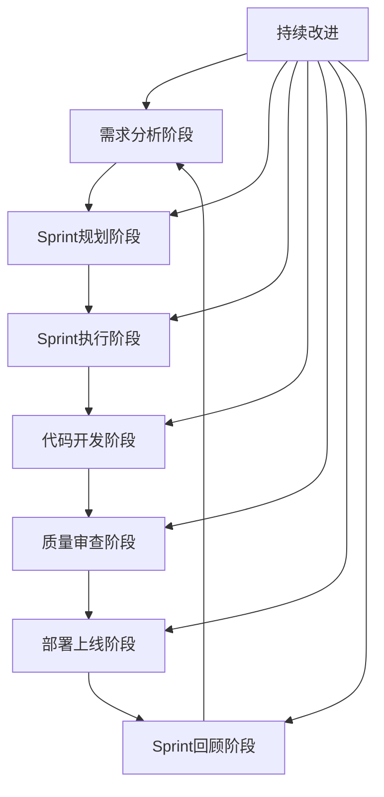

# ERP核心功能敏捷开发协作流程手册

## 📋 流程概述

本手册定义了ERP核心功能开发项目的敏捷开发协作流程，采用Scrum和Kanban相结合的混合模式，确保团队高效协作、进度透明可控。

## 🔄 整体工作流程



## 🗓️ 阶段一：需求分析阶段

### 1.1 需求收集
- **负责人**：product-analyst
- **输入**：业务需求、用户反馈、市场分析
- **输出**：需求文档、用户故事、验收标准
- **时间**：每个Sprint前2天

### 1.2 需求评审会议
- **时间**：每个Sprint前1天，14:00-15:30
- **参会人员**：product-analyst、coordinator、相关开发成员
- **议程**：
  1. 需求讲解（15分钟）
  2. 技术可行性评估（30分钟）
  3. 任务拆分讨论（30分钟）
  4. 风险识别与对策（15分钟）

### 1.3 验收标准定义
- **要求**：每个任务必须有明确的验收标准
- **格式**：
  ```
  ✅ 验收标准
  - [ ] 功能完整实现，无缺失功能点
  - [ ] 单元测试覆盖率≥80%
  - [ ] 集成测试通过，无阻断性问题
  - [ ] API接口文档完整
  - [ ] 代码通过代码审查
  ```

## 📋 阶段二：Sprint规划阶段

### 2.1 Sprint目标设定
- **负责人**：coordinator
- **输入**：需求文档、团队产能、优先级排序
- **输出**：Sprint目标、任务列表、故事点估算
- **时间**：每个Sprint第一天上午

### 2.2 任务拆分与估算
- **方法**：故事点估算（Fibonacci序列：1, 2, 3, 5, 8, 13）
- **原则**：
  - 每个任务≤8故事点
  - 任务描述清晰明确
  - 有明确的交付物和验收标准

### 2.3 任务分配原则
1. **技能匹配**：根据成员技能分配相应任务
2. **负载均衡**：确保成员任务量相对均衡
3. **知识传承**：重要模块至少2人掌握
4. **个人发展**：考虑成员技能提升需求

## 🏗️ 阶段三：Sprint执行阶段

### 3.1 每日站会
- **时间**：工作日9:00-9:15
- **地点**：项目群组（group_1775281918084_4yhkbw）
- **格式**：每人发言，限时1分钟
  ```
  1. 昨天完成的工作
  2. 今天计划的工作
  3. 遇到的阻塞或需要帮助的问题
  ```

### 3.2 任务状态管理
- **状态流转**：todo → in-progress → review → done
- **阻塞处理**：遇到阻塞立即上报，coordinator协调解决
- **进度更新**：每日至少更新一次任务状态

### 3.3 代码提交规范
- **分支策略**：feature/分支名（如feature/price-strategy）
- **提交信息格式**：
  ```
  feat: [任务ID] - 简要描述
  example: feat: task_1777962888541_fu2fs9z1t - 项目进度管理平台设计
  ```
- **提交频率**：每日至少提交一次

## 🔍 阶段四：代码开发阶段

### 4.1 开发环境规范
- **代码目录**：`I:\AI-Ready\backend\erp\模块名\`
- **项目结构**：遵循标准Maven项目结构
- **编码规范**：遵循Java编码规范，使用Lombok减少样板代码

### 4.2 单元测试要求
- **覆盖率**：≥80%（核心业务逻辑≥90%）
- **测试类命名**：`类名Test`（如`PriceStrategyServiceTest`）
- **测试数据**：使用测试数据工厂，避免硬编码

### 4.3 集成测试要求
- **测试范围**：模块间接口、数据库操作、外部服务
- **测试环境**：使用独立测试数据库
- **测试报告**：每次构建生成测试报告

## ✅ 阶段五：质量审查阶段

### 5.1 代码审查流程
- **触发条件**：PR/MR创建时自动触发
- **审查人员**：至少2人审查，其中1人必须是熟悉该模块的成员
- **审查时限**：24小时内完成审查
- **审查重点**：
  - 代码逻辑正确性
  - 代码规范符合度
  - 测试覆盖完整性
  - 性能和安全考虑

### 5.2 质量门禁检查
- **自动化检查项**：
  1. 代码编译检查
  2. 单元测试通过率
  3. 代码规范检查（Checkstyle/PMD）
  4. 安全漏洞扫描
  5. 性能基准测试
- **门禁标准**：所有检查项通过后方可合并

### 5.3 验收验证
- **验证人员**：任务创建者或coordinator
- **验证内容**：
  1. 所有验收标准是否满足
  2. 文档是否完整更新
  3. 是否有遗留问题
- **验证通过**：更新任务状态为done

## 🚀 阶段六：部署上线阶段

### 6.1 部署流程
- **环境顺序**：开发环境 → 测试环境 → 预生产环境 → 生产环境
- **部署方式**：自动化部署（Jenkins/GitLab CI/CD）
- **回滚机制**：每次部署必须有对应的回滚方案

### 6.2 上线检查清单
- [ ] 所有测试通过
- [ ] 代码审查完成
- [ ] 性能测试通过
- [ ] 安全扫描通过
- [ ] 监控配置就绪
- [ ] 备份恢复方案就绪

### 6.3 上线后监控
- **监控指标**：
  - 应用性能（响应时间、错误率）
  - 系统资源（CPU、内存、磁盘）
  - 业务指标（用户量、订单量）
- **告警机制**：关键指标异常立即告警

## 🔄 阶段七：Sprint回顾阶段

### 7.1 Sprint评审会议
- **时间**：Sprint最后一天下午，14:00-15:30
- **参会人员**：全体团队成员
- **议程**：
  1. Sprint成果展示（30分钟）
  2. 功能演示（30分钟）
  3. 数据指标分析（20分钟）
  4. 问答与反馈（10分钟）

### 7.2 Sprint回顾会议
- **时间**：Sprint评审会议后，15:30-16:30
- **形式**：安全的环境，鼓励开放讨论
- **讨论框架**：
  ```
  1. 哪些做得好，需要继续保持？
  2. 哪些可以改进，如何改进？
  3. 哪些需要停止，为什么？
  ```
- **输出**：改进项列表，明确负责人和完成时间

### 7.3 改进项跟踪
- **记录方式**：记录到项目共享内存
- **跟踪机制**：coordinator跟踪改进项落实
- **效果评估**：下个Sprint评估改进效果

## 📊 团队协作工具配置

### 8.1 主要工具清单
| 工具类型 | 工具名称 | 用途 | 负责人 |
|---------|---------|------|--------|
| 代码管理 | GitLab | 代码仓库、CI/CD | devops-engineer |
| 任务管理 | OpenClaw Task | 任务创建、分配、跟踪 | coordinator |
| 文档管理 | 项目空间 | 技术文档、决策记录 | doc-writer |
| 沟通工具 | OpenClaw Group | 团队沟通、站会 | 全体成员 |
| 监控告警 | Prometheus/Grafana | 应用监控、告警 | devops-engineer |
| 测试管理 | JUnit/TestNG | 自动化测试 | test-agent-1/test-agent-2 |

### 8.2 工具集成配置

#### 任务-代码关联
```yaml
# GitLab CI/CD配置示例
stages:
  - build
  - test
  - deploy
  - notify

notify_openclaw:
  stage: notify
  script:
    - curl -X POST ${OPENCLAW_WEBHOOK} \
      -H "Content-Type: application/json" \
      -d '{"taskId": "${CI_COMMIT_MESSAGE#feat: }", "status": "build_success"}'
```

#### 进度自动同步
- **触发条件**：代码合并到主分支
- **同步内容**：任务状态自动更新为review
- **通知机制**：相关成员收到状态变更通知

## 👥 团队成员职责

### 9.1 核心角色定义

#### coordinator（项目协调员）
- **主要职责**：
  - 任务拆解与分配
  - 进度跟踪与报告
  - 团队协调与沟通
  - 风险管理与应对
- **关键产出**：
  - Sprint计划
  - 进度报告
  - 团队效能分析

#### product-analyst（产品分析师）
- **主要职责**：
  - 需求收集与分析
  - 用户故事编写
  - 验收标准定义
  - 业务价值评估
- **关键产出**：
  - 需求文档
  - 用户故事
  - 功能规格说明

#### developer（开发人员）
- **主要职责**：
  - 功能开发与实现
  - 代码编写与测试
  - 技术问题解决
  - 代码质量保证
- **关键产出**：
  - 功能代码
  - 单元测试
  - 技术文档

#### qa-lead（质量负责人）
- **主要职责**：
  - 测试方案设计
  - 质量门禁管理
  - 缺陷跟踪与分析
  - 质量报告编写
- **关键产出**：
  - 测试报告
  - 质量指标
  - 改进建议

#### devops-engineer（运维工程师）
- **主要职责**：
  - 环境配置与管理
  - 部署流程优化
  - 监控告警配置
  - 性能优化
- **关键产出**：
  - 部署脚本
  - 监控配置
  - 运维文档

## 📈 效能指标与报告

### 10.1 关键效能指标

#### 交付效能指标
- **速度**：每个Sprint完成的故事点数
- **吞吐量**：每周完成的任务数量
- **周期时间**：任务从创建到完成的时间
- **流动效率**：实际工作时间占比

#### 质量效能指标
- **缺陷密度**：每千行代码的bug数量
- **测试覆盖率**：代码被测试覆盖的比例
- **代码审查效率**：代码审查平均时间
- **部署成功率**：一次部署成功的比例

### 10.2 报告机制

#### 每日报告
- **时间**：每日17:00
- **内容**：当日进度、明日计划、阻塞问题
- **形式**：项目群组消息

#### 每周报告
- **时间**：每周五16:00
- **内容**：本周总结、下周计划、风险分析
- **形式**：结构化文档

#### Sprint报告
- **时间**：Sprint结束日
- **内容**：Sprint成果、效能分析、改进计划
- **形式**：完整报告文档

---

**手册版本**：v1.0  
**生效时间**：2026-05-05  
**维护负责人**：coordinator  
**更新频率**：每季度评审更新一次