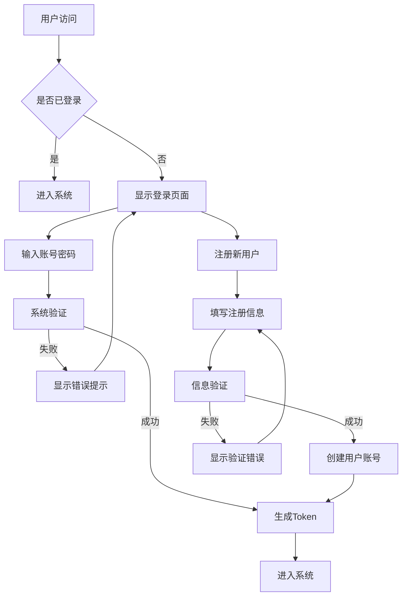
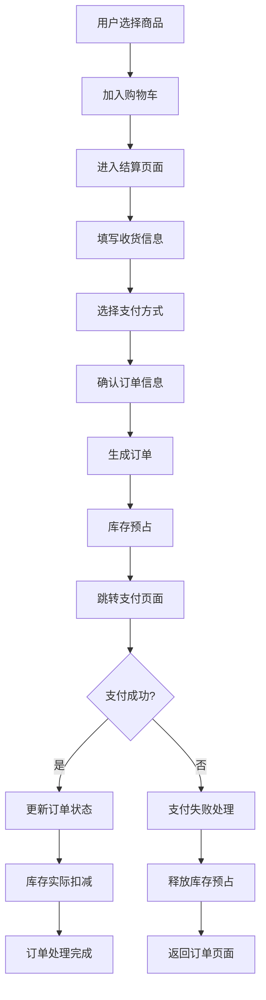
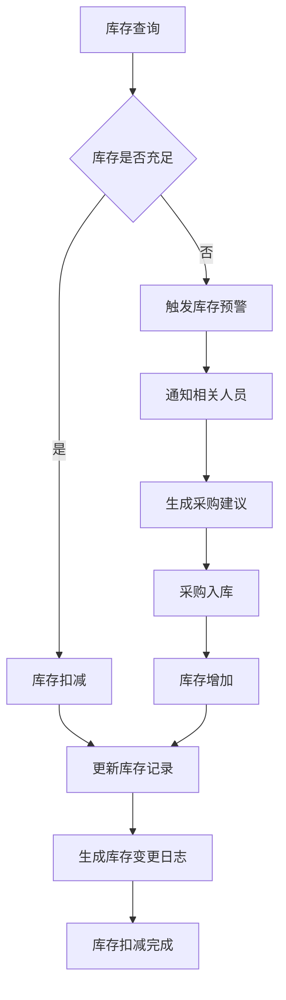

# Sprint 27+1 测试环境业务需求分析

## 📋 业务需求概述

### 分析目标
为Sprint 27+1测试环境制定全面的业务需求分析，确保测试环境能够完整支持项目业务功能，并为业务验收提供明确标准。

### 分析范围
- **用户管理业务**：认证、授权、用户信息管理
- **订单管理业务**：订单创建、查询、状态管理
- **库存管理业务**：库存查询、扣减、预警管理
- **采购管理业务**：采购流程、供应商管理
- **财务管理业务**：账务管理、报表统计
- **AI服务业务**：智能推荐、数据分析

## 🎯 核心业务需求

### 1. 用户管理业务需求

#### 1.1 认证管理需求
| 业务功能 | 功能描述 | 业务规则 | 优先级 |
|----------|----------|----------|--------|
| 用户注册 | 新用户注册账号 | 1. 用户名唯一性验证 2. 密码复杂度检查 3. 邮箱/手机验证 4. 注册信息完整性检查 | P0 |
| 用户登录 | 用户登录系统 | 1. 账号密码验证 2. 登录失败锁定 3. 登录日志记录 4. Token生成管理 | P0 |
| 密码管理 | 密码修改重置 | 1. 旧密码验证 2. 新密码复杂度 3. 密码修改通知 4. 密码重置流程 | P0 |
| 会话管理 | 用户会话管理 | 1. Token有效期管理 2. 会话续期机制 3. 多设备登录管理 4. 强制下线功能 | P1 |

#### 1.2 权限管理需求
| 业务功能 | 功能描述 | 业务规则 | 优先级 |
|----------|----------|----------|--------|
| 角色管理 | 系统角色定义 | 1. 角色创建修改 2. 角色权限分配 3. 角色用户关联 4. 角色继承机制 | P0 |
| 权限控制 | 细粒度权限控制 | 1. 接口级权限控制 2. 数据级权限控制 3. 操作级权限控制 4. 权限验证机制 | P0 |
| 用户组管理 | 用户分组管理 | 1. 用户组创建 2. 用户组成员管理 3. 用户组权限继承 4. 用户组解散 | P1 |
| 权限审计 | 权限操作审计 | 1. 权限变更记录 2. 权限使用日志 3. 权限异常监控 4. 权限审计报表 | P2 |

### 2. 订单管理业务需求

#### 2.1 订单创建需求
| 业务功能 | 功能描述 | 业务规则 | 优先级 |
|----------|----------|----------|--------|
| 购物车管理 | 商品加入购物车 | 1. 商品数量验证 2. 库存实时检查 3. 价格计算规则 4. 促销活动应用 | P0 |
| 订单生成 | 生成正式订单 | 1. 收货地址验证 2. 支付方式选择 3. 发票信息填写 4. 订单备注支持 | P0 |
| 订单确认 | 用户确认订单 | 1. 订单信息确认 2. 价格最终确认 3. 库存预占锁定 4. 订单状态更新 | P0 |
| 订单拆分 | 按仓库拆分订单 | 1. 多仓库库存检查 2. 运费分开计算 3. 物流拆分规则 4. 子订单关联管理 | P1 |

#### 2.2 订单处理需求
| 业务功能 | 功能描述 | 业务规则 | 优先级 |
|----------|----------|----------|--------|
| 订单支付 | 订单支付处理 | 1. 支付方式对接 2. 支付状态同步 3. 支付超时处理 4. 支付异常处理 | P0 |
| 订单发货 | 订单发货处理 | 1. 发货单生成 2. 物流公司对接 3. 物流单号获取 4. 发货状态更新 | P0 |
| 订单收货 | 用户确认收货 | 1. 收货确认操作 2. 自动确认规则 3. 售后时效计算 4. 订单完成处理 | P0 |
| 订单取消 | 订单取消处理 | 1. 取消条件检查 2. 库存释放规则 3. 退款流程触发 4. 取消原因记录 | P0 |

#### 2.3 订单查询需求
| 业务功能 | 功能描述 | 业务规则 | 优先级 |
|----------|----------|----------|--------|
| 订单列表 | 订单列表查询 | 1. 分页查询支持 2. 多种排序方式 3. 条件过滤查询 4. 列表字段定制 | P0 |
| 订单详情 | 订单详细信息 | 1. 完整订单信息 2. 商品详情展示 3. 物流跟踪信息 4. 操作历史记录 | P0 |
| 订单搜索 | 订单高级搜索 | 1. 多条件组合搜索 2. 模糊搜索支持 3. 时间范围搜索 4. 搜索历史记录 | P1 |
| 订单统计 | 订单数据统计 | 1. 订单数量统计 2. 订单金额统计 3. 商品销量统计 4. 用户购买统计 | P1 |

### 3. 库存管理业务需求

#### 3.1 库存基础需求
| 业务功能 | 功能描述 | 业务规则 | 优先级 |
|----------|----------|----------|--------|
| 库存查询 | 商品库存查询 | 1. 实时库存查询 2. 多维度库存查询 3. 库存变化历史 4. 库存预警提示 | P0 |
| 库存扣减 | 订单库存扣减 | 1. 库存预占机制 2. 库存实时扣减 3. 库存不足处理 4. 扣减失败回滚 | P0 |
| 库存增加 | 采购入库增加 | 1. 采购入库处理 2. 库存调整增加 3. 退货入库处理 4. 库存盘点调整 | P0 |
| 库存同步 | 多系统库存同步 | 1. 库存数据同步 2. 库存变更通知 3. 库存一致性检查 4. 同步异常处理 | P1 |

#### 3.2 库存预警需求
| 业务功能 | 功能描述 | 业务规则 | 优先级 |
|----------|----------|----------|--------|
| 库存预警 | 库存不足预警 | 1. 预警阈值设置 2. 预警级别划分 3. 预警通知机制 4. 预警处理跟踪 | P0 |
| 库存上限 | 库存过剩预警 | 1. 库存上限设置 2. 呆滞库存识别 3. 库存周转分析 4. 库存优化建议 | P1 |
| 安全库存 | 安全库存管理 | 1. 安全库存计算 2. 补货建议生成 3. 采购计划关联 4. 库存风险预警 | P1 |
| 库存分析 | 库存数据分析 | 1. 库存周转率计算 2. 库存成本分析 3. 库存结构分析 4. 库存趋势预测 | P2 |

### 4. AI服务业务需求

#### 4.1 智能推荐需求
| 业务功能 | 功能描述 | 业务规则 | 优先级 |
|----------|----------|----------|--------|
| 个性化推荐 | 基于用户行为推荐 | 1. 用户画像构建 2. 推荐算法集成 3. 实时推荐计算 4. 推荐效果评估 | P0 |
| 关联推荐 | 商品关联推荐 | 1. 商品关联分析 2. 购物篮分析 3. 交叉销售推荐 4. 提升销售推荐 | P0 |
| 热门推荐 | 热门商品推荐 | 1. 实时热度计算 2. 热门趋势分析 3. 季节性推荐 4. 新品推荐 | P1 |
| 场景推荐 | 特定场景推荐 | 1. 促销场景推荐 2. 节日场景推荐 3. 用户场景识别 4. 场景化推荐策略 | P1 |

#### 4.2 数据分析需求
| 业务功能 | 功能描述 | 业务规则 | 优先级 |
|----------|----------|----------|--------|
| 用户分析 | 用户行为分析 | 1. 用户活跃分析 2. 用户价值分析 3. 用户流失预警 4. 用户分群分析 | P0 |
| 销售分析 | 销售数据分析 | 1. 销售趋势分析 2. 商品销售分析 3. 渠道销售分析 4. 促销效果分析 | P0 |
| 库存分析 | 库存数据分析 | 1. 库存周转分析 2. 库存成本分析 3. 库存预警分析 4. 库存优化分析 | P1 |
| 运营分析 | 运营数据分析 | 1. 运营效率分析 2. 服务质量分析 3. 成本效益分析 4. KPI指标分析 | P1 |

## 🔍 业务流程需求

### 1. 用户注册登录流程

### 2. 订单创建支付流程

### 3. 库存管理流程

## ⚠️ 业务异常处理需求

### 1. 用户管理异常
| 异常场景 | 异常描述 | 处理机制 | 用户体验 |
|----------|----------|----------|----------|
| 重复注册 | 用户名/邮箱已存在 | 1. 实时验证提示 2. 提供修改建议 3. 保留已填信息 | 友好提示，保留进度 |
| 登录失败 | 账号密码错误 | 1. 错误次数限制 2. 账户锁定机制 3. 解锁流程指引 | 明确错误原因，提供解决方案 |
| 密码重置 | 忘记密码 | 1. 邮箱/手机验证 2. 安全验证机制 3. 临时密码生成 | 流程简单，安全可靠 |
| 会话过期 | Token过期失效 | 1. 自动刷新机制 2. 重新登录提示 3. 数据自动保存 | 无感知刷新或友好提示 |

### 2. 订单管理异常
| 异常场景 | 异常描述 | 处理机制 | 用户体验 |
|----------|----------|----------|----------|
| 库存不足 | 下单时库存不足 | 1. 实时库存检查 2. 替代商品推荐 3. 到货通知功能 | 及时提示，提供备选方案 |
| 支付失败 | 支付过程失败 | 1. 支付状态同步 2. 订单状态回滚 3. 重新支付引导 | 明确失败原因，简化重试流程 |
| 地址错误 | 收货地址无效 | 1. 地址验证检查 2. 地址修改功能 3. 物流公司验证 | 提前验证，避免后续问题 |
| 订单取消 | 用户取消订单 | 1. 取消条件检查 2. 退款流程启动 3. 库存及时释放 | 流程清晰，退款及时 |

### 3. 库存管理异常
| 异常场景 | 异常描述 | 处理机制 | 业务影响 |
|----------|----------|----------|----------|
| 库存超卖 | 库存扣减后为负 | 1. 实时库存锁定 2. 库存预警监控 3. 紧急补货机制 | 避免业务损失，及时补货 |
| 库存同步失败 | 多系统库存不一致 | 1. 定期库存同步 2. 差异自动修复 3. 人工核对机制 | 保证数据一致性 |
| 库存预警 | 库存低于安全线 | 1. 多级预警通知 2. 自动采购建议 3. 库存优化分析 | 提前预警，避免断货 |
| 库存盘点差异 | 盘点结果不一致 | 1. 差异原因分析 2. 库存调整审批 3. 流程优化建议 | 规范流程，减少差异 |

## ✅ 业务验收标准

### 1. 功能完整性标准

#### 1.1 用户管理功能标准
- [ ] 用户注册功能完整，支持邮箱/手机验证
- [ ] 用户登录功能正常，支持Token认证
- [ ] 权限管理功能完善，支持RBAC模型
- [ ] 用户信息管理功能完整，支持CRUD操作
- [ ] 安全防护功能有效，防刷机制生效

#### 1.2 订单管理功能标准
- [ ] 购物车功能完整，支持商品增删改查
- [ ] 订单创建功能正常，支持多种支付方式
- [ ] 订单查询功能完善，支持多条件搜索
- [ ] 订单处理功能完整，支持状态流转
- [ ] 订单统计功能准确，数据计算正确

#### 1.3 库存管理功能标准
- [ ] 库存查询功能准确，实时数据正确
- [ ] 库存扣减功能正常，支持预占机制
- [ ] 库存预警功能有效，及时发送通知
- [ ] 库存同步功能完善，多系统数据一致
- [ ] 库存分析功能完整，报表数据准确

### 2. 业务流程标准

#### 2.1 流程完整性标准
- [ ] 用户注册登录流程完整，无中断
- [ ] 订单创建支付流程顺畅，无阻塞
- [ ] 库存管理流程规范，符合业务规则
- [ ] 业务审批流程完整，支持多级审批
- [ ] 异常处理流程完善，覆盖主要异常

#### 2.2 流程效率标准
- [ ] 用户注册时间 ≤ 2分钟
- [ ] 订单创建时间 ≤ 1分钟
- [ ] 库存查询响应 ≤ 3秒
- [ ] 业务审批流转 ≤ 30分钟
- [ ] 异常处理响应 ≤ 15分钟

### 3. 数据准确性标准

#### 3.1 数据完整性标准
- [ ] 业务数据完整，无缺失字段
- [ ] 数据关联正确，外键关系正常
- [ ] 历史数据可追溯，操作日志完整
- [ ] 数据备份完整，支持恢复验证
- [ ] 数据迁移准确，无数据丢失

#### 3.2 数据一致性标准
- [ ] 多系统数据一致，无差异
- [ ] 实时数据准确，无延迟
- [ ] 统计数据正确，计算无误
- [ ] 缓存数据同步，无脏数据
- [ ] 事务数据一致，无部分提交

### 4. 异常处理标准

#### 4.1 异常覆盖标准
- [ ] 覆盖80%以上业务异常场景
- [ ] 异常处理机制完善，有明确处理流程
- [ ] 异常信息友好，用户可理解
- [ ] 异常日志完整，便于问题定位
- [ ] 异常恢复机制，支持自动恢复

#### 4.2 异常处理效率
- [ ] 异常检测时间 ≤ 1分钟
- [ ] 异常响应时间 ≤ 5分钟
- [ ] 异常解决时间 ≤ 30分钟
- [ ] 异常影响范围最小化
- [ ] 异常经验积累，形成知识库

## 📈 业务测试策略

### 1. 功能测试策略
- **单元测试**：覆盖核心业务逻辑
- **集成测试**：验证系统间集成
- **系统测试**：验证完整业务流程
- **验收测试**：用户验收验证

### 2. 性能测试策略
- **基准测试**：验证基础性能
- **负载测试**：验证正常负载表现
- **压力测试**：验证极限处理能力
- **稳定性测试**：验证长时间运行

### 3. 安全测试策略
- **功能安全测试**：验证权限控制
- **数据安全测试**：验证数据保护
- **接口安全测试**：验证API安全
- **渗透测试**：模拟攻击验证

## 📋 实施计划

### 阶段一：需求分析确认（第1周）
1. 业务需求评审确认
2. 业务流程梳理优化
3. 验收标准制定确认
4. 测试计划制定

### 阶段二：测试用例设计（第2周）
1. 功能测试用例设计
2. 流程测试用例设计
3. 异常测试用例设计
4. 性能测试用例设计

### 阶段三：测试执行验证（第3-4周）
1. 功能测试执行
2. 流程测试执行
3. 异常测试执行
4. 性能测试执行

### 阶段四：验收报告编制（第5周）
1. 测试结果分析
2. 问题跟踪解决
3. 验收报告编写
4. 经验总结归档

## 📝 更新记录

| 版本 | 日期 | 修改内容 | 修改人 |
|------|------|----------|--------|
| v1.0 | 2026-04-27 | 初始版本创建 | 产品分析师 |
| | | | |

---

**文档状态**：✅ 已完成  
**下一步**：基于此业务需求分析，制定详细的业务验收标准和测试用例