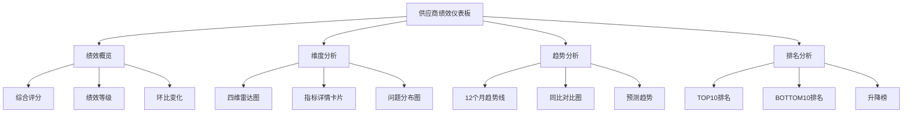

# 供应商绩效数据分析报告设计文档

## 📋 文档概述
**版本**: 1.0.0
**创建日期**: 2026-05-01
**作者**: 产品分析师
**项目**: AI-Ready ERP核心功能开发专项 (Sprint 27+1)
**文档类型**: 需求分析与设计文档

## 🎯 报告目标与业务价值

### 1. 核心目标
- 为采购管理团队提供全面的供应商绩效评估工具
- 基于数据驱动的供应商管理决策支持
- 提升供应商协作效率和管理质量
- 降低采购成本和风险

### 2. 业务价值
- **量化评估**：将供应商绩效从主观评价转为客观数据指标
- **趋势洞察**：识别供应商绩效变化趋势，提前预警风险
- **决策支持**：基于绩效数据制定供应商分级、续约、淘汰决策
- **持续改进**：为供应商提供改进方向，促进供应链优化

## 🔍 用户需求分析

### 1. 用户角色与使用场景
| 用户角色 | 使用场景 | 核心需求 |
|---------|---------|---------|
| **采购经理** | 供应商季度评估会议 | 全面的绩效概览、趋势分析、对比分析 |
| **采购专员** | 日常供应商管理 | 实时绩效数据、问题跟踪、改进建议 |
| **质量经理** | 供应商质量审核 | 质量指标详情、不良率分析、整改跟踪 |
| **财务人员** | 供应商付款审批 | 付款绩效、价格竞争力、成本节省分析 |
| **供应链总监** | 战略供应商管理 | 综合绩效评分、风险预警、战略决策支持 |

### 2. 关键业务决策点
1. **供应商分级决策**：基于绩效评分确定A/B/C/D级供应商
2. **订单分配决策**：根据绩效分配采购订单量
3. **价格谈判决策**：基于价格绩效制定谈判策略
4. **供应商续约决策**：综合绩效决定是否续约
5. **供应商淘汰决策**：连续低绩效供应商淘汰

## 📊 分析维度设计

### 1. 时间维度
- **时间粒度**：
  - 日度：实时监控
  - 月度：常规评估
  - 季度：全面评估
  - 年度：战略评估
- **时间对比**：
  - 环比分析（与前周期对比）
  - 同比分析（与去年同期对比）
  - 趋势分析（3个月、6个月、12个月趋势）

### 2. 供应商维度
- **供应商分类**：
  - 按类型：生产商、代理商、贸易商
  - 按地区：国内、国际、区域
  - 按规模：大型（>1000人）、中型（100-1000人）、小型（<100人）
  - 按合作时长：新供应商（<1年）、中期（1-3年）、长期（>3年）
- **供应商分级**：A级（优秀）、B级（良好）、C级（合格）、D级（不合格）

### 3. 产品维度
- **产品类别**：原材料、零部件、成品、耗材
- **物料组**：按物料编码分组
- **采购金额**：按金额区间分组（<1万、1-10万、10-100万、>100万）
- **采购频次**：高频（每周多次）、中频（每周1次）、低频（每月1次）

### 4. 绩效维度（核心指标体系）

#### 4.1 质量绩效（权重：35%）
| 指标 | 计算公式 | 目标值 | 数据来源 |
|------|----------|--------|----------|
| **交货合格率** | 合格批次 / 总批次 × 100% | ≥98% | 质检系统 |
| **质量缺陷率** | 缺陷数量 / 总数量 × 100% | ≤2% | 质检系统 |
| **退货率** | 退货金额 / 采购金额 × 100% | ≤1% | 采购系统 |
| **质量投诉次数** | 累计投诉次数 | 0次 | 客服系统 |

#### 4.2 交付绩效（权重：25%）
| 指标 | 计算公式 | 目标值 | 数据来源 |
|------|----------|--------|----------|
| **准时交付率** | 准时交付订单 / 总订单 × 100% | ≥95% | 物流系统 |
| **平均交付周期** | ∑(实际交付日 - 承诺交付日) / 订单数 | ≤承诺天数+1 | 物流系统 |
| **紧急订单满足率** | 紧急订单完成数 / 紧急订单总数 × 100% | ≥90% | 采购系统 |
| **缺货率** | 缺货次数 / 订单次数 × 100% | ≤5% | 库存系统 |

#### 4.3 价格绩效（权重：20%）
| 指标 | 计算公式 | 目标值 | 数据来源 |
|------|----------|--------|----------|
| **价格竞争力指数** | (市场均价 - 供应商报价) / 市场均价 × 100% | ≥市场均价95% | 市场价格库 |
| **价格稳定性** | 价格波动次数 / 采购次数 × 100% | ≤10% | 采购系统 |
| **降价配合度** | 接受降价次数 / 降价要求次数 × 100% | ≥80% | 谈判记录 |
| **成本节省金额** | ∑(历史价格 - 当前价格) × 采购量 | 累计计算 | 财务系统 |

#### 4.4 服务绩效（权重：20%）
| 指标 | 计算公式 | 目标值 | 数据来源 |
|------|----------|--------|----------|
| **响应及时率** | 及时响应次数 / 总请求次数 × 100% | ≥90% | 沟通系统 |
| **问题解决率** | 问题解决数 / 总问题数 × 100% | ≥95% | 客服系统 |
| **沟通满意度** | 满意度评分平均值（1-5分） | ≥4分 | 反馈系统 |
| **技术支持度** | 技术支持次数 / 总采购次数 × 100% | ≥70% | 服务记录 |

#### 4.5 综合绩效评分
**总分 =** 
(质量绩效得分 × 35%) + 
(交付绩效得分 × 25%) + 
(价格绩效得分 × 20%) + 
(服务绩效得分 × 20%)

**分级标准**：
- **A级（优秀）**: ≥90分
- **B级（良好）**: 80-89分  
- **C级（合格）**: 70-79分
- **D级（不合格）**: <70分

## 📈 可视化设计

### 1. 报告类型设计

#### 1.1 综合绩效仪表盘
- **整体布局**：三栏式设计
- **核心组件**：
  1. **绩效概览卡片**：显示综合评分、排名、变化趋势
  2. **四维雷达图**：质量、交付、价格、服务维度对比
  3. **绩效趋势图**：近12个月绩效趋势线
  4. **供应商排名表**：Top 10和Bottom 10供应商

#### 1.2 供应商详情报告
- **标签页设计**：
  1. **基本信息**：供应商档案、合作历史
  2. **绩效详情**：各维度详细指标值
  3. **问题追踪**：历史问题和整改情况
  4. **改进建议**：基于数据分析的改进建议

#### 1.3 对比分析报告
- **多供应商对比**：最多支持5个供应商同时对比
- **维度对比**：各绩效维度的柱状图对比
- **时间对比**：同供应商不同时间段的对比

### 2. 图表组件设计

#### 2.1 仪表板核心组件


#### 2.2 图表类型选择
| 分析目的 | 图表类型 | 说明 |
|---------|---------|------|
| **综合对比** | 雷达图 | 四维度对比直观 |
| **趋势分析** | 折线图 | 时间趋势清晰 |
| **排名对比** | 柱状图 | 排名高低直观 |
| **占比分析** | 饼图/环形图 | 各维度占比 |
| **问题分布** | 热力图 | 问题集中区域 |

### 3. 交互功能设计
1. **筛选功能**：
   - 时间筛选：按日/月/季/年筛选
   - 供应商筛选：按类型/地区/规模筛选
   - 产品筛选：按类别/物料组筛选
   
2. **钻取功能**：
   - 从综合评分钻取到各维度详情
   - 从维度评分钻取到具体指标
   - 从指标值钻取到原始数据
   
3. **导出功能**：
   - PDF导出：完整报告导出
   - Excel导出：数据表格导出
   - 图片导出：图表导出

## 📋 验收标准

### 1. 功能验收标准
- [ ] 支持多维度绩效指标计算和展示
- [ ] 支持时间范围筛选和对比分析
- [ ] 支持供应商分类筛选和排名
- [ ] 支持数据钻取和详情查看
- [ ] 支持报告导出和打印

### 2. 数据验收标准
- [ ] 绩效指标计算公式准确无误
- [ ] 数据更新及时性：T+1更新
- [ ] 数据准确性：≥99%
- [ ] 数据完整性：关键指标无缺失

### 3. 性能验收标准
- [ ] 页面加载时间：≤3秒
- [ ] 数据查询响应：≤5秒
- [ ] 导出文件生成：≤30秒
- [ ] 并发用户数：≥50人同时使用

### 4. 用户体验验收标准
- [ ] 界面简洁直观，指标含义清晰
- [ ] 操作流程顺畅，学习成本低
- [ ] 图表易读性强，信息传达准确
- [ ] 响应式设计，支持移动端查看

## 🗺️ 实施路线图

### 阶段一：MVP版本（2周）
1. **核心功能**：基础绩效指标计算和展示
2. **核心图表**：综合评分、趋势图、排名表
3. **核心筛选**：时间筛选、供应商筛选

### 阶段二：增强版本（2周）
1. **增强功能**：四维雷达图、对比分析、问题追踪
2. **增强图表**：热力图、分布图、预测图
3. **增强交互**：数据钻取、趋势预测、智能预警

### 阶段三：高级版本（2周）
1. **高级功能**：AI智能分析、自动化报告、移动端适配
2. **高级集成**：与ERP其他模块深度集成
3. **高级定制**：可配置指标、自定义报表

## 🔗 数据来源与集成

### 1. 主数据来源
| 系统模块 | 数据内容 | 更新频率 |
|---------|---------|----------|
| **采购管理系统** | 采购订单、交付记录、价格信息 | 实时 |
| **质量管理系统** | 质检记录、退货记录、投诉记录 | 实时 |
| **物流管理系统** | 物流跟踪、交付时间、库存信息 | 实时 |
| **财务管理系统** | 付款记录、成本数据、发票信息 | 日度 |
| **客户服务系统** | 服务请求、问题记录、满意度评分 | 实时 |

### 2. 数据集成方案
1. **实时同步**：关键绩效指标实时同步
2. **批量同步**：历史数据每日批量同步
3. **API接口**：通过RESTful API进行数据交换
4. **数据仓库**：建立绩效数据仓库进行集中管理

## 📝 附录

### 附录A：指标计算公式详细说明

#### 1. 质量绩效指标

**交货合格率**
```
交货合格率 = (合格批次数量 ÷ 总交付批次数量) × 100%

数据来源：
1. 合格批次数量：从质量检验系统获取检验结果为"合格"的批次数量
2. 总交付批次数量：从采购订单系统获取已完成交付的批次总数
3. 统计周期：按月/季度统计

计算示例：
某供应商1月份交付50批次，其中48批次检验合格
交货合格率 = (48 ÷ 50) × 100% = 96%
```

**质量缺陷率**
```
质量缺陷率 = (缺陷产品数量 ÷ 总采购数量) × 100%

数据来源：
1. 缺陷产品数量：从质量检验系统获取检验发现的缺陷品数量
2. 总采购数量：从采购订单系统获取总采购数量
3. 缺陷定义：包括外观缺陷、功能缺陷、尺寸偏差等

计算示例：
某供应商交付10000件产品，其中150件有缺陷
质量缺陷率 = (150 ÷ 10000) × 100% = 1.5%
```

#### 2. 交付绩效指标

**准时交付率**
```
准时交付率 = (准时交付订单数 ÷ 总订单数) × 100%

准时定义：
1. 提前交付：实际交付日 ≤ 承诺交付日
2. 准时交付：实际交付日 = 承诺交付日
3. 延迟交付：实际交付日 > 承诺交付日

数据来源：
1. 准时交付订单数：从物流系统获取在承诺日期前完成的订单数
2. 总订单数：从采购系统获取已下达的订单总数

计算示例：
某供应商1月份完成80个订单，其中76个准时交付
准时交付率 = (76 ÷ 80) × 100% = 95%
```

**平均交付周期**
```
平均交付周期 = Σ(实际交付日 - 订单确认日) ÷ 订单数量

数据来源：
1. 实际交付日：从物流系统获取货物实际送达的日期
2. 订单确认日：从采购系统获取供应商确认接受订单的日期
3. 订单数量：统计周期内的订单总数

计算示例：
某供应商完成5个订单，交付周期分别为：5天、6天、7天、5天、6天
平均交付周期 = (5+6+7+5+6) ÷ 5 = 5.8天
```

#### 3. 价格绩效指标

**价格竞争力指数**
```
价格竞争力指数 = [(市场平均价格 - 供应商报价) ÷ 市场平均价格] × 100%

数据来源：
1. 市场平均价格：从市场价格库获取同类产品的市场均价
2. 供应商报价：从采购系统获取供应商的最新报价

计算示例：
某产品市场均价为100元，供应商报价为95元
价格竞争力指数 = [(100 - 95) ÷ 100] × 100% = 5%
（正数表示有价格优势，负数表示价格偏高）
```

#### 4. 服务绩效指标

**响应及时率**
```
响应及时率 = (及时响应次数 ÷ 总请求次数) × 100%

响应及时定义：
1. 紧急请求：2小时内响应
2. 一般请求：4小时内响应
3. 咨询请求：8小时内响应

数据来源：
1. 及时响应次数：从沟通系统获取在规定时间内响应的次数
2. 总请求次数：统计周期内向供应商发出的总请求数

计算示例：
某供应商1月份收到20个请求，其中18个在规定时间内响应
响应及时率 = (18 ÷ 20) × 100% = 90%
```

### 附录B：绩效分级规则详细说明

#### 1. 综合评分计算规则

**权重分配**
```
综合评分 = 质量绩效得分 × 35% + 交付绩效得分 × 25% + 价格绩效得分 × 20% + 服务绩效得分 × 20%

各维度得分计算方法：
维度得分 = Σ(指标得分 × 指标权重)

指标得分标准化：
指标得分 = (实际值 ÷ 目标值) × 100 （当实际值≤目标值时）
指标得分 = 100 + [(实际值 - 目标值) ÷ 目标值] × 20 （当实际值>目标值时，最高120分）
```

#### 2. 分级标准制定依据

**行业基准调研**
```
基于对制造业、零售业、服务业等行业的供应商管理实践调研：
1. 优秀供应商：综合评分≥90分，占供应商总数的15-20%
2. 良好供应商：综合评分80-89分，占供应商总数的30-40%
3. 合格供应商：综合评分70-79分，占供应商总数的30-40%
4. 不合格供应商：综合评分<70分，占供应商总数的5-10%
```

**分级规则调整机制**
```
分级标准可根据以下因素动态调整：
1. 行业平均水平变化
2. 公司战略调整
3. 供应链风险变化
4. 供应商整体表现变化

调整周期：每年评估一次，必要时可季度评估
```

#### 3. 分级结果应用规则

**A级供应商（优秀）**
```
管理策略：
1. 订单分配：优先分配，可增加20-30%订单量
2. 合作关系：建立战略合作伙伴关系
3. 付款条件：享受最优付款条件（如货到付款、预付款）
4. 合作期限：签订长期合作协议（3-5年）
```

**B级供应商（良好）**
```
管理策略：
1. 订单分配：正常分配，维持现有订单量
2. 合作关系：建立稳定合作关系
3. 付款条件：标准付款条件（如月结30天）
4. 改进支持：提供改进建议和支持
```

**C级供应商（合格）**
```
管理策略：
1. 订单分配：限制分配，减少10-20%订单量
2. 监控频率：增加绩效监控频率（月度→双周）
3. 改进要求：制定改进计划，限期整改
4. 风险准备：准备替代供应商
```

**D级供应商（不合格）**
```
管理策略：
1. 订单分配：暂停或取消订单分配
2. 整改要求：要求立即整改，设定最后期限
3. 淘汰机制：连续3个月D级则启动淘汰程序
4. 替代安排：立即启用替代供应商
```

### 附录C：报告模板示例

#### 1. 综合绩效仪表盘模板
```
==========================================
           供应商绩效分析报告
           2026年第一季度
==========================================

一、绩效概览
------------------------------------------
• 统计期间：2026年1月1日 - 2026年3月31日
• 评估供应商数量：85家
• 综合绩效平均分：82.5分
• 绩效分布：A级12家，B级35家，C级33家，D级5家

二、关键指标概览
------------------------------------------
| 维度     | 平均分 | 同比变化 | 环比变化 |
|----------|--------|----------|----------|
| 质量绩效 | 86.2   | +2.5%    | +1.2%    |
| 交付绩效 | 80.5   | +1.8%    | -0.5%    |
| 价格绩效 | 78.9   | +3.2%    | +2.1%    |
| 服务绩效 | 84.3   | +1.5%    | +0.8%    |

三、TOP 5供应商
------------------------------------------
| 排名 | 供应商名称     | 综合评分 | 等级 | 主要优势       |
|------|----------------|----------|------|----------------|
| 1    | 上海精密制造   | 95.2     | A    | 质量卓越       |
| 2    | 北京电子科技   | 92.8     | A    | 交付准时       |
| 3    | 广州材料供应   | 91.5     | A    | 价格优势       |
| 4    | 深圳机械制造   | 89.7     | B    | 服务响应快     |
| 5    | 苏州部件生产   | 88.3     | B    | 技术配合好     |

四、需要关注供应商
------------------------------------------
| 供应商名称     | 综合评分 | 等级 | 主要问题           | 改进建议         |
|----------------|----------|------|--------------------|------------------|
| 南京物流服务   | 65.2     | D    | 交付延迟严重       | 优化物流流程     |
| 武汉原材料     | 68.5     | D    | 质量不稳定         | 加强质检控制     |

五、绩效趋势分析
------------------------------------------
• 整体趋势：稳中有升，较去年同期提升2.3%
• 质量维度：持续改进，达到历史最高水平
• 交付维度：略有下滑，需关注物流效率
• 价格维度：竞争力提升明显
• 服务维度：保持稳定良好水平

六、改进建议
------------------------------------------
1. 重点扶持A级供应商，建立战略合作关系
2. 对C级供应商制定个性化改进计划
3. 考虑淘汰连续D级的供应商
4. 加强交付过程监控，提升准时交付率

==========================================
报告生成时间：2026-04-01 10:30:00
==========================================
```

#### 2. 供应商详情报告模板
```
==========================================
       供应商绩效详情报告
       供应商：上海精密制造有限公司
       报告期间：2026年第一季度
==========================================

一、基本信息
------------------------------------------
• 供应商编号：SPM-2023001
• 供应商类型：生产制造商
• 所在地区：上海市浦东新区
• 合作年限：5年
• 主要产品：精密机械部件
• 年采购金额：2,500万元

二、综合绩效评分
------------------------------------------
• 综合评分：95.2分（A级）
• 季度排名：第1名（共85家供应商）
• 同比变化：+3.5分（+3.8%）
• 环比变化：+1.2分（+1.3%）

三、各维度绩效详情
------------------------------------------
1. 质量绩效（得分：98.5，权重35%）
   • 交货合格率：99.2%（目标：98%）
   • 质量缺陷率：0.5%（目标：≤2%）
   • 退货率：0.2%（目标：≤1%）
   • 质量投诉次数：0次（目标：0次）

2. 交付绩效（得分：92.3，权重25%）
   • 准时交付率：96.8%（目标：95%）
   • 平均交付周期：7.2天（目标：≤8天）
   • 紧急订单满足率：94.5%（目标：90%）
   • 缺货率：3.2%（目标：≤5%）

3. 价格绩效（得分：93.8，权重20%）
   • 价格竞争力指数：+6.5%（目标：≥0%）
   • 价格稳定性：95.2%（目标：≥90%）
   • 降价配合度：88.9%（目标：≥80%）
   • 成本节省金额：125万元（年度累计）

4. 服务绩效（得分：96.0，权重20%）
   • 响应及时率：98.2%（目标：90%）
   • 问题解决率：100%（目标：95%）
   • 沟通满意度：4.8分（目标：≥4分）
   • 技术支持度：85.6%（目标：≥70%）

四、绩效趋势图（近12个月）
------------------------------------------
[此处插入趋势图表]

五、主要优势分析
------------------------------------------
1. 质量稳定性行业领先
2. 交付准时性持续优秀
3. 价格竞争力不断提升
4. 服务响应快速高效

六、改进建议
------------------------------------------
1. 继续保持当前优秀表现
2. 可考虑扩大合作范围
3. 建议建立战略合作伙伴关系

七、合作建议
------------------------------------------
• 订单分配：建议增加20%订单量
• 合作期限：建议签订3年长期协议
• 付款条件：建议给予最优付款条件
• 合作升级：建议升级为战略供应商

==========================================
报告生成时间：2026-04-01 11:15:00
==========================================
```

---

## 🎯 文档状态与更新记录

| 版本 | 更新日期 | 更新内容 | 更新人 |
|------|----------|---------|--------|
| 1.0.0 | 2026-05-01 | 初始版本创建，完成需求分析与设计 | 产品分析师 |
|      |          |          |        |

**文档状态**：✅ 已完成需求分析与设计<br>
**下一步**：提交开发团队评审，开始实施开发