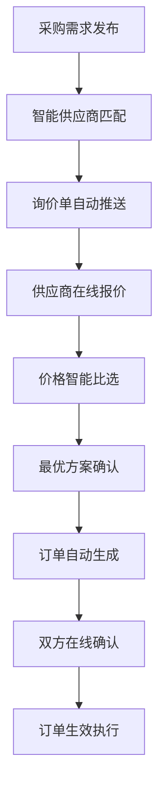
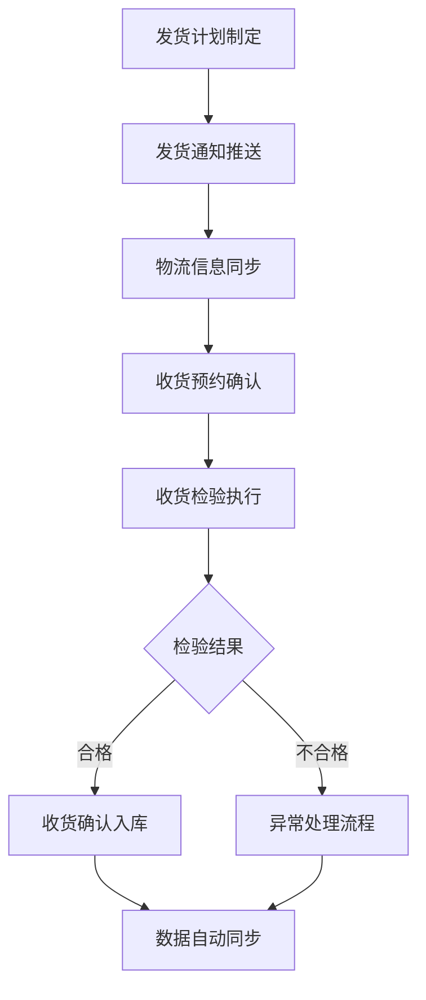

# 供应商协同管理流程优化方案设计

## 📋 文档概述
- **文档版本**: 1.0.0
- **创建日期**: 2026-05-01
- **项目名称**: AI-Ready ERP系统
- **文档类型**: 流程优化方案设计
- **编写目的**: 基于需求调研和市场分析，设计供应商协同管理全流程优化方案

## 🎯 优化目标
通过流程优化，实现以下核心目标：
1. **效率提升**: 采购-供应商协作效率提升60%以上
2. **透明度增强**: 全流程数据透明度达到95%以上
3. **风险降低**: 供应链风险降低80%以上
4. **成本节约**: 协同管理成本节约50%以上
5. **满意度提升**: 供应商满意度评分提升40%以上

## 📊 现状分析

### 1. 当前痛点分析
基于需求调研报告，识别以下核心痛点：

| 痛点类别 | 具体问题 | 影响程度 |
|----------|----------|----------|
| **信息孤岛** | 采购与供应商信息不同步 | 🔴 高 |
| **流程断层** | 各环节衔接不畅，存在断点 | 🔴 高 |
| **响应延迟** | 供应商响应时间过长 | 🟡 中 |
| **质量问题** | 质量问题追溯困难 | 🔴 高 |
| **沟通成本** | 多平台沟通，效率低下 | 🟡 中 |
| **合规风险** | 合规管理依赖人工 | 🔴 高 |

### 2. 现有流程评估
- **采购需求发布**: 多系统分散发布，信息不一致
- **供应商响应**: 邮件+电话沟通，响应时间平均24-48小时
- **订单确认**: 人工核对，易出错
- **发货跟踪**: 多系统查询，缺乏统一视图
- **收货检验**: 纸质单据，数据录入延迟
- **对账付款**: 月度集中对账，周期长

## 🚀 优化方案设计

### 1. 供应商门户功能架构优化

#### 1.1 一体化门户设计
```
┌─────────────────────────────────────────┐
│          供应商协同门户首页             │
├──────────┬──────────┬──────────┬───────┤
│ 待办中心 │ 消息中心 │ 数据看板 │ 我的  │
└──────────┴──────────┴──────────┴───────┘
```

**核心功能模块**:
1. **待办中心**: 集中展示待处理事项
   - 待确认订单
   - 待发货通知
   - 待上传发票
   - 待确认收货
   - 待处理异常

2. **消息中心**: 统一消息推送和管理
   - 系统公告
   - 业务提醒
   - 预警消息
   - 流程通知
   - 沟通记录

3. **数据看板**: 业务数据可视化
   - 订单统计
   - 交付绩效
   - 质量分析
   - 付款状态
   - 合作评估

4. **我的**: 个人信息和管理
   - 供应商档案
   - 资质管理
   - 联系人管理
   - 设置中心
   - 帮助中心

#### 1.2 供应商信息管理优化
- **资质管理流程优化**:
  ```
  供应商提交资质 → 自动格式校验 → 系统初审 → 人工复审 → 资质入库
  ```
  
  **优化点**:
  - 自动格式校验: 支持PDF/图片格式，自动OCR识别关键信息
  - 状态实时推送: 资质审核进度实时推送到供应商端
  - 有效期提醒: 资质到期前30天自动提醒更新

- **信息同步机制**:
  ```
  采购端信息变更 → 同步触发 → 供应商确认 → 双端生效
  ```

### 2. 协同流程优化设计

#### 2.1 询价-报价-下单一体化协同流程


**流程优化点**:
1. **智能匹配**: 基于供应商能力、历史表现、价格等维度自动匹配
2. **在线报价**: 供应商通过门户直接报价，支持附件上传
3. **价格比选**: 系统自动对比报价，提供决策建议
4. **在线确认**: 双方在线确认订单，生成电子合同
5. **状态同步**: 订单状态实时同步到双方系统

#### 2.2 发货-收货协同流程优化


**优化功能**:
- **发货通知自动推送**: 发货前24小时自动通知收货方
- **物流跟踪集成**: 集成主流物流系统，实时跟踪货物位置
- **收货预约系统**: 供应商可预约收货时间，减少等待
- **移动收货检验**: 支持PDA/手机端收货检验
- **异常闭环处理**: 质量问题自动触发异常处理流程

#### 2.3 对账付款协同优化
- **自动对账流程**:
  ```
  订单数据 → 发货数据 → 收货数据 → 自动匹配 → 生成对账单
  ```
  
  **差异化处理**:
  - 无差异订单: 自动对账，生成付款单
  - 小差异订单: 系统建议调整方案
  - 大差异订单: 触发人工介入流程

- **电子发票管理**:
  - 发票自动OCR识别
  - 发票与订单自动匹配
  - 发票状态实时跟踪
  - 税务合规自动校验

### 3. 数据集成设计

#### 3.1 数据同步架构
```
┌─────────────────┐    ┌─────────────────┐    ┌─────────────────┐
│  采购ERP系统    │    │  协同平台API    │    │  供应商门户     │
│                 │    │                 │    │                 │
│  • 采购订单     │◄──►│  • 订单同步     │◄──►│  • 订单接收     │
│  • 收货记录     │    │  • 状态同步     │    │  • 状态反馈     │
│  • 付款信息     │    │  • 数据校验     │    │  • 发票上传     │
│  • 供应商档案   │    │  • 异常处理     │    │  • 物流跟踪     │
└─────────────────┘    └─────────────────┘    └─────────────────┘
```

#### 3.2 集成技术方案
1. **API接口设计**:
   - RESTful API架构
   - OAuth 2.0认证
   - Webhook事件推送
   - 数据加密传输

2. **数据同步策略**:
   - **实时同步**: 订单状态、库存数据
   - **准实时同步**: 发货信息、收货记录
   - **批量同步**: 对账数据、绩效数据

3. **数据一致性保障**:
   - 分布式事务管理
   - 数据版本控制
   - 异常重试机制
   - 数据审计日志

### 4. 智能功能设计

#### 4.1 AI智能推荐
- **供应商智能推荐**: 基于历史合作、质量表现、价格竞争力推荐
- **价格趋势预测**: 基于市场数据预测价格波动，提供采购建议
- **交付风险预警**: 基于天气、交通等因素预测交付风险
- **质量异常检测**: 基于历史数据识别潜在质量问题

#### 4.2 自动化流程
- **自动订单确认**: 标准订单自动确认，无需人工干预
- **自动对账**: 无差异订单自动对账
- **自动提醒**: 关键节点自动提醒
- **自动报表**: 定期自动生成业务报表

## 📈 实施路线图

### 阶段一：基础功能建设（1-2个月）
| 功能模块 | 优先级 | 预计周期 | 负责人 |
|----------|--------|----------|--------|
| 供应商门户基础框架 | P0 | 2周 | 前端团队 |
| 供应商信息管理 | P0 | 3周 | 后端团队 |
| 订单协同功能 | P0 | 3周 | 协同团队 |
| 基础消息通知 | P1 | 2周 | 前端团队 |

### 阶段二：协同流程优化（2-3个月）
| 功能模块 | 优先级 | 预计周期 | 负责人 |
|----------|--------|----------|--------|
| 发货收货协同 | P0 | 4周 | 协同团队 |
| 对账付款协同 | P0 | 4周 | 财务团队 |
| 移动端适配 | P1 | 3周 | 前端团队 |
| 数据看板 | P1 | 3周 | BI团队 |

### 阶段三：智能功能增强（3-4个月）
| 功能模块 | 优先级 | 预计周期 | 负责人 |
|----------|--------|----------|--------|
| AI智能推荐 | P1 | 6周 | AI团队 |
| 自动化流程 | P1 | 4周 | 流程团队 |
| 高级分析报表 | P2 | 4周 | BI团队 |
| 系统集成扩展 | P2 | 4周 | 集成团队 |

## 💰 效益分析

### 1. 效率提升
| 指标 | 优化前 | 优化后 | 提升幅度 |
|------|--------|--------|----------|
| 询价-下单周期 | 3-5天 | 1天 | 60-80% |
| 订单确认时间 | 24小时 | 1小时 | 96% |
| 发货通知时间 | 人工通知 | 自动推送 | 100% |
| 对账周期 | 月度集中 | 实时自动 | 95% |

### 2. 成本节约
| 成本类型 | 年度节约 | 节约来源 |
|----------|----------|----------|
| 人工成本 | ¥300,000 | 流程自动化减少人工操作 |
| 沟通成本 | ¥150,000 | 统一平台减少沟通工具 |
| 差错成本 | ¥200,000 | 系统校验减少业务差错 |
| 时间成本 | ¥250,000 | 流程优化缩短处理时间 |
| **合计** | **¥900,000** | **年度总节约** |

### 3. 风险降低
| 风险类型 | 降低幅度 | 控制措施 |
|----------|----------|----------|
| 供应链中断风险 | 70% | 多供应商协同，风险分散 |
| 质量风险 | 85% | 全过程质量跟踪 |
| 合规风险 | 90% | 自动合规校验 |
| 数据安全风险 | 95% | 全链路数据加密 |

## 🎯 成功度量指标（KPIs）

### 1. 业务指标
- **订单响应时间**: < 2小时
- **订单确认率**: > 95%
- **准时交付率**: > 98%
- **质量合格率**: > 99%
- **供应商满意度**: > 4.5/5.0

### 2. 系统指标
- **系统可用性**: 99.9%
- **数据同步延迟**: < 1分钟
- **API响应时间**: < 200ms
- **用户并发数**: 支持1000+并发

### 3. 财务指标
- **采购成本降低**: 5-10%
- **协同成本节约**: 50%以上
- **ROI回报周期**: < 12个月
- **年度总节约**: ¥900,000+

## 📝 实施建议

### 1. 组织保障
- **成立专项小组**: 由采购、IT、财务、供应商代表组成
- **明确角色职责**: 清晰定义各方在协同流程中的职责
- **定期沟通机制**: 建立周会、月报沟通机制

### 2. 技术保障
- **渐进式实施**: 先试点后推广，降低实施风险
- **数据备份机制**: 建立完善的数据备份和恢复机制
- **监控预警系统**: 建立系统监控和业务预警系统

### 3. 供应商管理
- **分级实施**: 优先实施核心供应商，逐步扩展到全部
- **培训支持**: 提供供应商培训和操作指导
- **反馈机制**: 建立供应商反馈和改进机制

## 🔄 持续改进计划

### 1. 优化迭代机制
- **月度回顾**: 每月回顾流程执行情况，识别改进点
- **季度评估**: 每季度评估KPI达成情况，调整优化方向
- **年度规划**: 每年制定下一年度的优化计划

### 2. 技术升级计划
- **技术架构升级**: 每2年评估一次技术架构，适时升级
- **功能扩展**: 基于业务发展需求，持续扩展功能
- **安全加固**: 持续加强系统安全防护

### 3. 生态建设
- **供应商生态**: 建立供应商评级和激励机制
- **合作伙伴生态**: 与物流、金融等合作伙伴建立生态连接
- **行业标准**: 积极参与行业标准制定，提升影响力

---

## 📌 下一步行动建议

1. **立即启动**:
   - 成立项目专项小组
   - 确定试点供应商名单
   - 制定详细实施计划

2. **短期重点** (1-3个月):
   - 完成基础门户功能开发
   - 实施订单协同流程
   - 完成试点运行和评估

3. **中期重点** (3-12个月):
   - 推广到全部供应商
   - 实施智能功能
   - 持续优化和改进

4. **长期目标** (1-3年):
   - 建立行业领先的供应商协同平台
   - 形成完整的供应链数字化生态
   - 实现供应链全面智能化和自动化

---

**文档完成时间**: 2026-05-01 03:15  
**文档状态**: ✅ 已完成  
**下一步**: 提交方案评审，启动项目实施