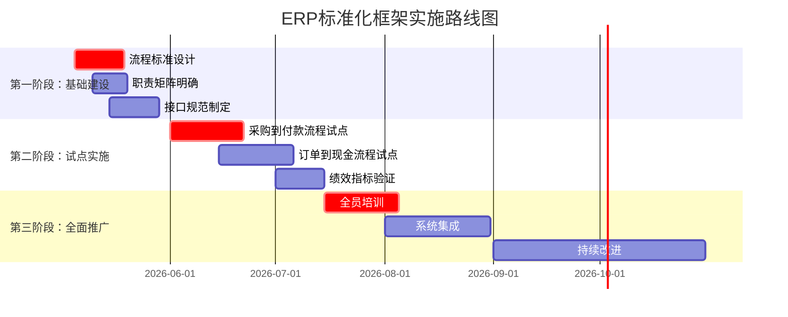

# ERP系统跨部门业务流程标准化框架设计规范

## 1. 流程标准设计

### 1.1 标准化操作规范

#### 1.1.1 跨部门流程统一建模规范

**BPMN 2.0建模标准**
```xml
<!-- 标准化流程建模要素 -->
<process id="procure_to_pay" name="采购到付款流程">
  <!-- 跨部门泳道定义 -->
  <lane id="procurement" name="采购部门">
    <task id="po_creation" name="采购订单创建" completionTime="2h" />
  </lane>
  <lane id="warehouse" name="仓储部门">
    <task id="goods_receipt" name="到货验收" qualityCheck="mandatory" />
  </lane>
  <lane id="finance" name="财务部门">
    <task id="payment_approval" name="付款审批" amountThreshold="10000" />
  </lane>
</process>
```

**关键流程指标标准**
| 流程名称 | 关键绩效指标 | 目标值 | 测量频率 |
|---------|-------------|--------|----------|
| 采购到付款 | 采购订单处理时间 | ≤2小时 | 每日 |
|          | 三单匹配准确率 | ≥99% | 每周 |
|          | 付款周期 | ≤30天 | 每月 |
| 订单到现金 | 订单确认时间 | ≤1小时 | 每日 |
|          | 准时交货率 | ≥95% | 每周 |
|          | 回款周期 | ≤45天 | 每月 |
| 计划到生产 | 生产计划完成率 | ≥90% | 每日 |
|          | 物料齐套率 | ≥95% | 每周 |
|          | 产品质量合格率 | ≥98% | 每月 |

### 1.2 质量标准设计

#### 1.2.1 数据质量标准
```yaml
data_quality_standards:
  accuracy:
    required_level: 99.5%
    validation_rules:
      - numeric_range_check
      - referential_integrity
      - business_rule_validation
  
  completeness:
    required_level: 100%
    mandatory_fields:
      - order_number
      - customer_id
      - product_code
      - quantity
      - unit_price
  
  timeliness:
    sla_requirements:
      real_time: <1分钟
      near_real_time: <5分钟
      batch: <15分钟
  
  consistency:
    cross_system_alignment:
      - inventory_qty_variance: ≤2%
      - financial_amount_variance: ≤0.1%
```

#### 1.2.2 服务质量标准
```yaml
service_level_agreements:
  procurement_service:
    order_acknowledgement: ≤15分钟
    quote_response: ≤4小时
    po_confirmation: ≤2小时
  
  warehouse_service:
    stock_check_response: ≤5分钟
    picking_completion: ≤2小时
    shipping_confirmation: ≤1小时
  
  finance_service:
    invoice_generation: ≤24小时
    payment_processing: ≤3工作日
    statement_issuance: 每月5日前
```

### 1.3 职责矩阵设计

#### 1.3.1 RACI责任分配矩阵

**采购到付款流程RACI矩阵**
| 活动/角色 | 采购部 | 仓储部 | 财务部 | 供应商 | IT支持 |
|----------|--------|--------|--------|--------|--------|
| 需求计划 | R      | C      | I      | I      | I      |
| 供应商选择 | R      | I      | C      | A      | I      |
| 采购订单 | R/A    | C      | I      | C      | S      |
| 收货检验 | C      | R/A    | I      | A      | S      |
| 入库管理 | I      | R/A    | I      | I      | S      |
| 发票核对 | I      | C      | R/A    | C      | S      |
| 付款审批 | C      | I      | R/A    | I      | I      |
| 付款执行 | I      | I      | R/A    | A      | S      |

**图例说明：**
- **R** = 负责 (Responsible): 执行工作
- **A** = 批准 (Accountable): 最终责任，单一责任人
- **C** = 咨询 (Consulted): 提供专业意见
- **I** = 知情 (Informed): 需要了解进展
- **S** = 支持 (Support): 提供技术支持

#### 1.3.2 决策权限矩阵

**采购决策权限矩阵**
| 决策类型 | 采购员 | 采购经理 | 部门总监 | 财务总监 | 总经理 |
|----------|--------|----------|----------|----------|--------|
| 日常采购(<1万) | A      | I        | -        | -        | -      |
| 一般采购(1-10万) | R      | A        | I        | C        | -      |
| 重大采购(>10万) | R      | C        | A        | C        | I      |
| 供应商准入 | R      | C        | A        | C        | I      |
| 合同变更 | R      | A        | C        | C        | I      |

### 1.4 接口规范制定

#### 1.4.1 跨部门数据接口标准

**RESTful API规范**
```yaml
openapi: 3.0.3
info:
  title: ERP跨部门数据交换API
  version: 1.0.0
  description: ERP系统跨部门数据交换标准接口规范

components:
  schemas:
    OrderData:
      type: object
      required:
        - orderId
        - customerId
        - orderDate
        - totalAmount
      properties:
        orderId:
          type: string
          pattern: '^ORD-\d{8}-\d{4}$'
        customerId:
          type: string
          pattern: '^CUST-\d{6}$'
        orderDate:
          type: string
          format: date-time
        totalAmount:
          type: number
          minimum: 0
          maximum: 1000000
          format: decimal(15,2)
    
    InventoryData:
      type: object
      required:
        - sku
        - warehouseCode
        - availableQty
        - reservedQty
      properties:
        sku:
          type: string
          pattern: '^SKU-\d{6}$'
        warehouseCode:
          type: string
          pattern: '^WH-\d{3}$'
        availableQty:
          type: integer
          minimum: 0
        reservedQty:
          type: integer
          minimum: 0
```

#### 1.4.2 消息交换规范

**Kafka消息格式标准**
```json
{
  "metadata": {
    "messageId": "msg_20260504_001234",
    "timestamp": "2026-05-04T17:45:00Z",
    "sourceSystem": "erp-purchase",
    "targetSystem": ["erp-stock", "erp-finance"],
    "messageType": "ORDER_CREATED",
    "priority": "HIGH",
    "retryCount": 0
  },
  "payload": {
    "order": {
      "orderId": "ORD-20260504-0001",
      "customerId": "CUST-001234",
      "items": [
        {
          "lineNumber": 1,
          "productCode": "PROD-001",
          "quantity": 100,
          "unitPrice": 25.50
        }
      ],
      "totalAmount": 2550.00
    }
  },
  "validation": {
    "checksum": "a1b2c3d4e5f6",
    "signature": "rsa-signature-base64"
  }
}
```

### 1.5 文档标准建立

#### 1.5.1 跨部门协同文档模板库

**流程文档模板结构**
```
cross-department-process-docs/
├── 01-流程设计文档/
│   ├── process-design-template.md      # 流程设计模板
│   ├── swimlane-diagram-template.vsd   # 泳道图模板
│   └── kpi-definition-template.xlsx    # KPI定义模板
├── 02-接口规范文档/
│   ├── api-spec-template.yaml          # API规范模板
│   ├── data-model-template.erd         # 数据模型模板
│   └── message-format-template.json    # 消息格式模板
├── 03-操作手册/
│   ├── sop-template.md                 # 标准作业程序模板
│   ├── user-guide-template.md          # 用户指南模板
│   └── troubleshooting-template.md     # 故障排除模板
├── 04-会议纪要/
│   ├── cross-department-meeting-template.md  # 跨部门会议模板
│   ├── decision-log-template.xlsx            # 决策日志模板
│   └── action-item-template.md               # 行动项模板
└── 05-绩效报告/
    ├── monthly-performance-template.md       # 月度绩效模板
    ├── process-metrics-template.xlsx         # 流程指标模板
    └── improvement-plan-template.md          # 改进计划模板
```

#### 1.5.2 文档命名规范

```yaml
document_naming_convention:
  pattern: "[类型]-[流程]-[部门]-[日期]-[版本].[扩展名]"
  examples:
    - "SOP-采购到付款-采购部-20260504-v1.0.md"
    - "API-订单到现金-销售部-20260504-v2.1.yaml"
    - "会议纪要-计划到生产-跨部门-20260504.docx"
    - "绩效报告-采购到付款-财务部-202605-v1.0.xlsx"
  
  type_codes:
    SOP: 标准作业程序
    API: 接口规范
    DES: 设计文档
    MTG: 会议纪要
    KPI: 绩效报告
    IMP: 改进计划
  
  versioning:
    major: 重大变更，不向后兼容
    minor: 功能增强，向后兼容
    patch: 错误修复，向后兼容
```

#### 1.5.3 文档质量检查清单

```markdown
# 文档质量检查清单

## 完整性检查
- [ ] 文档包含所有必要章节
- [ ] 所有图表都有标题和说明
- [ ] 所有术语都有定义或链接到术语表
- [ ] 包含版本历史和变更记录

## 准确性检查
- [ ] 技术细节与系统实现一致
- [ ] 数据字段定义准确无误
- [ ] 流程描述与实际操作一致
- [ ] 联系方式和组织信息准确

## 可读性检查
- [ ] 使用一致的标题层级
- [ ] 段落长度适中（3-5句）
- [ ] 使用项目符号和编号列表
- [ ] 重要信息突出显示

## 实用性检查
- [ ] 包含具体操作步骤
- [ ] 提供示例和模板
- [ ] 包含故障排除指南
- [ ] 提供联系人和支持信息
```

### 1.6 实施指导原则

#### 1.6.1 标准化实施路线图



#### 1.6.2 变更管理原则

1. **渐进式改进**
   - 从试点部门开始，逐步推广
   - 每次变更影响范围可控
   - 建立快速回滚机制

2. **利益相关者参与**
   - 所有相关部门参与设计
   - 定期沟通和反馈收集
   - 建立变更影响评估机制

3. **培训和支持**
   - 标准化操作培训
   - 文档使用培训
   - 持续的技术支持

### 1.7 合规性与审计要求

#### 1.7.1 内控要求
- 所有跨部门交易必须有完整审计轨迹
- 关键操作需要双人复核
- 重要决策需要有书面记录

#### 1.7.2 数据安全要求
- 敏感数据加密传输和存储
- 访问权限基于最小权限原则
- 定期安全审计和漏洞扫描

#### 1.7.3 法规遵从要求
- 符合财务报告法规
- 遵守数据保护法规
- 满足行业特定合规要求

---
*本规范自2026年5月5日起生效*
*修订周期：每季度评审一次*
*负责部门：流程管理委员会*