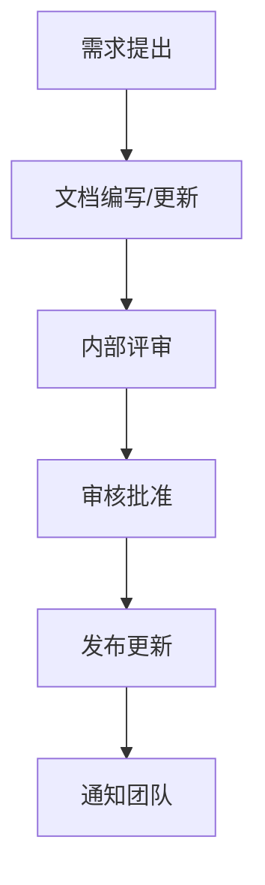

# 测试环境文档管理规范

**版本**: v1.0  
**创建日期**: 2026-04-27  
**项目**: AI-Ready (企智连系统)  
**适用阶段**: Sprint 27+1 测试环境配置专项

---

## 📋 目录

1. [概述](#概述)
2. [文档结构规范](#文档结构规范)
3. [文档格式标准](#文档格式标准)
4. [文档版本管理](#文档版本管理)
5. [文档质量检查](#文档质量检查)
6. [文档模板列表](#文档模板列表)
7. [文档维护机制](#文档维护机制)
8. [文档发布流程](#文档发布流程)

---

## 🎯 概述

### 1.1 目标

为Sprint 27+1测试环境建立统一的文档管理体系，确保：

- **完整性**：所有测试环境相关信息都有文档记录
- **一致性**：文档格式、命名、结构统一规范
- **可维护性**：文档易于更新、维护和查找
- **可访问性**：文档对团队成员开放、易获取

### 1.2 适用范围

本规范适用于：
- 测试环境规划与建设文档
- 测试环境配置与部署文档
- 测试环境使用与维护文档
- 测试环境问题与解决方案文档

### 1.3 文档分类

| 类别 | 说明 | 示例 |
|------|------|------|
| **规范类** | 文档编写标准、管理规定 | 本规范文档 |
| **标准类** | 技术标准、接口规范 | API规范、数据标准 |
| **指南类** | 操作指南、使用说明 | 部署指南、使用手册 |
| **模板类** | 文档模板、记录表格 | 部署模板、检查清单 |
| **报告类** | 测试报告、问题报告 | 测试报告、问题跟踪 |

---

## 📁 文档结构规范

### 2.1 目录结构

```
I:\AI-Ready\docs\
├── standards/              # 文档规范（本目录）
│   └── documentation-standards.md    # 本文档
├── templates/              # 文档模板目录
│   ├── deployment/         # 部署文档模板
│   ├── manual/             # 用户手册模板
│   ├── guide/              # 指南文档模板
│   └── report/             # 报告文档模板
├── guide/                  # 使用指南
│   ├── documentation-management-guide.md  # 本文档使用说明
│   └── ...
├── deploy/                 # 部署文档
│   ├── test-env/           # 测试环境部署
│   └── ...
├── test-env/               # 测试环境专项文档
│   ├── configuration/      # 配置文档
│   ├── deployment/         # 部署文档
│   ├── maintenance/        # 维护文档
│   └── troubleshooting/    # 故障排查
├── manual/                 # 用户手册
│   ├── user/               # 用户操作手册
│   └── admin/              # 管理员手册
├── api/                    # API文档
│   └── test-env/           # 测试环境API
└── templates/              # 模板文件
    ├── meeting-minutes.md  # 会议纪要模板
    ├── issue-report.md     # 问题报告模板
    └── test-case.md        # 测试用例模板
```

### 2.2 命名规范

#### 2.2.1 文件命名

- **格式**: `[分类]-[主题]-[版本].md`
- **分类**: deployment, manual, guide,规范, report等
- **主题**: 简洁描述文档内容
- **版本**: v1.0, v1.1等

**示例**:
```
deployment-test-env-v1.0.md
manual-test-env-user-v1.0.md
guide-documentation-v1.0.md
```

#### 2.2.2 文件夹命名

- 使用小写字母
- 单词间用连字符`-`分隔
- 避免特殊字符

**示例**:
```
test-env/
deployment-tools/
troubleshooting/
```

### 2.3 路径规范

- **绝对路径**: 使用`I:\AI-Ready\docs\`作为根路径
- **相对路径**: 文档内部链接使用相对路径
- **避免硬编码**: 不在文档中写死绝对路径

---

## 📝 文档格式标准

### 3.1 Markdown格式

所有文档使用Markdown格式，遵循以下标准：

#### 3.1.1 标题层级

```markdown
# 一级标题（文档主题）
## 二级标题（主要章节）
### 三级标题（子章节）
#### 四级标题（细节说明）
```

#### 3.1.2 列表格式

```markdown
- 项目符号列表
  - 子项目
    - 孙项目

1. 数字列表
2. 有序项目
   - 混合列表
```

#### 3.1.3 表格格式

```markdown
| 列1 | 列2 | 列3 |
|-----|-----|-----|
| 内容1 | 内容2 | 内容3 |
| 内容4 | 内容5 | 内容6 |
```

#### 3.1.4 代码块

```markdown
```bash
# Bash代码示例
npm install -g ys
```

```python
# Python代码示例
def hello():
    print("Hello, World!")
```

```json
{
  "key": "value",
  "array": [1, 2, 3]
}
```
```

### 3.2 元数据规范

每个文档顶部应包含元数据：

```markdown
---
title: 文档标题
version: v1.0
created: 2026-04-27
last-updated: 2026-04-27
author: 作者名
status: draft/active/retired
tags:
  - tag1
  - tag2
---
```

### 3.3 链接规范

#### 3.3.1 内部链接

```markdown
[文档标题](./relative/path/to/document.md)
[章节标题](./document.md#section-id)
```

#### 3.3.2 外部链接

```markdown
[链接文本](https://example.com)
```

---

## 🔖 文档版本管理

### 4.1 版本号规则

采用语义化版本号：`主版本.次版本.修订版本`

- **主版本**: 重大变更、架构调整
- **次版本**: 新功能、重大修订
- **修订版本**: 小修改、错别字修正

### 4.2 版本标记

```markdown
## 版本历史

| 版本 | 日期 | 修改说明 | 作者 |
|------|------|---------|------|
| v1.0 | 2026-04-27 | 初始版本 | doc-writer |
| v1.1 | 2026-04-28 | 添加部署模板 | devops-engineer |
```

### 4.3 文档状态

| 状态 | 说明 |
|------|------|
| `draft` | 草稿阶段，正在编写 |
| `active` | 活跃阶段，正在维护 |
| `review` | 审核阶段，等待 Review |
| `retired` | 已废弃，不再维护 |

---

## ✅ 文档质量检查

### 5.1 质量检查清单

每个文档发布前必须通过以下检查：

#### 5.1.1 内容完整性

- [ ] 文档主题明确
- [ ] 章节结构完整
- [ ] 关键信息不缺失
- [ ] 示例完整可执行

#### 5.1.2 格式规范性

- [ ] 标题层级正确
- [ ] 列表格式统一
- [ ] 表格对齐整齐
- [ ] 代码块有语法标识

#### 5.1.3 链接有效性

- [ ] 内部链接可访问
- [ ] 外部链接有效
- [ ] 图片路径正确
- [ ] 附件可下载

#### 5.1.4 语言规范

- [ ] 无错别字
- [ ] 术语一致
- [ ] 语气统一
- [ ] 专业准确

### 5.2 自动检查工具

配置自动化检查工具：

```yaml
# .docs-checker.yml
checks:
  - type: syntax
    enabled: true
  - type: links
    enabled: true
    checkExternal: true
  - type: spelling
    enabled: true
  - type: structure
    enabled: true
```

---

## 📄 文档模板列表

### 6.1 部署文档模板

| 模板 | 用途 | 位置 |
|------|------|------|
| **部署指南** | 环境部署步骤 | `templates/deployment/deployment-guide.md` |
| **配置说明** | 配置项说明 | `templates/deployment/configuration.md` |
| **验证清单** | 部署验证检查 | `templates/deployment/verification-checklist.md` |
| **故障排查** | 部署问题解决 | `templates/deployment/troubleshooting.md` |

### 6.2 用户手册模板

| 模块 | 用途 | 位置 |
|------|------|------|
| **用户指南** | 功能使用说明 | `templates/manual/user-guide.md` |
| **管理员指南** | 系统管理说明 | `templates/manual/admin-guide.md` |
| **API快速入门** | API使用入门 | `templates/manual/api-quickstart.md` |

### 6.3 报告文档模板

| 模板 | 用途 | 位置 |
|------|------|------|
| **测试报告** | 测试结果记录 | `templates/report/test-report.md` |
| **问题报告** | 问题跟踪记录 | `templates/report/issue-report.md` |
| **会议纪要** | 会议内容记录 | `templates/report/meeting-minutes.md` |

---

## 🔧 文档维护机制

### 7.1 维护职责

| 角色 | 职责 |
|------|------|
| **文档作者** | 编写和更新文档 |
| **文档审核人** | 审核文档质量 |
| **文档维护人** | 日常维护和更新 |
| **项目负责人** | 文档整体质量负责 |

### 7.2 更新流程



### 7.3 维护频率

| 文档类型 | 更新频率 | 责任人 |
|---------|---------|--------|
| 配置文档 | 配置变更时 | devops-engineer |
| 使用手册 | 功能变更时 | qa-lead |
| API文档 | 接口变更时 | backend-dev |
| 故障排查 | 问题解决后 | devops-engineer |

---

## 📢 文档发布流程

### 8.1 发布前检查

- [ ] 内容审核通过
- [ ] 格式规范检查通过
- [ ] 链接有效性检查通过
- [ ] 版本号已更新
- [ ] 通知相关方

### 8.2 发布方式

- **文档仓库**: 提交到 `I:\AI-Ready\docs\`
- **版本控制**: Git提交，附带变更说明
- **版本标签**: 打Tag标记版本

### 8.3 发布后工作

1. 更新文档索引
2. 通知团队成员
3. 归档旧版本（如需要）
4. 更新相关链接

---

## 📚 附录

### A. 常用链接

- [Markdown语法说明](https://www.markdownguide.org/)
- [项目文档首页](./README.md)
- [API文档索引](./api/README.md)

### B. 参考资料

- 企智连系统项目规范
- AI-Ready项目开发规范
- 软件文档管理最佳实践

---

**文档状态**: 🟢 Active  
**最后更新**: 2026-04-27  
**维护人**: doc-writer
