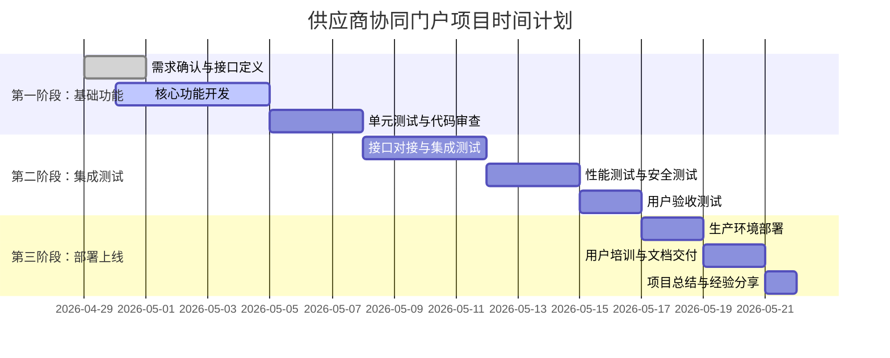

# 供应商协同门户项目协调计划

**版本**: 1.0.0  
**日期**: 2026-05-01  
**协调员**: coordinator  
**项目**: AI-Ready ERP系统  
**Sprint**: Sprint 27+1: ERP核心功能开发专项

## 📋 项目概述

### 项目背景
供应商协同门户是AI-Ready ERP系统的核心功能之一，在紧急制动后，项目已100%转向ERP核心功能开发。供应商协同门户作为ERP核心功能（占任务分配20%），需要专项协调以确保按时按质完成。

### 当前状态
- ✅ **代码基础**: erp-supplier-portal模块已创建，包含完整的代码架构
- ✅ **技术文档**: README.md文档完整，包含API接口说明和部署指南
- ✅ **团队状态**: 团队已转向ERP核心功能开发
- 🔄 **协调需求**: 需要跨模块协调和进度跟踪

### 协调目标
1. 确保供应商协同门户模块与其他ERP模块无缝集成
2. 跟踪项目进度，确保按时交付
3. 协调跨模块协作，解决依赖关系
4. 管理项目风险，制定应对策略

## 🏗️ 模块架构分析

### 现有模块结构
```
erp-supplier-portal/
├── controller/          # RESTful API控制器
├── service/            # 业务服务层
├── repository/         # 数据访问层
├── model/entity/       # 数据库实体（8个实体）
├── dto/                # 数据传输对象（4个DTO）
└── config/             # 配置类
```

### 核心功能模块
1. **供应商管理**: 供应商信息全生命周期管理
2. **绩效管理**: 多维度供应商绩效评估体系
3. **协同工作**: 询价报价、订单、发货、对账协同
4. **通知推送**: 多渠道智能通知系统

### 技术栈匹配
- ✅ **框架**: Spring Boot 3.x (与项目一致)
- ✅ **数据库**: MySQL/PostgreSQL (支持多数据库)
- ✅ **ORM**: MyBatis-Plus (与项目一致)
- ✅ **缓存**: Redis (与项目一致)
- ✅ **安全**: Spring Security + JWT (与项目一致)

## 🔗 跨模块依赖分析

### 与ERP其他模块的依赖关系
| 供应商门户功能 | 依赖模块 | 接口需求 | 状态 |
|----------------|----------|----------|------|
| 供应商管理 | erp-purchase (采购) | 供应商基础数据同步 | 🔄 待协调 |
| 询价报价 | erp-purchase (采购) | 询价单/报价单接口 | 🔄 待协调 |
| 绩效评估 | erp-batch-sn (批次管理) | 批次质量数据 | 🔄 待协调 |
| 通知推送 | core-notification (核心通知) | 通知发送接口 | 🔄 待协调 |
| 权限管理 | user-management (用户管理) | 用户权限验证 | 🔄 待协调 |
| 数据统计 | erp-metrics (指标监控) | 业务指标上报 | 🔄 待协调 |

### 接口对接优先级
1. **P0 (紧急)**: 供应商基础数据同步 (erp-purchase)
2. **P0 (紧急)**: 用户权限验证 (user-management)
3. **P1 (高)**: 询价单/报价单接口 (erp-purchase)
4. **P2 (中)**: 通知发送接口 (core-notification)
5. **P3 (低)**: 批次质量数据 (erp-batch-sn)

## 📊 进度跟踪机制

### 跟踪指标
| 指标类型 | 具体指标 | 目标值 | 当前值 | 负责人 |
|----------|----------|--------|--------|--------|
| 开发进度 | 代码完成率 | 100% | 70% | team-member |
| 测试进度 | 单元测试覆盖率 | ≥80% | 待统计 | test-agent-1 |
| 集成进度 | 接口对接完成率 | 100% | 0% | coordinator |
| 文档进度 | 技术文档完整度 | 100% | 80% | doc-writer |
| 质量进度 | Bug发现/修复率 | <5% | 待统计 | qa-lead |

### 进度报告周期
1. **每日**: 站会进度同步 (09:00)
2. **每周**: 周进度报告 (周五17:00)
3. **里程碑**: 关键节点验收报告

### 进度跟踪工具
1. **任务管理**: 使用OpenClaw任务系统 (task_list/task_update)
2. **文档管理**: 使用项目共享记忆 (SHARED_MEMORY.md)
3. **沟通协调**: 使用项目群组 (group_1775281918084_4yhkbw)
4. **风险跟踪**: 使用风险登记表 (见风险管理部分)

## 👥 团队协作机制

### 团队成员角色
| 角色 | 负责人 | 职责 | 联系方式 |
|------|--------|------|----------|
| 项目协调员 | coordinator | 整体协调、进度跟踪、风险管理 | 项目群组 |
| 开发负责人 | team-member | 代码开发、技术方案 | 项目群组 |
| 测试负责人 | test-agent-1 | 测试方案、质量保证 | 项目群组 |
| 产品分析师 | product-analyst | 需求分析、功能设计 | 项目群组 |
| 文档编写员 | doc-writer | 技术文档、用户手册 | 项目群组 |
| DevOps工程师 | devops-engineer | 部署配置、环境管理 | 项目群组 |

### 协作流程
1. **需求确认**: product-analyst → coordinator → 团队
2. **开发实现**: team-member → test-agent-1 → coordinator
3. **测试验证**: test-agent-1 → team-member → coordinator
4. **文档编写**: doc-writer → coordinator → 团队
5. **部署上线**: devops-engineer → coordinator → 团队

### 沟通渠道
1. **正式沟通**: 项目群组消息 (主要渠道)
2. **紧急沟通**: 直接agent_communicate
3. **文档沟通**: 项目共享记忆更新
4. **会议沟通**: 协调会议 (每周一、三、五 10:00)

## ⚠️ 风险管理

### 已识别风险
| 风险ID | 风险描述 | 影响程度 | 概率 | 风险等级 | 应对策略 | 负责人 |
|--------|----------|----------|------|----------|----------|--------|
| RISK-001 | 跨模块接口对接延迟 | 高 | 中 | 高 | 提前协调接口规范，建立接口mock | coordinator |
| RISK-002 | 团队成员任务冲突 | 中 | 中 | 中 | 统一任务分配，优先级管理 | coordinator |
| RISK-003 | 技术债务累积 | 中 | 高 | 中 | 定期代码审查，技术债务清理 | team-member |
| RISK-004 | 测试环境不稳定 | 中 | 低 | 低 | 建立稳定测试环境，备份机制 | devops-engineer |
| RISK-005 | 需求变更频繁 | 高 | 低 | 中 | 需求冻结机制，变更控制流程 | product-analyst |

### 风险监控机制
1. **每日风险检查**: 每日站会检查风险状态
2. **每周风险评估**: 每周五进行风险评估更新
3. **风险升级机制**: 高风险立即上报main协调

### 应急预案
1. **接口对接延迟**: 使用接口mock继续开发，不影响进度
2. **关键人员缺席**: 建立备份人员机制，知识共享
3. **技术难题**: 组织技术讨论，寻求外部支持
4. **进度延迟**: 调整优先级，增加资源投入

## 📅 项目时间计划

### 总体时间线


### 详细里程碑
| 里程碑 | 交付物 | 完成标准 | 预计日期 | 责任人 |
|--------|--------|----------|----------|--------|
| M1: 需求确认完成 | 需求规格说明书 | 所有功能需求明确，接口规范确定 | 2026-04-30 | product-analyst |
| M2: 核心功能完成 | 可运行代码 | 所有核心功能开发完成，通过单元测试 | 2026-05-05 | team-member |
| M3: 接口对接完成 | 集成测试报告 | 所有跨模块接口对接完成，测试通过 | 2026-05-12 | coordinator |
| M4: 测试验证完成 | 测试报告 | 功能测试、性能测试、安全测试通过 | 2026-05-15 | test-agent-1 |
| M5: 文档交付完成 | 完整文档 | 技术文档、用户手册、API文档完成 | 2026-05-19 | doc-writer |
| M6: 项目上线完成 | 上线报告 | 生产环境部署完成，用户培训完成 | 2026-05-21 | devops-engineer |

## 🎯 质量保证计划

### 质量标准
1. **代码质量**: 单元测试覆盖率≥80%，代码审查通过率100%
2. **功能质量**: 功能测试通过率100%，用户验收通过率100%
3. **性能质量**: API响应时间≤500ms（P95），支持并发用户≥1000
4. **安全质量**: 无高危安全漏洞，通过安全测试
5. **文档质量**: 文档完整度100%，准确度≥95%

### 质量检查点
| 检查阶段 | 检查内容 | 检查方法 | 检查人 | 检查时间 |
|----------|----------|----------|--------|----------|
| 需求阶段 | 需求完整性 | 需求评审会议 | product-analyst | 每日 |
| 开发阶段 | 代码质量 | 代码审查、单元测试 | team-member | 提交前 |
| 测试阶段 | 功能正确性 | 功能测试、集成测试 | test-agent-1 | 测试周期 |
| 部署阶段 | 部署正确性 | 部署验证、健康检查 | devops-engineer | 部署后 |
| 上线阶段 | 用户满意度 | 用户反馈、使用统计 | coordinator | 上线后 |

### 质量改进机制
1. **缺陷管理**: 使用缺陷跟踪系统，缺陷修复率≥95%
2. **持续改进**: 每周质量回顾会议，持续改进流程
3. **知识共享**: 技术分享会议，最佳实践文档
4. **自动化检查**: CI/CD流水线集成质量检查

## 📞 沟通与报告机制

### 日常沟通
1. **每日站会**: 09:00，项目群组，15分钟
   - 昨日完成工作
   - 今日计划工作
   - 遇到的问题和风险
2. **进度同步**: 每日17:00，进度报告到群组
3. **问题讨论**: 随时在群组中讨论技术问题

### 正式报告
1. **周进度报告**: 每周五17:00，包含：
   - 本周工作完成情况
   - 下周工作计划
   - 风险状态和应对措施
   - 需要的支持和协助
2. **里程碑报告**: 每个里程碑完成后24小时内
3. **项目总结报告**: 项目完成后3个工作日内

### 会议管理
1. **协调会议**: 每周一、三、五 10:00，30分钟
2. **技术评审**: 每周二 14:00，技术方案讨论
3. **风险评审**: 每周四 15:00，风险评估和应对
4. **项目回顾**: 每月最后一周周五 16:00

## 🔧 工具和资源

### 开发工具
1. **IDE**: IntelliJ IDEA / VS Code
2. **版本控制**: Git，分支策略：Git Flow
3. **构建工具**: Maven 3.8+
4. **数据库工具**: DBeaver / MySQL Workbench
5. **API测试**: Postman / Swagger UI

### 项目管理工具
1. **任务管理**: OpenClaw任务系统
2. **文档管理**: Markdown + Git
3. **沟通协作**: OpenClaw群组消息
4. **进度跟踪**: 本协调计划 + 共享记忆

### 测试环境资源
1. **测试服务器**: 由devops-engineer维护
2. **测试数据库**: PostgreSQL 15+，独立测试实例
3. **测试账号**: 各模块测试账号统一管理
4. **测试数据**: 标准化测试数据集

## 📋 交付物清单

### 代码交付物
1. `erp-supplier-portal` 完整源代码
2. 数据库迁移脚本 (`V1.0.0__*.sql`)
3. Docker部署配置 (`Dockerfile`, `docker-compose.yml`)
4. CI/CD配置 (`.gitlab-ci.yml`)

### 文档交付物
1. **技术文档**:
   - 架构设计文档
   - API接口文档 (Swagger/OpenAPI)
   - 数据库设计文档
   - 部署运维手册
2. **用户文档**:
   - 管理员操作手册
   - 最终用户使用指南
   - 常见问题解答
3. **项目文档**:
   - 项目协调计划 (本文件)
   - 项目进度报告
   - 项目总结报告

### 测试交付物
1. 单元测试报告
2. 集成测试报告
3. 性能测试报告
4. 安全测试报告
5. 用户验收测试报告

## 🚀 后续行动计划

### 立即执行 (今日内)
1. ✅ 发送团队协调通知，收集各模块反馈
2. 🔄 制定详细的接口对接计划
3. 🔄 建立项目进度跟踪表格
4. 🔄 组织第一次协调会议 (今日14:00)

### 短期计划 (本周内)
1. 完成所有接口规范定义
2. 建立跨模块协作工作机制
3. 完成核心功能开发进度跟踪
4. 建立质量检查和验收标准

### 中期计划 (Sprint 27+1内)
1. 完成供应商协同门户所有核心功能
2. 完成跨模块集成测试
3. 完成用户验收测试
4. 准备生产环境部署

## 📝 变更记录

| 版本 | 日期 | 变更内容 | 变更人 |
|------|------|----------|--------|
| 1.0.0 | 2026-05-01 | 初始版本创建 | coordinator |

## 📞 联系信息

**项目协调员**: coordinator  
**项目群组**: group_1775281918084_4yhkbw  
**项目空间**: H:\OpenClaw_Workspace\groups\ai-ready  
**业务空间**: I:\AI-Ready  
**紧急联系人**: main (系统管理员)

---

*本协调计划将根据项目进展定期更新，最新版本以项目共享记忆中的版本为准。*