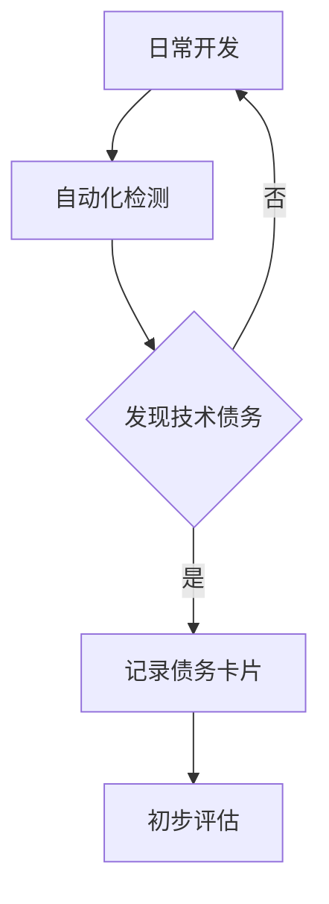

# 技术债务识别、量化与治理方案设计

## 1. 概述

### 1.1 目标
设计AI-Ready项目技术债务管理系统化治理方案，为架构治理专项提供系统的技术债务管理能力，确保技术债务得到有效识别、评估和治理。

### 1.2 背景
**紧急制动教训**：技术债务积累严重且缺乏系统化管理，导致：
- 架构演进困难
- 系统维护成本增加  
- 影响业务创新速度
- 重复模块和目录结构混乱

### 1.3 设计原则
- **早期识别**：在开发过程中早期发现技术债务
- **量化评估**：建立客观、可衡量的评估标准
- **系统治理**：建立完整的治理流程和工具链
- **持续改进**：形成技术债务管理的闭环机制

## 2. 技术债务识别机制设计

### 2.1 债务分类体系

#### 2.1.1 按债务类型分类
| 债务类型 | 描述 | 示例 | 发现方法 |
|---------|------|------|---------|
| **设计债务** | 架构设计不合理、模块边界不清 | 循环依赖、紧耦合、职责不清 | 依赖分析、架构审查 |
| **代码债务** | 代码质量问题、技术选型过时 | 重复代码、过长函数、过时库 | 静态代码分析、代码审查 |
| **测试债务** | 测试覆盖不足、测试策略不当 | 单元测试缺失、集成测试不足 | 测试覆盖率分析、测试策略审查 |
| **文档债务** | 文档缺失或过时 | API文档不全、架构图过时 | 文档完整性检查 |
| **配置债务** | 配置管理混乱、环境不一致 | 硬编码配置、环境差异 | 配置审计、环境验证 |
| **基础设施债务** | 基础设施过时或不可靠 | 旧版数据库、无监控 | 基础设施审计 |

#### 2.1.2 按影响范围分类
- **局部债务**：影响单个模块或组件
- **模块间债务**：影响多个模块间的交互
- **系统级债务**：影响整个系统架构

#### 2.1.3 按紧急程度分类
- **立即修复**：严重影响系统稳定性和开发效率
- **计划修复**：有一定影响，可在后续迭代中处理
- **可接受债务**：影响较小，可长期存在

### 2.2 识别标准和判定方法

#### 2.2.1 设计债务判定标准
1. **循环依赖检测**：使用工具检测模块间的循环依赖
2. **模块耦合度评估**：计算模块间的依赖关系数量
3. **职责分离评估**：检查模块是否承担过多职责

#### 2.2.2 代码债务判定标准
1. **代码复杂度**：圈复杂度 > 15
2. **重复代码**：重复代码比例 > 5%
3. **代码异味**：使用SonarQube等工具检测
4. **技术债龄**：过时库版本使用时间 > 2年

#### 2.2.3 测试债务判定标准
1. **测试覆盖率**：单元测试覆盖率 < 80%
2. **集成测试**：缺少端到端测试场景
3. **性能测试**：缺少性能基准测试
4. **安全测试**：缺少安全漏洞测试

### 2.3 自动化识别工具设计

#### 2.3.1 架构治理检查工具
```bash
# 架构治理检查脚本
./scripts/architectural-governance-check.sh

# 检查内容
1. 目录结构合规性检查
2. 模块边界检查
3. 依赖关系检查
4. 架构规范检查
```

#### 2.3.2 代码质量检查工具
```yaml
# CI/CD流水线集成
jobs:
  code-quality-check:
    steps:
      - name: SonarQube分析
        run: mvn sonar:sonar
      - name: 代码复杂度检查
        run: ./scripts/check-code-complexity.sh
      - name: 重复代码检测
        run: ./scripts/check-duplicate-code.sh
```

#### 2.3.3 依赖分析工具
```python
# 依赖关系分析脚本
def analyze_dependencies():
    # 分析项目依赖关系
    # 检测循环依赖
    # 评估模块耦合度
    # 生成依赖关系图
```

## 3. 技术债务量化评估体系

### 3.1 债务严重度评估模型

#### 3.1.1 影响维度评分
| 维度 | 权重 | 评分标准 |
|------|------|----------|
| **业务影响** | 30% | 对业务功能、用户体验的影响程度 |
| **技术影响** | 25% | 对系统稳定性、性能的影响程度 |
| **维护成本** | 20% | 增加的系统维护成本 |
| **开发效率** | 15% | 对开发效率的影响程度 |
| **安全风险** | 10% | 存在的安全风险程度 |

#### 3.1.2 紧急度评估矩阵
| 影响程度 | 高 | 中 | 低 |
|----------|----|----|----|
| **发生概率** |    |    |    |
| 高 (>80%) | 立即修复 | 计划修复 | 可接受 |
| 中 (30-80%) | 计划修复 | 可接受 | 可接受 |
| 低 (<30%) | 可接受 | 可接受 | 可接受 |

### 3.2 量化指标

#### 3.2.1 设计债务指标
- **循环依赖数量**：检测到的循环依赖数量
- **模块耦合度**：平均每个模块的依赖数量
- **职责分离度**：模块承担职责数量分布

#### 3.2.2 代码债务指标
- **圈复杂度超标率**：圈复杂度>15的函数比例
- **重复代码率**：重复代码占总代码比例
- **技术债龄**：过时依赖的平均使用年限

#### 3.2.3 测试债务指标
- **测试覆盖率**：各类测试的代码覆盖率
- **测试通过率**：测试用例的通过率
- **测试执行时间**：完整测试套件的执行时间

### 3.3 债务评分卡

```yaml
# 技术债务评分卡示例
debt_id: TD-2026-001
debt_type: 设计债务
description: 用户管理模块与权限模块存在循环依赖
metrics:
  business_impact: 8/10
  technical_impact: 7/10
  maintenance_cost: 6/10
  development_efficiency: 5/10
  security_risk: 3/10
overall_score: 58/100
priority: 高
recommended_action: 重构模块边界，引入中间层
estimated_effort: 5人日
```

## 4. 技术债务治理流程

### 4.1 治理组织架构

#### 4.1.1 架构治理委员会
- **组成**：架构师、技术负责人、产品负责人
- **职责**：审批技术债务治理计划、监督治理执行

#### 4.1.2 技术债务管理小组
- **组成**：开发工程师、测试工程师、运维工程师
- **职责**：识别、评估、修复技术债务

### 4.2 治理工作流程

#### 4.2.1 识别阶段


#### 4.2.2 评估阶段
1. **技术评估**：评估技术影响和修复方案
2. **业务评估**：评估业务影响和优先级
3. **成本评估**：估算修复成本和预期收益

#### 4.2.3 决策阶段
1. **立即修复**：影响严重的债务立即安排修复
2. **计划修复**：纳入技术债务治理计划
3. **可接受**：记录但不安排修复

#### 4.2.4 执行阶段
1. **制定修复计划**：明确修复方案和时间
2. **执行修复**：按照计划进行修复
3. **验证效果**：验证修复效果和收益

### 4.3 治理工具链

#### 4.3.1 技术债务管理平台
```yaml
# 技术债务管理数据库设计
tables:
  technical_debts:
    - id
    - type
    - description
    - severity_score
    - priority
    - status
    - created_at
    - updated_at
  
  debt_metrics:
    - debt_id
    - metric_name
    - metric_value
    - collected_at
  
  repair_plans:
    - plan_id
    - debt_id
    - repair_strategy
    - estimated_effort
    - assigned_to
    - due_date
    - status
```

#### 4.3.2 CI/CD流水线集成
```yaml
# 技术债务检查流水线
name: Technical Debt Governance Pipeline

on:
  push:
    branches: [ main, develop ]
  pull_request:
    branches: [ main ]

jobs:
  detect-technical-debt:
    runs-on: ubuntu-latest
    steps:
      - uses: actions/checkout@v3
      
      - name: 运行架构治理检查
        run: ./.github/workflows/architectural-governance-check.sh
      
      - name: 代码质量分析
        run: mvn sonar:sonar -Dsonar.projectKey=ai-ready
      
      - name: 生成技术债务报告
        run: python scripts/generate-technical-debt-report.py
      
      - name: 上传技术债务报告
        uses: actions/upload-artifact@v3
        with:
          name: technical-debt-report
          path: ./reports/technical-debt-report.json
```

## 5. 实施路线图

### 5.1 第一阶段：基础建设（1-2周）
- [ ] 建立技术债务分类体系
- [ ] 部署自动化检测工具
- [ ] 设计量化评估模型

### 5.2 第二阶段：流程建立（2-3周）
- [ ] 建立技术债务治理流程
- [ ] 培训团队成员
- [ ] 试点项目验证

### 5.3 第三阶段：全面实施（3-4周）
- [ ] 全面实施技术债务管理
- [ ] 建立技术债务看板
- [ ] 定期进行技术债务评估

### 5.4 第四阶段：持续优化（持续）
- [ ] 优化评估模型
- [ ] 改进自动化工具
- [ ] 建立技术债务治理文化

## 6. 预期收益

### 6.1 技术收益
- **架构稳定性提升**：减少架构演进阻力
- **代码质量改善**：降低缺陷率，提高可维护性
- **开发效率提升**：减少技术债务带来的额外工作量

### 6.2 业务收益
- **交付速度提升**：减少技术债务修复时间
- **系统稳定性增强**：降低生产事故发生率
- **创新能力增强**：释放资源用于业务创新

### 6.3 管理收益
- **风险可控**：技术债务可视化，风险可管理
- **决策有据**：基于数据的治理决策
- **持续改进**：形成技术债务治理的良性循环

## 7. 成功度量指标

### 7.1 过程指标
- **技术债务发现率**：每周发现的技术债务数量
- **修复完成率**：已修复技术债务的比例
- **平均修复时间**：技术债务从发现到修复的平均时间

### 7.2 结果指标
- **架构健康度**：架构评估得分变化趋势
- **代码质量指标**：代码复杂度、重复率等指标改善
- **系统稳定性**：生产事故发生率变化

### 7.3 经济指标
- **技术债务修复ROI**：修复投入与收益的比例
- **维护成本降低**：系统维护工作量的减少
- **开发效率提升**：功能交付速度的提升

## 8. 附录

### 8.1 技术债务卡片模板
```markdown
# 技术债务卡片

## 基本信息
- **债务ID**: 
- **发现时间**: 
- **发现者**: 
- **所属模块**: 

## 债务描述
- **债务类型**: 
- **具体描述**: 
- **发现方式**: 

## 评估信息
- **业务影响**: /10
- **技术影响**: /10  
- **维护成本**: /10
- **开发效率**: /10
- **安全风险**: /10
- **综合评分**: /100

## 治理计划
- **优先级**: 
- **修复方案**: 
- **预计投入**: 
- **计划时间**: 
- **负责人**: 

## 治理历史
- **创建时间**: 
- **评估时间**: 
- **修复时间**: 
- **验证时间**: 
```

### 8.2 相关文档
1. [架构治理集成方案](./architecture-governance-integration.md)
2. [数据治理框架](./data-governance/erp-data-governance-framework.md)
3. [CI/CD流水线配置](../.github/workflows)

---

**文档版本**: 1.0  
**创建时间**: 2026-05-05  
**更新时间**: 2026-05-05  
**负责人**: team-member  
**状态**: 草案