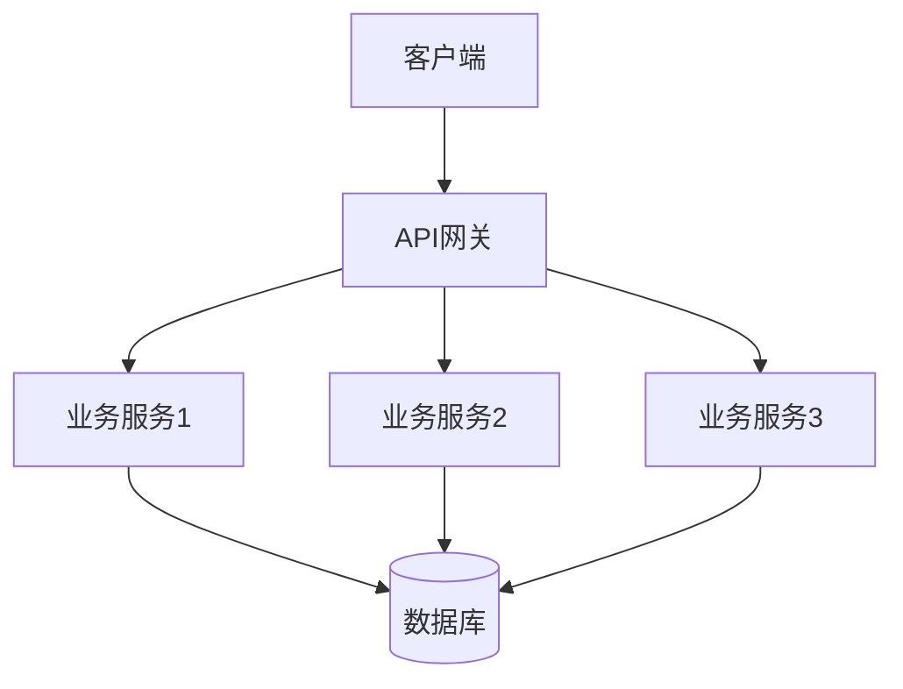
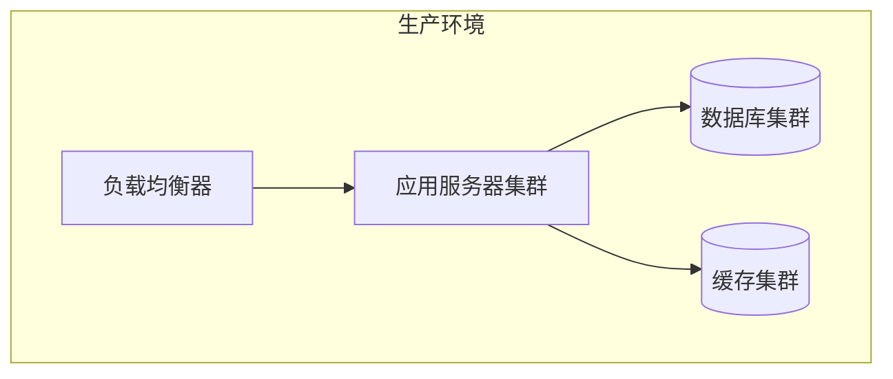
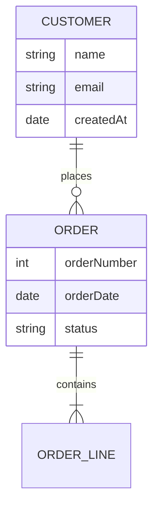

# [系统/模块名称] 架构设计文档

**版本**: v1.0.0  
**最后更新**: YYYY-MM-DD  
**维护者**: [姓名/角色]  
**审核状态**: [草案/审核中/已批准]

## 📋 概述

### 文档状态
| 项目 | 状态 | 说明 |
|------|------|------|
| 完成度 | ✅/⚠️/❌ | 文档完成百分比 |
| 准确性 | ✅/⚠️/❌ | 内容准确性评估 |
| 更新频率 | 高/中/低 | 文档更新频率 |

### 1.1 设计目标
1. [目标1]
2. [目标2]
3. [目标3]

### 1.2 设计原则
1. **可扩展性**: 支持水平扩展和垂直扩展
2. **高可用性**: 系统可用性目标≥99.9%
3. **高性能**: 关键接口响应时间≤200ms
4. **安全性**: 符合企业安全标准
5. **可维护性**: 代码结构清晰，易于维护

## 🏗️ 整体架构

### 2.1 架构概览


### 2.2 技术栈
| 组件 | 技术选型 | 版本 | 说明 |
|------|----------|------|------|
| **前端** | [技术] | [版本] | [说明] |
| **后端** | [技术] | [版本] | [说明] |
| **数据库** | [技术] | [版本] | [说明] |
| **缓存** | [技术] | [版本] | [说明] |
| **消息队列** | [技术] | [版本] | [说明] |
| **监控** | [技术] | [版本] | [说明] |

### 2.3 部署架构


## 🔧 模块设计

### 3.1 模块划分
| 模块名称 | 职责 | 技术栈 | 负责人 |
|----------|------|--------|--------|
| [模块1] | [职责描述] | [技术栈] | [负责人] |
| [模块2] | [职责描述] | [技术栈] | [负责人] |

### 3.2 核心模块设计

#### 3.2.1 [模块名称]模块
**设计目标**: [目标描述]

**核心功能**:
1. [功能1]
2. [功能2]
3. [功能3]

**架构图**:


## 💾 数据设计

### 4.1 数据模型
#### 4.1.1 实体关系图


#### 4.1.2 核心表设计
**表名**: `[表名]`
| 字段名 | 类型 | 约束 | 说明 |
|--------|------|------|------|
| id | bigint | PK, NOT NULL | 主键 |
| name | varchar(100) | NOT NULL | 名称 |
| created_at | datetime | NOT NULL | 创建时间 |

### 4.2 数据流设计


## 🔗 接口设计

### 5.1 内部接口
| 接口名称 | 调用方 | 被调用方 | 协议 | 数据格式 |
|----------|--------|----------|------|----------|
| [接口名称] | [模块A] | [模块B] | [协议] | [格式] |

### 5.2 外部接口
| 接口名称 | 协议 | 认证方式 | 频率限制 | SLA |
|----------|------|----------|----------|------|
| [接口名称] | [协议] | [认证] | [限制] | [SLA] |

## 🔐 安全设计

### 6.1 认证授权
1. **认证方式**: [方式描述]
2. **权限模型**: RBAC/ABAC
3. **Token管理**: [管理策略]

### 6.2 数据安全
1. **数据加密**: [加密方案]
2. **数据脱敏**: [脱敏规则]
3. **访问审计**: [审计方案]

### 6.3 网络安全
1. **防火墙规则**: [规则描述]
2. **DDoS防护**: [防护方案]
3. **网络隔离**: [隔离策略]

## 📈 性能设计

### 7.1 性能指标
| 指标 | 目标值 | 监控方式 |
|------|--------|----------|
| 响应时间 | ≤200ms | [监控工具] |
| 吞吐量 | ≥1000 TPS | [监控工具] |
| 并发数 | ≥1000 | [监控工具] |
| 可用性 | ≥99.9% | [监控工具] |

### 7.2 性能优化
1. **缓存策略**: [策略描述]
2. **数据库优化**: [优化方案]
3. **异步处理**: [异步方案]

## 🚀 部署设计

### 8.1 环境规划
| 环境 | 服务器配置 | 数量 | 用途 |
|------|------------|------|------|
| 开发 | [配置] | [数量] | [用途] |
| 测试 | [配置] | [数量] | [用途] |
| 生产 | [配置] | [数量] | [用途] |

### 8.2 部署流程


### 8.3 配置管理
```yaml
# 配置示例
app:
  name: "[应用名称]"
  version: "[版本号]"
  port: 8080
  
database:
  host: "[主机地址]"
  port: 3306
  name: "[数据库名]"
```

## 🛡️ 高可用设计

### 9.1 故障恢复
1. **故障检测**: [检测机制]
2. **自动恢复**: [恢复策略]
3. **手动干预**: [干预流程]

### 9.2 容灾备份
1. **数据备份**: [备份策略]
2. **灾难恢复**: [恢复方案]
3. **业务连续性**: [连续性方案]

## 📊 监控与告警

### 10.1 监控指标
| 监控维度 | 监控指标 | 告警阈值 | 监控工具 |
|----------|----------|----------|----------|
| 基础设施 | CPU使用率 | ≥80% | [工具] |
| 应用性能 | 响应时间 | ≥500ms | [工具] |
| 业务指标 | 错误率 | ≥1% | [工具] |

### 10.2 告警策略
| 告警级别 | 条件 | 通知方式 | 处理时限 |
|----------|------|----------|----------|
| P0紧急 | [条件] | [方式] | [时限] |
| P1重要 | [条件] | [方式] | [时限] |
| P2一般 | [条件] | [方式] | [时限] |

## 🔄 演进规划

### 11.1 短期规划
| 版本 | 时间 | 主要特性 | 依赖 |
|------|------|----------|------|
| v1.0 | [时间] | [特性] | [依赖] |
| v1.1 | [时间] | [特性] | [依赖] |

### 11.2 长期规划
| 阶段 | 目标 | 关键技术 | 预计时间 |
|------|------|----------|----------|
| 第一阶段 | [目标] | [技术] | [时间] |
| 第二阶段 | [目标] | [技术] | [时间] |

## 📁 附录

### A. 术语表
| 术语 | 定义 |
|------|------|
| [术语] | [定义] |
| [术语] | [定义] |

### B. 参考资料
1. [参考文档1]
2. [参考文档2]
3. [参考文档3]

### C. 变更历史
| 版本 | 日期 | 修改内容 | 修改人 |
|------|------|----------|--------|
| v1.0.0 | YYYY-MM-DD | 初始版本创建 | [姓名] |
| v1.0.1 | YYYY-MM-DD | 更新性能指标 | [姓名] |

---

**架构评审检查清单**
- [ ] 架构设计符合业务需求
- [ ] 技术选型合理且可持续
- [ ] 性能指标可衡量可实现
- [ ] 安全设计完整有效
- [ ] 部署方案可行可靠
- [ ] 监控告警体系完善
- [ ] 演进规划清晰可行