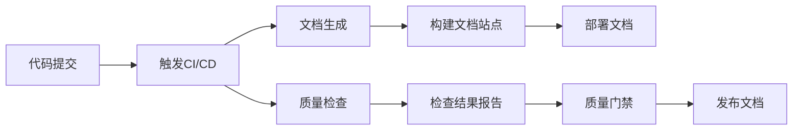

# 文档自动化工具集成指南

**版本**: v1.0.0  
**最后更新**: YYYY-MM-DD  
**维护者**: [姓名/角色]  
**审核状态**: [草案/审核中/已批准]

## 📋 概述

### 1.1 目标
提供文档自动化工具集成方案，实现文档生成、质量检查、版本管理的自动化，提高文档工作效率和质量。

### 1.2 适用范围
- 所有技术文档的自动化生成
- 文档质量自动化检查
- 文档版本自动化管理
- 文档发布自动化流程

## 🔧 工具栈选择

### 2.1 核心工具栈
| 工具类别 | 推荐工具 | 版本 | 用途 | 开源/商业 |
|----------|----------|------|------|-----------|
| **文档生成** | Swagger/OpenAPI | 3.0+ | API文档生成 | 开源 |
| | Javadoc/Doxygen | 最新 | 代码注释生成文档 | 开源 |
| | MkDocs/Material | 最新 | 静态文档站点生成 | 开源 |
| **质量检查** | markdownlint | 0.32+ | Markdown格式检查 | 开源 |
| | textlint | 12.0+ | 文本语法检查 | 开源 |
| | vale | 2.0+ | 写作风格检查 | 开源 |
| **版本管理** | Git | 2.35+ | 文档版本控制 | 开源 |
| | Git LFS | 3.0+ | 大文件版本管理 | 开源 |
| **持续集成** | GitHub Actions | 最新 | CI/CD流水线 | 平台集成 |
| | GitLab CI/CD | 最新 | CI/CD流水线 | 平台集成 |

### 2.2 工具选型原则
1. **开源优先**: 优先选择成熟的开源工具
2. **社区活跃**: 选择社区活跃、维护良好的工具
3. **集成友好**: 支持与其他工具良好集成
4. **可扩展性**: 支持自定义扩展和插件

## 🚀 自动化流程设计

### 3.1 文档自动化流水线


### 3.2 阶段详细设计

#### 3.2.1 文档生成阶段
**输入**: 源代码、配置文件、数据模型  
**输出**: 生成的文档文件  
**工具**: Swagger/OpenAPI、Javadoc、TypeDoc

```yaml
# 示例配置
documentation:
  api:
    source: "./src/main/java"
    output: "./docs/api"
    format: "openapi3"
  code:
    source: "./src"
    output: "./docs/code"
    language: "java"
```

#### 3.2.2 质量检查阶段
**输入**: 文档文件  
**输出**: 检查报告、问题列表  
**工具**: markdownlint、textlint、vale

```yaml
# 质量检查配置
lint:
  markdown:
    rules: 
      line-length: false  # 不检查行长度
      no-inline-html: true
  text:
    rules:
      spellcheck: true
      terminology: true
```

#### 3.2.3 构建部署阶段
**输入**: 文档文件、配置  
**输出**: 文档站点  
**工具**: MkDocs、Material、GitHub Pages

```yaml
# MkDocs配置
site_name: "ERP系统文档"
theme:
  name: "material"
  palette:
    primary: "indigo"
    accent: "blue"
```

## 🔧 工具配置示例

### 4.1 Swagger/OpenAPI配置
```yaml
# swagger-config.yaml
openapi: 3.0.3
info:
  title: "ERP系统API文档"
  version: "1.0.0"
  description: "ERP系统完整API文档"
  
servers:
  - url: "http://localhost:8080"
    description: "开发环境"
    
paths:
  /api/users:
    get:
      summary: "获取用户列表"
      description: "分页获取所有用户信息"
```

### 4.2 markdownlint配置
```json
{
  "default": true,
  "line-length": false,
  "no-inline-html": false,
  "first-line-h1": false,
  "ul-style": {
    "style": "consistent"
  },
  "no-bare-urls": false
}
```

### 4.3 MkDocs配置
```yaml
# mkdocs.yml
site_name: "ERP系统技术文档"
site_url: "https://docs.erp.example.com"
repo_url: "https://github.com/company/erp-docs"
edit_uri: "edit/main/docs/"

theme:
  name: "material"
  features:
    - navigation.instant
    - navigation.tracking
    - navigation.expand
    - navigation.indexes
    - toc.follow
```

## 📁 目录结构规范

### 5.1 建议目录结构
```
docs/
├── .github/                  # GitHub Actions配置
│   └── workflows/
│       └── docs.yml         # 文档CI/CD流水线
├── api/                     # API文档
│   ├── generated/          # 自动生成的API文档
│   └── manual/            # 手动编写的API文档
├── guides/                 # 指南文档
│   ├── development.md
│   ├── deployment.md
│   └── troubleshooting.md
├── reference/              # 参考文档
│   ├── api-reference.md
│   ├── cli-reference.md
│   └── config-reference.md
├── static/                 # 静态资源
│   ├── images/
│   └── diagrams/
├── templates/              # 文档模板
│   ├── api-template.md
│   ├── architecture-template.md
│   └── user-guide-template.md
└── mkdocs.yml             # MkDocs配置文件
```

### 5.2 命名规范
- **文件命名**: `[模块]-[类型]-[描述].md`
- **目录命名**: `[模块]-[功能]`
- **图片命名**: `[模块]-[功能]-[序号].[格式]`

## 🔄 持续集成配置

### 6.1 GitHub Actions配置
```yaml
# .github/workflows/docs.yml
name: Documentation CI/CD

on:
  push:
    branches: [main]
    paths:
      - 'docs/**'
      - 'src/**/*.java'
  pull_request:
    branches: [main]

jobs:
  build:
    runs-on: ubuntu-latest
    steps:
      - uses: actions/checkout@v3
      
      - name: Setup Node.js
        uses: actions/setup-node@v3
        with:
          node-version: '18'
          
      - name: Install dependencies
        run: |
          npm install -g markdownlint-cli textlint
          
      - name: Lint markdown files
        run: |
          markdownlint docs/**/*.md
          
      - name: Generate API docs
        run: |
          # 生成API文档命令
          ./scripts/generate-api-docs.sh
          
      - name: Build documentation site
        run: |
          pip install mkdocs-material
          mkdocs build --clean --strict
          
      - name: Deploy to GitHub Pages
        if: github.ref == 'refs/heads/main'
        run: |
          mkdocs gh-deploy --force
```

### 6.2 GitLab CI/CD配置
```yaml
# .gitlab-ci.yml
stages:
  - lint
  - generate
  - build
  - deploy

markdown-lint:
  stage: lint
  image: node:18
  script:
    - npm install -g markdownlint-cli
    - markdownlint docs/
    
generate-api-docs:
  stage: generate
  image: openjdk:17
  script:
    - ./gradlew generateOpenApiDocs
  artifacts:
    paths:
      - docs/api/generated/
      
build-docs:
  stage: build
  image: python:3.11
  script:
    - pip install mkdocs-material
    - mkdocs build
  artifacts:
    paths:
      - site/
      
deploy-docs:
  stage: deploy
  image: alpine:latest
  script:
    - apk add git openssh-client
    - mkdocs gh-deploy --force
  only:
    - main
```

## 📊 质量门禁配置

### 7.1 检查规则配置
```yaml
quality-gates:
  documentation:
    completeness:
      min-coverage: 80%    # 文档覆盖率
    accuracy:
      max-error-rate: 5%   # 错误率
    format:
      required: true       # 格式检查
      
  api-docs:
    openapi-validation:
      enabled: true
      strict: true
    examples-coverage:
      min-percentage: 70%
      
  spell-check:
    dictionary: "en_US,technical"
    ignore-words:
      - "ERP"
      - "API"
      - "CI/CD"
```

### 7.2 检查脚本示例
```bash
#!/bin/bash
# docs-quality-check.sh

echo "开始文档质量检查..."

# 检查文档覆盖率
echo "1. 检查文档覆盖率..."
doc_coverage=$(./scripts/calculate-doc-coverage.py)
if [ $doc_coverage -lt 80 ]; then
  echo "❌ 文档覆盖率不足: $doc_coverage% (目标: ≥80%)"
  exit 1
fi
echo "✅ 文档覆盖率: $doc_coverage%"

# 检查格式
echo "2. 检查Markdown格式..."
markdownlint docs/ --config .markdownlint.json
if [ $? -ne 0 ]; then
  echo "❌ Markdown格式检查失败"
  exit 1
fi
echo "✅ Markdown格式检查通过"

# 检查拼写
echo "3. 检查拼写错误..."
vale docs/
if [ $? -ne 0 ]; then
  echo "❌ 拼写检查失败"
  exit 1
fi
echo "✅ 拼写检查通过"

echo "🎉 所有质量检查通过！"
```

## 🔍 监控与报告

### 8.1 监控指标
| 指标 | 目标值 | 监控频率 | 告警阈值 |
|------|--------|----------|----------|
| 文档构建成功率 | ≥99% | 每次提交 | <95% |
| 质量检查通过率 | ≥95% | 每次提交 | <90% |
| 文档更新时间 | ≤7天 | 每周 | >14天 |
| 用户访问量 | 监控趋势 | 每日 | 大幅下降 |

### 8.2 报告生成
```python
# 报告生成脚本示例
def generate_docs_report():
    return {
        "summary": {
            "total_docs": count_documents(),
            "last_updated": get_last_update_time(),
            "quality_score": calculate_quality_score()
        },
        "details": {
            "coverage": get_coverage_stats(),
            "errors": get_error_stats(),
            "suggestions": get_improvement_suggestions()
        }
    }
```

## 🚀 最佳实践

### 9.1 文档即代码
1. **版本控制**: 所有文档纳入版本控制系统
2. **代码审查**: 文档变更需要代码审查
3. **自动化测试**: 文档链接和格式自动化测试
4. **持续部署**: 文档自动构建和部署

### 9.2 质量文化
1. **质量门禁**: 设置文档质量门禁
2. **定期评审**: 定期评审文档质量
3. **用户反馈**: 收集用户反馈改进文档
4. **持续改进**: 持续改进文档工具和流程

### 9.3 团队协作
1. **权限管理**: 设置合理的文档访问权限
2. **协作流程**: 建立文档协作流程
3. **知识共享**: 促进文档知识共享
4. **培训指导**: 提供文档工具培训

## 📁 附录

### A. 故障排除
| 问题 | 原因 | 解决方案 |
|------|------|----------|
| 构建失败 | 依赖版本不兼容 | 更新依赖版本 |
| 格式检查误报 | 规则配置不当 | 调整规则配置 |
| 部署失败 | 权限不足 | 检查部署权限 |

### B. 性能优化
1. **缓存策略**: 合理设置文档缓存
2. **并行处理**: 使用并行处理提高效率
3. **增量构建**: 实现增量构建减少时间

### C. 变更历史
| 版本 | 日期 | 修改内容 | 修改人 |
|------|------|----------|--------|
| v1.0.0 | YYYY-MM-DD | 初始版本创建 | [姓名] |
| v1.0.1 | YYYY-MM-DD | 添加GitLab CI配置 | [姓名] |

---

**工具集成检查清单**
- [ ] 工具栈选择合理
- [ ] 自动化流程设计完整
- [ ] 配置示例充分
- [ ] 目录结构规范
- [ ] CI/CD配置正确
- [ ] 质量门禁有效
- [ ] 监控报告完善