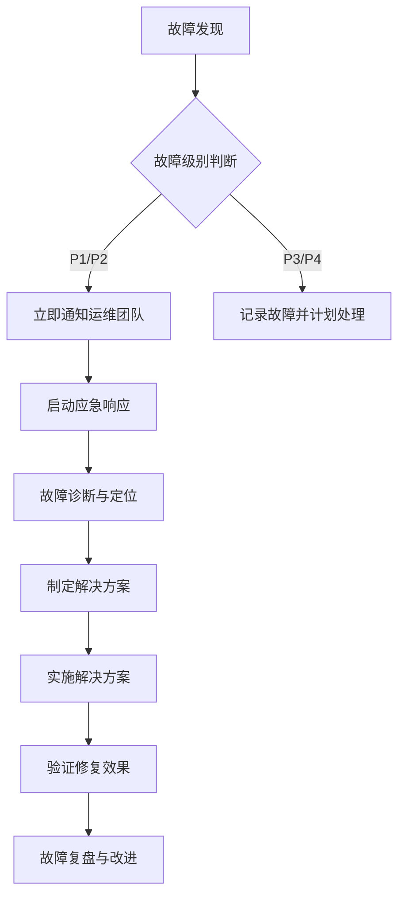
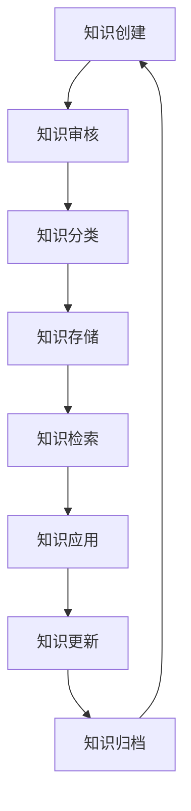

# 【Sprint 27+1】测试环境文档体系与知识库建设

## 概述

本文档为Sprint 27+1测试环境配置专项建立完整的文档体系和知识库，旨在提供实用、可操作的文档系统，支持测试团队高效使用和管理测试环境。

### 文档目标
1. **标准化**：建立统一的文档标准和规范
2. **实用性**：提供可直接使用的操作指南和工具
3. **可维护性**：设计易于更新和维护的文档结构
4. **知识传承**：建立系统化的知识积累和共享机制

## 1. 文档体系设计

### 1.1 文档分类体系

#### 1.1.1 核心文档类别
```
测试环境文档体系/
├── 01-架构设计文档/
│   ├── 测试环境架构设计.md
│   ├── 网络拓扑设计.md
│   ├── 安全架构设计.md
│   └── 性能架构设计.md
├── 02-配置管理文档/
│   ├── 环境配置标准.md
│   ├── 配置项清单.md
│   ├── 配置变更流程.md
│   └── 配置版本管理.md
├── 03-操作指南文档/
│   ├── 快速入门指南.md
│   ├── 环境搭建手册.md
│   ├── 日常运维指南.md
│   └── 故障处理手册.md
├── 04-测试工具文档/
│   ├── 工具安装配置.md
│   ├── 工具使用手册.md
│   ├── 工具集成指南.md
│   └── 工具故障排查.md
├── 05-最佳实践文档/
│   ├── 性能优化实践.md
│   ├── 安全配置实践.md
│   ├── 故障预防实践.md
│   └── 成本优化实践.md
├── 06-API接口文档/
│   ├── 环境管理API.md
│   ├── 配置管理API.md
│   ├── 监控API.md
│   └── 自动化API.md
└── 07-知识库/
    ├── FAQ常见问题.md
    ├── 故障案例库.md
    ├── 经验分享库.md
    └── 技术文档库.md
```

#### 1.1.2 文档层级关系
- **L1 战略层**：架构设计、技术选型、标准规范
- **L2 战术层**：配置管理、操作流程、工具使用
- **L3 操作层**：具体操作步骤、命令示例、故障处理
- **L4 知识层**：经验总结、最佳实践、案例分享

### 1.2 文档模板标准

#### 1.2.1 通用文档模板
```markdown
# [文档标题]

## 文档信息
- **文档版本**：v1.0.0
- **创建日期**：YYYY-MM-DD
- **更新日期**：YYYY-MM-DD
- **作者**：[姓名]
- **审核人**：[姓名]
- **适用对象**：[角色/团队]

## 概述
[简要说明文档目的和范围]

## 目录
1. [章节标题]
2. [章节标题]
3. [章节标题]

## 详细内容
[文档主体内容]

## 附录
- [相关文档链接]
- [术语表]
- [参考资料]

## 更新历史
| 版本 | 日期 | 作者 | 更新说明 |
|------|------|------|----------|
| v1.0.0 | YYYY-MM-DD | [姓名] | 初始版本 |
```

#### 1.2.2 操作指南模板
```markdown
# [操作名称]操作指南

## 操作目的
[说明操作的目标和预期结果]

## 前置条件
- [条件1]
- [条件2]
- [条件3]

## 操作步骤
### 步骤1：[步骤名称]
1. [具体操作1]
2. [具体操作2]
3. [具体操作3]

### 步骤2：[步骤名称]
1. [具体操作1]
2. [具体操作2]

## 验证方法
- [验证方法1]
- [验证方法2]

## 故障排除
| 问题现象 | 可能原因 | 解决方案 |
|----------|----------|----------|
| [问题1] | [原因1] | [方案1] |
| [问题2] | [原因2] | [方案2] |

## 注意事项
- [注意事项1]
- [注意事项2]
```

### 1.3 文档质量管理

#### 1.3.1 质量标准
- **完整性**：内容全面，无遗漏关键信息
- **准确性**：信息准确，无技术错误
- **一致性**：术语统一，格式规范
- **可读性**：语言清晰，结构合理
- **实用性**：提供可直接使用的操作指导

#### 1.3.2 质量检查清单
- [ ] 文档标题清晰明确
- [ ] 版本信息完整
- [ ] 目录结构合理
- [ ] 内容准确无误
- [ ] 示例代码可运行
- [ ] 截图清晰可读
- [ ] 链接有效可用
- [ ] 术语使用一致
- [ ] 无错别字和语法错误

## 2. 操作指南与手册编写

### 2.1 测试环境快速入门指南

#### 2.1.1 环境访问与认证
```markdown
# 测试环境快速入门指南

## 1. 环境访问
### 1.1 Web访问
- **管理界面**：https://test-env-admin.ai-ready.com
- **监控界面**：https://test-env-monitor.ai-ready.com
- **API接口**：https://test-env-api.ai-ready.com

### 1.2 SSH访问
```bash
# 开发环境
ssh developer@dev-test.ai-ready.com -p 22

# 测试环境
ssh tester@test.ai-ready.com -p 22

# 生产仿真环境
ssh tester@staging.ai-ready.com -p 22
```

### 1.3 账号权限
| 角色 | 账号 | 权限范围 | 有效期 |
|------|------|----------|--------|
| 开发者 | developer | 开发环境读写权限 | 长期 |
| 测试员 | tester | 测试环境读写权限 | 长期 |
| 管理员 | admin | 全环境管理权限 | 长期 |

## 2. 基础操作

### 2.1 环境初始化
```bash
# 1. 克隆配置仓库
git clone https://gitlab.ai-ready.com/test-env/config.git

# 2. 安装依赖
cd config
./scripts/setup.sh

# 3. 环境验证
./scripts/verify.sh
```

### 2.2 服务管理
```bash
# 查看服务状态
systemctl status test-env-services

# 启动服务
systemctl start test-env-services

# 重启服务
systemctl restart test-env-services

# 停止服务
systemctl stop test-env-services
```

## 3. 常用命令

### 3.1 环境检查
```bash
# 检查环境健康状态
./scripts/health-check.sh

# 检查网络连通性
./scripts/network-check.sh

# 检查资源使用情况
./scripts/resource-check.sh
```

### 3.2 日志查看
```bash
# 查看实时日志
tail -f /var/log/test-env/app.log

# 查看错误日志
grep ERROR /var/log/test-env/app.log

# 查看特定时间日志
journalctl -u test-env-services --since "2024-01-01" --until "2024-01-02"
```

## 4. 故障排查

### 4.1 常见问题
1. **无法访问环境**
   - 检查网络连接
   - 检查防火墙设置
   - 检查服务状态

2. **服务启动失败**
   - 检查配置文件
   - 检查端口占用
   - 查看错误日志

3. **性能问题**
   - 检查资源使用
   - 检查数据库连接
   - 检查网络延迟
```

### 2.2 测试环境搭建手册

#### 2.2.1 环境搭建步骤
```markdown
# 测试环境搭建手册

## 1. 环境准备

### 1.1 硬件要求
| 组件 | 最低配置 | 推荐配置 |
|------|----------|----------|
| CPU | 4核 | 8核 |
| 内存 | 8GB | 16GB |
| 存储 | 100GB | 200GB |
| 网络 | 100Mbps | 1Gbps |

### 1.2 软件要求
- **操作系统**：Ubuntu 20.04 LTS 或 CentOS 8
- **Docker**：20.10.0+
- **Docker Compose**：2.0.0+
- **Java**：OpenJDK 11+
- **Node.js**：14.0.0+
- **数据库**：MySQL 8.0+ / PostgreSQL 13+

## 2. 安装部署

### 2.1 基础环境安装
```bash
# 更新系统
sudo apt update && sudo apt upgrade -y

# 安装Docker
curl -fsSL https://get.docker.com -o get-docker.sh
sudo sh get-docker.sh

# 安装Docker Compose
sudo curl -L "https://github.com/docker/compose/releases/download/v2.20.0/docker-compose-$(uname -s)-$(uname -m)" -o /usr/local/bin/docker-compose
sudo chmod +x /usr/local/bin/docker-compose
```

### 2.2 测试环境部署
```bash
# 1. 克隆部署脚本
git clone https://gitlab.ai-ready.com/test-env/deployment.git

# 2. 配置环境变量
cd deployment
cp .env.example .env
# 编辑.env文件，配置环境变量

# 3. 启动服务
docker-compose up -d

# 4. 验证部署
./scripts/verify-deployment.sh
```

## 3. 配置管理

### 3.1 配置文件结构
```
deployment/
├── docker-compose.yml
├── .env
├── config/
│   ├── application.yml
│   ├── database.yml
│   └── security.yml
├── scripts/
│   ├── setup.sh
│   ├── deploy.sh
│   └── backup.sh
└── docs/
    └── README.md
```

### 3.2 关键配置项
```yaml
# application.yml
server:
  port: 8080
  servlet:
    context-path: /test-env

spring:
  datasource:
    url: jdbc:mysql://localhost:3306/test_env
    username: test_user
    password: ${DB_PASSWORD}
    
logging:
  level:
    com.ai-ready: DEBUG
```

## 4. 环境验证

### 4.1 健康检查
```bash
# API健康检查
curl -X GET https://localhost:8080/test-env/actuator/health

# 数据库连接检查
./scripts/check-database.sh

# 服务连通性检查
./scripts/check-services.sh
```

### 4.2 性能测试
```bash
# 压力测试
./scripts/stress-test.sh --users 100 --duration 300

# 负载测试
./scripts/load-test.sh --concurrent 50 --requests 10000

# 稳定性测试
./scripts/stability-test.sh --duration 7200
```
```

### 2.3 日常运维指南

#### 2.3.1 日常巡检清单
```markdown
# 测试环境日常运维指南

## 1. 每日巡检

### 1.1 系统状态检查
```bash
# 检查系统负载
uptime
top -bn1 | head -20

# 检查磁盘使用
df -h
du -sh /var/lib/docker/*

# 检查内存使用
free -h
cat /proc/meminfo | grep -E "MemTotal|MemFree|MemAvailable"

# 检查网络连接
netstat -tulpn | grep -E "8080|3306|5432"
```

### 1.2 服务状态检查
```bash
# 检查Docker容器状态
docker ps --format "table {{.Names}}\t{{.Status}}\t{{.Ports}}"

# 检查服务日志
docker logs --tail 100 test-env-app

# 检查服务健康状态
curl -s http://localhost:8080/actuator/health | jq .
```

### 1.3 数据库状态检查
```bash
# MySQL检查
mysql -u root -p -e "SHOW PROCESSLIST;"
mysql -u root -p -e "SHOW STATUS LIKE 'Threads_connected';"

# PostgreSQL检查
psql -U postgres -c "SELECT count(*) FROM pg_stat_activity;"
psql -U postgres -c "SELECT datname, numbackends FROM pg_stat_database;"
```

## 2. 定期维护

### 2.1 每周维护任务
1. **日志清理**
   ```bash
   # 清理7天前的日志
   find /var/log/test-env -name "*.log" -mtime +7 -delete
   
   # 清理Docker日志
   docker system prune -f
   ```

2. **数据库备份**
   ```bash
   # MySQL备份
   mysqldump -u root -p test_env > /backup/test_env_$(date +%Y%m%d).sql
   
   # PostgreSQL备份
   pg_dump -U postgres test_env > /backup/test_env_$(date +%Y%m%d).sql
   ```

3. **系统更新**
   ```bash
   # 安全更新
   sudo apt update && sudo apt upgrade --security -y
   
   # Docker镜像更新
   docker-compose pull
   ```

### 2.2 每月维护任务
1. **性能分析**
   ```bash
   # 生成性能报告
   ./scripts/performance-report.sh --month $(date +%Y-%m)
   ```

2. **容量规划**
   ```bash
   # 磁盘使用趋势分析
   ./scripts/disk-usage-trend.sh
   
   # 内存使用趋势分析
   ./scripts/memory-usage-trend.sh
   ```

3. **安全审计**
   ```bash
   # 安全漏洞扫描
   ./scripts/security-scan.sh
   
   # 访问日志分析
   ./scripts/access-log-analysis.sh
   ```

## 3. 监控告警

### 3.1 监控指标
| 指标 | 阈值 | 告警级别 | 检查频率 |
|------|------|----------|----------|
| CPU使用率 | >80% | 警告 | 每分钟 |
| 内存使用率 | >85% | 警告 | 每分钟 |
| 磁盘使用率 | >90% | 严重 | 每小时 |
| 服务响应时间 | >5秒 | 警告 | 每分钟 |
| 错误率 | >1% | 严重 | 每分钟 |

### 3.2 告警配置
```yaml
# prometheus告警规则
groups:
  - name: test-env-alerts
    rules:
      - alert: HighCPUUsage
        expr: 100 - (avg by (instance) (rate(node_cpu_seconds_total{mode="idle"}[5m])) * 100) > 80
        for: 5m
        labels:
          severity: warning
        annotations:
          summary: "High CPU usage on {{ $labels.instance }}"
          description: "CPU usage is above 80% for 5 minutes"
```

## 4. 备份与恢复

### 4.1 备份策略
```bash
# 每日增量备份
./scripts/backup-incremental.sh

# 每周全量备份
./scripts/backup-full.sh

# 每月归档备份
./scripts/backup-archive.sh
```

### 4.2 恢复流程
1. **数据恢复**
   ```bash
   # 恢复MySQL数据库
   mysql -u root -p test_env < /backup/test_env_backup.sql
   
   # 恢复PostgreSQL数据库
   psql -U postgres test_env < /backup/test_env_backup.sql
   ```

2. **配置恢复**
   ```bash
   # 恢复配置文件
   cp /backup/config/* /etc/test-env/
   
   # 重启服务
   docker-compose restart
   ```
```

### 2.4 故障处理手册

#### 2.4.1 常见故障处理流程
```markdown
# 测试环境故障处理手册

## 1. 故障分类与响应

### 1.1 故障级别定义
| 级别 | 影响范围 | 响应时间 | 处理时限 |
|------|----------|----------|----------|
| P1 | 环境完全不可用 | 15分钟 | 2小时 |
| P2 | 核心功能不可用 | 30分钟 | 4小时 |
| P3 | 非核心功能不可用 | 2小时 | 8小时 |
| P4 | 性能下降 | 4小时 | 24小时 |

### 1.2 故障响应流程


## 2. 常见故障处理

### 2.1 服务不可用
#### 症状
- 服务无法访问
- 返回5xx错误
- 连接超时

#### 处理步骤
1. **检查服务状态**
   ```bash
   # 检查服务进程
   ps aux | grep test-env
   
   # 检查端口监听
   netstat -tulpn | grep :8080
   
   # 检查服务日志
   journalctl -u test-env-service --since "10 minutes ago"
   ```

2. **重启服务**
   ```bash
   # 优雅重启
   systemctl restart test-env-service
   
   # 检查重启后状态
   systemctl status test-env-service
   ```

3. **检查依赖服务**
   ```bash
   # 检查数据库连接
   mysql -u root -p -e "SELECT 1"
   
   # 检查Redis连接
   redis-cli ping
   
   # 检查消息队列
   rabbitmqctl status
   ```

### 2.2 数据库连接失败
#### 症状
- 数据库连接超时
- 连接数满
- 查询性能下降

#### 处理步骤
1. **检查数据库状态**
   ```bash
   # MySQL状态检查
   mysqladmin -u root -p status
   
   # 检查连接数
   mysql -u root -p -e "SHOW STATUS LIKE 'Threads_connected';"
   
   # 检查慢查询
   mysql -u root -p -e "SHOW PROCESSLIST;"
   ```

2. **优化数据库配置**
   ```sql
   -- 增加最大连接数
   SET GLOBAL max_connections = 500;
   
   -- 清理空闲连接
   KILL <connection_id>;
   
   -- 优化查询缓存
   RESET QUERY CACHE;
   ```

3. **数据库重启**
   ```bash
   # 优雅重启MySQL
   systemctl restart mysql
   
   # 检查重启后状态
   systemctl status mysql
   ```

### 2.3 性能下降
#### 症状
- 响应时间变慢
- CPU/内存使用率高
- 磁盘IO高

#### 处理步骤
1. **性能监控**
   ```bash
   # 实时监控
   top
   htop
   iotop
   
   # 网络监控
   nethogs
   iftop
   ```

2. **资源优化**
   ```bash
   # 清理临时文件
   find /tmp -type f -mtime +1 -delete
   
   # 清理日志文件
   find /var/log -name "*.log" -size +100M -exec truncate -s 0 {} \;
   
   # 重启高负载服务
   systemctl restart high-load-service
   ```

3. **性能调优**
   ```bash
   # JVM调优
   java -Xms2g -Xmx4g -jar app.jar
   
   # 数据库调优
   ./scripts/database-tuning.sh
   
   # 缓存优化
   ./scripts/cache-optimization.sh
   ```

## 3. 故障复盘

### 3.1 复盘流程
1. **收集故障信息**
   - 故障时间线
   - 影响范围
   - 处理过程记录

2. **根因分析**
   - 技术原因分析
   - 流程原因分析
   - 人为原因分析

3. **改进措施**
   - 技术改进方案
   - 流程优化方案
   - 培训计划

### 3.2 复盘报告模板
```markdown
# 故障复盘报告

## 故障概述
- **故障时间**：[开始时间] - [结束时间]
- **影响范围**：[受影响的服务/用户]
- **故障级别**：[P1/P2/P3/P4]

## 故障时间线
| 时间 | 事件 | 处理人 |
|------|------|--------|
| [时间] | [事件描述] | [处理人] |
| [时间] | [事件描述] | [处理人] |

## 根因分析
### 直接原因
1. [原因1]
2. [原因2]

### 根本原因
1. [根本原因1]
2. [根本原因2]

## 处理过程
1. [处理步骤1]
2. [处理步骤2]
3. [处理步骤3]

## 改进措施
### 技术改进
1. [改进措施1]
2. [改进措施2]

### 流程优化
1. [优化措施1]
2. [优化措施2]

### 人员培训
1. [培训内容1]
2. [培训内容2]

## 预防措施
1. [预防措施1]
2. [预防措施2]
```
```

## 3. 知识库体系建设

### 3.1 知识库架构设计

#### 3.1.1 知识库分类体系
```
knowledge-base/
├── 01-技术知识/
│   ├── 架构设计/
│   ├── 开发规范/
│   ├── 部署运维/
│   └── 故障处理/
├── 02-业务知识/
│   ├── 业务流程/
│   ├── 业务规则/
│   ├── 业务术语/
│   └── 业务案例/
├── 03-工具知识/
│   ├── 工具使用/
│   ├── 工具配置/
│   ├── 工具优化/
│   └── 工具集成/
├── 04-经验分享/
│   ├── 最佳实践/
│   ├── 经验教训/
│   ├── 性能优化/
│   └── 安全实践/
└── 05-培训材料/
    ├── 新手指南/
    ├── 进阶教程/
    ├── 专题培训/
    └── 考核题库/
```

#### 3.1.2 知识库管理流程


### 3.2 知识库内容标准

#### 3.2.1 知识条目模板
```markdown
# [知识标题]

## 基本信息
- **知识ID**：[唯一标识]
- **创建时间**：[YYYY-MM-DD]
- **更新时间**：[YYYY-MM-DD]
- **作者**：[姓名]
- **审核人**：[姓名]
- **适用场景**：[场景描述]
- **关键词**：[关键词1, 关键词2, 关键词3]

## 知识内容
[详细的知识内容]

## 实践案例
### 案例1：[案例标题]
- **背景**：[案例背景]
- **问题**：[遇到的问题]
- **解决方案**：[解决方案]
- **效果**：[实施效果]

### 案例2：[案例标题]
- **背景**：[案例背景]
- **问题**：[遇到的问题]
- **解决方案**：[解决方案]
- **效果**：[实施效果]

## 相关资源
- [相关文档链接]
- [相关工具链接]
- [相关代码示例]

## 版本历史
| 版本 | 日期 | 作者 | 更新说明 |
|------|------|------|----------|
| v1.0 | YYYY-MM-DD | [姓名] | 初始版本 |
| v1.1 | YYYY-MM-DD | [姓名] | 更新内容 |
```

#### 3.2.2 知识质量评估标准
- **完整性**：内容完整，无缺失关键信息
- **准确性**：信息准确，技术细节正确
- **实用性**：可直接应用于实际工作
- **可读性**：结构清晰，语言易懂
- **时效性**：内容及时更新，反映最新实践

### 3.3 知识库搜索与发现

#### 3.3.1 搜索策略
```yaml
# 搜索配置
search:
  # 搜索字段
  fields:
    - title
    - content
    - keywords
    - tags
  
  # 权重设置
  weights:
    title: 3.0
    keywords: 2.0
    content: 1.0
    tags: 1.5
  
  # 搜索算法
  algorithm: bm25
  boost: recent
```

#### 3.3.2 发现机制
1. **相关推荐**
   - 基于内容的相似性推荐
   - 基于用户行为的协同过滤
   - 基于标签的关联推荐

2. **热门知识**
   - 访问量最高的知识
   - 评分最高的知识
   - 最新更新的知识

3. **个性化推荐**
   - 基于用户角色的推荐
   - 基于历史行为的推荐
   - 基于当前任务的推荐

### 3.4 知识库维护机制

#### 3.4.1 更新流程
```markdown
# 知识库更新流程

## 1. 更新申请
- **申请人**：填写更新申请单
- **更新内容**：描述更新内容
- **更新原因**：说明更新原因
- **预期效果**：描述更新后的效果

## 2. 更新审核
- **审核人**：知识库管理员
- **审核标准**：
  - 内容准确性
  - 技术正确性
  - 格式规范性
  - 实用性评估

## 3. 更新实施
- **实施人**：知识库维护人员
- **实施步骤**：
  1. 备份原知识
  2. 更新内容
  3. 更新元数据
  4. 通知相关人员

## 4. 更新验证
- **验证人**：知识库管理员
- **验证内容**：
  - 内容完整性
  - 格式正确性
  - 链接有效性
  - 搜索可用性
```

#### 3.4.2 定期维护
1. **月度检查**
   - 检查知识时效性
   - 更新过期知识
   - 清理无效链接

2. **季度评估**
   - 评估知识质量
   - 识别知识缺口
   - 优化知识结构

3. **年度审计**
   - 全面审计知识库
   - 评估知识库价值
   - 制定改进计划

## 4. 文档与知识管理工具设计

### 4.1 工具选型与配置

#### 4.1.1 文档管理工具
```yaml
# 文档管理工具配置
tools:
  documentation:
    # 静态文档生成
    static_generator:
      name: "MkDocs"
      version: "1.5.0"
      theme: "material"
      plugins:
        - "search"
        - "minify"
        - "git-revision-date-localized"
    
    # API文档生成
    api_docs:
      name: "Swagger UI"
      version: "5.0.0"
      config:
        url: "/api-docs"
        validatorUrl: null
    
    # 文档协作
    collaboration:
      name: "Confluence"
      version: "8.5"
      integration:
        jira: true
        bitbucket: true
```

#### 4.1.2 知识库工具
```yaml
# 知识库工具配置
tools:
  knowledge_base:
    # 知识库平台
    platform:
      name: "Wiki.js"
      version: "2.5"
      features:
        - "markdown_editor"
        - "version_control"
        - "search"
        - "permissions"
    
    # 搜索引擎
    search:
      engine: "Elasticsearch"
      version: "8.11"
      config:
        cluster_name: "knowledge-search"
        node_name: "knowledge-node-1"
    
    # 存储后端
    storage:
      type: "PostgreSQL"
      version: "14"
      config:
        database: "knowledge_base"
        user: "knowledge_user"
```

### 4.2 自动化文档生成

#### 4.2.1 API文档自动化
```yaml
# API文档自动化配置
api_docs:
  # 生成工具
  generator: "springdoc-openapi"
  version: "2.3.0"
  
  # 配置项
  config:
    api_docs_path: "/api-docs"
    api_docs_enabled: true
    api_docs_groups_enabled: true
    
  # 输出格式
  output:
    html: true
    json: true
    yaml: true
    
  # 自定义配置
  custom:
    info:
      title: "测试环境API文档"
      description: "测试环境管理API接口文档"
      version: "1.0.0"
    servers:
      - url: "https://test-env.ai-ready.com"
        description: "测试环境服务器"
```

#### 4.2.2 代码文档自动化
```yaml
# 代码文档自动化配置
code_docs:
  # Java文档
  java:
    tool: "Javadoc"
    config:
      source: "src/main/java"
      destination: "docs/javadoc"
      encoding: "UTF-8"
      
  # TypeScript文档
  typescript:
    tool: "TypeDoc"
    config:
      entryPoints: ["src/**/*.ts"]
      out: "docs/typedoc"
      theme: "default"
      
  # 数据库文档
  database:
    tool: "SchemaSpy"
    config:
      dbType: "mysql"
      host: "localhost"
      port: 3306
      db: "test_env"
      outputDir: "docs/database"
```

### 4.3 文档质量检查工具

#### 4.3.1 语法检查
```yaml
# 文档语法检查配置
grammar_check:
  # 检查工具
  tool: "Vale"
  version: "2.28.0"
  
  # 检查规则
  rules:
    - "Microsoft"
    - "Google"
    - "WriteGood"
    
  # 自定义规则
  custom_rules:
    - name: "technical_terms"
      level: "warning"
      message: "Use consistent technical terminology"
      
  # 检查目录
  paths:
    - "docs/**/*.md"
    - "docs/**/*.rst"
```

#### 4.3.2 链接检查
```yaml
# 文档链接检查配置
link_check:
  # 检查工具
  tool: "lychee"
  version: "0.13.0"
  
  # 检查配置
  config:
    recursive: true
    verbose: true
    timeout: 10
    retry: 3
    
  # 排除规则
  exclude:
    - "localhost"
    - "127.0.0.1"
    
  # 检查目录
  paths:
    - "docs/**/*.md"
    - "docs/**/*.html"
```

### 4.4 文档发布与部署

#### 4.4.1 自动化发布流程
```yaml
# 文档发布配置
publish:
  # 发布触发
  triggers:
    - "push_to_main"
    - "tag_release"
    - "manual_trigger"
    
  # 发布步骤
  steps:
    - name: "build_docs"
      script: "mkdocs build"
      
    - name: "test_docs"
      script: "vale docs/"
      
    - name: "deploy_docs"
      script: "mkdocs gh-deploy"
      
  # 发布目标
  targets:
    - type: "github_pages"
      url: "https://ai-ready.github.io/test-env-docs"
      
    - type: "internal_server"
      url: "https://docs.ai-ready.com/test-env"
```

#### 4.4.2 版本管理
```yaml
# 文档版本管理
versioning:
  # 版本策略
  strategy: "semantic"
  pattern: "v{major}.{minor}.{patch}"
  
  # 版本标签
  tags:
    - "latest"
    - "stable"
    - "dev"
    
  # 版本存档
  archive:
    enabled: true
    keep_versions: 10
    storage: "s3://docs-archive"
```

## 5. 质量保障机制

### 5.1 文档质量检查清单

#### 5.1.1 内容质量检查
```markdown
# 文档质量检查清单

## 1. 完整性检查
- [ ] 文档标题清晰明确
- [ ] 文档结构完整合理
- [ ] 内容覆盖所有要点
- [ ] 无缺失章节或段落
- [ ] 包含必要的附录和参考资料

## 2. 准确性检查
- [ ] 技术信息准确无误
- [ ] 代码示例可运行
- [ ] 配置参数正确
- [ ] 版本信息准确
- [ ] 链接地址有效

## 3. 一致性检查
- [ ] 术语使用一致
- [ ] 格式规范统一
- [ ] 风格保持一致
- [ ] 引用格式统一
- [ ] 命名规范一致

## 4. 可读性检查
- [ ] 语言清晰易懂
- [ ] 段落结构合理
- [ ] 图表清晰可读
- [ ] 代码注释完整
- [ ] 示例说明详细

## 5. 实用性检查
- [ ] 提供实际操作步骤
- [ ] 包含故障处理方法
- [ ] 提供最佳实践建议
- [ ] 包含常见问题解答
- [ ] 提供进一步学习资源
```

#### 5.1.2 格式规范检查
```yaml
# 文档格式规范
format:
  # Markdown规范
  markdown:
    heading_levels: "1-4"
    line_length: 80
    list_indent: 2
    code_block_language: true
    
  # 代码规范
  code:
    indentation: 2
    max_line_length: 100
    naming_convention: "snake_case"
    
  # 图片规范
  images:
    max_width: 800
    max_height: 600
    format: "png,jpg,svg"
    alt_text: required
    
  # 表格规范
  tables:
    header: required
    alignment: "left"
    max_columns: 10
```

### 5.2 文档评审流程

#### 5.2.1 评审标准
```markdown
#