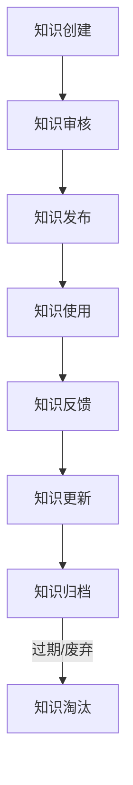

# 知识共享与协作机制

## 概述

### 目的
建立系统化的知识共享和协作机制，确保测试环境相关的知识、经验和最佳实践能够在团队中有效传播和持续积累。

### 核心原则
1. **开放共享**：鼓励知识分享，打破信息孤岛
2. **持续更新**：知识需要持续维护和更新
3. **易于访问**：知识库应该易于查找和使用
4. **质量保证**：建立知识质量审核机制
5. **激励参与**：建立知识贡献激励机制

## 知识共享体系

### 1. 知识分类体系
```
测试环境知识体系
├── 基础架构知识
│   ├── 环境设计原则
│   ├── 部署架构
│   ├── 网络配置
│   └── 存储方案
├── 操作指南
│   ├── 环境创建
│   ├── 日常维护
│   ├── 故障处理
│   └── 性能优化
├── 最佳实践
│   ├── 配置管理
│   ├── 安全实践
│   ├── 成本优化
│   └── 监控告警
├── 案例研究
│   ├── 成功案例
│   ├── 失败教训
│   ├── 技术选型
│   └── 迁移经验
└── 培训材料
    ├── 新人培训
    ├── 技能提升
    ├── 专家分享
    └── 认证体系
```

### 2. 知识生命周期管理


### 3. 知识质量标准
**内容质量标准：**
- ✅ 准确性：信息准确无误
- ✅ 完整性：内容全面完整
- ✅ 时效性：信息及时更新
- ✅ 可读性：易于理解和阅读
- ✅ 实用性：具有实际应用价值

**格式标准：**
- 使用统一的Markdown格式
- 包含必要的元数据（作者、日期、版本）
- 结构清晰，有目录和导航
- 代码示例规范，有注释说明

## 协作机制

### 1. 团队协作流程
**日常协作：**
```
问题发现 → 问题讨论 → 方案设计 → 实施验证 → 文档记录 → 经验分享
    ↓           ↓           ↓           ↓           ↓           ↓
  工单系统   讨论群组   设计评审   代码审查   文档系统   分享会议
```

**知识贡献流程：**
```
个人经验 → 整理提炼 → 提交审核 → 同行评审 → 发布入库 → 获得认可
    ↓           ↓           ↓           ↓           ↓           ↓
 工作记录   知识草稿   质量检查   改进建议   版本管理   积分奖励
```

### 2. 协作工具平台
| 协作类型 | 推荐工具 | 使用场景 | 最佳实践 |
|----------|----------|----------|----------|
| 文档协作 | Confluence, Wiki | 知识库建设，文档编写 | 版本控制，评论功能 |
| 代码协作 | GitLab, GitHub | 配置即代码，脚本开发 | PR评审，代码审查 |
| 即时沟通 | Slack, 企业微信 | 问题讨论，快速响应 | 频道分类，信息归档 |
| 任务管理 | Jira, Trello | 问题跟踪，任务分配 | 工作流，优先级 |
| 视频会议 | Zoom, Teams | 技术分享，设计评审 | 录制回放，会议纪要 |

### 3. 沟通规范
**会议规范：**
- 会议必须有明确议程和目标
- 会前提供相关材料
- 会后有会议纪要和行动项
- 定期会议要有固定节奏

**讨论规范：**
- 技术讨论要有数据支持
- 决策要有依据和记录
- 不同意见要尊重和记录
- 讨论结果要明确和跟进

## 知识库运营机制

### 1. 内容管理
**内容创建流程：**
```yaml
knowledge_creation:
  steps:
    - idea_proposal: 提出知识主题
    - content_drafting: 撰写内容草稿
    - peer_review: 同行评审
    - quality_check: 质量检查
    - publishing: 正式发布
    - promotion: 内容推广
    
  roles:
    author: 内容作者，负责内容创作
    reviewer: 评审专家，负责质量把关
    editor: 编辑人员，负责格式优化
    publisher: 发布人员，负责最终发布
```

**版本管理：**
```bash
# 知识库版本管理示例
knowledge-base/
├── v1.0.0/           # 正式发布版本
├── v1.1.0-rc1/       # 发布候选版本
├── latest/           # 最新版本（软链接）
└── drafts/           # 草稿版本
```

### 2. 质量控制
**审核流程：**
1. **技术准确性审核**：由技术专家审核内容准确性
2. **实用性审核**：由实际用户审核内容实用性
3. **格式规范审核**：由编辑审核格式规范性
4. **安全合规审核**：由安全团队审核合规性

**质量指标：**
- 内容阅读量
- 用户满意度评分
- 问题解决率
- 内容更新频率
- 引用次数

### 3. 更新维护
**定期更新机制：**
- 每周：检查内容时效性
- 每月：更新过时内容
- 每季度：全面内容评审
- 每年：知识体系重构

**更新触发条件：**
- 技术栈更新
- 最佳实践变化
- 用户反馈问题
- 监控指标异常

## 激励机制

### 1. 贡献度评估
**贡献度指标：**
```yaml
contribution_metrics:
  content_creation:
    - articles_created: 文章创建数量
    - articles_updated: 文章更新次数
    - code_examples: 代码示例数量
    
  content_quality:
    - review_score: 评审评分
    - user_rating: 用户评分
    - citation_count: 引用次数
    
  community_engagement:
    - questions_answered: 问题回答数量
    - discussions_participated: 讨论参与度
    - training_delivered: 培训交付次数
```

### 2. 奖励机制
**物质奖励：**
- 月度知识贡献奖
- 季度最佳案例奖
- 年度知识专家奖
- 专项贡献奖励

**非物质奖励：**
- 专业认证和称号
- 技术分享机会
- 职业发展支持
- 团队内部表彰

### 3. 认可体系
**贡献者等级：**
| 等级 | 要求 | 权益 |
|------|------|------|
| 初级贡献者 | 5篇合格文章 | 基础徽章，参与资格 |
| 中级贡献者 | 20篇高质量文章 | 专家徽章，评审资格 |
| 高级贡献者 | 50篇+导师指导 | 大师徽章，培训资格 |
| 核心贡献者 | 体系贡献+社区领导 | 核心团队，决策参与 |

## 培训与推广

### 1. 培训体系
**培训层次：**
```
基础培训 → 专项培训 → 高级培训 → 专家认证
    ↓           ↓           ↓           ↓
 新人入职   技能提升   问题诊断   架构设计
```

**培训形式：**
- 线上课程：视频教程，在线学习
- 线下工作坊：实践操作，小组讨论
- 导师制度：一对一指导，经验传承
- 社区分享：技术沙龙，经验交流

### 2. 推广策略
**内部推广：**
- 每周知识推荐
- 月度技术分享会
- 季度最佳实践评选
- 年度知识峰会

**外部推广：**
- 技术博客文章
- 开源项目贡献
- 技术大会演讲
- 行业标准参与

### 3. 效果评估
**培训效果评估：**
- 培训参与率
- 知识掌握测试
- 实际应用效果
- 满意度调查

**推广效果评估：**
- 知识库访问量
- 用户增长情况
- 内容传播范围
- 品牌影响力

## 技术支持与反馈

### 1. 技术支持渠道
**多级支持体系：**
```
用户自助 → 社区支持 → 专家支持 → 紧急支持
   ↓           ↓           ↓           ↓
知识库搜索  讨论区提问  工单系统  紧急热线
```

**响应时间承诺：**
- 自助支持：即时
- 社区支持：4小时内
- 专家支持：8小时内
- 紧急支持：30分钟内

### 2. 反馈机制
**反馈渠道：**
- 知识库页面反馈
- 定期用户调研
- 社区讨论收集
- 技术支持记录

**反馈处理流程：**
```
反馈收集 → 问题分类 → 优先级评估 → 方案制定 → 实施改进 → 结果反馈
    ↓           ↓           ↓           ↓           ↓           ↓
 多渠道收集   问题分类   影响评估   解决方案   执行改进   用户通知
```

### 3. 持续改进
**改进机制：**
- 月度复盘会议
- 季度效果评估
- 年度战略规划
- 持续优化迭代

**改进重点：**
- 用户体验优化
- 内容质量提升
- 协作效率提高
- 技术创新应用

## 技术实现方案

### 1. 知识库平台选型
**推荐技术栈：**
```yaml
knowledge_platform:
  content_management: 
    - git: 版本控制
    - markdown: 内容格式
    - static_site_generator: 静态站点生成
  
  collaboration_tools:
    - gitlab: 代码协作
    - mattermost: 团队沟通
    - jira: 任务管理
  
  monitoring_analytics:
    - google_analytics: 访问分析
    - prometheus: 系统监控
    - grafana: 数据可视化
```

### 2. 自动化工具链
**内容发布流水线：**
```yaml
pipeline:
  stages:
    - build:
        - clone_repository
        - validate_content
        - generate_static_site
    
    - test:
        - link_check
        - spell_check
        - accessibility_check
    
    - deploy:
        - deploy_to_staging
        - approval_gate
        - deploy_to_production
    
    - notify:
        - send_deployment_notification
        - update_search_index
        - clear_cache
```

### 3. 集成方案
**系统集成：**
- 与CI/CD流水线集成
- 与监控系统集成
- 与工单系统集成
- 与身份认证系统集成

**数据集成：**
- 知识库访问数据
- 用户行为数据
- 内容质量数据
- 协作效率数据

## 成功案例

### 案例1：大型企业知识库建设
**背景：** 某金融企业测试环境管理混乱，知识分散

**解决方案：**
1. 建立统一的知识库平台
2. 制定知识分类标准
3. 实施知识贡献激励
4. 建立质量审核机制

**成果：**
- 问题解决时间减少60%
- 新人培训时间缩短50%
- 知识复用率提升80%
- 团队协作效率提高40%

### 案例2：开源社区知识共享
**背景：** 开源项目文档不全，贡献者入门困难

**解决方案：**
1. 完善入门指南和文档
2. 建立社区问答机制
3. 实施导师计划
4. 定期举办技术分享

**成果：**
- 贡献者增长300%
- 问题响应时间缩短70%
- 项目质量显著提升
- 社区活跃度大幅提高

## 未来规划

### 短期目标（1-3个月）
1. 完善知识库基础功能
2. 建立核心内容体系
3. 实施基础培训计划
4. 建立初步反馈机制

### 中期目标（3-12个月）
1. 实现知识库智能化
2. 建立完整的培训体系
3. 实施高级激励机制
4. 扩展社区影响力

### 长期愿景（1-3年）
1. 成为行业知识标杆
2. 建立知识生态体系
3. 实现知识价值变现
4. 推动行业标准制定

## 总结

有效的知识共享和协作机制是测试环境管理成功的关键。通过建立系统化的知识体系、完善的协作机制、科学的运营管理和持续的技术创新，可以显著提升团队效率、保障环境质量、促进技术创新。

**核心价值：**
- 🚀 **效率提升**：减少重复工作，加速问题解决
- 🛡️ **质量保障**：统一标准，保证环境质量
- 💡 **创新驱动**：知识积累，促进技术创新
- 👥 **团队成长**：经验传承，促进团队成长
- 🌐 **生态建设**：知识共享，建设行业生态

**实施建议：**
1. 从小处着手，逐步完善
2. 重视文化建设，鼓励分享
3. 技术与管理并重
4. 持续改进，与时俱进

---

**文档版本**：1.0  
**创建时间**：2026年5月5日  
**维护团队**：测试环境知识库项目组  
**联系方式**：knowledge-base@company.com  
**更新频率**：每月审核，每季度更新