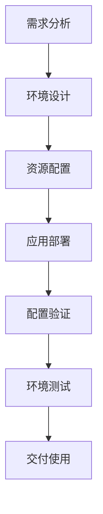

# 测试环境管理培训指南

## 培训概述

### 培训目标
本培训旨在帮助团队成员掌握测试环境管理的核心技能，包括：
- 测试环境的基本概念和重要性
- 环境配置和管理的标准流程
- 常见问题的诊断和解决方法
- 最佳实践和协作规范

### 目标受众
- 开发工程师
- 测试工程师  
- 运维工程师
- 项目经理
- 质量保障专员

### 培训时长
- 基础培训：2小时
- 进阶培训：4小时
- 实战演练：8小时（可选）

## 第一部分：测试环境基础

### 1.1 测试环境的重要性
**为什么需要专门的测试环境？**
- 隔离开发和测试活动
- 确保测试的一致性和可重复性
- 保护生产环境数据安全
- 支持并行开发和测试

### 1.2 测试环境类型
| 环境类型 | 用途 | 特点 | 生命周期 |
|----------|------|------|----------|
| 开发环境 | 日常开发调试 | 配置灵活，变化频繁 | 长期存在 |
| 集成环境 | 模块集成测试 | 相对稳定，定期更新 | 中长期 |
| 测试环境 | 功能测试验证 | 接近生产环境配置 | 中短期 |
| 预生产环境 | 上线前验证 | 与生产环境完全一致 | 短期 |
| 性能环境 | 性能压力测试 | 独立硬件资源 | 按需创建 |

### 1.3 环境管理原则
1. **一致性原则**：各环境配置应保持一致性
2. **隔离性原则**：不同环境应相互隔离
3. **可追溯原则**：环境变更应有完整记录
4. **自动化原则**：尽可能自动化环境管理任务

## 第二部分：环境配置与管理

### 2.1 环境配置标准
```yaml
# 标准环境配置模板
environment:
  name: ${ENV_NAME}
  type: ${ENV_TYPE}  # dev/test/staging/prod
  region: ${REGION}
  version: ${APP_VERSION}
  
  resources:
    cpu: ${CPU_LIMITS}
    memory: ${MEMORY_LIMITS}
    storage: ${STORAGE_SIZE}
    
  services:
    - name: app-service
      replicas: ${REPLICA_COUNT}
      ports: [8080, 8443]
      
    - name: database
      type: ${DB_TYPE}
      version: ${DB_VERSION}
```

### 2.2 环境创建流程


### 2.3 环境检查清单
**环境创建前检查：**
- [ ] 资源配额是否充足
- [ ] 网络配置是否正确
- [ ] 安全策略是否配置
- [ ] 监控告警是否就绪

**环境创建后验证：**
- [ ] 服务是否正常启动
- [ ] 端口是否可访问
- [ ] 配置是否正确加载
- [ ] 依赖服务是否连通

## 第三部分：日常操作指南

### 3.1 环境访问控制
**权限管理矩阵：**
| 角色 | 环境访问 | 配置修改 | 数据操作 | 环境删除 |
|------|----------|----------|----------|----------|
| 开发工程师 | ✅ 开发环境 | ✅ 开发环境 | ✅ 开发环境 | ❌ |
| 测试工程师 | ✅ 所有测试环境 | ❌ | ✅ 测试数据 | ❌ |
| 运维工程师 | ✅ 所有环境 | ✅ 所有环境 | ✅ 所有环境 | ✅ |
| 项目经理 | ✅ 只读访问 | ❌ | ❌ | ❌ |

### 3.2 环境使用规范
**代码提交规范：**
```bash
# 提交信息模板
git commit -m "feat: [环境类型] 功能描述

- 环境变更：简要说明环境相关变更
- 测试验证：测试验证结果
- 影响范围：影响的环境范围"
```

**环境变更流程：**
1. 提交变更申请
2. 同行评审
3. 测试验证
4. 执行变更
5. 结果确认

### 3.3 问题诊断流程
**常见问题诊断步骤：**
1. **现象确认**：明确问题现象和复现步骤
2. **日志分析**：查看应用和系统日志
3. **网络检查**：检查网络连通性和DNS解析
4. **配置验证**：验证环境配置是否正确
5. **资源监控**：检查CPU、内存、磁盘使用情况
6. **依赖检查**：检查依赖服务状态

## 第四部分：工具使用培训

### 4.1 Kubernetes基础操作
**常用命令：**
```bash
# 查看环境状态
kubectl get pods -n ${NAMESPACE}
kubectl get services -n ${NAMESPACE}

# 查看日志
kubectl logs -f ${POD_NAME} -n ${NAMESPACE}

# 进入容器
kubectl exec -it ${POD_NAME} -n ${NAMESPACE} -- /bin/bash

# 环境调试
kubectl describe pod ${POD_NAME} -n ${NAMESPACE}
kubectl get events -n ${NAMESPACE}
```

### 4.2 配置管理工具
**Helm基本操作：**
```bash
# 查看已安装应用
helm list -n ${NAMESPACE}

# 安装应用
helm install ${RELEASE_NAME} ${CHART} -n ${NAMESPACE}

# 更新应用
helm upgrade ${RELEASE_NAME} ${CHART} -n ${NAMESPACE}

# 卸载应用
helm uninstall ${RELEASE_NAME} -n ${NAMESPACE}
```

### 4.3 监控工具使用
**Prometheus查询示例：**
```promql
# CPU使用率
rate(container_cpu_usage_seconds_total{namespace="${NAMESPACE}"}[5m])

# 内存使用率
container_memory_working_set_bytes{namespace="${NAMESPACE}"}

# 请求成功率
rate(http_requests_total{status=~"2..", namespace="${NAMESPACE}"}[5m]) / 
rate(http_requests_total{namespace="${NAMESPACE}"}[5m])
```

## 第五部分：最佳实践

### 5.1 环境配置最佳实践
1. **配置外部化**：将所有配置存储在外部配置中心
2. **配置版本化**：所有配置都应该有版本控制
3. **配置验证**：部署前验证配置的正确性
4. **配置回滚**：支持快速配置回滚

### 5.2 测试数据管理最佳实践
1. **数据工厂模式**：使用数据工厂生成测试数据
2. **数据隔离**：确保测试数据互不干扰
3. **数据清理**：测试后自动清理测试数据
4. **数据版本**：测试数据版本化管理

### 5.3 环境监控最佳实践
1. **健康检查**：实现全面的健康检查机制
2. **性能基线**：建立环境性能基准
3. **异常检测**：自动检测环境异常
4. **智能告警**：分级告警，减少误报

## 第六部分：实战演练

### 6.1 练习一：创建测试环境
**任务要求：**
1. 使用提供的模板创建测试环境
2. 部署示例应用
3. 验证环境功能
4. 提交环境验收报告

**参考步骤：**
```bash
# 1. 创建命名空间
kubectl create namespace test-exercise-${USER}

# 2. 部署应用
kubectl apply -f deployment.yaml -n test-exercise-${USER}

# 3. 验证部署
kubectl get all -n test-exercise-${USER}

# 4. 测试访问
curl http://app-service.test-exercise-${USER}.svc.cluster.local:8080/health
```

### 6.2 练习二：环境故障诊断
**模拟故障场景：**
1. 应用启动失败
2. 服务无法访问
3. 配置加载错误
4. 资源不足告警

**诊断工具：**
- kubectl describe
- kubectl logs
- kubectl exec
- Prometheus查询

### 6.3 练习三：环境配置变更
**变更需求：**
1. 增加应用副本数
2. 修改资源配置
3. 更新应用版本
4. 添加新的环境变量

**变更流程：**
1. 提交变更申请
2. 执行变更操作
3. 验证变更结果
4. 更新环境文档

## 第七部分：考核与认证

### 7.1 知识考核
**选择题（每题2分，共10题）**
1. 测试环境的主要作用是什么？
2. Kubernetes命名空间的用途是什么？
3. 环境配置应该遵循什么原则？
4. 如何查看Pod的详细状态？
5. Helm的主要作用是什么？

**问答题（每题10分，共5题）**
1. 描述测试环境创建的完整流程
2. 如何诊断应用启动失败的问题？
3. 解释环境配置版本化的重要性
4. 描述测试数据管理的最佳实践
5. 如何实现环境的自动化监控？

### 7.2 实操考核
**考核项目：**
1. 独立创建测试环境（30分）
2. 诊断并修复环境故障（40分）
3. 执行环境配置变更（30分）

**评分标准：**
- 操作规范性：30%
- 问题解决能力：40%
- 文档记录完整性：20%
- 时间效率：10%

### 7.3 认证标准
**初级认证（60分以上）：**
- 掌握基本环境操作
- 能够独立使用测试环境
- 了解环境管理规范

**中级认证（80分以上）：**
- 熟练处理常见环境问题
- 能够进行环境配置变更
- 掌握环境监控工具使用

**高级认证（95分以上）：**
- 精通环境架构设计
- 能够优化环境性能
- 具备环境治理能力

## 第八部分：资源与支持

### 8.1 学习资源
**官方文档：**
- [Kubernetes官方文档](https://kubernetes.io/docs/)
- [Docker官方文档](https://docs.docker.com/)
- [Helm官方文档](https://helm.sh/docs/)

**内部资源：**
- 环境管理Wiki
- 最佳实践案例库
- 常见问题解答

**培训视频：**
- 环境管理基础（2小时）
- 故障诊断技巧（3小时）
- 高级配置管理（4小时）

### 8.2 技术支持
**支持渠道：**
- 技术讨论群：测试环境管理群
- 邮件支持：env-support@company.com
- 工单系统：环境管理工单

**响应时间：**
- 紧急问题：30分钟内响应
- 一般问题：2小时内响应
- 咨询问题：24小时内响应

### 8.3 持续改进
**反馈机制：**
- 每月培训反馈收集
- 季度培训效果评估
- 年度培训计划调整

**改进计划：**
- 根据反馈更新培训内容
- 增加实战演练环节
- 引入新技术培训

## 总结

本培训指南提供了全面的测试环境管理知识体系，从基础概念到高级操作，从理论知识到实战演练。通过系统学习和实践，学员将能够掌握测试环境管理的核心技能，为团队的高效协作和产品质量保障提供有力支持。

**培训更新记录：**
- 版本：1.0
- 更新时间：2026年5月5日
- 更新内容：初始版本创建
- 负责人：培训部门

**注意事项：**
1. 培训内容会定期更新，请关注最新版本
2. 实践操作请在指导老师监督下进行
3. 遇到问题请及时寻求帮助，避免误操作
4. 培训资料仅供内部使用，请勿外传