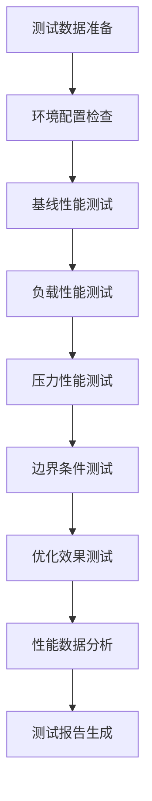

# 批次管理算法性能测试方案
## 版本信息
- **文档版本**: v1.0
- **创建日期**: 2026-05-01
- **项目**: AI-Ready ERP系统
- **模块**: 批次管理模块
- **相关任务**: task_1777574973712_i82y9s9bh

## 1. 测试目标
设计批次管理算法的性能测试方案，评估数据清洗、预处理、关联匹配等关键算法的性能表现，为算法优化和系统调优提供数据支持。

### 1.1 核心目标
1. 评估算法在不同数据规模下的性能表现
2. 识别性能瓶颈和优化机会
3. 建立性能基准和监控指标
4. 验证算法优化效果

## 2. 算法性能分析

### 2.1 批次数据清洗算法性能特征
| 算法类型 | 时间复杂度 | 空间复杂度 | 关键性能指标 |
|---------|-----------|-----------|------------|
| 格式标准化 | O(n) | O(1) | 处理速度、格式转换成功率 |
| 缺失值填充 | O(n)~O(n²) | O(1)~O(n) | 填充准确率、处理时间 |
| 异常值检测 | O(n log n) | O(n) | 检测准确率、召回率 |
| 重复数据识别 | O(n²)~O(n) | O(n) | 去重准确率、处理时间 |
| 数据关联匹配 | O(n log n) | O(n) | 匹配准确率、关联时间 |

### 2.2 关键性能指标（KPIs）
**基础指标（8个核心指标）：**
1. **处理速度**：每秒处理记录数（records/sec）
2. **响应时间**：单个批次处理的平均时间（ms）
3. **内存占用**：峰值内存使用量（MB）
4. **CPU利用率**：处理期间CPU平均占用率（%）
5. **吞吐量**：单位时间内处理数据总量（MB/sec）
6. **准确率**：数据清洗和预处理的准确率（%）
7. **召回率**：异常值检测和重复识别的召回率（%）
8. **资源效率**：单位数据处理的资源消耗（内存/数据量）

**质量指标：**
9. 数据完整性保持率（%）
10. 格式转换成功率（%）
11. 异常值误报率（%）
12. 重复数据漏检率（%）

## 3. 测试场景设计

### 3.1 批量数据处理性能测试
| 测试场景 | 数据规模 | 数据类型 | 测试目标 |
|---------|---------|---------|---------|
| **S1** 小规模测试 | 1万条记录 | 单一批次 | 基础性能基准 |
| **S2** 中等规模 | 10万条记录 | 多批次 | 常规处理能力 |
| **S3** 大规模测试 | 100万条记录 | 混合批次 | 负载处理能力 |
| **S4** 极限规模 | 1000万条记录 | 复杂批次 | 系统极限测试 |

### 3.2 实时数据处理性能测试
| 测试场景 | 并发用户 | 请求频率 | 测试目标 |
|---------|---------|---------|---------|
| **R1** 低并发 | 10个用户 | 10 req/s | 基础并发性能 |
| **R2** 中等并发 | 100个用户 | 100 req/s | 业务负载测试 |
| **R3** 高并发 | 1000个用户 | 1000 req/s | 峰值压力测试 |
| **R4** 突发流量 | 5000个用户 | 5000 req/s | 极限压力测试 |

### 3.3 算法优化对比测试
| 测试场景 | 优化前版本 | 优化后版本 | 比较维度 |
|---------|-----------|-----------|---------|
| **O1** 格式标准化 | 旧算法 | 新算法 | 处理速度、内存占用 |
| **O2** 缺失值填充 | 规则填充 | 智能填充 | 准确率、处理时间 |
| **O3** 异常值检测 | 统计方法 | 机器学习 | 准确率、召回率 |
| **O4** 重复识别 | 基础算法 | 优化算法 | 准确率、处理效率 |

### 3.4 边界条件测试
| 测试场景 | 数据特点 | 测试目标 |
|---------|---------|---------|
| **B1** 异常数据 | 格式错误、值越界 | 异常处理能力 |
| **B2** 空数据 | 空文件、空记录 | 边界处理 |
| **B3** 极端数据 | 极大值、极小值 | 算法稳定性 |
| **B4** 混合编码 | 多字符集、编码 | 编码处理能力 |

## 4. 测试数据准备方案

### 4.1 测试数据集生成
**数据生成策略：**
1. **真实数据模拟**：基于历史批次数据的统计特征生成
2. **随机数据生成**：使用特定分布生成测试数据
3. **边缘数据构造**：专门构造测试边界条件的数据
4. **异常数据注入**：在正常数据中注入异常数据

**数据规模设置：**
- **小规模**：1万条，约10MB
- **中等规模**：10万条，约100MB  
- **大规模**：100万条，约1GB
- **超大规模**：1000万条，约10GB

### 4.2 数据质量验证
| 验证维度 | 验证方法 | 验收标准 |
|---------|---------|---------|
| **完整性** | 记录计数、字段检查 | 记录完整性≥99.9% |
| **一致性** | 数据逻辑检查、关联验证 | 逻辑一致性≥99.5% |
| **准确性** | 抽样验证、规则检查 | 数据准确性≥99.0% |
| **时效性** | 时间戳验证、处理延迟 | 数据新鲜度≥95.0% |

## 5. 测试环境配置

### 5.1 硬件资源要求
| 测试场景 | CPU核心 | 内存 | 存储 | 网络带宽 |
|---------|---------|------|------|---------|
| **开发环境** | 4核心 | 8GB | 50GB | 100Mbps |
| **测试环境** | 8核心 | 16GB | 200GB | 1Gbps |
| **性能环境** | 16核心 | 32GB | 1TB | 10Gbps |
| **生产环境** | 32核心 | 64GB | 5TB | 10Gbps |

### 5.2 软件环境要求
- **操作系统**：Linux Ubuntu 20.04+
- **运行时**：Python 3.8+, Node.js 16+
- **数据库**：PostgreSQL 14+, Redis 7+
- **监控工具**：Prometheus, Grafana
- **性能工具**：JProfiler, Py-Spy, Memory Profiler

## 6. 测试执行计划

### 6.1 性能测试阶段
| 阶段 | 测试内容 | 预计时间 | 验收标准 |
|------|---------|---------|---------|
| **P1** 基线测试 | 各算法基础性能 | 2天 | 建立性能基准 |
| **P2** 负载测试 | 不同数据规模测试 | 3天 | 验证扩展性 |
| **P3** 压力测试 | 并发和极限测试 | 2天 | 验证稳定性 |
| **P4** 优化测试 | 算法优化对比 | 2天 | 验证优化效果 |

### 6.2 测试执行流程

## 7. 性能监控与分析

### 7.1 监控指标采集
| 指标类别 | 采集频率 | 存储方式 | 分析维度 |
|---------|---------|---------|---------|
| **系统资源** | 1秒 | 时间序列 | 趋势、峰值 |
| **算法性能** | 每批次 | 日志记录 | 分布、异常 |
| **业务指标** | 实时 | 数据库 | 聚合、对比 |
| **用户体验** | 实时 | 日志系统 | 响应时间分布 |

### 7.2 性能瓶颈分析
**常见瓶颈类型：**
1. **CPU瓶颈**：算法计算复杂度高，计算资源不足
2. **内存瓶颈**：数据驻留内存过大，频繁GC
3. **IO瓶颈**：磁盘读写频繁，网络延迟高
4. **算法瓶颈**：算法效率低，可优化空间大

**分析方法：**
- Profiling工具分析
- 火焰图定位热点
- 内存泄漏检测
- 调用链分析

## 8. 性能优化验证

### 8.1 优化效果评估标准
| 优化类型 | 量化目标 | 评估方法 |
|---------|---------|---------|
| **性能提升** | 处理速度提升≥30% | 前后对比测试 |
| **资源节约** | 内存占用降低≥20% | 资源监控对比 |
| **质量提升** | 准确率提升≥5% | 质量评估对比 |
| **稳定性** | 失败率降低≥50% | 异常监控对比 |

### 8.2 优化验证流程
1. **制定优化方案**：基于性能分析结果
2. **实施优化改进**：代码重构、算法优化
3. **对比测试执行**：相同环境、相同数据
4. **效果数据分析**：量化评估优化效果
5. **回归验证**：确保功能不受影响

## 9. 测试报告模板

### 9.1 报告结构
1. **执行摘要**：测试概况、关键发现
2. **测试环境**：硬件、软件配置详情
3. **测试结果**：各场景测试数据
4. **性能分析**：瓶颈识别、优化建议
5. **结论建议**：优化优先级、下一步计划

### 9.2 关键图表
- 性能趋势图（处理速度 vs 数据规模）
- 资源使用图（CPU、内存、IO）
- 响应时间分布图
- 优化效果对比图

## 10. 风险评估与应对

### 10.1 风险识别
| 风险类型 | 可能性 | 影响程度 | 应对策略 |
|---------|--------|---------|---------|
| 测试数据不足 | 中 | 中 | 多源数据生成 |
| 环境配置问题 | 高 | 高 | 自动化部署 |
| 性能波动 | 中 | 中 | 多次测试平均 |
| 结果分析困难 | 低 | 中 | 专业工具支持 |

### 10.2 质量保证
1. **测试用例覆盖**：确保所有关键路径覆盖
2. **测试数据验证**：数据质量双重验证
3. **环境一致性**：测试环境标准化
4. **结果可复现**：完整测试记录

## 附录

### A. 性能测试工具列表
1. **JProfiler**：Java应用性能分析
2. **Py-Spy**：Python性能分析
3. **Prometheus**：指标采集监控
4. **Grafana**：数据可视化
5. **Locust**：负载测试
6. **JMeter**：性能测试

### B. 相关文档链接
1. 批次管理功能需求文档
2. 数据清洗算法设计文档
3. 系统架构设计文档
4. 测试环境部署文档

---

**文档审批：**
- **创建人**：前端开发工程师 (mnj006mb)
- **审核人**：主协调员 (main)
- **发布日期**：2026-05-01
- **状态**：草案 ✓ 审核中 □ 已批准 □